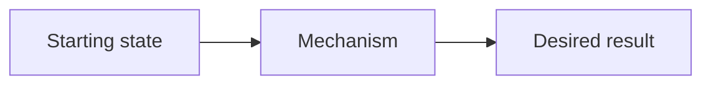

# Skeleton tài liệu linh hoạt

Dùng skeleton này để bắt đầu nhanh. Xóa section không phù hợp, thêm section cần thiết và đổi thứ tự theo mạch của chủ đề. Không dùng skeleton như giới hạn về độ dài hoặc số heading.

````markdown
---
title: "Tên chủ đề cụ thể"
description: "Mô tả người đọc sẽ hiểu hoặc thực hiện được gì"
---

# Tên chủ đề

## Mục lục

- [Tổng quan](#tổng-quan)
- [1. Vấn đề và mental model](#1-vấn-đề-và-mental-model)
- [2. Thành phần và cơ chế](#2-thành-phần-và-cơ-chế)
- [3. Luồng xử lý](#3-luồng-xử-lý)
- [4. Thực hành](#4-thực-hành)
- [5. Xác minh](#5-xác-minh)
- [6. Failure modes và troubleshooting](#6-failure-modes-và-troubleshooting)
- [7. Trade-offs và best practices](#7-trade-offs-và-best-practices)
- [Tài liệu tham khảo](#tài-liệu-tham-khảo)

---

## Tổng quan

Nêu chủ đề là gì, giải quyết vấn đề nào, phạm vi trang và kết quả người đọc đạt được. Đi thẳng vào thông tin cụ thể; không dùng mở đầu chung chung.

> [!IMPORTANT]
> Nêu invariant, giới hạn hoặc điểm dễ hiểu sai nhất nếu cần.

## 1. Vấn đề và mental model

Mô tả starting state, pain point và cách nhìn đơn giản giúp hiểu các phần sau.



Giải thích điểm người đọc cần quan sát trong diagram.

## 2. Thành phần và cơ chế

### 2.1 Thành phần A

Giải thích trách nhiệm, input/output, state và quan hệ với thành phần khác.

### 2.2 Thành phần B

Giải thích behavior và ranh giới trách nhiệm.

## 3. Luồng xử lý

Đi từng bước từ trigger đến kết quả. Nêu nơi state thay đổi, nơi có thể fail và signal dùng để quan sát.

## 4. Thực hành

Nêu mục tiêu và prerequisite của ví dụ.

```yaml
# Manifest minh họa; thay các placeholder được ghi chú.
apiVersion: example.io/v1
kind: Example
metadata:
  name: demo
spec:
  enabled: true
```

Giải thích field quyết định behavior. Không diễn giải lại mọi dòng hiển nhiên.

## 5. Xác minh

```bash
examplectl get example demo
```

Mô tả expected state/output và cách phân biệt kết quả đúng với trạng thái chưa hoàn tất hoặc lỗi.

## 6. Failure modes và troubleshooting

| Triệu chứng | Giả thuyết | Cách kiểm tra | Hướng xử lý |
|---|---|---|---|
| Ví dụ lỗi | Nguyên nhân có khả năng | Command hoặc signal | Fix và verification |

Nếu chẩn đoán có nhiều nhánh, dùng flow theo request path thay vì danh sách command rời rạc.

## 7. Trade-offs và best practices

- Nêu recommendation.
- Giải thích vì sao.
- Nêu điều kiện áp dụng.
- Nêu trade-off hoặc trường hợp không phù hợp.

## Tài liệu tham khảo

- [Official documentation](https://example.com)
- [Tài liệu liên quan trong site](/category/related-topic/)
````

## Cách điều chỉnh

- Với concept page, mở rộng mental model và cơ chế; phần thực hành có thể ngắn.
- Với tutorial, chuyển prerequisite và Steps lên trước; thêm cleanup.
- Với reference, thay flow bằng field/option tables và compatibility notes.
- Với troubleshooting, bắt đầu từ triệu chứng và decision tree.
- Với production guide, thêm SLO, scaling, security, observability, rollout và rollback.

Đọc [`content-patterns.md`](content-patterns.md) để chọn coverage phù hợp.
