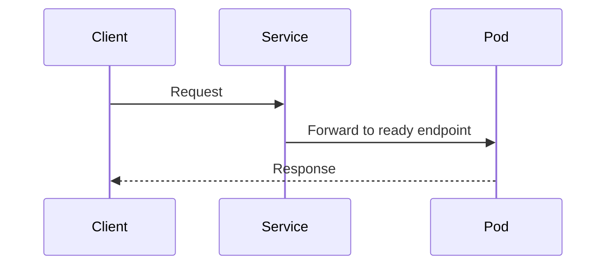

# Fumadocs components trong Markdown/MDX

Chỉ dùng component nếu repository đã đăng ký nó trong MDX renderer, thường tại `src/app/[[...slug]]/page.tsx`. Kiểm tra source trước khi viết; component và props có thể khác theo version.

## Mục lục

- [Nguyên tắc chọn component](#nguyên-tắc-chọn-component)
- [Callout](#callout)
- [Cards](#cards)
- [Steps](#steps)
- [Tabs](#tabs)
- [Accordion](#accordion)
- [TypeTable](#typetable)
- [Mermaid](#mermaid)

## Nguyên tắc chọn component

| Nhu cầu | Component |
|---|---|
| Highlight warning/invariant | `Callout` |
| Điều hướng tới trang liên quan | `Cards` + `Card` |
| Quy trình tuần tự | `Steps` + `Step` |
| Biến thể tương đương theo platform/tool | `Tabs` + `Tab` |
| Nội dung phụ hoặc FAQ | `Accordions` + `Accordion` |
| Mô tả config/type | `TypeTable` |
| Flow, sequence, state, architecture | Mermaid code block |

Không dùng component để trang trông “phong phú”. Dùng khi nó giúp người đọc hiểu cấu trúc hoặc thao tác nhanh hơn.

## Callout

```mdx
<Callout type="warn" title="Kiểm tra context">
  Command tiếp theo thay đổi resource trong cluster hiện tại.
</Callout>
```

Type khả dụng phụ thuộc version/component registration. Repository hiện tại thường dùng `info`, `warn`, `error`, `success`; kiểm tra type signature nếu build lỗi.

Dùng Callout cho thông tin cần được chú ý ngay. Giữ phần giải thích chính trong prose thay vì đặt nhiều paragraph dài vào Callout.

## Cards

```mdx
<Cards>
  <Card href="/networking/service/" title="Service">
    Hiểu cách Service chọn backend và route traffic.
  </Card>
  <Card href="/networking/ingress/" title="Ingress">
    Tiếp tục với HTTP/HTTPS routing từ bên ngoài cluster.
  </Card>
</Cards>
```

Internal `href` phải có trailing slash. Mỗi Card cần title cụ thể và description cho biết người đọc nhận được gì sau khi mở trang.

## Steps

```mdx
<Steps>
  <Step>
    ### Tạo namespace

    ```bash
    kubectl create namespace policy-demo
    ```

    Xác minh namespace ở trạng thái `Active`.
  </Step>

  <Step>
    ### Áp dụng manifest

    ```bash
    kubectl apply -f network-policy.yaml
    ```
  </Step>
</Steps>
```

Mỗi Step nên có một mục tiêu quan sát được. Nêu prerequisite trước Steps; thêm verification trong hoặc ngay sau step tương ứng.

Nếu Markdown lồng trong component gây lỗi compile ở version hiện tại, dùng numbered headings thông thường thay vì cố giữ component.

## Tabs

```mdx
<Tabs items={['kubectl', 'Helm']}>
  <Tab value="kubectl">
    ```bash
    kubectl apply -f manifests/
    ```
  </Tab>
  <Tab value="Helm">
    ```bash
    helm upgrade --install demo ./chart
    ```
  </Tab>
</Tabs>
```

Chỉ dùng Tabs cho các nhánh tương đương. Nếu mỗi nhánh có prerequisite, behavior hoặc trade-off khác đáng kể, dùng subsection để người đọc có thể so sánh toàn bộ nội dung.

Giữ `items` và `value` khớp chính xác. Dùng `groupId`/`persist` chỉ sau khi xác nhận version hỗ trợ.

## Accordion

```mdx
<Accordions type="single">
  <Accordion title="Vì sao policy chưa có hiệu lực?">
    Kiểm tra CNI plugin có hỗ trợ NetworkPolicy và selector có chọn đúng Pod hay không.
  </Accordion>
</Accordions>
```

Không giấu prerequisite, warning hoặc bước bắt buộc trong Accordion. Dùng cho FAQ hoặc chi tiết tùy chọn mà người đọc có thể bỏ qua.

## TypeTable

```mdx
<TypeTable
  type={{
    timeoutSeconds: {
      description: 'Thời gian chờ trước khi probe thất bại',
      type: 'number',
      default: 1,
    },
    failureThreshold: {
      description: 'Số lần thất bại liên tiếp trước khi đổi trạng thái',
      type: 'number',
      default: 3,
    },
  }}
/>
```

Dùng cho tập field có schema ổn định. Với behavior phức tạp, thêm prose giải thích quan hệ giữa các field; TypeTable không thay thế phần mô tả semantics.

Xác minh default và type theo version. Không copy default từ trí nhớ.

## Mermaid

````mdx

````

Chọn diagram type theo câu hỏi:

- `flowchart`: thành phần và hướng dữ liệu.
- `sequenceDiagram`: thứ tự tương tác theo thời gian.
- `stateDiagram-v2`: lifecycle/state transition.
- `graph`: quan hệ topology đơn giản.

Giải thích diagram trong prose và chạy build để kiểm tra remark transform cùng Mermaid syntax.
