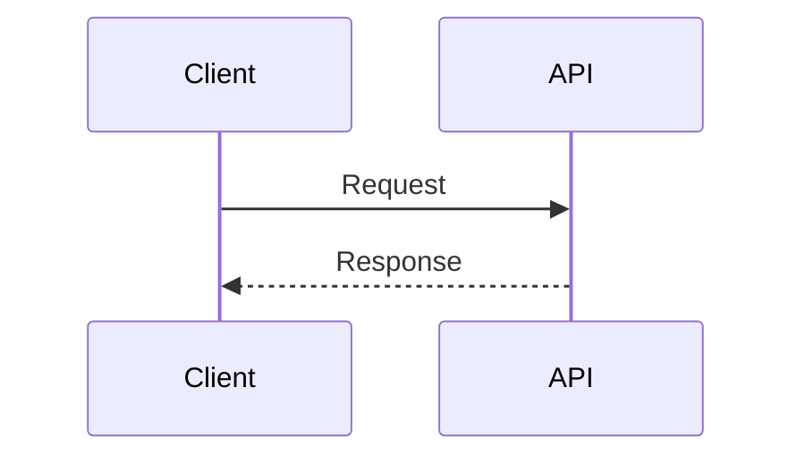

# Markdown/MDX conventions cho Fumadocs

## Mục lục

- [Frontmatter](#frontmatter)
- [Heading và mục lục](#heading-và-mục-lục)
- [Internal link](#internal-link)
- [Code block](#code-block)
- [Table](#table)
- [Admonition](#admonition)
- [JSX/MDX component](#jsxmdx-component)
- [Mermaid](#mermaid)
- [Lỗi thường gặp](#lỗi-thường-gặp)

## Frontmatter

Mỗi trang phải có `title` và `description`:

```yaml
---
title: "NetworkPolicy"
description: "Cách NetworkPolicy kiểm soát traffic giữa Pod, giới hạn của policy model và quy trình troubleshooting"
---
```

Viết `description` cụ thể về phạm vi và giá trị của trang. Không dùng mô tả chung như “Tìm hiểu về NetworkPolicy”.

## Heading và mục lục

Không bỏ cấp heading:

```markdown
## Thành phần
### Policy selector
#### Namespace selector
```

Không chuyển trực tiếp từ H2 sang H4. Chỉ dùng một H1 trong body nếu convention của repository có H1.

Với manual TOC, kiểm tra anchor sau khi đổi heading. Heading có dấu, inline code, ký tự `&` hoặc dấu chấm có thể tạo anchor khác dự đoán. Ưu tiên heading rõ và ổn định; chạy build để phát hiện lỗi MDX.

Giữ dòng trống quanh horizontal rule và block content.

## Internal link

Dùng site route có trailing slash:

```markdown
[Xem Service](/networking/service/)
```

Không dùng đường dẫn source `.md` hoặc route thiếu trailing slash. Hai dạng sai là `./service.md` và `/networking/service`.

Khi đổi slug hoặc tên file, tìm và cập nhật mọi link trỏ tới route cũ.

## Code block

Luôn ghi language:

````markdown
```bash
kubectl get pods
```

```yaml
apiVersion: v1
kind: Pod
```

```text
Output minh họa
```
````

Dùng `text` cho output/plain text. Không gán `bash` cho output chỉ để có màu syntax.

Không đặt code fence cùng loại bên trong code fence. Khi tài liệu cần hiển thị Markdown chứa code fence, dùng fence ngoài có nhiều backtick hơn.

## Table

Giữ dòng trống trước và sau table:

```markdown
Đoạn dẫn giải thích cách đọc bảng.

| Signal | Ý nghĩa |
|---|---|
| `Ready=True` | Pod có thể nhận traffic |

Đoạn phân tích hệ quả.
```

Không nhồi paragraph, nhiều code line hoặc quy trình dài vào cell. Chuyển nội dung đó thành subsection hoặc list.

## Admonition

Repository hỗ trợ GitHub-style admonition qua remark transform:

```markdown
> [!IMPORTANT]
> NetworkPolicy chỉ có hiệu lực khi CNI plugin hỗ trợ enforcement.
```

Giữ mỗi dòng trong cùng block có prefix `>` và không chèn dòng trống không có prefix.

Các type thường dùng: `NOTE`, `IMPORTANT`, `TIP`, `WARNING`, `CAUTION`. Kiểm tra transform của repository trước khi dùng type khác.

Không lạm dụng callout. Chỉ highlight warning, invariant, prerequisite hoặc insight mà người đọc dễ bỏ sót.

## JSX/MDX component

Giữ dòng trống trước và sau component:

```mdx
Đoạn dẫn.

<Callout type="warn" title="Cảnh báo">
  Kiểm tra context trước khi chạy command.
</Callout>

Đoạn tiếp theo.
```

Dùng nháy đôi cho string prop và `{}` cho JavaScript expression. Chỉ dùng component đã được đăng ký trong MDX renderer.

Nội dung bên trong component phải tuân theo syntax mà component/version hiện tại hỗ trợ. Chạy build thay vì giả định Markdown lồng nhau luôn parse đúng.

## Mermaid

Không indent code fence:

````markdown

````

Mỗi node ID nên ngắn và ổn định; đặt label mô tả trong `[]`. Tránh ký tự đặc biệt phức tạp trong label nếu parser báo lỗi.

Diagram phải có đoạn dẫn và phần giải thích. Nếu diagram quá rộng, chia theo phase/layer thay vì giảm font đến mức khó đọc.

## Lỗi thường gặp

| Triệu chứng | Nguyên nhân thường gặp | Cách xử lý |
|---|---|---|
| Trang thiếu title | Thiếu frontmatter hoặc YAML lỗi | Kiểm tra delimiter và `title`/`description` |
| Link redirect/404 | Dùng source path hoặc thiếu `/` cuối | Đổi sang site route có trailing slash |
| Code không highlight | Fence thiếu language | Thêm `bash`, `yaml`, `json`, `text`,... |
| JSX không compile | Props/syntax sai hoặc component chưa đăng ký | Kiểm tra renderer và build error |
| Mermaid không render | Fence bị indent hoặc syntax sai | Bỏ indent, kiểm tra diagram riêng |
| TOC sai hierarchy | Bỏ cấp heading hoặc anchor thủ công sai | Sắp lại H2 → H3 → H4 và cập nhật TOC |
| Table vỡ | Thiếu dòng trống hoặc cell quá phức tạp | Tách block và đơn giản hóa table |
