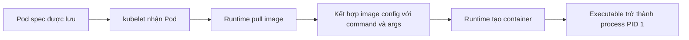

# Commands và Arguments

## Mục lục

- [Tổng quan](#tổng-quan)
- [1. Từ container image đến process PID 1](#1-từ-container-image-đến-process-pid-1)
- [2. Quy tắc kết hợp command và args](#2-quy-tắc-kết-hợp-command-và-args)
- [3. Exec form và shell form](#3-exec-form-và-shell-form)
- [4. Truyền environment variable vào command](#4-truyền-environment-variable-vào-command)
- [5. Command trong Pod nhiều container](#5-command-trong-pod-nhiều-container)
- [6. Tính bất biến và rollout](#6-tính-bất-biến-và-rollout)
- [7. Các pattern thường dùng](#7-các-pattern-thường-dùng)
- [8. Signal, PID 1 và graceful shutdown](#8-signal-pid-1-và-graceful-shutdown)
- [9. Thực hành end-to-end](#9-thực-hành-end-to-end)
- [10. Troubleshooting](#10-troubleshooting)
- [11. Best practices](#11-best-practices)
- [Tài liệu tham khảo](#tài-liệu-tham-khảo)

---

## Tổng quan

Mỗi container cuối cùng đều cần một **executable** và danh sách **arguments** để tạo process đầu tiên. Container image thường đã khai báo mặc định bằng `ENTRYPOINT` và `CMD`. Kubernetes cho phép Pod ghi đè hai phần này qua `command` và `args` mà không phải build lại image.

```text
Container image                  Pod spec                    Process thực tế
ENTRYPOINT ["/app/server"]  +   command: không khai báo  →  /app/server
CMD ["--port=8080"]             args: ["--port=9090"]      --port=9090
```

Khả năng override hữu ích khi:

- Một image có nhiều mode như `api`, `worker`, `migrate`.
- Cần thay flag theo môi trường.
- Muốn chạy command chẩn đoán tạm thời.
- Init container cần chạy script chuẩn bị trước application container.

> [!IMPORTANT]
> Trong Kubernetes, `command` gần tương ứng với Docker `ENTRYPOINT`; `args` gần tương ứng với Docker `CMD`. Tên field dễ gây nhầm vì `command` không phải chuỗi shell command mặc định.

---

## 1. Từ container image đến process PID 1

Luồng khởi chạy rút gọn:



Image metadata có hai thành phần:

- `ENTRYPOINT`: executable chính, ví dụ `/usr/local/bin/api`.
- `CMD`: arguments mặc định hoặc command mặc định nếu image không có `ENTRYPOINT`.

Ví dụ Dockerfile:

```dockerfile
FROM alpine:3.20
COPY app /usr/local/bin/app
ENTRYPOINT ["/usr/local/bin/app"]
CMD ["serve", "--port=8080"]
```

Không override trong Pod sẽ chạy:

```text
/usr/local/bin/app serve --port=8080
```

Pod chỉ đổi arguments:

```yaml
containers:
  - name: app
    image: example.com/app:1.0
    args: ["worker", "--concurrency=4"]
```

Process thực tế:

```text
/usr/local/bin/app worker --concurrency=4
```

Pod đổi cả hai:

```yaml
containers:
  - name: debug
    image: example.com/app:1.0
    command: ["/bin/sh"]
    args: ["-c", "id; ls -la /usr/local/bin; sleep 3600"]
```

## 2. Quy tắc kết hợp command và args

Bảng sau là mental model cần nhớ:

| Pod `command` | Pod `args` | Executable | Arguments |
|---|---|---|---|
| Không có | Không có | Image `ENTRYPOINT` | Image `CMD` |
| Có | Không có | Pod `command` | Image `CMD` theo semantics của runtime/image |
| Không có | Có | Image `ENTRYPOINT` | Pod `args` |
| Có | Có | Pod `command` | Pod `args` |

Trong thực tế, nếu chủ động đổi executable, nên khai báo cả `command` và `args` để manifest tự mô tả và không vô tình phụ thuộc `CMD` của image.

### 2.1 Mảng không phải một chuỗi

Cách rõ ràng:

```yaml
command: ["/usr/local/bin/app"]
args: ["serve", "--port=8080", "--log-level=info"]
```

Tương đương dạng YAML list:

```yaml
command:
  - /usr/local/bin/app
args:
  - serve
  - --port=8080
  - --log-level=info
```

Mỗi phần tử là một argument riêng. Chuỗi sau **không** tự được tách bởi shell:

```yaml
# Sai nếu executable kỳ vọng ba arguments
args: ["serve --port=8080 --log-level=info"]
```

Application sẽ nhận một argument duy nhất chứa khoảng trắng.

## 3. Exec form và shell form

Kubernetes thực thi mảng command trực tiếp; không tự chèn `/bin/sh -c`.

### 3.1 Exec trực tiếp — lựa chọn mặc định

```yaml
command: ["/app/server"]
args: ["--config=/etc/app/config.yaml"]
```

Ưu điểm:

- Không cần shell tồn tại trong image.
- Không có parsing hoặc quoting ngoài ý muốn.
- Process ứng dụng thường là PID 1 và nhận signal trực tiếp.
- Giảm bề mặt tấn công so với shell script động.

Các toán tử shell không hoạt động khi exec trực tiếp:

```yaml
# Runtime tìm executable có tên gần như "echo hello && sleep 30"
command: ["echo hello && sleep 30"]
```

### 3.2 Chỉ dùng shell khi cần semantics của shell

Pipeline, redirect, glob, vòng lặp hoặc nhiều command cần shell:

```yaml
command: ["/bin/sh", "-c"]
args:
  - |
    set -eu
    echo "starting migration"
    /app/migrate --config /etc/app/config.yaml
    exec /app/server --port 8080
```

`exec` ở dòng cuối thay shell bằng application process, giúp application nhận `SIGTERM` trực tiếp.

> [!WARNING]
> Distroless hoặc scratch image thường không chứa `/bin/sh`. Đừng mặc định mọi image đều có shell; kiểm tra Dockerfile/image trước khi dùng shell form.

### 3.3 Quoting xảy ra ở đâu?

Với exec trực tiếp, YAML parser tạo từng chuỗi rồi runtime truyền nguyên chuỗi vào `argv`. Với `/bin/sh -c`, shell tiếp tục parse nội dung của argument script. Vì vậy các lớp quoting có thể gồm YAML → shell → application. Giảm số lớp parsing sẽ giảm lỗi và injection risk.

## 4. Truyền environment variable vào command

Kubernetes hỗ trợ mở rộng biến trong `command` và `args` bằng cú pháp `$(VAR_NAME)`:

```yaml
env:
  - name: LOG_LEVEL
    value: info
command: ["/app/server"]
args: ["--log-level=$(LOG_LEVEL)"]
```

Đây là expansion do Kubernetes/runtime chuẩn bị, không phải cú pháp shell `$VAR`.

| Cú pháp | Exec trực tiếp | Trong shell `sh -c` |
|---|---:|---:|
| `$(LOG_LEVEL)` | Kubernetes có thể mở rộng | Có thể bị Kubernetes mở rộng trước |
| `$LOG_LEVEL` | Truyền nguyên văn | Shell mở rộng |
| `$$(LOG_LEVEL)` | Escape thành literal `$(LOG_LEVEL)` | Shell có thể hiểu là command substitution |

Biến phải được định nghĩa trước và tên phải khớp. Nếu không resolve được, giá trị có thể còn nguyên dưới dạng `$(VAR_NAME)`, khiến application nhận flag sai thay vì Pod bị từ chối.

Ví dụ kết hợp ConfigMap:

```yaml
env:
  - name: WORKER_COUNT
    valueFrom:
      configMapKeyRef:
        name: app-runtime
        key: worker-count
command: ["/app/worker"]
args: ["--workers=$(WORKER_COUNT)"]
```

Xem chi tiết cách thiết lập biến tại [Environment Variables](/cau-hinh/environment-variables/).

## 5. Command trong Pod nhiều container

Mỗi container, init container và sidecar có command riêng:

```yaml
spec:
  initContainers:
    - name: migrate
      image: example.com/app:1.0
      command: ["/app/migrate"]
      args: ["--database=$(DATABASE_URL)"]
  containers:
    - name: api
      image: example.com/app:1.0
      command: ["/app/server"]
      args: ["--port=8080"]
    - name: metrics
      image: example.com/exporter:1.0
      args: ["--listen=:9090"]
```

Không có command cấp Pod dùng chung. Cùng một image có thể chạy các vai trò khác nhau, nhưng hãy cân nhắc:

- Lifecycle của các vai trò có tương thích không?
- Scale API và worker có cần độc lập không?
- Một lỗi command có kéo theo restart toàn Pod không?
- Resource và security context có khác nhau không?

Nếu hai process cần scale hoặc deploy độc lập, dùng hai workload thay vì nhét vào một Pod.

## 6. Tính bất biến và rollout

Không thể sửa `command` hoặc `args` trực tiếp trên Pod đã tạo. Với Deployment, bạn sửa Pod template:

```bash
kubectl patch deployment api -n production --type=strategic -p \
  '{"spec":{"template":{"spec":{"containers":[{"name":"api","args":["serve","--port=9090"]}]}}}}'
```

Thay đổi `spec.template` tạo revision và rollout Pods mới. Trong GitOps, sửa source manifest rồi để reconciler triển khai; command imperative chỉ phù hợp với lab hoặc incident có quy trình đồng bộ ngược về Git.

Kiểm tra command đã lưu:

```bash
kubectl get pod POD_NAME -n NAMESPACE \
  -o jsonpath='{.spec.containers[0].command}{"\n"}{.spec.containers[0].args}{"\n"}'
```

## 7. Các pattern thường dùng

### 7.1 Một image, nhiều role

```yaml
# API
command: ["/app/service"]
args: ["api", "--listen=:8080"]

# Worker
command: ["/app/service"]
args: ["worker", "--queue=emails"]
```

Tốt khi code và dependency giống nhau, nhưng mỗi role vẫn nên nằm trong Deployment riêng để scale và rollout độc lập.

### 7.2 Chạy script có trong image

```yaml
command: ["/app/bin/start-server"]
args: ["--config=/etc/app/config.yaml"]
```

Ưu tiên script được version-control và đóng gói trong image hơn script dài nhúng trong YAML.

### 7.3 Chạy script từ ConfigMap

Có thể mount ConfigMap với `defaultMode` rồi chạy:

```yaml
volumes:
  - name: scripts
    configMap:
      name: maintenance-scripts
      defaultMode: 0555
containers:
  - name: task
    image: alpine:3.20
    command: ["/scripts/run.sh"]
    volumeMounts:
      - name: scripts
        mountPath: /scripts
        readOnly: true
```

Pattern này linh hoạt nhưng có trade-off về audit, immutability và supply-chain. Production nên version hóa ConfigMap theo release, dùng read-only mount và hạn chế ai được sửa.

### 7.4 Giữ container sống để debug

```yaml
command: ["sleep"]
args: ["infinity"]
```

Chỉ dùng cho debug/lab. Với production, ưu tiên ephemeral containers để không thay desired state của workload.

## 8. Signal, PID 1 và graceful shutdown

Khi Pod terminate, runtime gửi signal đến process chính của container. Nếu command là shell wrapper không `exec`, application con có thể không nhận `SIGTERM` đúng lúc:

```text
PID 1: /bin/sh -c /app/server
└── PID 7: /app/server
```

Tốt hơn:

```yaml
command: ["/bin/sh", "-c"]
args:
  - exec /app/server --port 8080
```

Hoặc tốt nhất là exec trực tiếp:

```yaml
command: ["/app/server"]
args: ["--port=8080"]
```

Application cần:

1. Bắt `SIGTERM`.
2. Ngừng nhận request mới.
3. Hoàn thành request đang xử lý.
4. Flush buffer và đóng connection.
5. Exit trước `terminationGracePeriodSeconds`.

Command đúng không thay thế graceful shutdown trong code. Xem thêm [Vòng đời Pod](/workloads/pod-lifecycle/).

## 9. Thực hành end-to-end

Tạo namespace và Pod:

```bash
kubectl create namespace command-lab
cat <<'EOF' > command-demo.yaml
apiVersion: v1
kind: Pod
metadata:
  name: command-demo
  namespace: command-lab
spec:
  restartPolicy: Never
  containers:
    - name: demo
      image: busybox:1.36
      env:
        - name: MESSAGE
          value: "xin chao Kubernetes"
      command: ["/bin/sh", "-c"]
      args:
        - |
          echo "argv and environment demo"
          echo "MESSAGE=$MESSAGE"
          printf 'arg-1=%s\n' "$1"
          printf 'arg-2=%s\n' "$2"
        - demo
        - alpha
        - beta
EOF
kubectl apply -f command-demo.yaml
kubectl wait --for=jsonpath='{.status.phase}'=Succeeded \
  pod/command-demo -n command-lab --timeout=60s || true
kubectl logs command-demo -n command-lab
```

Inspect spec và trạng thái:

```bash
kubectl get pod command-demo -n command-lab -o yaml
kubectl get pod command-demo -n command-lab \
  -o jsonpath='{.status.containerStatuses[0].state.terminated}{"\n"}'
```

Thử lỗi executable:

```bash
kubectl run missing-command -n command-lab \
  --image=busybox:1.36 --restart=Never \
  --command -- /path/does-not-exist
kubectl describe pod missing-command -n command-lab
```

Cleanup:

```bash
kubectl delete namespace command-lab
rm -f command-demo.yaml
```

## 10. Troubleshooting

### 10.1 `exec: ... no such file or directory`

Kiểm tra:

- Path executable có tồn tại trong image không.
- Image architecture đúng với Node không.
- Script có shebang hợp lệ không, ví dụ `#!/bin/sh`.
- Interpreter trong shebang có tồn tại không.
- File dùng line ending CRLF có làm shebang thành `/bin/sh\r` không.
- ConfigMap-mounted script có executable mode không.

```bash
kubectl describe pod POD_NAME -n NAMESPACE
kubectl get events -n NAMESPACE --sort-by=.metadata.creationTimestamp
```

### 10.2 Container hoàn thành ngay rồi `CrashLoopBackOff`

Deployment dùng `restartPolicy: Always`. Nếu command chạy xong và exit `0`, kubelet vẫn restart container. Đảm bảo command chính là long-running process; one-off task nên dùng Job.

### 10.3 Flag không được nhận

Đọc command/args thực tế trong Pod, sau đó kiểm tra log startup của application. Lỗi phổ biến là gộp nhiều arguments vào một phần tử hoặc dùng `$VAR` mà không có shell.

### 10.4 Signal không đến application

Kiểm tra process tree bằng công cụ có sẵn trong image:

```bash
kubectl exec POD_NAME -n NAMESPACE -- ps -o pid,ppid,args
```

Nếu shell là PID 1 và application là process con, dùng `exec` hoặc sửa entrypoint.

### 10.5 Pod không tạo sau khi sửa command

Thay đổi template có thể bị admission policy từ chối, image mới không có executable, hoặc rollout bị kẹt do Pod mới crash. Quan sát cả Deployment, ReplicaSet, Pod và Events:

```bash
kubectl rollout status deployment/APP -n NAMESPACE --timeout=2m
kubectl describe deployment APP -n NAMESPACE
kubectl get pods -n NAMESPACE
kubectl get events -n NAMESPACE --sort-by=.metadata.creationTimestamp
```

## 11. Best practices

- Thiết kế image có `ENTRYPOINT` ổn định và `CMD` là defaults hợp lý.
- Dùng exec form; chỉ thêm shell khi thật sự cần shell semantics.
- Mỗi argument là một phần tử YAML riêng.
- Dùng path tuyệt đối cho executable production.
- Đặt script phức tạp trong image và kiểm thử cùng release.
- Không truyền Secret trực tiếp trong arguments vì command line có thể xuất hiện trong process listing, log và audit trail.
- Dùng `exec` ở cuối shell wrapper để forward signal.
- Không dùng `sleep infinity` như cách vận hành bình thường.
- Thay đổi command qua workload template/source of truth, rồi theo dõi rollout.
- Log mode, version và config path khi process start, nhưng không log credential.

Tiếp tục với [Environment Variables](/cau-hinh/environment-variables/) để inject cấu hình dạng key-value vào command và application.

---

## Tài liệu tham khảo

- [Define a Command and Arguments for a Container](https://kubernetes.io/docs/tasks/inject-data-application/define-command-argument-container/)
- [Container API reference](https://kubernetes.io/docs/reference/generated/kubernetes-api/v1.36/#container-v1-core)
- [Container Lifecycle Hooks](https://kubernetes.io/docs/concepts/containers/container-lifecycle-hooks/)
