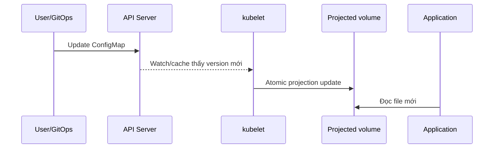

# ConfigMap

## Mục lục

- [Tổng quan](#tổng-quan)
- [1. Data model và giới hạn](#1-data-model-và-giới-hạn)
- [2. Tạo ConfigMap](#2-tạo-configmap)
- [3. Bốn cách consume ConfigMap](#3-bốn-cách-consume-configmap)
- [4. Mount ConfigMap thành file](#4-mount-configmap-thành-file)
- [5. Update được truyền đến Pod như thế nào?](#5-update-được-truyền-đến-pod-như-thế-nào)
- [6. Immutable ConfigMap và versioning](#6-immutable-configmap-và-versioning)
- [7. Thiết kế cấu hình production](#7-thiết-kế-cấu-hình-production)
- [8. ConfigMap trong Deployment](#8-configmap-trong-deployment)
- [9. Thực hành update và rollout](#9-thực-hành-update-và-rollout)
- [10. Troubleshooting](#10-troubleshooting)
- [11. Best practices](#11-best-practices)
- [Tài liệu tham khảo](#tài-liệu-tham-khảo)

---

## Tổng quan

ConfigMap là namespaced API object lưu dữ liệu **không nhạy cảm** dưới dạng key-value. Mục tiêu là tách configuration theo môi trường khỏi container image:

```text
Một image bất biến
├── dev        → ConfigMap app-config-dev
├── staging    → ConfigMap app-config-staging
└── production → ConfigMap app-config-production
```

Pod có thể consume ConfigMap qua:

- Environment variable.
- `command`/`args` thông qua environment variable.
- File trong read-only volume.
- Kubernetes API trực tiếp từ application/controller.

> [!WARNING]
> ConfigMap không mã hóa và không có secrecy semantics. Password, token, private key phải dùng Secret hoặc external secret system.

## 1. Data model và giới hạn

ConfigMap không có `spec`; dữ liệu nằm ở `data` và `binaryData`:

```yaml
apiVersion: v1
kind: ConfigMap
metadata:
  name: api-config
  namespace: production
data:
  log-level: info
  feature-checkout-v2: "true"
  application.yaml: |
    server:
      port: 8080
    cache:
      ttlSeconds: 60
binaryData:
  logo.bin: AAEC
```

- `data`: giá trị UTF-8 string.
- `binaryData`: giá trị binary được base64 encode.
- Một key không được xuất hiện ở cả hai field.
- Key chỉ dùng chữ/số, `-`, `_`, `.`.
- Kích thước một ConfigMap tối đa 1 MiB.
- ConfigMap và Pod tham chiếu theo ba cơ chế phổ biến phải cùng Namespace.

1 MiB là giới hạn bảo vệ API server, etcd và kubelet; ConfigMap không phải artifact store. File lớn nên nằm trong image, object storage, volume hoặc config service phù hợp.

### 1.1 Key-value và file-like key

Kubernetes không phân biệt scalar với file:

```yaml
data:
  WORKER_COUNT: "4"
  nginx.conf: |
    events {}
    http {
      server { listen 8080; }
    }
```

Cách Pod consume quyết định `WORKER_COUNT` thành env hay `nginx.conf` thành file.

## 2. Tạo ConfigMap

### 2.1 Declarative manifest

```bash
kubectl apply --dry-run=server -f configmap.yaml
kubectl diff -f configmap.yaml || true
kubectl apply -f configmap.yaml
```

Đây là cách phù hợp với GitOps vì review và tái tạo được.

### 2.2 Từ literal

```bash
kubectl create configmap api-config -n config-lab \
  --from-literal=log-level=info \
  --from-literal=worker-count=4 \
  --dry-run=client -o yaml > configmap.yaml
```

### 2.3 Từ file

```bash
kubectl create configmap nginx-config -n config-lab \
  --from-file=nginx.conf=./nginx.conf \
  --dry-run=client -o yaml > nginx-config.yaml
```

Nếu bỏ `nginx.conf=`, basename của file trở thành key.

### 2.4 Từ directory hoặc env file

```bash
kubectl create configmap app-files -n config-lab \
  --from-file=./config-dir/ \
  --dry-run=client -o yaml

kubectl create configmap app-env -n config-lab \
  --from-env-file=.env.non-secret \
  --dry-run=client -o yaml
```

Review output trước khi apply để tránh đưa nhầm credential hoặc file ẩn vào ConfigMap.

## 3. Bốn cách consume ConfigMap

### 3.1 Chọn một key làm environment variable

```yaml
env:
  - name: LOG_LEVEL
    valueFrom:
      configMapKeyRef:
        name: api-config
        key: log-level
```

Contract rõ, nhưng update cần container restart.

### 3.2 Import tất cả key

```yaml
envFrom:
  - prefix: APP_
    configMapRef:
      name: api-env
```

Chỉ key hợp lệ cho environment mới có thể được inject đúng. File-like key có dấu `.` thường không phù hợp để import làm env.

### 3.3 Mount thành files

```yaml
volumes:
  - name: config
    configMap:
      name: api-config
containers:
  - name: api
    image: example.com/api:1.0
    volumeMounts:
      - name: config
        mountPath: /etc/app/config
        readOnly: true
```

Mỗi key trở thành filename dưới `/etc/app/config`.

### 3.4 Đọc qua Kubernetes API

Application có thể dùng client library để `get`, `list`, `watch` ConfigMap. Cách này hỗ trợ custom reload logic và đọc cross-namespace nếu RBAC cho phép, nhưng làm application phụ thuộc Kubernetes API, cần ServiceAccount/RBAC và xử lý watch reconnect.

Chỉ chọn cách này nếu projected volume không đáp ứng. Không cấp quyền `list/watch configmaps` toàn cluster cho application thông thường.

## 4. Mount ConfigMap thành file

### 4.1 Chọn key và đổi path

```yaml
volumes:
  - name: config
    configMap:
      name: api-config
      items:
        - key: application.yaml
          path: application.yaml
        - key: log-level
          path: flags/log-level
```

Khi có `items`, chỉ key được liệt kê được project. Nếu key bắt buộc bị thiếu, volume setup thất bại và container không start.

### 4.2 File mode

```yaml
volumes:
  - name: scripts
    configMap:
      name: maintenance-scripts
      defaultMode: 0555
```

Có thể override từng item:

```yaml
items:
  - key: run.sh
    path: run.sh
    mode: 0550
```

ConfigMap volume nên read-only. File mode không biến nội dung chưa tin cậy thành an toàn; ai sửa ConfigMap script có thể thay code được thực thi.

### 4.3 `optional`

```yaml
configMap:
  name: optional-overrides
  optional: true
```

Chỉ dùng khi application có default hợp lệ. Nếu config là bắt buộc, giữ mặc định `optional: false` để fail fast.

### 4.4 Tránh ghi đè cả directory có sẵn

Mount volume vào `/etc/app` che nội dung vốn có của directory trong image. Mount vào directory riêng như `/etc/app/config` hoặc dùng `items`. `subPath` mount một file có thể tránh che directory nhưng có nhược điểm không nhận update tự động.

## 5. Update được truyền đến Pod như thế nào?

### 5.1 Environment và arguments

Không cập nhật trong container đang chạy:

```text
ConfigMap đổi → Pod spec không đổi → process environment không đổi
```

Cần restart/rollout.

### 5.2 Projected volume

Kubelet theo dõi ConfigMap được mount và cập nhật file theo **eventual consistency**:



Độ trễ phụ thuộc kubelet sync period và change-detection strategy (`Watch` mặc định, cache TTL hoặc polling). Không thiết kế với giả định update tức thời.

Kubernetes thường cập nhật projection bằng cơ chế thay symlink/atomic directory. Application phải mở lại file hoặc watch directory phù hợp; process giữ file descriptor cũ có thể tiếp tục đọc nội dung cũ.

### 5.3 `subPath` không nhận update

```yaml
volumeMounts:
  - name: config
    mountPath: /etc/app/application.yaml
    subPath: application.yaml
```

Container dùng ConfigMap qua `subPath` không nhận automated update. Nếu cần hot reload, mount cả directory rồi trỏ application tới file bên trong.

### 5.4 Readiness khi reload

Reload config có thể thất bại. Application nên:

1. Parse file mới vào cấu trúc tạm.
2. Validate toàn bộ.
3. Chỉ swap configuration nếu hợp lệ.
4. Giữ config cũ hoặc chuyển NotReady theo policy.
5. Emit metric/event/log không chứa secret.

Không nên đọc file từng phần trong lúc update rồi rơi vào trạng thái half-configured.

## 6. Immutable ConfigMap và versioning

```yaml
apiVersion: v1
kind: ConfigMap
metadata:
  name: api-config-v2026-03-01
immutable: true
data:
  log-level: info
```

Lợi ích:

- Ngăn accidental mutation.
- Giảm watch load trên API server ở cluster rất lớn.
- Release dễ audit: tên config gắn với version/hash.

Một khi `immutable: true`, không thể đổi lại thành mutable hoặc sửa `data`/`binaryData`; phải tạo object mới. Sau đó cập nhật Pod template để rollout:

```yaml
volumes:
  - name: config
    configMap:
      name: api-config-v2026-03-02
```

Xóa ConfigMap cũ chỉ sau khi không còn Pod tham chiếu.

### 6.1 Hash-based naming

Kustomize `configMapGenerator` có thể tạo suffix hash. Khi nội dung đổi, tên đổi; reference trong generated workload đổi, kích hoạt rollout. Đây là model nhất quán hơn mutate-in-place nếu application không hỗ trợ hot reload.

## 7. Thiết kế cấu hình production

### 7.1 Chia theo ownership và lifecycle

Không tốt:

```text
ConfigMap global-config chứa config của 20 services
```

Tốt hơn:

```text
api-runtime-config       → team API sở hữu
api-feature-flags        → release process sở hữu
platform-ca-bundle       → platform team sở hữu
```

Chia quá nhỏ cũng làm tăng object/watch/manifest. Ranh giới hợp lý là các key thường thay đổi và rollout cùng nhau.

### 7.2 Cấu hình không phải feature management system

ConfigMap phù hợp với config tần suất thấp. Feature flag thay đổi liên tục, cần targeting/audit/percentage rollout nên dùng feature management system chuyên dụng.

### 7.3 Validate trước rollout

Pipeline nên:

- Validate YAML/JSON/TOML schema.
- Chạy application config-check command.
- `kubectl diff` và server-side dry-run.
- Rollout canary hoặc giới hạn blast radius.
- Theo dõi readiness, error rate và config reload metric.

### 7.4 Tránh config drift

Không dùng `kubectl edit configmap` production nếu Git là source of truth. Nếu incident buộc hotfix, ghi change, commit lại source và xác minh reconciler không revert bất ngờ.

## 8. ConfigMap trong Deployment

```yaml
apiVersion: v1
kind: ConfigMap
metadata:
  name: web-config-v1
  namespace: config-lab
immutable: true
data:
  nginx.conf: |
    events {}
    http {
      server {
        listen 8080;
        location /healthz { return 200 "ok\n"; }
        location / { return 200 "config-v1\n"; }
      }
    }
---
apiVersion: apps/v1
kind: Deployment
metadata:
  name: web
  namespace: config-lab
spec:
  replicas: 2
  selector:
    matchLabels:
      app: web
  template:
    metadata:
      labels:
        app: web
      annotations:
        config.example.com/version: v1
    spec:
      containers:
        - name: nginx
          image: nginx:1.27-alpine
          ports:
            - name: http
              containerPort: 8080
          volumeMounts:
            - name: config
              mountPath: /etc/nginx/nginx.conf
              subPath: nginx.conf
              readOnly: true
          readinessProbe:
            httpGet:
              path: /healthz
              port: http
      volumes:
        - name: config
          configMap:
            name: web-config-v1
```

Vì dùng `subPath`, chọn immutable + versioned ConfigMap và rollout Pod thay vì hot update.

## 9. Thực hành update và rollout

```bash
kubectl create namespace configmap-lab
kubectl create configmap demo-config -n configmap-lab \
  --from-literal=message=v1
cat <<'EOF' > configmap-pod.yaml
apiVersion: v1
kind: Pod
metadata:
  name: config-reader
  namespace: configmap-lab
spec:
  containers:
    - name: reader
      image: busybox:1.36
      command: ["/bin/sh", "-c"]
      args: ['while true; do printf "env=%s file=%s\n" "$MESSAGE" "$(cat /config/message)"; sleep 5; done']
      env:
        - name: MESSAGE
          valueFrom:
            configMapKeyRef:
              name: demo-config
              key: message
      volumeMounts:
        - name: config
          mountPath: /config
          readOnly: true
  volumes:
    - name: config
      configMap:
        name: demo-config
EOF
kubectl apply -f configmap-pod.yaml
kubectl logs config-reader -n configmap-lab --follow
```

Ở terminal khác:

```bash
kubectl patch configmap demo-config -n configmap-lab --type=merge \
  -p '{"data":{"message":"v2"}}'
```

Sau độ trễ projection, log sẽ cho thấy `env=v1` nhưng `file=v2`. Điều này chứng minh hai update semantics khác nhau.

Kiểm tra mount:

```bash
kubectl exec config-reader -n configmap-lab -- \
  sh -c 'ls -la /config; cat /config/message'
```

Cleanup:

```bash
kubectl delete namespace configmap-lab
rm -f configmap-pod.yaml
```

## 10. Troubleshooting

### 10.1 `configmap not found`

```bash
kubectl get configmap -n NAMESPACE
kubectl describe pod POD_NAME -n NAMESPACE
```

Kiểm tra spelling và Namespace. Pod không thể mount ConfigMap khác Namespace qua normal volume reference.

### 10.2 Key bị thiếu

Nếu `items`, `configMapKeyRef` bắt buộc hoặc key reference không tồn tại, container có thể không start. Đọc Events. Chỉ đặt `optional: true` khi có fallback thật.

### 10.3 File không cập nhật

Kiểm tra:

- Có dùng `subPath` không.
- ConfigMap đang sửa có đúng tên/Namespace không.
- File descriptor có được application mở lại không.
- ConfigMap có immutable không.
- Kubelet/Node có vấn đề sync không.

### 10.4 Environment không cập nhật

Đây không phải lỗi. Rollout Pod mới và xác nhận template reference/checksum đổi.

### 10.5 ConfigMap sửa được nhưng application lỗi

Kubernetes không hiểu schema application. Validate nội dung, xem application log và rollback config version. Readiness nên ngăn traffic đến instance reload thất bại.

### 10.6 Mount che file trong image

Inspect `mountPath`. Mount directory sẽ che toàn bộ directory cũ. Đổi sang directory riêng hoặc rebuild image/layout.

## 11. Best practices

- Chỉ lưu dữ liệu không nhạy cảm, tối đa nhỏ hơn nhiều so với giới hạn 1 MiB.
- Chọn env cho scalar không reload; chọn volume cho file và reload có kiểm soát.
- Mount read-only và tránh `subPath` nếu cần update động.
- Version hóa hoặc hash ConfigMap khi release cần bất biến.
- Gắn config version vào Pod annotation/log/metric để truy vết.
- Chia ConfigMap theo ownership và lifecycle thay đổi.
- Validate schema trước apply và theo dõi rollout sau apply.
- Không cho application quyền đọc mọi ConfigMap nếu projection đủ dùng.
- Không sửa live object ngoài source of truth mà không có quy trình reconcile.
- Xóa ConfigMap cũ sau khi chắc chắn không còn workload tham chiếu.

Tiếp tục với [Secret](/cau-hinh/secret/) để quản lý dữ liệu nhạy cảm và threat model tương ứng.

---

## Tài liệu tham khảo

- [ConfigMaps](https://kubernetes.io/docs/concepts/configuration/configmap/)
- [Configure a Pod to Use a ConfigMap](https://kubernetes.io/docs/tasks/configure-pod-container/configure-pod-configmap/)
- [Immutable ConfigMaps](https://kubernetes.io/docs/concepts/configuration/configmap/#immutable-configmaps)
