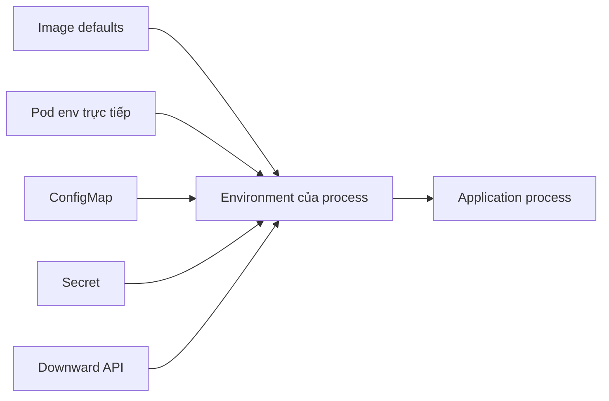

# Environment Variables

## Mục lục

- [Tổng quan](#tổng-quan)
- [1. Environment được tạo khi nào?](#1-environment-được-tạo-khi-nào)
- [2. Khai báo giá trị trực tiếp với env](#2-khai-báo-giá-trị-trực-tiếp-với-env)
- [3. Lấy một key bằng valueFrom](#3-lấy-một-key-bằng-valuefrom)
- [4. Import hàng loạt bằng envFrom](#4-import-hàng-loạt-bằng-envfrom)
- [5. Precedence và mở rộng biến](#5-precedence-và-mở-rộng-biến)
- [6. Update semantics](#6-update-semantics)
- [7. Environment variable hay file?](#7-environment-variable-hay-file)
- [8. Thiết kế configuration contract](#8-thiết-kế-configuration-contract)
- [9. Manifest hoàn chỉnh](#9-manifest-hoàn-chỉnh)
- [10. Thực hành](#10-thực-hành)
- [11. Troubleshooting](#11-troubleshooting)
- [12. Best practices](#12-best-practices)
- [Tài liệu tham khảo](#tài-liệu-tham-khảo)

---

## Tổng quan

Environment variable là giao diện cấu hình phổ biến giữa container image và môi trường chạy. Image giữ code bất biến; Pod cung cấp endpoint, feature flag, log level hoặc credential tại thời điểm tạo container.



Kubernetes cung cấp hai field chính:

- `env`: khai báo từng biến, giá trị trực tiếp hoặc lấy từ nguồn khác.
- `envFrom`: import toàn bộ key-value từ ConfigMap hoặc Secret, có thể thêm prefix.

> [!IMPORTANT]
> Environment được chụp tại lúc container start. Sửa ConfigMap hoặc Secret phía sau **không cập nhật** environment của process đang chạy; phải restart/rollout Pod.

## 1. Environment được tạo khi nào?

Luồng khởi động:

1. API server lưu Pod spec.
2. Scheduler chọn Node.
3. kubelet lấy ConfigMap/Secret bắt buộc mà Pod tham chiếu.
4. kubelet/runtime kết hợp environment từ image, `envFrom`, `env` và biến do platform cung cấp.
5. Runtime tạo process với environment hoàn chỉnh.
6. Process đọc environment khi startup hoặc bất kỳ lúc nào, nhưng giá trị trong process không tự đổi.

Environment thuộc **từng container**, không thuộc cả Pod:

```yaml
containers:
  - name: api
    image: example.com/api:1.0
    env:
      - name: MODE
        value: api
  - name: worker
    image: example.com/api:1.0
    env:
      - name: MODE
        value: worker
```

Hai container chia sẻ network và volumes của Pod nhưng không tự chia sẻ environment.

## 2. Khai báo giá trị trực tiếp với env

```yaml
env:
  - name: APP_ENV
    value: production
  - name: LOG_LEVEL
    value: info
  - name: HTTP_PORT
    value: "8080"
  - name: FEATURE_CHECKOUT_V2
    value: "false"
```

YAML có kiểu boolean và number, nhưng `EnvVar.value` là string. Nên quote các giá trị dễ bị YAML diễn giải:

```yaml
# Rõ nghĩa
value: "false"
value: "8080"
value: "0123"
```

Biến khai báo bằng `env` ghi đè biến cùng tên từ image.

### 2.1 Không nhúng giá trị theo môi trường vào image

Không tốt:

```dockerfile
ENV DATABASE_HOST=prod-db.internal
```

Tốt hơn:

```dockerfile
ENV HTTP_PORT=8080
ENV LOG_LEVEL=info
```

Image chỉ giữ default không nhạy cảm và dùng được ở nhiều môi trường. Endpoint production đi qua Pod configuration.

## 3. Lấy một key bằng valueFrom

### 3.1 Từ ConfigMap

```yaml
env:
  - name: DATABASE_HOST
    valueFrom:
      configMapKeyRef:
        name: app-config
        key: database-host
```

### 3.2 Từ Secret

```yaml
env:
  - name: DATABASE_PASSWORD
    valueFrom:
      secretKeyRef:
        name: app-credentials
        key: database-password
```

### 3.3 Từ thông tin Pod

```yaml
env:
  - name: POD_NAME
    valueFrom:
      fieldRef:
        fieldPath: metadata.name
  - name: POD_IP
    valueFrom:
      fieldRef:
        fieldPath: status.podIP
```

### 3.4 Từ resource request/limit

```yaml
env:
  - name: CPU_LIMIT_MILLICORES
    valueFrom:
      resourceFieldRef:
        containerName: api
        resource: limits.cpu
        divisor: 1m
```

Chọn từng key giúp:

- Contract rõ: application phụ thuộc chính xác biến nào.
- Đổi tên biến độc lập với key nguồn.
- Tránh vô tình expose toàn bộ Secret.
- Review thay đổi dễ hơn.

## 4. Import hàng loạt bằng envFrom

```yaml
envFrom:
  - configMapRef:
      name: app-config
  - secretRef:
      name: app-credentials
```

Mọi key hợp lệ trở thành tên biến. Ví dụ ConfigMap có `LOG_LEVEL: info` thì process nhận `LOG_LEVEL=info`.

### 4.1 Prefix để tránh collision

```yaml
envFrom:
  - prefix: APP_
    configMapRef:
      name: runtime-defaults
```

Key `LOG_LEVEL` trở thành `APP_LOG_LEVEL`.

### 4.2 Trade-off của envFrom

| Tiêu chí | `env` + `valueFrom` | `envFrom` |
|---|---|---|
| Contract | Tường minh | Ẩn sau toàn bộ object |
| Đổi tên biến | Có | Phụ thuộc key |
| Least privilege trong container | Tốt hơn | Dễ expose key không cần |
| Manifest | Dài hơn | Ngắn |
| Collision | Dễ kiểm soát | Cần prefix/precedence |

Dùng `envFrom` tốt cho một bộ config được quản lý như một contract. Với Secret chứa nhiều credential, ưu tiên chọn từng key.

## 5. Precedence và mở rộng biến

### 5.1 Precedence

Mental model thực dụng:

1. `env` khai báo trực tiếp trong Pod có precedence cao nhất cho cùng tên.
2. Khi nhiều nguồn `envFrom` định nghĩa cùng tên, nguồn xuất hiện sau có thể thắng.
3. `env`/`envFrom` ghi đè environment cùng tên trong image.

Không nên dựa vào collision để thiết kế config. Prefix hoặc loại bỏ key trùng để manifest dễ audit.

### 5.2 Biến tham chiếu biến trước đó

```yaml
env:
  - name: PROTOCOL
    value: https
  - name: HOST
    value: api.example.internal
  - name: BASE_URL
    value: "$(PROTOCOL)://$(HOST)"
```

Thứ tự quan trọng: biến được tham chiếu phải xuất hiện trước trong cùng context. Tránh vòng lặp.

### 5.3 Dùng trong command và args

```yaml
env:
  - name: PORT
    value: "8080"
command: ["/app/server"]
args: ["--port=$(PORT)"]
```

Không có shell thì `$PORT` không tự mở rộng. Xem [Commands và Arguments](/cau-hinh/commands-arguments/).

## 6. Update semantics

Giả sử Pod dùng:

```yaml
env:
  - name: LOG_LEVEL
    valueFrom:
      configMapKeyRef:
        name: app-config
        key: log-level
```

Sau khi `app-config` đổi `info` thành `debug`:

```text
ConfigMap trong API: debug
Environment trong container cũ: info
Container mới/restarted: debug
```

Kubernetes không mutate environment của process đang chạy. Các cách rollout có kiểm soát:

- Đổi tên ConfigMap theo content hash/version và cập nhật Pod template.
- Thêm checksum annotation vào Pod template bằng Helm/Kustomize pipeline.
- Dùng reloader controller đã được quản trị.
- Chạy `kubectl rollout restart` rồi đồng bộ change record.

```bash
kubectl rollout restart deployment/api -n production
kubectl rollout status deployment/api -n production --timeout=5m
```

Restart container trong cùng Pod cũng đọc lại environment, nhưng không nên dựa vào crash như cơ chế reload config.

## 7. Environment variable hay file?

| Nhu cầu | Environment | Mounted file |
|---|---|---|
| Giá trị ngắn, scalar | Phù hợp | Phù hợp |
| Config nhiều dòng/có cấu trúc | Khó đọc | Tốt hơn |
| Reload không thay Pod | Không | Có thể, theo eventual consistency |
| Ứng dụng legacy đọc file | Không thuận tiện | Tốt |
| Chọn từng credential | Tốt | Tốt |
| Nguy cơ xuất hiện trong process dump/debug | Cao hơn | Có thể hạn chế bằng permission |

File projection không đồng nghĩa application tự reload. Application phải watch file đúng cách hoặc nhận signal/reload endpoint. ConfigMap/Secret volume cũng cập nhật theo eventual consistency, không tức thời.

> [!WARNING]
> Không dùng environment cho secret nếu runtime, crash dump, debug endpoint hoặc thư viện có thể log toàn bộ environment. Mounted file với permission chặt hoặc external secret provider thường giảm exposure, dù không loại bỏ hoàn toàn rủi ro.

## 8. Thiết kế configuration contract

Một contract tốt cần định nghĩa:

| Thuộc tính | Ví dụ |
|---|---|
| Tên | `HTTP_PORT` |
| Kiểu logic | integer |
| Bắt buộc | có |
| Default | `8080` |
| Phạm vi | mỗi process |
| Nhạy cảm | không |
| Có thể reload | không |
| Validation | `1..65535` |

Application nên fail fast với message không chứa secret:

```text
configuration error: HTTP_PORT must be an integer between 1 and 65535
```

Không nên âm thầm fallback khi một biến bắt buộc bị sai; Pod có thể trông `Running` nhưng phục vụ sai endpoint.

### 8.1 Phân nhóm nguồn

```text
ConfigMap app-runtime
├── LOG_LEVEL
├── FEATURE_CHECKOUT_V2
└── DATABASE_HOST

Secret app-credentials
├── DATABASE_USERNAME
└── DATABASE_PASSWORD

Downward API
├── POD_NAME
└── POD_NAMESPACE
```

Không đặt dữ liệu nhạy cảm vào ConfigMap. Không đặt mọi config của nhiều ứng dụng vào một object khổng lồ.

## 9. Manifest hoàn chỉnh

```yaml
apiVersion: apps/v1
kind: Deployment
metadata:
  name: api
  namespace: config-lab
spec:
  replicas: 2
  selector:
    matchLabels:
      app: api
  template:
    metadata:
      labels:
        app: api
    spec:
      containers:
        - name: api
          image: example.com/api:1.4.2
          envFrom:
            - prefix: APP_
              configMapRef:
                name: api-defaults
          env:
            - name: DATABASE_HOST
              valueFrom:
                configMapKeyRef:
                  name: api-endpoints
                  key: database-host
            - name: DATABASE_PASSWORD
              valueFrom:
                secretKeyRef:
                  name: api-credentials
                  key: database-password
            - name: POD_NAME
              valueFrom:
                fieldRef:
                  fieldPath: metadata.name
            - name: HTTP_PORT
              value: "8080"
          command: ["/app/api"]
          args: ["--listen=:$(HTTP_PORT)"]
          resources:
            requests:
              cpu: 100m
              memory: 128Mi
            limits:
              memory: 256Mi
```

Giá trị trực tiếp cuối cùng có thể dùng để override có chủ đích; tuy nhiên nên tránh định nghĩa cùng tên ở nhiều nguồn.

## 10. Thực hành

```bash
kubectl create namespace env-lab
kubectl create configmap app-config -n env-lab \
  --from-literal=LOG_LEVEL=info \
  --from-literal=GREETING='xin chao'
kubectl create secret generic app-secret -n env-lab \
  --from-literal=TOKEN='lab-only-token'
```

Tạo Pod:

```bash
cat <<'EOF' > env-demo.yaml
apiVersion: v1
kind: Pod
metadata:
  name: env-demo
  namespace: env-lab
spec:
  restartPolicy: Never
  containers:
    - name: demo
      image: busybox:1.36
      envFrom:
        - configMapRef:
            name: app-config
      env:
        - name: TOKEN
          valueFrom:
            secretKeyRef:
              name: app-secret
              key: TOKEN
        - name: POD_NAME
          valueFrom:
            fieldRef:
              fieldPath: metadata.name
        - name: MESSAGE
          value: "$(GREETING) tu $(POD_NAME)"
      command: ["/bin/sh", "-c"]
      args: ['printf "LOG_LEVEL=%s\nMESSAGE=%s\nTOKEN_LENGTH=%s\n" "$LOG_LEVEL" "$MESSAGE" "${#TOKEN}"']
EOF
kubectl apply -f env-demo.yaml
kubectl logs env-demo -n env-lab
```

Không in giá trị Secret; lab chỉ in độ dài. Sửa ConfigMap và chứng minh Pod cũ không đổi bằng cách tạo Pod mới sau update:

```bash
kubectl patch configmap app-config -n env-lab --type=merge \
  -p '{"data":{"LOG_LEVEL":"debug","GREETING":"xin chao"}}'
kubectl delete pod env-demo -n env-lab
kubectl apply -f env-demo.yaml
kubectl logs env-demo -n env-lab
```

Cleanup:

```bash
kubectl delete namespace env-lab
rm -f env-demo.yaml
```

## 11. Troubleshooting

### 11.1 Pod kẹt `CreateContainerConfigError`

```bash
kubectl describe pod POD_NAME -n NAMESPACE
kubectl get events -n NAMESPACE --sort-by=.metadata.creationTimestamp
```

Tìm ConfigMap/Secret không tồn tại hoặc thiếu key bắt buộc. Object phải ở cùng Namespace với Pod.

### 11.2 Biến không xuất hiện khi dùng envFrom

Kiểm tra key có hợp lệ làm environment name không và có collision/prefix không:

```bash
kubectl get configmap app-config -n NAMESPACE -o yaml
kubectl exec POD_NAME -n NAMESPACE -- printenv
```

Không in `printenv` trên production nếu environment chứa Secret.

### 11.3 Đã sửa ConfigMap nhưng application vẫn dùng giá trị cũ

Đây là behavior đúng của environment. Xác nhận Pod creation time và rollout revision, sau đó restart có kiểm soát.

### 11.4 Expansion còn nguyên `$(VAR)`

Kiểm tra thứ tự trong `env`, spelling và nguồn. Với shell script, phân biệt Kubernetes `$(VAR)` với shell `$VAR`.

### 11.5 Application crash vì kiểu dữ liệu

Kubernetes chỉ truyền string; application phải parse và validate. Kiểm tra log startup nhưng không log credential.

## 12. Best practices

- Xem environment là public contract của image và document rõ kiểu/default/validation.
- Chọn `env.valueFrom` cho dependency quan trọng; chỉ dùng `envFrom` khi toàn object cùng scope.
- Dùng prefix để tránh collision.
- Quote number/boolean trong YAML.
- Không lưu Secret trong Git hoặc ConfigMap.
- Không kỳ vọng environment hot-reload.
- Gắn config version/checksum vào Pod template để rollout truy vết được.
- Validate config trước khi application Ready.
- Không dump toàn bộ environment vào log.
- Tách config không nhạy cảm, credential và metadata runtime theo đúng nguồn.

Tiếp tục với [ConfigMap](/cau-hinh/configmap/) để quản lý cấu hình không nhạy cảm như một Kubernetes API object.

---

## Tài liệu tham khảo

- [Define Environment Variables for a Container](https://kubernetes.io/docs/tasks/inject-data-application/define-environment-variable-container/)
- [Dependent Environment Variables](https://kubernetes.io/docs/tasks/inject-data-application/define-interdependent-environment-variables/)
- [EnvVar API reference](https://kubernetes.io/docs/reference/generated/kubernetes-api/v1.36/#envvar-v1-core)
