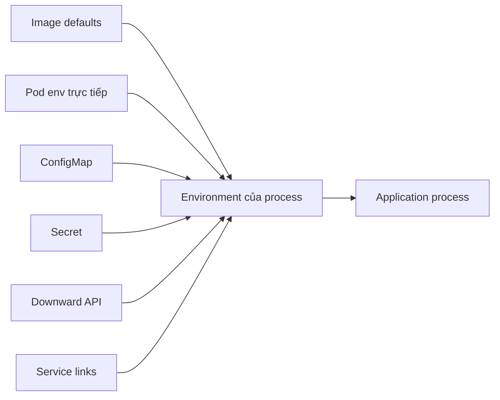

# Environment Variables

## Mục lục

- [Tổng quan](#tổng-quan)
- [1. Environment được tạo khi nào?](#1-environment-được-tạo-khi-nào)
- [2. Khai báo giá trị trực tiếp với env](#2-khai-báo-giá-trị-trực-tiếp-với-env)
- [3. Lấy một key bằng valueFrom](#3-lấy-một-key-bằng-valuefrom)
- [4. Import hàng loạt bằng envFrom](#4-import-hàng-loạt-bằng-envfrom)
- [5. Precedence và mở rộng biến](#5-precedence-và-mở-rộng-biến)
- [6. Service environment variables tự động](#6-service-environment-variables-tự-động)
- [7. Env có cập nhật khi Pod đang chạy không](#7-env-có-cập-nhật-khi-pod-đang-chạy-không)
- [8. Environment variable hay file?](#8-environment-variable-hay-file)
- [9. Thiết kế quy ước cấu hình rõ ràng](#9-thiết-kế-quy-ước-cấu-hình-rõ-ràng)
- [10. Manifest hoàn chỉnh](#10-manifest-hoàn-chỉnh)
- [11. Thực hành](#11-thực-hành)
- [12. Troubleshooting](#12-troubleshooting)
- [13. Best practices](#13-best-practices)
- [Tài liệu tham khảo](#tài-liệu-tham-khảo)

---

## Tổng quan

Environment variable là giao diện cấu hình phổ biến giữa container image và môi trường chạy. Image giữ code bất biến; Pod cung cấp endpoint, feature flag, log level hoặc credential tại thời điểm tạo container.



Kubernetes cung cấp hai field chính trong container spec:

- `env`: khai báo từng biến, giá trị trực tiếp hoặc lấy từ nguồn khác.
- `envFrom`: import toàn bộ key-value từ ConfigMap hoặc Secret, có thể thêm prefix.

Ngoài các biến bạn khai báo, kubelet còn có thể thêm **Service environment variables** để tương thích cơ chế service discovery cũ. DNS vẫn là cách khuyến nghị cho Service discovery, nhưng hiểu nhóm biến tự động này giúp bạn giải thích vì sao trong `printenv` có nhiều biến không xuất hiện trong manifest.

> [!IMPORTANT]
> Environment được chụp tại lúc container start. Sửa ConfigMap hoặc Secret phía sau **không cập nhật** environment của process đang chạy; phải restart/rollout Pod.

## 1. Environment được tạo khi nào?

Luồng khởi động:

1. API server lưu Pod spec.
2. Scheduler chọn Node.
3. kubelet lấy ConfigMap/Secret bắt buộc mà Pod tham chiếu.
4. kubelet/runtime kết hợp environment từ image, `envFrom`, `env` và biến do platform cung cấp.
5. Runtime tạo process với environment hoàn chỉnh.
6. Process đọc environment khi startup hoặc bất kỳ lúc nào, nhưng giá trị trong process không tự đổi.

Environment thuộc **từng container**, không thuộc cả Pod:

```yaml
containers:
  - name: api
    image: example.com/api:1.0
    env:
      - name: MODE
        value: api
  - name: worker
    image: example.com/api:1.0
    env:
      - name: MODE
        value: worker
```

Hai container chia sẻ network và volumes của Pod nhưng không tự chia sẻ environment.

## 2. Khai báo giá trị trực tiếp với env

```yaml
env:
  - name: APP_ENV
    value: production
  - name: LOG_LEVEL
    value: info
  - name: HTTP_PORT
    value: "8080"
  - name: FEATURE_CHECKOUT_V2
    value: "false"
```

YAML có kiểu boolean và number, nhưng `EnvVar.value` là string. Nên quote các giá trị dễ bị YAML diễn giải:

```yaml
# Rõ nghĩa
value: "false"
value: "8080"
value: "0123"
```

Biến khai báo bằng `env` ghi đè biến cùng tên từ image.

### 2.1 Không nhúng giá trị theo môi trường vào image

Không tốt:

```dockerfile
ENV DATABASE_HOST=prod-db.internal
```

Tốt hơn:

```dockerfile
ENV HTTP_PORT=8080
ENV LOG_LEVEL=info
```

Image chỉ giữ default không nhạy cảm và dùng được ở nhiều môi trường. Endpoint production đi qua Pod configuration.

## 3. Lấy một key bằng valueFrom

### 3.1 Từ ConfigMap

```yaml
env:
  - name: DATABASE_HOST
    valueFrom:
      configMapKeyRef:
        name: app-config
        key: database-host
```

### 3.2 Từ Secret

```yaml
env:
  - name: DATABASE_PASSWORD
    valueFrom:
      secretKeyRef:
        name: app-credentials
        key: database-password
```

### 3.3 Từ thông tin Pod

```yaml
env:
  - name: POD_NAME
    valueFrom:
      fieldRef:
        fieldPath: metadata.name
  - name: POD_IP
    valueFrom:
      fieldRef:
        fieldPath: status.podIP
```

### 3.4 Từ resource request/limit

```yaml
env:
  - name: CPU_LIMIT_MILLICORES
    valueFrom:
      resourceFieldRef:
        containerName: api
        resource: limits.cpu
        divisor: 1m
```

Chọn từng key giúp:

- Contract rõ: application phụ thuộc chính xác biến nào.
- Đổi tên biến độc lập với key nguồn.
- Tránh vô tình expose toàn bộ Secret.
- Review thay đổi dễ hơn.

## 4. Import hàng loạt bằng envFrom

```yaml
envFrom:
  - configMapRef:
      name: app-config
  - secretRef:
      name: app-credentials
```

Mọi key hợp lệ trở thành tên biến. Ví dụ ConfigMap có `LOG_LEVEL: info` thì process nhận `LOG_LEVEL=info`.

### 4.1 Prefix để tránh collision

```yaml
envFrom:
  - prefix: APP_
    configMapRef:
      name: runtime-defaults
```

Key `LOG_LEVEL` trở thành `APP_LOG_LEVEL`.

### 4.2 Trade-off của envFrom

| Tiêu chí | `env` + `valueFrom` | `envFrom` |
|---|---|---|
| Contract | Tường minh | Ẩn sau toàn bộ object |
| Đổi tên biến | Có | Phụ thuộc key |
| Least privilege trong container | Tốt hơn | Dễ expose key không cần |
| Manifest | Dài hơn | Ngắn |
| Collision | Dễ kiểm soát | Cần prefix/precedence |

Dùng `envFrom` tốt cho một bộ config được quản lý như một contract. Với Secret chứa nhiều credential, ưu tiên chọn từng key.

## 5. Precedence và mở rộng biến

### 5.1 Precedence

Mental model thực dụng:

1. `env` khai báo trực tiếp trong Pod có precedence cao nhất cho cùng tên.
2. Khi nhiều nguồn `envFrom` định nghĩa cùng tên, nguồn xuất hiện sau có thể thắng.
3. `env`/`envFrom` ghi đè environment cùng tên trong image.

Không nên dựa vào collision để thiết kế config. Prefix hoặc loại bỏ key trùng để manifest dễ audit.

### 5.2 Biến tham chiếu biến trước đó

```yaml
env:
  - name: PROTOCOL
    value: https
  - name: HOST
    value: api.example.internal
  - name: BASE_URL
    value: "$(PROTOCOL)://$(HOST)"
```

Thứ tự quan trọng: biến được tham chiếu phải xuất hiện trước trong cùng context. Tránh vòng lặp.

### 5.3 Dùng trong command và args

```yaml
env:
  - name: PORT
    value: "8080"
command: ["/app/server"]
args: ["--port=$(PORT)"]
```

Không có shell thì `$PORT` không tự mở rộng. Xem [Commands và Arguments](/cau-hinh/commands-arguments/).

## 6. Service environment variables tự động

Khi một container được tạo, kubelet tạo thêm một số biến môi trường mô tả các Service mà container có thể nhìn thấy. Cơ chế này thường được gọi là **Service links** hoặc **Service environment variables**. Nó tồn tại để tương thích với kiểu Docker legacy links và để hỗ trợ ứng dụng cũ không dùng DNS.

Phạm vi mặc định gồm:

- Service có `ClusterIP` trong **cùng Namespace** với Pod, nếu `spec.enableServiceLinks` không bị tắt.
- Service `kubernetes` trong Namespace `default`, dùng để workload trong cluster tìm API server.

Headless Service (`clusterIP: None`) và Service không có ClusterIP không tạo nhóm biến dạng này. Với Service discovery mới, ưu tiên dùng DNS như `api.production.svc.cluster.local` thay vì đọc env.

### 6.1 Điều kiện xuất hiện

Các biến này là snapshot tại lúc container start. Service phải tồn tại và kubelet phải nhìn thấy Service đó trước khi container được tạo. Nếu bạn tạo Service sau khi Pod đã chạy, environment trong container cũ không tự cập nhật.

```text
Service tồn tại trước → Pod/container start → env có biến Service
Pod/container start trước → Service tạo sau → env của container cũ không đổi
```

Cơ chế này cũng có race nhỏ khi kubelet thấy Pod trước khi cache Service đồng bộ. Vì vậy Kubernetes documentation khuyến nghị dùng DNS nếu bạn không muốn phụ thuộc thứ tự tạo resource.

Biến bạn khai báo trong `env` hoặc import từ `envFrom` có thể ghi đè biến Service cùng tên. Kubernetes cũng cho phép `env.value` tham chiếu biến Service bằng cú pháp `$(VAR_NAME)` nếu biến Service đó có mặt tại lúc container start, nhưng cách này càng làm Pod phụ thuộc vào thứ tự tạo Service.

### 6.2 Quy tắc đặt tên biến

Kubelet lấy tên Service và port name, chuyển thành uppercase và đổi dấu `-` thành `_`. Với Service `redis-primary`, prefix sẽ là `REDIS_PRIMARY`.

Nhóm biến chính:

| Biến | Ý nghĩa |
|---|---|
| `<SERVICE>_SERVICE_HOST` | ClusterIP của Service |
| `<SERVICE>_SERVICE_PORT` | `spec.ports[0].port`, tức port đầu tiên của Service |
| `<SERVICE>_SERVICE_PORT_<PORT_NAME>` | Port có `name` tương ứng, chỉ có khi Service port được đặt tên |
| `<SERVICE>_PORT` | URL kiểu legacy link cho port đầu tiên, ví dụ `tcp://10.0.0.11:6379` |
| `<SERVICE>_PORT_<PORT>_<PROTO>` | URL legacy link cho từng port/protocol |
| `<SERVICE>_PORT_<PORT>_<PROTO>_PROTO` | Protocol viết thường, ví dụ `tcp` |
| `<SERVICE>_PORT_<PORT>_<PROTO>_PORT` | Port number |
| `<SERVICE>_PORT_<PORT>_<PROTO>_ADDR` | ClusterIP |

`<PORT_NAME>` ở đây là **tên port nằm sau prefix Service**, không đứng đầu biến. Vì vậy nếu Service `backend-api` có port tên `http`, biến là `BACKEND_API_SERVICE_PORT_HTTP`, không phải `HTTP_SERVICE_PORT`.

### 6.3 Ví dụ một Service một port

Service:

```yaml
apiVersion: v1
kind: Service
metadata:
  name: redis-primary
  namespace: app
spec:
  selector:
    app: redis
  ports:
    - name: redis
      protocol: TCP
      port: 6379
      targetPort: 6379
```

Container được tạo sau Service này có thể thấy:

```bash
REDIS_PRIMARY_SERVICE_HOST=10.0.0.11
REDIS_PRIMARY_SERVICE_PORT=6379
REDIS_PRIMARY_SERVICE_PORT_REDIS=6379
REDIS_PRIMARY_PORT=tcp://10.0.0.11:6379
REDIS_PRIMARY_PORT_6379_TCP=tcp://10.0.0.11:6379
REDIS_PRIMARY_PORT_6379_TCP_PROTO=tcp
REDIS_PRIMARY_PORT_6379_TCP_PORT=6379
REDIS_PRIMARY_PORT_6379_TCP_ADDR=10.0.0.11
```

Giá trị IP là ClusterIP thực tế được cấp trong cluster; output trên là minh họa.

### 6.4 Ví dụ nhiều port

Với Service nhiều port, biến `<SERVICE>_SERVICE_PORT` vẫn trỏ đến **port đầu tiên** trong danh sách `spec.ports`. Các port có `name` sẽ có biến riêng theo tên:

```yaml
apiVersion: v1
kind: Service
metadata:
  name: backend-api
spec:
  ports:
    - name: http
      port: 8080
      protocol: TCP
    - name: metrics
      port: 9090
      protocol: TCP
```

Các biến đáng chú ý:

```bash
BACKEND_API_SERVICE_PORT=8080
BACKEND_API_SERVICE_PORT_HTTP=8080
BACKEND_API_SERVICE_PORT_METRICS=9090
BACKEND_API_PORT_8080_TCP_PORT=8080
BACKEND_API_PORT_9090_TCP_PORT=9090
```

Nếu application phụ thuộc một port cụ thể, không nên đọc `<SERVICE>_SERVICE_PORT` khi Service có nhiều port; dùng DNS kèm port cấu hình rõ ràng hoặc khai báo biến config riêng như `BACKEND_URL`.

### 6.5 Biến `KUBERNETES_*`

Ngay cả trong Namespace không có Service do bạn tạo, Pod thường có các biến cho Service mặc định `kubernetes`:

```bash
KUBERNETES_SERVICE_HOST=10.96.0.1
KUBERNETES_SERVICE_PORT=443
KUBERNETES_SERVICE_PORT_HTTPS=443
KUBERNETES_PORT=tcp://10.96.0.1:443
KUBERNETES_PORT_443_TCP=tcp://10.96.0.1:443
KUBERNETES_PORT_443_TCP_PROTO=tcp
KUBERNETES_PORT_443_TCP_PORT=443
KUBERNETES_PORT_443_TCP_ADDR=10.96.0.1
```

Nhóm này giúp thư viện Kubernetes client cấu hình in-cluster client, nhưng application business thường không cần đọc trực tiếp.

### 6.6 Tắt Service links

Nếu Namespace có nhiều Service, danh sách env tự động có thể rất lớn, gây nhiễu diagnostics và đôi khi vượt giới hạn kích thước environment của process. Bạn có thể tắt Service links cho Pod:

```yaml
apiVersion: v1
kind: Pod
metadata:
  name: app
spec:
  enableServiceLinks: false
  containers:
    - name: app
      image: example.com/app:1.0
```

`enableServiceLinks: false` tắt biến cho các Service thông thường trong cùng Namespace. Service `kubernetes` của control plane vẫn thường được inject để hỗ trợ in-cluster API access.

### 6.7 Kiểm tra thực tế

Trong lab, bạn có thể kiểm tra bằng `printenv`:

```bash
kubectl exec POD_NAME -n NAMESPACE -- printenv | sort | grep -E 'SERVICE_HOST|SERVICE_PORT|_PORT_[0-9]+_TCP'
```

Không chạy lệnh dump toàn bộ environment trên production nếu container có Secret trong env. Khi cần debug, lọc prefix cụ thể:

```bash
kubectl exec POD_NAME -n NAMESPACE -- printenv | grep '^BACKEND_API_'
```

## 7. Env có cập nhật khi Pod đang chạy không

Giả sử Pod dùng:

```yaml
env:
  - name: LOG_LEVEL
    valueFrom:
      configMapKeyRef:
        name: app-config
        key: log-level
```

Sau khi `app-config` đổi `info` thành `debug`:

```text
ConfigMap trong API: debug
Environment trong container cũ: info
Container mới/restarted: debug
```

Kubernetes không mutate environment của process đang chạy. Các cách rollout có kiểm soát:

- Đổi tên ConfigMap theo content hash/version và cập nhật Pod template.
- Thêm checksum annotation vào Pod template bằng Helm/Kustomize pipeline.
- Dùng reloader controller đã được quản trị.
- Chạy `kubectl rollout restart` rồi đồng bộ change record.

```bash
kubectl rollout restart deployment/api -n production
kubectl rollout status deployment/api -n production --timeout=5m
```

Restart container trong cùng Pod cũng đọc lại environment, nhưng không nên dựa vào crash như cơ chế reload config.

## 8. Environment variable hay file?

| Nhu cầu | Environment | Mounted file |
|---|---|---|
| Giá trị ngắn, scalar | Phù hợp | Phù hợp |
| Config nhiều dòng/có cấu trúc | Khó đọc | Tốt hơn |
| Reload không thay Pod | Không | Có thể, theo eventual consistency |
| Ứng dụng legacy đọc file | Không thuận tiện | Tốt |
| Chọn từng credential | Tốt | Tốt |
| Nguy cơ xuất hiện trong process dump/debug | Cao hơn | Có thể hạn chế bằng permission |

File projection không đồng nghĩa application tự reload. Application phải watch file đúng cách hoặc nhận signal/reload endpoint. ConfigMap/Secret volume cũng cập nhật theo eventual consistency, không tức thời.

> [!WARNING]
> Không dùng environment cho secret nếu runtime, crash dump, debug endpoint hoặc thư viện có thể log toàn bộ environment. Mounted file với permission chặt hoặc external secret provider thường giảm exposure, dù không loại bỏ hoàn toàn rủi ro.

## 9. Thiết kế quy ước cấu hình rõ ràng

Một contract tốt cần định nghĩa:

| Thuộc tính | Ví dụ |
|---|---|
| Tên | `HTTP_PORT` |
| Kiểu logic | integer |
| Bắt buộc | có |
| Default | `8080` |
| Phạm vi | mỗi process |
| Nhạy cảm | không |
| Có thể reload | không |
| Validation | `1..65535` |

Application nên fail fast với message không chứa secret:

```text
configuration error: HTTP_PORT must be an integer between 1 and 65535
```

Không nên âm thầm fallback khi một biến bắt buộc bị sai; Pod có thể trông `Running` nhưng phục vụ sai endpoint.

### 9.1 Phân nhóm nguồn

```text
ConfigMap app-runtime
├── LOG_LEVEL
├── FEATURE_CHECKOUT_V2
└── DATABASE_HOST

Secret app-credentials
├── DATABASE_USERNAME
└── DATABASE_PASSWORD

Downward API
├── POD_NAME
└── POD_NAMESPACE
```

Không đặt dữ liệu nhạy cảm vào ConfigMap. Không đặt mọi config của nhiều ứng dụng vào một object khổng lồ.

## 10. Manifest hoàn chỉnh

```yaml
apiVersion: apps/v1
kind: Deployment
metadata:
  name: api
  namespace: config-lab
spec:
  replicas: 2
  selector:
    matchLabels:
      app: api
  template:
    metadata:
      labels:
        app: api
    spec:
      containers:
        - name: api
          image: example.com/api:1.4.2
          envFrom:
            - prefix: APP_
              configMapRef:
                name: api-defaults
          env:
            - name: DATABASE_HOST
              valueFrom:
                configMapKeyRef:
                  name: api-endpoints
                  key: database-host
            - name: DATABASE_PASSWORD
              valueFrom:
                secretKeyRef:
                  name: api-credentials
                  key: database-password
            - name: POD_NAME
              valueFrom:
                fieldRef:
                  fieldPath: metadata.name
            - name: HTTP_PORT
              value: "8080"
          command: ["/app/api"]
          args: ["--listen=:$(HTTP_PORT)"]
          resources:
            requests:
              cpu: 100m
              memory: 128Mi
            limits:
              memory: 256Mi
```

Giá trị trực tiếp cuối cùng có thể dùng để override có chủ đích; tuy nhiên nên tránh định nghĩa cùng tên ở nhiều nguồn.

## 11. Thực hành

```bash
kubectl create namespace env-lab
kubectl create configmap app-config -n env-lab \
  --from-literal=LOG_LEVEL=info \
  --from-literal=GREETING='xin chao'
kubectl create secret generic app-secret -n env-lab \
  --from-literal=TOKEN='lab-only-token'
```

Tạo Pod:

```bash
cat <<'EOF' > env-demo.yaml
apiVersion: v1
kind: Pod
metadata:
  name: env-demo
  namespace: env-lab
spec:
  restartPolicy: Never
  containers:
    - name: demo
      image: busybox:1.36
      envFrom:
        - configMapRef:
            name: app-config
      env:
        - name: TOKEN
          valueFrom:
            secretKeyRef:
              name: app-secret
              key: TOKEN
        - name: POD_NAME
          valueFrom:
            fieldRef:
              fieldPath: metadata.name
        - name: MESSAGE
          value: "$(GREETING) tu $(POD_NAME)"
      command: ["/bin/sh", "-c"]
      args: ['printf "LOG_LEVEL=%s\nMESSAGE=%s\nTOKEN_LENGTH=%s\n" "$LOG_LEVEL" "$MESSAGE" "${#TOKEN}"']
EOF
kubectl apply -f env-demo.yaml
kubectl logs env-demo -n env-lab
```

Không in giá trị Secret; lab chỉ in độ dài. Sửa ConfigMap và chứng minh Pod cũ không đổi bằng cách tạo Pod mới sau update:

```bash
kubectl patch configmap app-config -n env-lab --type=merge \
  -p '{"data":{"LOG_LEVEL":"debug","GREETING":"xin chao"}}'
kubectl delete pod env-demo -n env-lab
kubectl apply -f env-demo.yaml
kubectl logs env-demo -n env-lab
```

Cleanup:

```bash
kubectl delete namespace env-lab
rm -f env-demo.yaml
```

## 12. Troubleshooting

### 12.1 Pod kẹt `CreateContainerConfigError`

```bash
kubectl describe pod POD_NAME -n NAMESPACE
kubectl get events -n NAMESPACE --sort-by=.metadata.creationTimestamp
```

Tìm ConfigMap/Secret không tồn tại hoặc thiếu key bắt buộc. Object phải ở cùng Namespace với Pod.

### 12.2 Biến không xuất hiện khi dùng envFrom

Kiểm tra key có hợp lệ làm environment name không và có collision/prefix không:

```bash
kubectl get configmap app-config -n NAMESPACE -o yaml
kubectl exec POD_NAME -n NAMESPACE -- printenv
```

Không in `printenv` trên production nếu environment chứa Secret.

### 12.3 Đã sửa ConfigMap nhưng application vẫn dùng giá trị cũ

Đây là behavior đúng của environment. Xác nhận Pod creation time và rollout revision, sau đó restart có kiểm soát.

### 12.4 Expansion còn nguyên `$(VAR)`

Kiểm tra thứ tự trong `env`, spelling và nguồn. Với shell script, phân biệt Kubernetes `$(VAR)` với shell `$VAR`.

### 12.5 Application crash vì kiểu dữ liệu

Kubernetes chỉ truyền string; application phải parse và validate. Kiểm tra log startup nhưng không log credential.

## 13. Best practices

- Xem environment là public contract của image và document rõ kiểu/default/validation.
- Chọn `env.valueFrom` cho dependency quan trọng; chỉ dùng `envFrom` khi toàn object cùng scope.
- Dùng prefix để tránh collision.
- Quote number/boolean trong YAML.
- Không lưu Secret trong Git hoặc ConfigMap.
- Không kỳ vọng environment hot-reload.
- Gắn config version/checksum vào Pod template để rollout truy vết được.
- Validate config trước khi application Ready.
- Không dump toàn bộ environment vào log.
- Tách config không nhạy cảm, credential và metadata runtime theo đúng nguồn.

Tiếp tục với [ConfigMap](/cau-hinh/configmap/) để quản lý cấu hình không nhạy cảm như một Kubernetes API object.

---

## Tài liệu tham khảo

- [Define Environment Variables for a Container](https://kubernetes.io/docs/tasks/inject-data-application/define-environment-variable-container/)
- [Dependent Environment Variables](https://kubernetes.io/docs/tasks/inject-data-application/define-interdependent-environment-variables/)
- [Container Environment](https://kubernetes.io/docs/concepts/containers/container-environment/)
- [Service discovery bằng environment variables](https://kubernetes.io/docs/concepts/services-networking/service/#environment-variables)
- [EnvVar API reference](https://kubernetes.io/docs/reference/generated/kubernetes-api/v1.36/#envvar-v1-core)
