# Liveness, Readiness và Startup Probes

## Mục lục

- [Tổng quan](#tổng-quan)
- [1. Ba câu hỏi, ba probe](#1-ba-câu-hỏi-ba-probe)
- [2. Kubelet thực thi probe như thế nào?](#2-kubelet-thực-thi-probe-như-thế-nào)
- [3. Probe handlers](#3-probe-handlers)
- [4. Các tham số thời gian và ngưỡng](#4-các-tham-số-thời-gian-và-ngưỡng)
- [5. Thiết kế endpoint live, ready, startup](#5-thiết-kế-endpoint-live-ready-startup)
- [6. Startup chậm và dependency failure](#6-startup-chậm-và-dependency-failure)
- [7. Probe trong rollout và shutdown](#7-probe-trong-rollout-và-shutdown)
- [8. Manifest production](#8-manifest-production)
- [9. Tuning bằng số liệu](#9-tuning-bằng-số-liệu)
- [10. Thực hành](#10-thực-hành)
- [11. Troubleshooting](#11-troubleshooting)
- [12. Anti-patterns và best practices](#12-anti-patterns-và-best-practices)
- [Tài liệu tham khảo](#tài-liệu-tham-khảo)

---

## Tổng quan

Probe là phép kiểm tra do **kubelet trên Node** thực hiện đối với từng container. Ba probe không phải ba cách viết khác nhau của “health check”; chúng dẫn đến ba hành động khác nhau:

```text
startupProbe thất bại quá ngưỡng  → restart container
readinessProbe thất bại           → Pod NotReady, ngừng nhận traffic phù hợp
livenessProbe thất bại quá ngưỡng → restart container
```



```mermaid
flowchart TD
    C[Container start] --> S{startupProbe pass?}
    S -- Chưa --> S
    S -- Quá ngưỡng --> R[Restart container]
    S -- Có --> L{liveness pass?}
    S -- Có --> D{readiness pass?}
    L -- Không quá ngưỡng --> R
    D -- Không --> N[Pod NotReady]
    D -- Có --> Y[Pod Ready]
```

> [!IMPORTANT]
> Probe chỉ hữu ích khi endpoint/command phản ánh đúng semantics. Một probe trả `200` vô điều kiện tạo false confidence; một probe phụ thuộc quá nhiều hệ thống bên ngoài có thể gây cascading failure.

## 1. Ba câu hỏi, ba probe

### 1.1 Startup: process đã khởi tạo xong chưa?

`startupProbe` bảo vệ application khởi động chậm. Khi được cấu hình, kubelet chưa chạy liveness/readiness cho đến khi startup pass. Nếu startup không bao giờ pass và vượt failure threshold, container bị restart.

Dùng khi application cần restore state, warm cache, migrate local data hoặc JVM startup có variance lớn.

### 1.2 Readiness: instance có nên nhận traffic mới không?

Readiness failure không kill container. Nó đổi condition `Ready=False`; EndpointSlice/Service routing thường loại endpoint khỏi nhóm ready.

Use cases:

- Application đang warm-up.
- Connection pool chưa sẵn sàng.
- Instance đang drain.
- Dependency bắt buộc cho request path đang lỗi tạm thời.
- Queue consumer cần tạm dừng nhận work.

Readiness chạy suốt lifecycle, không chỉ lúc startup.

### 1.3 Liveness: restart có giúp hồi phục không?

Liveness phát hiện trạng thái không thể tự phục hồi như deadlock hoặc event loop kẹt. Failure quá ngưỡng làm kubelet kill và restart container theo `restartPolicy`.

Câu hỏi thiết kế quan trọng:

```text
Nếu check này fail, restart process có khả năng sửa lỗi không?
```

Nếu database bên ngoài down, restart mọi Pod thường không sửa được; nó chỉ tạo restart storm.

## 2. Kubelet thực thi probe như thế nào?

Probe không đi qua Service/Ingress. Kubelet thường kiểm tra trực tiếp Pod IP/container:

```text
kubelet → Pod IP:containerPort → handler
```

Hệ quả:

- Endpoint phải listen trên Pod network interface phù hợp, không chỉ `127.0.0.1` nếu HTTP/TCP/gRPC probe cần Pod IP.
- NetworkPolicy behavior với node-originated traffic phụ thuộc CNI; test trên platform thật.
- HTTP proxy environment của container không điều khiển HTTP probe kubelet.
- Probe success không chứng minh Ingress, Service, DNS hoặc external load balancer hoạt động.

Kết quả probe cập nhật `containerStatuses` và Pod conditions; failure thường xuất hiện trong Events:

```bash
kubectl describe pod POD_NAME -n NAMESPACE
```

## 3. Probe handlers

### 3.1 HTTP GET

```yaml
readinessProbe:
  httpGet:
    path: /ready
    port: http
    scheme: HTTP
    httpHeaders:
      - name: X-Probe
        value: kubelet
```

HTTP status `200..399` được coi là success; status khác là failure. Redirect có caveat, vì vậy health endpoint nên trả trực tiếp `200`, không redirect đến login/HTTPS URL.

HTTPS probe bỏ qua certificate verification; nó kiểm tra endpoint trả response, không xác minh trust/hostname như client thật.

Ưu điểm: kiểm tra application-layer semantics. Nhược điểm: endpoint có thể quá nặng hoặc phụ thuộc middleware/auth.

### 3.2 TCP socket

```yaml
livenessProbe:
  tcpSocket:
    port: 8080
```

Success khi mở được TCP connection. Nó chỉ chứng minh process đang listen, không chứng minh request được xử lý đúng. Phù hợp protocol không có health endpoint, nhưng thường yếu hơn HTTP/gRPC.

### 3.3 gRPC

```yaml
readinessProbe:
  grpc:
    port: 9090
    service: readiness
```

Application phải implement gRPC Health Checking Protocol. Built-in gRPC probe không hỗ trợ named port hoặc authentication/TLS parameters như một full gRPC client; dùng numeric port và endpoint nội bộ phù hợp.

### 3.4 Exec

```yaml
livenessProbe:
  exec:
    command:
      - /app/healthcheck
      - --mode=liveness
```

Exit code `0` là success; non-zero là failure. Exec tạo process trong container mỗi lần probe, có overhead và phụ thuộc executable/library. Không dùng command nặng như query lớn hoặc shell pipeline phức tạp ở period ngắn.

### 3.5 Named port

HTTP/TCP hỗ trợ named port:

```yaml
ports:
  - name: health
    containerPort: 8081
readinessProbe:
  httpGet:
    path: /ready
    port: health
```

Named port giảm drift khi đổi số port. gRPC probe dùng numeric port.

## 4. Các tham số thời gian và ngưỡng

| Field | Ý nghĩa | Default thường gặp |
|---|---|---:|
| `initialDelaySeconds` | Chờ sau container start trước probe đầu | `0` |
| `periodSeconds` | Khoảng giữa các lần probe | `10` |
| `timeoutSeconds` | Timeout mỗi lần | `1` |
| `successThreshold` | Số success liên tiếp để coi thành công | `1` |
| `failureThreshold` | Số failure liên tiếp trước action | `3` |
| `terminationGracePeriodSeconds` | Grace riêng khi liveness/startup kill | Kế thừa Pod nếu không đặt |

Readiness có thể được probe thường xuyên hơn khi NotReady để phục hồi nhanh; đừng coi period là deadline tuyệt đối.

### 4.1 Tính startup budget

Xấp xỉ:

```text
startup budget = failureThreshold × periodSeconds
```

Ví dụ:

```yaml
startupProbe:
  httpGet:
    path: /startup
    port: http
  periodSeconds: 5
  failureThreshold: 60
```

Cho khoảng 300 giây. Chọn theo startup p99 cộng safety margin, không copy số lớn để che lỗi startup vô hạn.

### 4.2 Recovery và detection time

Liveness với `periodSeconds: 10`, `failureThreshold: 3` phát hiện lỗi bền vững khoảng 20–30+ giây tùy timing và timeout. Giảm period tăng tốc phát hiện nhưng tăng load và nguy cơ false positive.

## 5. Thiết kế endpoint live, ready, startup

### 5.1 `/live`

Nên kiểm tra trạng thái nội bộ tối thiểu:

- Main event loop còn tiến triển.
- Critical worker thread không deadlock.
- Internal invariant không thể recovery bị vỡ.

Không nên:

- Query mọi dependency bên ngoài.
- Chạy deep diagnostic nặng.
- Yêu cầu auth bên ngoài.
- Fail vì traffic tạm thời cao.

### 5.2 `/ready`

Phản ánh khả năng nhận **request mới**. Có thể kiểm tra dependency thật sự bắt buộc cho request path, nhưng cần hiểu blast radius.

Ví dụ API có cache fallback khi database chập chờn vẫn có thể Ready. Nếu mọi Pod cùng NotReady khi database down, Service không còn endpoint và có thể biến partial degradation thành outage toàn phần.

### 5.3 `/startup`

Pass khi initialization one-time đã hoàn tất. Sau khi pass một lần, startup probe không chạy lại. Nếu application về trạng thái cần re-initialize sau đó, readiness/liveness phải xử lý.

### 5.4 Endpoint phải rẻ và độc lập

- Không ghi log info cho mỗi probe; sẽ tạo log flood.
- Không mutate business state.
- Không acquire lock lâu.
- Có timeout ngắn nội bộ.
- Trả response nhỏ.
- Expose metric riêng cho failure reason.

## 6. Startup chậm và dependency failure

### 6.1 Đừng dùng liveness delay cực lớn thay startupProbe

`initialDelaySeconds: 300` làm liveness mù trong mọi lần restart 5 phút. `startupProbe` tốt hơn: nó kết thúc ngay khi startup thành công, sau đó liveness nhanh có hiệu lực.

### 6.2 Application phải retry dependency

Init container chờ database mãi hoặc liveness phụ thuộc database đều dễ gây vấn đề. Application cloud-native nên retry với exponential backoff, jitter và deadline; readiness phản ánh khả năng phục vụ.

### 6.3 Probe storm

Hàng nghìn Pods probe cùng period có thể đồng bộ và tạo load. Endpoint phải rẻ; platform có thể cần spread startup/rollout. Không gọi external SaaS từ mỗi probe của mỗi Pod.

## 7. Probe trong rollout và shutdown

Deployment xem Pod available dựa trên readiness và `minReadySeconds`. Probe false positive cho traffic vào quá sớm; false negative làm rollout kẹt và dùng cả old/new capacity.

```text
Pod mới start
→ startup pass
→ readiness pass
→ EndpointSlice ready
→ Deployment tính available
→ Pod cũ được scale down theo strategy
```

Trong shutdown:

1. Pod có `deletionTimestamp`.
2. Endpoint routing được cập nhật.
3. `preStop` và `SIGTERM` bắt đầu trong grace period.
4. Application ngừng nhận traffic, drain và exit.

Readiness endpoint có thể chuyển false khi app bắt đầu drain, nhưng không nên dựa duy nhất vào probe timing để tránh request race. Kết hợp graceful shutdown, termination grace và load balancer behavior.

PDB dùng condition `Ready=True` để tính Pod healthy; readiness sai còn ảnh hưởng node drain. Xem [PodDisruptionBudget](/cau-hinh/pod-disruption-budget/).

## 8. Manifest production

```yaml
containers:
  - name: api
    image: example.com/api:2.3.1
    ports:
      - name: http
        containerPort: 8080
      - name: health
        containerPort: 8081
    startupProbe:
      httpGet:
        path: /startup
        port: health
      periodSeconds: 5
      timeoutSeconds: 2
      failureThreshold: 60
    readinessProbe:
      httpGet:
        path: /ready
        port: health
      periodSeconds: 5
      timeoutSeconds: 2
      failureThreshold: 2
      successThreshold: 1
    livenessProbe:
      httpGet:
        path: /live
        port: health
      periodSeconds: 10
      timeoutSeconds: 2
      failureThreshold: 3
      terminationGracePeriodSeconds: 15
    resources:
      requests:
        cpu: 200m
        memory: 256Mi
      limits:
        memory: 512Mi
```

Đây là syntax minh họa; threshold phải dựa trên số liệu application.

## 9. Tuning bằng số liệu

Thu thập:

- Startup duration p50/p95/p99.
- Probe latency và failure reason.
- Container restart reason/count.
- Readiness transition rate/duration.
- Endpoint count theo Service.
- Rollout duration và unavailable replicas.
- Dependency latency/error.

Tuning flow:

1. Xác định semantics endpoint.
2. Load test endpoint dưới CPU/memory contention.
3. Chọn timeout lớn hơn latency probe p99 hợp lý nhưng nhỏ hơn period.
4. Chọn threshold lọc transient failure mà vẫn đáp ứng recovery objective.
5. Chaos test deadlock/dependency outage/slow startup.
6. Kiểm tra rollout và node drain.

## 10. Thực hành

Tạo Pod có liveness file biến mất sau 30 giây:

```bash
kubectl create namespace probes-lab
cat <<'EOF' > probe-demo.yaml
apiVersion: v1
kind: Pod
metadata:
  name: probe-demo
  namespace: probes-lab
spec:
  containers:
    - name: demo
      image: busybox:1.36
      command: ["/bin/sh", "-c"]
      args: ["touch /tmp/live; sleep 30; rm -f /tmp/live; sleep 600"]
      livenessProbe:
        exec:
          command: ["test", "-f", "/tmp/live"]
        periodSeconds: 5
        failureThreshold: 2
EOF
kubectl apply -f probe-demo.yaml
kubectl get pod probe-demo -n probes-lab --watch
```

Ở terminal khác:

```bash
kubectl describe pod probe-demo -n probes-lab
kubectl get pod probe-demo -n probes-lab \
  -o jsonpath='{.status.containerStatuses[0].restartCount}{"\n"}'
kubectl logs probe-demo -n probes-lab --previous
```

Cleanup:

```bash
kubectl delete namespace probes-lab
rm -f probe-demo.yaml
```

## 11. Troubleshooting

### 11.1 Probe HTTP fail nhưng `curl localhost` thành công

Kubelet gọi Pod IP, không nhất thiết localhost. Kiểm tra application bind address (`0.0.0.0`/Pod IP), port, scheme, path, NetworkPolicy/CNI và host header.

```bash
kubectl get pod POD_NAME -n NAMESPACE -o wide
kubectl describe pod POD_NAME -n NAMESPACE
```

### 11.2 `context deadline exceeded`

`timeoutSeconds` quá thấp, endpoint bị CPU throttling, GC pause hoặc dependency chậm. Xem probe latency và CPU throttling trước khi chỉ tăng timeout.

### 11.3 Restart loop sau deploy

Startup chưa đủ budget hoặc liveness kiểm tra dependency. Dùng `kubectl logs --previous`, Events và startup metrics. Có thể rollback manifest trước khi tuning.

### 11.4 Pod `Running` nhưng `0/1 Ready`

```bash
kubectl get pod POD_NAME -n NAMESPACE \
  -o jsonpath='{.status.conditions}{"\n"}'
kubectl get endpointslices -n NAMESPACE
```

Đọc readiness failure; kiểm tra app config/dependency. `Running` chỉ nói process tồn tại.

### 11.5 Rollout kẹt dù app “có vẻ chạy”

Readiness không pass, `minReadySeconds`, capacity surge hoặc selector có thể là nguyên nhân. Quan sát Deployment conditions, Pod Events và endpoint.

## 12. Anti-patterns và best practices

### Anti-patterns

- Dùng cùng deep check cho cả liveness và readiness.
- Liveness gọi database/cache/external API.
- Health endpoint luôn trả `200`.
- Timeout `1s` copy cho app có GC pause dài mà không đo.
- Probe mỗi giây và ghi log mỗi lần.
- Dùng TCP probe cho application có thể accept socket nhưng không xử lý request.
- Đặt `initialDelaySeconds` rất lớn thay startupProbe.

### Best practices

- Tách `/startup`, `/ready`, `/live` theo hành động mong muốn.
- Dùng startupProbe cho startup chậm/biến động.
- Giữ liveness nội bộ, rẻ và chỉ fail khi restart giúp ích.
- Dùng readiness để quản lý traffic, không để che lỗi vĩnh viễn mà không alert.
- Dùng named port cho HTTP/TCP.
- Đo probe latency/failure/restart và readiness transitions.
- Test dưới resource limit, dependency outage, rollout và shutdown.
- Kết hợp probe với graceful termination và observability.

Tiếp tục với [Pod Quality of Service](/cau-hinh/quality-of-service/) để hiểu requests/limits ảnh hưởng eviction priority như thế nào.

---

## Tài liệu tham khảo

- [Configure Liveness, Readiness and Startup Probes](https://kubernetes.io/docs/tasks/configure-pod-container/configure-liveness-readiness-startup-probes/)
- [Liveness, Readiness, and Startup Probes](https://kubernetes.io/docs/concepts/configuration/liveness-readiness-startup-probes/)
- [gRPC Health Checking Protocol](https://github.com/grpc/grpc/blob/master/doc/health-checking.md)
