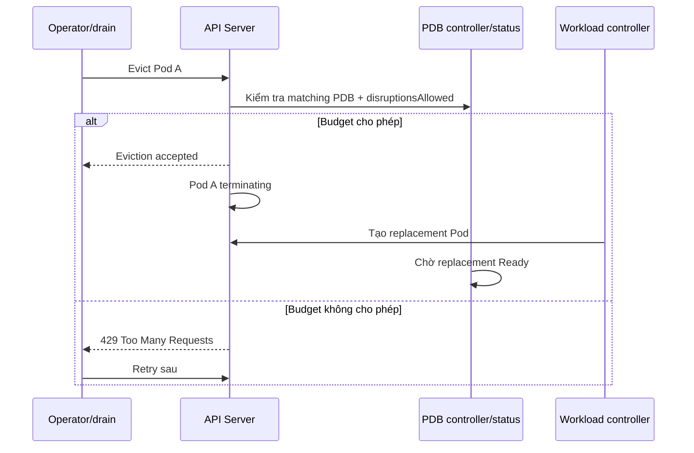

# PodDisruptionBudget

## Mục lục

- [Tổng quan](#tổng-quan)
- [1. Voluntary và involuntary disruption](#1-voluntary-và-involuntary-disruption)
- [2. Eviction API và reconciliation flow](#2-eviction-api-và-reconciliation-flow)
- [3. minAvailable và maxUnavailable](#3-minavailable-và-maxunavailable)
- [4. Selector, owner và health](#4-selector-owner-và-health)
- [5. Percentage rounding](#5-percentage-rounding)
- [6. Chọn budget theo workload](#6-chọn-budget-theo-workload)
- [7. unhealthyPodEvictionPolicy](#7-unhealthypodevictionpolicy)
- [8. PDB trong node drain và autoscaling](#8-pdb-trong-node-drain-và-autoscaling)
- [9. Manifest production và status](#9-manifest-production-và-status)
- [10. Thực hành](#10-thực-hành)
- [11. Troubleshooting và runbook](#11-troubleshooting-và-runbook)
- [12. Anti-patterns và best practices](#12-anti-patterns-và-best-practices)
- [Tài liệu tham khảo](#tài-liệu-tham-khảo)

---

## Tổng quan

PodDisruptionBudget (PDB) giới hạn số Pods của một application có thể bị **voluntary disruption** cùng lúc. Nó phối hợp availability của application với các thao tác quản trị như drain Node hoặc cluster autoscaler scale-down.

```text
3 Pods, maxUnavailable: 1
├── 3 healthy → cho phép evict 1
├── 2 healthy → không cho evict thêm
└── Pod replacement Ready → cho phép eviction tiếp theo
```

PDB không giữ Pod luôn chạy. Nó là guard cho **Eviction API**, không phải controller tạo replicas.

> [!IMPORTANT]
> PDB không bảo vệ khỏi Node crash, kernel panic, network partition, OOM, direct Pod deletion hoặc rollout do workload controller theo cùng cách. Availability thật cần replicas, topology spread, capacity, probes, graceful shutdown và dependency redundancy.

## 1. Voluntary và involuntary disruption

### 1.1 Voluntary disruptions

Thao tác có chủ đích thường có thể dùng Eviction API và tôn trọng PDB:

- `kubectl drain`.
- Node maintenance/upgrade automation.
- Cluster autoscaler scale-down.
- Một số descheduler/platform operations.
- Admin/operator gọi Pod eviction.

### 1.2 Involuntary disruptions

PDB không thể ngăn:

- Node hardware/VM failure.
- Node mất network.
- Kernel panic.
- Pod bị OOM/evict do resource pressure.
- Application crash.
- Zone outage.

### 1.3 Các thao tác có thể bypass PDB

`kubectl delete pod`, xóa Deployment, scale replicas xuống, hoặc controller rollout không nhất thiết bị PDB chặn như Eviction API. PDB không phải authorization policy chống xóa.

Bảng mental model:

| Sự kiện | PDB thường bảo vệ? |
|---|---:|
| `kubectl drain` dùng eviction | Có |
| Cluster autoscaler scale-down | Có nếu implementation tôn trọng PDB |
| Node chết đột ngột | Không |
| `kubectl delete pod` | Không |
| Deployment RollingUpdate | Không dựa vào PDB; dùng strategy |
| Scale Deployment từ 3 xuống 1 | Không |

## 2. Eviction API và reconciliation flow



Eviction là policy-aware delete request. Client nên retry có backoff khi `429`, không bypass bằng delete trừ runbook được phê duyệt.

PDB controller tính status từ desired replicas của owning controller và Pods matching selector. `disruptionsAllowed` là số eviction hiện được phép.

## 3. minAvailable và maxUnavailable

PDB chỉ được khai báo **một** trong hai.

### 3.1 `minAvailable`

Số healthy Pods tối thiểu phải còn sau eviction:

```yaml
spec:
  minAvailable: 2
```

Với 3 Pods healthy, cho phép 1 disruption. Với 2 healthy, cho phép 0.

Có thể dùng integer hoặc percentage:

```yaml
minAvailable: "75%"
```

Phù hợp khi availability requirement được diễn đạt trực tiếp hoặc workload arbitrary không hỗ trợ scale có hạn chế nhất định.

### 3.2 `maxUnavailable`

Số Pods tối đa được unavailable:

```yaml
spec:
  maxUnavailable: 1
```

Thường được khuyến nghị cho workload do một controller có scale subresource quản lý vì tự thích nghi khi replicas đổi.

`maxUnavailable` yêu cầu các Pods selected thuộc cùng controller phù hợp để Kubernetes biết desired scale.

### 3.3 So sánh khi scale

Workload ban đầu 3 replicas:

| PDB | Scale lên 10 | Kết quả |
|---|---:|---|
| `minAvailable: 2` | 10 | Có thể disruption đến khi còn 2 healthy; quá lỏng |
| `maxUnavailable: 1` | 10 | Vẫn chỉ 1 unavailable; ổn định |
| `minAvailable: "80%"` | 10 | Cần 8 healthy |
| `maxUnavailable: "20%"` | 10 | Cho phép theo percentage rounding |

Không có lựa chọn phổ quát. Quorum system thường dùng absolute count; stateless fleet lớn có thể dùng percentage.

## 4. Selector, owner và health

### 4.1 Selector phải chọn đúng Pods

```yaml
selector:
  matchLabels:
    app.kubernetes.io/name: api
    app.kubernetes.io/instance: checkout
```

Selector quá rộng có thể gộp nhiều workload độc lập; quá hẹp không bảo vệ đủ Pods. Nên khớp stable selector của Deployment/StatefulSet.

> [!CAUTION]
> Với `policy/v1`, selector rỗng `{}` match mọi Pod trong Namespace. Không bỏ selector hoặc dùng selector rỗng ngoài ý muốn.

### 4.2 Tránh overlapping PDBs

Một Pod match nhiều PDB phải thỏa tất cả budget khi eviction, dễ làm drain bị chặn khó hiểu. Chỉ overlap có chủ đích trong migration và theo dõi chặt.

### 4.3 Healthy nghĩa là Ready

PDB coi Pod healthy khi condition `Ready=True`. Vì vậy readiness probe ảnh hưởng trực tiếp `currentHealthy`.

```text
Probe sai → Pod NotReady → disruptionsAllowed giảm về 0 → drain bị kẹt
```

PDB không tự kiểm tra business health ngoài Pod Ready condition.

### 4.4 Owner và desired replicas

Deployment, ReplicaSet, StatefulSet và controller có `scale` subresource cung cấp desired count. Bare Pods/arbitrary controller chỉ hỗ trợ một số cấu hình hạn chế: thường phải dùng integer `minAvailable`, không dùng percentage/`maxUnavailable` khi hệ thống không suy ra scale.

## 5. Percentage rounding

Kubernetes làm tròn lên khi percentage không ra integer.

### 5.1 `minAvailable`

7 replicas, `minAvailable: "50%"`:

```text
ceil(7 × 50%) = 4 healthy tối thiểu
```

### 5.2 `maxUnavailable`

7 replicas, `maxUnavailable: "30%"`:

```text
ceil(7 × 30%) = 3 Pods có thể unavailable
```

Thực tế 3/7 ≈ 42.9%, cao hơn 30%. Percentage nhỏ trên replica count nhỏ có thể gây bất ngờ.

Đặc biệt 1 replica + `maxUnavailable: "30%"`:

```text
ceil(1 × 30%) = 1
```

Có thể cho phép disruption 100%. Với fleet nhỏ, dùng integer và tính bảng trước.

## 6. Chọn budget theo workload

### 6.1 Stateless service

Ví dụ 4 replicas, chịu mất tối đa 1:

```yaml
maxUnavailable: 1
```

Cần đảm bảo 3 replicas còn lại đủ capacity chịu traffic. PDB bảo vệ count, không bảo vệ load.

### 6.2 Quorum system

Ví dụ 5-member consensus cần quorum 3:

```yaml
minAvailable: 3
```

Nhưng PDB chỉ nhìn Ready, không hiểu leader/member health hoặc data replication. Operator chuyên dụng có thể cần logic an toàn hơn.

### 6.3 Single replica

`maxUnavailable: 0` hoặc `minAvailable: 1` chặn mọi voluntary eviction. Điều này bảo vệ uptime ngắn hạn nhưng làm Node drain/upgrade không hoàn tất.

Các lựa chọn:

- Tăng replicas và thiết kế app HA.
- Chấp nhận maintenance downtime, bỏ PDB.
- Dùng PDB zero và runbook phối hợp owner để tạm nới/xóa khi maintenance.

PDB không thể tạo high availability cho single-replica app.

### 6.4 Batch Job

Restartable Job thường không cần PDB; Job controller tạo replacement. PDB có thể làm maintenance kẹt mà không tăng business availability. Với long-running non-idempotent task, giải quyết checkpoint/idempotency trước.

### 6.5 StatefulSet

Kết hợp:

- Quorum/replication semantics.
- PodManagementPolicy và update strategy.
- Storage attach/detach time.
- Zone distribution.
- Replacement startup/readiness duration.

Budget quá chặt cộng replacement chậm làm drain kéo dài hàng giờ.

## 7. unhealthyPodEvictionPolicy

PDB có thể cấu hình cách eviction Pod `Running` nhưng không Ready:

```yaml
spec:
  maxUnavailable: 1
  unhealthyPodEvictionPolicy: AlwaysAllow
```

### 7.1 `IfHealthyBudget` — behavior mặc định

Unhealthy Running Pod chỉ được evict khi application hiện không bị disrupted theo budget. Ưu tiên cho Pod cơ hội hồi phục, nhưng CrashLoop/NotReady Pod có thể chặn drain.

### 7.2 `AlwaysAllow`

Cho phép evict Running Pod không Ready bất kể budget. Giúp drain Node chứa Pod hỏng, nhưng Pod có tiềm năng hồi phục bị di chuyển và application có thể ít healthy hơn trong thời gian ngắn.

Pods `Pending`, `Succeeded`, `Failed` thường có thể eviction không bị policy unhealthy Running chặn tương tự.

Chọn theo operational policy. Nhiều platform ưu tiên `AlwaysAllow` để maintenance không bị workload hỏng khóa cứng, kết hợp alert owner.

## 8. PDB trong node drain và autoscaling

### 8.1 Drain

```bash
kubectl cordon NODE_NAME
kubectl drain NODE_NAME --ignore-daemonsets --delete-emptydir-data
```

Flow an toàn:

1. Cordon ngăn Pod mới schedule lên Node.
2. Drain gửi evictions.
3. PDB cho phép theo budget.
4. Controller tạo replacements ở Node khác.
5. Replacements phải schedule và Ready.
6. Budget mở lại cho eviction tiếp theo.

Nếu cluster không có spare capacity, replacement Pending và drain kẹt. PDB đang làm đúng: nó phát hiện không thể duy trì availability.

### 8.2 Cluster autoscaler

Autoscaler không scale down Node nếu Pods không evict được theo PDB. PDB quá rộng/zero disruptions làm giảm consolidation và tăng cost.

### 8.3 Maintenance concurrency

Nếu nhiều Node drain song song, tổng evictions vẫn bị PDB giới hạn, nhưng involuntary failure có thể xảy ra cùng lúc. Số Node maintenance concurrent phải phù hợp failure domain và spare capacity.

### 8.4 Managed Kubernetes

Xác nhận provider upgrade/repair operation có tôn trọng PDB và timeout/bypass policy nào. Một số platform có maximum drain duration rồi force action theo contract dịch vụ.

## 9. Manifest production và status

```yaml
apiVersion: policy/v1
kind: PodDisruptionBudget
metadata:
  name: checkout-api
  namespace: production
spec:
  maxUnavailable: 1
  unhealthyPodEvictionPolicy: AlwaysAllow
  selector:
    matchLabels:
      app.kubernetes.io/name: checkout-api
      app.kubernetes.io/instance: production
```

Inspect:

```bash
kubectl get pdb -n production
kubectl describe pdb checkout-api -n production
kubectl get pdb checkout-api -n production -o yaml
```

Các status fields:

| Field | Ý nghĩa |
|---|---|
| `currentHealthy` | Matching Pods đang Ready |
| `desiredHealthy` | Số healthy cần theo budget |
| `expectedPods` | Desired replicas suy ra |
| `disruptionsAllowed` | Số eviction hiện cho phép |
| `observedGeneration` | Generation controller đã xử lý |
| `disruptedPods` | Pods eviction đang được theo dõi |

Automation nên chờ `observedGeneration` cập nhật trước khi tin status sau thay đổi PDB.

## 10. Thực hành

Tạo Deployment và PDB:

```bash
kubectl create namespace pdb-lab
kubectl create deployment web -n pdb-lab \
  --image=nginx:1.27-alpine --replicas=3
kubectl wait --for=condition=Available deployment/web \
  -n pdb-lab --timeout=120s
cat <<'EOF' > pdb.yaml
apiVersion: policy/v1
kind: PodDisruptionBudget
metadata:
  name: web
  namespace: pdb-lab
spec:
  minAvailable: 2
  selector:
    matchLabels:
      app: web
EOF
kubectl apply -f pdb.yaml
kubectl get pdb web -n pdb-lab
```

Evict một Pod:

```bash
POD="$(kubectl get pods -n pdb-lab -l app=web -o jsonpath='{.items[0].metadata.name}')"
kubectl create -n pdb-lab -f - <<EOF
apiVersion: policy/v1
kind: Eviction
metadata:
  name: ${POD}
  namespace: pdb-lab
EOF
kubectl get pods,pdb -n pdb-lab --watch
```

Deployment tạo replacement; khi Ready, `ALLOWED DISRUPTIONS` trở lại 1.

Mô phỏng budget zero bằng scale xuống 2 rồi xem status:

```bash
kubectl scale deployment/web -n pdb-lab --replicas=2
kubectl rollout status deployment/web -n pdb-lab --timeout=120s
kubectl get pdb web -n pdb-lab
```

Với `minAvailable: 2`, allowed disruptions là 0.

Cleanup:

```bash
kubectl delete namespace pdb-lab
rm -f pdb.yaml
```

## 11. Troubleshooting và runbook

### 11.1 Drain báo `Cannot evict pod as it would violate the pod's disruption budget`

Điều tra theo thứ tự:

```bash
kubectl get pdb -A
kubectl describe pdb PDB_NAME -n NAMESPACE
kubectl get pods -n NAMESPACE -l SELECTOR -o wide
kubectl get deployment,statefulset -n NAMESPACE
kubectl get events -n NAMESPACE --sort-by=.metadata.creationTimestamp
```

Hỏi:

- Có đủ replicas healthy không?
- Replacement có Pending vì thiếu capacity/taint/affinity/PVC không?
- Readiness probe có fail không?
- Selector có match nhầm workload không?
- Có overlapping PDB không?
- `maxUnavailable: 0`/`minAvailable: 100%` có chủ đích không?

### 11.2 `disruptionsAllowed: 0` dù mọi Pods trông Running

`Running` không bằng `Ready`. Kiểm tra conditions/readiness và `currentHealthy`. Cũng kiểm tra status đã observe generation mới chưa.

### 11.3 PDB không bảo vệ Pod

Kiểm tra operation có dùng Eviction API hay direct delete/scale/rollout. Xác minh selector match Pod labels và API version `policy/v1`.

### 11.4 `expectedPods` sai

Selector có thể match Pods từ nhiều owners, orphan Pod hoặc owner không có scale subresource. Thu hẹp selector và align với workload controller.

### 11.5 Runbook khi maintenance khẩn cấp

Không lập tức `--disable-eviction`/force delete. Quy trình:

1. Xác định application owner và SLO.
2. Khôi phục Pod NotReady hoặc thêm capacity/replicas trước.
3. Chờ replacement Ready.
4. Nếu phải nới PDB, ghi change/incident và chọn mức tối thiểu cần thiết.
5. Thực hiện từng Node, theo dõi error rate/quorum.
6. Khôi phục PDB và xác minh status sau maintenance.

Bypass PDB là chấp nhận availability risk, không phải “fix PDB”.

## 12. Anti-patterns và best practices

### Anti-patterns

- Tạo PDB `minAvailable: 100%` cho mọi workload.
- Dùng PDB cho single replica rồi kỳ vọng zero downtime.
- Selector `{}` hoặc label quá rộng.
- Chỉ kiểm tra PDB YAML, không kiểm tra `disruptionsAllowed`.
- Không tính startup time/spare capacity.
- Dùng PDB thay Deployment strategy hoặc topology spread.
- Force drain ngay khi PDB chặn mà không điều tra.

### Best practices

- Bắt đầu từ failure model và số replicas đủ phục vụ load/quorum.
- Ưu tiên `maxUnavailable` cho scalable controller khi semantics phù hợp.
- Dùng integer cho fleet nhỏ để tránh rounding bất ngờ.
- Align selector chính xác với một workload controller.
- Tránh overlapping PDB.
- Chọn `unhealthyPodEvictionPolicy` theo drain policy và test Pod NotReady.
- Alert khi `disruptionsAllowed=0` kéo dài hoặc PDB chặn autoscaler/drain.
- Đảm bảo spare capacity và topology distribution.
- Test node drain định kỳ trong staging/production game day.
- Có runbook owner-approved để tạm nới budget trong emergency.

PDB hoàn tất chuỗi cấu hình workload: từ command, data injection, resources, health đến availability khi bảo trì. Khi tiếp tục sang networking, hãy nhớ readiness và graceful shutdown quyết định endpoint có thực sự phục vụ traffic an toàn hay không.

---

## Tài liệu tham khảo

- [Specifying a Disruption Budget for your Application](https://kubernetes.io/docs/tasks/run-application/configure-pdb/)
- [Disruptions](https://kubernetes.io/docs/concepts/workloads/pods/disruptions/)
- [Safely Drain a Node](https://kubernetes.io/docs/tasks/administer-cluster/safely-drain-node/)
- [Eviction API](https://kubernetes.io/docs/concepts/scheduling-eviction/api-eviction/)
