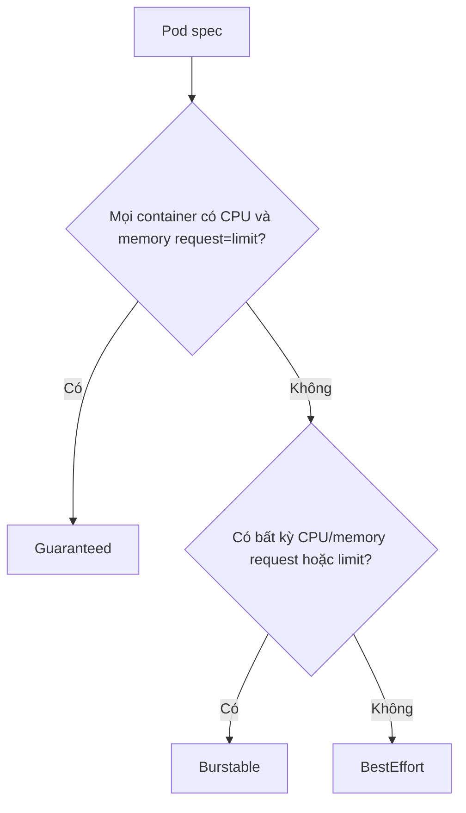

# Pod Quality of Service

## Mục lục

- [Tổng quan](#tổng-quan)
- [1. QoS được tính từ đâu?](#1-qos-được-tính-từ-đâu)
- [2. Guaranteed](#2-guaranteed)
- [3. Burstable](#3-burstable)
- [4. BestEffort](#4-besteffort)
- [5. QoS ảnh hưởng eviction như thế nào?](#5-qos-ảnh-hưởng-eviction-như-thế-nào)
- [6. QoS, OOM, Priority và preemption](#6-qos-oom-priority-và-preemption)
- [7. Multi-container Pod và các bẫy phân loại](#7-multi-container-pod-và-các-bẫy-phân-loại)
- [8. Cgroups và CPU Manager](#8-cgroups-và-cpu-manager)
- [9. Chọn QoS theo workload](#9-chọn-qos-theo-workload)
- [10. Thực hành](#10-thực-hành)
- [11. Troubleshooting](#11-troubleshooting)
- [12. Best practices](#12-best-practices)
- [Tài liệu tham khảo](#tài-liệu-tham-khảo)

---

## Tổng quan

Kubernetes tự gán mỗi Pod vào một trong ba Quality of Service (QoS) classes dựa trên CPU/memory requests và limits:

```text
Guaranteed  → mọi CPU/memory request = limit theo điều kiện đầy đủ
Burstable   → có ít nhất một CPU/memory request/limit nhưng không đạt Guaranteed
BestEffort  → không có CPU/memory request/limit
```

QoS chủ yếu giúp kubelet/kernel quyết định bảo vệ hoặc evict workload thế nào khi Node thiếu resource. QoS không phải SLA, không tạo replica, không bảo vệ khỏi Node failure và không thay thế PriorityClass/PDB.



> [!IMPORTANT]
> QoS là **kết quả** của resource specification, không phải field bạn đặt trực tiếp. Không có `qosClass: Guaranteed` trong Pod spec.

## 1. QoS được tính từ đâu?

Với container-level resources, Kubernetes xét mọi application container và init container liên quan trong Pod. Status hiển thị kết quả:

```bash
kubectl get pod POD_NAME -n NAMESPACE \
  -o jsonpath='{.status.qosClass}{"\n"}'
```

Các phiên bản mới có thể hỗ trợ Pod-level resources; khi dùng feature này, Pod-level CPU/memory request và limit cũng tham gia tiêu chí. Luôn kiểm tra API/version của cluster trước khi dựa vào behavior mới.

QoS được xác định khi Pod được tạo và giữ trong lifetime. In-place resize dẫn đến đổi QoS có thể bị từ chối; cách portable để đổi class là cập nhật workload template và tạo Pod mới.

## 2. Guaranteed

### 2.1 Điều kiện

Để Pod đạt `Guaranteed` theo container-level resources:

- Mọi container có CPU request > 0 và CPU limit > 0.
- Với từng container, CPU request bằng CPU limit.
- Mọi container có memory request > 0 và memory limit > 0.
- Với từng container, memory request bằng memory limit.

```yaml
containers:
  - name: api
    image: example.com/api:1.0
    resources:
      requests:
        cpu: "1"
        memory: 1Gi
      limits:
        cpu: "1"
        memory: 1Gi
```

Chỉ thiếu memory request, hoặc CPU request khác limit, Pod trở thành Burstable.

### 2.2 Đặc tính

- Có resource reservation rõ nhất.
- Thường là nhóm cuối cùng bị xét eviction do Node pressure sau các Pod thấp hơn, với điều kiện liên quan usage/request.
- Có thể đủ điều kiện dùng exclusive CPU khi kubelet CPU Manager `static` và request CPU nguyên cùng các điều kiện platform.
- Không có quyền miễn OOM: container vượt memory limit vẫn bị kill.
- Không được dùng vượt limit đã đặt.

Guaranteed phù hợp workload latency-sensitive hoặc critical có sizing ổn định, nhưng `request=limit` CPU/memory làm giảm overcommit và tăng chi phí capacity.

## 3. Burstable

Pod là `Burstable` khi:

- Không đạt Guaranteed.
- Có ít nhất một CPU hoặc memory request/limit ở một container hoặc cấp Pod được hỗ trợ.

```yaml
resources:
  requests:
    cpu: 250m
    memory: 256Mi
  limits:
    cpu: "1"
    memory: 512Mi
```

Đây là class phổ biến cho service:

- Request bảo đảm mức nền để schedule.
- Limit cho phép burst trong boundary.
- Cluster có thể overcommit.

Một Pod nhiều container chỉ cần một sidecar thiếu resources cũng có thể khiến toàn Pod không đạt Guaranteed. Burstable không đồng nghĩa “kém chất lượng”; nó là trade-off giữa utilization và isolation.

## 4. BestEffort

Pod là `BestEffort` khi không container nào có CPU/memory request hoặc limit, và không có Pod-level CPU/memory resource tương ứng:

```yaml
containers:
  - name: demo
    image: busybox:1.36
    command: ["sleep", "3600"]
```

Đặc tính:

- Scheduler coi request CPU/memory bằng 0 cho placement.
- Pod có thể dùng idle resource khi có.
- Là nhóm đầu tiên kubelet ưu tiên evict dưới Node pressure.
- Dễ trở thành noisy neighbor hoặc nạn nhân của contention.

BestEffort phù hợp lab hoặc task thực sự disposable/low-priority. Production service thường nên có requests để capacity planning và autoscaling hoạt động dự đoán được.

Request resource khác như GPU mà không có CPU/memory vẫn có thể để Pod thuộc BestEffort về QoS CPU/memory.

## 5. QoS ảnh hưởng eviction như thế nào?

Khi Node có memory/disk/PID pressure, kubelet cố reclaim và có thể evict Pods. Mental model đơn giản:

```text
BestEffort → Burstable → Guaranteed
```

Nhưng selection thực tế còn xét:

1. Pod có vượt request của resource đang pressure không.
2. Pod Priority.
3. Mức usage vượt request.
4. Resource và eviction signal cụ thể.

Trong node-pressure eviction do resource shortage, Pod không vượt request thường được bảo vệ hơn Pod vượt request. Vì vậy chỉ nhìn `qosClass` chưa đủ.

### 5.1 Eviction không phải OOM kill

| Sự kiện | Actor | Phạm vi | Dấu hiệu |
|---|---|---|---|
| Container OOM | Kernel/cgroup | Process/container | `OOMKilled`, exit 137 thường gặp |
| Node-pressure eviction | kubelet | Cả Pod | Pod `Failed/Evicted`, Events |
| Scheduler preemption | Scheduler | Pod thấp priority bị loại để Pod khác schedule | Preemption Events |
| Voluntary eviction | Eviction API/operator | Pod | Có thể bị PDB giới hạn |

QoS ảnh hưởng node-pressure handling và OOM scoring, nhưng không thay thế các cơ chế khác.

## 6. QoS, OOM, Priority và preemption

### 6.1 OOM

Guaranteed container chạm chính memory limit của nó vẫn bị OOM kill. “Guaranteed” nghĩa resource request/limit cân bằng và được ưu tiên bảo vệ tương đối, không nghĩa process không bao giờ chết.

Trong Node OOM, kernel OOM scoring thường kết hợp QoS/request/usage để bảo vệ workload tốt hơn, nhưng không nên dựa vào chi tiết score như API contract tuyệt đối giữa OS/runtime versions.

### 6.2 PriorityClass

Priority trả lời “workload nào quan trọng hơn khi schedule/evict”; QoS trả lời “resource contract của Pod ra sao”. Một BestEffort Pod priority cao và Guaranteed Pod priority thấp tạo policy khó đoán nếu đội ngũ không thống nhất.

Thiết kế production phải phối hợp:

- Requests/limits → QoS và capacity.
- PriorityClass → criticality/preemption.
- PDB → voluntary disruption concurrency.
- Replicas/topology → availability thật.

### 6.3 Scheduler preemption

Scheduler không dùng QoS class làm tiêu chí trực tiếp để chọn preemption. Nó dùng Priority và feasibility. Đừng nâng QoS với kỳ vọng Pod sẽ thắng scheduling preemption.

## 7. Multi-container Pod và các bẫy phân loại

### 7.1 Sidecar làm Pod rớt Guaranteed

```yaml
containers:
  - name: api
    resources:
      requests: {cpu: 500m, memory: 512Mi}
      limits: {cpu: 500m, memory: 512Mi}
  - name: metrics
    resources:
      requests: {cpu: 20m, memory: 32Mi}
      limits: {memory: 64Mi}
```

`metrics` thiếu CPU limit và request khác memory limit, nên toàn Pod là Burstable.

### 7.2 LimitRange inject defaults

Admission có thể thêm request/limit làm QoS khác manifest source. Luôn inspect Pod đã admit:

```bash
kubectl get pod POD_NAME -n NAMESPACE -o yaml
kubectl get limitrange -n NAMESPACE
```

### 7.3 Chỉ có limit

Kubernetes có thể copy limit thành request nếu không có default khác. Nếu cả CPU và memory limit được đặt đầy đủ cho mọi container, Pod có thể thành Guaranteed ngoài ý định. Cần hiểu mutation/admission chain.

### 7.4 Init container

Init container resource specification cũng quan trọng cho scheduling và QoS. Không bỏ qua init container chỉ vì nó chạy ngắn.

## 8. Cgroups và CPU Manager

QoS thường ánh xạ vào cgroup hierarchy và kernel controls do kubelet/runtime thiết lập. Chi tiết phụ thuộc cgroup v1/v2 và kubelet config.

### 8.1 CPU Manager static policy

Guaranteed Pod có container request CPU nguyên (`1`, `2`, ...) có thể được cấp exclusive CPU set nếu Node bật `static` CPU Manager. Đây là platform-level feature, không tự xảy ra chỉ vì QoS Guaranteed.

Use case: low-latency, packet processing, workload nhạy cache locality. Trade-off: fragmentation và giảm utilization.

### 8.2 MemoryQoS

MemoryQoS trên cgroup v2 có thể dùng `memory.high`, `memory.min`/`memory.low` theo feature/config để throttle/protect memory tốt hơn. Feature state thay đổi theo Kubernetes version; không coi đây là behavior mặc định nếu chưa xác nhận kubelet configuration.

## 9. Chọn QoS theo workload

| Workload | QoS thường phù hợp | Lý do |
|---|---|---|
| Critical control/data service ổn định | Guaranteed hoặc Burstable chặt | Isolation/capacity rõ |
| Web/API thông thường | Burstable | Burst traffic, utilization tốt |
| Worker có queue | Burstable | Request mức nền, burst khi backlog |
| Batch disposable | Burstable thấp hoặc BestEffort có policy | Chấp nhận eviction |
| Lab/debug | BestEffort | Không cần guarantee |

Không chọn QoS trước rồi ép con số. Bắt đầu từ SLO, profile resource và failure mode; QoS là kết quả.

## 10. Thực hành

```bash
kubectl create namespace qos-lab
cat <<'EOF' > qos-pods.yaml
apiVersion: v1
kind: Pod
metadata:
  name: guaranteed
  namespace: qos-lab
spec:
  containers:
    - name: app
      image: busybox:1.36
      command: ["sleep", "3600"]
      resources:
        requests: {cpu: 100m, memory: 32Mi}
        limits: {cpu: 100m, memory: 32Mi}
---
apiVersion: v1
kind: Pod
metadata:
  name: burstable
  namespace: qos-lab
spec:
  containers:
    - name: app
      image: busybox:1.36
      command: ["sleep", "3600"]
      resources:
        requests: {cpu: 50m, memory: 16Mi}
        limits: {memory: 64Mi}
---
apiVersion: v1
kind: Pod
metadata:
  name: best-effort
  namespace: qos-lab
spec:
  containers:
    - name: app
      image: busybox:1.36
      command: ["sleep", "3600"]
EOF
kubectl apply -f qos-pods.yaml
kubectl get pods -n qos-lab \
  -o custom-columns='NAME:.metadata.name,QOS:.status.qosClass,NODE:.spec.nodeName'
```

Inspect admitted resources:

```bash
for pod in guaranteed burstable best-effort; do
  kubectl get pod "$pod" -n qos-lab \
    -o jsonpath='{.metadata.name}{" => "}{.status.qosClass}{" "}{.spec.containers[*].resources}{"\n"}'
done
```

Cleanup:

```bash
kubectl delete namespace qos-lab
rm -f qos-pods.yaml
```

## 11. Troubleshooting

### 11.1 Pod không đạt Guaranteed

Kiểm tra **mọi** container/init container sau admission. CPU và memory đều phải có request=limit > 0.

```bash
kubectl get pod POD_NAME -n NAMESPACE -o yaml
```

### 11.2 Pod bị evict dù là Guaranteed

Guaranteed vẫn có thể bị evict khi không còn lựa chọn thấp hơn, do disk/PID pressure, taint-based eviction, admin action hoặc failure khác. Đọc reason/Event và Node conditions; không suy luận chỉ từ class.

### 11.3 BestEffort app latency bất ổn

Không có CPU request nên khi contention app không có share nền rõ. Đặt request dựa trên SLO và kiểm tra throttling/Node saturation.

### 11.4 QoS khác giữa Namespace

LimitRange hoặc mutating admission có thể inject resource defaults khác nhau. So sánh Pod live và policy Namespace.

## 12. Best practices

- Đặt resources cho tất cả containers, gồm sidecar/init container.
- Xem QoS là một phần của capacity/failure policy, không phải huy hiệu chất lượng.
- Dùng Guaranteed có chủ đích cho workload cần isolation và chấp nhận chi phí.
- Dùng Burstable với request đo đạc tốt cho đa số service.
- Hạn chế BestEffort production cho workload thực sự disposable.
- Phối hợp QoS với PriorityClass, PDB, replicas và topology spread.
- Alert Node pressure, eviction, OOM và throttling.
- Inspect Pod sau admission để thấy defaults thực tế.
- Test pressure/eviction trên staging thay vì dựa hoàn toàn vào lý thuyết.

Tiếp tục với [Downward API](/cau-hinh/downward-api/) để inject metadata và resource information của chính Pod vào container.

---

## Tài liệu tham khảo

- [Pod Quality of Service Classes](https://kubernetes.io/docs/concepts/workloads/pods/pod-qos/)
- [Node-pressure Eviction](https://kubernetes.io/docs/concepts/scheduling-eviction/node-pressure-eviction/)
- [CPU Management Policies](https://kubernetes.io/docs/tasks/administer-cluster/cpu-management-policies/)
