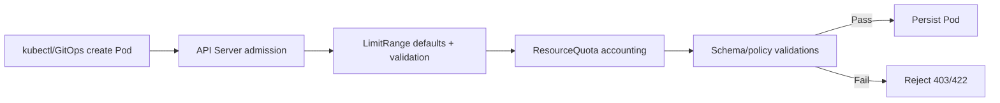

# ResourceQuota và LimitRange

## Mục lục

- [Tổng quan](#tổng-quan)
- [1. Hai resource, hai phạm vi kiểm soát](#1-hai-resource-hai-phạm-vi-kiểm-soát)
- [2. Admission flow](#2-admission-flow)
- [3. ResourceQuota](#3-resourcequota)
- [4. LimitRange](#4-limitrange)
- [5. Kết hợp ResourceQuota và LimitRange](#5-kết-hợp-resourcequota-và-limitrange)
- [6. Quota scopes và PriorityClass](#6-quota-scopes-và-priorityclass)
- [7. Thiết kế policy multi-team](#7-thiết-kế-policy-multi-team)
- [8. Manifest baseline](#8-manifest-baseline)
- [9. Thực hành](#9-thực-hành)
- [10. Troubleshooting](#10-troubleshooting)
- [11. Best practices](#11-best-practices)
- [Tài liệu tham khảo](#tài-liệu-tham-khảo)

---

## Tổng quan

Trong cluster dùng chung, resource configuration ở từng Pod chưa đủ. Platform cần guardrail cấp Namespace:

- `LimitRange`: kiểm soát/default cho **một Container, Pod hoặc PVC**.
- `ResourceQuota`: giới hạn **tổng consumption hoặc object count của Namespace**.

```text
Namespace team-a
├── LimitRange
│   ├── default request/limit cho mỗi container
│   ├── min/max mỗi container
│   └── max limit/request ratio
└── ResourceQuota
    ├── tổng CPU/memory requests/limits
    ├── tổng storage/PVC
    └── số Pods/Services/Secrets/Jobs...
```

> [!IMPORTANT]
> Quota là admission/accounting guardrail, không reserve vật lý Node cho Namespace. Tổng quota của mọi Namespace có thể lớn hơn cluster capacity; Pod vẫn cạnh tranh scheduling theo requests và policy.

## 1. Hai resource, hai phạm vi kiểm soát

| Câu hỏi | Resource |
|---|---|
| Một container tối đa bao nhiêu CPU? | LimitRange |
| Container không khai báo resources nhận default nào? | LimitRange |
| Tổng requests CPU của team là bao nhiêu? | ResourceQuota |
| Namespace được tạo tối đa bao nhiêu Secret/Job? | ResourceQuota |
| Một PVC được request tối đa bao nhiêu? | LimitRange |
| Tổng storage của mọi PVC? | ResourceQuota |

Cả hai là namespaced API objects và chỉ ảnh hưởng object mới/update qua admission. Thêm policy không retroactively resize hoặc xóa workload đã chạy.

## 2. Admission flow

Luồng khái niệm khi tạo Pod:



Thứ tự plugin chi tiết là implementation/config của API server, nhưng mental model quan trọng:

1. Defaults có thể được inject trước khi quota tính usage.
2. Min/max/ratio và quota có thể từ chối request.
3. Pod live có thể khác manifest source vì admission mutation.

Deployment object có thể tạo thành công nhưng ReplicaSet không tạo được Pods do quota. Luôn kiểm tra controller Events, không chỉ kết quả apply Deployment.

## 3. ResourceQuota

### 3.1 Compute quota

```yaml
apiVersion: v1
kind: ResourceQuota
metadata:
  name: compute-quota
  namespace: team-a
spec:
  hard:
    requests.cpu: "8"
    requests.memory: 16Gi
    limits.cpu: "16"
    limits.memory: 32Gi
```

Usage tính tổng Pods non-terminal trong Namespace. Với quota CPU/memory, Pod thiếu request/limit tương ứng có thể bị reject; LimitRange defaults giúp contract nhất quán.

Xem usage:

```bash
kubectl get resourcequota -n team-a
kubectl describe resourcequota compute-quota -n team-a
```

Status có `Used` và `Hard`.

### 3.2 Object count quota

```yaml
apiVersion: v1
kind: ResourceQuota
metadata:
  name: object-quota
  namespace: team-a
spec:
  hard:
    count/pods: "100"
    count/services: "30"
    count/secrets: "100"
    count/configmaps: "100"
    count/deployments.apps: "30"
    count/jobs.batch: "100"
```

Object count bảo vệ API server/etcd, Pod IP, NodePort/load balancer quota và tránh CronJob lỗi tạo vô hạn Jobs.

Core resources dùng `count/<resource>`; non-core dùng `count/<resource>.<group>`.

### 3.3 Storage quota

```yaml
spec:
  hard:
    requests.storage: 2Ti
    persistentvolumeclaims: "50"
    fast.storageclass.storage.k8s.io/requests.storage: 500Gi
    fast.storageclass.storage.k8s.io/persistentvolumeclaims: "20"
```

Có thể quota theo StorageClass để kiểm soát tier đắt. Quota PVC request không đảm bảo backend còn capacity.

### 3.4 Ephemeral storage và extended resources

```yaml
spec:
  hard:
    requests.ephemeral-storage: 100Gi
    limits.ephemeral-storage: 500Gi
    requests.nvidia.com/gpu: "4"
```

GPU/extended resources không overcommit nên quota thường dùng prefix `requests.`.

### 3.5 Quota không làm gì?

- Không chia Node theo Namespace.
- Không đảm bảo team luôn có quota capacity vật lý.
- Không giảm usage của object hiện có khi hard value bị hạ.
- Không sửa resource sizing sai ở từng container.
- Không ngăn người có quyền xóa/sửa ResourceQuota tự gỡ guardrail; RBAC/admission phải bảo vệ policy.

## 4. LimitRange

### 4.1 Defaults, min, max và ratio cho Container

```yaml
apiVersion: v1
kind: LimitRange
metadata:
  name: container-limits
  namespace: team-a
spec:
  limits:
    - type: Container
      defaultRequest:
        cpu: 100m
        memory: 128Mi
      default:
        cpu: 500m
        memory: 512Mi
      min:
        cpu: 25m
        memory: 32Mi
      max:
        cpu: "4"
        memory: 8Gi
      maxLimitRequestRatio:
        cpu: "10"
        memory: "4"
```

Ý nghĩa:

- `defaultRequest`: inject request nếu thiếu.
- `default`: inject limit nếu thiếu.
- `min`: request/limit không được thấp hơn theo validation semantics.
- `max`: không được vượt.
- `maxLimitRequestRatio`: giới hạn mức burst `limit/request`.

### 4.2 Pod-level limits

```yaml
- type: Pod
  min:
    cpu: 50m
    memory: 64Mi
  max:
    cpu: "8"
    memory: 16Gi
```

Giới hạn tổng resource của Pod theo semantics API, hữu ích tránh Pod nhiều sidecar vượt boundary dù từng container hợp lệ.

### 4.3 PVC limits

```yaml
- type: PersistentVolumeClaim
  min:
    storage: 1Gi
  max:
    storage: 500Gi
```

Ngăn PVC quá nhỏ gây overhead hoặc quá lớn gây cost/blast radius.

### 4.4 Default conflict

LimitRange không đảm bảo mọi combination default với user-specified value đều hợp lệ. Ví dụ default limit `500m`, user chỉ request `700m` → sau mutation request > limit và Pod bị reject.

Khuyến nghị:

- Nếu user override một phía, nên khai báo cả request và limit.
- Test policy với ma trận manifests.
- Chỉ có một nguồn defaults rõ trong Namespace.

### 4.5 Nhiều LimitRange

Nếu có nhiều LimitRange, lựa chọn default có thể không deterministic. Tránh nhiều object cùng default cho cùng type/resource; dùng một baseline có ownership rõ.

## 5. Kết hợp ResourceQuota và LimitRange

Không có LimitRange:

```text
ResourceQuota yêu cầu requests.cpu
→ Pod không khai báo request
→ admission reject
```

Có LimitRange:

```text
Pod thiếu request
→ LimitRange inject 100m
→ ResourceQuota cộng 100m
→ accept nếu còn quota
```

Đây là pattern baseline tốt, nhưng defaults không thay thế sizing. Nếu mọi application dùng default `100m/128Mi`, HPA, scheduling và SLO vẫn có thể sai.

### 5.1 Ví dụ tính quota

Quota:

```text
requests.cpu hard = 4 CPU
```

Deployment 10 replicas, mỗi Pod có:

```text
api request 300m + sidecar request 50m = 350m
```

Tổng request:

```text
10 × 350m = 3500m
```

Còn khoảng `500m`; rollout `maxSurge: 2` cần thêm `700m`, nên ReplicaSet mới có thể bị quota từ chối. Capacity planning phải tính **surge**, Jobs, init semantics và workloads khác.

## 6. Quota scopes và PriorityClass

Quota có thể chỉ áp dụng nhóm Pods:

- `BestEffort`
- `NotBestEffort`
- `Terminating`
- `NotTerminating`
- `PriorityClass`
- Một số scope chuyên biệt khác theo version

Ví dụ giới hạn high-priority Pods:

```yaml
apiVersion: v1
kind: ResourceQuota
metadata:
  name: high-priority-quota
  namespace: team-a
spec:
  hard:
    pods: "10"
    requests.cpu: "8"
    requests.memory: 16Gi
  scopeSelector:
    matchExpressions:
      - scopeName: PriorityClass
        operator: In
        values: ["high"]
```

Scope là advanced policy; test behavior và version compatibility. Không dùng quota scope thay RBAC cho quyền sử dụng PriorityClass nếu platform cần enforcement chặt hơn.

## 7. Thiết kế policy multi-team

### 7.1 Baseline theo môi trường

| Namespace type | Default request | Max/container | Object quotas | Mục tiêu |
|---|---|---|---|---|
| Dev | Nhỏ | Thấp | Chặt | Kiểm soát cost/lỗi |
| Staging | Gần production | Vừa | Vừa | Test thực tế |
| Production | Theo profile app | Có guardrail | Theo capacity | SLO và isolation |

### 7.2 Headroom

Không đặt quota hard bằng đúng usage hiện tại. Cần headroom cho:

- RollingUpdate `maxSurge`.
- HPA scale-out.
- Job/CronJob overlap.
- Incident/debug Pod.
- Secret/ConfigMap version cũ trong rollout.

### 7.3 Ownership và self-service

- Platform team sở hữu policy templates.
- Team application xem được `Used/Hard` và có dashboard/alert.
- Quy trình tăng quota dựa trên capacity/cost/SLO.
- RBAC ngăn team xóa quota của chính họ nếu đó là guardrail bắt buộc.
- Admission policy kiểm tra baseline tồn tại khi tạo Namespace.

### 7.4 Quota và cluster autoscaler

Quota chặn Pod trước scheduling nếu vượt hard, nên cluster autoscaler không thấy unschedulable Pod để scale Node. Tăng Node không tự tăng ResourceQuota. Đây là hai control loops độc lập.

## 8. Manifest baseline

```yaml
apiVersion: v1
kind: LimitRange
metadata:
  name: defaults
  namespace: team-a
spec:
  limits:
    - type: Container
      defaultRequest:
        cpu: 100m
        memory: 128Mi
      default:
        memory: 512Mi
      min:
        cpu: 10m
        memory: 16Mi
      max:
        cpu: "4"
        memory: 8Gi
---
apiVersion: v1
kind: ResourceQuota
metadata:
  name: namespace-budget
  namespace: team-a
spec:
  hard:
    requests.cpu: "8"
    requests.memory: 16Gi
    limits.memory: 32Gi
    count/pods: "100"
    count/services: "30"
    count/secrets: "100"
    count/configmaps: "100"
    count/jobs.batch: "100"
    requests.storage: 1Ti
    persistentvolumeclaims: "30"
```

Ví dụ không đặt default CPU limit để tránh throttling mặc định; đây là policy choice, không phải khuyến nghị phổ quát. Nếu quota yêu cầu `limits.cpu`, phải cung cấp/default field tương ứng.

## 9. Thực hành

```bash
kubectl create namespace quota-lab
cat <<'EOF' > quota-policy.yaml
apiVersion: v1
kind: LimitRange
metadata:
  name: defaults
  namespace: quota-lab
spec:
  limits:
    - type: Container
      defaultRequest: {cpu: 100m, memory: 32Mi}
      default: {cpu: 200m, memory: 64Mi}
      max: {cpu: 500m, memory: 128Mi}
---
apiVersion: v1
kind: ResourceQuota
metadata:
  name: budget
  namespace: quota-lab
spec:
  hard:
    requests.cpu: 300m
    requests.memory: 96Mi
    limits.cpu: 600m
    limits.memory: 192Mi
    count/pods: "3"
EOF
kubectl apply -f quota-policy.yaml
```

Tạo Pod không khai báo resources và xem defaults:

```bash
kubectl run first -n quota-lab --image=nginx:1.27-alpine
kubectl get pod first -n quota-lab -o jsonpath='{.spec.containers[0].resources}{"\n"}'
kubectl describe resourcequota budget -n quota-lab
```

Tạo thêm Pods đến khi quota từ chối:

```bash
kubectl run second -n quota-lab --image=nginx:1.27-alpine
kubectl run third -n quota-lab --image=nginx:1.27-alpine
kubectl run fourth -n quota-lab --image=nginx:1.27-alpine || true
kubectl get events -n quota-lab --sort-by=.metadata.creationTimestamp
```

Thử vượt LimitRange:

```bash
kubectl run too-large -n quota-lab --image=nginx:1.27-alpine \
  --requests=cpu=600m,memory=64Mi \
  --limits=cpu=600m,memory=64Mi || true
```

Cleanup:

```bash
kubectl delete namespace quota-lab
rm -f quota-policy.yaml
```

## 10. Troubleshooting

### 10.1 Deployment apply thành công nhưng replicas thiếu

```bash
kubectl describe deployment APP -n NAMESPACE
kubectl describe replicaset -n NAMESPACE
kubectl get events -n NAMESPACE --sort-by=.metadata.creationTimestamp
```

ReplicaSet Pod creation có thể bị `exceeded quota`. Giảm surge/replicas, giải phóng usage hoặc tăng quota có kiểm soát.

### 10.2 `must specify limits.cpu` hoặc tương tự

Quota đang track field nhưng Pod không có field và LimitRange không default. Khai báo resources hoặc sửa baseline.

### 10.3 `request must be less than or equal to limit`

Default limit từ LimitRange nhỏ hơn request user khai báo. Đặt cả request/limit hợp lệ hoặc điều chỉnh policy.

### 10.4 Usage không giảm ngay như mong đợi

Pod terminating/non-terminal vẫn có thể được tính; controller tạo replacement; quota status controller có propagation delay. Kiểm tra Pods, Jobs và finalizers.

### 10.5 Quota còn nhưng Pod Pending

Quota admission đã pass nhưng cluster không có Node fit request/affinity/taint/PVC. Quota không phải capacity reservation.

### 10.6 Không rõ resource key

```bash
kubectl api-resources
kubectl describe resourcequota -n NAMESPACE
kubectl explain resourcequota.spec.hard
```

Dùng đúng plural resource và API group cho `count/...`.

## 11. Best practices

- Dùng cả LimitRange và ResourceQuota cho Namespace multi-team.
- Chỉ có một nguồn defaults rõ; test admission output.
- Đặt object count quotas cho Pods, Secrets, ConfigMaps, Jobs và Services phù hợp.
- Tính rollout surge, HPA và Job overlap vào headroom.
- Bảo vệ quota/limitrange bằng RBAC/admission policy.
- Expose `Used/Hard` dashboard và alert trước khi chạm 100%.
- Không dùng defaults như sizing production cuối cùng.
- Quota storage theo StorageClass khi cost/tier khác nhau.
- Review quota cùng cluster capacity; nhớ rằng hai thứ không tự đồng bộ.
- Test policy changes trên Namespace staging vì không retroactive nhưng ảnh hưởng mọi Pod mới.

Tiếp tục với [PodDisruptionBudget](/cau-hinh/pod-disruption-budget/) để giới hạn số Pod bị gián đoạn tự nguyện đồng thời.

---

## Tài liệu tham khảo

- [Resource Quotas](https://kubernetes.io/docs/concepts/policy/resource-quotas/)
- [Limit Ranges](https://kubernetes.io/docs/concepts/policy/limit-range/)
- [Configure a Pod Quota for a Namespace](https://kubernetes.io/docs/tasks/administer-cluster/manage-resources/quota-pod-namespace/)
