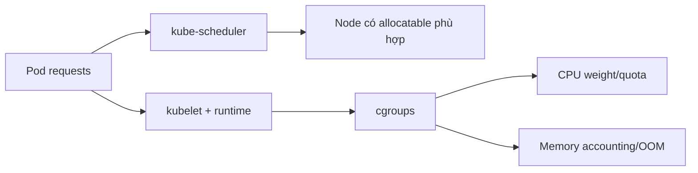

# Resource Requests và Limits

## Mục lục

- [Tổng quan](#tổng-quan)
- [1. Hai quyết định khác nhau: placement và enforcement](#1-hai-quyết-định-khác-nhau-placement-và-enforcement)
- [2. CPU](#2-cpu)
- [3. Memory](#3-memory)
- [4. Resource units và lỗi thường gặp](#4-resource-units-và-lỗi-thường-gặp)
- [5. Tính resource ở cấp Pod](#5-tính-resource-ở-cấp-pod)
- [6. Init containers, sidecars và Pod overhead](#6-init-containers-sidecars-và-pod-overhead)
- [7. Ephemeral storage, hugepages và extended resources](#7-ephemeral-storage-hugepages-và-extended-resources)
- [8. Manifest production](#8-manifest-production)
- [9. Chọn giá trị requests và limits](#9-chọn-giá-trị-requests-và-limits)
- [10. Autoscaling và resize](#10-autoscaling-và-resize)
- [11. Thực hành](#11-thực-hành)
- [12. Troubleshooting](#12-troubleshooting)
- [13. Best practices](#13-best-practices)
- [Tài liệu tham khảo](#tài-liệu-tham-khảo)

---

## Tổng quan

Resource configuration trả lời hai câu hỏi khác nhau:

- **Request**: workload cần bao nhiêu resource để Scheduler chọn Node và hệ thống phân bổ tương đối khi tranh chấp?
- **Limit**: workload được phép dùng tối đa bao nhiêu trước khi kernel/runtime can thiệp?



Ví dụ:

```yaml
resources:
  requests:
    cpu: 250m
    memory: 256Mi
  limits:
    cpu: 1
    memory: 512Mi
```

Container được schedule như cần `250m` CPU và `256Mi` memory; khi Node rảnh nó có thể burst CPU đến limit `1` và memory đến gần `512Mi`.

> [!IMPORTANT]
> Scheduler chủ yếu nhìn **requests**, không nhìn usage hiện tại để quyết định Pod fit. Node đang dùng ít CPU vẫn từ chối Pod nếu tổng requests đã vượt allocatable.

## 1. Hai quyết định khác nhau: placement và enforcement

### 1.1 Scheduling

Với mỗi Node và resource:

```text
Tổng requests của Pods đã schedule + request Pod mới <= Node allocatable
```

`allocatable` nhỏ hơn `capacity` vì phải dành cho OS, kubelet và system daemons.

```bash
kubectl get node NODE_NAME \
  -o custom-columns='NAME:.metadata.name,CPU:.status.capacity.cpu,CPU_ALLOC:.status.allocatable.cpu,MEM:.status.capacity.memory,MEM_ALLOC:.status.allocatable.memory'
```

Scheduler không cộng limits để fit CPU/memory thông thường, nên tổng limits có thể vượt 100% allocatable: **overcommit**.

### 1.2 Runtime enforcement

Kubelet chuyển requests/limits cho runtime; Linux runtime cấu hình cgroups:

- CPU request thường ảnh hưởng weight/share khi contention.
- CPU limit tạo quota và throttling.
- Memory request dùng cho scheduling, QoS/eviction và có thể làm hint cho cgroup v2.
- Memory limit tạo hard accounting boundary; vượt limit thường dẫn đến OOM kill.

### 1.3 Nếu chỉ khai báo limit

Nếu có limit mà không có request và admission không inject default, Kubernetes thường copy limit thành request. Kết quả có thể làm Pod khó schedule hơn dự kiến và chuyển QoS.

Nếu chỉ khai báo request, container có thể dùng hơn request khi Node còn resource; không có hard limit tương ứng ngoài boundary cấp Node/Pod/policy.

## 2. CPU

Kubernetes đo CPU theo core:

```text
1 CPU = 1 vCPU hoặc 1 physical core theo Node
500m = 0.5 CPU
100m = 0.1 CPU
```

Độ chính xác nhỏ nhất hợp lệ thường là `1m`; `0.5m` không hợp lệ.

### 2.1 CPU request

Khi không contention, container có thể dùng vượt request. Khi nhiều cgroup cùng cần CPU, request lớn hơn thường nhận tỷ trọng CPU lớn hơn.

Request quá thấp:

- Cluster overpack.
- Latency tăng khi contention.
- HPA dựa trên CPU utilization dễ scale quá nhạy vì utilization thường là usage/request.

Request quá cao:

- Lãng phí reserved capacity.
- Pod Pending dù actual usage thấp.
- Cluster autoscaler có thể scale node không cần thiết.

### 2.2 CPU limit và throttling

CPU là resource “compressible”: kernel trì hoãn execution thay vì kill process khi vượt quota.

```text
Nhu cầu CPU > limit → cgroup hết quota trong period → process bị throttle → chạy lại ở period sau
```

Triệu chứng:

- Latency spike nhưng CPU metric dừng gần limit.
- `container_cpu_cfs_throttled_seconds_total` tăng trên Linux/cgroup metrics.
- Application không crash nên lỗi dễ bị bỏ sót.

CPU limit hữu ích để ngăn noisy neighbor và kiểm soát workload không tin cậy, nhưng limit quá thấp gây tail latency. Một số platform cho phép bỏ CPU limit cho service nhạy latency trong khi vẫn đặt request chính xác và dùng quota/monitoring cấp Namespace.

## 3. Memory

Memory không “throttle” theo cách CPU ổn định thông thường. Khi memory accounting vượt limit, kernel OOM subsystem có thể kill process; enforcement mang tính phản ứng khi pressure/allocation xảy ra.

### 3.1 Memory request

Memory request ảnh hưởng:

- Scheduling.
- QoS class.
- Candidate selection khi Node pressure.
- Có thể ánh xạ tới memory protection hints với cgroup v2/config phù hợp.

Nếu usage vượt request và Node thiếu memory, Pod dễ trở thành eviction candidate hơn.

### 3.2 Memory limit và `OOMKilled`

```text
Application allocate memory
→ cgroup usage chạm limit
→ kernel OOM kill process
→ container exit (thường 137)
→ kubelet restart theo restartPolicy
```

Kiểm tra:

```bash
kubectl get pod POD_NAME -n NAMESPACE \
  -o jsonpath='{.status.containerStatuses[*].lastState.terminated.reason}{"\n"}'
kubectl describe pod POD_NAME -n NAMESPACE
kubectl logs POD_NAME -n NAMESPACE --previous
```

Phân biệt:

- **Container OOM**: container chạm cgroup limit, thường `OOMKilled`.
- **Node-pressure eviction**: kubelet evict Pod để bảo vệ Node, Pod status/Event nói về eviction/memory pressure.
- **System OOM**: kernel Node có thể kill process khi toàn Node cạn memory; cần xem node logs/metrics.

### 3.3 Memory gồm gì?

Tùy runtime/kernel accounting, memory cgroup bao gồm working set, anonymous memory, page cache và memory-backed volumes. `emptyDir.medium: Memory` dùng tmpfs và được tính như memory usage; nếu không có `sizeLimit`/memory limit hợp lý có thể làm cạn Node.

## 4. Resource units và lỗi thường gặp

### 4.1 CPU

```yaml
cpu: 100m   # 0.1 CPU
cpu: "1"    # 1 CPU
cpu: 0.5    # 0.5 CPU
```

### 4.2 Memory

| Quantity | Nghĩa |
|---|---|
| `128Mi` | 128 mebibytes, 2-based |
| `128M` | 128 megabytes, 10-based |
| `1Gi` | 1 gibibyte |
| `400m` | 0.4 byte, gần như chắc chắn là typo |

Chữ hoa/thường quan trọng. Dùng `Mi`/`Gi` nhất quán để review dễ.

### 4.3 API resources khác compute resources

`cpu`, `memory` là compute resources. Pod, Deployment, Service là API resources; cùng từ “resource” nhưng không cùng nghĩa.

## 5. Tính resource ở cấp Pod

Với application containers chạy đồng thời, request/limit cấp Pod về cơ bản là tổng theo resource:

```yaml
containers:
  - name: api
    resources:
      requests: {cpu: 300m, memory: 256Mi}
  - name: logger
    resources:
      requests: {cpu: 50m, memory: 64Mi}
```

Pod request thường là `350m` CPU và `320Mi` memory, trước khi tính init semantics/overhead.

### 5.1 Pod-level resources

Các Kubernetes phiên bản mới hỗ trợ khai báo `spec.resources` cấp Pod cho một số resource khi feature được bật/ổn định theo version cluster. Nó cho phép budget chung và chia idle resource giữa containers. Trước khi dùng:

```bash
kubectl explain pod.spec.resources
kubectl version
```

Do portability, manifest phổ thông vẫn nên khai báo container-level resources trừ khi platform contract xác nhận Pod-level resources.

## 6. Init containers, sidecars và Pod overhead

### 6.1 Init container truyền thống

Init containers chạy tuần tự trước app containers. Effective scheduling request cho resource thường xét giá trị lớn hơn giữa:

```text
max(request lớn nhất của từng init container,
    tổng requests của app containers chạy đồng thời)
```

Ví dụ app tổng 500Mi, init lớn nhất 1Gi → Pod cần Node fit ít nhất khoảng 1Gi cho phần này, không phải 1.5Gi.

### 6.2 Restartable init/sidecar

Native sidecar semantics làm một số init container tiếp tục chạy cùng app; cách tính phức tạp hơn vì phải cộng các container chạy đồng thời tại từng phase. Dùng `kubectl describe pod` và scheduler docs/version cụ thể để xác minh effective requests.

### 6.3 Pod overhead

RuntimeClass có thể khai báo overhead cho sandbox/VM runtime. Scheduler cộng overhead vào request và kubelet accounting. Điều này quan trọng với Kata Containers hoặc runtime isolation nặng.

## 7. Ephemeral storage, hugepages và extended resources

### 7.1 Local ephemeral storage

```yaml
resources:
  requests:
    ephemeral-storage: 1Gi
  limits:
    ephemeral-storage: 4Gi
```

Có thể tính writable layer, container logs và disk-backed `emptyDir`. Vượt limit/Node disk pressure có thể dẫn đến eviction. Log rotation là một phần capacity management.

### 7.2 Hugepages

```yaml
resources:
  requests:
    hugepages-2Mi: 80Mi
  limits:
    hugepages-2Mi: 80Mi
```

Hugepages không overcommit như CPU/memory và allocation vượt limit thất bại.

### 7.3 Extended resources/GPU

```yaml
resources:
  limits:
    nvidia.com/gpu: "1"
```

Extended resources thường là integer, không overcommit; request và limit phải bằng nhau nếu cả hai có mặt. Scheduler chỉ đặt Pod lên Node quảng bá resource.

## 8. Manifest production

```yaml
apiVersion: apps/v1
kind: Deployment
metadata:
  name: api
  namespace: production
spec:
  replicas: 3
  selector:
    matchLabels:
      app: api
  template:
    metadata:
      labels:
        app: api
    spec:
      containers:
        - name: api
          image: example.com/api@sha256:REPLACE_WITH_DIGEST
          ports:
            - name: http
              containerPort: 8080
          resources:
            requests:
              cpu: 250m
              memory: 256Mi
              ephemeral-storage: 256Mi
            limits:
              cpu: "1"
              memory: 512Mi
              ephemeral-storage: 2Gi
          readinessProbe:
            httpGet:
              path: /ready
              port: http
```

Không copy các con số này cho mọi app. Chúng chỉ minh họa syntax; sizing phải dựa trên đo đạc.

## 9. Chọn giá trị requests và limits

Quy trình thực dụng:

1. **Đo workload đại diện**: idle, normal, peak, startup, batch spike.
2. **Tách CPU và memory**: CPU có thể burst; memory cần headroom cho GC/cache/spike.
3. **Chọn request** phản ánh mức cần để đạt latency/SLO khi contention.
4. **Chọn limit** theo failure containment và behavior application.
5. **Load test** với limit thật, không chỉ local unlimited.
6. **Canary rollout** và theo dõi throttle/OOM/latency.
7. **Review định kỳ** theo percentile và seasonality.

### 9.1 Metric cần xem

- CPU usage và throttled time.
- Memory working set/RSS, OOM count.
- Request/limit utilization distribution.
- Pod Pending/FailedScheduling.
- Node pressure/eviction.
- Application latency, queue depth, GC pause.
- Ephemeral storage/log growth.

### 9.2 Không lấy average làm request duy nhất

Average che peak và multi-modal workload. Xem p95/p99 theo window phù hợp, nhưng request không nhất thiết bằng p99 usage: nó là capacity guarantee phục vụ SLO khi contention.

## 10. Autoscaling và resize

### 10.1 HPA

CPU utilization HPA thường tính tương đối với request:

```text
utilization = current CPU usage / CPU request
```

Request sai làm HPA sai tín hiệu. Không có request CPU, HPA có thể không tính được metric utilization cho Pod/container tương ứng.

### 10.2 VPA

Vertical Pod Autoscaler có thể recommend hoặc update requests. Tùy mode/version, update có thể recreate Pods hoặc dùng in-place resize. Cần PDB/capacity để tránh disruption ngoài ý muốn.

### 10.3 In-place Pod resize

Các phiên bản Kubernetes mới hỗ trợ resize CPU/memory container qua `/resize` subresource. Khả năng, policy restart và giới hạn phụ thuộc version/runtime. Cách portable nhất vẫn là sửa workload template để controller tạo Pods mới.

Không để HPA, VPA, GitOps và người vận hành cùng giành ownership một field mà không có policy rõ.

## 11. Thực hành

### 11.1 Quan sát scheduling request

```bash
kubectl create namespace resources-lab
cat <<'EOF' > resources-demo.yaml
apiVersion: v1
kind: Pod
metadata:
  name: resources-demo
  namespace: resources-lab
spec:
  containers:
    - name: demo
      image: nginx:1.27-alpine
      resources:
        requests:
          cpu: 100m
          memory: 64Mi
        limits:
          cpu: 200m
          memory: 128Mi
EOF
kubectl apply -f resources-demo.yaml
kubectl describe pod resources-demo -n resources-lab
```

Nếu Metrics Server có sẵn:

```bash
kubectl top pod resources-demo -n resources-lab --containers
kubectl top nodes
```

### 11.2 Tạo Pod không thể schedule

```bash
kubectl run too-large -n resources-lab \
  --image=nginx:1.27-alpine \
  --requests=cpu=100000,memory=1000Gi
kubectl describe pod too-large -n resources-lab
```

Tìm Event `FailedScheduling` và `Insufficient cpu/memory`. Xóa ngay:

```bash
kubectl delete pod too-large -n resources-lab
kubectl delete namespace resources-lab
rm -f resources-demo.yaml
```

## 12. Troubleshooting

### 12.1 Pod `Pending`

```bash
kubectl describe pod POD_NAME -n NAMESPACE
kubectl get events -n NAMESPACE --sort-by=.metadata.creationTimestamp
kubectl describe nodes
```

Kiểm tra request lớn hơn mọi Node, tổng requests, taint/affinity, quota và PVC. Actual usage thấp không giải phóng requested capacity.

### 12.2 `OOMKilled`

```bash
kubectl logs POD_NAME -c CONTAINER -n NAMESPACE --previous
kubectl get pod POD_NAME -n NAMESPACE -o jsonpath='{.status.containerStatuses}'
```

Tìm memory leak, unbounded cache, concurrency spike, tmpfs, request body lớn, JVM/container awareness. Không chỉ tăng limit mà không hiểu growth pattern.

### 12.3 Latency cao nhưng CPU usage không vượt limit

Kiểm tra throttling metric. Usage được average theo thời gian có thể không thể hiện các period bị quota exhaustion.

### 12.4 Pod bị evict dù chưa chạm limit

Node pressure eviction có thể xảy ra khi usage vượt request và Node thiếu resource. Đọc Pod status, Events và Node conditions.

### 12.5 LimitRange/Quota từ chối

```bash
kubectl get limitrange,resourcequota -n NAMESPACE
kubectl describe limitrange -n NAMESPACE
kubectl describe resourcequota -n NAMESPACE
```

Admission error thường nói rõ min/max/ratio/quota bị vi phạm.

## 13. Best practices

- Khai báo requests cho mọi container production, kể cả sidecar.
- Sizing bằng metric và load test, không copy template mù quáng.
- Đặt memory limit với headroom được kiểm chứng; alert OOM.
- Cân nhắc CPU limit theo latency và isolation policy; theo dõi throttling.
- Dùng `Mi`/`Gi`, `m` cho CPU dưới một core.
- Đặt ephemeral-storage request/limit và log rotation.
- Tính init container, sidecar, Pod overhead và rollout surge vào capacity.
- Đồng bộ requests với HPA/VPA strategy.
- Dùng ResourceQuota + LimitRange làm guardrail, không thay thế application sizing.
- Review requests/limits định kỳ sau thay đổi traffic/code/runtime.

Tiếp tục với [Liveness, Readiness và Startup Probes](/cau-hinh/health-probes/) để chuyển health semantics của ứng dụng thành tín hiệu cho kubelet và traffic routing.

---

## Tài liệu tham khảo

- [Resource Management for Pods and Containers](https://kubernetes.io/docs/concepts/configuration/manage-resources-containers/)
- [Local Ephemeral Storage](https://kubernetes.io/docs/concepts/configuration/manage-resources-containers/#local-ephemeral-storage)
- [Pod Overhead](https://kubernetes.io/docs/concepts/scheduling-eviction/pod-overhead/)
- [In-place Resize of Pods](https://kubernetes.io/docs/tasks/configure-pod-container/resize-container-resources/)
