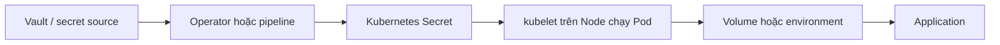
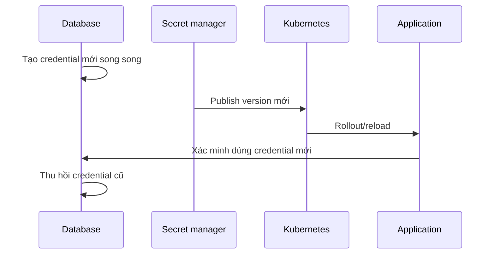

# Secret

## Mục lục

- [Tổng quan](#tổng-quan)
- [1. Threat model: Secret bảo vệ điều gì?](#1-threat-model-secret-bảo-vệ-điều-gì)
- [2. Data model, encoding và giới hạn](#2-data-model-encoding-và-giới-hạn)
- [3. Các Secret type](#3-các-secret-type)
- [4. Tạo Secret an toàn](#4-tạo-secret-an-toàn)
- [5. Cung cấp Secret cho Pod](#5-cung-cấp-secret-cho-pod)
- [6. Update và rotation](#6-update-và-rotation)
- [7. imagePullSecrets và ServiceAccount token](#7-imagepullsecrets-và-serviceaccount-token)
- [8. Bảo vệ Secret trong production](#8-bảo-vệ-secret-trong-production)
- [9. External secret management](#9-external-secret-management)
- [10. Thực hành](#10-thực-hành)
- [11. Troubleshooting và incident response](#11-troubleshooting-và-incident-response)
- [12. Best practices](#12-best-practices)
- [Tài liệu tham khảo](#tài-liệu-tham-khảo)

---

## Tổng quan

Secret là namespaced API object chứa lượng nhỏ dữ liệu nhạy cảm như password, token, private key hoặc certificate. Secret tách credential khỏi image và Pod template, cho phép quản lý lifecycle độc lập.



Secret giống ConfigMap về cách consume nhưng có semantics và integration dành cho dữ liệu nhạy cảm.

> [!CAUTION]
> Base64 chỉ là encoding, không phải encryption. Theo mặc định, Secret có thể được lưu không mã hóa trong etcd nếu cluster chưa bật encryption at rest. Ai có quyền đọc Secret hoặc quyền tạo Pod trong Namespace thường có đường để lấy credential.

## 1. Threat model: Secret bảo vệ điều gì?

Dùng Secret thay vì hard-code giúp tránh:

- Credential nằm trong source code và Git history.
- Credential bị đóng gói vào image layer/registry/cache.
- Credential hiển thị trực tiếp trong Pod spec thông thường.
- Phải build image mới chỉ để rotate password.

Secret **không tự bảo vệ** khỏi:

- User có RBAC `get/list/watch secrets`.
- User có quyền tạo/patch workload để mount Secret trong cùng Namespace.
- Process bị compromise trong container đã được cấp Secret.
- Cluster administrator hoặc người đọc được etcd backup không mã hóa.
- Log, crash dump, shell history hoặc debug endpoint làm lộ giá trị.
- Node/root access trong lúc Secret được dùng.

Mental model:

```text
Secret giảm phạm vi và chuẩn hóa delivery
≠
Secret biến credential thành không thể đọc
```

Security phải bao gồm source, transport, storage, authorization, delivery, runtime exposure, rotation và revocation.

## 2. Data model, encoding và giới hạn

```yaml
apiVersion: v1
kind: Secret
metadata:
  name: database-credentials
  namespace: production
type: Opaque
stringData:
  username: app_user
  password: replace-me-through-secure-pipeline
```

Hai field dữ liệu:

- `data`: mỗi value phải base64-encoded.
- `stringData`: nhận plain string; API server merge vào `data` khi ghi.

Nếu cùng key xuất hiện ở cả hai, `stringData` thắng. `stringData` tiện để author nhưng không hoạt động tốt với một số workflow server-side apply; công cụ secret management nên kiểm soát field ownership rõ.

### 2.1 Base64

```bash
printf %s 'p@ssw0rd' | base64
printf %s 'cEBzc3cwcmQ=' | base64 --decode
```

Tránh `echo` không kiểm soát vì có thể thêm newline. Newline vô tình trong password là lỗi rất phổ biến.

### 2.2 Ràng buộc

- Tên Secret là DNS subdomain hợp lệ.
- Key gồm chữ/số, `-`, `_`, `.`.
- Một Secret tối đa 1 MiB.
- Secret và Pod reference trực tiếp phải cùng Namespace.
- Có thể đặt `immutable: true`.

Secret không phải nơi lưu file artifact lớn. Nhiều Secret nhỏ cũng tạo tải lên API server, etcd và kubelet; có thể dùng quota `count/secrets`.

## 3. Các Secret type

| Type | Mục đích | Key/convention chính |
|---|---|---|
| `Opaque` | Dữ liệu tùy ý | Không ép schema cụ thể |
| `kubernetes.io/basic-auth` | Basic auth | `username`, `password` |
| `kubernetes.io/ssh-auth` | SSH private key | `ssh-privatekey` |
| `kubernetes.io/tls` | TLS certificate/key | `tls.crt`, `tls.key` |
| `kubernetes.io/dockerconfigjson` | Registry auth | `.dockerconfigjson` |
| `kubernetes.io/service-account-token` | Token dài hạn kiểu legacy | Không nên dùng nếu TokenRequest đáp ứng |
| `bootstrap.kubernetes.io/token` | Node bootstrap | Các key bootstrap chuẩn |

Type giúp con người và controller hiểu purpose; một số built-in type kiểm tra key bắt buộc nhưng không chứng minh credential thực sự hợp lệ.

### 3.1 TLS Secret

```bash
kubectl create secret tls web-tls -n production \
  --cert=./tls.crt \
  --key=./tls.key \
  --dry-run=client -o yaml
```

API server kiểm tra key cần có; đừng giả định nó kiểm tra toàn bộ trust chain, expiry hoặc hostname theo nhu cầu application. Certificate automation như cert-manager phù hợp hơn cho rotation.

### 3.2 SSH Secret cần `known_hosts`

Private key xác thực client không xác minh server. Cần `known_hosts` đáng tin cậy, thường từ ConfigMap hoặc image, để chống man-in-the-middle.

## 4. Tạo Secret an toàn

### 4.1 Tránh literal trên command line production

Lệnh sau tiện cho lab nhưng có thể đi vào shell history/process audit:

```bash
kubectl create secret generic app-secret \
  --from-literal=password='plaintext'
```

Tốt hơn là lấy từ file tạm có permission chặt, stdin/tooling phù hợp hoặc secret operator. Ví dụ local lab:

```bash
umask 077
printf %s 'lab-password' > password.txt
kubectl create secret generic app-secret \
  --from-file=password=./password.txt \
  --dry-run=client -o yaml
rm -f password.txt
```

Ngay cả YAML output cũng chứa base64 có thể decode; không commit output đó.

### 4.2 GitOps

Không commit plain Secret manifest. Các lựa chọn:

- SOPS encryption với KMS/age và decryption trong trusted controller/pipeline.
- Sealed Secrets: commit encrypted custom resource bound với cluster/key.
- External Secrets Operator: sync từ Vault/cloud secret manager.
- Secrets Store CSI Driver: mount từ external provider, tùy cấu hình có thể sync Kubernetes Secret.

Đánh giá blast radius của decryption key, audit log, rotation, disaster recovery và khả năng bootstrap.

## 5. Cung cấp Secret cho Pod

### 5.1 Chọn một key làm environment variable

```yaml
env:
  - name: DATABASE_PASSWORD
    valueFrom:
      secretKeyRef:
        name: database-credentials
        key: password
```

Ưu điểm là application đơn giản. Nhược điểm: không hot-update và environment dễ bị dump trong diagnostics.

### 5.2 Import toàn Secret

```yaml
envFrom:
  - secretRef:
      name: database-credentials
```

Chỉ dùng khi mọi key đều cần thiết và tên key là contract environment hợp lệ. Least privilege trong một Pod tốt hơn khi chọn từng key.

### 5.3 Mount thành files

```yaml
volumes:
  - name: credentials
    secret:
      secretName: database-credentials
      defaultMode: 0400
      items:
        - key: username
          path: username
        - key: password
          path: password
containers:
  - name: api
    image: example.com/api:1.0
    volumeMounts:
      - name: credentials
        mountPath: /var/run/secrets/app
        readOnly: true
```

Mỗi key trở thành file. Application đọc `/var/run/secrets/app/password`.

File mode được áp dụng trong volume nhưng runtime user/group và `fsGroup` cũng ảnh hưởng access. Test bằng cùng `runAsUser` production.

### 5.4 Chỉ expose cho container cần dùng

Volume được khai báo cấp Pod nhưng chỉ container có `volumeMount` mới thấy path đó:

```text
Pod
├── frontend: không mount signing-key
└── signer: mount signing-key read-only
```

Việc tách container giảm exposure nếu frontend bị path traversal/RCE, nhưng hai container vẫn chia sẻ network và một số Pod boundaries; cần hardening bổ sung.

### 5.5 Optional Secret

```yaml
secret:
  secretName: optional-overrides
  optional: true
```

Mặc định Secret là bắt buộc. Nếu object hoặc key bắt buộc thiếu, container không start và kubelet retry. Đây là fail-fast tốt cho credential quan trọng.

### 5.6 `subPath`

Secret volume update theo eventual consistency, nhưng mount qua `subPath` không nhận automated update. Với rotation động, mount cả directory.

## 6. Update và rotation

### 6.1 Behavior theo cách consume

| Cách consume | Secret đổi | Cần làm gì? |
|---|---|---|
| Environment | Process giữ giá trị cũ | Restart/rollout |
| Secret volume | File được cập nhật dần | Application phải reopen/reload |
| `subPath` | Không update tự động | Restart Pod |
| API client | Tùy code watch/cache | Implement reconnect và validation |

Projected volume có độ trễ kubelet sync + cache/watch propagation. Không dùng cho rotation cần atomic cutover giữa nhiều hệ thống mà không có protocol.

### 6.2 Rotation không chỉ là “đổi Secret”

Database password rotation an toàn thường là:



Cần overlap window hoặc dual credentials. Nếu revoke cũ trước khi tất cả Pods reload, request sẽ lỗi. Theo dõi rollout, authentication failure và version adoption.

### 6.3 Immutable Secret

```yaml
immutable: true
```

Dùng tên có version/hash, tạo Secret mới rồi đổi Pod template. Lợi ích là tránh mutation ngoài ý muốn và giảm watch load. Không thể unset immutability; phải delete/recreate.

## 7. imagePullSecrets và ServiceAccount token

### 7.1 Private registry

```yaml
spec:
  imagePullSecrets:
    - name: registry-credentials
  containers:
    - name: api
      image: registry.example.com/team/api:1.0
```

Secret phải có type/format registry phù hợp và nằm cùng Namespace. Có thể gắn `imagePullSecrets` vào ServiceAccount để Pods dùng mặc định, nhưng điều này mở rộng phạm vi credential đến mọi Pod dùng ServiceAccount đó.

### 7.2 ServiceAccount token

Ưu tiên short-lived, rotating token qua TokenRequest/projected volume thay cho legacy long-lived `kubernetes.io/service-account-token` Secret.

```yaml
projected:
  sources:
    - serviceAccountToken:
        path: token
        audience: https://internal-api.example
        expirationSeconds: 3600
```

Giới hạn `audience`, thời hạn và RBAC. Nếu workload không gọi Kubernetes API, cân nhắc:

```yaml
automountServiceAccountToken: false
```

## 8. Bảo vệ Secret trong production

### 8.1 Encryption at rest

Bật API server encryption configuration cho Secrets và dùng KMS provider nếu phù hợp. Sau khi bật, dữ liệu cũ trong etcd không tự động được rewrite nếu không thực hiện migration/re-encryption. Bảo vệ cả etcd snapshots và backup keys.

### 8.2 RBAC least privilege

Phân biệt `get` và `list/watch`: list/watch có thể expose hàng loạt Secret. Tránh wildcard:

```yaml
apiGroups: [""]
resources: ["secrets"]
resourceNames: ["database-credentials"]
verbs: ["get"]
```

Lưu ý `resourceNames` có giới hạn theo verb/request pattern, và quyền tạo Pod vẫn có thể là quyền đọc Secret gián tiếp trong Namespace.

### 8.3 Namespace boundary

Namespace là boundary quản trị quan trọng nhưng không phải hard multi-tenant security boundary một mình. Kết hợp RBAC, admission policy, Pod Security, network policy, node isolation và runtime hardening.

### 8.4 Audit và log redaction

- Audit metadata về ai truy cập Secret, tránh log body chứa data.
- Không ghi Secret vào annotation, Event hoặc command arguments.
- Redact application log.
- Hạn chế `kubectl exec`, ephemeral container và debug access.
- Theo dõi access bất thường và rotation failures.

### 8.5 Backup và recovery

Encrypted backup vẫn cần quản lý key độc lập. Test restore Secret controller/external store, không chỉ restore etcd. Recovery runbook phải giải quyết bootstrap credentials.

## 9. External secret management

| Pattern | Secret có tồn tại trong Kubernetes API? | Điểm mạnh | Trade-off |
|---|---:|---|---|
| External Secrets sync | Có | App dùng native Secret | Bản sao nằm trong etcd |
| CSI mount trực tiếp | Có thể không | Giảm API exposure | App đọc file; phụ thuộc node/provider |
| App gọi Vault trực tiếp | Không cần | Dynamic credential mạnh | App phức tạp, cần auth/retry |
| Sidecar/agent | Có thể không | App ít phụ thuộc SDK | Thêm process/lifecycle |

Không có lựa chọn tốt tuyệt đối. Chọn theo latency, offline behavior, rotation, audit, multi-cluster DR và đội ngũ vận hành.

## 10. Thực hành

```bash
kubectl create namespace secret-lab
kubectl create secret generic demo-credentials -n secret-lab \
  --from-literal=username=demo \
  --from-literal=password='lab-only-password'
```

Tạo Pod đọc Secret qua env và file nhưng không in giá trị:

```bash
cat <<'EOF' > secret-demo.yaml
apiVersion: v1
kind: Pod
metadata:
  name: secret-demo
  namespace: secret-lab
spec:
  restartPolicy: Never
  automountServiceAccountToken: false
  containers:
    - name: demo
      image: busybox:1.36
      env:
        - name: PASSWORD
          valueFrom:
            secretKeyRef:
              name: demo-credentials
              key: password
      command: ["/bin/sh", "-c"]
      args:
        - |
          test -s /run/credentials/password
          test -n "$PASSWORD"
          echo "credential sources are present"
      volumeMounts:
        - name: credentials
          mountPath: /run/credentials
          readOnly: true
  volumes:
    - name: credentials
      secret:
        secretName: demo-credentials
        defaultMode: 0400
EOF
kubectl apply -f secret-demo.yaml
kubectl logs secret-demo -n secret-lab
kubectl get pod secret-demo -n secret-lab \
  -o jsonpath='{.status.containerStatuses[0].state.terminated.exitCode}{"\n"}'
```

Kiểm tra metadata mà không decode data:

```bash
kubectl get secret demo-credentials -n secret-lab \
  -o custom-columns='NAME:.metadata.name,TYPE:.type,KEYS:.data'
```

Cleanup:

```bash
kubectl delete namespace secret-lab
rm -f secret-demo.yaml
```

## 11. Troubleshooting và incident response

### 11.1 `CreateContainerConfigError`

```bash
kubectl describe pod POD_NAME -n NAMESPACE
kubectl get events -n NAMESPACE --sort-by=.metadata.creationTimestamp
```

Tìm Secret/key thiếu, sai Namespace hoặc type/format không đúng.

### 11.2 `ImagePullBackOff`

Kiểm tra `imagePullSecrets`, registry hostname, credential expiry và quyền repository. Không paste `.dockerconfigjson` vào ticket/log.

### 11.3 File permission denied

Kiểm tra `defaultMode`, `runAsUser`, `runAsGroup`, `fsGroup`, mount path và policy. JSON biểu diễn file mode bằng decimal; YAML octal như `0400` rõ hơn.

### 11.4 Đã rotate nhưng application vẫn auth lỗi

Xác định:

- Pod đang dùng env hay volume.
- Pod creation/restart time.
- Secret `resourceVersion` và version label.
- Application có reopen file/connection pool không.
- Credential cũ đã bị revoke quá sớm không.

### 11.5 Nghi Secret bị lộ

Không chỉ xóa Kubernetes Secret. Runbook:

1. Khoanh vùng credential và hệ thống chấp nhận nó.
2. Tạo/rotate credential mới.
3. Rollout consumers và xác minh adoption.
4. Revoke credential cũ tại source system.
5. Thu thập audit evidence, xác định đường lộ.
6. Xóa khỏi Git history/log/artifact nếu có và rotate key liên quan.
7. Sửa RBAC/pipeline/policy để ngăn tái diễn.

## 12. Best practices

- Bật encryption at rest và bảo vệ etcd backup/KMS keys.
- Áp dụng RBAC least privilege; coi quyền tạo Pod là quyền nhạy cảm.
- Không commit plain/base64 Secret vào Git.
- Không truyền Secret trong command arguments hoặc log.
- Chỉ mount key vào container cần dùng; đặt read-only và file mode phù hợp.
- Dùng short-lived credentials và ServiceAccount projected token.
- Version hóa rotation, hỗ trợ overlap và revoke credential cũ sau xác minh.
- Dùng immutable Secret khi release model phù hợp.
- Đặt quota số lượng Secret để bảo vệ control plane.
- Test rotation và disaster recovery định kỳ.

Tiếp tục với [Resource Requests và Limits](/cau-hinh/resource-requests-limits/) để kiểm soát capacity và isolation của workload.

---

## Tài liệu tham khảo

- [Secrets](https://kubernetes.io/docs/concepts/configuration/secret/)
- [Good practices for Kubernetes Secrets](https://kubernetes.io/docs/concepts/security/secrets-good-practices/)
- [Encrypting Confidential Data at Rest](https://kubernetes.io/docs/tasks/administer-cluster/encrypt-data/)
- [Service Accounts](https://kubernetes.io/docs/concepts/security/service-accounts/)
