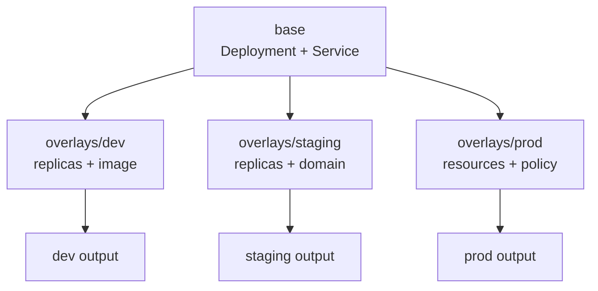

# Base và Overlays

## Hai khái niệm

**Base** là một thư mục có `kustomization.yaml` và các resource dùng chung. Base không biết overlay nào sử dụng nó.

**Overlay** là một Kustomization nạp base rồi thêm biến đổi cho một môi trường, một tenant hoặc một deployment target. Overlay là entry point mà CI/CD hoặc GitOps thường build và apply.



Quan hệ này tạo ra một chiều phụ thuộc: overlay phụ thuộc base, còn base không được phụ thuộc ngược lên overlay. Nếu base bắt đầu chứa nhiều điều kiện riêng cho môi trường, ranh giới đã bị phá vỡ và việc review sẽ khó hơn.

## Ví dụ hoàn chỉnh

Cấu trúc:

```text
app/
├── base/
│   ├── deployment.yaml
│   ├── service.yaml
│   └── kustomization.yaml
└── overlays/
    ├── dev/
    │   ├── kustomization.yaml
    │   └── deployment-patch.yaml
    └── prod/
        ├── kustomization.yaml
        └── deployment-patch.yaml
```

`overlays/dev/kustomization.yaml`:

```yaml
apiVersion: kustomize.config.k8s.io/v1beta1
kind: Kustomization

resources:
  - ../../base

namespace: app-dev
namePrefix: dev-

images:
  - name: example/web
    newName: registry.example.com/example/web
    newTag: dev-2026-03-01

patches:
  - path: deployment-patch.yaml
```

`overlays/dev/deployment-patch.yaml`:

```yaml
apiVersion: apps/v1
kind: Deployment
metadata:
  name: web
spec:
  replicas: 1
```

`overlays/prod/kustomization.yaml` có thể dùng cùng base nhưng quyết định khác:

```yaml
apiVersion: kustomize.config.k8s.io/v1beta1
kind: Kustomization

resources:
  - ../../base

namespace: app-prod
namePrefix: prod-

images:
  - name: example/web
    newName: registry.example.com/example/web
    newDigest: sha256:REPLACE_WITH_IMMUTABLE_DIGEST

patches:
  - path: deployment-patch.yaml
```

Target trong patch vẫn dùng tên resource gốc là `web`, không phải tên sau `namePrefix`. Kustomize áp dụng name transformation trong quá trình build và tự xử lý các reference mà nó nhận diện.

## Chọn những gì thuộc base

Đưa vào base:

- label và selector chung;
- container name, port, probe và security context chung;
- Service và policy cần có ở mọi môi trường;
- giá trị mặc định an toàn, không chứa credential môi trường.

Đưa vào overlay:

- namespace, image registry/tag/digest;
- replica và resource sizing theo capacity;
- hostname, ingress/gateway và external endpoint;
- feature flag, Secret source và policy chỉ áp dụng ở một môi trường.

Không dùng overlay chỉ để che giấu khác biệt quan trọng. Nếu staging có topology, dependency hoặc security boundary khác production, hãy thể hiện khác biệt đó trong file dễ review và kiểm thử riêng.

## Tránh drift giữa các overlay

Mỗi lần sửa base, build tất cả overlay. Một thay đổi hợp lệ cho `dev` có thể làm `prod` fail vì patch không còn match hoặc vì resource chung đã đổi schema.

```bash
for dir in overlays/*; do
  echo "Rendering $dir"
  kubectl kustomize "$dir" > "/tmp/$(basename "$dir").yaml"
done
```

Trong CI, nên kiểm tra thêm:

```bash
kubectl diff -k overlays/staging/
kubectl apply --dry-run=server -k overlays/staging/
```

`diff` cần cluster và context đúng. `--dry-run=server` gửi object đến API Server để validation/admission nhưng không persist object; nó không thay thế kiểm thử rollout hoặc kiểm tra image runtime.

## Khi overlay lồng quá sâu

Overlay nhiều tầng có thể hữu ích khi có một nhóm platform chung và nhiều team sử dụng, nhưng mỗi tầng làm tăng khoảng cách giữa file nguồn và output. Dấu hiệu cần tách lại:

- một field bị patch ở nhiều tầng;
- người review phải mở nhiều thư mục mới biết giá trị cuối;
- base chứa patch name theo môi trường;
- cùng một resource do nhiều công cụ cùng quản lý.

Giữ graph kế thừa ngắn, đặt tên thư mục theo mục đích và coi output render là artifact bắt buộc trong review.
