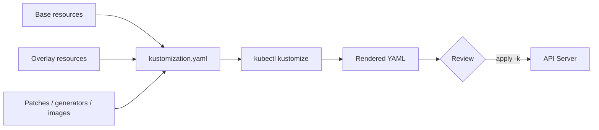

# Kustomize là gì?

## Vấn đề: một ứng dụng, nhiều môi trường

Một ứng dụng thường dùng cùng `Deployment`, `Service` và policy ở nhiều môi trường, nhưng mỗi môi trường có thể khác image tag, replica, resource limit, hostname hoặc namespace. Sao chép một bộ YAML cho mỗi môi trường tạo ra nhiều bản gần giống nhau. Khi sửa một field chung, người vận hành phải nhớ sửa mọi bản sao; thiếu một bản sẽ tạo configuration drift.

Kustomize giải quyết việc này bằng cách giữ resource đầu vào và các phép tùy biến trong source tree. Một build tạo ra một danh sách Kubernetes Resource Model (KRM) object cuối cùng để review hoặc gửi đến API Server.

## Mental model

Kustomize không phải template engine. Nó không thực hiện thay thế chuỗi `${ENV}` trên toàn bộ YAML. Thay vào đó, Kustomize đọc object có cấu trúc, nhận diện `kind`, `metadata.name`, field trong Pod template và các quan hệ resource, rồi áp dụng generator/transformer theo cấu hình.



Output render là điểm giao tiếp quan trọng: mọi người review output này thay vì đoán nhiều lớp kế thừa sẽ tạo ra object nào.

## `kustomization.yaml` là một build description

Một file tối thiểu thường có dạng:

```yaml
apiVersion: kustomize.config.k8s.io/v1beta1
kind: Kustomization

resources:
  - deployment.yaml
  - service.yaml
```

Các nhóm cấu hình thường gặp:

| Nhóm | Ví dụ | Vai trò |
| --- | --- | --- |
| Input | `resources` | Nạp file YAML hoặc một thư mục Kustomization khác. |
| Generate | `configMapGenerator`, `secretGenerator` | Sinh object từ file, literal hoặc env file. |
| Transform | `patches`, `images`, `labels`, `namespace` | Sửa object đã nạp theo quy tắc có cấu trúc. |
| Compose | `resources: - ../base` | Ghép base vào overlay. |

Về khái niệm, một build xử lý resource input, tạo thêm object từ generator, biến đổi danh sách object rồi xuất kết quả. Thứ tự và cách một field cụ thể được áp dụng phụ thuộc vào Kustomize version và loại transformer, vì vậy output thực tế luôn là nguồn kiểm tra cuối cùng.

## Kustomize và Helm

Hai công cụ đều có thể tạo manifests nhưng bắt đầu từ các giả định khác nhau:

| Tiêu chí | Kustomize | Helm |
| --- | --- | --- |
| Cách tùy biến | Patch và transformer trên YAML có cấu trúc. | Template Go, values và chart dependency. |
| Đầu vào | Manifest Kubernetes và `kustomization.yaml`. | Chart với template, metadata và values. |
| Release history | Không tự lưu release history. | Helm lưu release state và hỗ trợ upgrade/rollback theo release. |
| Độ phức tạp | Dễ kiểm tra khi khác biệt ít, cấu trúc rõ. | Mạnh hơn khi cần logic, đóng gói và phân phối chart. |
| Rủi ro thường gặp | Overlay chồng nhiều patch, khó biết ownership. | Template logic khó đọc hoặc render phụ thuộc values/context. |

Đây không phải lựa chọn tuyệt đối. Kustomize có thể được dùng phía trên output của Helm trong một số workflow, nhưng cần quy định rõ công cụ nào sở hữu từng field để tránh hai hệ thống cùng ghi một object.

## Khi nào nên và không nên dùng

Nên dùng Kustomize khi:

- phần lớn manifest dùng chung giữa các môi trường;
- khác biệt có thể mô tả bằng patch, image hoặc field có cấu trúc;
- team muốn review YAML sau render trong Git/CI;
- cần một công cụ gọn, tích hợp sẵn với `kubectl`.

Cần cân nhắc giải pháp khác khi:

- cần vòng lặp, điều kiện hoặc logic template phức tạp;
- cần đóng gói chart và dependency để phân phối cho nhiều team;
- cần release history độc lập với Git;
- cần controller liên tục reconcile và báo trạng thái deployment.

## Phân biệt render và reconcile

`kubectl kustomize` chỉ chạy build ở phía client. `kubectl apply -k` thêm bước gửi object đến API Server; sau đó `Deployment controller`, `ReplicaSet controller` và các controller khác mới reconcile desired state với cluster. Build thành công chỉ chứng minh YAML có thể được render, không chứng minh image tồn tại, RBAC đủ quyền, quota còn chỗ hoặc Pod sẽ Ready.

Các bước kiểm tra nên tách biệt:

```bash
kubectl kustomize overlays/dev/                 # build local
kubectl diff -k overlays/dev/                   # so với cluster
kubectl apply -k overlays/dev/                  # ghi desired state
kubectl rollout status deployment/my-app -n dev # kiểm tra rollout
```
