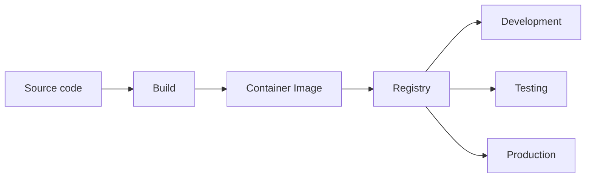
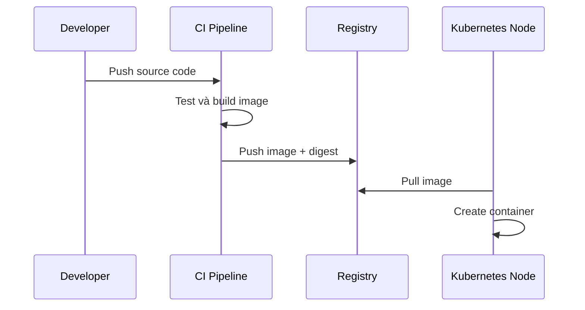

# Nền tảng Container

## Mục lục

- [Tổng quan](#tổng-quan)
- [1. Vấn đề Container giải quyết](#1-vấn-đề-container-giải-quyết)
- [2. Image và Container](#2-image-và-container)
- [3. Container hoạt động như thế nào](#3-container-hoạt-động-như-thế-nào)
- [4. Registry và vòng đời Image](#4-registry-và-vòng-đời-image)
- [5. Filesystem, Network và dữ liệu](#5-filesystem-network-và-dữ-liệu)
- [6. Container và Virtual Machine](#6-container-và-virtual-machine)
- [7. Từ Container đến Kubernetes](#7-từ-container-đến-kubernetes)
- [8. Thực hành với Docker](#8-thực-hành-với-docker)
- [9. Best practices](#9-best-practices)
- [10. Lỗi thường gặp](#10-lỗi-thường-gặp)
- [Tài liệu tham khảo](#tài-liệu-tham-khảo)

---

## Tổng quan

Container đóng gói ứng dụng cùng runtime, thư viện và cấu hình filesystem cần thiết thành một đơn vị có thể phân phối. Nhờ đó cùng một image có thể chạy nhất quán trên laptop, CI runner và server, miễn là môi trường có Container Runtime phù hợp.

Container không phải một máy ảo thu nhỏ. Nó là một hoặc nhiều process được cô lập, nhưng vẫn dùng chung kernel của host.

```text
┌────────────────────────────────────────────┐
│ Host kernel                                │
├──────────────┬──────────────┬──────────────┤
│ Container A  │ Container B  │ Container C  │
│ app + libs   │ app + libs   │ app + libs   │
│ isolated PID │ isolated net │ resource cap │
└──────────────┴──────────────┴──────────────┘
```

> [!IMPORTANT]
> Kubernetes không chạy source code trực tiếp. Kubernetes yêu cầu workload đã được đóng gói thành Container Image và có thể được Container Runtime trên Node tải về.

---

## 1. Vấn đề Container giải quyết

Trước Container, deployment thường phụ thuộc mạnh vào server:

- Phiên bản thư viện trên server khác laptop.
- Hai ứng dụng cần hai phiên bản runtime xung đột nhau.
- Quy trình cài đặt thủ công khó tái tạo.
- Rollback phải khôi phục nhiều package và file cấu hình.
- Môi trường dev, test và production không đồng nhất.

Container chuyển đơn vị release từ “một tập lệnh cài đặt” thành “một image bất biến”.



Cùng một digest của image nên được promote qua các môi trường. Không nên build lại cùng source riêng cho từng môi trường vì kết quả có thể khác nhau.

---

## 2. Image và Container

### 2.1 Container Image

Image là package chỉ đọc chứa:

- Filesystem của ứng dụng.
- Runtime và thư viện cần thiết.
- Metadata như entrypoint, command, environment mặc định và working directory.
- Các layer được đánh địa chỉ theo nội dung.

Image là **template**; Container là **instance đang chạy** của template đó.

| Khái niệm | Tương tự | Có thể chạy? | Có trạng thái ghi? |
|-----------|---------|--------------|--------------------|
| Image | Class hoặc bản cài đặt | Không | Các layer chỉ đọc |
| Container | Object hoặc process instance | Có | Có writable layer tạm thời |

### 2.2 Image layers

Mỗi instruction trong Dockerfile thường tạo hoặc ảnh hưởng một layer. Các layer được cache và tái sử dụng giữa nhiều image.

```dockerfile
FROM nginx:1.27-alpine
COPY index.html /usr/share/nginx/html/index.html
```

Image trên kế thừa các layer của NGINX và thêm layer chứa `index.html`.

Thứ tự instruction ảnh hưởng build cache. Đặt phần ít thay đổi trước, phần thay đổi thường xuyên sau.

### 2.3 Tag và digest

Một image reference có thể có dạng:

```text
docker.io/library/nginx:1.27-alpine
└ registry └ repository      └ tag
```

Tag là tên có thể trỏ sang nội dung mới. Digest xác định nội dung bất biến:

```text
nginx@sha256:<digest>
```

- Lab có thể dùng tag cố định theo phiên bản.
- Production nên cân nhắc pin digest để đảm bảo reproducibility.
- Tránh `latest`; tên này không cho biết phiên bản và thường kích hoạt pull policy khác trong Kubernetes.

### 2.4 Container lifecycle

Một Container tồn tại khi process chính còn chạy.

```text
created → running → exited
              │
              └→ paused / restarted tùy runtime và policy bên ngoài
```

Container không phải VM để đăng nhập và khởi động nhiều daemon tùy ý. Thiết kế phổ biến là một process chính có trách nhiệm rõ ràng; các process hỗ trợ chỉ đi cùng khi thực sự có cùng lifecycle.

---

## 3. Container hoạt động như thế nào

### 3.1 Linux namespaces

Namespaces tạo góc nhìn cô lập cho process:

| Namespace | Cô lập |
|-----------|--------|
| PID | Process ID và process tree |
| Network | Interface, route, port và firewall rule |
| Mount | Mount points và filesystem view |
| UTS | Hostname và domain name |
| IPC | Shared memory và message queue |
| User | User ID và group ID |

Cô lập không đồng nghĩa với ranh giới bảo mật tuyệt đối. Container vẫn dùng chung host kernel, nên kernel vulnerability hoặc cấu hình đặc quyền có thể phá vỡ isolation.

### 3.2 cgroups

Control groups giới hạn và đo tài nguyên:

- CPU time.
- Memory.
- Process count.
- I/O và các controller khác tùy hệ thống.

Kubernetes `resources.requests` và `resources.limits` cuối cùng được thực thi thông qua cơ chế của OS và Container Runtime, thường liên quan đến cgroups trên Linux.

### 3.3 Capabilities và security profile

Process `root` trong Container không nên mặc định có mọi quyền của host. Linux capabilities chia quyền root thành các đơn vị nhỏ hơn. Seccomp có thể giới hạn system calls; AppArmor hoặc SELinux kiểm soát truy cập bắt buộc.

Nguyên tắc:

- Chạy non-root khi có thể.
- Không dùng `--privileged` nếu không có lý do cụ thể.
- Drop capabilities không cần thiết.
- Dùng read-only root filesystem nếu ứng dụng hỗ trợ.

### 3.4 OCI và Container Runtime

Open Container Initiative định nghĩa các chuẩn quan trọng cho image và runtime. Các công cụ phổ biến:

| Thành phần | Vai trò |
|------------|---------|
| Docker/Podman | Trải nghiệm build và chạy Container cho người dùng |
| containerd/CRI-O | Runtime thường dùng trên Kubernetes Node |
| runc/crun | Low-level runtime tạo process cô lập |
| CRI | Giao diện Kubernetes dùng để nói chuyện với runtime |

> [!NOTE]
> Kubernetes không yêu cầu Docker Engine trên mỗi Node. Kubernetes giao tiếp với runtime qua Container Runtime Interface; containerd và CRI-O là các lựa chọn phổ biến.

---

## 4. Registry và vòng đời Image

Registry lưu và phân phối image. Ví dụ: Docker Hub, GitHub Container Registry, Amazon ECR, Google Artifact Registry hoặc registry nội bộ.



Một pipeline tốt thường gồm:

1. Build image từ source đã commit.
2. Chạy unit/integration tests.
3. Scan dependency và image vulnerability.
4. Tạo Software Bill of Materials nếu tổ chức yêu cầu.
5. Ký image hoặc provenance.
6. Push bằng tag có ý nghĩa và lưu digest.
7. Deploy đúng digest đã qua kiểm thử.

### 4.1 Public và private registry

Private registry yêu cầu credentials. Trong Kubernetes, Node hoặc Pod cần cơ chế xác thực như `imagePullSecrets` hay workload identity tích hợp với cloud provider.

Không ghi password registry trực tiếp vào manifest được commit công khai.

---

## 5. Filesystem, Network và dữ liệu

### 5.1 Writable layer là tạm thời

Mỗi Container có writable layer phía trên image layers. Khi Container bị xóa, dữ liệu trong layer này thường biến mất.

Dữ liệu quan trọng phải được đưa ra ngoài lifecycle của Container:

- Bind mount hoặc volume khi chạy local.
- PersistentVolume khi chạy trên Kubernetes.
- Object storage hoặc database bên ngoài khi phù hợp.

### 5.2 Port publishing

Container có network namespace riêng. `EXPOSE` trong Dockerfile chỉ là metadata; nó không tự publish port ra host.

```bash
docker run --name web -d -p 8080:80 nginx:1.27-alpine
```

- `8080`: port trên host.
- `80`: port mà process NGINX lắng nghe trong Container.

Kubernetes không dùng `docker -p`. Pod nhận IP riêng và Service cung cấp endpoint ổn định cùng load balancing.

### 5.3 Environment và configuration

Không bake cấu hình phụ thuộc môi trường vào image. Image nên giống nhau giữa dev, staging và production; cấu hình được inject qua environment variables, mounted files, ConfigMap hoặc Secret.

---

## 6. Container và Virtual Machine

| Tiêu chí | Container | Virtual Machine |
|----------|-----------|-----------------|
| Kernel | Dùng chung kernel host | Có guest OS và kernel riêng |
| Khởi động | Thường nhanh | Thường chậm hơn |
| Kích thước | Thường nhỏ hơn | Thường lớn hơn |
| Isolation | Process-level | Ranh giới VM mạnh hơn |
| Mật độ | Cao | Thấp hơn |
| Tính tương thích OS | Phụ thuộc kernel/platform | Linh hoạt hơn với guest OS |
| Use case | Đóng gói app, microservices, jobs | Isolation mạnh, legacy OS, boundary hạ tầng |

Container và VM thường được dùng cùng nhau: Kubernetes Node là VM, còn workload chạy trong Container trên VM đó.

---

## 7. Từ Container đến Kubernetes

Chạy một Container đơn lẻ khá đơn giản. Production đặt thêm câu hỏi:

- Nếu host chết, ai chạy Container ở host khác?
- Nếu process treo nhưng chưa exit, ai phát hiện?
- Làm sao chạy 20 replicas và cân bằng traffic?
- Làm sao rollout phiên bản mới mà không downtime?
- Làm sao quản lý CPU, memory, storage và secrets?
- Làm sao chọn Node phù hợp?

Kubernetes thêm lớp quản lý:

| Nhu cầu | Kubernetes primitive |
|---------|----------------------|
| Chạy Container | Pod |
| Duy trì và update replicas | Deployment |
| Endpoint ổn định | Service |
| Cấu hình ngoài image | ConfigMap, Secret |
| Dữ liệu bền vững | PersistentVolumeClaim |
| Health check | Liveness, Readiness, Startup Probe |
| Điều phối vị trí chạy | Scheduler, affinity, taints |

Kubernetes không thay thế việc xây image tốt. Image khởi động chậm, chạy root, không xử lý signal hoặc ghi dữ liệu sai chỗ vẫn gây vấn đề khi đưa vào Pod.

---

## 8. Thực hành với Docker

### 8.1 Chạy và quan sát Container

```bash
docker pull nginx:1.27-alpine
docker run --name web-demo -d -p 8080:80 nginx:1.27-alpine
docker ps
docker logs web-demo
curl http://localhost:8080
```

Quan sát process chính:

```bash
docker top web-demo
docker inspect web-demo
```

Xóa Container:

```bash
docker rm -f web-demo
```

### 8.2 Build image đơn giản

Tạo `index.html`:

```html
<!doctype html>
<html lang="vi">
  <body>
    <h1>Hello Container</h1>
  </body>
</html>
```

Tạo `Dockerfile`:

```dockerfile
FROM nginx:1.27-alpine
COPY index.html /usr/share/nginx/html/index.html
```

Build và chạy:

```bash
docker build -t web-demo:v1 .
docker run --rm -p 8080:80 web-demo:v1
```

### 8.3 Kiểm tra tính tạm thời của writable layer

```bash
docker run --name temp alpine:3.20 sh -c 'echo hello > /data.txt && cat /data.txt'
docker rm temp
docker run --rm alpine:3.20 sh -c 'test -f /data.txt || echo data-da-mat'
```

Container thứ hai được tạo từ image gốc nên không có `/data.txt` của Container trước.

---

## 9. Best practices

- **Image nhỏ nhưng đủ dùng:** giảm bề mặt tấn công và thời gian pull; không hy sinh khả năng debug mà không có chiến lược thay thế.
- **Multi-stage build:** không đưa compiler và source thừa vào runtime image.
- **Chạy non-root:** tạo user riêng và cấu hình permission rõ ràng.
- **Pin dependency:** giúp build tái tạo được.
- **Không lưu secret trong image:** layer cũ vẫn có thể chứa secret dù file đã bị xóa ở layer sau.
- **Xử lý signal:** process chính cần nhận `SIGTERM` và shutdown đúng thời hạn.
- **Ghi log ra stdout/stderr:** để platform thu thập tập trung.
- **Không ghi state quan trọng vào root filesystem:** dùng storage phù hợp.
- **Khai báo health endpoint:** tách readiness khỏi liveness khi cần.
- **Scan và cập nhật thường xuyên:** image bất biến không có nghĩa là không cần rebuild.

---

## 10. Lỗi thường gặp

| Triệu chứng | Nguyên nhân thường gặp | Kiểm tra |
|-------------|------------------------|----------|
| Container thoát ngay | Process chính đã kết thúc | `docker logs`, `docker inspect` |
| Không truy cập được app | Sai port hoặc app chỉ bind localhost | `docker port`, config listen address |
| `permission denied` | User trong image không có quyền | UID/GID và permission filesystem |
| Image quá lớn | Copy build artifacts, cache hoặc toolchain | `.dockerignore`, multi-stage build |
| Thay tag nhưng vẫn image cũ | Tag mutable hoặc pull policy/cache | So sánh image digest |
| Mất dữ liệu | Ghi vào writable layer | Dùng volume hoặc external storage |
| Không dừng sạch | Process không xử lý signal hoặc shell nuốt signal | Kiểm tra entrypoint và PID 1 |

---

## Tài liệu tham khảo

- [Kubernetes: What is Kubernetes?](https://kubernetes.io/docs/concepts/overview/what-is-kubernetes/)
- [Kubernetes Container Images](https://kubernetes.io/docs/concepts/containers/images/)
- [Open Container Initiative](https://opencontainers.org/)
- [Docker Build Best Practices](https://docs.docker.com/build/building/best-practices/)
- [Container Runtime Interface](/kien-truc/kubelet-container-runtime/)
