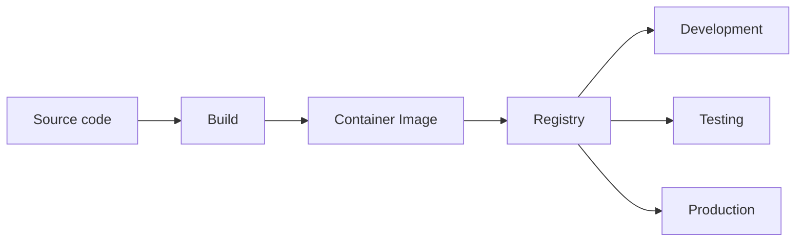
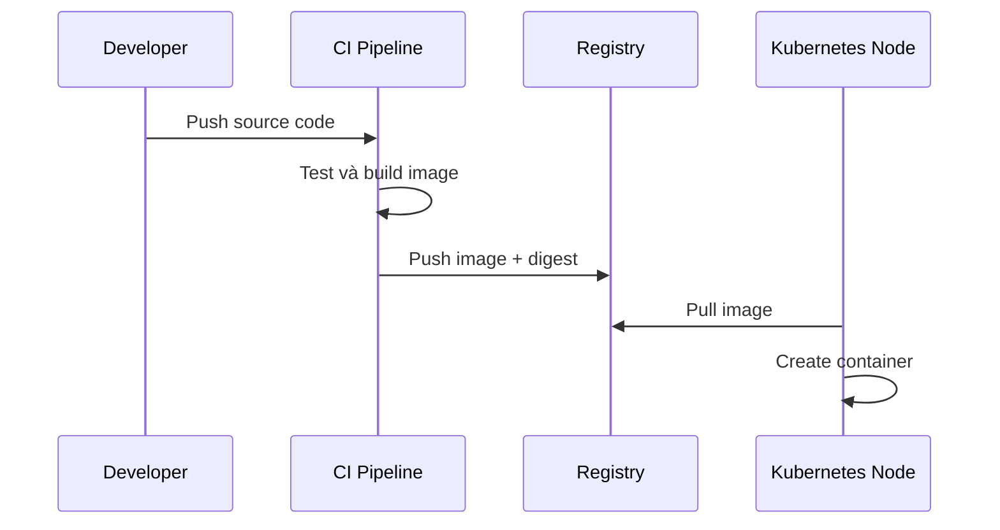

# Nền tảng Container

## Mục lục

- [Tổng quan](#tổng-quan)
- [1. Vấn đề Container giải quyết](#1-vấn-đề-container-giải-quyết)
- [2. Image và Container](#2-image-và-container)
- [3. Container hoạt động như thế nào](#3-container-hoạt-động-như-thế-nào)
- [4. Registry và vòng đời Image](#4-registry-và-vòng-đời-image)
- [5. Filesystem, Network và dữ liệu](#5-filesystem-network-và-dữ-liệu)
- [6. Container và Virtual Machine](#6-container-và-virtual-machine)
- [7. Từ Container đến Kubernetes](#7-từ-container-đến-kubernetes)
- [8. Thực hành với Docker](#8-thực-hành-với-docker)
- [9. Best practices](#9-best-practices)
- [10. Lỗi thường gặp](#10-lỗi-thường-gặp)
- [Tài liệu tham khảo](#tài-liệu-tham-khảo)

---

## Tổng quan

Container đóng gói ứng dụng cùng runtime, thư viện và cấu hình filesystem cần thiết thành một đơn vị có thể phân phối. Nhờ đó cùng một image có thể chạy nhất quán trên laptop, CI runner và server, miễn là môi trường có Container Runtime phù hợp.

Container không phải một máy ảo thu nhỏ. Nó là một hoặc nhiều process được cô lập, nhưng vẫn dùng chung kernel của host.

```text
┌────────────────────────────────────────────┐
│ Host kernel                                │
├──────────────┬──────────────┬──────────────┤
│ Container A  │ Container B  │ Container C  │
│ app + libs   │ app + libs   │ app + libs   │
│ isolated PID │ isolated net │ resource cap │
└──────────────┴──────────────┴──────────────┘
```

> [!IMPORTANT]
> Kubernetes không chạy source code trực tiếp. Kubernetes yêu cầu workload đã được đóng gói thành Container Image và có thể được Container Runtime trên Node tải về.

---

## 1. Vấn đề Container giải quyết

Trước Container, deployment thường phụ thuộc mạnh vào server:

- Phiên bản thư viện trên server khác laptop.
- Hai ứng dụng cần hai phiên bản runtime xung đột nhau.
- Quy trình cài đặt thủ công khó tái tạo.
- Rollback phải khôi phục nhiều package và file cấu hình.
- Môi trường dev, test và production không đồng nhất.

Container chuyển đơn vị release từ “một tập lệnh cài đặt” thành “một image bất biến”.



Cùng một digest của image nên được promote qua các môi trường. Không nên build lại cùng source riêng cho từng môi trường vì kết quả có thể khác nhau.

---

## 2. Image và Container

### 2.1 Container Image

Image là package chỉ đọc chứa:

- Filesystem của ứng dụng.
- Runtime và thư viện cần thiết.
- Metadata như entrypoint, command, environment mặc định và working directory.
- Các layer được đánh địa chỉ theo nội dung.

Image là **template**; Container là **instance đang chạy** của template đó.

| Khái niệm | Tương tự | Có thể chạy? | Có trạng thái ghi? |
|-----------|---------|--------------|--------------------|
| Image | Class hoặc bản cài đặt | Không | Các layer chỉ đọc |
| Container | Object hoặc process instance | Có | Có writable layer tạm thời |

### 2.2 Image layers

Mỗi instruction trong Dockerfile thường tạo hoặc ảnh hưởng một layer. Các layer được cache và tái sử dụng giữa nhiều image.

```dockerfile
FROM nginx:1.27-alpine
COPY index.html /usr/share/nginx/html/index.html
```

Image trên kế thừa các layer của NGINX và thêm layer chứa `index.html`.

Thứ tự instruction ảnh hưởng build cache. Đặt phần ít thay đổi trước, phần thay đổi thường xuyên sau.

### 2.3 Tag và digest

Một image reference có thể có dạng:

```text
docker.io/library/nginx:1.27-alpine
└ registry └ repository      └ tag
```

Tag là tên có thể trỏ sang nội dung mới. Digest xác định nội dung bất biến:

```text
nginx@sha256:<digest>
```

- Lab có thể dùng tag cố định theo phiên bản.
- Production nên cân nhắc pin digest để đảm bảo reproducibility.
- Tránh `latest`; tên này không cho biết phiên bản và thường kích hoạt pull policy khác trong Kubernetes.

### 2.4 Container lifecycle

Cách dễ nhất để hiểu vòng đời Container là: **Container chạy chừng nào process chính của nó còn chạy**. Process chính được khai báo bởi `ENTRYPOINT` hoặc `CMD` trong image và thường có PID 1 bên trong Container.

Ví dụ, nếu command chính là `nginx`, Container chạy trong lúc `nginx` còn chạy. Nếu `nginx` dừng hoặc gặp lỗi, Container chuyển sang trạng thái `exited`; filesystem tạm của Container vẫn còn cho đến khi Container bị xóa.

```text
Image
  │ create
  ▼
created ── start ──▶ running ── process chính kết thúc ──▶ exited
                       │                                      │
                       │ pause / unpause                      │ start / restart
                       ▼                                      └──────────────▶ running
                    paused
                                                              │ remove
                                                              ▼
                                                            removed
```

| Trạng thái | Điều gì đang xảy ra? |
|------------|----------------------|
| `created` | Runtime đã chuẩn bị Container nhưng chưa khởi động process chính. |
| `running` | Process chính đang chạy; Container có thể có thêm các process con. |
| `paused` | Các process tạm thời bị đóng băng, chưa bị kết thúc. |
| `exited` | Process chính đã kết thúc; Container không còn chạy nhưng log, metadata và writable layer vẫn có thể được kiểm tra. |
| `removed` | Container và writable layer của nó đã bị xóa; image gốc không bị xóa. |

`docker run` thực chất gộp hai bước `docker create` và `docker start`. Có thể quan sát việc process kết thúc kéo theo Container dừng bằng ví dụ sau:

```bash
docker run --name lifecycle-demo alpine:3.20 \
  sh -c 'echo "bat dau"; sleep 5; echo "ket thuc"'

docker ps                 # Không còn thấy Container đang chạy
docker ps -a              # Thấy lifecycle-demo ở trạng thái Exited
docker logs lifecycle-demo
docker rm lifecycle-demo
```

> [!IMPORTANT]
> Chạy với `-d` chỉ đưa Container xuống background, không làm nó sống mãi. Nếu process chính kết thúc thì Container vẫn dừng. Docker restart policy hoặc Kubernetes có thể khởi động lại workload, nhưng đó là hành động của lớp quản lý bên ngoài.

Container không nhất thiết chỉ có đúng một process. Nguyên tắc “một process chính” có nghĩa là Container nên có một nhiệm vụ và một lifecycle rõ ràng. Các process hỗ trợ chỉ nên chạy cùng khi chúng phải được khởi động, dừng và scale như một đơn vị.

---

## 3. Container hoạt động như thế nào

Container không phải là một “máy tính nhỏ” nằm bên trong host. Về bản chất, Container vẫn là **process bình thường chạy trên host**, nhưng Linux kernel đặt thêm các quy tắc xung quanh process đó.

Có thể nhớ bốn mảnh ghép như sau:

```text
Process của ứng dụng
│
├── namespaces ───── quyết định process nhìn thấy những gì
├── cgroups ──────── quyết định process dùng được bao nhiêu tài nguyên
├── security rules ─ quyết định process được phép làm gì
└── filesystem ───── cung cấp file từ image và một writable layer

Tất cả vẫn chạy bằng kernel của host.
```

Khi chạy `docker run nginx`, Docker không khởi động một hệ điều hành mới. Runtime lấy command từ image, tạo process `nginx`, chuẩn bị filesystem rồi yêu cầu kernel áp dụng isolation và giới hạn tài nguyên cho process đó.

### 3.1 Namespaces: tạo góc nhìn riêng cho Container

> [!IMPORTANT]
> **Namespace là tính năng của Linux kernel, không phải khái niệm do Container hay Docker tạo ra.** Container Runtime chỉ sử dụng nhiều Linux namespaces để cô lập process. Namespace cũng có thể được dùng mà không cần Container.

Namespace không phải là một “cái hộp” hay một kernel riêng. Nó là **góc nhìn được kernel áp dụng cho process**. Một process thường thuộc một namespace cho từng loại tài nguyên: một PID namespace, một Network namespace, một Mount namespace…

Có thể hiểu mối quan hệ như sau:

```text
Linux namespaces + cgroups + filesystem + security rules
                              │
                              │ được runtime cấu hình
                              ▼
                    Process chạy trong Container
```

Trên một máy Linux có nhiều danh sách dùng chung, chẳng hạn:

- Danh sách process đang chạy.
- Danh sách network interface, địa chỉ IP và port.
- Danh sách filesystem đang được mount.
- Hostname của máy.

Nếu không có namespaces, các process trên máy sẽ đọc cùng những danh sách này. **Namespace yêu cầu kernel chỉ đưa cho một nhóm process phần danh sách thuộc về nhóm đó.** Khi process gọi system call hoặc đọc thông tin hệ thống, kernel trả về kết quả theo namespace của process.

Vì vậy, ứng dụng trong Container có cảm giác như nó đang có process, network và filesystem riêng, dù tất cả vẫn nằm trên cùng host. Kernel vẫn quản lý toàn bộ resource; namespace chỉ thay đổi process đó được nhìn thấy phần nào.

```text
                         Linux host
┌─────────────────────────────────────────────────────────┐
│ Linux kernel quản lý tất cả process và resource         │
│                                                         │
│  Namespace của A             Namespace của B            │
│  ┌────────────────────┐      ┌────────────────────┐     │
│  │ nginx: PID 1       │      │ node: PID 1        │     │
│  │ IP: 172.17.0.2     │      │ IP: 172.17.0.3     │     │
│  │ filesystem của A   │      │ filesystem của B   │     │
│  └────────────────────┘      └────────────────────┘     │
│         Container A                 Container B         │
└─────────────────────────────────────────────────────────┘
```

#### Ví dụ 1: PID namespace

Giả sử host chạy hai Container. Mỗi Container có một process `sleep`:

```text
Nhìn từ host:
PID 4101  sleep 300   ← thuộc Container A
PID 4172  sleep 300   ← thuộc Container B

Nhìn từ bên trong Container A:
PID 1     sleep 300   ← chỉ thấy process của A

Nhìn từ bên trong Container B:
PID 1     sleep 300   ← chỉ thấy process của B
```

Không có hai process trùng PID trên cùng một danh sách. Mỗi PID namespace có cách đánh số riêng: kernel có thể hiển thị **cùng một process** là PID `4101` từ host nhưng là PID `1` từ bên trong Container A. Host hoặc process ở PID namespace cha có thể quan sát process ở namespace con; chiều ngược lại thì không.

Có thể tự quan sát bằng Docker:

```bash
docker run -d --name ns-demo alpine:3.20 sleep 300

docker exec ns-demo ps   # PID nhìn từ trong Container
docker top ns-demo       # PID nhìn từ host
docker rm -f ns-demo
```

#### Ví dụ 2: Network namespace

Network namespace cung cấp một network stack riêng gồm interface, IP, route và bảng port. Container A và B đều có thể chạy web server ở port `80` mà không xung đột:

```text
Container A: 172.17.0.2:80
Container B: 172.17.0.3:80
```

Mỗi Container có network interface, địa chỉ IP, routing table và danh sách port riêng. Khi dùng `-p 8080:80`, Docker chỉ tạo đường chuyển tiếp từ port `8080` của host đến port `80` trong network namespace của Container.

#### Ví dụ 3: Mount namespace

Khi process trong Container đọc thư mục `/`, nó thấy filesystem được dựng từ image và writable layer của Container. Nó không mặc định thấy **các thư mục tương ứng của host**, chẳng hạn `/home` hoặc `/etc` của host. Container vẫn có thể có `/etc` riêng do image cung cấp. Muốn Container thấy một thư mục từ host, phải mount thư mục đó vào Container một cách rõ ràng.

Ba namespace quan trọng nhất khi mới học là:

| Namespace | Tạo riêng cái gì? | Lệnh cho thấy sự khác biệt |
|-----------|-------------------|----------------------------|
| PID | Danh sách và ID của process | `ps` |
| Network | Interface, IP, route và port | `ip addr`, `ip route` |
| Mount | Danh sách mount và góc nhìn filesystem | `mount`, `ls /` |

Linux còn có UTS namespace cho hostname, IPC namespace cho shared memory/message queue và User namespace cho ánh xạ UID/GID. Chưa cần nhớ hết tên ở giai đoạn này; chỉ cần nhớ:

> [!IMPORTANT]
> Namespace không tạo một máy mới và không giới hạn CPU hoặc memory. Nó chỉ làm cho process trong Container nhận được **góc nhìn riêng** khi hỏi kernel về process, network, filesystem và các resource khác. cgroups mới là cơ chế giới hạn tài nguyên.

Tóm tắt:

```text
Namespace = process được nhìn thấy gì?
cgroups   = process được dùng bao nhiêu?
```

### 3.2 cgroups: process dùng được bao nhiêu?

Nếu namespaces giống như đặt process vào một căn phòng riêng, cgroups giống như đặt hạn mức điện, nước và số người cho căn phòng đó.

| Tài nguyên | cgroups có thể làm gì? | Khi chạm giới hạn |
|------------|------------------------|-------------------|
| CPU | Phân chia hoặc giới hạn CPU time | Process thường bị throttled, tức phải chạy chậm lại. |
| Memory | Giới hạn lượng memory được dùng | Process có thể bị OOM-killed nếu không thể cấp thêm memory. |
| PIDs | Giới hạn số process được tạo | Container không thể tạo thêm process khi đã đạt giới hạn. |
| I/O | Kiểm soát hoạt động đọc/ghi thiết bị | Tốc độ hoặc mức ưu tiên I/O có thể bị hạn chế. |

Ví dụ sau giới hạn Container ở `128 MiB` memory và `0.5` CPU:

```bash
docker run --rm --memory=128m --cpus=0.5 nginx:1.27-alpine
```

Trong Kubernetes:

- `resources.requests` giúp Scheduler chọn Node và có thể ảnh hưởng cách chia tài nguyên.
- `resources.limits` đặt mức tối đa; Container vượt memory limit có thể bị OOM-killed, còn vượt CPU limit thường bị throttled.

### 3.3 Security rules: process được phép làm gì?

Namespaces và cgroups không tạo ra ranh giới bảo mật tuyệt đối vì Container vẫn dùng chung kernel với host. Linux bổ sung nhiều lớp kiểm soát để giảm quyền của process:

| Cơ chế | Cách hiểu đơn giản |
|--------|--------------------|
| Non-root user | Không cho ứng dụng chạy với UID `0` nếu không cần thiết. |
| Linux capabilities | Chia quyền `root` thành các quyền nhỏ, ví dụ quyền bind port đặc biệt hoặc quản lý network. |
| Seccomp | Chặn những system call mà process không cần sử dụng. |
| AppArmor/SELinux | Giới hạn process được truy cập file và resource nào theo security policy. |
| Read-only root filesystem | Không cho process sửa filesystem gốc của Container. |

Ví dụ, một web server chỉ cần đọc file và mở port phục vụ request thì không nên có quyền thay đổi network của host hoặc load kernel module.

Các nguyên tắc nên áp dụng:

- Chạy non-root khi có thể.
- Không dùng `--privileged` nếu không có lý do cụ thể.
- Drop capabilities không cần thiết.
- Dùng read-only root filesystem nếu ứng dụng hỗ trợ.

> [!WARNING]
> `--privileged` mở rộng rất nhiều quyền và làm yếu phần lớn ranh giới giữa Container với host. Không dùng tùy tiện chỉ để sửa lỗi `permission denied`.

### 3.4 Runtime: ai tạo các process này?

Các tên Docker, containerd, CRI-O và runc dễ gây nhầm vì chúng nằm ở **những tầng khác nhau**, không phải tất cả đều là công cụ thay thế trực tiếp cho nhau.

```text
Chạy local:
Docker CLI / Podman
        │
        ▼
containerd hoặc lớp quản lý tương đương
        │
        ▼
runc / crun ──▶ Linux kernel

Trên Kubernetes Node:
kubelet ── CRI ──▶ containerd / CRI-O ──▶ runc / crun ──▶ Linux kernel
```

| Thành phần | Nhiệm vụ chính |
|------------|----------------|
| Docker/Podman | Cung cấp CLI và trải nghiệm build, pull, run Container cho người dùng. |
| kubelet | Yêu cầu runtime trên Kubernetes Node tạo hoặc dừng Container theo PodSpec. |
| CRI | Chuẩn giao tiếp giữa kubelet và Container Runtime; CRI không phải một runtime riêng. |
| containerd/CRI-O | Quản lý image, lifecycle và gọi low-level runtime trên Node. |
| runc/crun | Tạo process và cấu hình namespaces, cgroups cùng các security rule ở mức thấp. |
| Linux kernel | Thực thi process và các cơ chế isolation/resource control thật sự. |

OCI (Open Container Initiative) định nghĩa chuẩn cho định dạng image và cách low-level runtime chạy Container. Nhờ chuẩn chung, một OCI image có thể được nhiều công cụ và runtime tương thích sử dụng.

> [!NOTE]
> Kubernetes không yêu cầu Docker Engine trên mỗi Node. Kubelet giao tiếp với runtime qua CRI; containerd và CRI-O là hai lựa chọn phổ biến.

Tóm lại, hãy nhớ công thức:

```text
Container = process + filesystem từ image + isolation + resource limits
```

---

## 4. Registry và vòng đời Image

Registry lưu và phân phối image. Ví dụ: Docker Hub, GitHub Container Registry, Amazon ECR, Google Artifact Registry hoặc registry nội bộ.



Một pipeline tốt thường gồm:

1. Build image từ source đã commit.
2. Chạy unit/integration tests.
3. Scan dependency và image vulnerability.
4. Tạo Software Bill of Materials nếu tổ chức yêu cầu.
5. Ký image hoặc provenance.
6. Push bằng tag có ý nghĩa và lưu digest.
7. Deploy đúng digest đã qua kiểm thử.

### 4.1 Public và private registry

Private registry yêu cầu credentials. Trong Kubernetes, Node hoặc Pod cần cơ chế xác thực như `imagePullSecrets` hay workload identity tích hợp với cloud provider.

Không ghi password registry trực tiếp vào manifest được commit công khai.

---

## 5. Filesystem, Network và dữ liệu

### 5.1 Writable layer là tạm thời

Mỗi Container có writable layer phía trên image layers. Khi Container bị xóa, dữ liệu trong layer này thường biến mất.

Dữ liệu quan trọng phải được đưa ra ngoài lifecycle của Container:

- Bind mount hoặc volume khi chạy local.
- PersistentVolume khi chạy trên Kubernetes.
- Object storage hoặc database bên ngoài khi phù hợp.

### 5.2 Port publishing

Container có network namespace riêng. `EXPOSE` trong Dockerfile chỉ là metadata; nó không tự publish port ra host.

```bash
docker run --name web -d -p 8080:80 nginx:1.27-alpine
```

- `8080`: port trên host.
- `80`: port mà process NGINX lắng nghe trong Container.

Kubernetes không dùng `docker -p`. Pod nhận IP riêng và Service cung cấp endpoint ổn định cùng load balancing.

### 5.3 Environment và configuration

Không bake cấu hình phụ thuộc môi trường vào image. Image nên giống nhau giữa dev, staging và production; cấu hình được inject qua environment variables, mounted files, ConfigMap hoặc Secret.

---

## 6. Container và Virtual Machine

| Tiêu chí | Container | Virtual Machine |
|----------|-----------|-----------------|
| Kernel | Dùng chung kernel host | Có guest OS và kernel riêng |
| Khởi động | Thường nhanh | Thường chậm hơn |
| Kích thước | Thường nhỏ hơn | Thường lớn hơn |
| Isolation | Process-level | Ranh giới VM mạnh hơn |
| Mật độ | Cao | Thấp hơn |
| Tính tương thích OS | Phụ thuộc kernel/platform | Linh hoạt hơn với guest OS |
| Use case | Đóng gói app, microservices, jobs | Isolation mạnh, legacy OS, boundary hạ tầng |

Container và VM thường được dùng cùng nhau: Kubernetes Node là VM, còn workload chạy trong Container trên VM đó.

---

## 7. Từ Container đến Kubernetes

Chạy một Container đơn lẻ khá đơn giản. Production đặt thêm câu hỏi:

- Nếu host chết, ai chạy Container ở host khác?
- Nếu process treo nhưng chưa exit, ai phát hiện?
- Làm sao chạy 20 replicas và cân bằng traffic?
- Làm sao rollout phiên bản mới mà không downtime?
- Làm sao quản lý CPU, memory, storage và secrets?
- Làm sao chọn Node phù hợp?

Kubernetes thêm lớp quản lý:

| Nhu cầu | Kubernetes primitive |
|---------|----------------------|
| Chạy Container | Pod |
| Duy trì và update replicas | Deployment |
| Endpoint ổn định | Service |
| Cấu hình ngoài image | ConfigMap, Secret |
| Dữ liệu bền vững | PersistentVolumeClaim |
| Health check | Liveness, Readiness, Startup Probe |
| Điều phối vị trí chạy | Scheduler, affinity, taints |

Kubernetes không thay thế việc xây image tốt. Image khởi động chậm, chạy root, không xử lý signal hoặc ghi dữ liệu sai chỗ vẫn gây vấn đề khi đưa vào Pod.

---

## 8. Thực hành với Docker

### 8.1 Chạy và quan sát Container

```bash
docker pull nginx:1.27-alpine
docker run --name web-demo -d -p 8080:80 nginx:1.27-alpine
docker ps
docker logs web-demo
curl http://localhost:8080
```

Quan sát process chính:

```bash
docker top web-demo
docker inspect web-demo
```

Xóa Container:

```bash
docker rm -f web-demo
```

### 8.2 Build image đơn giản

Tạo `index.html`:

```html
<!doctype html>
<html lang="vi">
  <body>
    <h1>Hello Container</h1>
  </body>
</html>
```

Tạo `Dockerfile`:

```dockerfile
FROM nginx:1.27-alpine
COPY index.html /usr/share/nginx/html/index.html
```

Build và chạy:

```bash
docker build -t web-demo:v1 .
docker run --rm -p 8080:80 web-demo:v1
```

### 8.3 Kiểm tra tính tạm thời của writable layer

```bash
docker run --name temp alpine:3.20 sh -c 'echo hello > /data.txt && cat /data.txt'
docker rm temp
docker run --rm alpine:3.20 sh -c 'test -f /data.txt || echo data-da-mat'
```

Container thứ hai được tạo từ image gốc nên không có `/data.txt` của Container trước.

---

## 9. Best practices

- **Image nhỏ nhưng đủ dùng:** giảm bề mặt tấn công và thời gian pull; không hy sinh khả năng debug mà không có chiến lược thay thế.
- **Multi-stage build:** không đưa compiler và source thừa vào runtime image.
- **Chạy non-root:** tạo user riêng và cấu hình permission rõ ràng.
- **Pin dependency:** giúp build tái tạo được.
- **Không lưu secret trong image:** layer cũ vẫn có thể chứa secret dù file đã bị xóa ở layer sau.
- **Xử lý signal:** process chính cần nhận `SIGTERM` và shutdown đúng thời hạn.
- **Ghi log ra stdout/stderr:** để platform thu thập tập trung.
- **Không ghi state quan trọng vào root filesystem:** dùng storage phù hợp.
- **Khai báo health endpoint:** tách readiness khỏi liveness khi cần.
- **Scan và cập nhật thường xuyên:** image bất biến không có nghĩa là không cần rebuild.

---

## 10. Lỗi thường gặp

| Triệu chứng | Nguyên nhân thường gặp | Kiểm tra |
|-------------|------------------------|----------|
| Container thoát ngay | Process chính đã kết thúc | `docker logs`, `docker inspect` |
| Không truy cập được app | Sai port hoặc app chỉ bind localhost | `docker port`, config listen address |
| `permission denied` | User trong image không có quyền | UID/GID và permission filesystem |
| Image quá lớn | Copy build artifacts, cache hoặc toolchain | `.dockerignore`, multi-stage build |
| Thay tag nhưng vẫn image cũ | Tag mutable hoặc pull policy/cache | So sánh image digest |
| Mất dữ liệu | Ghi vào writable layer | Dùng volume hoặc external storage |
| Không dừng sạch | Process không xử lý signal hoặc shell nuốt signal | Kiểm tra entrypoint và PID 1 |

---

## Tài liệu tham khảo

- [Kubernetes: What is Kubernetes?](https://kubernetes.io/docs/concepts/overview/what-is-kubernetes/)
- [Kubernetes Container Images](https://kubernetes.io/docs/concepts/containers/images/)
- [Open Container Initiative](https://opencontainers.org/)
- [Docker Build Best Practices](https://docs.docker.com/build/building/best-practices/)
- [Container Runtime Interface](/kien-truc/kubelet-container-runtime/)
