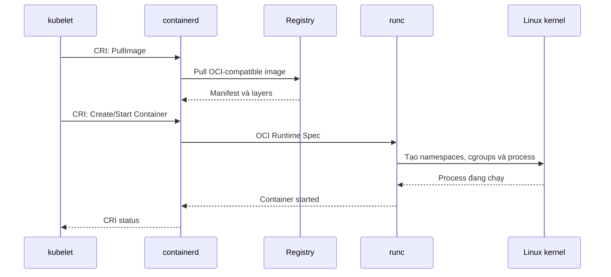
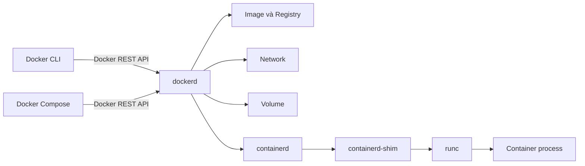
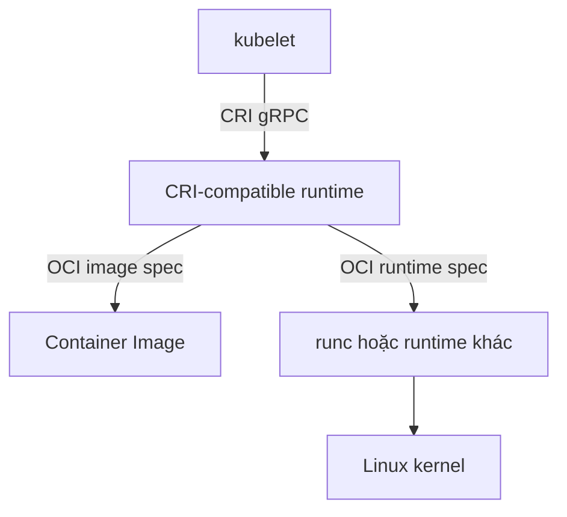
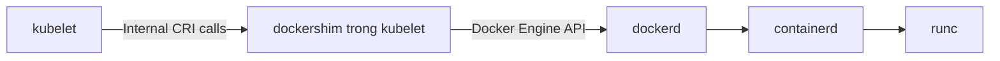
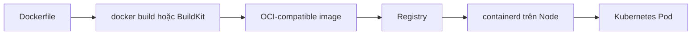

# Docker, containerd và lịch sử dockershim

## Mục lục

- [Tổng quan](#tổng-quan)
- [CRI và OCI trong 60 giây](#cri-và-oci-trong-60-giây)
- [1. Đính chính hiểu lầm phổ biến](#1-đính-chính-hiểu-lầm-phổ-biến)
- [2. Docker thực sự gồm những gì](#2-docker-thực-sự-gồm-những-gì)
- [3. containerd là gì](#3-containerd-là-gì)
- [4. runc và low-level runtime](#4-runc-và-low-level-runtime)
- [5. OCI và CRI khác nhau như thế nào](#5-oci-và-cri-khác-nhau-như-thế-nào)
- [6. Kubernetes từng kết nối Docker như thế nào](#6-kubernetes-từng-kết-nối-docker-như-thế-nào)
- [7. Vì sao dockershim xuất hiện](#7-vì-sao-dockershim-xuất-hiện)
- [8. Vì sao Kubernetes loại bỏ dockershim](#8-vì-sao-kubernetes-loại-bỏ-dockershim)
- [9. Dòng thời gian chuyển đổi](#9-dòng-thời-gian-chuyển-đổi)
- [10. Kiến trúc trước và sau khi loại bỏ dockershim](#10-kiến-trúc-trước-và-sau-khi-loại-bỏ-dockershim)
- [11. Docker và containerd khác nhau thế nào](#11-docker-và-containerd-khác-nhau-thế-nào)
- [12. Docker-built images có còn chạy không](#12-docker-built-images-có-còn-chạy-không)
- [13. Ảnh hưởng đối với developer](#13-ảnh-hưởng-đối-với-developer)
- [14. Ảnh hưởng đối với cluster operator](#14-ảnh-hưởng-đối-với-cluster-operator)
- [15. Docker socket và build image trong cluster](#15-docker-socket-và-build-image-trong-cluster)
- [16. Có thể tiếp tục dùng Docker Engine không](#16-có-thể-tiếp-tục-dùng-docker-engine-không)
- [17. Công cụ CLI tương ứng](#17-công-cụ-cli-tương-ứng)
- [18. Cách xác định runtime cluster đang dùng](#18-cách-xác-định-runtime-cluster-đang-dùng)
- [19. Cấu hình containerd cho Kubernetes](#19-cấu-hình-containerd-cho-kubernetes)
- [20. Chiến lược migration từ Docker Engine](#20-chiến-lược-migration-từ-docker-engine)
- [21. Thực hành với kind](#21-thực-hành-với-kind)
- [22. Troubleshooting](#22-troubleshooting)
- [23. Câu hỏi thường gặp](#23-câu-hỏi-thường-gặp)
- [24. Mental model cần ghi nhớ](#24-mental-model-cần-ghi-nhớ)
- [Tài liệu tham khảo](#tài-liệu-tham-khảo)

---

## Tổng quan

Năm 2020, thông báo “Kubernetes deprecates Docker” gây ra nhiều hiểu lầm. Nhiều người cho rằng:

- Kubernetes sẽ không chạy được image build bằng Docker.
- Dockerfile không còn sử dụng được.
- Docker đã bị loại khỏi hệ sinh thái Container.
- containerd là một định dạng Container mới không tương thích với Docker.

Tất cả các kết luận trên đều sai.

Điều Kubernetes deprecate ở phiên bản 1.20 và loại bỏ ở phiên bản 1.24 là **dockershim**: đoạn mã tích hợp đặc biệt nằm bên trong kubelet để kubelet điều khiển Docker Engine. Kubernetes không loại bỏ khả năng chạy OCI image do Docker build ra.

```text
Thứ bị loại bỏ: kubelet → dockershim → Docker Engine

Thứ không bị loại bỏ:
- Dockerfile
- docker build
- Docker Desktop dùng cho development
- Docker Registry hoặc Docker Hub
- OCI images do Docker tạo
- Container nói chung
```

> [!IMPORTANT]
> [!TIP]
> Hãy tách hai câu hỏi: “Dùng công cụ nào để build image?” và “Kubernetes Node dùng runtime nào để chạy Pod?”. Bạn hoàn toàn có thể build bằng Docker trên laptop nhưng chạy image đó bằng containerd trên Kubernetes Node.

---

## CRI và OCI trong 60 giây

Đây là phần quan trọng nhất để không bị nhầm giữa Docker, containerd, CRI và OCI.

### Cách nhớ ngắn nhất

```text
CRI = Kubernetes nói chuyện với Container Runtime
OCI = Chuẩn Image và cách chạy Container process
```

CRI và OCI **không phải hai runtime cạnh tranh với nhau**. Chúng ở hai tầng khác nhau:

```text
Kubernetes
    │
    │ CRI: kubelet ra lệnh cho runtime
    ▼
containerd / CRI-O
    │
    │ OCI: chuẩn image và chuẩn khởi động process
    ▼
runc / crun
    │
    ▼
Linux process
```

### CRI là gì?

**CRI — Container Runtime Interface** là giao diện do Kubernetes định nghĩa để `kubelet` giao tiếp với Container Runtime.

Khi Pod cần chạy, kubelet có thể gửi các yêu cầu CRI như:

```text
PullImage
RunPodSandbox
CreateContainer
StartContainer
StopContainer
RemoveContainer
ContainerStatus
ListContainers
```

CRI là một API dựa trên gRPC. Nó hiểu các khái niệm Kubernetes cần, chẳng hạn:

- Pod sandbox.
- Container thuộc một Pod.
- Image service.
- Runtime service.
- Container status.
- Exec và attach.

Các đường đi hợp lệ có thể là:

```text
kubelet → CRI → containerd
kubelet → CRI → CRI-O
kubelet → CRI → cri-dockerd → Docker Engine
```

### OCI là gì?

**OCI — Open Container Initiative** là bộ tiêu chuẩn chung cho hệ sinh thái Container. Hai phần quan trọng nhất là:

| OCI specification | Trả lời câu hỏi |
|-------------------|-----------------|
| **OCI Image Spec** | Image được đóng gói thành manifest, config và filesystem layers như thế nào? |
| **OCI Runtime Spec** | Runtime phải tạo process, namespace, cgroup, mount và capability như thế nào? |

`runc` là một implementation phổ biến của OCI Runtime Spec.

OCI không biết Kubernetes là gì và không có khái niệm Deployment, Service hay Pod. OCI chỉ chuẩn hóa image và cách chạy process.

### Ví dụ từng bước

Khi bạn build image bằng Docker:

```bash
docker build -t registry.example.com/web:v1 .
docker push registry.example.com/web:v1
```

Image được tạo ra có format tương thích với Docker/OCI. Khi Pod được deploy lên Kubernetes:

```text
1. kubectl gửi Pod object đến API Server
2. Scheduler chọn Node
3. kubelet trên Node phát hiện Pod mới
4. kubelet gọi containerd bằng CRI
5. containerd pull OCI-compatible image
6. containerd chuẩn bị filesystem và config
7. containerd gọi runc theo OCI Runtime Spec
8. runc yêu cầu Linux kernel tạo process
```

Sơ đồ đầy đủ:



### So sánh bằng phép ẩn dụ nhà máy

| Thành phần | Trong nhà máy |
|------------|----------------|
| kubelet | Người điều phối công việc |
| CRI | Mẫu phiếu giao việc giữa điều phối viên và nhà máy |
| containerd | Quản lý nhà máy |
| OCI Image Spec | Chuẩn đóng gói nguyên liệu/sản phẩm |
| OCI Runtime Spec | Hướng dẫn vận hành máy |
| runc | Máy trực tiếp tạo process |

CRI nói **phải làm gì với Pod và Container**. OCI nói **image được đóng gói ra sao và process được khởi chạy ra sao**.

### Bảng phân biệt nhanh

| Câu hỏi | Câu trả lời |
|----------|-------------|
| Kubelet giao tiếp với runtime qua gì? | CRI |
| Image build bằng Docker có chạy trên containerd không? | Có, nếu image tương thích OCI/Docker format |
| Runtime nào tạo Linux process ở tầng thấp? | runc, crun hoặc OCI runtime khác |
| OCI có hiểu Pod không? | Không |
| CRI có định nghĩa Dockerfile không? | Không |
| containerd có phải OCI không? | Không; containerd là runtime sử dụng các chuẩn OCI |
| runc có phải CRI runtime không? | Không; runc là low-level OCI runtime |
| Docker Engine có implement CRI trực tiếp không? | Không; Kubernetes cần dockershim trước đây hoặc cri-dockerd hiện nay |

### Ba dòng cần ghi nhớ

```text
Docker/BuildKit  ──build──▶ OCI-compatible image ──push──▶ Registry

kubelet ──CRI──▶ containerd hoặc CRI-O

containerd/CRI-O ──OCI Runtime Spec──▶ runc/crun ──▶ Linux process
```

---

## 1. Đính chính hiểu lầm phổ biến

Cách nói “Kubernetes trước đây được xây dựng bằng Docker rồi chuyển sang containerd” chưa hoàn toàn chính xác.

Cách diễn đạt đúng hơn:

> Các phiên bản Kubernetes đầu tiên chỉ hỗ trợ Docker Engine làm Container Runtime. kubelet có mã tích hợp trực tiếp với Docker Engine. Khi Kubernetes chuẩn hóa Container Runtime Interface, Docker Engine không implement CRI, vì vậy Kubernetes duy trì một adapter nội bộ tên dockershim. Adapter này bị deprecate trong Kubernetes 1.20 và bị loại khỏi mã nguồn Kubernetes từ 1.24.

Kubernetes vẫn có thể được:

- Build trong môi trường sử dụng Container.
- Test bằng cluster chạy trong Docker như `kind`.
- Dùng Docker để build application image.
- Chạy trên Node có Docker Engine nếu cài adapter CRI bên ngoài là `cri-dockerd`.

Thay đổi chỉ nằm ở đường giao tiếp giữa **kubelet** và **Node Container Runtime**.

### 1.1 Ba ngữ cảnh thường bị trộn lẫn

| Ngữ cảnh | Công cụ có thể dùng | Câu hỏi chính |
|----------|---------------------|---------------|
| Development | Docker Desktop, Docker Engine, Podman | Làm sao build và test image? |
| CI/CD | BuildKit, Docker Buildx, Buildah, remote builder | Làm sao tạo, scan, ký và push image? |
| Kubernetes Node | containerd, CRI-O, Docker Engine qua cri-dockerd | kubelet dùng CRI nào để chạy Pod? |

Một tổ chức có thể dùng Docker ở lớp development, BuildKit trong CI và containerd trên production Nodes mà không có mâu thuẫn.

---

## 2. Docker thực sự gồm những gì

Từ “Docker” có thể chỉ nhiều thứ:

- Công ty hoặc hệ sinh thái Docker.
- Docker Desktop.
- Docker CLI `docker`.
- Docker Engine.
- Docker daemon `dockerd`.
- Dockerfile và build tooling.
- Docker Hub hoặc registry.
- Container Image do Docker build.

Khi thảo luận Kubernetes runtime, thành phần quan trọng là **Docker Engine**, không phải toàn bộ Docker platform.

### 2.1 Docker client-server architecture



Docker CLI là client thân thiện với con người. Khi chạy:

```bash
docker run --name web -p 8080:80 nginx:1.27-alpine
```

CLI gửi request đến `dockerd`. Docker daemon phối hợp image, network, volume và lifecycle. Ở tầng dưới, Docker Engine sử dụng containerd và thường dùng runc để tạo process Container.

### 2.2 Docker Engine cung cấp nhiều tính năng hơn Node runtime tối thiểu

Docker Engine có trải nghiệm dành cho developer:

- `docker build` và BuildKit integration.
- `docker compose`.
- Network và volume management theo Docker model.
- API và CLI quản lý Container.
- Registry login, pull và push.
- Plugin ecosystem.
- Developer-friendly defaults.

Kubernetes đã có API và controller riêng để quản lý workload, network, storage và desired state. Nhiều lớp UX của Docker Engine không cần thiết trên Kubernetes Node.

### 2.3 Docker Engine chứa containerd không có nghĩa hai sản phẩm giống nhau

Docker Engine dùng containerd như một thành phần bên dưới, nhưng còn thêm:

- `dockerd`.
- Docker API.
- Docker-specific networking và volume behavior.
- Build và developer workflow.
- Docker object model.

containerd độc lập không cung cấp toàn bộ trải nghiệm `docker` CLI và Docker Compose theo mặc định.

---

## 3. containerd là gì

containerd là một industry-standard Container Runtime, là dự án graduated của CNCF. Nó chạy dạng daemon trên Linux hoặc Windows và quản lý lifecycle Container trên một host.

Các trách nhiệm chính:

- Pull và push images.
- Lưu image theo content-addressable storage.
- Quản lý snapshots/filesystem layers.
- Tạo, start, stop và xóa Container.
- Giám sát Container process.
- Tích hợp OCI runtime như runc.
- Cung cấp API để hệ thống cấp cao hơn điều khiển.
- Cung cấp CRI plugin để kubelet giao tiếp.

```text
Kubernetes không cần một UX dành cho developer trên mỗi Node.
Kubernetes cần runtime API ổn định để:

- Pull image
- Tạo Pod sandbox
- Tạo/start/stop Container
- Đọc trạng thái
- Thu thập logs/metrics cần thiết
- Exec/attach/port-forward thông qua runtime service
```

### 3.1 containerd có thể dùng ngoài Kubernetes

containerd không chỉ dành cho Kubernetes. Docker Engine cũng dùng containerd. Các hệ thống khác có thể dùng API containerd trực tiếp.

Tuy nhiên, khi dùng với Kubernetes, cần bật CRI plugin và cấu hình runtime endpoint đúng.

Trên Linux, socket mặc định thường là:

```text
/run/containerd/containerd.sock
```

### 3.2 containerd namespaces

containerd có khái niệm namespace để cô lập metadata giữa các client. Kubernetes thường dùng namespace:

```text
k8s.io
```

Vì vậy command `ctr containers list` có thể không thấy Kubernetes Containers, trong khi command sau thấy:

```bash
sudo ctr --namespace k8s.io containers list
```

Đây là containerd namespace, không phải Kubernetes Namespace.

---

## 4. runc và low-level runtime

runc là low-level OCI runtime phổ biến. Nó nhận OCI bundle/spec rồi yêu cầu kernel tạo process với namespaces, cgroups, capabilities, mounts và các thiết lập isolation.

```text
Kubernetes object
    ↓
kubelet
    ↓ CRI
containerd
    ↓ OCI runtime invocation
runc
    ↓ Linux kernel
container process
```

### 4.1 Vì sao cần containerd-shim

containerd không nên trở thành parent process trực tiếp của mọi Container trong toàn bộ lifecycle. `containerd-shim` giúp:

- Giữ stdio và exit status.
- Cho phép Container tiếp tục chạy nếu containerd daemon restart.
- Tách lifecycle của runtime daemon khỏi process Container.
- Giám sát process và báo trạng thái lại.

Tên “shim” ở đây không phải `dockershim`. Hai thứ có mục đích khác nhau:

| Thành phần | Vị trí | Vai trò |
|------------|--------|---------|
| dockershim | Từng nằm trong kubelet | Chuyển CRI semantics sang Docker Engine API |
| containerd-shim | Thuộc containerd stack | Quản lý process lifecycle giữa containerd và OCI runtime |

Loại bỏ dockershim không có nghĩa mọi thành phần tên “shim” đều bị loại bỏ.

---

## 5. OCI và CRI khác nhau như thế nào

OCI và CRI giải quyết hai lớp khác nhau.

### 5.1 OCI

Open Container Initiative định nghĩa các chuẩn như:

- **OCI Image Specification:** image manifest, configuration và layers được đóng gói thế nào.
- **OCI Runtime Specification:** runtime nhận bundle/config và chạy Container process thế nào.
- **OCI Distribution Specification:** cách phân phối content qua registry API.

OCI tạo khả năng tương thích giữa Docker, containerd, CRI-O, BuildKit, registries và nhiều công cụ khác.

### 5.2 CRI

Container Runtime Interface là giao diện gRPC do Kubernetes định nghĩa giữa kubelet và Container Runtime.

CRI tập trung vào nhu cầu ở mức Pod:

- Runtime service.
- Image service.
- Pod sandbox lifecycle.
- Container lifecycle.
- Status và stats.
- Exec, attach và port-forward streaming.



### 5.3 So sánh

| Tiêu chí | OCI | CRI |
|----------|-----|-----|
| Chủ thể chính | Open Container Initiative | Kubernetes project |
| Phạm vi | Image, distribution, low-level runtime | kubelet ↔ Node runtime |
| Mức abstraction | Container image/process | Pod sandbox và Container lifecycle |
| Ví dụ implementation | runc, OCI images | containerd CRI plugin, CRI-O, cri-dockerd |
| Có dành riêng cho Kubernetes? | Không | Có |

Docker-built image tiếp tục chạy vì image tuân theo chuẩn OCI, dù Docker Engine không implement CRI trực tiếp.

---

## 6. Kubernetes từng kết nối Docker như thế nào

Các phiên bản Kubernetes ban đầu chỉ hỗ trợ Docker Engine. kubelet có logic gọi Docker Engine để:

- Pull images.
- Tạo infrastructure Container cho Pod.
- Tạo và start application Containers.
- Thu thập status.
- Quản lý logs và lifecycle.

Kiến trúc đơn giản hóa:

```text
kubelet
   │ Docker-specific integration
   ▼
Docker Engine (dockerd)
   ▼
containerd
   ▼
runc
   ▼
Container process
```

Lựa chọn này hợp lý trong bối cảnh ban đầu:

- Docker là công cụ Container phổ biến nhất.
- Hệ sinh thái runtime còn ít lựa chọn.
- OCI và CRI chưa tồn tại hoặc chưa trưởng thành.
- Kubernetes cần chứng minh mô hình orchestration trước.

Vấn đề xuất hiện khi Kubernetes muốn hỗ trợ nhiều runtime. Nếu mỗi runtime cần một integration riêng trong kubelet, kubelet sẽ chứa nhiều vendor-specific code và hành vi không nhất quán.

---

## 7. Vì sao dockershim xuất hiện

Kubernetes tạo CRI để kubelet dùng một giao diện chung với nhiều runtime. Runtime chỉ cần implement CRI thay vì yêu cầu kubelet chứa integration riêng.

Nhưng Docker Engine có trước CRI và không implement CRI. Kubernetes vẫn có lượng người dùng Docker Engine rất lớn, nên không thể chuyển đổi ngay.

Giải pháp chuyển tiếp là **dockershim**:



Dockershim dịch giữa:

- Model và lời gọi Kubernetes CRI.
- Docker Engine API và behavior.

Từ “shim” cho thấy đây là lớp tương thích mỏng, được kỳ vọng là giải pháp chuyển tiếp chứ không phải kiến trúc dài hạn.

### 7.1 Tại sao không để kubelet gọi containerd bên trong Docker Engine

containerd bên trong Docker Engine là implementation detail do `dockerd` quản lý. Kubernetes cần một endpoint CRI với semantics về Pod sandbox, image service, runtime service và lifecycle mà kubelet mong đợi.

Docker Engine không trở thành CRI-compatible chỉ vì nó sử dụng containerd bên dưới. Đường gọi chính thức của Docker vẫn là:

```text
client → Docker API → dockerd → containerd
```

Trong khi Kubernetes muốn:

```text
kubelet → CRI → runtime
```

---

## 8. Vì sao Kubernetes loại bỏ dockershim

### 8.1 Gánh nặng bảo trì

Dockershim nằm trong codebase Kubernetes, nên Kubernetes maintainers phải:

- Sửa bug integration Docker-specific.
- Kiểm thử thêm một đường runtime đặc biệt.
- Đồng bộ behavior với CRI runtimes.
- Duy trì code không thuộc trách nhiệm cốt lõi của kubelet.
- Hỗ trợ edge cases từ Docker API và configuration.

Mỗi tính năng Node mới phải cân nhắc cả CRI-native path lẫn dockershim path.

### 8.2 Thêm lớp không cần thiết

Với Docker Engine:

```text
kubelet → dockershim → dockerd → containerd → shim → runc
```

Với containerd CRI:

```text
kubelet → containerd CRI plugin → shim → runc
```

Đường trực tiếp giảm daemon/layer, giảm overhead vận hành và giảm nơi có thể xảy ra lỗi.

### 8.3 Chuẩn hóa trên CRI

CRI cho phép runtime cạnh tranh và phát triển độc lập:

- containerd.
- CRI-O.
- Các runtime handler khác qua RuntimeClass.
- Docker Engine nếu có external CRI adapter.

Kubernetes không phải duy trì vendor-specific adapter trong core.

### 8.4 Khả năng hỗ trợ tính năng mới

Kubernetes maintainers nêu các khu vực như cgroups v2 và user namespaces có thể phát triển thuận lợi hơn trên CRI runtimes hiện đại thay vì bị ràng buộc bởi dockershim compatibility.

### 8.5 Ranh giới trách nhiệm rõ ràng

Sau khi loại bỏ:

- Kubernetes chịu trách nhiệm CRI contract và kubelet behavior.
- Runtime project chịu trách nhiệm implement CRI.
- Docker/Mirantis có thể duy trì adapter Docker Engine bên ngoài nếu có nhu cầu.

Đây là cách tổ chức phù hợp hơn với open-source ecosystem.

---

## 9. Dòng thời gian chuyển đổi

| Thời điểm | Sự kiện | Ý nghĩa |
|-----------|---------|---------|
| 2013 | Docker phổ biến Container workflow | Developer có UX build/run/package dễ dùng |
| 2014 | Kubernetes được open source | Docker Engine là runtime ban đầu |
| 2015 | OCI được thành lập | Chuẩn hóa image và runtime formats |
| 2016, Kubernetes 1.5 | CRI được giới thiệu | kubelet có giao diện runtime chung |
| 2017 | containerd được đóng góp vào CNCF | Runtime tách thành dự án độc lập |
| 2019 | containerd trở thành CNCF graduated project | Mức trưởng thành production cao |
| 2020, Kubernetes 1.20 | dockershim bị deprecate | Cảnh báo chính thức và bắt đầu migration |
| 2022, Kubernetes 1.24 | dockershim bị loại khỏi Kubernetes | kubelet không còn tích hợp Docker Engine trực tiếp |
| Kubernetes 1.23 | CRI API v1 stable | Giao diện CRI v1 đạt stable |
| Kubernetes 1.26+ | kubelet yêu cầu CRI v1 | Runtime không hỗ trợ CRI v1 khiến Node không register |

> [!NOTE]
> Kế hoạch removal từng thay đổi trong quá trình cộng đồng đánh giá mức sẵn sàng. Mốc thực tế cần nhớ là deprecation ở 1.20 và removal ở 1.24.

---

## 10. Kiến trúc trước và sau khi loại bỏ dockershim

### 10.1 Trước Kubernetes 1.24 với Docker Engine

```text
┌──────────────── Kubernetes Node ────────────────┐
│                                                │
│ kubelet                                        │
│    │                                           │
│    ▼                                           │
│ dockershim (in-tree, thuộc kubelet/Kubernetes) │
│    │ Docker Engine API                         │
│    ▼                                           │
│ dockerd                                        │
│    │                                           │
│    ▼                                           │
│ containerd                                     │
│    │                                           │
│    ▼                                           │
│ containerd-shim → runc → application process  │
└────────────────────────────────────────────────┘
```

### 10.2 Kubernetes hiện đại với containerd

```text
┌──────────────── Kubernetes Node ───────────────┐
│                                               │
│ kubelet                                       │
│    │ CRI v1 qua gRPC                          │
│    ▼                                          │
│ containerd + CRI plugin                       │
│    │                                          │
│    ▼                                          │
│ containerd-shim → runc → application process │
└───────────────────────────────────────────────┘
```

### 10.3 Kubernetes hiện đại với CRI-O

```text
kubelet → CRI v1 → CRI-O → OCI runtime → process
```

CRI-O được thiết kế tập trung cho Kubernetes CRI use case, trong khi containerd là runtime tổng quát hơn có CRI plugin.

### 10.4 Kubernetes hiện đại với Docker Engine

```text
kubelet → CRI v1 → cri-dockerd → Docker Engine → containerd → runc
```

Cách này vẫn khả thi nhưng có thêm adapter và layer. Chỉ nên chọn khi có yêu cầu Docker Engine cụ thể, không phải vì quen dùng `docker ps`.

---

## 11. Docker và containerd khác nhau thế nào

| Tiêu chí | Docker Engine | containerd |
|----------|---------------|------------|
| Đối tượng chính | Developer và operator cần Docker platform | Hệ thống cấp cao hơn cần runtime daemon |
| Daemon | `dockerd` và containerd bên dưới | `containerd` |
| CLI chính | `docker` | `ctr` cấp thấp; `nerdctl` thân thiện hơn |
| Build image | Có Docker Build/BuildKit integration | Không phải API runtime cốt lõi; thường dùng BuildKit |
| Compose | Có Docker Compose | Không có Compose trong core |
| Docker REST API | Có | Không |
| Kubernetes CRI trực tiếp | Không | Có qua CRI plugin |
| Image standard | OCI-compatible | OCI-compatible |
| Runtime standard | Dùng OCI runtime như runc | Dùng OCI runtime như runc |
| Network model | Docker networks | Kubernetes dùng CNI; runtime quản lý sandbox theo CRI |
| Volume UX | Docker volumes | Kubernetes storage/CSI ở lớp trên |
| Phù hợp laptop dev | Rất phù hợp | Thường không phải lựa chọn UX đầu tiên |
| Phù hợp Kubernetes Node | Qua cri-dockerd | Phổ biến và trực tiếp |

### 11.1 Cái nào “nhẹ” hơn

containerd trực tiếp thường có ít layer hơn Docker Engine qua adapter. Tuy nhiên hiệu năng tổng thể còn phụ thuộc:

- Runtime version và config.
- Snapshotter.
- Image size và registry.
- CNI/CSI.
- Kernel và cgroups.
- Workload behavior.

Không nên chỉ dựa vào một benchmark chung để quyết định production runtime.

---

## 12. Docker-built images có còn chạy không

Có.

Khi chạy:

```bash
docker build -t registry.example.com/shop/api:v1 .
docker push registry.example.com/shop/api:v1
```

Image được lưu theo format tương thích với OCI/Docker image specifications. containerd và CRI-O có thể pull và chạy image đó.



Kubernetes manifest không quan tâm image được build bởi công cụ nào:

```yaml
spec:
  containers:
    - name: api
      image: registry.example.com/shop/api:v1
```

### 12.1 Điều có thể khác

Image vẫn tương thích, nhưng behavior xung quanh có thể khác:

- Credential helper trên laptop không tự tồn tại trên Node.
- Local image cache của Docker không phải cache của containerd.
- Registry mirror cần cấu hình lại cho containerd.
- Insecure registry policy cần cấu hình lại.
- Image pull và garbage collection do kubelet/runtime quản lý.

### 12.2 Local image không tự xuất hiện trong Kubernetes

Nếu build image bằng Docker trên host:

```bash
docker build -t my-app:v1 .
```

kind Node có runtime/container image store riêng. Cần load image:

```bash
kind load docker-image my-app:v1 --name k8s-learn
```

Manifest nên dùng:

```yaml
image: my-app:v1
imagePullPolicy: IfNotPresent
```

Không dùng `:latest` cho workflow này vì pull policy mặc định có thể là `Always`.

---

## 13. Ảnh hưởng đối với developer

Phần lớn developer không cần thay đổi workflow:

```bash
docker build
docker run
docker push
```

vẫn sử dụng được.

Bạn vẫn có thể:

- Viết Dockerfile.
- Dùng Docker Compose để chạy dependency local.
- Dùng Docker Desktop.
- Push image lên Docker Hub hoặc private registry.
- Deploy image đó lên Kubernetes dùng containerd.

Điều developer cần tránh là phụ thuộc vào việc production Node có Docker daemon.

### 13.1 Không SSH vào Node rồi dùng docker làm workflow chính

Trong Kubernetes, nguồn sự thật là API:

```bash
kubectl get pods
kubectl describe pod <pod-name>
kubectl logs <pod-name>
kubectl exec <pod-name> -- <command>
```

Không nên quản lý Kubernetes Containers bằng:

```bash
docker stop <container>
docker rm <container>
```

Kể cả khi Node dùng Docker Engine, kubelet sẽ reconciliation và có thể tạo lại Container. Thao tác runtime trực tiếp bỏ qua Kubernetes API và làm troubleshooting khó hơn.

---

## 14. Ảnh hưởng đối với cluster operator

Migration runtime chủ yếu ảnh hưởng đội quản trị Node.

### 14.1 Những phụ thuộc cần audit

- Script provisioning gọi `docker`.
- DaemonSet mount `/var/run/docker.sock`.
- Monitoring agent đọc Docker API.
- Security agent phụ thuộc Docker events.
- Log collector giả định Docker log path hoặc format.
- Registry mirror cấu hình trong `daemon.json`.
- Insecure registry settings.
- Private registry credentials.
- GPU hoặc hardware integration.
- Node cleanup script dùng `docker system prune`.
- CI job chạy Docker-in-Docker hoặc Docker-outside-of-Docker.
- Tool dùng Docker labels/metadata thay vì CRI/Kubernetes metadata.

Tìm workload mount Docker socket:

```bash
kubectl get pods -A -o json | \
  jq -r '
    .items[]
    | select(any(.spec.volumes[]?; .hostPath.path == "/var/run/docker.sock"))
    | [.metadata.namespace, .metadata.name]
    | @tsv
  '
```

### 14.2 Những thứ thường không đổi

- Pod manifests.
- Deployment, Service và ConfigMap.
- Resource requests/limits ở API level.
- `imagePullSecrets` trong PodSpec/ServiceAccount.
- OCI image references.
- `kubectl logs`, `exec`, `port-forward` ở mức người dùng.
- Scheduler và controller behavior.

### 14.3 Logging có thể cần điều chỉnh

Kubernetes chuẩn hóa log Container ở mức CRI, nhưng agent cũ có thể đọc đường dẫn hoặc Docker JSON format trực tiếp. Kiểm tra:

- `/var/log/containers` symlinks.
- `/var/log/pods`.
- Log rotation do kubelet/runtime.
- Multiline parser.
- Metadata enrichment.

Không giả định đổi runtime là hoàn toàn trong suốt đối với DaemonSet quan sát Node.

---

## 15. Docker socket và build image trong cluster

Pattern cũ thường mount socket:

```yaml
volumes:
  - name: docker-socket
    hostPath:
      path: /var/run/docker.sock
```

Container bên trong Pod dùng Docker client để điều khiển Docker daemon của Node.

### 15.1 Rủi ro

Quyền truy cập Docker socket thường tương đương quyền root trên Node. Workload có thể:

- Tạo privileged Container.
- Mount host filesystem.
- Đọc dữ liệu Container khác.
- Kiểm soát Node ngoài phạm vi Pod.

Ngoài ra, khi Node chuyển sang containerd trực tiếp, Docker socket không còn tồn tại.

### 15.2 Các hướng build hiện đại

Tùy yêu cầu, có thể dùng:

- BuildKit với remote hoặc rootless builder.
- Buildah.
- Cloud-native build service.
- CI runner bên ngoài application cluster.
- Dedicated build Nodes có isolation phù hợp.

Mục tiêu là không cho untrusted build job quyền điều khiển Node runtime socket.

### 15.3 Có nên mount containerd socket thay Docker socket

Không. Đổi từ mount Docker socket sang mount containerd socket không giải quyết vấn đề privilege boundary. Runtime socket vẫn là giao diện quyền lực có thể kiểm soát Container trên Node.

---

## 16. Có thể tiếp tục dùng Docker Engine không

Có, bằng external adapter **cri-dockerd**.

```text
kubelet → CRI → cri-dockerd → Docker Engine
```

Mirantis và Docker duy trì `cri-dockerd` bên ngoài Kubernetes core. Socket mặc định thường là:

```text
/run/cri-dockerd.sock
```

Kubelet/kubeadm phải được cấu hình dùng endpoint này.

### 16.1 Khi nào có thể cân nhắc

- Vendor platform chính thức hỗ trợ Docker Engine/Mirantis Container Runtime.
- Có integration quan trọng chỉ hoạt động với Docker Engine.
- Cần giai đoạn chuyển tiếp có kiểm soát.
- Tổ chức có support contract và quy trình vận hành tương ứng.

### 16.2 Khi nào không nên chọn

- Chỉ vì đội ngũ quen lệnh `docker ps`.
- Cluster mới không có dependency Docker-specific.
- Muốn ít layer và integration đơn giản.
- Không có người sở hữu lifecycle của adapter.

Đối với cluster mới, containerd hoặc CRI-O thường là lựa chọn trực tiếp hơn.

---

## 17. Công cụ CLI tương ứng

| Công cụ | Giao tiếp với | Dùng cho |
|---------|---------------|----------|
| `kubectl` | Kubernetes API Server | Công cụ chính để quản lý workload |
| `docker` | Docker Engine API | Build và quản lý Docker environment |
| `crictl` | CRI endpoint | Debug kubelet/runtime ở mức Node |
| `ctr` | containerd API | Debug containerd cấp thấp |
| `nerdctl` | containerd | UX gần Docker CLI, có build/compose tùy setup |

### 17.1 Mapping command cơ bản

| Nhu cầu | Docker | CRI debugging |
|---------|--------|---------------|
| Liệt kê Container | `docker ps` | `crictl ps` |
| Liệt kê tất cả | `docker ps -a` | `crictl ps -a` |
| Liệt kê images | `docker images` | `crictl images` |
| Logs | `docker logs ID` | `crictl logs ID` |
| Inspect | `docker inspect ID` | `crictl inspect ID` |
| Runtime info | `docker info` | `crictl info` |

Trong Kubernetes, ưu tiên `kubectl` trước:

```bash
kubectl get pods -A
kubectl logs -n <namespace> <pod>
kubectl describe pod -n <namespace> <pod>
```

Chỉ dùng `crictl` khi cần debug Node/runtime hoặc khi API/kubelet path có vấn đề.

### 17.2 Cấu hình crictl endpoint

Ví dụ `/etc/crictl.yaml` cho containerd:

```yaml
runtime-endpoint: unix:///run/containerd/containerd.sock
image-endpoint: unix:///run/containerd/containerd.sock
timeout: 10
debug: false
```

Sau đó:

```bash
sudo crictl info
sudo crictl pods
sudo crictl ps
```

---

## 18. Cách xác định runtime cluster đang dùng

### 18.1 Dùng kubectl

```bash
kubectl get nodes -o wide
```

Cột `CONTAINER-RUNTIME` có thể hiển thị dạng:

```text
containerd://2.x.y
```

Output rõ hơn:

```bash
kubectl get nodes \
  -o custom-columns='NAME:.metadata.name,RUNTIME:.status.nodeInfo.containerRuntimeVersion,KUBELET:.status.nodeInfo.kubeletVersion'
```

JSONPath:

```bash
kubectl get nodes \
  -o jsonpath='{range .items[*]}{.metadata.name}{"\t"}{.status.nodeInfo.containerRuntimeVersion}{"\n"}{end}'
```

### 18.2 Trên Node

```bash
sudo systemctl status containerd
sudo systemctl status crio
sudo systemctl status docker
sudo crictl info
```

Kiểm tra kubelet endpoint:

```bash
ps -ef | grep kubelet
sudo cat /var/lib/kubelet/instance-config.yaml
```

Đường dẫn và cách cấu hình phụ thuộc distribution/vendor; không sửa file được tool quản lý nếu chưa hiểu cơ chế reconciliation của node provisioning.

---

## 19. Cấu hình containerd cho Kubernetes

File cấu hình Linux thường là:

```text
/etc/containerd/config.toml
```

### 19.1 CRI plugin phải được bật

Nếu package containerd đặt:

```toml
disabled_plugins = ["cri"]
```

thì kubelet không thể dùng containerd qua CRI. Cần bỏ `cri` khỏi danh sách disabled rồi restart containerd.

### 19.2 cgroup driver phải tương thích

Kubelet và runtime cần dùng cgroup driver nhất quán. Trên hệ thống dùng systemd và đặc biệt cgroup v2, `systemd` driver thường được khuyến nghị.

containerd 1.x:

```toml
[plugins."io.containerd.grpc.v1.cri".containerd.runtimes.runc]
  [plugins."io.containerd.grpc.v1.cri".containerd.runtimes.runc.options]
    SystemdCgroup = true
```

containerd 2.x:

```toml
[plugins.'io.containerd.cri.v1.runtime'.containerd.runtimes.runc]
  [plugins.'io.containerd.cri.v1.runtime'.containerd.runtimes.runc.options]
    SystemdCgroup = true
```

Sau thay đổi:

```bash
sudo systemctl restart containerd
sudo systemctl status containerd
sudo crictl info
```

> [!CAUTION]
> Không đổi cgroup driver tùy tiện trên Node đang chạy workload. Cách an toàn thường là tạo Node mới với config đúng, drain Node cũ rồi thay thế.

### 19.3 CRI v1

Kubernetes từ 1.26 yêu cầu runtime hỗ trợ CRI API `v1`; runtime chỉ hỗ trợ API cũ sẽ khiến kubelet không register Node.

Khi nâng Kubernetes hoặc containerd, phải kiểm tra compatibility matrix của distribution/vendor.

### 19.4 Sandbox image

Kubernetes Pod thường có một sandbox/infrastructure Container giữ network namespace. Runtime sử dụng pause image cho mục đích này. Version và registry của sandbox image phải phù hợp với Kubernetes/runtime configuration.

Không tự thay pause image chỉ để “dọn image thừa” nếu chưa hiểu cấu hình của distribution.

---

## 20. Chiến lược migration từ Docker Engine

Migration production nên thực hiện theo Node replacement, không thay toàn cluster cùng lúc.

### 20.1 Giai đoạn 1 — Inventory

- Xác định runtime trên mọi Node.
- Tìm workload mount Docker socket.
- Tìm script và DaemonSet gọi Docker API/CLI.
- Kiểm tra registry mirrors và private registry.
- Kiểm tra log/security/monitoring agents.
- Xác định GPU, device plugin và runtime handler.
- Xác nhận Kubernetes version target.

### 20.2 Giai đoạn 2 — Test trên môi trường tương đương

- Tạo Node pool mới dùng containerd.
- Deploy workload representative.
- Kiểm tra image pull, probes, logs và metrics.
- Kiểm tra storage/networking.
- Kiểm tra performance và resource enforcement.
- Kiểm tra security agent và policy.
- Diễn tập rollback.

### 20.3 Giai đoạn 3 — Canary Nodes

1. Thêm một số containerd Nodes.
2. Điều phối một tập workload có kiểm soát.
3. Theo dõi error rate, startup latency và Node health.
4. So sánh log/metrics với Node cũ.
5. Mở rộng theo từng batch.

### 20.4 Giai đoạn 4 — Drain và thay thế

Quy trình khái niệm:

```bash
kubectl cordon <docker-node>
kubectl drain <docker-node> \
  --ignore-daemonsets \
  --delete-emptydir-data
```

Sau khi workload ổn định trên Node mới, loại Node cũ theo quy trình của hạ tầng.

`--delete-emptydir-data` làm mất dữ liệu `emptyDir`; phải đánh giá trước. PodDisruptionBudget, local storage và singleton workload có thể chặn hoặc làm migration nguy hiểm.

### 20.5 Giai đoạn 5 — Cleanup

- Xóa Docker-specific automation.
- Cập nhật runbook từ `docker` sang `kubectl`/`crictl`.
- Cập nhật Node image và provisioning.
- Xóa socket mounts không còn cần.
- Xác nhận backup, monitoring và security coverage.
- Ghi lại runtime support policy.

### 20.6 Rollback

Rollback tốt là giữ Node pool cũ trong thời gian canary, không cố downgrade runtime trên cùng Node. Nếu có sự cố:

- Cordon Node mới.
- Reschedule workload về pool cũ nếu policy cho phép.
- Thu thập runtime/kubelet logs.
- Sửa Node image/config rồi tạo lại canary.

---

## 21. Thực hành với kind

kind là ví dụ rất tốt để thấy Docker và containerd có thể cùng tồn tại ở hai lớp khác nhau.

Kiến trúc:

```text
Host
└── Docker Engine
    └── kind Node Container
        └── containerd
            ├── Kubernetes Pod sandbox
            └── Application Containers
```

Docker chạy **Node Container**. containerd bên trong Node chạy **Kubernetes Pod Containers**.

### 21.1 Tạo cluster

```bash
kind create cluster --name runtime-lab --wait 5m
kubectl config use-context kind-runtime-lab
```

### 21.2 Xem runtime từ Kubernetes

```bash
kubectl get nodes -o wide
kubectl get nodes \
  -o custom-columns='NAME:.metadata.name,RUNTIME:.status.nodeInfo.containerRuntimeVersion'
```

Bạn sẽ thấy runtime của Kubernetes Node là containerd.

### 21.3 Xem kind Node bằng Docker

```bash
docker ps --filter name=runtime-lab
```

Docker trên host chỉ thấy kind Node Container, không hiển thị trực tiếp từng Kubernetes application Container như các Docker Containers cấp host.

### 21.4 Tạo workload

```bash
kubectl create deployment web --image=nginx:1.27-alpine
kubectl rollout status deployment/web
kubectl get pods -o wide
```

### 21.5 Quan sát containerd bên trong Node

Lấy tên Node Container:

```bash
NODE="runtime-lab-control-plane"
```

Dùng crictl:

```bash
docker exec "$NODE" crictl info
docker exec "$NODE" crictl pods
docker exec "$NODE" crictl ps
```

Dùng ctr trong namespace `k8s.io`:

```bash
docker exec "$NODE" ctr --namespace k8s.io containers list
```

So sánh:

```bash
docker ps
kubectl get pods -A
docker exec "$NODE" crictl ps
```

Ba command nhìn ba lớp abstraction khác nhau.

### 21.6 Load local Docker image vào containerd của kind

Tạo image:

```bash
mkdir runtime-demo
cd runtime-demo
cat > Dockerfile <<'EOF'
FROM nginx:1.27-alpine
RUN echo 'Built by Docker, run by containerd' > /usr/share/nginx/html/index.html
EOF

docker build -t runtime-demo:v1 .
```

Load vào kind:

```bash
kind load docker-image runtime-demo:v1 --name runtime-lab
```

Deploy:

```bash
kubectl create deployment runtime-demo \
  --image=runtime-demo:v1
kubectl patch deployment runtime-demo \
  -p '{"spec":{"template":{"spec":{"containers":[{"name":"runtime-demo","imagePullPolicy":"IfNotPresent"}]}}}}'
kubectl expose deployment runtime-demo --port=80
kubectl port-forward service/runtime-demo 8080:80
```

Terminal khác:

```bash
curl http://localhost:8080
```

Kết quả chứng minh image build bằng Docker chạy bằng containerd trong Kubernetes Node.

Cleanup:

```bash
kind delete cluster --name runtime-lab
```

---

## 22. Troubleshooting

### 22.1 Node có `NotReady` sau khi đổi runtime

Kiểm tra:

```bash
sudo systemctl status containerd
sudo journalctl -u containerd --since '30 minutes ago'
sudo journalctl -u kubelet --since '30 minutes ago'
sudo crictl info
```

Nguyên nhân thường gặp:

- Sai CRI socket.
- CRI plugin bị disable.
- Runtime không hỗ trợ CRI v1.
- cgroup driver không tương thích.
- CNI chưa sẵn sàng.
- Pause image không pull được.

### 22.2 `crictl` thử nhiều endpoint và cảnh báo

Tạo `/etc/crictl.yaml` trỏ đúng socket runtime thay vì để autodetect deprecated endpoints.

### 22.3 `ctr containers list` không thấy Pod

Dùng containerd namespace Kubernetes:

```bash
sudo ctr --namespace k8s.io containers list
```

Hoặc dùng `crictl ps`, vì crictl hiểu CRI abstraction tốt hơn.

### 22.4 `docker ps` không thấy Kubernetes Containers

Nếu Node dùng containerd trực tiếp, điều này là bình thường. Dùng:

```bash
kubectl get pods -A
sudo crictl ps
```

### 22.5 Image local không tồn tại trong cluster

Docker host image store và Node containerd image store tách biệt. Push image lên registry hoặc dùng cơ chế load image của local cluster:

```bash
kind load docker-image my-app:v1 --name <cluster-name>
```

### 22.6 `ImagePullBackOff` sau migration

Kiểm tra:

- Registry DNS/network.
- `imagePullSecrets`.
- containerd registry mirror config.
- CA certificates cho private registry.
- Insecure registry config.
- Image architecture AMD64/ARM64.

```bash
kubectl describe pod <pod-name>
sudo crictl pull <image-reference>
```

### 22.7 Log collector mất dữ liệu

Kiểm tra collector có phụ thuộc Docker JSON log path/API không. Chuyển sang Kubernetes/CRI log paths và metadata enrichment được vendor hỗ trợ.

---

## 23. Câu hỏi thường gặp

### 23.1 Kubernetes có bỏ Docker hoàn toàn không?

Không. Kubernetes bỏ **in-tree dockershim**. Docker vẫn được dùng rộng rãi để build/test image. Docker Engine vẫn có thể làm Node runtime thông qua `cri-dockerd`.

### 23.2 Tôi có phải viết lại Dockerfile không?

Không. Dockerfile và image do Docker/BuildKit tạo vẫn chạy trên CRI runtimes hỗ trợ OCI images.

### 23.3 containerd có phải Docker phiên bản nhẹ không?

Không hoàn toàn. containerd là runtime độc lập và là một thành phần Docker Engine sử dụng. Nó có phạm vi thấp hơn Docker platform, nhưng không chỉ là Docker bị cắt bớt UX.

### 23.4 Kubernetes có chạy Container mà không cần runtime không?

Không. Mỗi Node cần Container Runtime hoạt động. kubelet không trực tiếp gọi kernel để tạo mọi Container.

### 23.5 Vì sao Kubernetes không implement runtime luôn trong kubelet?

Tách runtime qua CRI giúp:

- Giảm coupling.
- Cho phép nhiều implementation.
- Tách lifecycle release.
- Giữ kubelet tập trung vào Node/Pod reconciliation.
- Cho runtime tối ưu độc lập.

### 23.6 containerd có build image không?

Runtime core của containerd tập trung vào image distribution và Container lifecycle. Build thường do BuildKit hoặc công cụ khác thực hiện. `nerdctl` có thể cung cấp workflow build khi tích hợp BuildKit.

### 23.7 Docker Engine dùng containerd, tại sao không dùng luôn Docker?

Kubernetes chỉ cần CRI runtime, không cần toàn bộ Docker daemon/API/UX trên Node. Đi trực tiếp containerd CRI giảm lớp tích hợp và maintenance. Nếu cần Docker-specific behavior, vẫn có `cri-dockerd`.

### 23.8 CRI-O và containerd khác nhau thế nào?

Cả hai có thể implement CRI và dùng OCI runtime. CRI-O tập trung thiết kế cho Kubernetes/CRI; containerd là runtime tổng quát hơn, được Docker và nhiều hệ thống khác sử dụng. Chọn theo distribution support, operations, compatibility và tổ chức.

### 23.9 Podman có phải Kubernetes runtime không?

Podman là daemonless Container engine/CLI cho người dùng, không phải lựa chọn kubelet CRI endpoint theo cách containerd hoặc CRI-O thường được dùng. Podman có thể build và chạy OCI Containers ở development; Kubernetes Node vẫn cần CRI-compatible runtime.

### 23.10 Docker Desktop bật Kubernetes thì runtime là gì?

Đây là implementation detail có thể thay đổi theo phiên bản và platform. Đừng suy luận chỉ từ việc Docker Desktop cung cấp cluster. Hãy kiểm tra:

```bash
kubectl get nodes -o wide
```

---

## 24. Mental model cần ghi nhớ

### 24.1 Tách build khỏi run

```text
Build tool                     Node runtime
──────────                     ────────────
Docker/BuildKit    ─image─▶    containerd
Buildah            ─image─▶    CRI-O
Cloud builder      ─image─▶    containerd
```

Chuẩn OCI tạo cầu nối giữa hai phía.

### 24.2 Tách Kubernetes API khỏi runtime API

```text
Developer
   │ kubectl / Kubernetes API
   ▼
API Server
   │ desired state
   ▼
Scheduler + Controllers
   │ Pod assigned to Node
   ▼
kubelet
   │ CRI
   ▼
containerd / CRI-O / cri-dockerd
   │ OCI runtime
   ▼
runc và kernel
```

### 24.3 Câu tóm tắt chính xác

> Kubernetes không “bỏ Container do Docker tạo”. Kubernetes loại bỏ adapter Docker Engine nằm trong kubelet để chuẩn hóa giao tiếp Node runtime qua CRI. Docker vẫn phù hợp cho developer workflow; containerd và CRI-O phù hợp làm runtime trực tiếp trên Kubernetes Node.

Tiếp tục với [kubelet và Container Runtime](/kien-truc/kubelet-container-runtime/), [Nền tảng Container](/gioi-thieu/container-fundamentals/) và [Kubernetes là gì?](/gioi-thieu/kubernetes-la-gi/).

---

## Tài liệu tham khảo

- [Kubernetes: Don't Panic — Kubernetes and Docker](https://kubernetes.io/blog/2020/12/02/dont-panic-kubernetes-and-docker/)
- [Kubernetes: Dockershim Removal FAQ](https://kubernetes.io/blog/2022/02/17/dockershim-faq/)
- [Kubernetes: Dockershim Historical Context](https://kubernetes.io/blog/2022/05/03/dockershim-historical-context/)
- [Kubernetes Container Runtimes](https://kubernetes.io/docs/setup/production-environment/container-runtimes/)
- [Container Runtime Interface](https://kubernetes.io/docs/concepts/architecture/cri/)
- [Migrating from dockershim](https://kubernetes.io/docs/tasks/administer-cluster/migrating-from-dockershim/)
- [Docker Architecture](https://docs.docker.com/get-started/docker-overview/)
- [containerd](https://containerd.io/)
- [containerd CRI Plugin](https://github.com/containerd/containerd/tree/main/internal/cri)
- [cri-dockerd](https://github.com/Mirantis/cri-dockerd)
- [Open Container Initiative](https://opencontainers.org/)
- [crictl CLI](https://github.com/kubernetes-sigs/cri-tools/blob/master/docs/crictl.md)
