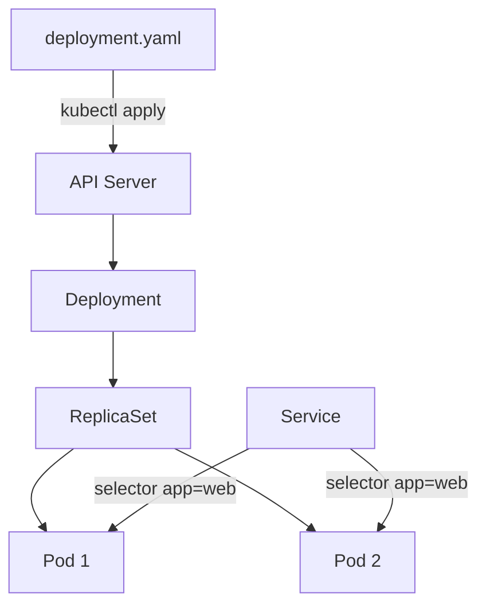

# Triển khai ứng dụng đầu tiên

## Mục lục

- [Mục tiêu](#mục-tiêu)
- [1. Kiến trúc bài lab](#1-kiến-trúc-bài-lab)
- [2. Chuẩn bị](#2-chuẩn-bị)
- [3. Tạo Namespace](#3-tạo-namespace)
- [4. Tạo Deployment](#4-tạo-deployment)
- [5. Quan sát quá trình triển khai](#5-quan-sát-quá-trình-triển-khai)
- [6. Tạo Service](#6-tạo-service)
- [7. Truy cập ứng dụng](#7-truy-cập-ứng-dụng)
- [8. Scale ứng dụng](#8-scale-ứng-dụng)
- [9. Update và rollback](#9-update-và-rollback)
- [10. Khám phá và troubleshooting](#10-khám-phá-và-troubleshooting)
- [11. Cleanup](#11-cleanup)
- [12. Bài tập mở rộng](#12-bài-tập-mở-rộng)
- [13. Tổng kết](#13-tổng-kết)
- [Tài liệu tham khảo](#tài-liệu-tham-khảo)

---

## Mục tiêu

Sau bài lab, bạn có thể:

- Tạo Namespace riêng cho ứng dụng.
- Triển khai workload bằng Deployment manifest.
- Hiểu quan hệ Deployment → ReplicaSet → Pod.
- Tạo ClusterIP Service chọn Pods bằng labels.
- Truy cập ứng dụng bằng `kubectl port-forward`.
- Scale, rollout, update và rollback.
- Dùng `get`, `describe`, `logs` và Events để kiểm tra.
- Cleanup toàn bộ lab bằng cách xóa Namespace.

> [!NOTE]
> Bài này ưu tiên hiểu luồng Kubernetes. NGINX chỉ là workload mẫu; cùng quy trình có thể áp dụng cho ứng dụng của bạn sau khi build và push Container Image.

---

## 1. Kiến trúc bài lab

```text
Browser/curl
    │ localhost:8080
    ▼
kubectl port-forward
    │
    ▼
Service web (ClusterIP, port 80)
    │ selector: app=web
    ├──────────────┐
    ▼              ▼
Pod web-...      Pod web-...
nginx:1.27       nginx:1.27
    ▲              ▲
    └── ReplicaSet ┘
             ▲
         Deployment web
```

Luồng quản lý:



Deployment không trực tiếp chạy Container. Deployment controller tạo ReplicaSet; ReplicaSet controller tạo Pods; Scheduler chọn Node; kubelet trên Node khởi động Container.

---

## 2. Chuẩn bị

Yêu cầu:

```bash
docker version
kind version
kubectl version --client
```

Tạo cluster nếu chưa có:

```bash
kind create cluster --name k8s-learn --wait 5m
kubectl config use-context kind-k8s-learn
```

Xác minh:

```bash
kubectl cluster-info
kubectl get nodes
```

Node phải ở trạng thái `Ready`.

Tạo thư mục lab:

```bash
mkdir -p first-application
cd first-application
```

---

## 3. Tạo Namespace

Tạo file `namespace.yaml`:

```yaml
apiVersion: v1
kind: Namespace
metadata:
  name: first-app
  labels:
    app.kubernetes.io/part-of: kubernetes-learning
```

Kiểm tra và apply:

```bash
kubectl apply --dry-run=server -f namespace.yaml
kubectl apply -f namespace.yaml
kubectl get namespace first-app
```

Namespace giúp nhóm resource của lab và đơn giản hóa cleanup. Các resource bên dưới sẽ khai báo `metadata.namespace: first-app` để không phụ thuộc context mặc định.

---

## 4. Tạo Deployment

Tạo file `deployment.yaml`:

```yaml
apiVersion: apps/v1
kind: Deployment
metadata:
  name: web
  namespace: first-app
  labels:
    app.kubernetes.io/name: web
    app.kubernetes.io/part-of: first-application
spec:
  replicas: 2
  selector:
    matchLabels:
      app: web
  strategy:
    type: RollingUpdate
    rollingUpdate:
      maxUnavailable: 0
      maxSurge: 1
  template:
    metadata:
      labels:
        app: web
        app.kubernetes.io/name: web
        app.kubernetes.io/part-of: first-application
    spec:
      containers:
        - name: nginx
          image: nginx:1.27-alpine
          imagePullPolicy: IfNotPresent
          ports:
            - name: http
              containerPort: 80
              protocol: TCP
          readinessProbe:
            httpGet:
              path: /
              port: http
            initialDelaySeconds: 2
            periodSeconds: 5
            timeoutSeconds: 2
            failureThreshold: 3
          livenessProbe:
            httpGet:
              path: /
              port: http
            initialDelaySeconds: 10
            periodSeconds: 10
            timeoutSeconds: 2
            failureThreshold: 3
          resources:
            requests:
              cpu: 50m
              memory: 64Mi
            limits:
              memory: 128Mi
```

### 4.1 Đọc manifest

| Field | Ý nghĩa |
|-------|---------|
| `replicas: 2` | Mong muốn có hai Pods |
| `selector.matchLabels` | Deployment xác định Pods thuộc quyền quản lý |
| `template` | Mẫu Pod được ReplicaSet sử dụng |
| `image` | Container Image cần chạy |
| `ports` | Mô tả port ứng dụng lắng nghe |
| `readinessProbe` | Quyết định Pod có nhận traffic hay không |
| `livenessProbe` | Phát hiện Container cần restart |
| `requests` | Tài nguyên dùng cho scheduling |
| `limits.memory` | Giới hạn memory của Container |

`selector.matchLabels.app` phải khớp `template.metadata.labels.app`.

### 4.2 Validate và apply

```bash
kubectl apply --dry-run=server -f deployment.yaml
kubectl diff -f deployment.yaml || true
kubectl apply -f deployment.yaml
```

Output mong đợi:

```text
deployment.apps/web created
```

---

## 5. Quan sát quá trình triển khai

Chờ rollout:

```bash
kubectl rollout status deployment/web -n first-app --timeout=120s
```

Xem các lớp resource:

```bash
kubectl get deployment,replicaset,pods -n first-app
```

Xem chi tiết:

```bash
kubectl describe deployment web -n first-app
kubectl get pods -n first-app -o wide
```

Quan sát labels:

```bash
kubectl get pods -n first-app --show-labels
```

Kiểm tra owner:

```bash
POD_NAME="$(kubectl get pod -n first-app -l app=web -o jsonpath='{.items[0].metadata.name}')"
kubectl get pod "$POD_NAME" \
  -n first-app \
  -o jsonpath='{.metadata.ownerReferences[0].kind}{"/"}{.metadata.ownerReferences[0].name}{"\n"}'
```

Pod được sở hữu bởi ReplicaSet, không trực tiếp bởi Deployment.

### 5.1 Điều gì xảy ra nếu xóa Pod?

```bash
kubectl delete pod "$POD_NAME" -n first-app
kubectl get pods -n first-app --watch
```

ReplicaSet controller phát hiện số Pod thấp hơn desired state và tạo Pod thay thế. Nhấn `Ctrl+C` để dừng watch.

---

## 6. Tạo Service

Pod IP thay đổi khi Pod bị thay thế. Service tạo endpoint ổn định và chọn backend bằng labels.

Tạo `service.yaml`:

```yaml
apiVersion: v1
kind: Service
metadata:
  name: web
  namespace: first-app
  labels:
    app.kubernetes.io/name: web
    app.kubernetes.io/part-of: first-application
spec:
  type: ClusterIP
  selector:
    app: web
  ports:
    - name: http
      port: 80
      targetPort: http
      protocol: TCP
```

Apply:

```bash
kubectl apply --dry-run=server -f service.yaml
kubectl apply -f service.yaml
kubectl get service web -n first-app
```

### 6.1 port và targetPort

- `port: 80`: port mà Service cung cấp.
- `targetPort: http`: named port trên Container, tương ứng `containerPort: 80`.
- `selector.app: web`: chọn Pods có label `app=web`.

Kiểm tra backend:

```bash
kubectl get endpointslices -n first-app \
  -l kubernetes.io/service-name=web
```

Nếu EndpointSlice không có endpoint, kiểm tra:

```bash
kubectl get pods -n first-app -l app=web --show-labels
kubectl describe service web -n first-app
```

---

## 7. Truy cập ứng dụng

Chạy:

```bash
kubectl port-forward service/web 8080:80 -n first-app
```

Giữ terminal này mở. Trong terminal khác:

```bash
curl -I http://localhost:8080
curl http://localhost:8080
```

Bạn sẽ nhận trang mặc định của NGINX.

`port-forward` tạo tunnel tạm từ máy local đến resource trong cluster. Nó phù hợp cho lab và debug, không phải endpoint production.

### 7.1 Kiểm tra từ bên trong cluster

Tạo Pod tạm có `wget`:

```bash
kubectl run client \
  --namespace first-app \
  --image=busybox:1.36 \
  --restart=Never \
  --rm -it \
  -- wget -qO- http://web
```

Tên `web` được CoreDNS phân giải thành Service trong cùng Namespace. Tên đầy đủ có thể dùng:

```text
web.first-app.svc.cluster.local
```

---

## 8. Scale ứng dụng

Scale imperative để quan sát nhanh:

```bash
kubectl scale deployment/web --replicas=3 -n first-app
kubectl rollout status deployment/web -n first-app
kubectl get pods -n first-app -l app=web
```

Sau đó cập nhật `replicas: 3` trong `deployment.yaml` để Git/manifest vẫn là nguồn desired state, rồi apply:

```bash
kubectl apply -f deployment.yaml
```

> [!IMPORTANT]
> Nếu chỉ scale bằng command nhưng manifest vẫn ghi `replicas: 2`, lần apply tiếp theo có thể đưa hệ thống về hai replicas.

---

## 9. Update và rollback

### 9.1 Update image

Sửa manifest:

```yaml
image: nginx:1.28-alpine
```

Xem diff và apply:

```bash
kubectl diff -f deployment.yaml || true
kubectl apply -f deployment.yaml
kubectl rollout status deployment/web -n first-app
```

Quan sát revision:

```bash
kubectl rollout history deployment/web -n first-app
kubectl get replicasets -n first-app
```

### 9.2 Mô phỏng rollout lỗi

Đặt image không tồn tại:

```bash
kubectl set image deployment/web \
  nginx=nginx:version-khong-ton-tai \
  -n first-app
```

Quan sát:

```bash
kubectl rollout status deployment/web -n first-app --timeout=30s
kubectl get pods -n first-app
kubectl describe pods -n first-app -l app=web
kubectl get events -n first-app --sort-by=.metadata.creationTimestamp
```

Bạn sẽ thấy lỗi pull image. Do `maxUnavailable: 0`, các Pod cũ Ready được giữ trong lúc Pod mới chưa sẵn sàng, trong phạm vi strategy và tài nguyên cluster cho phép.

Rollback:

```bash
kubectl rollout undo deployment/web -n first-app
kubectl rollout status deployment/web -n first-app
```

Cuối cùng đảm bảo `deployment.yaml` cũng chứa image đúng rồi apply lại. Rollback live object mà không sửa source sẽ bị lần deploy sau ghi đè.

---

## 10. Khám phá và troubleshooting

### 10.1 Xem logs

```bash
kubectl logs deployment/web -n first-app --all-pods=true
```

Sau khi gửi request qua port-forward, access log NGINX sẽ xuất hiện.

### 10.2 Chạy command trong Container

```bash
POD_NAME="$(kubectl get pod -n first-app -l app=web -o jsonpath='{.items[0].metadata.name}')"
kubectl exec -n first-app "$POD_NAME" -- nginx -v
kubectl exec -n first-app "$POD_NAME" -- cat /etc/nginx/conf.d/default.conf
```

### 10.3 Xem status và conditions

```bash
kubectl get deployment web -n first-app -o yaml
kubectl get pod "$POD_NAME" -n first-app -o yaml
```

Tập trung vào:

- Deployment `status.conditions`.
- `readyReplicas`, `availableReplicas`, `updatedReplicas`.
- Pod `status.phase` và `conditions`.
- `containerStatuses`, `restartCount`, `state`, `lastState`.

### 10.4 Checklist khi không truy cập được

```text
1. Deployment có Available replicas?
2. Pods có Running và Ready?
3. Container có listen đúng port?
4. Service selector có khớp Pod labels?
5. EndpointSlice có địa chỉ backend?
6. port-forward còn chạy và đúng port?
7. Logs và Events báo gì?
```

Commands:

```bash
kubectl get deployment,pods,service,endpointslices -n first-app
kubectl describe deployment web -n first-app
kubectl describe service web -n first-app
kubectl logs deployment/web -n first-app --all-pods=true
kubectl get events -n first-app --sort-by=.metadata.creationTimestamp
```

---

## 11. Cleanup

Xóa theo manifest:

```bash
kubectl delete -f service.yaml
kubectl delete -f deployment.yaml
kubectl delete -f namespace.yaml
```

Hoặc xóa Namespace để xóa toàn bộ namespaced resources trong lab:

```bash
kubectl delete namespace first-app
```

Xác minh:

```bash
kubectl get namespace first-app
```

Nếu không cần local cluster:

```bash
kind delete cluster --name k8s-learn
```

---

## 12. Bài tập mở rộng

1. Đổi replicas từ 3 thành 5 và quan sát ReplicaSet.
2. Đổi Service selector thành giá trị sai, kiểm tra EndpointSlice rồi sửa lại.
3. Đổi readiness path thành `/khong-ton-tai`, quan sát Pod `Running` nhưng không Ready.
4. Xem log của từng Pod riêng biệt.
5. Thêm annotation chứa URL runbook.
6. Sinh Deployment YAML bằng `kubectl create --dry-run=client -o yaml` rồi so sánh.
7. Thêm ConfigMap chứa trang `index.html` và mount vào NGINX.
8. Dùng `kubectl auth can-i` để kiểm tra quyền đọc và sửa Deployment.

> [!TIP]
> Với mỗi lỗi, ghi lại: triệu chứng, command quan sát, bằng chứng, root cause, cách sửa và cách phòng ngừa. Đây là nền tảng của runbook production.

---

## 13. Tổng kết

Bạn vừa đi qua vòng đời hoàn chỉnh:

```text
viết manifest → validate → apply → observe → expose
→ scale → update → phát hiện lỗi → rollback → cleanup
```

Các quan hệ cần nhớ:

- Deployment quản lý ReplicaSet.
- ReplicaSet duy trì Pods.
- Service chọn Ready Pods qua labels và selector.
- `spec` là desired state; `status` cho biết actual state.
- Controller liên tục reconciliation thay vì chỉ chạy một workflow một lần.

Tiếp tục với [Tổng quan Kubernetes Cluster](/kien-truc/tong-quan-cluster/) và [Pod](/workloads/pod/).

---

## Tài liệu tham khảo

- [Learn Kubernetes Basics](https://kubernetes.io/docs/tutorials/kubernetes-basics/)
- [Deployments](https://kubernetes.io/docs/concepts/workloads/controllers/deployment/)
- [Services](https://kubernetes.io/docs/concepts/services-networking/service/)
- [kubectl Quick Reference](https://kubernetes.io/docs/reference/kubectl/quick-reference/)
- [Debug Running Pods](https://kubernetes.io/docs/tasks/debug/debug-application/debug-running-pod/)
