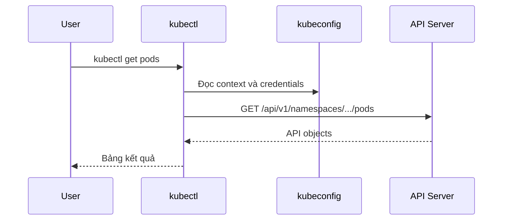

# kubectl cơ bản

## Mục lục

- [Tổng quan](#tổng-quan)
- [1. Cú pháp và resource naming](#1-cú-pháp-và-resource-naming)
- [2. Kubeconfig, context và Namespace](#2-kubeconfig-context-và-namespace)
- [3. Khám phá API](#3-khám-phá-api)
- [4. Đọc và quan sát resource](#4-đọc-và-quan-sát-resource)
- [5. Tạo và cập nhật resource](#5-tạo-và-cập-nhật-resource)
- [6. Logs, exec và port-forward](#6-logs-exec-và-port-forward)
- [7. Labels, selectors và output](#7-labels-selectors-và-output)
- [8. Rollout và scaling](#8-rollout-và-scaling)
- [9. Xóa resource](#9-xóa-resource)
- [10. Quy trình troubleshooting](#10-quy-trình-troubleshooting)
- [11. Best practices](#11-best-practices)
- [12. Bài thực hành](#12-bài-thực-hành)
- [Tài liệu tham khảo](#tài-liệu-tham-khảo)

---

## Tổng quan

`kubectl` là CLI chính thức để giao tiếp với Kubernetes API Server. Nó đọc kubeconfig để biết cluster endpoint, credentials và context, sau đó gửi HTTP request đến API.



> [!IMPORTANT]
> `kubectl` không trực tiếp chạy Container trên Node. Nó thao tác API object; các controller, Scheduler và kubelet phản ứng với thay đổi đó.

---

## 1. Cú pháp và resource naming

Cú pháp chung:

```text
kubectl [command] [TYPE] [NAME] [flags]
```

Ví dụ:

```bash
kubectl get pods
kubectl describe deployment web
kubectl delete service web
```

Resource type có thể dùng tên đầy đủ, số nhiều hoặc shortname:

```bash
kubectl get pod
kubectl get pods
kubectl get po
```

Một số shortname phổ biến:

| Resource | Shortname |
|----------|-----------|
| Pod | `po` |
| Deployment | `deploy` |
| Service | `svc` |
| Namespace | `ns` |
| ConfigMap | `cm` |
| PersistentVolumeClaim | `pvc` |
| ServiceAccount | `sa` |
| Node | `no` |

Không cần học thuộc toàn bộ. Tra cứu trực tiếp:

```bash
kubectl api-resources
```

### 1.1 Cờ có thể đặt trước hoặc sau command

```bash
kubectl -n demo get pods
kubectl get pods -n demo
```

Các cờ thường dùng:

| Flag | Ý nghĩa |
|------|---------|
| `-n, --namespace` | Chọn Namespace |
| `-A, --all-namespaces` | Tất cả Namespaces |
| `-o, --output` | Chọn định dạng output |
| `-l, --selector` | Lọc theo label |
| `--field-selector` | Lọc theo field |
| `--context` | Chọn context cho command hiện tại |
| `--kubeconfig` | Chỉ định kubeconfig file |
| `-v` | Tăng verbosity để debug client/API request |

---

## 2. Kubeconfig, context và Namespace

Kubeconfig thường nằm tại `~/.kube/config` và chứa:

- **clusters:** API Server endpoint và CA data.
- **users:** credentials hoặc cơ chế lấy token.
- **contexts:** tổ hợp cluster, user và Namespace mặc định.
- **current-context:** context hiện được chọn.

```bash
kubectl config get-contexts
kubectl config current-context
kubectl config view --minify
```

Chuyển context:

```bash
kubectl config use-context kind-k8s-learn
```

Đặt Namespace mặc định cho context hiện tại:

```bash
kubectl config set-context --current --namespace=demo
```

Chỉ dùng Namespace cho một command:

```bash
kubectl get pods -n demo
```

> [!CAUTION]
> Trước command có khả năng thay đổi dữ liệu, hãy kiểm tra `kubectl config current-context`. Trong môi trường nhiều cluster, nên hiển thị context trong shell prompt.

---

## 3. Khám phá API

### 3.1 Liệt kê resource

```bash
kubectl api-resources
kubectl api-resources --namespaced=true
kubectl api-resources --namespaced=false
kubectl api-resources -o wide
```

Output cho biết resource name, shortname, API version, namespaced scope và Kind.

### 3.2 Liệt kê API versions

```bash
kubectl api-versions
```

Lệnh hữu ích khi manifest dùng API version không được cluster phục vụ.

### 3.3 Tra schema bằng explain

```bash
kubectl explain pod
kubectl explain pod.spec
kubectl explain pod.spec.containers
kubectl explain deployment.spec.strategy
```

Dùng `--recursive` khi muốn nhìn cây field:

```bash
kubectl explain deployment.spec --recursive
```

`kubectl explain` lấy schema từ API của cluster, đáng tin cậy hơn snippet cũ trên Internet.

---

## 4. Đọc và quan sát resource

### 4.1 get

```bash
kubectl get pods
kubectl get pods -o wide
kubectl get deployments,services
kubectl get pods -A
kubectl get pod web-abc123 -o yaml
```

`get` phù hợp để xem danh sách và status ngắn. `-o wide` thêm Node, Pod IP hoặc thông tin khác tùy resource.

Theo dõi thay đổi liên tục:

```bash
kubectl get pods --watch
```

### 4.2 describe

```bash
kubectl describe pod <pod-name>
kubectl describe deployment web
kubectl describe node <node-name>
```

`describe` tổng hợp thông tin dễ đọc và thường kèm Events liên quan. Với Pod, hãy chú ý:

- Node được chọn.
- Container state và last state.
- Exit code, reason và restart count.
- Conditions.
- Volumes.
- Events cuối output.

### 4.3 Events

```bash
kubectl get events --sort-by=.metadata.creationTimestamp
kubectl events --types=Warning
kubectl events --for pod/<pod-name>
```

Events có thời gian lưu hữu hạn, không phải audit log lâu dài. Thu thập sớm khi troubleshooting.

---

## 5. Tạo và cập nhật resource

### 5.1 Imperative và declarative

Imperative command hữu ích để thử nhanh hoặc sinh YAML:

```bash
kubectl create namespace demo
kubectl create deployment web --image=nginx:1.27-alpine
kubectl expose deployment web --port=80
```

Declarative management dùng manifest và `apply`:

```bash
kubectl apply -f deployment.yaml
kubectl apply -f ./manifests/
```

Production nên ưu tiên manifest được version control để review, diff và tái tạo.

### 5.2 Dry run và diff

Sinh YAML mà chưa tạo resource:

```bash
kubectl create deployment web \
  --image=nginx:1.27-alpine \
  --dry-run=client \
  -o yaml
```

Validation phía server mà không persist:

```bash
kubectl apply --dry-run=server -f deployment.yaml
```

Xem thay đổi dự kiến:

```bash
kubectl diff -f deployment.yaml
```

Apply sau khi review:

```bash
kubectl apply -f deployment.yaml
```

### 5.3 edit, patch và set

```bash
kubectl edit deployment web
kubectl set image deployment/web nginx=nginx:1.28-alpine
kubectl patch deployment web --type merge -p '{"spec":{"replicas":3}}'
```

Các lệnh này hữu ích khi xử lý nhanh, nhưng thay đổi production cần được đưa ngược về Git để tránh configuration drift.

---

## 6. Logs, exec và port-forward

### 6.1 Logs

```bash
kubectl logs <pod-name>
kubectl logs -f <pod-name>
kubectl logs <pod-name> --since=10m
kubectl logs <pod-name> --tail=100
```

Pod nhiều Container:

```bash
kubectl logs <pod-name> -c <container-name>
```

Xem log của Container instance trước khi restart:

```bash
kubectl logs <pod-name> -c <container-name> --previous
```

Theo Deployment:

```bash
kubectl logs deployment/web --all-pods=true
```

### 6.2 exec

```bash
kubectl exec <pod-name> -- env
kubectl exec <pod-name> -- cat /etc/resolv.conf
kubectl exec -it <pod-name> -- /bin/sh
```

Dấu `--` tách kubectl flags khỏi command chạy trong Container.

Minimal image có thể không có shell, `curl`, `ps` hoặc package manager. Không sửa production Container bằng cách cài tool thủ công; dùng debug Container hoặc debug Pod phù hợp.

### 6.3 port-forward

```bash
kubectl port-forward pod/<pod-name> 8080:80
kubectl port-forward deployment/web 8080:80
kubectl port-forward service/web 8080:80
```

`port-forward` phù hợp cho debug local, không phải cách expose production service.

### 6.4 cp

```bash
kubectl cp ./local.txt demo/<pod-name>:/tmp/local.txt
kubectl cp demo/<pod-name>:/tmp/report.txt ./report.txt
```

`kubectl cp` thường cần binary `tar` trong Container.

---

## 7. Labels, selectors và output

### 7.1 Labels

```bash
kubectl get pods --show-labels
kubectl get pods -l app=web
kubectl get pods -l 'environment in (staging,production)'
kubectl label pod <pod-name> owner=platform
kubectl label pod <pod-name> owner-
```

### 7.2 Field selectors

```bash
kubectl get pods --field-selector=status.phase=Running
kubectl get pods --field-selector=spec.nodeName=<node-name>
```

Field selectors chỉ hỗ trợ một tập field tùy resource; labels linh hoạt hơn cho tổ chức object.

### 7.3 Output formats

```bash
kubectl get pods -o name
kubectl get pods -o json
kubectl get pods -o yaml
kubectl get pods -o jsonpath='{.items[*].metadata.name}'
kubectl get pods -o custom-columns='NAME:.metadata.name,NODE:.spec.nodeName,PHASE:.status.phase'
```

Dùng output machine-readable trong script. Không parse bảng mặc định bằng `awk` nếu có thể dùng JSONPath, custom columns hoặc `jq`.

---

## 8. Rollout và scaling

```bash
kubectl rollout status deployment/web
kubectl rollout history deployment/web
kubectl rollout undo deployment/web
kubectl rollout restart deployment/web
```

Scale thủ công:

```bash
kubectl scale deployment/web --replicas=3
```

Theo dõi Pod trong lúc rollout:

```bash
kubectl get pods -l app=web --watch
```

Nếu dùng GitOps hoặc autoscaler, scale thủ công có thể bị controller khác ghi đè. Luôn xác định nguồn sở hữu desired state.

---

## 9. Xóa resource

```bash
kubectl delete -f deployment.yaml
kubectl delete deployment web
kubectl delete pods -l app=web
kubectl delete namespace demo
```

Xóa Namespace sẽ xóa các namespaced resources bên trong. Kiểm tra context, Namespace và selector trước khi xác nhận.

Không mặc định dùng `--force --grace-period=0`. Force deletion có thể xóa API object trước khi xác nhận process hoặc storage đã cleanup, tạo inconsistency.

---

## 10. Quy trình troubleshooting

Khi Pod lỗi:

```bash
kubectl get pod <pod-name> -o wide
kubectl describe pod <pod-name>
kubectl logs <pod-name> --all-containers
kubectl logs <pod-name> --all-containers --previous
kubectl get events --sort-by=.metadata.creationTimestamp
kubectl get pod <pod-name> -o yaml
```

| Trạng thái | Hướng kiểm tra đầu tiên |
|------------|-------------------------|
| `Pending` | Events, resource requests, PVC, taints, affinity |
| `ImagePullBackOff` | Image name/tag, registry auth, network |
| `CrashLoopBackOff` | Current/previous logs, exit code, command, config |
| `Running` nhưng không Ready | Readiness probe và dependency |
| Service không có endpoint | Selector và Pod labels/readiness |
| `Forbidden` | `kubectl auth can-i`, RBAC và identity |

Kiểm tra quyền:

```bash
kubectl auth can-i get pods
kubectl auth can-i create deployments -n demo
kubectl auth can-i --list -n demo
```

Debug request của kubectl:

```bash
kubectl get pods -v=6
```

Cẩn thận khi tăng verbosity cao vì output có thể chứa thông tin nhạy cảm.

---

## 11. Best practices

- Luôn xác nhận context và Namespace.
- Dùng manifest trong Git cho resource lâu dài.
- Chạy `diff` và server-side dry run trước khi apply thay đổi quan trọng.
- Dùng tên resource đầy đủ trong script để dễ đọc.
- Không lưu token hoặc output `kubectl config view --raw` vào log.
- Dùng labels nhất quán để query và cleanup.
- Không sửa trực tiếp resource do Helm, GitOps hoặc Operator quản lý mà không cập nhật source.
- Ghi rõ `--context` và `--namespace` trong automation.
- Xem Events và status trước khi xóa resource lỗi.

---

## 12. Bài thực hành

```bash
kubectl create namespace kubectl-lab
kubectl create deployment web \
  --image=nginx:1.27-alpine \
  -n kubectl-lab
kubectl expose deployment web \
  --port=80 \
  -n kubectl-lab

kubectl get all -n kubectl-lab
kubectl get pods -n kubectl-lab --show-labels
kubectl describe deployment web -n kubectl-lab
kubectl rollout status deployment/web -n kubectl-lab
kubectl port-forward service/web 8080:80 -n kubectl-lab
```

Mở terminal khác:

```bash
curl http://localhost:8080
```

Cleanup:

```bash
kubectl delete namespace kubectl-lab
```

---

## Tài liệu tham khảo

- [kubectl Overview](https://kubernetes.io/docs/reference/kubectl/)
- [kubectl Quick Reference](https://kubernetes.io/docs/reference/kubectl/quick-reference/)
- [kubectl Command Reference](https://kubernetes.io/docs/reference/generated/kubectl/kubectl-commands)
- [Declarative Management](https://kubernetes.io/docs/tasks/manage-kubernetes-objects/declarative-config/)
- [Kubernetes API Resources](/gioi-thieu/api-resources/)
