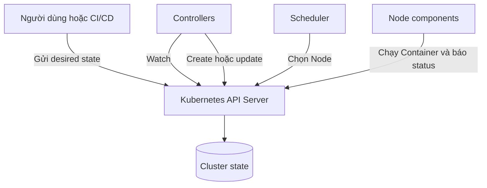
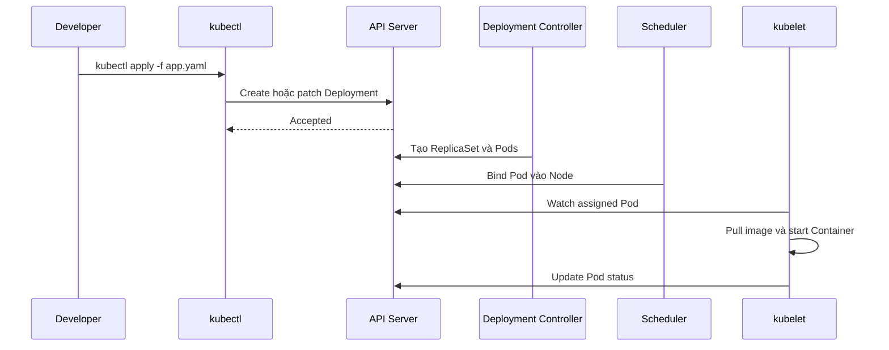

# Kubernetes là gì?

## Mục lục

- [Tổng quan](#tổng-quan)
- [1. Vì sao cần Kubernetes](#1-vì-sao-cần-kubernetes)
- [2. Kubernetes cung cấp những gì](#2-kubernetes-cung-cấp-những-gì)
- [3. Kubernetes không phải là gì](#3-kubernetes-không-phải-là-gì)
- [4. Kiến trúc ở mức tổng quan](#4-kiến-trúc-ở-mức-tổng-quan)
- [5. Object model và reconciliation](#5-object-model-và-reconciliation)
- [6. Các resource đầu tiên cần biết](#6-các-resource-đầu-tiên-cần-biết)
- [7. Luồng triển khai một ứng dụng](#7-luồng-triển-khai-một-ứng-dụng)
- [8. Khi nào nên và không nên dùng](#8-khi-nào-nên-và-không-nên-dùng)
- [9. Trade-offs](#9-trade-offs)
- [10. Thuật ngữ quan trọng](#10-thuật-ngữ-quan-trọng)
- [Tài liệu tham khảo](#tài-liệu-tham-khảo)

---

## Tổng quan

Kubernetes là nền tảng mã nguồn mở, có tính portable và extensible để quản lý containerized workloads cùng services. Kubernetes tập trung vào **declarative configuration** và **automation**: người dùng mô tả trạng thái mong muốn, còn hệ thống liên tục đưa trạng thái thực tế tiến về trạng thái đó.

Tên Kubernetes có nguồn gốc từ tiếng Hy Lạp, mang nghĩa người lái tàu hoặc hoa tiêu. Tên viết tắt `K8s` được tạo từ chữ `K`, tám ký tự ở giữa và chữ `s`.

Google công bố Kubernetes thành dự án mã nguồn mở năm 2014; hiện dự án được phát triển trong hệ sinh thái Cloud Native Computing Foundation.

> [!IMPORTANT]
> Kubernetes không chỉ “chạy nhiều Container”. Giá trị cốt lõi nằm ở API thống nhất, controller, self-healing và khả năng tự động duy trì desired state.

---

## 1. Vì sao cần Kubernetes

Một Container có thể chạy bằng một lệnh. Nhưng khi hệ thống có hàng chục service và nhiều server, đội vận hành phải giải quyết:

- Chọn server còn đủ CPU và memory.
- Khởi động lại workload khi process hoặc server lỗi.
- Duy trì số replica mong muốn.
- Cung cấp địa chỉ ổn định dù Pod thường xuyên bị thay thế.
- Rollout phiên bản mới và rollback khi có lỗi.
- Gắn storage và inject configuration.
- Kiểm soát quyền truy cập và cô lập workload.
- Thu thập trạng thái để giám sát và troubleshooting.

Nếu tự viết script cho từng việc, hệ thống dễ phụ thuộc vào thứ tự thao tác và trạng thái cũ. Kubernetes thay thế nhiều script imperative bằng API object và các control loop độc lập.



---

## 2. Kubernetes cung cấp những gì

### 2.1 Scheduling và bin packing

Kubernetes đặt Pod lên Node dựa trên resource requests, constraints và policy. Scheduler không chỉ tìm Node “còn trống”; nó lọc Node không phù hợp rồi chấm điểm các Node còn lại.

### 2.2 Self-healing

Kubernetes có thể:

- Restart Container theo restart policy.
- Tạo Pod thay thế để duy trì replica.
- Không gửi traffic đến Pod chưa Ready.
- Reschedule workload khi Node không còn khả dụng.

Self-healing không sửa bug ứng dụng hay khôi phục dữ liệu bị ghi sai. Nó chỉ thực hiện hành động theo model và policy đã khai báo.

### 2.3 Service discovery và load balancing

Service cung cấp tên DNS và virtual IP ổn định cho một nhóm Pod được chọn bằng labels. Client không cần biết IP thay đổi của từng Pod.

### 2.4 Automated rollout và rollback

Deployment thay dần Pod phiên bản cũ bằng phiên bản mới, theo dõi tiến trình và lưu revision để rollback.

### 2.5 Horizontal scaling

Có thể scale bằng command, thay đổi manifest hoặc tự động dựa trên metrics. Việc scale hiệu quả vẫn yêu cầu ứng dụng có khả năng chạy nhiều replica và quản lý state đúng cách.

### 2.6 Configuration và Secret management

ConfigMap và Secret tách cấu hình khỏi image. Đây là primitive lưu và phân phối dữ liệu cấu hình; để đáp ứng yêu cầu bảo mật cao thường cần encryption at rest, RBAC chặt chẽ và external secrets manager.

### 2.7 Storage orchestration

PersistentVolume, PersistentVolumeClaim, StorageClass và CSI tạo lớp abstraction để workload yêu cầu storage mà không phải biết toàn bộ chi tiết backend.

### 2.8 Extensibility

Kubernetes có thể mở rộng bằng CustomResourceDefinition, Operator, admission webhook và API aggregation. Đây là nền tảng để xây internal developer platform, không chỉ là một scheduler.

---

## 3. Kubernetes không phải là gì

Kubernetes không phải một PaaS hoàn chỉnh mặc định. Nó cung cấp building blocks và cho phép lựa chọn thành phần.

Kubernetes không tự động cung cấp đầy đủ:

- Quy trình build source code thành image.
- CI/CD pipeline.
- Database, message broker hoặc cache tích hợp sẵn.
- Logging, metrics và alerting stack hoàn chỉnh.
- Container registry.
- Chiến lược backup cho dữ liệu ứng dụng.
- Bảo mật ứng dụng hoặc sửa lỗ hổng trong image.
- Thiết kế microservices đúng.

| Hiểu lầm | Thực tế |
|----------|---------|
| “Đưa lên Kubernetes là tự động HA” | Workload phải có nhiều replica, anti-affinity, probes và dependency phù hợp |
| “Secret mặc định đã an toàn” | Secret chủ yếu là API object; base64 không phải mã hóa |
| “Kubernetes thay thế CI/CD” | Kubernetes là deployment target; pipeline vẫn phải được thiết kế |
| “Pod giống VM” | Pod là đơn vị chạy một hoặc nhiều Container có chung network và volumes |
| “Self-healing sửa mọi lỗi” | Hệ thống chỉ khôi phục theo desired state đã khai báo |

---

## 4. Kiến trúc ở mức tổng quan

Một cluster gồm **Control Plane** và một hoặc nhiều **Worker Node**.

```text
┌──────────────────── Control Plane ────────────────────┐
│ API Server │ etcd │ Scheduler │ Controller Managers   │
└───────────────────────────────┬───────────────────────┘
                                │ Kubernetes API
               ┌────────────────┴────────────────┐
               │                                 │
               ▼                                 ▼
┌───────── Worker Node A ────────┐  ┌──────  Worker Node B ──────┐
│ kubelet │ runtime │ networking │  │ kubelet │ runtime │ network│
│ Pods                           │  │ Pods                       │
└────────────────────────────────┘  └────────────────────────────┘
```

### 4.1 Control Plane

- **kube-apiserver:** cổng vào của Kubernetes API; xác thực, phân quyền, validation và admission.
- **etcd:** lưu trạng thái cluster theo mô hình key-value nhất quán.
- **kube-scheduler:** chọn Node cho Pod chưa được bind.
- **kube-controller-manager:** chạy các controller cốt lõi.
- **cloud-controller-manager:** tích hợp với API của cloud provider khi được sử dụng.

### 4.2 Worker Node

- **kubelet:** đảm bảo Container của Pod được chạy trên Node.
- **Container Runtime:** pull image và quản lý Container.
- **Network components:** hiện thực Pod networking và Service routing tùy giải pháp.
- **Pods:** nơi application workload thực sự chạy.

Chi tiết được trình bày tại [Tổng quan Kubernetes Cluster](/kien-truc/tong-quan-cluster/).

---

## 5. Object model và reconciliation

Kubernetes object là bản ghi ý định bền vững trong API. Hầu hết object có:

- `metadata`: danh tính, Namespace, labels, annotations và ownership.
- `spec`: desired state do người dùng hoặc controller khai báo.
- `status`: actual state do hệ thống cập nhật.

Ví dụ Deployment yêu cầu ba replica:

```yaml
apiVersion: apps/v1
kind: Deployment
metadata:
  name: web
spec:
  replicas: 3
  selector:
    matchLabels:
      app: web
  template:
    metadata:
      labels:
        app: web
    spec:
      containers:
        - name: nginx
          image: nginx:1.27-alpine
```

Reconciliation loop có thể diễn giải như sau:

```text
observe actual state → compare with desired state → act → repeat
```

Controller cần có tính idempotent: chạy lại nhiều lần vẫn tiến hệ thống đến cùng trạng thái mong muốn, thay vì phụ thuộc vào một chuỗi bước chỉ chạy đúng một lần.

---

## 6. Các resource đầu tiên cần biết

| Resource | Mục đích | Scope thường gặp |
|----------|----------|------------------|
| Namespace | Biên logic để nhóm resource | Cluster-scoped object, chứa namespaced resources |
| Pod | Đơn vị deploy nhỏ nhất | Namespaced |
| Deployment | Quản lý stateless Pods và rollout | Namespaced |
| Service | Endpoint ổn định cho nhóm Pods | Namespaced |
| ConfigMap | Cấu hình không nhạy cảm | Namespaced |
| Secret | Dữ liệu nhạy cảm cần kiểm soát | Namespaced |
| ServiceAccount | Identity cho workload | Namespaced |
| PersistentVolumeClaim | Yêu cầu storage | Namespaced |
| Node | Máy tham gia cluster | Cluster-scoped |

Hãy dùng `kubectl api-resources` để xem resource thực tế được cluster hỗ trợ thay vì giả định mọi cluster giống nhau.

---

## 7. Luồng triển khai một ứng dụng



Điểm quan trọng: `kubectl` không trực tiếp kết nối đến Node để chạy Container. Nó gửi request đến API Server; các component khác phản ứng với object mới.

---

## 8. Khi nào nên và không nên dùng

### 8.1 Nên cân nhắc Kubernetes khi

- Có nhiều service hoặc workload với lifecycle độc lập.
- Cần rollout thường xuyên, autoscaling và self-healing.
- Muốn một API vận hành tương đối nhất quán giữa nhiều môi trường.
- Có đội ngũ đủ khả năng sở hữu platform hoặc dùng managed Kubernetes.
- Cần ecosystem như Operators, policy engines và GitOps.

### 8.2 Chưa nên dùng khi

- Chỉ có một ứng dụng nhỏ, ít thay đổi và chạy tốt trên một VM hoặc PaaS.
- Đội ngũ chưa có năng lực vận hành Linux, Networking, security và observability.
- Chi phí platform lớn hơn giá trị tự động hóa nhận được.
- Workload có yêu cầu đặc biệt nhưng hệ sinh thái Kubernetes chưa hỗ trợ tốt.
- Mục tiêu chỉ là “theo xu hướng” mà không có bài toán cụ thể.

Một managed container service hoặc PaaS có thể đơn giản và kinh tế hơn. Kubernetes là công cụ mạnh nhưng không miễn phí về độ phức tạp.

---

## 9. Trade-offs

| Lợi ích | Chi phí đi kèm |
|---------|----------------|
| Declarative API | Cần học object model và eventual convergence |
| Self-healing | Có thể che giấu lỗi lặp lại nếu observability kém |
| Portability | Cloud integrations và storage vẫn khác nhau |
| Extensibility | Ecosystem lớn làm tăng lựa chọn và governance |
| Automation | Cấu hình sai cũng được tự động hóa rất hiệu quả |
| High utilization | Cần capacity planning và resource requests chính xác |
| Chuẩn hóa deployment | Platform team phải duy trì guardrails và golden paths |

Câu hỏi đúng không phải “Kubernetes có tốt không?” mà là “lợi ích tự động hóa có lớn hơn tổng chi phí kỹ thuật và tổ chức không?”.

---

## 10. Thuật ngữ quan trọng

| Thuật ngữ | Ý nghĩa ngắn |
|-----------|--------------|
| Cluster | Tập hợp Control Plane và Nodes |
| Node | Máy vật lý hoặc VM chạy workload |
| Pod | Đơn vị deploy nhỏ nhất |
| Control Plane | Các thành phần quản lý trạng thái cluster |
| Controller | Control loop đưa actual state về desired state |
| Namespace | Phạm vi logic cho namespaced resources |
| Label | Key-value dùng để tổ chức và select object |
| Manifest | YAML hoặc JSON mô tả API object |
| kubeconfig | Cấu hình cluster, user và context cho client |
| Context | Tổ hợp cluster, user và Namespace mặc định |
| CRD | Cách thêm resource type mới vào Kubernetes API |

Bước tiếp theo: [Cài đặt môi trường học tập](/gioi-thieu/cai-dat-moi-truong/) và [Kubernetes API Resources](/gioi-thieu/api-resources/).

---

## Tài liệu tham khảo

- [What is Kubernetes?](https://kubernetes.io/docs/concepts/overview/what-is-kubernetes/)
- [Kubernetes Components](https://kubernetes.io/docs/concepts/overview/components/)
- [Objects in Kubernetes](https://kubernetes.io/docs/concepts/overview/working-with-objects/)
- [The Kubernetes API](https://kubernetes.io/docs/concepts/overview/kubernetes-api/)
- [CNCF Kubernetes Project](https://www.cncf.io/projects/kubernetes/)
