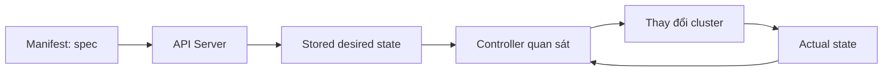

# Lộ trình học Kubernetes

## Mục lục

- [Tổng quan](#tổng-quan)
- [1. Kiến thức đầu vào](#1-kiến-thức-đầu-vào)
- [2. Tư duy cốt lõi](#2-tư-duy-cốt-lõi)
- [3. Các giai đoạn học](#3-các-giai-đoạn-học)
- [4. Cách học hiệu quả](#4-cách-học-hiệu-quả)
- [5. Kế hoạch học gợi ý](#5-kế-hoạch-học-gợi-ý)
- [6. Cột mốc tự đánh giá](#6-cột-mốc-tự-đánh-giá)
- [7. Những lỗi học tập thường gặp](#7-những-lỗi-học-tập-thường-gặp)
- [8. Checklist bắt đầu](#8-checklist-bắt-đầu)
- [Tài liệu tham khảo](#tài-liệu-tham-khảo)

---

## Tổng quan

Kubernetes có nhiều khái niệm liên kết chặt chẽ: Container, Pod, Deployment, Service, Storage, Scheduler, RBAC và hàng loạt controller. Nếu học từng lệnh rời rạc, bạn có thể tạo được tài nguyên nhưng khó giải thích vì sao hệ thống hoạt động hoặc vì sao nó lỗi.

Lộ trình trong repo này đi theo thứ tự:

```text
Container → Kubernetes API → Workloads → Networking → Storage
          → Scheduling → Security → Observability → Delivery
          → Cluster Administration → Production
```

Mục tiêu cuối cùng không phải là ghi nhớ mọi lệnh `kubectl`, mà là có khả năng:

1. Mô tả trạng thái mong muốn bằng manifest.
2. Quan sát trạng thái thực tế trong cluster.
3. Tìm chênh lệch giữa hai trạng thái.
4. Xác định controller hoặc thành phần chịu trách nhiệm.
5. Sửa cấu hình và xác minh kết quả một cách có hệ thống.

> [!IMPORTANT]
> Kubernetes là một hệ thống API và reconciliation, không chỉ là nơi chạy Container. Hãy học object model và luồng điều khiển trước khi học thuộc YAML.

---

## 1. Kiến thức đầu vào

Bạn không cần là chuyên gia Linux hay Networking, nhưng nên hiểu các kiến thức sau.

| Nhóm | Cần biết | Mức độ |
|------|----------|--------|
| **Linux** | Process, port, filesystem, permission, signal, environment variable | Cơ bản |
| **Networking** | IP, subnet, DNS, TCP/UDP, HTTP, reverse proxy, load balancer | Cơ bản |
| **Container** | Image, Container, registry, volume, port mapping | Bắt buộc |
| **YAML** | Mapping, list, scalar, indentation | Bắt buộc |
| **Git** | Commit, branch, pull request, diff | Khuyến nghị |
| **Cloud** | VM, VPC/VNet, load balancer, block storage | Hữu ích cho production |

Nếu chưa chắc về Container, hãy bắt đầu với [Nền tảng Container](/gioi-thieu/container-fundamentals/). Nếu chưa quen YAML, đọc [YAML và Kubernetes Manifest](/gioi-thieu/yaml-manifest/).

### 1.1 Công cụ tối thiểu

- Một máy có ít nhất 2 CPU và 4 GB RAM trống cho lab cơ bản.
- Docker hoặc Podman để chạy local cluster bằng `kind`.
- `kubectl` để giao tiếp với Kubernetes API.
- Git và một code editor có hỗ trợ YAML.
- Terminal Bash, Zsh hoặc PowerShell.

Xem hướng dẫn đầy đủ tại [Cài đặt môi trường học tập](/gioi-thieu/cai-dat-moi-truong/).

---

## 2. Tư duy cốt lõi

### 2.1 Desired state và actual state

Bạn khai báo **desired state** trong trường `spec`. Kubernetes quan sát **actual state** trong `status` và liên tục đưa hệ thống về trạng thái mong muốn.



Ví dụ: Deployment yêu cầu ba replica. Nếu một Pod biến mất, Deployment controller không “khôi phục Pod cũ”; nó tạo một Pod mới để số replica thực tế quay lại ba.

### 2.2 Object trước, lệnh sau

Mỗi lệnh `kubectl` đều thao tác với API object. Khi gặp một lệnh mới, hãy hỏi:

- Lệnh đang đọc hay sửa resource nào?
- Resource thuộc API group/version nào?
- Resource có scope theo Namespace hay toàn cluster?
- Trường nào do người dùng khai báo, trường nào do hệ thống cập nhật?

### 2.3 Quan sát trước khi thay đổi

Quy trình troubleshooting cơ bản:

```text
get → describe → events → logs → inspect YAML → kiểm tra dependency → sửa → xác minh
```

Không nên xóa Pod ngay khi thấy lỗi. Việc xóa có thể làm mất bằng chứng như Events, exit code và log của Container trước đó.

---

## 3. Các giai đoạn học

### 3.1 Giai đoạn 1 — Nền tảng

Học các trang trong phần **Bắt đầu**:

- Container khác VM như thế nào.
- Kubernetes giải quyết vấn đề gì và không giải quyết vấn đề gì.
- `kubectl`, kubeconfig, context và Namespace.
- Cấu trúc YAML manifest.
- `apiVersion`, `kind`, `metadata`, `spec`, `status`.
- Triển khai ứng dụng đầu tiên.

**Kết quả:** có thể tạo local cluster và tự triển khai một Deployment cùng Service.

### 3.2 Giai đoạn 2 — Kiến trúc và Workloads

Học **Kiến trúc Kubernetes**, sau đó đến **Workloads**:

- API Server, etcd, Scheduler, Controller Manager, kubelet và Container Runtime.
- Pod, ReplicaSet, Deployment, StatefulSet, DaemonSet, Job và CronJob.
- Labels, Selectors, Namespaces và ownership.
- Rolling update, rollback và vòng đời Pod.

**Kết quả:** nhìn một workload và giải thích được controller nào tạo Pod, Pod chạy trên Node nào và vì sao.

### 3.3 Giai đoạn 3 — Cấu hình, Networking và Storage

- ConfigMap, Secret, requests/limits và health probes.
- Service, CoreDNS, Ingress, Gateway API và NetworkPolicy.
- Volume, PersistentVolume, PersistentVolumeClaim, StorageClass và CSI.

**Kết quả:** triển khai được ứng dụng nhiều thành phần, có cấu hình ngoài image, kết nối qua Service và lưu dữ liệu bền vững.

### 3.4 Giai đoạn 4 — Scheduling, Security và Observability

- Affinity, taints/tolerations, topology spread và priority.
- Authentication, Authorization, RBAC, ServiceAccount và SecurityContext.
- Events, logs, metrics, Prometheus, Grafana và alerting.

**Kết quả:** kiểm soát được workload chạy ở đâu, ai được phép làm gì và cách phát hiện sự cố.

### 3.5 Giai đoạn 5 — Delivery và vận hành cluster

- Helm, Kustomize, CI/CD và GitOps.
- Autoscaling, PodDisruptionBudget và rollout strategy.
- Upgrade, certificate, etcd backup, node maintenance và API deprecation.
- Troubleshooting theo từng lớp Pod, Service, DNS, Storage, Node và Control Plane.

**Kết quả:** vận hành được vòng đời ứng dụng và cluster thay vì chỉ tạo tài nguyên.

### 3.6 Giai đoạn 6 — Production và chuyên sâu

- High Availability, multi-tenancy và Disaster Recovery.
- Security hardening, cost optimization và production readiness.
- CRD, Operator, policy engine, service mesh và external secrets.
- CKA, CKAD hoặc CKS tùy vai trò.

**Kết quả:** có thể thiết kế một platform Kubernetes có guardrail, observability và quy trình thay đổi rõ ràng.

---

## 4. Cách học hiệu quả

### 4.1 Chu trình đọc — làm — phá — sửa

Với mỗi chủ đề:

1. **Đọc:** hiểu vấn đề và mental model.
2. **Làm:** tự gõ manifest và command, không chỉ copy.
3. **Quan sát:** dùng `get`, `describe`, `logs`, `events`.
4. **Phá:** đổi image sai, port sai, selector sai hoặc thiếu resource.
5. **Sửa:** dùng bằng chứng để tìm nguyên nhân.
6. **Ghi lại:** lưu manifest và runbook vào Git.

> [!TIP]
> Một lab mà mọi thứ chạy đúng ngay chỉ dạy cách triển khai. Một lab có lỗi có chủ đích mới dạy cách vận hành.

### 4.2 Học theo câu hỏi

Sau mỗi resource, tự trả lời:

- Ai tạo resource này?
- Ai theo dõi resource này?
- Điều gì xảy ra khi nó bị xóa?
- Tên, Namespace và label ảnh hưởng như thế nào?
- Dữ liệu nào tồn tại sau khi Pod bị thay thế?
- Client tìm workload bằng cách nào?
- Quyền nào cần thiết để thao tác resource?

### 4.3 Quản lý lab như code production

Cấu trúc gợi ý:

```text
k8s-labs/
├── 01-pod/
├── 02-deployment/
├── 03-service/
├── 04-config/
├── 05-storage/
└── README.md
```

Mỗi thư mục nên có:

- Manifest có thể chạy lại.
- Lệnh xác minh.
- Lệnh cleanup.
- Một lỗi có chủ đích và cách chẩn đoán.

---

## 5. Kế hoạch học gợi ý

Kế hoạch dưới đây phù hợp với người học 7–10 giờ mỗi tuần.

| Tuần | Chủ đề | Sản phẩm đầu ra |
|------|--------|-----------------|
| 1 | Container, Kubernetes overview, môi trường | Local cluster hoạt động |
| 2 | API object, YAML, kubectl | Bộ manifest Pod/Deployment/Service |
| 3 | Kiến trúc và vòng đời Pod | Sơ đồ request và reconciliation |
| 4 | Workloads | Lab Deployment, Job, StatefulSet |
| 5 | Config và resources | App dùng ConfigMap, Secret, probes |
| 6 | Networking | Service, DNS, Ingress, NetworkPolicy |
| 7 | Storage và Scheduling | PVC và scheduling constraints |
| 8 | Security | RBAC, ServiceAccount, SecurityContext |
| 9 | Observability | Dashboard, logs và alert cơ bản |
| 10 | Helm, Kustomize, GitOps | Pipeline triển khai tự động |
| 11 | Administration và troubleshooting | Runbook xử lý sự cố |
| 12 | Production capstone | Thiết kế end-to-end có tài liệu |

Nếu mục tiêu là chứng chỉ, chỉ bắt đầu luyện tốc độ sau khi đã hiểu mental model. Gõ lệnh nhanh không thay thế được khả năng đọc `status`, Events và logs.

---

## 6. Cột mốc tự đánh giá

### 6.1 Mức cơ bản

- [ ] Tạo và xóa local cluster.
- [ ] Đọc được YAML manifest.
- [ ] Dùng `kubectl get`, `describe`, `logs`, `exec`, `apply`, `delete`.
- [ ] Giải thích quan hệ Deployment → ReplicaSet → Pod.
- [ ] Expose ứng dụng bằng Service và truy cập bằng port-forward.

### 6.2 Mức ứng dụng

- [ ] Cấu hình requests, limits và probes hợp lý.
- [ ] Dùng ConfigMap và Secret mà không build lại image.
- [ ] Phân biệt ClusterIP, NodePort, LoadBalancer và Ingress.
- [ ] Gắn PVC vào workload stateful.
- [ ] Viết RBAC theo nguyên tắc least privilege.
- [ ] Troubleshoot được `Pending`, `CrashLoopBackOff` và `ImagePullBackOff`.

### 6.3 Mức vận hành

- [ ] Thiết kế rollout có rollback và availability budget.
- [ ] Xây dựng dashboard, alert và runbook.
- [ ] Thực hiện node drain và cluster upgrade có kiểm soát.
- [ ] Backup và diễn tập restore dữ liệu quan trọng.
- [ ] Kiểm soát policy, image và quyền truy cập.
- [ ] Giải thích trade-off giữa reliability, security, cost và tốc độ delivery.

---

## 7. Những lỗi học tập thường gặp

| Lỗi | Hệ quả | Cách sửa |
|-----|--------|----------|
| Chỉ học command | Không hiểu object và khó troubleshoot | Luôn liên hệ command với API resource |
| Copy manifest lớn | Không biết trường nào thực sự cần | Bắt đầu tối thiểu rồi thêm từng phần |
| Chỉ dùng dashboard | Thiếu kỹ năng CLI và API | Dùng `kubectl` làm công cụ chính |
| Học cloud quá sớm | Bị nhiễu bởi IAM, VPC và billing | Thành thạo local cluster trước |
| Không cleanup lab | Tài nguyên cũ làm sai kết quả | Dùng Namespace riêng và xóa sau lab |
| Dùng `latest` | Khó tái tạo và rollback | Pin version hoặc digest |
| Bỏ qua Events | Đoán lỗi thay vì đọc bằng chứng | Kiểm tra Events sớm trong quy trình |

---

## 8. Checklist bắt đầu

```bash
# Công cụ
kubectl version --client
kind version
docker version

# Cluster
kind create cluster --name k8s-learn --wait 5m
kubectl cluster-info --context kind-k8s-learn
kubectl get nodes

# API discovery
kubectl api-resources
kubectl explain deployment.spec
```

Nếu các lệnh trên hoạt động, tiếp tục với [Triển khai ứng dụng đầu tiên](/gioi-thieu/first-application/).

---

## Tài liệu tham khảo

- [Kubernetes Documentation](https://kubernetes.io/docs/)
- [Learn Kubernetes Basics](https://kubernetes.io/docs/tutorials/kubernetes-basics/)
- [Kubernetes Concepts](https://kubernetes.io/docs/concepts/)
- [kubectl Quick Reference](https://kubernetes.io/docs/reference/kubectl/quick-reference/)
- [CNCF Cloud Native Landscape](https://landscape.cncf.io/)
