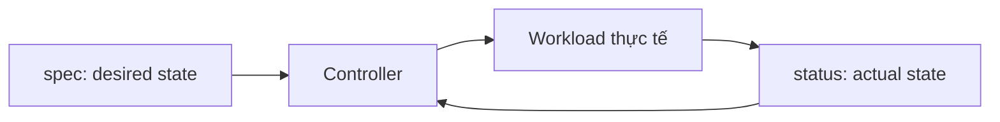

# YAML và Kubernetes Manifest

## Mục lục

- [Tổng quan](#tổng-quan)
- [1. YAML cơ bản](#1-yaml-cơ-bản)
- [2. Cấu trúc Kubernetes Manifest](#2-cấu-trúc-kubernetes-manifest)
- [3. metadata](#3-metadata)
- [4. spec và status](#4-spec-và-status)
- [5. Ví dụ Pod](#5-ví-dụ-pod)
- [6. Ví dụ Deployment](#6-ví-dụ-deployment)
- [7. Nhiều resource trong một file](#7-nhiều-resource-trong-một-file)
- [8. Validation và dry run](#8-validation-và-dry-run)
- [9. Quản lý manifest](#9-quản-lý-manifest)
- [10. Lỗi thường gặp](#10-lỗi-thường-gặp)
- [11. Bài thực hành](#11-bài-thực-hành)
- [Tài liệu tham khảo](#tài-liệu-tham-khảo)

---

## Tổng quan

Kubernetes API nhận object qua JSON hoặc các serialization format được hỗ trợ. Trong thực tế, người dùng thường viết manifest bằng YAML vì dễ đọc và hỗ trợ comment. `kubectl` đọc YAML, chuyển thành request phù hợp rồi gửi đến API Server.

Manifest trả lời bốn câu hỏi:

```yaml
apiVersion: apps/v1       # Dùng API schema nào?
kind: Deployment          # Tạo loại object nào?
metadata:                 # Object có danh tính gì?
  name: web
spec:                     # Desired state là gì?
  replicas: 2
```

> [!IMPORTANT]
> YAML hợp lệ chưa chắc là Kubernetes manifest hợp lệ. API Server còn kiểm tra schema, admission policy, authorization và các ràng buộc nghiệp vụ.

---

## 1. YAML cơ bản

### 1.1 Mapping

Mapping là tập key-value:

```yaml
name: web
replicas: 3
enabled: true
```

### 1.2 Nested mapping

Indentation thể hiện cấu trúc lồng nhau:

```yaml
metadata:
  name: web
  namespace: demo
```

Dùng spaces, không dùng tab. Hai spaces mỗi cấp là convention phổ biến.

### 1.3 List

```yaml
ports:
  - 80
  - 443
```

List object:

```yaml
containers:
  - name: web
    image: nginx:1.27-alpine
  - name: sidecar
    image: busybox:1.36
```

### 1.4 Scalar và quoting

```yaml
stringValue: hello
quotedString: "true"
booleanValue: true
integerValue: 3
nullValue: null
```

Quote khi giá trị có thể bị parser hiểu thành kiểu khác, có ký tự đặc biệt hoặc cần giữ định dạng. Environment variable trong Pod cuối cùng là string:

```yaml
env:
  - name: FEATURE_ENABLED
    value: "true"
  - name: MAX_CONNECTIONS
    value: "100"
```

### 1.5 Multi-line string

Giữ newline bằng `|`:

```yaml
data:
  app.conf: |
    server.port=8080
    log.level=info
```

Fold các dòng thành đoạn bằng `>`:

```yaml
annotations:
  description: >
    Đây là mô tả dài được viết trên
    nhiều dòng trong YAML.
```

### 1.6 Comment

```yaml
replicas: 3 # Số Pod mong muốn
```

Comment nên giải thích **vì sao**, không lặp lại tên field.

---

## 2. Cấu trúc Kubernetes Manifest

Bốn field phổ biến và gần như bắt buộc khi tạo object:

| Field | Vai trò | Ví dụ |
|-------|---------|-------|
| `apiVersion` | API group và version | `v1`, `apps/v1` |
| `kind` | Loại object | `Pod`, `Deployment` |
| `metadata` | Danh tính và dữ liệu tổ chức | name, namespace, labels |
| `spec` | Desired state | containers, replicas, selector |

Một số object không dùng `spec` theo cùng cách, ví dụ ConfigMap dùng `data`; schema cụ thể phải tra bằng API reference hoặc `kubectl explain`.

### 2.1 apiVersion

Core API group bỏ trống tên group và viết đơn giản:

```yaml
apiVersion: v1
kind: Pod
```

Named API group gồm group/version:

```yaml
apiVersion: apps/v1
kind: Deployment
```

Không tự đoán version. Kiểm tra cluster:

```bash
kubectl api-resources
kubectl api-versions
```

### 2.2 kind

`kind` là tên kiểu object, thường viết PascalCase và số ít: `Service`, `ConfigMap`, `StatefulSet`.

### 2.3 Field không hợp lệ

Kubernetes API Server hỗ trợ server-side field validation. Mặc định `kubectl` validation ở chế độ strict tương ứng. Typo như `replica` thay vì `replicas` sẽ bị báo lỗi trên cluster hiện đại thay vì âm thầm bị bỏ qua.

---

## 3. metadata

Ví dụ:

```yaml
metadata:
  name: web
  namespace: demo
  labels:
    app.kubernetes.io/name: web
    app.kubernetes.io/component: frontend
  annotations:
    example.com/owner: platform-team
```

### 3.1 name và namespace

Trong namespaced resource, danh tính thường là tổ hợp:

```text
API resource type + Namespace + name
```

Hai Pod có thể cùng tên nếu ở hai Namespace khác nhau. Cluster-scoped resource như Node không thuộc Namespace.

Nên khai báo Namespace rõ trong manifest lâu dài:

```yaml
metadata:
  name: web
  namespace: demo
```

Hoặc quản lý Namespace ở layer Kustomize/Helm. Tránh phụ thuộc vào Namespace mặc định trong context khi deploy tự động.

### 3.2 labels

Labels dùng để nhóm và select object:

```yaml
labels:
  app: web
  environment: staging
```

Selectors tạo quan hệ chức năng. Ví dụ Service chọn Pod bằng label; Deployment selector phải khớp Pod template labels.

### 3.3 annotations

Annotations chứa metadata không dùng để select:

```yaml
annotations:
  example.com/runbook: "https://example.com/runbooks/web"
```

Không lưu secret trong labels hoặc annotations vì chúng thường dễ đọc và xuất hiện trong nhiều công cụ.

### 3.4 metadata do server quản lý

Khi đọc object, bạn sẽ thấy các field như:

- `uid`.
- `resourceVersion`.
- `generation`.
- `creationTimestamp`.
- `managedFields`.

Không copy mù quáng các field này từ output `kubectl get -o yaml` sang manifest mới.

---

## 4. spec và status

### 4.1 spec

`spec` mô tả desired state. Schema phụ thuộc `kind`.

```yaml
spec:
  replicas: 3
```

### 4.2 status

`status` do Kubernetes cập nhật để mô tả actual state:

```yaml
status:
  availableReplicas: 3
  readyReplicas: 3
```

Manifest người dùng thường không khai báo `status`. Nhiều resource có `/status` subresource riêng để controller cập nhật mà không ghi đè `spec`.



`metadata.generation` tăng khi desired state thay đổi. Nhiều controller ghi `status.observedGeneration` để cho biết generation nào đã được xử lý.

---

## 5. Ví dụ Pod

```yaml
apiVersion: v1
kind: Pod
metadata:
  name: web-pod
  namespace: demo
  labels:
    app: web
spec:
  containers:
    - name: nginx
      image: nginx:1.27-alpine
      ports:
        - name: http
          containerPort: 80
          protocol: TCP
      resources:
        requests:
          cpu: 50m
          memory: 64Mi
        limits:
          memory: 128Mi
```

Đọc từ ngoài vào trong:

1. Tạo object `Pod` từ core API `v1`.
2. Tên Pod là `web-pod` trong Namespace `demo`.
3. Pod có label `app=web`.
4. Pod chạy một Container tên `nginx`.
5. Container dùng image NGINX và khai báo port 80.
6. Scheduler dùng requests để tìm Node phù hợp.
7. Memory limit tạo ranh giới sử dụng memory cho Container.

`containerPort` không expose ứng dụng ra ngoài cluster; nó chủ yếu mô tả port. Cần Service hoặc port-forward để truy cập ổn định.

---

## 6. Ví dụ Deployment

```yaml
apiVersion: apps/v1
kind: Deployment
metadata:
  name: web
  namespace: demo
  labels:
    app.kubernetes.io/name: web
spec:
  replicas: 2
  selector:
    matchLabels:
      app: web
  template:
    metadata:
      labels:
        app: web
    spec:
      containers:
        - name: nginx
          image: nginx:1.27-alpine
          ports:
            - name: http
              containerPort: 80
          readinessProbe:
            httpGet:
              path: /
              port: http
            initialDelaySeconds: 2
            periodSeconds: 5
          resources:
            requests:
              cpu: 50m
              memory: 64Mi
            limits:
              memory: 128Mi
```

Ba lớp cần phân biệt:

```text
Deployment metadata
└── Deployment spec
    └── Pod template metadata
        └── Pod template spec
            └── containers
```

Sai lầm phổ biến là đặt `containers` trực tiếp dưới Deployment `spec`. Deployment không chạy Container; nó quản lý ReplicaSet, còn ReplicaSet tạo Pod từ `spec.template`.

### 6.1 Selector phải khớp labels

```yaml
selector:
  matchLabels:
    app: web

template:
  metadata:
    labels:
      app: web
```

Nếu không khớp, API Server từ chối Deployment hoặc controller không thể sở hữu đúng Pods.

---

## 7. Nhiều resource trong một file

Dùng `---` để phân tách YAML documents:

```yaml
apiVersion: v1
kind: Namespace
metadata:
  name: demo
---
apiVersion: v1
kind: ConfigMap
metadata:
  name: web-config
  namespace: demo
data:
  LOG_LEVEL: info
```

Ưu điểm:

- Dễ chạy một tutorial nhỏ.
- Giữ các resource liên quan gần nhau.

Nhược điểm:

- File lớn khó review.
- Khó tái sử dụng hoặc apply từng resource.
- Ownership giữa các thành phần dễ mơ hồ.

Production thường chia file theo resource hoặc component, sau đó dùng Kustomize, Helm hay GitOps tool để quản lý tập manifest.

---

## 8. Validation và dry run

### 8.1 Parse YAML

Có thể dùng linter như `yamllint` để phát hiện indentation và syntax. Nhưng linter YAML không biết Kubernetes schema.

### 8.2 Client-side dry run

```bash
kubectl apply --dry-run=client -f deployment.yaml
```

Không cần gửi đầy đủ qua admission chain, phù hợp kiểm tra nhanh.

### 8.3 Server-side dry run

```bash
kubectl apply --dry-run=server -f deployment.yaml
```

API Server thực hiện validation và admission nhưng không persist object. Đây là kiểm tra gần hành vi thật hơn và cần quyền tương ứng.

### 8.4 diff

```bash
kubectl diff -f deployment.yaml
```

Review thay đổi trước khi apply:

```bash
kubectl apply -f deployment.yaml
```

### 8.5 explain

```bash
kubectl explain deployment.spec
kubectl explain deployment.spec.template.spec.containers
```

Không chắc field nằm ở đâu thì dùng `explain` thay vì thử indentation ngẫu nhiên.

---

## 9. Quản lý manifest

### 9.1 Một nguồn sự thật

Manifest lâu dài phải nằm trong Git. Mọi thay đổi trực tiếp bằng `kubectl edit`, `patch` hoặc `set image` cần được phản ánh lại vào source; nếu không lần apply sau có thể ghi đè.

### 9.2 Không commit secret plaintext

Không lưu password, token hoặc private key trực tiếp trong repository. Base64 trong Kubernetes Secret chỉ là encoding.

### 9.3 Tránh field do server sinh

Khi lấy object live để tạo manifest, loại bỏ:

- `status`.
- `metadata.uid`.
- `metadata.resourceVersion`.
- `metadata.creationTimestamp`.
- `metadata.managedFields`.
- Field mặc định không cần thiết.

### 9.4 Đặt tên và labels nhất quán

Dùng recommended labels khi dự án lớn:

```yaml
app.kubernetes.io/name: checkout
app.kubernetes.io/instance: checkout-staging
app.kubernetes.io/component: api
app.kubernetes.io/part-of: shop
app.kubernetes.io/managed-by: helm
```

### 9.5 Không lặp cấu hình bằng copy-paste

Khi có nhiều môi trường, dùng Kustomize overlays, Helm values hoặc công cụ tương đương. Tránh duy trì nhiều bản YAML gần giống nhau bằng tay.

---

## 10. Lỗi thường gặp

| Lỗi | Triệu chứng | Cách xử lý |
|-----|-------------|------------|
| Dùng tab | YAML parser error | Dùng spaces |
| Sai cấp indentation | Field nằm sai object | `kubectl explain` và formatter |
| Sai `apiVersion` | No matches for kind | `kubectl api-resources`, migration guide |
| `replica` thay vì `replicas` | Unknown field | Server-side dry run |
| Selector không khớp | Deployment bị từ chối | Đồng bộ selector và template labels |
| Số không quote trong env | Schema/type error | Dùng `value: "123"` |
| Copy `status` và metadata hệ thống | Conflict hoặc manifest nhiễu | Chỉ giữ desired fields |
| Dùng `latest` | Khó tái tạo, image thay đổi | Pin version/digest |
| Secret để plaintext trong Git | Rò rỉ credentials | External secret hoặc encrypted workflow |

---

## 11. Bài thực hành

Tạo Namespace:

```bash
kubectl create namespace yaml-lab
```

Lưu Deployment ở trên thành `deployment.yaml`, đổi Namespace thành `yaml-lab`, sau đó:

```bash
kubectl apply --dry-run=server -f deployment.yaml
kubectl diff -f deployment.yaml || true
kubectl apply -f deployment.yaml
kubectl get deployment,pods -n yaml-lab
kubectl get deployment web -n yaml-lab -o yaml
```

Thử đổi `replicas: 2` thành `replicas: 3`, xem diff rồi apply lại.

Cleanup:

```bash
kubectl delete namespace yaml-lab
```

---

## Tài liệu tham khảo

- [Objects in Kubernetes](https://kubernetes.io/docs/concepts/overview/working-with-objects/)
- [Kubernetes API Reference](https://kubernetes.io/docs/reference/kubernetes-api/)
- [Recommended Labels](https://kubernetes.io/docs/concepts/overview/working-with-objects/common-labels/)
- [Declarative Management](https://kubernetes.io/docs/tasks/manage-kubernetes-objects/declarative-config/)
- [Kubernetes API Resources](/gioi-thieu/api-resources/)
