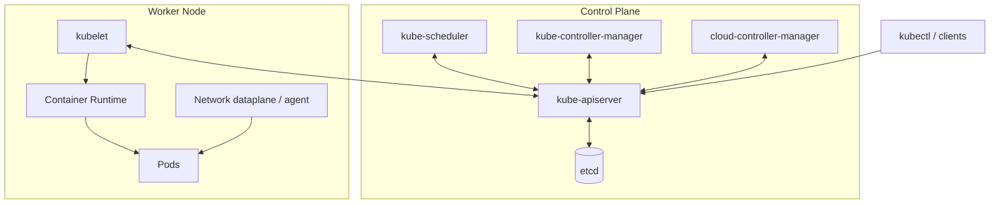

# Các thành phần trong Cluster

## Mục lục

- [Tổng quan](#tổng-quan)
- [1. Bản đồ component](#1-bản-đồ-component)
- [2. Control Plane components](#2-control-plane-components)
- [3. Node components](#3-node-components)
- [4. Add-ons và plugin interfaces](#4-add-ons-và-plugin-interfaces)
- [5. Component giao tiếp với nhau thế nào](#5-component-giao-tiếp-với-nhau-thế-nào)
- [6. Ai sở hữu trạng thái nào](#6-ai-sở-hữu-trạng-thái-nào)
- [7. Cách component được triển khai](#7-cách-component-được-triển-khai)
- [8. Health, metrics, logs và Events](#8-health-metrics-logs-và-events)
- [9. Lỗi ở đâu thì triệu chứng thế nào](#9-lỗi-ở-đâu-thì-triệu-chứng-thế-nào)
- [10. Thực hành lập inventory](#10-thực-hành-lập-inventory)
- [11. Checklist ghi nhớ](#11-checklist-ghi-nhớ)
- [Tài liệu tham khảo](#tài-liệu-tham-khảo)

---

## Tổng quan

Kubernetes là tập hợp nhiều component chuyên trách, không phải một tiến trình duy nhất. Mỗi component quan sát một phần trạng thái và thực hiện một loại quyết định. Hiểu ranh giới này giúp trả lời nhanh hai câu hỏi:

1. Khi một resource thay đổi, component nào phải phản ứng?
2. Khi trạng thái không hội tụ, nên kiểm tra component nào trước?



> [!IMPORTANT]
> Chỉ API Server đọc và ghi etcd trong kiến trúc Kubernetes chuẩn. Scheduler, controller và kubelet giao tiếp với API Server thay vì truy cập etcd trực tiếp.

---

## 1. Bản đồ component

| Component | Chạy ở đâu | Trách nhiệm chính | Đầu ra quan trọng |
|-----------|-------------|-------------------|--------------------|
| kube-apiserver | Control Plane | Phục vụ API, authn/authz, admission, persistence | API response, stored objects |
| etcd | Control Plane | Lưu cluster state nhất quán | Key-value revisions, quorum |
| kube-scheduler | Control Plane | Chọn Node cho Pod | Pod binding/`spec.nodeName` |
| kube-controller-manager | Control Plane | Chạy built-in control loops | Resource con, status, cleanup |
| cloud-controller-manager | Control Plane | Tích hợp cloud API | Node, route, load balancer state |
| kubelet | Mỗi Node | Hiện thực PodSpec trên Node | Pod/Node status |
| Container Runtime | Mỗi Node | Quản lý sandbox, image, Container | Running containers |
| Network agent/dataplane | Mỗi Node hoặc external | Pod network và Service routing | Interface, route, rule |
| CoreDNS | Add-on | Cluster DNS | DNS records/service discovery |
| CSI components | Controller và Node | Provision/attach/mount storage | Volumes sẵn sàng cho Pod |

Một bản Kubernetes distribution có thể thay đổi cách đóng gói và triển khai, nhưng contract giữa các lớp vẫn tương tự.

---

## 2. Control Plane components

### 2.1 kube-apiserver

API Server là frontend của Control Plane:

- Phục vụ REST API và discovery.
- Xác thực request.
- Kiểm tra authorization.
- Chạy mutating và validating admission.
- Validate schema và business rules.
- Chuyển đổi API version.
- Lưu hoặc đọc object qua etcd.
- Cung cấp list/watch cho client và controller.

API Server được thiết kế stateless ở tầng process, vì vậy có thể chạy nhiều replica sau load balancer. Dữ liệu bền vững nằm ở etcd.

Đọc sâu tại [kube-apiserver](/kien-truc/kube-apiserver/).

### 2.2 etcd

etcd là distributed key-value store sử dụng Raft để đạt consensus. Nó lưu Kubernetes API state, không phải log và database nghiệp vụ của application.

Các đặc tính cần nhớ:

- Consistency mạnh cho operation quan trọng.
- Cần quorum để tiếp tục ghi.
- Disk latency ảnh hưởng trực tiếp Control Plane.
- Backup và restore phải được kiểm thử.
- Truy cập cần TLS và giới hạn chặt.

Đọc sâu tại [etcd](/kien-truc/etcd/).

### 2.3 kube-scheduler

Scheduler quan sát Pod chưa có Node, sau đó:

1. Đưa Pod vào scheduling queue.
2. Filter các Node không hợp lệ.
3. Score Node còn lại.
4. Chọn Node và ghi binding.

Scheduler không start Container và không quản lý Pod sau khi bind. Kubelet chịu trách nhiệm thực thi trên Node.

Đọc sâu tại [kube-scheduler](/kien-truc/kube-scheduler/).

### 2.4 kube-controller-manager

Đây là một binary chạy nhiều controller built-in, ví dụ:

- Deployment, ReplicaSet và StatefulSet controllers.
- Node lifecycle controller.
- Job và CronJob controllers.
- EndpointSlice controller.
- ServiceAccount token và Namespace controllers.
- PersistentVolume-related controllers.
- Garbage collector.

Mỗi controller tập trung vào một resource relationship, nhưng cùng dùng pattern watch → compare → act.

Đọc sâu tại [Controller Manager](/kien-truc/controller-manager/).

### 2.5 cloud-controller-manager

Khi cluster tích hợp cloud provider, component này tách logic cloud khỏi Kubernetes core. Các controller có thể quản lý:

- Node metadata và lifecycle theo cloud API.
- Route mạng, tùy provider.
- External load balancer cho Service.

Không phải cluster nào cũng có `cloud-controller-manager`; local cluster thường không cần.

---

## 3. Node components

### 3.1 kubelet

kubelet là agent chính trên mỗi Node. Nó:

- Đăng ký hoặc cập nhật Node object.
- Watch Pod được bind vào Node.
- Chuẩn bị volume, Secret và ConfigMap cần thiết.
- Gọi Container Runtime qua CRI.
- Chạy liveness/startup probe ở Node.
- Cập nhật Pod status và Node status.
- Thực hiện eviction khi Node chịu resource pressure theo policy.

kubelet không quản lý mọi Container trên máy; trọng tâm là Container thuộc PodSpec từ nguồn được chấp nhận.

### 3.2 Container Runtime

Runtime hiện thực CRI, thường là `containerd` hoặc CRI-O. Runtime chịu trách nhiệm:

- Pull và quản lý image.
- Tạo Pod sandbox.
- Start/stop Container.
- Cung cấp trạng thái và log path cho kubelet.

Docker Engine không còn được kubelet tích hợp trực tiếp qua dockershim. Image theo OCI vẫn có thể chạy bằng runtime tương thích.

### 3.3 Network dataplane

Tùy distribution, Service routing có thể được hiện thực bởi `kube-proxy` hoặc dataplane khác. CNI plugin thiết lập network cho Pod sandbox. Đừng đồng nhất hai vai trò:

- **CNI:** kết nối Pod vào mạng.
- **Service dataplane:** chuyển traffic Service đến backend Pod.

### 3.4 Node-level agents

DaemonSet thường được dùng để triển khai agent trên mỗi Node:

- Log collector.
- Metrics exporter.
- CNI node agent.
- CSI node plugin.
- Runtime security sensor.

Các agent này quan trọng với platform nhưng không phải tất cả đều là core component.

Đọc sâu tại [kubelet và Container Runtime](/kien-truc/kubelet-container-runtime/).

---

## 4. Add-ons và plugin interfaces

### 4.1 CoreDNS

CoreDNS thường chạy dưới dạng Deployment trong `kube-system`. Nó cung cấp DNS record cho Service và hỗ trợ Pod/service discovery. Nếu CoreDNS lỗi, Pod có thể vẫn Running nhưng gọi dependency bằng hostname thất bại.

### 4.2 CNI

Container Network Interface là contract giữa runtime và network plugin. Plugin tạo interface, cấp IP, route và có thể hiện thực policy. Kubernetes không bắt buộc một CNI vendor duy nhất.

### 4.3 CSI

Container Storage Interface tách storage implementation khỏi Kubernetes core. CSI thường có:

- Controller components để provision, attach hoặc snapshot.
- Node plugin để stage và mount volume.

### 4.4 CRI

Container Runtime Interface là gRPC API giữa kubelet và runtime. CRI làm cho kubelet không phải chứa code tích hợp riêng cho từng runtime.

| Interface | Kết nối | Mục đích |
|-----------|---------|----------|
| CRI | kubelet ↔ runtime | Container lifecycle và image |
| CNI | runtime/node agent ↔ network plugin | Pod network |
| CSI | Kubernetes/storage components ↔ driver | Volume lifecycle |

---

## 5. Component giao tiếp với nhau thế nào

### 5.1 List và watch

Controller thường `list` trạng thái ban đầu, sau đó `watch` thay đổi từ một `resourceVersion`. Watch là stream event, giúp tránh polling toàn bộ API liên tục.

Client phải xử lý:

- Reconnect khi stream đóng.
- Event bị trễ hoặc gộp.
- Cache có thể tạm thời cũ.
- Resync/re-list khi resourceVersion không còn khả dụng.

### 5.2 Work queue

Thay vì xử lý toàn bộ logic ngay trong watch handler, controller thường đưa key như `namespace/name` vào rate-limited queue. Worker đọc key, lấy trạng thái mới nhất rồi reconcile.

```text
API watch → informer/cache → event handler → work queue → reconcile worker → API update
```

Cách này cho phép retry và gộp nhiều event của cùng object.

### 5.3 Optimistic concurrency

API object có `metadata.resourceVersion`. Khi nhiều actor update cùng object, API Server có thể trả conflict. Client đúng phải đọc trạng thái mới và retry, không ghi đè mù quáng.

### 5.4 Leader election

Nhiều component có thể chạy nhiều replica để HA nhưng chỉ một leader thực hiện một số control loop tại một thời điểm. Leader election thường dùng Lease objects. API Server là ngoại lệ điển hình: nhiều replica có thể đồng thời phục vụ request.

---

## 6. Ai sở hữu trạng thái nào

Không có một component duy nhất “sở hữu cả Pod”. Nhiều actor quản lý các field hoặc khía cạnh khác nhau.

| Trạng thái | Actor chính |
|------------|-------------|
| Deployment desired replicas/template | User, GitOps hoặc deployment system |
| ReplicaSet của Deployment | Deployment controller |
| Số Pod của ReplicaSet | ReplicaSet controller |
| Node được chọn cho Pod | Scheduler |
| Pod/container runtime status | kubelet |
| EndpointSlice của Service | EndpointSlice controller |
| Service dataplane rules | kube-proxy hoặc implementation thay thế |
| Volume provisioning | CSI provisioner |
| Final cleanup | Controller sở hữu finalizer |

`managedFields`, `ownerReferences`, `conditions` và Events giúp xác định actor.

```bash
kubectl get deployment <name> -n <namespace> -o yaml
kubectl get pod <name> -n <namespace> -o jsonpath='{.metadata.ownerReferences}'
kubectl get pod <name> -n <namespace> -o jsonpath='{.status.conditions}'
```

> [!TIP]
> Khi field “tự đổi lại”, hãy kiểm tra controller, GitOps tool và `managedFields` trước khi kết luận API Server làm mất cấu hình.

---

## 7. Cách component được triển khai

### 7.1 Static Pods trong kubeadm

Một cluster kubeadm thường chạy API Server, Scheduler và Controller Manager dưới dạng static Pod. Manifest nằm trên Control Plane Node, thường trong:

```text
/etc/kubernetes/manifests/
```

kubelet theo dõi directory này và tạo mirror Pod trong API để quan sát. Xóa mirror Pod bằng API không loại bỏ static Pod; kubelet sẽ tạo lại từ manifest local.

### 7.2 Systemd services

kubelet và Container Runtime thường chạy dưới systemd:

```bash
systemctl status kubelet
systemctl status containerd
journalctl -u kubelet
```

Cách đóng gói khác nhau tùy OS và distribution.

### 7.3 Managed Control Plane

Trong managed Kubernetes, người dùng thường không thấy manifest, process hoặc host của Control Plane. Provider cung cấp endpoint, metrics/log tùy gói dịch vụ và SLA. Troubleshooting cần dùng API/provider observability thay vì SSH.

---

## 8. Health, metrics, logs và Events

### 8.1 Health endpoints

API Server thường có:

- `/livez`: process có sống không.
- `/readyz`: đã sẵn sàng phục vụ traffic chưa.

Ví dụ, nếu có quyền:

```bash
kubectl get --raw='/livez?verbose'
kubectl get --raw='/readyz?verbose'
```

Không nên dựa vào API `ComponentStatus` cũ để đánh giá toàn bộ Control Plane.

### 8.2 Metrics

Control Plane và Node components expose Prometheus-format metrics theo cấu hình. Các nhóm tín hiệu quan trọng:

- API request rate, latency và error.
- Work queue depth và retry.
- Scheduling attempts và latency.
- etcd request latency, leader và database size.
- kubelet operation latency, runtime errors và Pod startup.

### 8.3 Logs

- Static Pod logs có thể xem qua `kubectl logs` nếu API còn hoạt động.
- kubelet/runtime logs thường nằm trong journald.
- Managed cluster dùng logging facility của provider.

### 8.4 Events

Event là tín hiệu có retention giới hạn, phù hợp troubleshooting gần thời điểm xảy ra lỗi, không phải audit log bền vững.

```bash
kubectl get events -A --sort-by=.metadata.creationTimestamp
```

---

## 9. Lỗi ở đâu thì triệu chứng thế nào

| Triệu chứng | Component/lớp cần kiểm tra trước |
|-------------|----------------------------------|
| Mọi `kubectl` request timeout | API endpoint, load balancer, kube-apiserver |
| API đọc được nhưng create/update lỗi diện rộng | admission, etcd, API Server |
| Pod mãi `Pending`, không có Node | Scheduler, constraints, cluster capacity |
| Deployment không tạo ReplicaSet | Deployment controller/KCM |
| Pod đã có Node nhưng không start | kubelet, runtime, CNI, CSI |
| `ImagePullBackOff` | Runtime, registry, credentials, network |
| Pod gọi Service name thất bại | CoreDNS, CNI, NetworkPolicy |
| Service có endpoint nhưng traffic không đi | Service dataplane, CNI, policy |
| PVC `Pending` | StorageClass, CSI provisioner, topology |
| Node `NotReady` | kubelet, runtime, network, node pressure |

Một triệu chứng có thể đi qua nhiều lớp. Bảng này chỉ cho điểm bắt đầu, không thay thế evidence từ status, conditions, Events, logs và metrics.

---

## 10. Thực hành lập inventory

### 10.1 Xác định component quan sát được

```bash
kubectl cluster-info
kubectl get nodes -o wide
kubectl get pods -n kube-system -o wide
```

Trên cluster kubeadm hoặc kind, lọc Control Plane Pods:

```bash
kubectl get pods -n kube-system \
  -l tier=control-plane \
  -o custom-columns='NAME:.metadata.name,COMPONENT:.metadata.labels.component,NODE:.spec.nodeName,STATUS:.status.phase'
```

Lệnh trên có thể trả rỗng trên managed cluster hoặc distribution dùng label khác.

### 10.2 Xem Node runtime và condition

```bash
kubectl get nodes \
  -o custom-columns='NAME:.metadata.name,READY:.status.conditions[?(@.type=="Ready")].status,RUNTIME:.status.nodeInfo.containerRuntimeVersion,KUBELET:.status.nodeInfo.kubeletVersion'
```

### 10.3 Theo dõi component phản ứng

```bash
kubectl create namespace component-lab
kubectl create deployment demo \
  --image=nginx:1.27-alpine \
  --replicas=2 \
  -n component-lab

kubectl get deployment,replicaset,pods \
  -n component-lab \
  --watch
```

Ở terminal khác:

```bash
kubectl get events \
  -n component-lab \
  --watch
```

Scale workload và quan sát resource chain:

```bash
kubectl scale deployment/demo --replicas=4 -n component-lab
kubectl get deployment,replicaset,pods -n component-lab -o wide
kubectl delete namespace component-lab
```

---

## 11. Checklist ghi nhớ

- API Server là hub giao tiếp và là component truy cập etcd.
- etcd giữ cluster state; disk và quorum của etcd quyết định khả năng ghi.
- Scheduler chỉ quyết định Node, không chạy Container.
- Controller Manager chứa nhiều reconciliation loop.
- kubelet hiện thực PodSpec trên một Node.
- Runtime quản lý image, sandbox và Container qua CRI.
- CNI, CSI và CRI là các contract khác nhau.
- CoreDNS, ingress controller và metrics stack là add-ons, không phải tất cả đều có sẵn.
- Status, conditions, Events, logs và metrics phải được đọc cùng nhau.

Tiếp theo, đọc [Control Plane](/kien-truc/control-plane/) để hiểu availability, deployment topology và data flow của miền quản trị.

---

## Tài liệu tham khảo

- [Kubernetes Components](https://kubernetes.io/docs/concepts/overview/components/)
- [Cluster Architecture](https://kubernetes.io/docs/concepts/architecture/)
- [Container Runtime Interface](https://kubernetes.io/docs/concepts/architecture/cri/)
- [Controllers](https://kubernetes.io/docs/concepts/architecture/controller/)
- [Static Pods](https://kubernetes.io/docs/tasks/configure-pod-container/static-pod/)
