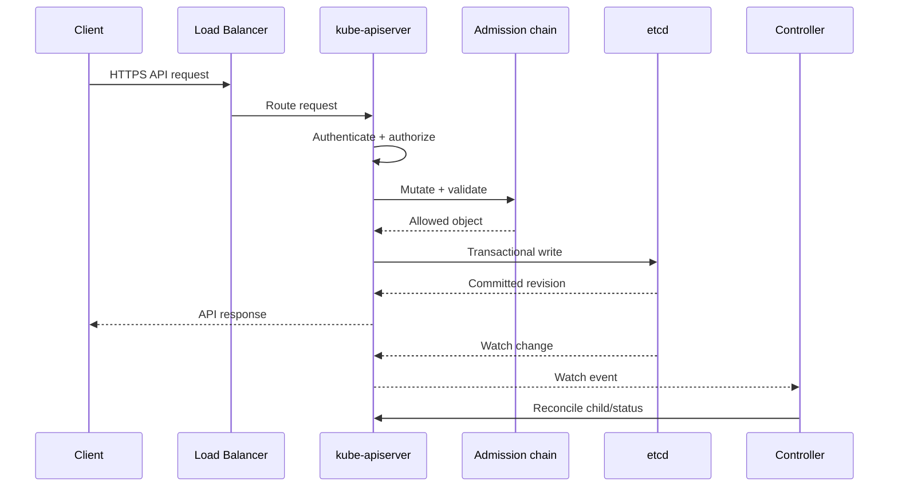

# Control Plane

## Mục lục

- [Tổng quan](#tổng-quan)
- [1. Trách nhiệm và ranh giới](#1-trách-nhiệm-và-ranh-giới)
- [2. Kiến trúc bên trong](#2-kiến-trúc-bên-trong)
- [3. Data flow của một thay đổi](#3-data-flow-của-một-thay-đổi)
- [4. Topology triển khai](#4-topology-triển-khai)
- [5. High Availability và quorum](#5-high-availability-và-quorum)
- [6. Leader election và tính idempotent](#6-leader-election-và-tính-idempotent)
- [7. Bảo mật Control Plane](#7-bảo-mật-control-plane)
- [8. Capacity và performance](#8-capacity-và-performance)
- [9. Failure modes](#9-failure-modes)
- [10. Quan sát và troubleshooting](#10-quan-sát-và-troubleshooting)
- [11. Thực hành trên local cluster](#11-thực-hành-trên-local-cluster)
- [12. Best practices production](#12-best-practices-production)
- [Tài liệu tham khảo](#tài-liệu-tham-khảo)

---

## Tổng quan

Control Plane là miền quản trị của Kubernetes. Nó tiếp nhận desired state, lưu cluster state, thực thi policy, đưa ra scheduling decision và chạy các control loop. Workload tiếp tục chạy trong một khoảng thời gian khi Control Plane tạm thời mất kết nối, nhưng cluster không thể tạo, sửa hoặc tự phục hồi đầy đủ cho đến khi Control Plane hoạt động lại.

```text
                         Client traffic
                              │
                        Load Balancer
                              │
              ┌───────────────┼───────────────┐
              ▼               ▼               ▼
        API Server A    API Server B    API Server C
              └───────────────┬───────────────┘
                              │
                    ┌─────────┴─────────┐
                    │    etcd quorum    │
                    │ member 1/2/3      │
                    └───────────────────┘

        Scheduler replicas       Controller Manager replicas
          one active leader          one active leader/group
```

> [!IMPORTANT]
> Control Plane HA có hai mô hình khác nhau: API Server scale theo nhiều active replica, còn Scheduler và Controller Manager thường dùng leader election để tránh cùng ra quyết định lặp lại không kiểm soát.

---

## 1. Trách nhiệm và ranh giới

Control Plane chịu trách nhiệm:

- Cung cấp Kubernetes API và discovery.
- Bảo vệ API bằng authentication, authorization và admission.
- Persist desired/actual state của Kubernetes objects.
- Chọn Node cho Pod.
- Duy trì control loops cho resource built-in.
- Phát hiện một số failure và tạo hành động bù trừ.
- Cung cấp status để client và operator quan sát.

Control Plane không tự động:

- Sửa bug ứng dụng.
- Backup database của workload.
- Đảm bảo mọi Pod Ready nếu image hoặc configuration sai.
- Cung cấp CNI, CSI, ingress, monitoring stack trong mọi distribution.
- Biến workload một replica thành High Availability.

Ranh giới quan trọng nhất là giữa **cluster management state** và **application runtime/data**. etcd lưu object như Deployment và Secret; dữ liệu PostgreSQL của ứng dụng phải có backup riêng.

---

## 2. Kiến trúc bên trong

### 2.1 kube-apiserver: API frontend

API Server là entry point cho client và component. Nó được thiết kế để có thể chạy nhiều replica, không cần leader election cho việc phục vụ request thông thường.

Các trách nhiệm chính:

- TLS termination và API routing.
- Authentication và authorization.
- Admission chain.
- Schema validation và conversion.
- Đọc/ghi storage.
- List/watch streams.
- Audit events nếu được cấu hình.

### 2.2 etcd: durable state

etcd lưu state đã được API Server chuẩn hóa. etcd dùng consensus để duy trì consistency giữa các member. Khi mất quorum, read behavior phụ thuộc loại operation và trạng thái, nhưng write mới không thể commit an toàn.

### 2.3 kube-scheduler: placement decision

Scheduler xem Pod chưa có Node, đánh giá constraints và ghi binding. Nó tách quyết định placement khỏi execution.

### 2.4 kube-controller-manager: convergence engine

Controller Manager chạy nhiều controller. Mỗi controller quan sát object và thực hiện action để giảm chênh lệch giữa desired và actual state.

### 2.5 cloud-controller-manager: provider integration

Component tùy chọn này tương tác với cloud API cho Node lifecycle, routes hoặc load balancer. Managed Kubernetes có thể ẩn implementation khỏi người dùng.

Đọc chi tiết tại [kube-apiserver](/kien-truc/kube-apiserver/), [etcd](/kien-truc/etcd/), [kube-scheduler](/kien-truc/kube-scheduler/) và [Controller Manager](/kien-truc/controller-manager/).

---

## 3. Data flow của một thay đổi

### 3.1 Write path



Request thành công nghĩa object đã được chấp nhận và persist, không nghĩa mọi controller đã hoàn tất.

### 3.2 Read path

Client gửi GET/LIST/WATCH đến API Server. API Server có thể phục vụ qua cache hoặc storage path tùy request và consistency requirement. Client không nên dựa vào thứ tự wall-clock giữa nhiều watch stream độc lập.

### 3.3 Controller path

Controller thường:

1. Watch resource.
2. Lưu object vào local cache.
3. Đưa key vào work queue.
4. Worker đọc trạng thái mới nhất.
5. Tính action cần thiết.
6. Gọi API để create/update/delete.
7. Retry với backoff nếu có lỗi.

Đây là lý do Control Plane có thể tiếp tục hội tụ sau transient failure.

---

## 4. Topology triển khai

### 4.1 Stacked etcd topology

Mỗi Control Plane Node chạy cả component Kubernetes và một etcd member.

```text
CP Node 1: API + Scheduler + Controllers + etcd 1
CP Node 2: API + Scheduler + Controllers + etcd 2
CP Node 3: API + Scheduler + Controllers + etcd 3
```

**Ưu điểm:** ít host, topology đơn giản hơn.

**Nhược điểm:** failure của một Node ảnh hưởng đồng thời API capacity và etcd member.

### 4.2 External etcd topology

etcd chạy trên các host riêng.

```text
Control Plane Nodes: API + Scheduler + Controllers
etcd Nodes:          etcd 1 + etcd 2 + etcd 3
```

**Ưu điểm:** cô lập resource và failure domain tốt hơn.

**Nhược điểm:** nhiều máy, certificate, monitoring và quy trình vận hành hơn.

### 4.3 Managed Control Plane

Provider sở hữu topology, patch và một phần availability. Người dùng vẫn cần hiểu:

- API endpoint/SLA.
- Upgrade channel và maintenance window.
- Audit/logging options.
- Private/public endpoint policy.
- Backup/restore contract.
- Limit và quota của API.

---

## 5. High Availability và quorum

### 5.1 API Server availability

Chạy nhiều API Server sau load balancer. Health check của load balancer nên phản ánh readiness, không chỉ TCP port mở. Client dùng một stable endpoint trong kubeconfig.

### 5.2 etcd quorum

Với `N` voting members, quorum là:

```text
floor(N / 2) + 1
```

| Số member | Quorum | Có thể mất |
|-----------|--------|-------------|
| 1 | 1 | 0 |
| 3 | 2 | 1 |
| 5 | 3 | 2 |

Thêm member không luôn làm nhanh hơn; consensus và network overhead tăng. Production thường dùng 3 hoặc 5 member với số lẻ.

### 5.3 Scheduler và controller availability

Chạy nhiều replica, bật leader election. Khi leader lỗi, replica khác acquire Lease và tiếp tục. Trong failover interval, decision mới có thể chậm nhưng Pod đang chạy không tự biến mất chỉ vì scheduler down.

### 5.4 Failure domain thực tế

Replica chỉ có giá trị khi được tách khỏi cùng điểm lỗi:

- Khác VM/host.
- Khác rack hoặc zone khi latency cho phép.
- Nguồn điện và network path độc lập.
- Disk độc lập, đủ IOPS.
- Load balancer không là single point of failure.

---

## 6. Leader election và tính idempotent

Leader election tránh nhiều Scheduler hoặc controller active cùng thực hiện quyết định không cần thiết. Kubernetes thường dùng resource `Lease` trong Namespace hệ thống.

```bash
kubectl get leases -A
```

Leader election không thay thế idempotency. Controller vẫn phải an toàn khi:

- Action đã thành công nhưng response bị mất.
- Event được gửi nhiều lần.
- Leader cũ dừng giữa reconciliation.
- Leader mới đọc state sau failover.

Thiết kế đúng luôn quan sát state hiện tại trước khi hành động, thay vì dựa vào “bước trước chắc chắn đã chạy”.

---

## 7. Bảo mật Control Plane

### 7.1 API endpoint

- Dùng TLS và certificate rotation.
- Giới hạn network access bằng private endpoint/firewall khi phù hợp.
- Không expose unauthenticated health hoặc debug endpoint tùy tiện.
- Bảo vệ kubeconfig admin như credential đặc quyền cao.

### 7.2 Identity và policy

Pipeline bảo mật khái niệm:

```text
TLS → Authentication → Authorization → Admission → Validation → Storage
```

Cần áp dụng:

- RBAC least privilege.
- Admission policy cho workload security và governance.
- Audit policy đủ dùng nhưng kiểm soát volume và dữ liệu nhạy cảm.
- ServiceAccount token ngắn hạn/projected thay cho credential tĩnh khi có thể.

### 7.3 etcd security

- mTLS giữa API Server và etcd, giữa các etcd peer.
- Network isolation để workload không truy cập endpoint etcd.
- Encryption at rest cho resource nhạy cảm ở API layer.
- Backup được mã hóa và kiểm soát quyền.

Base64 trong Secret không phải encryption. Nếu bật encryption at rest, cần quản lý key và rotation cẩn thận.

### 7.4 Host hardening

Với self-managed cluster:

- Giảm package và user không cần thiết.
- Bảo vệ `/etc/kubernetes/`, PKI và static Pod manifests.
- Đồng bộ thời gian.
- Patch OS/runtime theo quy trình.
- Không chạy application workload trên Control Plane nếu không có lý do rõ ràng.

---

## 8. Capacity và performance

Control Plane load phụ thuộc không chỉ số Node mà còn:

- Số object và tốc độ churn.
- Số watch connection.
- Admission webhook latency.
- CRD size và controller behavior.
- Event volume.
- LIST request lớn.
- etcd disk latency và database size.

### 8.1 Dấu hiệu saturation

- API request latency tăng.
- HTTP `429` hoặc timeout tăng.
- Work queue depth tăng liên tục.
- Scheduler latency tăng.
- etcd fsync/WAL latency cao.
- Admission webhook timeout.

### 8.2 Nguyên tắc tối ưu

- Đặt resource requests/limits phù hợp cho component.
- Dùng SSD độ trễ thấp cho etcd.
- Giới hạn controller hoặc client list/watch không hiệu quả.
- Dùng pagination cho LIST lớn.
- Thiết kế admission webhook nhanh, HA và có failure policy rõ.
- Theo dõi API Priority and Fairness thay vì chỉ tăng timeout.

Tăng CPU không khắc phục được disk latency, webhook chậm hoặc client tạo request storm.

---

## 9. Failure modes

| Failure | Tác động | Điều vẫn có thể tiếp tục |
|---------|----------|--------------------------|
| Một API Server replica lỗi | Capacity giảm; LB route sang replica khác | Cluster bình thường nếu còn replica healthy |
| Tất cả API Server lỗi | Không đọc/ghi API; controllers và Node mất hub | Container đang chạy có thể tiếp tục |
| Scheduler lỗi | Pod mới không được bind | Pod đã schedule tiếp tục chạy |
| Controller Manager lỗi | Không tạo resource bù trừ/rollout đúng lúc | Pod hiện có và kubelet vẫn hoạt động |
| etcd mất quorum | Không commit write mới an toàn | Workload đang chạy có thể tiếp tục tạm thời |
| Admission webhook lỗi | Request liên quan có thể bị block/bypass theo policy | Existing objects vẫn tồn tại |
| Certificate hết hạn | Component/client không kết nối TLS được | Tác động tùy certificate |

> [!CAUTION]
> “Pod vẫn chạy” không có nghĩa hệ thống an toàn lâu dài. Khi Node hoặc Pod tiếp theo lỗi, Control Plane không khỏe có thể không tạo được replacement.

---

## 10. Quan sát và troubleshooting

### 10.1 Kiểm tra API trước

```bash
kubectl cluster-info
kubectl get --raw='/livez?verbose'
kubectl get --raw='/readyz?verbose'
```

Nếu `kubectl` hoàn toàn không kết nối được, kiểm tra:

- DNS/IP của API endpoint.
- Network path và firewall.
- Load balancer health.
- Client certificate/token.
- API Server process/static Pod.

### 10.2 Kiểm tra Control Plane Pods

Trên cluster cho phép quan sát:

```bash
kubectl get pods -n kube-system -o wide
kubectl get pods -n kube-system -l tier=control-plane
```

Label và cách đóng gói có thể khác theo distribution.

### 10.3 Kiểm tra leader election

```bash
kubectl get leases -n kube-system
kubectl describe lease kube-controller-manager -n kube-system
kubectl describe lease kube-scheduler -n kube-system
```

Tên Lease có thể khác. Quan sát `holderIdentity`, `renewTime` và transition.

### 10.4 Đọc signals theo thứ tự

1. API health và latency.
2. etcd health/quorum/disk.
3. Admission errors.
4. Scheduler/controller leader và work queue.
5. Component logs.
6. Events và object conditions.

Không bắt đầu bằng restart hàng loạt; restart có thể xóa evidence và làm failure lan rộng.

---

## 11. Thực hành trên local cluster

### 11.1 Lập inventory

```bash
kubectl get nodes -o wide
kubectl get pods -n kube-system -o wide
kubectl get leases -n kube-system
kubectl get --raw='/readyz?verbose'
```

### 11.2 Xem manifest của static Pod

Nếu dùng kind, xác định container Control Plane:

```bash
docker ps --filter name=control-plane
```

Có thể truy cập container Node để đọc manifest lab:

```bash
docker exec -it <kind-control-plane-container> \
  ls -la /etc/kubernetes/manifests
```

Nếu dùng Podman hoặc runtime khác, thay command tương ứng. Không sửa manifest khi chưa có snapshot/reset plan vì kubelet sẽ tự restart component.

### 11.3 Theo dõi reconciliation khi scale

```bash
kubectl create namespace control-plane-lab
kubectl create deployment web \
  --image=nginx:1.27-alpine \
  --replicas=1 \
  -n control-plane-lab

kubectl scale deployment/web --replicas=3 -n control-plane-lab
kubectl get deployment,replicaset,pods -n control-plane-lab --watch
```

Ở terminal khác:

```bash
kubectl get events -n control-plane-lab --watch
```

Cleanup:

```bash
kubectl delete namespace control-plane-lab
```

---

## 12. Best practices production

- Chạy Control Plane HA qua nhiều failure domain phù hợp latency.
- Dùng stable API endpoint sau HA load balancer.
- Đảm bảo etcd quorum, low-latency disk và backup định kỳ.
- Diễn tập restore, không chỉ kiểm tra file snapshot tồn tại.
- Giám sát API latency/error, etcd latency, work queues và certificate expiry.
- Tách application workload khỏi Control Plane khi có thể.
- Hạn chế quyền truy cập host, PKI, kubeconfig và etcd backup.
- Test upgrade và API deprecation trước production.
- Giữ admission webhook nhanh, có nhiều replica và failure policy có chủ đích.
- Có runbook cho mất API, mất etcd quorum, certificate expiry và failed upgrade.

Tiếp theo, đọc [Worker Node](/kien-truc/worker-node/) để thấy phía execution nhận và hiện thực quyết định từ Control Plane như thế nào.

---

## Tài liệu tham khảo

- [Kubernetes Components](https://kubernetes.io/docs/concepts/overview/components/)
- [Creating Highly Available Clusters with kubeadm](https://kubernetes.io/docs/setup/production-environment/tools/kubeadm/high-availability/)
- [Operating etcd clusters for Kubernetes](https://kubernetes.io/docs/tasks/administer-cluster/configure-upgrade-etcd/)
- [Communication between Nodes and the Control Plane](https://kubernetes.io/docs/concepts/architecture/control-plane-node-communication/)
- [API Priority and Fairness](https://kubernetes.io/docs/concepts/cluster-administration/flow-control/)
