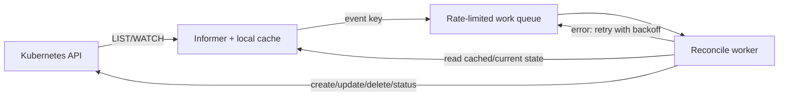
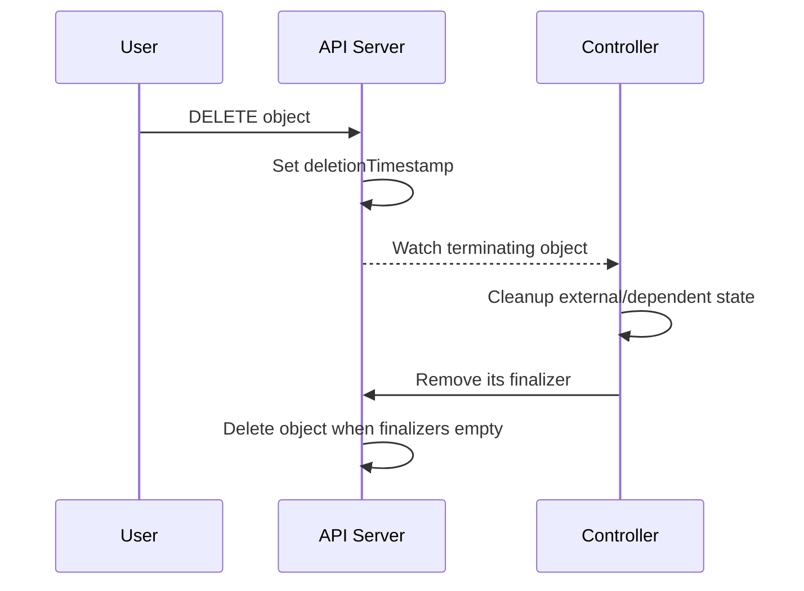

# Controller Manager

## Mục lục

- [Tổng quan](#tổng-quan)
- [1. Controller là gì](#1-controller-là-gì)
- [2. Vì sao có controller-manager](#2-vì-sao-có-controller-manager)
- [3. Kiến trúc một reconciliation loop](#3-kiến-trúc-một-reconciliation-loop)
- [4. Các controller quan trọng](#4-các-controller-quan-trọng)
- [5. Ownership và garbage collection](#5-ownership-và-garbage-collection)
- [6. Status, conditions và observedGeneration](#6-status-conditions-và-observedgeneration)
- [7. Finalizers và deletion](#7-finalizers-và-deletion)
- [8. Leader election và High Availability](#8-leader-election-và-high-availability)
- [9. Rate limiting, retry và idempotency](#9-rate-limiting-retry-và-idempotency)
- [10. Built-in controller và custom controller](#10-built-in-controller-và-custom-controller)
- [11. Failure modes và troubleshooting](#11-failure-modes-và-troubleshooting)
- [12. Thực hành quan sát controller](#12-thực-hành-quan-sát-controller)
- [Tài liệu tham khảo](#tài-liệu-tham-khảo)

---

## Tổng quan

`kube-controller-manager` là binary chạy nhiều controller cốt lõi. Mỗi controller là một control loop quan sát cluster state, so sánh actual state với desired state và thực hiện action để giảm sai lệch.

```text
Desired state trong API
         │
         ▼
Controller observes objects
         │
         ▼
Compare desired vs actual
         │
    ┌────┴────┐
    │ equal?  │
    └────┬────┘
      yes│no
         │ └──▶ create/update/delete external or API resource
         └────▶ wait/watch next event
```

> [!IMPORTANT]
> Controller không chạy một workflow một lần rồi kết thúc. Nó liên tục reconcile và phải an toàn khi event lặp, request timeout, process restart hoặc leader chuyển đổi.

---

## 1. Controller là gì

Controller là software actor có ba phần khái niệm:

1. **Input:** object và state quan sát được.
2. **Desired rule:** invariant cần duy trì.
3. **Action:** thay đổi resource để tiến gần invariant.

Ví dụ ReplicaSet controller:

```text
Desired replicas = 3
Current matching active Pods = 2
Action = create 1 Pod
```

Nếu current Pods = 4, action có thể là delete một Pod. Controller không cần nhớ toàn bộ lịch sử; nó tính từ state hiện tại.

### 1.1 Level-based và edge-triggered

Thiết kế bền vững là level-based: reconcile dựa trên state hiện tại, không phụ thuộc việc nhận đủ mọi event cạnh. Event chủ yếu là tín hiệu “hãy kiểm tra lại”. Nếu mất một event nhưng sau đó re-list, controller vẫn hội tụ.

### 1.2 Idempotency

Reconcile cùng state nhiều lần phải không tạo hậu quả sai. API create có thể timeout sau khi server đã tạo object; controller cần quan sát lại trước khi tạo duplicate.

---

## 2. Vì sao có controller-manager

Nhiều controller được đóng gói chung để:

- Chia sẻ client, cache và leader election patterns.
- Giảm số binary/process quản trị.
- Cấu hình nhất quán cho built-in behavior.
- Đơn giản bootstrap Control Plane.

Đóng gói chung không nghĩa mọi controller là một logic lớn. Chúng vẫn quản lý resource khác nhau và có work queue riêng.

Ngoài `kube-controller-manager`, cluster có thể có:

- `cloud-controller-manager` cho cloud integrations.
- CSI sidecar controllers.
- Ingress/Gateway controllers.
- Operators/custom controllers.
- GitOps controllers.

Tất cả cùng dùng Kubernetes API nhưng không nhất thiết nằm trong cùng binary.

---

## 3. Kiến trúc một reconciliation loop



### 3.1 Informer và cache

Informer list state ban đầu, watch thay đổi và giữ local cache. Nhiều controller có thể chia sẻ informer để giảm API load.

Cache có thể trễ ngắn. Khi cần concurrency-safe write, controller dùng API semantics như resourceVersion và retry conflict.

### 3.2 Event handler

Handler thường chỉ enqueue key `namespace/name`, không chạy business logic nặng. Nếu object thay đổi nhiều lần, queue có thể gộp key và worker đọc state mới nhất.

### 3.3 Work queue

Queue hỗ trợ:

- Deduplication theo key.
- Retry.
- Rate limiting.
- Backoff.
- Nhiều worker.

### 3.4 Reconcile worker

Worker phải xử lý cả object tồn tại và đã bị xóa. Kết quả có thể là success, retry sau lỗi hoặc requeue theo thời gian.

---

## 4. Các controller quan trọng

Danh sách thay đổi theo phiên bản/cấu hình, nhưng các nhóm quan trọng gồm:

### 4.1 Workload controllers

| Controller | Desired state chính | Action tiêu biểu |
|------------|----------------------|-----------------|
| Deployment | rollout và ReplicaSet mong muốn | Tạo/scale ReplicaSet |
| ReplicaSet | số matching Pods | Tạo/xóa Pod |
| StatefulSet | identity/order/replicas | Tạo/xóa Pod có thứ tự |
| DaemonSet | Pod trên Node phù hợp | Tạo Pod per eligible Node |
| Job | completions/parallelism | Tạo Pod cho đến khi hoàn thành |
| CronJob | lịch chạy | Tạo Job theo schedule |

### 4.2 Node lifecycle controller

Theo dõi Node heartbeat/condition, gắn taint liên quan và phối hợp eviction behavior khi Node unreachable/not ready.

### 4.3 Namespace controller

Khi Namespace bị xóa, controller xóa namespaced resources và xử lý finalization. Namespace kẹt `Terminating` thường cần tìm resource/finalizer/API discovery lỗi, không nên xóa finalizer ngay.

### 4.4 EndpointSlice controller

Quan sát Service selector và Pods để duy trì EndpointSlices. Pod chưa Ready thường không được xem như endpoint ready, tùy Service semantics.

### 4.5 ServiceAccount-related controllers

Quản lý default ServiceAccount và một số token/root CA behavior. Cơ chế token đã phát triển theo phiên bản; projected token là hướng hiện đại.

### 4.6 Garbage collector

Dựa trên owner references để xóa dependent objects theo propagation policy.

### 4.7 PersistentVolume controllers

Phối hợp binding PV/PVC và lifecycle liên quan. Dynamic provisioning thường có external CSI provisioner tham gia.

---

## 5. Ownership và garbage collection

### 5.1 Owner references

Resource con có `metadata.ownerReferences` trỏ đến owner bằng UID, không chỉ name.

```text
Deployment
  └── ReplicaSet
        └── Pods
```

Kiểm tra:

```bash
kubectl get pod <pod> -n <namespace> \
  -o jsonpath='{.metadata.ownerReferences}{"\n"}'
```

### 5.2 Controller reference

Một dependent thường chỉ có một managing controller reference (`controller: true`), dù có thể có owner references khác trong giới hạn API.

### 5.3 Deletion propagation

- **Foreground:** owner chờ dependents được xóa.
- **Background:** owner biến mất, dependents được xóa nền.
- **Orphan:** giữ dependents, bỏ ownership phù hợp.

Command ví dụ:

```bash
kubectl delete deployment web \
  --cascade=foreground \
  -n demo
```

Không orphan resource nếu không có kế hoạch quản lý tiếp theo.

### 5.4 Labels không phải ownership

ReplicaSet tìm Pod qua selector/labels, nhưng garbage collection dựa ownerReferences. Sửa labels có thể làm controller không còn đếm Pod như mong đợi dù ownership vẫn tồn tại.

---

## 6. Status, conditions và observedGeneration

### 6.1 `generation`

`metadata.generation` thường tăng khi desired spec thay đổi. Controller có thể ghi `status.observedGeneration` để cho biết đã xử lý generation nào.

Nếu:

```text
metadata.generation = 5
status.observedGeneration = 3
```

controller chưa quan sát/xử lý spec mới nhất hoặc status chưa cập nhật.

### 6.2 Conditions

Condition thường gồm:

- `type`.
- `status`: True/False/Unknown.
- `reason`.
- `message`.
- `lastTransitionTime`.
- `observedGeneration` ở một số API.

Không chỉ đọc `status=True`; cần xem type, reason và generation.

### 6.3 Status là output, không phải command

User thường không nên sửa status để “đánh dấu healthy”. Controller sẽ cập nhật lại từ observation thực tế. Status subresource giúp phân quyền spec và status riêng.

---

## 7. Finalizers và deletion

Finalizer là key yêu cầu cleanup trước khi xóa object hoàn toàn.



### 7.1 Vì sao object kẹt `Terminating`

- Controller phụ trách finalizer không chạy.
- External API lỗi.
- RBAC không cho cleanup/update.
- Webhook chặn update.
- Controller bug hoặc config sai.

### 7.2 Không xóa finalizer mù quáng

Force-remove finalizer có thể để lại:

- Cloud load balancer.
- Storage volume/snapshot.
- DNS record.
- Child resource hoặc billing leak.

Trước tiên xác định finalizer owner và cleanup contract.

---

## 8. Leader election và High Availability

Chạy nhiều `kube-controller-manager` replica để availability, nhưng thường một leader active cho control loops. Leader giữ Lease và renew định kỳ.

```bash
kubectl get lease kube-controller-manager -n kube-system -o yaml
```

Khi leader lỗi:

1. Lease hết hạn theo timeout.
2. Replica khác acquire.
3. Informer/cache sync.
4. Reconciliation tiếp tục từ current state.

Failover an toàn vì controller level-based và idempotent. Có thể có khoảng trễ nhưng không cần replay workflow thủ công.

API Server có availability khác: nhiều replica có thể đồng thời serve request.

---

## 9. Rate limiting, retry và idempotency

### 9.1 Transient và terminal errors

- Transient: timeout, conflict, dependency tạm lỗi → retry/backoff.
- Terminal/user error: spec invalid về logic controller → ghi condition/Event và chờ spec đổi.

Retry vô hạn với cùng lỗi user mà không backoff gây hot loop và API pressure.

### 9.2 Exponential backoff

Queue tăng delay sau lỗi liên tiếp, giảm load lên dependency. Sau success, key được quên khỏi failure history.

### 9.3 Conflict retry

Nếu update nhận conflict:

1. Đọc object mới.
2. Áp dụng thay đổi lên state mới.
3. Retry có giới hạn.

Không tái gửi nguyên object cũ vì có thể ghi đè field actor khác.

### 9.4 Reconciliation period

Ngoài event-driven watch, controller có thể resync/requeue để sửa drift nếu event bị bỏ lỡ hoặc external state thay đổi không qua Kubernetes API.

---

## 10. Built-in controller và custom controller

| Tiêu chí | Built-in | Custom controller/Operator |
|----------|----------|----------------------------|
| Resource | Kubernetes core APIs | CRD hoặc built-in resource |
| Distribution | Theo Kubernetes | Do platform/vendor vận hành |
| Upgrade | Theo cluster version | Phải quản lý compatibility riêng |
| Domain | Workload/Node/core behavior | Database, policy, delivery, domain riêng |
| Support | Upstream/provider | Đội sở hữu hoặc vendor |

Custom controller nên tuân theo cùng nguyên tắc:

- Reconcile idempotent.
- Status/conditions rõ.
- Finalizer có cleanup an toàn.
- RBAC least privilege.
- Metrics, logs và Events.
- Leader election nếu nhiều replica.
- Version conversion/migration cho CRD.

Không nên dùng controller cho workflow thuần tuần tự nếu không có desired state bền vững hoặc nếu mỗi retry gây side effect không thể kiểm soát.

---

## 11. Failure modes và troubleshooting

| Triệu chứng | Controller/lớp cần kiểm tra |
|-------------|-----------------------------|
| Deployment không tạo ReplicaSet | Deployment controller, selector/spec |
| ReplicaSet không tạo Pod | ReplicaSet controller, quota/admission |
| Node NotReady nhưng Pod không thay thế | Node controller, toleration, workload controller |
| Service không có EndpointSlice | Selector, Pod readiness, EndpointSlice controller |
| Namespace Terminating | Discovery, resource finalizers, Namespace controller |
| Object con không bị xóa | ownerReferences, GC, propagation |
| Status không cập nhật | Controller health/RBAC/conflict |
| Field liên tục bị đổi lại | Reconciler/GitOps/managedFields |

### 11.1 Quy trình evidence-first

```bash
kubectl get <resource> <name> -n <namespace> -o yaml
kubectl describe <resource> <name> -n <namespace>
kubectl get events -n <namespace> --sort-by=.metadata.creationTimestamp
```

Kiểm tra:

- `generation` và `observedGeneration`.
- Conditions reason/message.
- Owner references.
- Finalizers và deletionTimestamp.
- Managed fields.
- Resource con có tồn tại không.
- Controller logs/metrics.

### 11.2 Controller Manager health

Trên cluster tự quản lý:

```bash
kubectl get pods -n kube-system -l component=kube-controller-manager
kubectl get lease kube-controller-manager -n kube-system -o yaml
```

Label/name có thể khác. Managed cluster có thể không expose Pod hoặc logs.

### 11.3 Admission và quota

Controller create child resource cũng đi qua authorization/admission/quota. Parent controller khỏe vẫn có thể fail vì webhook hoặc quota. Event trên parent/child thường chứa error từ API.

---

## 12. Thực hành quan sát controller

### 12.1 Owner chain

```bash
kubectl create namespace controller-lab
kubectl create deployment web \
  --image=nginx:1.27-alpine \
  --replicas=2 \
  -n controller-lab

kubectl get deployment,replicaset,pod -n controller-lab
```

Xem ownership:

```bash
kubectl get replicaset -n controller-lab \
  -o custom-columns='NAME:.metadata.name,OWNER_KIND:.metadata.ownerReferences[0].kind,OWNER:.metadata.ownerReferences[0].name'

kubectl get pod -n controller-lab \
  -o custom-columns='NAME:.metadata.name,OWNER_KIND:.metadata.ownerReferences[0].kind,OWNER:.metadata.ownerReferences[0].name'
```

### 12.2 Tạo drift và xem self-healing

```bash
POD_NAME="$(kubectl get pod -n controller-lab \
  -l app=web \
  -o jsonpath='{.items[0].metadata.name}')"

kubectl delete pod "$POD_NAME" -n controller-lab
kubectl get pods -n controller-lab --watch
```

ReplicaSet controller tạo Pod mới vì desired replicas vẫn là 2.

### 12.3 Theo dõi generation

```bash
kubectl get deployment web -n controller-lab \
  -o custom-columns='GENERATION:.metadata.generation,OBSERVED:.status.observedGeneration,READY:.status.readyReplicas'

kubectl scale deployment web --replicas=3 -n controller-lab
kubectl rollout status deployment/web -n controller-lab
```

Cleanup:

```bash
kubectl delete namespace controller-lab
```

Tiếp theo, đọc [kubelet và Container Runtime](/kien-truc/kubelet-container-runtime/) để thấy control loop chuyển từ API-level resource sang process thực trên Node.

---

## Tài liệu tham khảo

- [Controllers](https://kubernetes.io/docs/concepts/architecture/controller/)
- [Garbage Collection](https://kubernetes.io/docs/concepts/architecture/garbage-collection/)
- [Owners and Dependents](https://kubernetes.io/docs/concepts/overview/working-with-objects/owners-dependents/)
- [Finalizers](https://kubernetes.io/docs/concepts/overview/working-with-objects/finalizers/)
- [kube-controller-manager](https://kubernetes.io/docs/reference/command-line-tools-reference/kube-controller-manager/)
