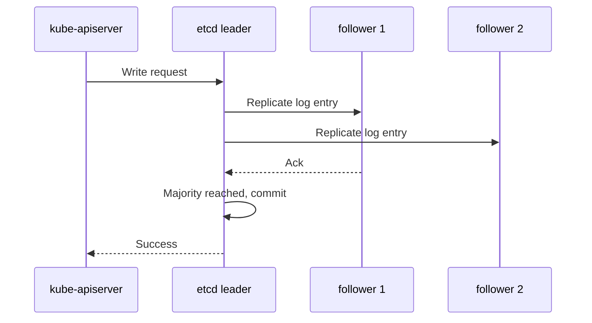

# etcd

## Mục lục

- [Tổng quan](#tổng-quan)
- [1. etcd lưu gì và không lưu gì](#1-etcd-lưu-gì-và-không-lưu-gì)
- [2. Raft, leader và quorum](#2-raft-leader-và-quorum)
- [3. Read, write, revision và watch](#3-read-write-revision-và-watch)
- [4. Topology cho Kubernetes](#4-topology-cho-kubernetes)
- [5. Disk, network và performance](#5-disk-network-và-performance)
- [6. Compaction, defragmentation và quota](#6-compaction-defragmentation-và-quota)
- [7. Snapshot, backup và restore](#7-snapshot-backup-và-restore)
- [8. Security](#8-security)
- [9. Failure modes](#9-failure-modes)
- [10. Monitoring và troubleshooting](#10-monitoring-và-troubleshooting)
- [11. Thực hành read-only trên kubeadm](#11-thực-hành-read-only-trên-kubeadm)
- [12. Best practices production](#12-best-practices-production)
- [Tài liệu tham khảo](#tài-liệu-tham-khảo)

---

## Tổng quan

etcd là distributed key-value store có consistency mạnh, được Kubernetes dùng làm storage backend cho API state. API Server chuyển object sang representation phù hợp rồi đọc/ghi etcd; component khác không nên truy cập etcd trực tiếp.

```text
kubectl / controllers / kubelet
              │
              ▼
        kube-apiserver
              │ mTLS
              ▼
   ┌──────────────────────┐
   │      etcd cluster    │
   │ leader + followers   │
   │ replicated Raft log  │
   └──────────────────────┘
```

> [!IMPORTANT]
> etcd là nguồn dữ liệu sống còn của Control Plane. Không dùng etcd endpoint như database chung cho ứng dụng, không chỉnh key Kubernetes trực tiếp và không xem một file snapshot chưa từng restore thử là chiến lược backup hoàn chỉnh.

---

## 1. etcd lưu gì và không lưu gì

### 1.1 Dữ liệu được lưu

Thông qua API Server, etcd lưu state của Kubernetes objects, ví dụ:

- Deployments, Pods và Nodes.
- ConfigMaps và Secrets.
- RBAC resources.
- Services và EndpointSlices.
- CRDs và custom resources.
- Leases, Events và status fields.

Representation cụ thể là internal implementation; operator nên thao tác bằng Kubernetes API.

### 1.2 Dữ liệu không được lưu

etcd không lưu:

- Container image layer.
- Container writable filesystem.
- Application logs theo mặc định.
- Dữ liệu trong PersistentVolume.
- Database transaction của workload.
- Node OS state.

Backup etcd có thể khôi phục cluster objects tại một thời điểm, nhưng không khôi phục volume data hoặc external load balancer state đã thay đổi ngoài cluster.

### 1.3 Secret và encryption

Secret được encode base64 ở API representation. Nếu không cấu hình encryption at rest, dữ liệu storage không được bảo vệ chỉ nhờ base64. Encryption at rest do API Server thực hiện trước khi ghi etcd.

---

## 2. Raft, leader và quorum

etcd dùng Raft consensus. Một member là leader tại một thời điểm; write đi qua leader và chỉ được commit khi majority xác nhận.



### 2.1 Công thức quorum

```text
quorum = floor(member_count / 2) + 1
```

| Members | Quorum | Tolerated failures |
|---------|--------|--------------------|
| 1 | 1 | 0 |
| 3 | 2 | 1 |
| 5 | 3 | 2 |
| 7 | 4 | 3 |

Số member lẻ thường hiệu quả hơn số chẵn. Bốn member vẫn chỉ chịu được một failure như ba member nhưng tăng replication cost.

### 2.2 Mất quorum

Khi không đủ majority, cluster không thể commit write mới. Đây là bảo vệ consistency, không phải bug. Không được “khắc phục” bằng cách tạo cluster mới từ một member tùy tiện; thao tác membership sai có thể gây split-brain hoặc mất dữ liệu.

### 2.3 Leader election

Nếu leader lỗi nhưng quorum còn, các member bầu leader mới. Trong khoảng election, request có thể chậm hoặc lỗi tạm thời. Election lặp lại thường gợi ý network latency, CPU starvation hoặc disk stall.

---

## 3. Read, write, revision và watch

### 3.1 Revision

Mỗi thay đổi tăng global revision. Revision giúp watch client theo dõi thay đổi theo thứ tự của etcd history.

### 3.2 Consistent read

etcd cung cấp linearizable read để phản ánh state mới nhất đã commit, và serializable read có trade-off khác. Kubernetes API quyết định cách dùng storage semantics; client Kubernetes nên gọi API thay vì tự chọn etcd read mode.

### 3.3 Transaction

etcd hỗ trợ compare-and-swap transaction. Kubernetes dùng `resourceVersion` và storage layer để hiện thực optimistic concurrency.

### 3.4 Watch

etcd watch cung cấp stream thay đổi theo revision. API Server xây Kubernetes WATCH semantics phía trên. Sau compaction, history cũ không còn; client quá trễ phải re-list.

```text
etcd revision → API storage/watch cache → Kubernetes resourceVersion → client watch
```

Không nên giả định `resourceVersion` là timestamp hoặc tự chuyển thành integer cho logic nghiệp vụ.

---

## 4. Topology cho Kubernetes

### 4.1 Stacked etcd

etcd member cùng nằm trên Control Plane Node.

**Ưu điểm:** ít host, bootstrap đơn giản.

**Nhược điểm:** Node failure làm mất đồng thời một etcd member và API capacity.

### 4.2 External etcd

etcd có host riêng.

**Ưu điểm:** isolation và resource tuning tốt hơn.

**Nhược điểm:** tăng hạ tầng, certificate, network và runbook.

### 4.3 Placement

Các member nên:

- Nằm trên failure domain độc lập.
- Có network latency thấp và ổn định giữa peer.
- Dùng disk riêng hoặc I/O có thể dự đoán.
- Không chia sẻ noisy workload.
- Giữ clock đồng bộ.

Trải member qua region có latency cao thường làm write latency và election xấu đi. Multi-region DR không đơn giản bằng việc kéo dài một etcd cluster qua WAN.

---

## 5. Disk, network và performance

### 5.1 Vì sao disk latency quan trọng

Raft phải ghi WAL bền vững trước khi commit. Slow fsync làm write latency tăng và có thể gây heartbeat/election bất ổn.

Ưu tiên:

- SSD có latency thấp.
- Dedicated I/O khi có thể.
- Theo dõi fsync/WAL duration, không chỉ IOPS trung bình.
- Tránh backup job hoặc workload khác bão hòa disk.

### 5.2 Network

Peer cần network ổn định. Packet loss hoặc latency spike có thể làm follower tụt lại hoặc gây leader election. API Server đến etcd cũng cần path tin cậy.

### 5.3 CPU và memory

CPU throttling hoặc memory pressure trên etcd host gây latency và instability. etcd nên có reservation rõ ràng, tránh overcommit cực đoan.

### 5.4 Object churn

Các workload làm tăng etcd load:

- Events volume lớn.
- Controller update status liên tục.
- Nhiều Lease heartbeat.
- CRD object lớn.
- Tạo/xóa Pod tốc độ cao.

Cần sửa actor tạo churn, không chỉ tăng disk.

---

## 6. Compaction, defragmentation và quota

### 6.1 Compaction

Compaction loại history cũ theo revision để giới hạn dữ liệu lịch sử. Client watch giữ revision quá cũ có thể phải re-list.

### 6.2 Fragmentation

Xóa key hoặc compact không nhất thiết làm file database trên disk nhỏ ngay. Defragmentation thu hồi space trong backend database.

### 6.3 Defragmentation

Defrag là operation ảnh hưởng member và cần làm theo runbook/version docs, thường từng member để giảm rủi ro. Không chạy đồng thời tùy tiện trên mọi member production.

### 6.4 Backend quota

Khi database vượt quota, etcd có thể kích hoạt alarm và hạn chế write để bảo vệ hệ thống. Cần điều tra database growth, compact/defrag đúng cách và xử lý nguồn churn.

> [!CAUTION]
> Maintenance command không phải thao tác “dọn rác” vô hại. Luôn kiểm tra health, snapshot và procedure tương thích đúng version trước khi chạy.

---

## 7. Snapshot, backup và restore

### 7.1 Backup cần bảo vệ những gì

- Snapshot etcd.
- Kubernetes PKI và configuration cần thiết cho restore, tùy bootstrap model.
- Encryption-at-rest keys/configuration.
- Automation/manifest nguồn trong Git.
- Application data backup riêng.

Nếu mất encryption key, snapshot chứa encrypted Secret có thể không dùng được đầy đủ.

### 7.2 Tạo snapshot

Lệnh chính xác phụ thuộc version, topology, endpoint và certificate. Với `etcdctl`, pattern thường là:

```bash
ETCDCTL_API=3 etcdctl snapshot save /secure-backup/etcd.db \
  --endpoints=https://127.0.0.1:2379 \
  --cacert=/path/to/ca.crt \
  --cert=/path/to/client.crt \
  --key=/path/to/client.key
```

Không copy nguyên file backend đang mở như một backup tùy tiện. Dùng snapshot API/tool được hỗ trợ.

### 7.3 Xác minh snapshot

Tùy version etcd, dùng tool được tài liệu version chỉ định, ví dụ `etcdutl snapshot status`:

```bash
etcdutl snapshot status /secure-backup/etcd.db --write-out=table
```

Checksum hợp lệ chưa đủ. Cần restore trong môi trường cô lập và xác minh Kubernetes API objects.

### 7.4 Restore là tạo data directory mới

Restore snapshot tạo một logical cluster state mới từ thời điểm snapshot. Quy trình high-level:

1. Dừng hoặc cô lập Control Plane write path.
2. Chọn snapshot đã xác minh.
3. Restore vào data directory mới với member/cluster parameters đúng.
4. Cập nhật static Pod/service config nếu path thay đổi.
5. Khởi động etcd và API Server.
6. Xác minh health, objects, controllers và workload.
7. Reconcile external resources/application data theo recovery plan.

Không luyện restore lần đầu trong incident production.

### 7.5 RPO và RTO

- **RPO:** có thể mất bao nhiêu dữ liệu cluster state.
- **RTO:** mất bao lâu để phục hồi service.

Snapshot mỗi ngày không đáp ứng RPO một giờ. Có snapshot nhưng không có credential, runbook và người thực hiện không đáp ứng RTO.

---

## 8. Security

### 8.1 mTLS

Bảo vệ cả client-to-server và peer-to-peer:

- API Server dùng client certificate được etcd tin cậy.
- etcd peers xác thực nhau.
- Certificate có rotation và expiry monitoring.

### 8.2 Network isolation

Chỉ Control Plane host và operator path cần thiết được truy cập etcd ports. Workload network không nên route đến etcd endpoint.

### 8.3 Least privilege và file permission

Bảo vệ:

- Data directory.
- Client/peer private keys.
- Snapshot files.
- Static Pod manifests hoặc service unit.

Snapshot có thể chứa Secret và credential, nên phải mã hóa, kiểm soát access, retention và disposal.

### 8.4 Không sửa key trực tiếp

Viết/xóa key Kubernetes trực tiếp bằng `etcdctl` bỏ qua validation, admission, version conversion và API invariants. Có thể làm cluster state không nhất quán. Chỉ làm khi có procedure recovery chính thức và hiểu format đúng version.

---

## 9. Failure modes

| Failure | Triệu chứng | Hướng xử lý |
|---------|-------------|--------------|
| Mất một member trong cluster 3 | Degraded nhưng còn quorum | Thay member theo procedure, không vội thêm sai |
| Mất hai member trong cluster 3 | Không ghi được | Khôi phục quorum hoặc disaster recovery |
| Disk latency cao | API write chậm, election | Kiểm tra fsync, saturation, noisy neighbor |
| Database gần quota | Write lỗi/alarm | Tìm churn, compact/defrag theo runbook |
| Certificate hết hạn | TLS handshake lỗi | Renew/rotate đúng trust chain |
| Snapshot hỏng/thiếu | Restore thất bại | Nhiều bản backup, verify và test restore |
| Network partition | Leader changes, member unhealthy | Sửa network; tránh thay membership hấp tấp |
| Clock/system resource issue | Latency/election bất ổn | NTP, CPU, memory, host health |

Nguyên tắc incident:

1. Xác định quorum hiện tại.
2. Giữ lại data directories và snapshot evidence.
3. Không restart hoặc remove member hàng loạt.
4. Chọn một recovery leader và runbook duy nhất.
5. Ghi lại command/output.
6. Ưu tiên consistency hơn thử nghiệm ngẫu nhiên.

---

## 10. Monitoring và troubleshooting

### 10.1 Tín hiệu quan trọng

- Có leader hay không.
- Leader changes.
- Member health và raft index lag.
- Proposal failed/pending.
- WAL/backend commit duration.
- Database size và quota usage.
- Network peer round-trip.
- Snapshot job success và age.

### 10.2 Endpoint health/status

Pattern với certificate thích hợp:

```bash
ETCDCTL_API=3 etcdctl endpoint health \
  --cluster \
  --endpoints=https://127.0.0.1:2379 \
  --cacert=/path/to/ca.crt \
  --cert=/path/to/client.crt \
  --key=/path/to/client.key

ETCDCTL_API=3 etcdctl endpoint status \
  --cluster \
  --write-out=table \
  --endpoints=https://127.0.0.1:2379 \
  --cacert=/path/to/ca.crt \
  --cert=/path/to/client.crt \
  --key=/path/to/client.key
```

Đường dẫn certificate khác nhau theo distribution. Không copy credential khỏi môi trường hoặc đưa private key vào shell history/chia sẻ log.

### 10.3 Correlate với API Server

Nếu API write chậm:

- So sánh API request latency với etcd request duration.
- Kiểm tra admission webhook trước khi kết luận etcd.
- Xem disk latency ở etcd members.
- Kiểm tra object size/churn và client behavior.

---

## 11. Thực hành read-only trên kubeadm

Chỉ thực hiện khi có quyền trên local lab hoặc cluster do bạn quản lý.

### 11.1 Tìm etcd static Pod

```bash
kubectl get pod -n kube-system -l component=etcd -o wide
kubectl describe pod -n kube-system -l component=etcd
```

### 11.2 Xem command/config đã dùng

```bash
kubectl get pod -n kube-system -l component=etcd -o yaml
```

Không đăng output công khai vì có thể lộ endpoint/path/config nhạy cảm.

### 11.3 Xem log gần nhất

```bash
kubectl logs -n kube-system -l component=etcd --tail=100
```

Selector có thể trả nhiều Pod trong HA cluster; dùng Pod name cụ thể khi cần.

### 11.4 Kiểm tra API readiness liên quan storage

```bash
kubectl get --raw='/readyz?verbose'
```

Readiness có thể hiển thị check liên quan etcd, nhưng vẫn cần etcd metrics/status để chẩn đoán sâu.

---

## 12. Best practices production

- Dùng 3 hoặc 5 member, phân tán failure domain hợp lý.
- Chọn SSD low-latency và bảo vệ resource.
- Giám sát quorum, leader changes, fsync latency, quota và snapshot age.
- Dùng mTLS, network isolation và file permissions chặt.
- Bật encryption at rest cho resource nhạy cảm theo threat model.
- Snapshot định kỳ, lưu ngoài failure domain của cluster.
- Backup cả encryption keys và recovery configuration.
- Test restore định kỳ với tiêu chí RPO/RTO.
- Thực hiện compaction/defrag theo runbook tương thích version.
- Không chỉnh Kubernetes keys trực tiếp.
- Không thay membership hàng loạt trong incident.

Tiếp theo, đọc [kube-scheduler](/kien-truc/kube-scheduler/) để hiểu một trong những consumer quan trọng của API state và cách Pod được gán vào Node.

---

## Tài liệu tham khảo

- [Operating etcd clusters for Kubernetes](https://kubernetes.io/docs/tasks/administer-cluster/configure-upgrade-etcd/)
- [Backing up an etcd cluster](https://kubernetes.io/docs/tasks/administer-cluster/configure-upgrade-etcd/#backing-up-an-etcd-cluster)
- [etcd Documentation](https://etcd.io/docs/)
- [etcd Disaster Recovery](https://etcd.io/docs/latest/op-guide/recovery/)
- [Encrypting Confidential Data at Rest](https://kubernetes.io/docs/tasks/administer-cluster/encrypt-data/)
