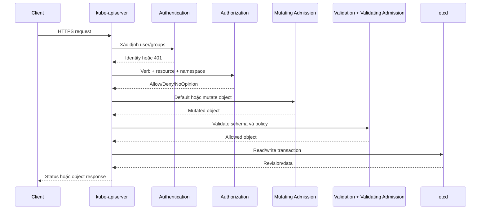

# kube-apiserver

## Mục lục

- [Tổng quan](#tổng-quan)
- [1. Vai trò và ranh giới](#1-vai-trò-và-ranh-giới)
- [2. Luồng xử lý request](#2-luồng-xử-lý-request)
- [3. Authentication](#3-authentication)
- [4. Authorization](#4-authorization)
- [5. Admission control](#5-admission-control)
- [6. Validation, conversion và persistence](#6-validation-conversion-và-persistence)
- [7. LIST, WATCH và resourceVersion](#7-list-watch-và-resourceversion)
- [8. API Priority and Fairness](#8-api-priority-and-fairness)
- [9. High Availability và performance](#9-high-availability-và-performance)
- [10. Security và audit](#10-security-và-audit)
- [11. Failure modes và troubleshooting](#11-failure-modes-và-troubleshooting)
- [12. Thực hành khám phá API Server](#12-thực-hành-khám-phá-api-server)
- [Tài liệu tham khảo](#tài-liệu-tham-khảo)

---

## Tổng quan

`kube-apiserver` là frontend của Kubernetes Control Plane. Mọi actor quan trọng—`kubectl`, Scheduler, controllers, kubelet, Operator và CI/CD—đều dùng API Server để đọc hoặc thay đổi cluster state.

```text
Client
  │ HTTPS request
  ▼
Authentication
  → Authorization
  → Mutating admission
  → Object/schema validation
  → Validating admission
  → Storage/version conversion
  → etcd
```

Trình tự chi tiết có thể khác theo loại request, nhưng mô hình trên giúp xác định request bị từ chối ở lớp nào.

> [!IMPORTANT]
> API Server chấp nhận Deployment không đồng nghĩa Pod đã chạy. API Server ghi desired state; controllers, Scheduler và kubelet hoàn tất các bước asynchronous tiếp theo.

---

## 1. Vai trò và ranh giới

API Server chịu trách nhiệm:

- REST endpoint và API discovery.
- Authentication identity.
- Authorization action.
- Admission policy.
- Schema/defaulting/validation và version conversion.
- Optimistic concurrency.
- Persistence thông qua storage backend.
- List/watch stream và API aggregation.
- Audit event theo policy.

API Server không:

- Chọn Node cho Pod; đó là Scheduler.
- Tạo Container; đó là kubelet/runtime.
- Duy trì số replica; đó là workload controllers.
- Truy cập application database.

Trong kiến trúc chuẩn, API Server là component duy nhất giao tiếp trực tiếp với etcd. Điều này gom validation, policy và storage semantics vào một boundary.

---

## 2. Luồng xử lý request



### 2.1 HTTP request thành Kubernetes attributes

API Server phân tích request thành attributes như:

- User và groups.
- API group/resource/subresource.
- Namespace và object name.
- Verb: `get`, `list`, `watch`, `create`, `update`, `patch`, `delete`.
- Non-resource URL nếu không phải resource request.

Authorization dựa trên các attributes này, không chỉ HTTP method.

### 2.2 Error cho biết lớp lỗi

| Response/triệu chứng | Lớp thường liên quan |
|----------------------|----------------------|
| `401 Unauthorized` | Authentication thiếu hoặc không hợp lệ |
| `403 Forbidden` | Authorization/RBAC deny |
| `404 NotFound` | Sai resource/name/version hoặc bị che theo API semantics |
| `409 Conflict` | resourceVersion/field ownership conflict |
| `422 Invalid` | Schema hoặc semantic validation |
| `429 Too Many Requests` | Flow control/throttling |
| Webhook timeout | Admission dependency |
| `5xx` | API Server, storage, extension API hoặc webhook |

---

## 3. Authentication

Authentication trả lời: **request này là ai?**

Các cơ chế có thể gồm:

- X.509 client certificate.
- ServiceAccount bearer token.
- OIDC token.
- Authentication webhook.
- Provider-specific identity integration.

Nếu nhiều authenticator được bật, request thành công khi một cơ chế chấp nhận. Anonymous request có thể được bật/tắt và phải được authorize riêng.

### 3.1 User và group

Kubernetes không lưu User object built-in theo cách lưu ServiceAccount. Authentication layer ánh xạ credential thành username và groups. RBAC sau đó dùng subject này.

### 3.2 ServiceAccount

Pod thường nhận projected token ngắn hạn, có audience và expiration. Token cũ dạng Secret lâu dài không nên là lựa chọn mặc định.

Kiểm tra identity hiện tại:

```bash
kubectl auth whoami
```

Tính khả dụng của command phụ thuộc phiên bản client/server.

### 3.3 Authentication không phải authorization

Credential hợp lệ chỉ chứng minh identity. Identity vẫn có thể nhận `Forbidden` nếu không có quyền thực hiện verb tương ứng.

---

## 4. Authorization

Authorization trả lời: **identity này có được thực hiện hành động không?**

Các authorizer phổ biến:

- RBAC.
- Node authorizer.
- Webhook authorizer.
- Các mode khác theo cấu hình cluster.

RBAC rule gồm API groups, resources/subresources, verbs và scope qua Role hoặc ClusterRole.

Ví dụ kiểm tra:

```bash
kubectl auth can-i get pods -n default
kubectl auth can-i create deployments.apps -n default
kubectl auth can-i create pods/exec -n default
```

`pods/exec` là subresource và có quyền riêng. Cho phép `get pods` không tự cho phép exec.

### 4.1 Node authorizer

kubelet cần đọc Secret, ConfigMap, Pod hoặc volume liên quan đến Node của nó, nhưng không nên đọc dữ liệu tùy ý toàn cluster. Node authorizer và NodeRestriction admission hỗ trợ giới hạn này.

### 4.2 Least privilege

Tránh cấp `cluster-admin` để xử lý nhanh lỗi RBAC. Hãy xác định chính xác verb, resource, subresource, Namespace và subject.

---

## 5. Admission control

Admission chạy sau authentication và authorization, trước khi persist object. Nó áp dụng policy dựa trên nội dung request/object.

### 5.1 Mutating admission

Có thể sửa object, ví dụ:

- Inject sidecar.
- Thêm label/annotation.
- Đặt default theo policy.

Sau mutation, object phải được validate lại vì shape cuối đã thay đổi.

### 5.2 Validating admission

Có thể cho phép hoặc từ chối nhưng không sửa object. Dùng cho:

- Security guardrail.
- Naming convention.
- Image registry policy.
- Resource requirement.

### 5.3 Built-in và webhook

- Built-in admission controllers chạy trong API Server.
- Mutating/ValidatingAdmissionWebhook gọi HTTPS service bên ngoài.
- ValidatingAdmissionPolicy cho phép khai báo policy bằng expression mà không nhất thiết vận hành webhook riêng.

### 5.4 Webhook design

Webhook nằm trên write path nên phải:

- Có nhiều replica và topology phù hợp.
- Timeout ngắn.
- Match rule hẹp.
- Tránh gọi dependency chậm.
- Có certificate rotation.
- Chọn `failurePolicy` có chủ đích.
- Không tự block resource cần để khôi phục chính webhook.

Một webhook lỗi có thể làm cluster không tạo được workload dù API Server và etcd vẫn khỏe.

---

## 6. Validation, conversion và persistence

### 6.1 Validation theo schema và ý nghĩa field

API Server kiểm tra field type, required fields và quy tắc nghiệp vụ. Với CRD, structural schema quyết định validation, pruning và một số khả năng khác.

Server-side dry run kiểm tra request qua nhiều tầng mà không persist:

```bash
kubectl apply --dry-run=server -f app.yaml
```

### 6.2 API version conversion

Client có thể gửi một served version; API Server chuyển sang internal representation rồi storage version. Khi đọc, object được chuyển lại version client yêu cầu.

```text
apps/v1 request → internal representation → storage representation
```

CRD có nhiều version có thể dùng conversion webhook. Webhook này trở thành dependency của read/write path liên quan.

### 6.3 Persistence và optimistic concurrency

Object có `metadata.resourceVersion`. Update với version cũ có thể nhận `409 Conflict` để tránh lost update.

Server-Side Apply theo dõi field ownership trong `managedFields`. Conflict có thể nghĩa actor khác đang quản lý field, không phải API Server bị lỗi.

### 6.4 Delete không luôn tức thời

Deletion có thể đặt `deletionTimestamp`; object chỉ biến mất khi finalizers được xử lý. API Server không tự đoán cleanup bên ngoài nào cần thực hiện.

---

## 7. LIST, WATCH và resourceVersion

### 7.1 LIST

LIST trả collection. Với collection lớn, client nên dùng pagination và selector để giảm tải.

```bash
kubectl get pods -A --field-selector=status.phase=Pending
```

### 7.2 WATCH

WATCH stream thay đổi sau một resourceVersion. Controller thường list ban đầu rồi watch từ revision liên quan.

```bash
kubectl get pods -A --watch
```

Watch có thể đóng hoặc resourceVersion cũ có thể không còn được phục vụ sau compaction/cache window. Client phải reconnect/re-list đúng cách.

### 7.3 Informer cache

Client-go controller thường dùng shared informer để:

- List/watch hiệu quả.
- Duy trì local cache.
- Phân phối event cho handler.

Cache giảm tải API nhưng có thể trễ ngắn; controller phải viết theo eventual consistency.

### 7.4 Watch bookmark và pagination

Các cơ chế này giúp client duy trì progress và xử lý collection lớn. Không nên tự viết polling loop dày đặc nếu watch đáp ứng use case.

---

## 8. API Priority and Fairness

Khi request load cao, Control Plane cần ngăn một client noisy làm nghẽn request quan trọng. API Priority and Fairness phân loại và xếp hàng request theo FlowSchema/PriorityLevelConfiguration.

Mục tiêu:

- Bảo vệ request hệ thống quan trọng.
- Giới hạn concurrency theo priority.
- Queue hợp lý thay vì từ chối tất cả ngay.
- Tạo fairness giữa flow.

Dấu hiệu cần quan sát:

- `429` tăng.
- Queue length và wait duration.
- Request latency theo verb/resource/user agent.
- Một controller list quá thường xuyên.

Client vẫn cần exponential backoff và tôn trọng server throttling.

---

## 9. High Availability và performance

### 9.1 Nhiều replica

API Server có thể chạy active-active sau load balancer. Các replica cùng dùng etcd cluster và phải có configuration/certificate nhất quán.

### 9.2 Bottleneck phổ biến

- etcd disk/network latency.
- Admission webhook chậm.
- LIST response rất lớn.
- Watch fan-out lớn.
- CRD object quá lớn hoặc churn cao.
- Audit sink/storage chậm.
- Request storm do controller bug.

### 9.3 Health endpoints

```bash
kubectl get --raw='/livez?verbose'
kubectl get --raw='/readyz?verbose'
```

- Liveness thất bại gợi ý process không còn hoạt động đúng.
- Readiness thất bại gợi ý replica không nên nhận traffic.

Health endpoint không thay metrics về latency/error và không thay end-to-end synthetic test.

---

## 10. Security và audit

### 10.1 TLS và endpoint exposure

- Dùng trusted CA và rotation.
- Hạn chế public exposure.
- Tách endpoint access theo network policy/firewall/provider control.
- Không bỏ certificate verification trong script production.

### 10.2 Audit

Audit policy có thể ghi các stage như request received, response started và response complete tùy level. Cần cân bằng giữa evidence và chi phí:

- Không log body Secret ở mức quá chi tiết.
- Có retention và access control.
- Alert cho hành động đặc quyền cao.
- Đồng bộ thời gian để correlate event.

### 10.3 Encryption at rest

API Server có thể mã hóa resource trước khi lưu vào etcd bằng EncryptionConfiguration. Cần:

- Backup key an toàn.
- Rotation và re-encryption plan.
- Kiểm tra provider order.
- Không nhầm với TLS in transit.

---

## 11. Failure modes và troubleshooting

| Triệu chứng | Câu hỏi đầu tiên |
|-------------|-------------------|
| Không kết nối endpoint | DNS, route, LB hay API process? |
| `Unauthorized` | Credential/audience/expiry đúng chưa? |
| `Forbidden` | Verb/resource/subresource/scope nào thiếu? |
| Request create treo | Admission webhook hay etcd latency? |
| Chỉ một API group lỗi | Aggregated API/CRD conversion service khỏe không? |
| LIST timeout | Collection size, etcd/API saturation? |
| Nhiều `429` | Client nào tạo load, flow schema nào áp dụng? |
| Conflict khi apply | Field manager hoặc resourceVersion conflict? |
| Object `Terminating` | Finalizer nào chưa được gỡ? |

Quy trình:

```bash
# 1. Connectivity và health
kubectl cluster-info
kubectl get --raw='/readyz?verbose'

# 2. Identity và quyền
kubectl auth whoami
kubectl auth can-i get pods -A

# 3. Discovery
kubectl api-resources
kubectl api-versions

# 4. Raw API để loại bỏ formatting
kubectl get --raw='/api'
kubectl get --raw='/apis'

# 5. Recent Events
kubectl get events -A --sort-by=.metadata.creationTimestamp
```

Với self-managed cluster, xem API Server logs và etcd metrics. Với managed cluster, dùng provider control-plane logs và status page/SLA channel.

---

## 12. Thực hành khám phá API Server

### 12.1 Discovery

```bash
kubectl get --raw='/version'
kubectl get --raw='/api'
kubectl get --raw='/apis'
kubectl get --raw='/apis/apps/v1'
```

### 12.2 Quan sát request validation

Tạo file lỗi:

```yaml
apiVersion: apps/v1
kind: Deployment
metadata:
  name: invalid-demo
spec:
  replicas: "three"
```

Giả sử lưu là `/tmp/invalid-demo.yaml`:

```bash
kubectl apply --dry-run=server -f /tmp/invalid-demo.yaml
```

API Server sẽ từ chối vì `replicas` cần integer.

### 12.3 Quan sát authorization

```bash
kubectl auth can-i list deployments.apps -n default
kubectl auth can-i delete nodes
kubectl auth can-i --list -n default
```

### 12.4 Quan sát watch

Terminal 1:

```bash
kubectl get configmaps -n default --watch
```

Terminal 2:

```bash
kubectl create configmap api-watch-demo --from-literal=state=v1
kubectl patch configmap api-watch-demo \
  --type=merge \
  -p '{"data":{"state":"v2"}}'
kubectl delete configmap api-watch-demo
```

Watch hiển thị chuỗi `ADDED`, `MODIFIED`, `DELETED` theo event stream.

---

## Tài liệu tham khảo

- [The Kubernetes API](https://kubernetes.io/docs/concepts/overview/kubernetes-api/)
- [Controlling Access to the Kubernetes API](https://kubernetes.io/docs/concepts/security/controlling-access/)
- [Admission Control](https://kubernetes.io/docs/reference/access-authn-authz/admission-controllers/)
- [API Priority and Fairness](https://kubernetes.io/docs/concepts/cluster-administration/flow-control/)
- [Kubernetes API Concepts](https://kubernetes.io/docs/reference/using-api/api-concepts/)
