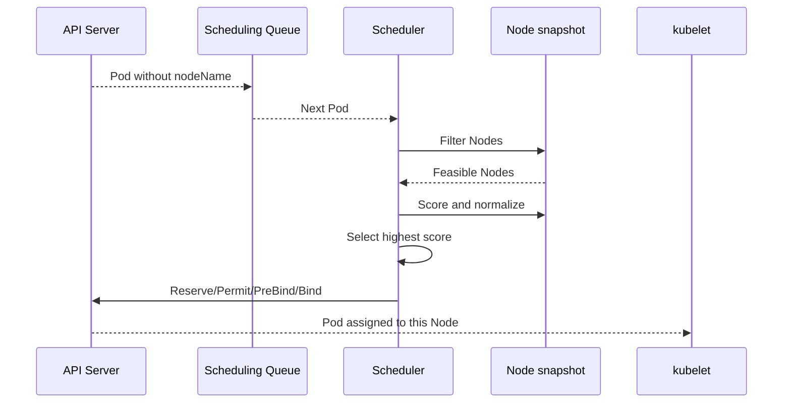

# kube-scheduler

## Mục lục

- [Tổng quan](#tổng-quan)
- [1. Scheduler làm gì và không làm gì](#1-scheduler-làm-gì-và-không-làm-gì)
- [2. Scheduling cycle từ đầu đến cuối](#2-scheduling-cycle-từ-đầu-đến-cuối)
- [3. Scheduling queue](#3-scheduling-queue)
- [4. Filtering](#4-filtering)
- [5. Scoring](#5-scoring)
- [6. Binding cycle](#6-binding-cycle)
- [7. Resource requests và capacity](#7-resource-requests-và-capacity)
- [8. Placement constraints](#8-placement-constraints)
- [9. Preemption và priority](#9-preemption-và-priority)
- [10. Scheduling Framework và profiles](#10-scheduling-framework-và-profiles)
- [11. High Availability và performance](#11-high-availability-và-performance)
- [12. Troubleshooting Pod Pending](#12-troubleshooting-pod-pending)
- [13. Thực hành](#13-thực-hành)
- [Tài liệu tham khảo](#tài-liệu-tham-khảo)

---

## Tổng quan

`kube-scheduler` quan sát Pod chưa được gán Node và chọn Node phù hợp nhất. Quyết định này dựa trên resource requests, policy và trạng thái snapshot của cluster tại thời điểm scheduling.

```text
Unscheduled Pod
      │
      ▼
Scheduling Queue
      │
      ▼
Filter Nodes ──▶ Score feasible Nodes ──▶ Select Node
                                              │
                                              ▼
                                      Reserve/Permit/Bind
                                              │
                                              ▼
                                      Pod.spec.nodeName
```

> [!IMPORTANT]
> Scheduler chỉ gán Pod vào Node. Sau binding, kubelet mới pull image, mount volume và chạy Container. Pod có Node nhưng vẫn `Pending` thường là lỗi execution, không còn là lỗi chọn Node.

---

## 1. Scheduler làm gì và không làm gì

Scheduler chịu trách nhiệm:

- Tìm Pod chưa có `spec.nodeName`.
- Loại Node vi phạm hard constraints.
- Chấm điểm Node còn lại theo soft preferences/policy.
- Chọn một Node.
- Ghi binding qua API Server.
- Phối hợp preemption khi cần và được phép.

Scheduler không:

- Tạo Pod object.
- Start Container.
- Đo real-time CPU để bin-pack mặc định.
- Tự thêm capacity khi thiếu Node.
- Di chuyển live Container giữa Node.
- Bảo đảm ứng dụng Ready sau khi bind.

Cluster Autoscaler có thể phản ứng khi Pod unschedulable bằng cách tăng Node, nhưng đó là component riêng.

---

## 2. Scheduling cycle từ đầu đến cuối



Scheduling Framework chia xử lý thành hai phase lớn:

- **Scheduling cycle:** chọn Node; mỗi Pod xử lý serial theo scheduler profile ở phần cốt lõi.
- **Binding cycle:** hoàn tất binding; có thể chạy concurrent với binding cycle khác.

Một scheduling attempt có thể fail tạm thời và Pod quay lại queue với backoff.

---

## 3. Scheduling queue

Không phải mọi Pending Pod được xử lý theo FIFO đơn giản. Queue quản lý:

- Pod đang active chờ schedule.
- Pod unschedulable chờ cluster state thay đổi.
- Pod backoff sau scheduling failure.

Priority ảnh hưởng thứ tự. Event như Node mới, label thay đổi hoặc Pod bị xóa có thể làm một Pod trước đó unschedulable trở nên khả thi.

### 3.1 Vì sao Event quan trọng

Scheduler ghi Event lên Pod với reason `FailedScheduling`, thường mô tả tổng hợp:

```text
0/3 nodes are available: 1 Insufficient cpu,
2 node(s) didn't match Pod's node affinity/selector.
```

Đây là điểm bắt đầu tốt nhất. Không nên chỉ nhìn `STATUS=Pending`.

### 3.2 Backoff

Retry có backoff ngăn Pod không thể schedule chiếm toàn bộ scheduler. Khi constraint hoặc capacity thay đổi, Pod có thể được kích hoạt lại sớm.

---

## 4. Filtering

Filtering loại Node không đáp ứng hard requirement. Ví dụ:

- Không đủ CPU, memory, ephemeral storage hoặc extended resource theo requests.
- `nodeSelector`/required node affinity không match.
- Node có taint mà Pod không tolerates.
- Port host bị conflict.
- Volume topology hoặc volume binding không phù hợp.
- Required pod affinity/anti-affinity không thỏa.
- Node unschedulable.

Kết quả là tập **feasible Nodes**. Nếu rỗng, Pod không được bind.

### 4.1 Hard constraints có tính giao nhau

Nếu Pod yêu cầu:

```text
zone=a
AND disk=ssd
AND gpu=true
AND tolerates dedicated=ml
```

Node phải thỏa tất cả hard constraints. Thêm nhiều điều kiện có thể vô tình tạo tập giao rỗng.

### 4.2 Scheduler dùng snapshot

Cluster thay đổi liên tục. Scheduler dùng cache/snapshot và API concurrency để đưa quyết định. Plugin reserve/bind giúp xử lý race, nhưng scheduling vẫn là hệ thống concurrent; controller phải chấp nhận retry.

---

## 5. Scoring

Nếu nhiều Node qua filter, scheduler chấm điểm dựa trên plugin, ví dụ:

- Resource allocation strategy.
- Preferred node affinity.
- Pod topology spread.
- Image locality.
- Inter-pod affinity.
- Taint preference hoặc plugin khác theo profile.

Điểm được normalize và nhân weight. Node điểm cao nhất được chọn; tie có thể được phá theo implementation.

### 5.1 Soft preference không bảo đảm tuyệt đối

`preferredDuringSchedulingIgnoredDuringExecution` chỉ tăng/giảm điểm. Khi cần ràng buộc bắt buộc, dùng `required...`, nhưng phải chấp nhận rủi ro Pod Pending.

### 5.2 Balance và bin packing

Policy có thể ưu tiên:

- **Spread:** phân tán để giảm blast radius.
- **Pack:** tăng utilization và có thể scale down Node.

Không có chiến lược tốt cho mọi workload. Critical replicas thường ưu tiên topology availability; batch workload có thể ưu tiên utilization.

---

## 6. Binding cycle

Các extension point tiêu biểu:

- **Reserve:** tạm giữ resource/state cho Pod trên Node đã chọn.
- **Permit:** cho phép, từ chối hoặc đợi điều kiện.
- **PreBind:** action trước binding, ví dụ liên quan volume.
- **Bind:** ghi quyết định binding.
- **PostBind:** notification/cleanup sau bind.
- **Unreserve:** rollback reservation nếu cycle thất bại.

Binding cuối thường làm `spec.nodeName` được thiết lập. Sau đó kubelet trên Node nhận Pod.

Kiểm tra:

```bash
kubectl get pod <pod> -n <namespace> \
  -o jsonpath='{.spec.nodeName}{"\n"}'
```

Nếu rỗng và condition `PodScheduled=False`, vấn đề nằm ở scheduling. Nếu đã có Node, chuyển sang kiểm tra kubelet/runtime/CNI/CSI.

---

## 7. Resource requests và capacity

### 7.1 Scheduler nhìn requests

Scheduler cộng requests của Pod đã được tính trên Node và so với allocatable. Nó không mặc định dựa vào `kubectl top`.

Ví dụ Node còn 2 CPU thực tế nhưng requests đã chiếm allocatable; Pod request 500m vẫn có thể Pending. Ngược lại, requests thấp có thể cho phép schedule quá nhiều Pod rồi gây pressure runtime.

### 7.2 Effective Pod request

Với app Containers chạy song song, requests được cộng. Init Containers chạy tuần tự nên cách tính effective request liên quan mức lớn nhất của init và tổng app Containers, cộng overhead nếu có.

### 7.3 Extended resources

GPU và thiết bị qua device plugin thường là extended resource, ví dụ `vendor.example/gpu`. Chúng không overcommit và phải được Node advertise.

### 7.4 Pod overhead

RuntimeClass có thể thêm overhead cho sandbox/VM isolation. Scheduler cần tính overhead để tránh overcommit.

---

## 8. Placement constraints

### 8.1 `nodeSelector`

Cách đơn giản để yêu cầu label chính xác:

```yaml
spec:
  nodeSelector:
    workload-tier: backend
```

### 8.2 Node affinity

Hỗ trợ expression và hard/soft rule. `IgnoredDuringExecution` nghĩa thay đổi label sau khi Pod chạy không tự evict Pod chỉ vì rule không còn match.

### 8.3 Taints và tolerations

Taint đẩy Pod không phù hợp ra khỏi Node; toleration cho phép Pod đi qua taint nhưng không tự thu hút Pod đến Node. Thường kết hợp taint với affinity/selector.

### 8.4 Pod affinity và anti-affinity

Dựa trên labels của Pod khác và topology domain. Required anti-affinity mạnh có thể tốn chi phí scheduling và gây Pending khi topology/labels không đủ.

### 8.5 Topology spread constraints

Điều khiển skew replica giữa zone/Node. Cần hiểu:

- `topologyKey`.
- `maxSkew`.
- `whenUnsatisfiable`.
- Label selector.
- Eligible domains.

Một label selector sai có thể làm scheduler đếm tập Pod khác với dự kiến.

### 8.6 Volume topology

PersistentVolume có thể chỉ dùng được trong zone cụ thể. `WaitForFirstConsumer` cho StorageClass cho phép volume provisioning chờ scheduling context, tránh tạo volume ở zone không phù hợp.

---

## 9. Preemption và priority

Khi Pod priority cao không schedule được, scheduler có thể chọn victim Pods priority thấp để tạo chỗ, nếu preemption giúp giải quyết constraint.

```text
High-priority Pod unschedulable
  → evaluate candidate Nodes
  → identify lower-priority victims
  → nominate Node
  → evict/delete victims through control flow
  → schedule when resources become available
```

Preemption không giải quyết:

- Node selector không có Node nào match.
- Volume zone không tồn tại.
- Pod request lớn hơn capacity mọi Node.
- Taint không có toleration.

PriorityClass cần governance. Nếu mọi workload đều priority cao, priority mất ý nghĩa và critical system workload có thể bị cạnh tranh.

PodDisruptionBudget không phải guarantee tuyệt đối chống mọi disruption; cần hiểu interaction cụ thể với preemption và các loại eviction.

---

## 10. Scheduling Framework và profiles

Scheduling Framework cho phép plugin tại extension points như:

- QueueSort.
- PreFilter, Filter, PostFilter.
- PreScore, Score, NormalizeScore.
- Reserve, Permit.
- PreBind, Bind, PostBind.

Scheduler profile có thể bật/tắt plugin, đặt weight và gắn `schedulerName`. Pod chọn scheduler:

```yaml
spec:
  schedulerName: custom-scheduler
```

Nếu Pod chỉ định scheduler không tồn tại, Pod sẽ Pending mà default scheduler không nhận.

Custom scheduler/plugin tăng flexibility nhưng cũng tăng:

- Upgrade compatibility work.
- Test burden.
- Observability requirement.
- Risk làm toàn bộ placement chậm.

Ưu tiên built-in constraints trước khi viết custom scheduler.

---

## 11. High Availability và performance

### 11.1 Leader election

Nhiều scheduler replica có thể chạy, nhưng một leader thực hiện scheduling cho profile/name tương ứng. Lease lưu leader identity.

```bash
kubectl get lease kube-scheduler -n kube-system -o yaml
```

Tên resource tùy distribution.

### 11.2 Performance drivers

- Số Pod unscheduled.
- Số Node.
- Độ phức tạp affinity/anti-affinity/topology.
- Plugin latency.
- API latency.
- Tốc độ cluster churn.

### 11.3 Metrics cần quan sát

- Scheduling attempts theo result.
- End-to-end scheduling latency.
- Framework extension point duration.
- Pending Pods theo reason.
- Queue depth.
- Preemption attempts.

Scheduler khỏe nhưng capacity thiếu vẫn tạo nhiều unschedulable Pod. Metrics phải đọc cùng Events và cluster capacity.

---

## 12. Troubleshooting Pod Pending

### 12.1 Quy trình

```bash
kubectl get pod <pod> -n <namespace> -o wide
kubectl describe pod <pod> -n <namespace>
kubectl get events -n <namespace> \
  --field-selector involvedObject.name=<pod> \
  --sort-by=.metadata.creationTimestamp
```

Kiểm tra `spec.nodeName`:

```bash
kubectl get pod <pod> -n <namespace> \
  -o jsonpath='{.spec.nodeName}{"\n"}'
```

### 12.2 Mapping message

| Message | Điều tra |
|---------|----------|
| `Insufficient cpu/memory` | Requests, allocatable, scale Node, resize workload |
| `didn't match node selector/affinity` | Node labels và expression |
| `had untolerated taint` | Node taints, Pod tolerations |
| `didn't match pod anti-affinity` | Labels, topologyKey, replica count |
| `volume node affinity conflict` | PV zone/topology và Node |
| `node(s) were unschedulable` | Cordon state |
| `no preemption victims found` | Constraint không giải được bằng preemption |

### 12.3 Sai lầm thường gặp

- Nhìn actual usage thay requests.
- Thêm toleration nhưng quên affinity thu hút Pod.
- Dùng hard anti-affinity cho quá nhiều replicas trên ít Node.
- Gắn label sai key/value hoặc sai case.
- Quên Control Plane Node có taint trong local cluster.
- Chỉ định `schedulerName` không tồn tại.

---

## 13. Thực hành

### 13.1 Tạo Pod không thể schedule do request

```yaml
apiVersion: v1
kind: Pod
metadata:
  name: oversized-pod
spec:
  containers:
    - name: pause
      image: registry.k8s.io/pause:3.10
      resources:
        requests:
          cpu: "1000"
          memory: "1Ti"
```

Lưu thành `/tmp/oversized-pod.yaml`, sau đó:

```bash
kubectl apply -f /tmp/oversized-pod.yaml
kubectl get pod oversized-pod
kubectl describe pod oversized-pod
kubectl delete pod oversized-pod
```

Quan sát Event `FailedScheduling`. Image không cần pull vì Pod chưa được bind.

### 13.2 Lab label và selector

Chỉ dùng local cluster:

```bash
kubectl label node <node-name> architecture-lab=true
kubectl run selector-demo \
  --image=nginx:1.27-alpine \
  --overrides='{"spec":{"nodeSelector":{"architecture-lab":"true"}}}'

kubectl get pod selector-demo -o wide
kubectl delete pod selector-demo
kubectl label node <node-name> architecture-lab-
```

### 13.3 Xem toàn bộ Pod Pending

```bash
kubectl get pods -A \
  --field-selector=status.phase=Pending \
  -o custom-columns='NS:.metadata.namespace,NAME:.metadata.name,NODE:.spec.nodeName'
```

Tiếp theo, đọc [Controller Manager](/kien-truc/controller-manager/) để hiểu ai tạo các Pod mà Scheduler nhận vào queue.

---

## Tài liệu tham khảo

- [Kubernetes Scheduler](https://kubernetes.io/docs/concepts/scheduling-eviction/kube-scheduler/)
- [Scheduling Framework](https://kubernetes.io/docs/concepts/scheduling-eviction/scheduling-framework/)
- [Assigning Pods to Nodes](https://kubernetes.io/docs/concepts/scheduling-eviction/assign-pod-node/)
- [Pod Priority and Preemption](https://kubernetes.io/docs/concepts/scheduling-eviction/pod-priority-preemption/)
- [Pod Topology Spread Constraints](https://kubernetes.io/docs/concepts/scheduling-eviction/topology-spread-constraints/)
