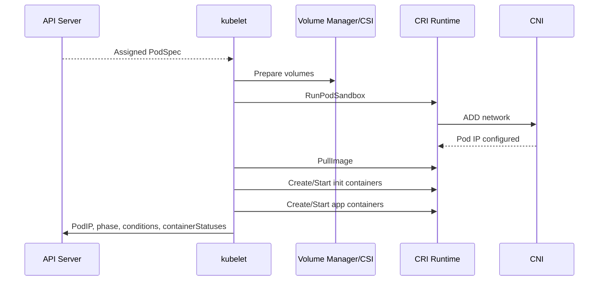

# kubelet và Container Runtime

## Mục lục

- [Tổng quan](#tổng-quan)
- [1. Ranh giới trách nhiệm](#1-ranh-giới-trách-nhiệm)
- [2. Pod lifecycle trên Node](#2-pod-lifecycle-trên-node)
- [3. Container Runtime Interface](#3-container-runtime-interface)
- [4. Pod sandbox và Linux isolation](#4-pod-sandbox-và-linux-isolation)
- [5. Image lifecycle](#5-image-lifecycle)
- [6. Container lifecycle và restart](#6-container-lifecycle-và-restart)
- [7. Probes và Pod conditions](#7-probes-và-pod-conditions)
- [8. Volume, Secret và ConfigMap](#8-volume-secret-và-configmap)
- [9. Status, logs và exec](#9-status-logs-và-exec)
- [10. Garbage collection và resource pressure](#10-garbage-collection-và-resource-pressure)
- [11. Static Pods](#11-static-pods)
- [12. Security](#12-security)
- [13. Failure modes và troubleshooting](#13-failure-modes-và-troubleshooting)
- [14. Thực hành](#14-thực-hành)
- [Tài liệu tham khảo](#tài-liệu-tham-khảo)

---

## Tổng quan

kubelet biến PodSpec trong Kubernetes API thành Container đang chạy trên một Node. Nó không tự hiện thực mọi chi tiết mà điều phối Container Runtime qua CRI, network plugin qua runtime/CNI integration và storage qua volume/CSI subsystem.

```text
PodSpec từ API
      │
      ▼
    kubelet
      ├── CRI Runtime Service ──▶ Pod sandbox + Containers
      ├── CRI Image Service ────▶ Pull/list/remove images
      ├── Volume Manager ───────▶ CSI / local mounts
      ├── Probe Manager ────────▶ startup/readiness/liveness
      └── Status Manager ───────▶ API Server
```

> [!IMPORTANT]
> Kubernetes quản lý Pod, không quản lý Container độc lập như object top-level. Runtime có Container ID, nhưng desired state, scheduling, policy và lifecycle được biểu diễn chủ yếu qua PodSpec.

---

## 1. Ranh giới trách nhiệm

### 1.1 kubelet

- Watch Pod được gán vào Node.
- Tính desired local state.
- Chuẩn bị volume và config.
- Gọi runtime tạo sandbox/Container.
- Chạy probes.
- Cập nhật Pod/Node status.
- Thực hiện restart và local eviction theo policy.
- Garbage collect image/Container theo cấu hình.

### 1.2 Container Runtime

- Pull/unpack image.
- Tạo/xóa Pod sandbox.
- Tạo/start/stop/remove Container.
- Cung cấp status, stats và exec/attach primitives.
- Quản lý runtime metadata và snapshot layer.

Runtime phổ biến gồm `containerd` và CRI-O.

### 1.3 Scheduler và controller

- Scheduler chọn Node trước khi kubelet hành động.
- Controllers tạo/thay thế Pod object ở cluster level.
- kubelet restart Container trong cùng Pod khi restart policy yêu cầu.

Phân biệt:

```text
Container crash → kubelet có thể restart Container
Pod bị xóa → workload controller tạo Pod object mới
Node lỗi → Control Plane/controller tạo replacement trên Node khác
```

---

## 2. Pod lifecycle trên Node



### 2.1 Pod worker

kubelet thường có worker/loop cho từng Pod, serialize thay đổi của Pod đó và retry operation. Nhiều Pod được xử lý concurrent có giới hạn.

### 2.2 Desired và actual local state

Desired state đến từ PodSpec. Actual state đến từ runtime, volume và probe results. kubelet liên tục sync để sửa drift, ví dụ Container liveness failed hoặc sandbox mất.

### 2.3 Termination

Khi Pod bị xóa:

1. kubelet chạy `preStop` hook nếu có và điều kiện phù hợp.
2. Gửi TERM cho process chính.
3. Chờ grace period.
4. Force kill nếu chưa dừng.
5. Tear down Container, sandbox, network và volume theo lifecycle.
6. Cập nhật status/cleanup local state.

Application phải xử lý SIGTERM, ngừng nhận traffic và đóng connection đúng cách.

---

## 3. Container Runtime Interface

CRI là gRPC API giữa kubelet và runtime. Hai service khái niệm:

- **RuntimeService:** sandbox và Container operations.
- **ImageService:** image operations.

Các operation tiêu biểu:

```text
RunPodSandbox
StopPodSandbox
CreateContainer
StartContainer
StopContainer
RemoveContainer
ContainerStatus
PullImage
ListImages
RemoveImage
```

### 3.1 Vì sao cần CRI

Không có CRI, kubelet phải tích hợp trực tiếp từng runtime. CRI tạo contract ổn định tương đối và cho phép thay runtime mà không đổi Pod API.

### 3.2 dockershim

Kubelet không còn tích hợp dockershim built-in. Docker/OCI image vẫn chạy được bằng runtime CRI tương thích vì image format và runtime integration là hai vấn đề khác nhau.

### 3.3 `crictl`

`crictl` là CLI debug CRI trên Node:

```bash
sudo crictl info
sudo crictl pods
sudo crictl ps -a
sudo crictl images
```

Cần cấu hình runtime endpoint đúng. Dùng `crictl` để debug, không thay Kubernetes API làm công cụ deployment.

---

## 4. Pod sandbox và Linux isolation

### 4.1 Pod sandbox

Sandbox giữ execution context chung cho Pod, đặc biệt network namespace. Một “pause” process có thể giữ namespaces tùy runtime implementation.

Container cùng Pod:

- Chia sẻ network namespace và IP.
- Có thể giao tiếp qua `localhost`.
- Có thể chia sẻ volume.
- Không mặc định chia sẻ process namespace trừ khi cấu hình.

### 4.2 Isolation primitives

Runtime dùng OCI runtime và Linux primitives:

- Namespaces: pid, network, mount, IPC, UTS, user tùy cấu hình.
- cgroups: resource accounting/control.
- capabilities: chia nhỏ root privileges.
- seccomp: syscall filtering.
- LSM như SELinux/AppArmor: policy bổ sung.

Container isolation yếu hơn VM boundary theo nhiều threat model; không chạy workload không tin cậy chỉ dựa vào namespace mặc định.

### 4.3 cgroup driver

kubelet và runtime cần cgroup configuration tương thích. Cgroup driver mismatch hoặc host cgroup issue có thể làm Node/runtime không ổn định.

---

## 5. Image lifecycle

### 5.1 Image reference

Dùng immutable digest khi cần reproducibility:

```yaml
image: example.com/app@sha256:<digest>
```

Tag có thể bị trỏ sang content khác. `:latest` thường kéo theo `Always` theo defaulting behavior, nhưng nên cấu hình rõ và dùng versioning có chủ đích.

### 5.2 `imagePullPolicy`

- `Always`: kubelet yêu cầu runtime resolve/pull theo policy; layer cache vẫn có thể được reuse.
- `IfNotPresent`: dùng local image nếu có.
- `Never`: không pull; fail nếu local image thiếu.

Field được default khi object tạo; đổi tag sau đó không nhất thiết tự đổi policy đã lưu.

### 5.3 Credentials

Registry auth có thể đến từ:

- `imagePullSecrets`.
- ServiceAccount-associated pull secrets.
- kubelet credential provider/plugin theo môi trường.

`ImagePullBackOff` có exponential backoff; sửa Secret xong có thể cần chờ retry hoặc recreate Pod trong lab, nhưng không nên restart kubelet tùy tiện.

### 5.4 Image garbage collection

kubelet/runtime dọn image không dùng khi disk usage vượt threshold. Image lớn và churn cao có thể gây DiskPressure hoặc startup chậm.

---

## 6. Container lifecycle và restart

### 6.1 Restart policy

Pod-level `restartPolicy`:

- `Always`.
- `OnFailure`.
- `Never`.

Deployment Pod thường dùng `Always`. Job thường dùng `OnFailure` hoặc `Never`.

### 6.2 CrashLoopBackOff

Khi Container start rồi exit lặp lại, kubelet retry với backoff. Đây là symptom, không phải root cause. Kiểm tra:

```bash
kubectl logs <pod> -n <namespace>
kubectl logs <pod> -n <namespace> --previous
kubectl describe pod <pod> -n <namespace>
```

Nguyên nhân thường là command sai, config thiếu, dependency lỗi, permission, OOM hoặc probe.

### 6.3 Hooks

- `postStart`: chạy gần thời điểm Container start, không bảo đảm trước entrypoint theo cách hiểu tuần tự đơn giản.
- `preStop`: hỗ trợ graceful shutdown trước TERM trong flow phù hợp.

Hook lỗi có thể ảnh hưởng lifecycle. Không dùng hook cho workflow dài không có timeout/observability.

---

## 7. Probes và Pod conditions

### 7.1 Startup probe

Bảo vệ ứng dụng khởi động chậm khỏi liveness check quá sớm. Khi startup probe chưa success, liveness/readiness behavior được kiểm soát theo probe lifecycle.

### 7.2 Liveness probe

Trả lời: **Container có cần restart không?**

Probe quá nhạy có thể tạo restart storm khi dependency chậm, làm outage nặng hơn.

### 7.3 Readiness probe

Trả lời: **Pod có nên nhận traffic không?**

Readiness failure loại Pod khỏi ready endpoints nhưng không restart Container. Readiness nên phản ánh khả năng phục vụ request, không phụ thuộc quá nhiều dependency không cần thiết.

### 7.4 Probe types

- HTTP GET.
- TCP socket.
- Exec.
- gRPC.

Exec probe tạo process và có overhead; probe tần suất quá cao trên nhiều Pod gây Node load.

### 7.5 Pod conditions

Các condition có thể gồm:

- `PodScheduled`.
- `Initialized`.
- `ContainersReady`.
- `Ready`.

Condition giúp xác định flow dừng ở scheduling, init hay app readiness.

---

## 8. Volume, Secret và ConfigMap

### 8.1 Volume preparation

kubelet volume manager đảm bảo volume cần thiết được mount trước Container. Với CSI, operation có thể cần controller-side attachment và node-side mount.

### 8.2 ConfigMap và Secret volume

Projected files có thể được cập nhật eventual, nhưng ứng dụng phải reload file để dùng giá trị mới. Config inject bằng environment variable không tự cập nhật trong process đang chạy; cần restart Pod.

### 8.3 `subPath`

Mount bằng `subPath` có update semantics khác projected volume thông thường. Không giả định file sẽ hot-reload.

### 8.4 `emptyDir`

Sống theo lifecycle của Pod trên Node; mất khi Pod bị loại khỏi Node. Container restart trong cùng Pod thường không xóa `emptyDir`, nhưng Pod replacement thì có.

---

## 9. Status, logs và exec

### 9.1 Container status

`status.containerStatuses` chứa:

- State: waiting/running/terminated.
- Last state.
- Ready.
- Restart count.
- Image và Container ID.

```bash
kubectl get pod <pod> -n <namespace> -o jsonpath='{.status.containerStatuses}'
```

### 9.2 Logs

Kubernetes logging architecture thường dựa vào runtime ghi file theo convention và kubelet phục vụ `pods/log`. `kubectl logs` không phải long-term log storage.

```bash
kubectl logs <pod> -n <namespace> -c <container>
kubectl logs <pod> -n <namespace> -c <container> --previous
```

Log rotation/retention Node-local cần cấu hình và centralized collector cho production.

### 9.3 exec, attach và port-forward

Các command này đi qua API subresources và kết nối tới kubelet/runtime path. `kubectl get pod` thành công không nghĩa `exec` chắc chắn thành công; RBAC và Node connectivity có thể khác.

---

## 10. Garbage collection và resource pressure

### 10.1 Container garbage collection

Dead Containers và sandbox được dọn theo policy. Không dùng external cleanup tool xóa runtime state tùy tiện vì có thể xung đột kubelet.

### 10.2 Image garbage collection

Kích hoạt theo disk thresholds, ưu tiên image không dùng. Nếu filesystem đầy trước khi GC hoạt động hiệu quả, Node có thể vào DiskPressure.

### 10.3 Eviction manager

Kubelet theo dõi memory, node filesystem, image filesystem, inode và PID signals. Khi vượt threshold, kubelet reclaim resource và có thể evict Pod.

### 10.4 OOM kill và eviction khác nhau

- OOM kill: kernel cgroup/host kill process vì memory.
- Eviction: kubelet chấm dứt Pod để reclaim Node resource.

Cả hai có thể liên quan memory nhưng evidence và remediation khác nhau.

---

## 11. Static Pods

Static Pod được kubelet quản lý từ manifest local, không qua workload controller. Thường dùng để bootstrap Control Plane trên kubeadm.

Đặc điểm:

- Manifest thường ở directory kubelet theo dõi.
- kubelet tạo mirror Pod trong API để quan sát.
- Xóa mirror Pod không xóa source manifest.
- Không được Scheduler quản lý như Pod thông thường.
- Chỉ Node chứa manifest đó chạy Pod.

Static Pod không phù hợp thay Deployment cho application thông thường vì thiếu scheduling, rollout và replica management ở cluster level.

---

## 12. Security

- Bảo vệ kubelet API bằng authentication/authorization.
- Hạn chế read-only/anonymous endpoint.
- Không mount runtime socket vào Pod không tin cậy.
- Dùng seccomp, capabilities tối thiểu, read-only root filesystem khi phù hợp.
- Tránh privileged, hostPID, hostNetwork và broad hostPath.
- Bảo vệ `/var/lib/kubelet`, runtime data và Pod logs.
- Rotate kubelet certificate.
- Giới hạn Node debug/SSH và audit thao tác.

Kubelet hoặc runtime bị chiếm có thể dẫn tới compromise toàn bộ workload trên Node và credential Pod mà Node được phép truy cập.

---

## 13. Failure modes và troubleshooting

| Trạng thái/triệu chứng | Lớp thường liên quan |
|------------------------|----------------------|
| Pod chưa có Node | Scheduler, không phải kubelet |
| `ContainerCreating` | runtime, CNI, CSI, config projection |
| `ErrImagePull` | registry, auth, DNS, image reference |
| `ImagePullBackOff` | Pull fail lặp lại với backoff |
| `CrashLoopBackOff` | Process/probe/config/OOM |
| `CreateContainerConfigError` | Secret/ConfigMap hoặc Pod config |
| `RunContainerError` | Runtime/OCI config |
| `FailedMount` | Volume/CSI/Secret/ConfigMap |
| `FailedCreatePodSandBox` | Runtime/CNI |
| Node `NotReady` | kubelet/runtime/network/host |

### 13.1 Từ API xuống Node

```bash
kubectl get pod <pod> -n <namespace> -o wide
kubectl describe pod <pod> -n <namespace>
kubectl get events -n <namespace> --sort-by=.metadata.creationTimestamp
kubectl logs <pod> -n <namespace> --all-containers
```

Nếu cần host access:

```bash
sudo systemctl status kubelet
sudo journalctl -u kubelet --since "30 min ago"
sudo systemctl status containerd
sudo journalctl -u containerd --since "30 min ago"
sudo crictl pods
sudo crictl ps -a
```

### 13.2 Debug Node qua Kubernetes

`kubectl debug node/<node>` có thể tạo debug Pod đặc quyền tùy cluster policy. Đây là operation nhạy cảm; cần RBAC, audit và cleanup.

### 13.3 Không xóa runtime state trước khi thu evidence

`rm -rf /var/lib/containerd` hoặc `/var/lib/kubelet` có thể phá Node và mất evidence. Chỉ reset Node theo runbook có drain/rebuild plan.

---

## 14. Thực hành

### 14.1 Quan sát runtime info

```bash
kubectl get nodes \
  -o custom-columns='NAME:.metadata.name,KUBELET:.status.nodeInfo.kubeletVersion,RUNTIME:.status.nodeInfo.containerRuntimeVersion,OS:.status.nodeInfo.osImage'
```

### 14.2 Quan sát restart

Tạo Pod exit liên tục:

```yaml
apiVersion: v1
kind: Pod
metadata:
  name: restart-demo
spec:
  containers:
    - name: demo
      image: busybox:1.36
      command: ["sh", "-c", "echo starting; sleep 2; exit 1"]
  restartPolicy: Always
```

Lưu là `/tmp/restart-demo.yaml`:

```bash
kubectl apply -f /tmp/restart-demo.yaml
kubectl get pod restart-demo --watch
kubectl describe pod restart-demo
kubectl logs restart-demo --previous
kubectl delete pod restart-demo
```

### 14.3 Quan sát readiness

```bash
kubectl create deployment readiness-demo --image=nginx:1.27-alpine
kubectl get pods -l app=readiness-demo -o wide
kubectl describe pod -l app=readiness-demo
kubectl delete deployment readiness-demo
```

Dùng [Health Probes](/cau-hinh/health-probes/) để đi sâu vào manifest và thiết kế probe.

Tiếp theo, đọc [Declarative Model và Reconciliation Loop](/kien-truc/declarative-reconciliation/) để nối mọi component thành một mô hình tư duy thống nhất.

---

## Tài liệu tham khảo

- [Kubernetes Components: kubelet](https://kubernetes.io/docs/concepts/overview/components/#kubelet)
- [Container Runtime Interface](https://kubernetes.io/docs/concepts/architecture/cri/)
- [Pod Lifecycle](https://kubernetes.io/docs/concepts/workloads/pods/pod-lifecycle/)
- [Images](https://kubernetes.io/docs/concepts/containers/images/)
- [Node-pressure Eviction](https://kubernetes.io/docs/concepts/scheduling-eviction/node-pressure-eviction/)
