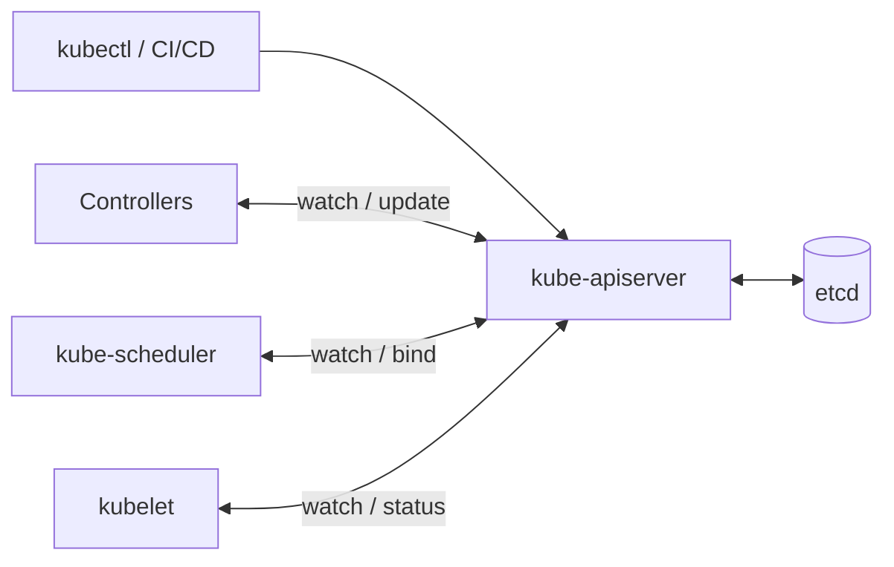
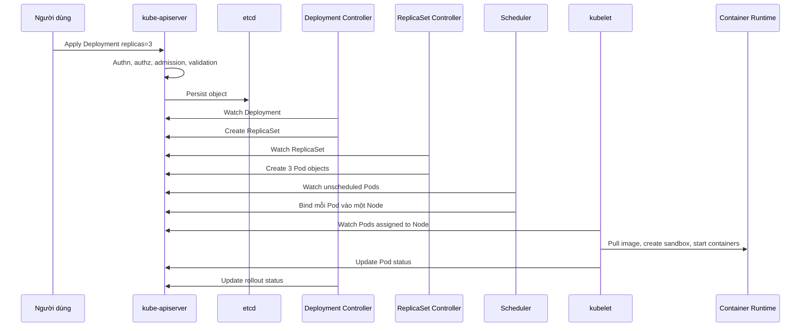

# Tổng quan Kubernetes Cluster

## Mục lục

- [Tổng quan](#tổng-quan)
- [1. Cluster giải quyết bài toán gì](#1-cluster-giải-quyết-bài-toán-gì)
- [2. Hai miền chính của cluster](#2-hai-miền-chính-của-cluster)
- [3. Kubernetes API là trung tâm](#3-kubernetes-api-là-trung-tâm)
- [4. Luồng triển khai workload từ đầu đến cuối](#4-luồng-triển-khai-workload-từ-đầu-đến-cuối)
- [5. Trạng thái và phạm vi tài nguyên](#5-trạng-thái-và-phạm-vi-tài-nguyên)
- [6. Networking, storage và extensibility](#6-networking-storage-và-extensibility)
- [7. Topology cluster phổ biến](#7-topology-cluster-phổ-biến)
- [8. Failure domain và High Availability](#8-failure-domain-và-high-availability)
- [9. Shared responsibility](#9-shared-responsibility)
- [10. Thực hành quan sát cluster](#10-thực-hành-quan-sát-cluster)
- [11. Mô hình tư duy khi troubleshooting](#11-mô-hình-tư-duy-khi-troubleshooting)
- [12. Tổng kết](#12-tổng-kết)
- [Tài liệu tham khảo](#tài-liệu-tham-khảo)

---

## Tổng quan

Kubernetes Cluster là một hệ thống phân tán gồm các máy và tiến trình phối hợp để duy trì **desired state** của workload. Người dùng mô tả điều muốn có qua Kubernetes API; Control Plane lưu, phân tích và ra quyết định; các Node thực thi quyết định đó bằng cách chạy Container.

```text
                    ┌────────────────────────────┐
Developer / CI/CD ─▶│       Kubernetes API       │
                    └──────────────┬─────────────┘
                                   │ desired state
                ┌──────────────────┴──────────────────┐
                │            Control Plane            │
                │  storage │ scheduling │ controllers │
                └──────────────────┬──────────────────┘
                                   │ assigned Pods
                  ┌────────────────┴────────────────┐
                  │                                 │
          ┌───────▼────────┐                ┌───────▼────────┐
          │ Worker Node A  │                │ Worker Node B  │
          │ kubelet/runtime│                │ kubelet/runtime│
          │ Pods           │                │ Pods           │
          └────────────────┘                └────────────────┘
```

> [!IMPORTANT]
> Cluster không phải một máy lớn và Control Plane không trực tiếp chạy từng lệnh bên trong Container. Kubernetes hoạt động qua API objects, watch events và nhiều reconciliation loop độc lập.

---

## 1. Cluster giải quyết bài toán gì

Khi chỉ có một server, operator có thể SSH vào máy, chạy process và tự xử lý lỗi. Khi có hàng chục service trên nhiều máy, cách đó không còn đáng tin cậy vì phải đồng thời giải quyết:

- Đặt workload lên máy còn đủ CPU, memory và thiết bị.
- Duy trì số replica khi Pod hoặc Node lỗi.
- Cung cấp network identity ổn định khi Pod IP thay đổi.
- Rollout phiên bản mới có kiểm soát.
- Gắn configuration, Secret và persistent storage.
- Áp dụng identity, authorization và policy nhất quán.
- Quan sát trạng thái thực tế và tự động sửa sai lệch.

Kubernetes chuẩn hóa các nhu cầu này thành resource và controller. Ví dụ, thay vì viết script “start ba process”, người dùng tạo một Deployment có `replicas: 3`. Nếu chỉ còn hai Pod, controller tạo thêm một Pod mà không cần operator ra lệnh lần nữa.

| Bài toán | Kubernetes primitive thường dùng |
|----------|----------------------------------|
| Chạy ứng dụng | Pod, Deployment, StatefulSet, Job |
| Service discovery | Service, EndpointSlice, DNS |
| Cấu hình | ConfigMap, Secret |
| Lưu trữ | Volume, PVC, PV, StorageClass, CSI |
| Placement | Scheduler, affinity, taints, topology spread |
| Identity và quyền | ServiceAccount, RBAC |
| Tự phục hồi | Controllers, kubelet, probes |
| Mở rộng API | CRD, custom controller, Operator |

---

## 2. Hai miền chính của cluster

### 2.1 Control Plane

Control Plane quản lý trạng thái toàn cluster và đưa ra quyết định. Các thành phần cốt lõi gồm:

- **kube-apiserver:** phục vụ Kubernetes API và là cổng giao tiếp chính.
- **etcd:** lưu dữ liệu API bền vững với consistency mạnh.
- **kube-scheduler:** chọn Node cho Pod chưa được gán.
- **kube-controller-manager:** chạy các controller cốt lõi.
- **cloud-controller-manager:** tích hợp với cloud provider khi cần.

Control Plane nên được xem là **decision plane**, không phải nơi chứa application data. Trong production, các component thường chạy nhiều replica và trải trên nhiều failure domain.

### 2.2 Worker Node

Worker Node cung cấp compute thực tế cho workload:

- **kubelet** theo dõi Pod được gán cho Node và báo status.
- **Container Runtime** pull image, tạo sandbox và quản lý Container qua CRI.
- **Network plugin** hiện thực Pod network theo CNI.
- Các agent như node-level proxy, CSI node plugin, logging hoặc monitoring daemon hỗ trợ networking, storage và observability.

Control Plane cũng có thể là Node và chạy Pod, đặc biệt trong local lab. Tuy nhiên kubeadm thường taint Control Plane Node để tránh application workload chiếm tài nguyên quản trị.

Đọc sâu hơn tại [Control Plane](/kien-truc/control-plane/) và [Worker Node](/kien-truc/worker-node/).

---

## 3. Kubernetes API là trung tâm

Hầu hết component không gọi trực tiếp lẫn nhau để truyền lệnh nghiệp vụ. Chúng đọc và ghi object qua API Server.



Ví dụ Scheduler không gửi lệnh trực tiếp đến kubelet. Scheduler ghi binding của Pod vào API. Kubelet trên Node tương ứng quan sát thay đổi rồi thực thi Pod.

Thiết kế này mang lại:

- **Loose coupling:** component phối hợp qua model chung.
- **Auditability:** request có thể được audit tại API layer.
- **Extensibility:** custom controller dùng cùng watch/update pattern.
- **Retry an toàn hơn:** actor có thể quan sát trạng thái hiện tại sau khi reconnect.

Đổi lại, trạng thái không hội tụ tức thời. Người vận hành cần hiểu **eventual convergence**: request được API Server chấp nhận không có nghĩa workload đã Ready.

---

## 4. Luồng triển khai workload từ đầu đến cuối

Giả sử người dùng apply một Deployment ba replica:



### 4.1 Request được chấp nhận

API Server xác thực identity, kiểm tra quyền, chạy admission và validate object. Sau khi persist, client nhận response. Tại thời điểm này mới chỉ có Deployment object.

### 4.2 Controllers tạo resource con

Deployment controller tạo ReplicaSet. ReplicaSet controller tạo Pod để đạt số replica mong muốn. Quan hệ ownership hình thành chuỗi:

```text
Deployment → ReplicaSet → Pod
```

### 4.3 Scheduler quyết định placement

Scheduler tìm Pod có `spec.nodeName` chưa được đặt, lọc Node không phù hợp, chấm điểm các Node khả dụng và ghi quyết định binding.

### 4.4 kubelet hiện thực Pod

Kubelet trên Node được chọn nhận PodSpec, phối hợp với runtime, network và storage plugin, rồi cập nhật Pod status cùng conditions.

### 4.5 Service đưa traffic đến Pod Ready

Nếu có Service, EndpointSlice controller cập nhật endpoint dựa trên selector và readiness. Dataplane trên Node đưa traffic đến các backend phù hợp.

> [!NOTE]
> Một lần `kubectl apply` khởi động cả chuỗi asynchronous. Vì vậy troubleshooting phải xác định chuỗi đang dừng ở bước nào, không chỉ nhìn kết quả cuối.

---

## 5. Trạng thái và phạm vi tài nguyên

### 5.1 `spec`, `status` và `metadata`

Kubernetes object thường có ba nhóm dữ liệu quan trọng:

- `metadata`: name, Namespace, labels, annotations, UID, generation và ownership.
- `spec`: desired state do người dùng hoặc controller khai báo.
- `status`: actual state được component cập nhật.

Khoảng cách giữa `spec` và `status` là tín hiệu quan trọng. Ví dụ `spec.replicas: 3` nhưng `status.readyReplicas: 1` nghĩa là hệ thống chưa đạt desired state.

### 5.2 Namespaced và cluster-scoped

| Scope | Ví dụ | Ý nghĩa |
|-------|-------|---------|
| Namespaced | Pod, Deployment, Service, ConfigMap | Name chỉ cần duy nhất trong Namespace |
| Cluster-scoped | Node, Namespace, PersistentVolume, ClusterRole | Tồn tại trên toàn cluster |

Namespace là ranh giới tổ chức, naming, quota và policy; không mặc định tạo isolation tuyệt đối. NetworkPolicy, RBAC và admission policy vẫn phải được thiết kế riêng.

### 5.3 Control Plane state và application state

- **Control Plane state:** Kubernetes API objects trong etcd.
- **Application state:** dữ liệu nghiệp vụ trong database, object storage hoặc volume.

Backup etcd không thay thế backup dữ liệu ứng dụng. Ngược lại, backup database không thể khôi phục toàn bộ cluster configuration.

---

## 6. Networking, storage và extensibility

Kubernetes định nghĩa API và contract, nhưng nhiều khả năng phụ thuộc plugin.

### 6.1 Networking

Mô hình cơ bản kỳ vọng mỗi Pod có network identity và các Pod có thể giao tiếp theo cluster network model. Việc hiện thực thường do CNI plugin đảm nhiệm. Service cung cấp virtual endpoint ổn định phía trên tập Pod động.

### 6.2 Storage

Kubernetes dùng CSI để tích hợp storage system. PVC mô tả nhu cầu, StorageClass định nghĩa cách provision, còn CSI controller/node components thực hiện tạo và mount volume.

### 6.3 Extensibility

CRD thêm resource type mới; custom controller thêm hành vi reconciliation. Operator kết hợp hai phần để quản lý lifecycle của hệ thống phức tạp bằng Kubernetes API.

```text
Built-in API + built-in controllers
              │
              ├── CNI: networking
              ├── CSI: storage
              ├── CRI: container runtime
              └── CRD + controller: domain-specific automation
```

---

## 7. Topology cluster phổ biến

### 7.1 Local single-node hoặc multi-node

Dùng `kind`, `minikube` hoặc tương tự để học và test. Control Plane và workload có thể cùng nằm trên một máy vật lý.

**Ưu điểm:** nhanh, rẻ, dễ reset.

**Giới hạn:** không phản ánh đầy đủ failure domain, load balancer và storage production.

### 7.2 Self-managed cluster

Đội vận hành sở hữu Control Plane, etcd, certificate, upgrade và Node lifecycle. `kubeadm` là công cụ bootstrap phổ biến nhưng không phải một platform quản trị hoàn chỉnh.

### 7.3 Managed Kubernetes

Cloud provider quản lý phần lớn Control Plane. Người dùng vẫn chịu trách nhiệm cho workload, Node hoặc compute configuration, RBAC, network policy, observability, backup application và chi phí.

| Mô hình | Control Plane | Worker/compute | Phù hợp |
|---------|---------------|----------------|----------|
| Local lab | Công cụ local | Công cụ local | Học tập, CI test |
| Self-managed | Đội platform | Đội platform | Cần kiểm soát sâu |
| Managed | Provider | Shared responsibility | Giảm gánh nặng vận hành |

---

## 8. Failure domain và High Availability

Một cluster HA không chỉ là “có ba Control Plane Node”. Cần xét nhiều failure domain:

- Process hoặc Container của component.
- VM hoặc máy vật lý.
- Rack hoặc availability zone.
- Network path và load balancer.
- Storage của etcd.
- Credential, certificate và dependency bên ngoài.

Các nguyên tắc nền tảng:

1. Chạy nhiều API Server sau load balancer.
2. Duy trì etcd quorum trên số member lẻ, thường là 3 hoặc 5.
3. Phân tán replica quan trọng qua Node và zone.
4. Có capacity dự phòng để reschedule khi Node lỗi.
5. Backup etcd và application data, đồng thời diễn tập restore.
6. Giám sát latency, error rate, saturation và certificate expiry.

HA Control Plane không tự động làm application HA. Một Deployment một replica hoặc database không replication vẫn là single point of failure.

---

## 9. Shared responsibility

| Lớp | Kubernetes/provider thường cung cấp | Người dùng vẫn phải làm |
|-----|--------------------------------------|-------------------------|
| API | Resource model, auth hooks, controllers | RBAC, admission policy, API lifecycle |
| Compute | Scheduling primitives, Node agents | Capacity, requests/limits, placement |
| Network | Service abstraction, plugin interfaces | CNI choice, policy, ingress/egress design |
| Storage | PVC/PV/CSI abstraction | Backup, retention, performance, DR |
| Availability | Restart và replica controllers | SLO, topology, dependency resilience |
| Security | Identity và authorization primitives | Least privilege, hardening, supply chain |
| Observability | Status, Events, metrics endpoints | Collection, retention, dashboards, alerting |

Kubernetes cung cấp primitive; production outcome phụ thuộc cách ghép các primitive thành platform và operating model.

---

## 10. Thực hành quan sát cluster

Các lệnh sau chỉ đọc trạng thái và dùng được trên hầu hết cluster:

```bash
# Client/server version và endpoint
kubectl version
kubectl cluster-info

# Node, role, version, IP và runtime
kubectl get nodes -o wide

# Namespace và workload hệ thống
kubectl get namespaces
kubectl get pods -n kube-system -o wide

# Danh sách resource cùng scope
kubectl api-resources

# Trạng thái chi tiết một Node
kubectl describe node "$(kubectl get nodes -o jsonpath='{.items[0].metadata.name}')"

# Component health endpoint; quyền truy cập tùy cluster
kubectl get --raw='/readyz?verbose'
```

Quan sát luồng tạo Pod:

```bash
kubectl create namespace architecture-lab
kubectl create deployment web \
  --image=nginx:1.27-alpine \
  --replicas=3 \
  -n architecture-lab

kubectl get deployment,replicaset,pod \
  -n architecture-lab \
  -o wide \
  --show-labels

kubectl get events \
  -n architecture-lab \
  --sort-by=.metadata.creationTimestamp

kubectl rollout status deployment/web -n architecture-lab
```

Kiểm tra owner chain:

```bash
kubectl get replicaset -n architecture-lab \
  -o custom-columns='NAME:.metadata.name,OWNER:.metadata.ownerReferences[0].name'

kubectl get pods -n architecture-lab \
  -o custom-columns='NAME:.metadata.name,NODE:.spec.nodeName,OWNER:.metadata.ownerReferences[0].name,PHASE:.status.phase'
```

Cleanup:

```bash
kubectl delete namespace architecture-lab
```

---

## 11. Mô hình tư duy khi troubleshooting

Khi workload không hoạt động, đi theo control flow thay vì thử command ngẫu nhiên:

| Câu hỏi | Tín hiệu kiểm tra |
|---------|-------------------|
| Object có được API chấp nhận không? | `kubectl get`, error từ apply, audit/admission |
| Controller có tạo resource con không? | ReplicaSet, Pod, ownerReferences, Events |
| Pod đã được schedule chưa? | `spec.nodeName`, `PodScheduled`, scheduler Events |
| kubelet đã tạo sandbox/Container chưa? | Pod conditions, Events, Node status |
| Image, network, volume có sẵn không? | `ImagePullBackOff`, CNI/CSI Events |
| Container có healthy và Ready không? | logs, probes, restart count |
| Service có endpoint không? | Service selector, EndpointSlice, readiness |

Bắt đầu bằng:

```bash
kubectl get pod <pod-name> -n <namespace> -o wide
kubectl describe pod <pod-name> -n <namespace>
kubectl get events -n <namespace> --sort-by=.metadata.creationTimestamp
```

Đừng mặc định Pod `Running` đồng nghĩa ứng dụng phục vụ được traffic. Cần kiểm tra `Ready`, endpoint và dependency.

---

## 12. Tổng kết

Hãy ghi nhớ flow cốt lõi:

```text
Manifest
  → API Server chấp nhận và lưu desired state
  → Controllers tạo hoặc điều chỉnh resources
  → Scheduler chọn Node
  → kubelet và runtime chạy Container
  → status phản hồi về API
  → controllers tiếp tục reconcile
```

Tiếp theo, đọc [Các thành phần trong Cluster](/kien-truc/cluster-components/) để xây bản đồ trách nhiệm chi tiết trước khi đi sâu vào từng component.

---

## Tài liệu tham khảo

- [Kubernetes Components](https://kubernetes.io/docs/concepts/overview/components/)
- [Kubernetes API](https://kubernetes.io/docs/concepts/overview/kubernetes-api/)
- [Kubernetes Objects](https://kubernetes.io/docs/concepts/overview/working-with-objects/)
- [Cluster Architecture](https://kubernetes.io/docs/concepts/architecture/)
- [Operating etcd clusters for Kubernetes](https://kubernetes.io/docs/tasks/administer-cluster/configure-upgrade-etcd/)
