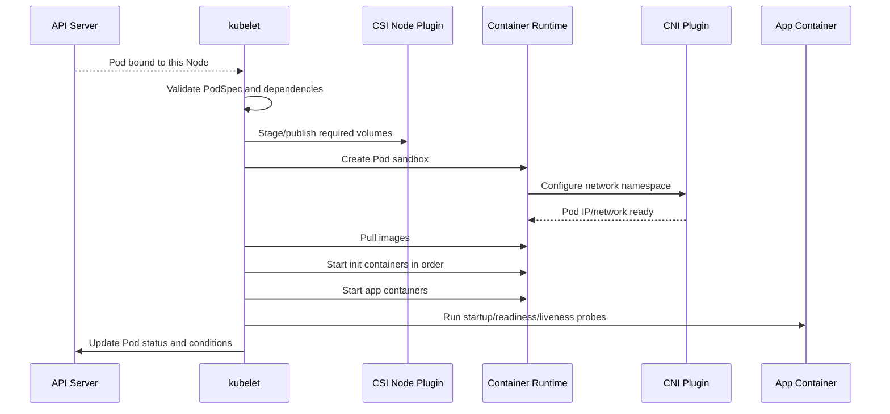

# Worker Node

## Mục lục

- [Tổng quan](#tổng-quan)
- [1. Worker Node cung cấp gì](#1-worker-node-cung-cấp-gì)
- [2. Thành phần trên Node](#2-thành-phần-trên-node)
- [3. Từ Pod được schedule đến Container Running](#3-từ-pod-được-schedule-đến-container-running)
- [4. Node object và heartbeat](#4-node-object-và-heartbeat)
- [5. Capacity, allocatable và resource accounting](#5-capacity-allocatable-và-resource-accounting)
- [6. Node conditions và pressure](#6-node-conditions-và-pressure)
- [7. Networking và storage trên Node](#7-networking-và-storage-trên-node)
- [8. Cordon, drain và lifecycle](#8-cordon-drain-và-lifecycle)
- [9. Failure modes](#9-failure-modes)
- [10. Security và hardening](#10-security-và-hardening)
- [11. Thực hành quan sát Node](#11-thực-hành-quan-sát-node)
- [12. Checklist production](#12-checklist-production)
- [Tài liệu tham khảo](#tài-liệu-tham-khảo)

---

## Tổng quan

Worker Node là máy vật lý hoặc VM cung cấp CPU, memory, network và storage attachment để chạy workload. Control Plane quyết định **workload nên chạy ở đâu**; Node components quyết định **làm thế nào hiện thực PodSpec trên máy đó**.

```text
Control Plane
    │ Pod đã có spec.nodeName
    ▼
┌──────────────── Worker Node ────────────────┐
│ kubelet                                     │
│   ├── Container Runtime ──▶ Pod sandbox     │
│   ├── CNI / network agent ─▶ Pod network    │
│   ├── CSI node plugin ─────▶ Volume mount   │
│   └── probes/status ───────▶ API Server     │
│                                             │
│ system processes + Pods + node-level agents │
└─────────────────────────────────────────────┘
```

> [!IMPORTANT]
> Node `Ready` chỉ cho biết kubelet báo Node có thể nhận workload ở mức tổng quát. Nó không chứng minh mọi image registry, CNI path, CSI backend hoặc ứng dụng trên Node đều khỏe.

---

## 1. Worker Node cung cấp gì

Một Worker Node cung cấp bốn nhóm năng lực:

1. **Compute:** CPU, memory và accelerator.
2. **Runtime:** image, Pod sandbox và Container lifecycle.
3. **Network:** Pod IP, routes, DNS path và Service dataplane.
4. **Storage access:** mount ephemeral hoặc persistent volume.

Node tham gia cluster bằng Node object. Scheduler dùng labels, taints, capacity, allocatable và conditions để đánh giá placement. kubelet dùng PodSpec đã bind làm desired state local.

Node không nhất thiết chỉ chạy application Pod. Nó còn chạy:

- kubelet và Container Runtime.
- OS services.
- CNI/CSI agents.
- Service dataplane.
- Monitoring, logging và security agents.

Do đó không thể cấp toàn bộ physical memory/CPU cho Pod.

---

## 2. Thành phần trên Node

### 2.1 kubelet

kubelet là Node agent chính:

- Đăng ký Node với API Server.
- Watch Pod được gán vào Node.
- Quản lý volume và gọi runtime qua CRI.
- Chạy probes.
- Thu thập Container/Pod status.
- Gửi Node heartbeat và status.
- Thực hiện local eviction khi resource pressure.

### 2.2 Container Runtime

Runtime như `containerd` hoặc CRI-O:

- Pull/unpack image.
- Tạo Pod sandbox.
- Start, stop và remove Container.
- Trả runtime status cho kubelet.
- Quản lý image/container storage local.

### 2.3 Network plugin và dataplane

CNI plugin kết nối Pod sandbox vào network. Một node agent hoặc `kube-proxy` hiện thực Service routing. Tùy giải pháp, eBPF có thể thay thế một phần iptables/IPVS flow.

### 2.4 CSI node plugin

CSI node plugin thường chạy dưới DaemonSet và thực hiện stage/publish volume trên Node. Kubelet phối hợp mount trước khi start Container cần volume.

### 2.5 Node-level DaemonSets

Logging, metrics và runtime security agent thường chạy một Pod trên mỗi Node. Chúng tiêu thụ resource và cần được tính vào capacity planning.

---

## 3. Từ Pod được schedule đến Container Running



### 3.1 Pod sandbox

Sandbox cung cấp shared namespaces cho Pod, đặc biệt network namespace. Các Container trong cùng Pod chia sẻ Pod IP và giao tiếp qua `localhost`.

### 3.2 Image pull

Runtime pull image theo `imagePullPolicy` và credentials. `ImagePullBackOff` thường liên quan image name, registry auth, rate limit, DNS hoặc egress.

### 3.3 Init Containers

Init Containers chạy tuần tự và phải thành công trước app Containers. Một init Container lỗi có thể giữ Pod ở trạng thái `Init:*` dù Node và runtime khỏe.

### 3.4 Probes và readiness

- **startupProbe:** cho ứng dụng chậm khởi động.
- **livenessProbe:** quyết định restart Container.
- **readinessProbe:** quyết định Pod có nhận traffic hay không.

Readiness thất bại không nhất thiết restart Container; liveness thất bại có thể restart.

---

## 4. Node object và heartbeat

### 4.1 Registration

kubelet có thể tự đăng ký Node hoặc Node object được tạo trước. Identity của kubelet phải được authentication/authorization đúng để cập nhật Node và Pod status liên quan.

### 4.2 Node status

Node status gồm:

- Addresses.
- Capacity và allocatable.
- Conditions.
- System info: kernel, OS, kubelet và runtime version.
- Images đã có trên Node.

```bash
kubectl get node <node-name> -o yaml
```

### 4.3 Lease heartbeat

Để giảm số lần update Node object nặng, kubelet cập nhật Lease trong Namespace `kube-node-lease`. Node lifecycle controller dùng heartbeat và status để phát hiện Node không phản hồi.

```bash
kubectl get leases -n kube-node-lease
```

Nếu heartbeat dừng, Control Plane không biết ngay workload đã chết hay chỉ mất network. Detection và eviction cần timeout để tránh phản ứng quá sớm trước transient failure.

---

## 5. Capacity, allocatable và resource accounting

### 5.1 Capacity và allocatable

- **capacity:** tổng resource Node báo cáo.
- **allocatable:** phần scheduler có thể cấp cho Pod sau reservation.

Khái niệm:

```text
Allocatable = Capacity - kubeReserved - systemReserved - eviction headroom
```

Kiểm tra:

```bash
kubectl describe node <node-name>
kubectl get node <node-name> \
  -o jsonpath='{.status.capacity}{"\n"}{.status.allocatable}{"\n"}'
```

### 5.2 Requests và actual usage

Scheduler chủ yếu dùng **requests**, không dùng real-time usage để quyết định Node. Vì vậy:

- Request quá thấp gây overcommit và pressure.
- Request quá cao làm Pod Pending dù usage thực thấp.
- Pod không có request có thể làm capacity planning khó dự đoán.

### 5.3 CPU và memory khác nhau

- CPU là compressible: có thể throttle.
- Memory là incompressible: khi thiếu, process có thể bị OOM kill hoặc Pod bị eviction.

Ephemeral storage cũng có thể gây `DiskPressure` và eviction khi image, writable layer hoặc logs tăng quá mức.

---

## 6. Node conditions và pressure

Các condition thường gặp:

| Condition | `True` nghĩa là |
|-----------|-----------------|
| Ready | Node healthy ở mức kubelet report |
| MemoryPressure | Memory khả dụng dưới threshold |
| DiskPressure | Disk/image filesystem chịu áp lực |
| PIDPressure | PID khả dụng dưới threshold |
| NetworkUnavailable | Network Node chưa được cấu hình đúng |

Xem condition:

```bash
kubectl get nodes
kubectl describe node <node-name>
```

### 6.1 Taints từ condition

Control Plane có thể gắn taint dựa trên Node condition, ví dụ `node.kubernetes.io/not-ready`. Toleration quyết định Pod có tiếp tục được schedule hoặc tồn tại trong tình huống cụ thể.

### 6.2 Eviction

Kubelet có thể evict Pod để bảo vệ Node khi resource vượt threshold. Thứ tự bị ảnh hưởng bởi:

- Usage vượt requests.
- QoS class.
- Priority.
- Loại pressure và policy.

Eviction là phản ứng bảo vệ Node, không phải autoscaling. Cần xử lý nguyên nhân capacity hoặc workload behavior.

---

## 7. Networking và storage trên Node

### 7.1 Pod networking

Khi tạo sandbox, network plugin thường:

- Tạo virtual interface.
- Đưa một đầu vào Pod network namespace.
- Cấp IP.
- Cấu hình route.
- Thiết lập policy/dataplane cần thiết.

CNI lỗi thường biểu hiện bằng Events như failed to create Pod sandbox.

### 7.2 Service routing

`kube-proxy` hoặc implementation thay thế watch Service và EndpointSlice rồi lập trình dataplane. Pod có thể có network nhưng vẫn không truy cập được ClusterIP nếu lớp này lỗi.

### 7.3 Volume lifecycle

Với persistent volume, flow có thể gồm:

```text
Provision → Attach → Stage → Publish/Mount → Container start
```

Một số bước chạy ở CSI controller, một số tại Node. `Multi-Attach` hoặc mount failure cần xác định lỗi ở topology, attachment, CSI node plugin hay filesystem.

---

## 8. Cordon, drain và lifecycle

### 8.1 Cordon

Đánh dấu Node `unschedulable`; Pod hiện có không tự bị xóa.

```bash
kubectl cordon <node-name>
```

### 8.2 Drain

Evict workload để bảo trì:

```bash
kubectl drain <node-name> \
  --ignore-daemonsets \
  --delete-emptydir-data
```

`drain` tôn trọng PodDisruptionBudget khi dùng eviction API. Flag `--delete-emptydir-data` chấp nhận mất dữ liệu `emptyDir`; phải hiểu tác động trước khi chạy.

### 8.3 Uncordon

Cho phép schedule trở lại:

```bash
kubectl uncordon <node-name>
```

### 8.4 Node shutdown

Graceful node shutdown phụ thuộc kubelet/OS integration và cấu hình. Với failure đột ngột, Control Plane cần thời gian phát hiện rồi thay thế workload do controller quản lý.

> [!WARNING]
> Pod đứng độc lập không có controller sẽ không tự được tạo lại ở Node khác. Production workload nên dùng controller phù hợp.

---

## 9. Failure modes

| Triệu chứng | Khả năng | Kiểm tra |
|-------------|-----------|----------|
| Node `NotReady` | kubelet, runtime, network, host down | Node conditions, Lease, journald |
| Pod Pending đã có `nodeName` | kubelet chưa sync, volume/network | Pod Events, kubelet logs |
| `ContainerCreating` lâu | CNI, CSI, image pull | `describe pod`, plugin logs |
| `ImagePullBackOff` | image/registry/auth/network | Events, imagePullSecret |
| `CrashLoopBackOff` | process/probe/config | logs hiện tại và `--previous` |
| Pod `Evicted` | memory/disk/PID pressure | Pod reason, Node conditions |
| `OOMKilled` | Container vượt memory hoặc host OOM | last state, limits, Node logs |
| Service lỗi chỉ trên một Node | dataplane/CNI Node-local | Endpoint, route/rule, agent logs |
| PVC lỗi chỉ trên một Node | CSI node plugin/mount/zone | Pod/VolumeAttachment Events |

Quy trình cơ bản:

```bash
kubectl get pod <pod> -n <ns> -o wide
kubectl describe pod <pod> -n <ns>
kubectl describe node <node>
kubectl get events -n <ns> --sort-by=.metadata.creationTimestamp
```

Nếu có quyền host:

```bash
journalctl -u kubelet --since "30 min ago"
journalctl -u containerd --since "30 min ago"
crictl info
crictl ps -a
```

`crictl` cần endpoint runtime phù hợp và quyền root trên Node.

---

## 10. Security và hardening

- Hạn chế SSH; dùng audited access hoặc ephemeral debug workflow.
- Bảo vệ kubelet API và client certificate.
- Không expose runtime socket vào workload tùy tiện.
- Dùng OS image tối giản, patch đều và kiểm soát package.
- Áp dụng seccomp, Linux capabilities và non-root cho Pod.
- Cô lập workload nhạy cảm bằng dedicated Node pool, taints và policy khi cần.
- Mã hóa disk và bảo vệ local image/container data theo threat model.
- Giới hạn metadata service của cloud bằng workload identity và network control.
- Giám sát privileged Pod, hostPath, hostNetwork và hostPID.

Runtime socket hoặc host root access gần như tương đương quyền kiểm soát Node; RBAC trong API không cứu được khi attacker đã chiếm host.

---

## 11. Thực hành quan sát Node

### 11.1 Inventory và resource

```bash
kubectl get nodes -o wide
kubectl top nodes
kubectl describe node <node-name>
```

`kubectl top` yêu cầu Metrics Server.

### 11.2 Xem Pod phân bố theo Node

```bash
kubectl get pods -A \
  -o custom-columns='NAMESPACE:.metadata.namespace,NAME:.metadata.name,NODE:.spec.nodeName,PHASE:.status.phase' \
  --sort-by=.spec.nodeName
```

### 11.3 Xem requests/limits trên một Node

```bash
kubectl describe node <node-name>
```

Tìm phần `Allocated resources`. Giá trị là tổng requests/limits, không phải real-time usage.

### 11.4 Lab cordon an toàn

Chỉ thực hiện trên local multi-node cluster:

```bash
kubectl cordon <worker-node>
kubectl get nodes

kubectl create deployment node-lab \
  --image=nginx:1.27-alpine \
  --replicas=2

kubectl get pods -l app=node-lab -o wide
kubectl uncordon <worker-node>
kubectl delete deployment node-lab
```

Không drain một cluster single-node đang dùng cho công việc khác.

---

## 12. Checklist production

- Node pool có capacity dự phòng cho failure và rollout.
- Resource reservations bảo vệ OS, kubelet và agents.
- Requests/limits và QoS được thiết kế theo workload.
- CNI, CSI và runtime version tương thích Kubernetes version.
- Log rotation và image garbage collection được giám sát.
- Node conditions, kubelet/runtime errors và disk pressure có alert.
- PDB và replica topology cho phép drain an toàn.
- Upgrade theo batch, cordon/drain/verify rõ ràng.
- Không lưu dữ liệu bền vững chỉ trong writable layer hoặc `emptyDir`.
- Node access, runtime socket và cloud metadata được bảo vệ.

Tiếp theo, đọc [kube-apiserver](/kien-truc/kube-apiserver/) để hiểu entry point kết nối Control Plane với mọi Node và client.

---

## Tài liệu tham khảo

- [Nodes](https://kubernetes.io/docs/concepts/architecture/nodes/)
- [Node-pressure Eviction](https://kubernetes.io/docs/concepts/scheduling-eviction/node-pressure-eviction/)
- [Reserve Compute Resources for System Daemons](https://kubernetes.io/docs/tasks/administer-cluster/reserve-compute-resources/)
- [Safely Drain a Node](https://kubernetes.io/docs/tasks/administer-cluster/safely-drain-node/)
- [Container Runtime Interface](https://kubernetes.io/docs/concepts/architecture/cri/)
