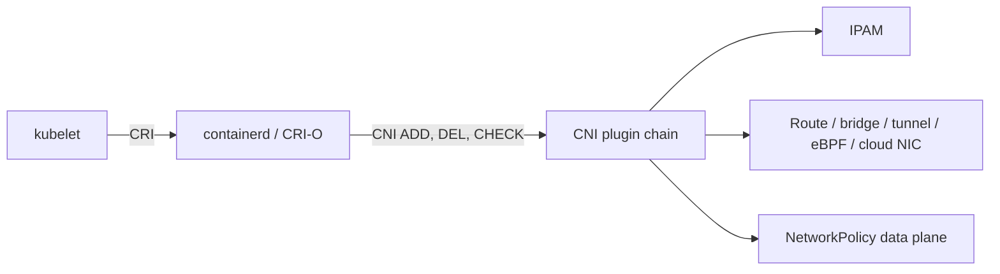
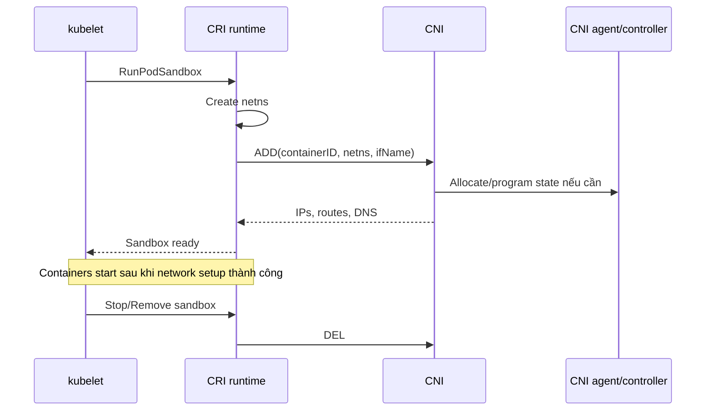

# Container Network Interface

## Mục lục

- [Tổng quan](#tổng-quan)
- [1. CNI là specification, không phải một sản phẩm](#1-cni-là-specification-không-phải-một-sản-phẩm)
- [2. CNI nằm ở đâu trong Pod lifecycle](#2-cni-nằm-ở-đâu-trong-pod-lifecycle)
- [3. Input và output của một lần gọi CNI](#3-input-và-output-của-một-lần-gọi-cni)
- [4. ADD, DEL và CHECK](#4-add-del-và-check)
- [5. CNI configuration và plugin chain](#5-cni-configuration-và-plugin-chain)
- [6. IPAM](#6-ipam)
- [7. Các data-plane model phổ biến](#7-các-data-plane-model-phổ-biến)
- [8. CNI và NetworkPolicy](#8-cni-và-networkpolicy)
- [9. CNI và kube-proxy replacement](#9-cni-và-kube-proxy-replacement)
- [10. Tiêu chí chọn CNI](#10-tiêu-chí-chọn-cni)
- [11. Installation và upgrade](#11-installation-và-upgrade)
- [12. Security và quyền đặc biệt](#12-security-và-quyền-đặc-biệt)
- [13. Observability và capacity](#13-observability-và-capacity)
- [14. Troubleshooting](#14-troubleshooting)
- [15. Thực hành inventory CNI](#15-thực-hành-inventory-cni)
- [16. Best practices](#16-best-practices)
- [Tài liệu tham khảo](#tài-liệu-tham-khảo)

---

## Tổng quan

Container Network Interface (CNI) là specification mô tả cách container runtime gọi plugin để cấu hình network cho container/sandbox. Trong Kubernetes, runtime dùng CNI để hiện thực phần Pod networking của [Kubernetes Networking Model](/networking/networking-model/).



> [!IMPORTANT]
> Kubernetes API chấp nhận NetworkPolicy ngay cả khi CNI không enforce policy. Việc object tồn tại không chứng minh traffic đã bị giới hạn.

## 1. CNI là specification, không phải một sản phẩm

Phân biệt:

- **CNI specification**: protocol, command, environment variable, stdin JSON và result format.
- **CNI plugin binary**: executable hiện thực thao tác như bridge, loopback, portmap, bandwidth, IPAM.
- **Kubernetes network solution**: một hệ thống có agent/controller/operator, có thể dùng nhiều CNI binary và quản lý route/policy/observability.

Kubernetes yêu cầu plugin tương thích CNI v0.4.0 trở lên và khuyến nghị tương thích v1.0.0 trở lên. Chọn version theo Kubernetes distribution, runtime và vendor support matrix.

## 2. CNI nằm ở đâu trong Pod lifecycle

Kubelet không trực tiếp chạy CNI ở Kubernetes hiện đại. Kubelet gọi runtime qua CRI; runtime quản lý CNI configuration và gọi plugin.



Từ Kubernetes 1.24, các kubelet flag cũ như `--network-plugin` và `--cni-bin-dir` đã bị loại bỏ; runtime chịu trách nhiệm CNI integration.

## 3. Input và output của một lần gọi CNI

Runtime truyền command qua environment và configuration qua stdin. Các biến conceptually quan trọng:

| Input | Ý nghĩa |
|---|---|
| `CNI_COMMAND` | `ADD`, `DEL`, `CHECK`, `VERSION`, tùy plugin/spec |
| `CNI_CONTAINERID` | ID duy nhất của sandbox/container |
| `CNI_NETNS` | Path tới network namespace |
| `CNI_IFNAME` | Tên interface trong namespace, thường `eth0` |
| `CNI_PATH` | Nơi tìm plugin executable |
| `CNI_ARGS` | Tham số bổ sung |
| stdin JSON | Network name, CNI version, plugin-specific config, capabilities |

Result thường chứa:

- Interface.
- IP address và prefix.
- Gateway.
- Route.
- DNS settings.
- Result từ plugin trước trong chain (`prevResult`).

Application operator không thường gọi CNI bằng tay. Gọi sai có thể cấp trùng IP hoặc tạo stale interface.

## 4. ADD, DEL và CHECK

### 4.1 `ADD`

Plugin phải tạo network state cho sandbox và trả result. Một `ADD` thành công có thể gồm:

1. Cấp IP.
2. Tạo veth/interface.
3. Chuyển interface vào netns.
4. Cấu hình address, route, gateway.
5. Program host route/tunnel/eBPF map.
6. Áp policy ban đầu.

Runtime chỉ nên coi sandbox network-ready khi toàn chain thành công.

### 4.2 `DEL`

`DEL` dọn interface, route, allocation và plugin state. Nó cần có tính idempotent ở mức phù hợp: cleanup lại một sandbox đã mất netns không nên làm hỏng IP của Pod khác.

Node crash tạo tình huống `DEL` không chạy; vì vậy network solution production cần reconciliation/garbage collection.

### 4.3 `CHECK`

`CHECK` xác minh network state so với expected configuration nếu plugin hỗ trợ. Không phải mọi runtime/workflow đều gọi nó thường xuyên; monitoring riêng vẫn cần thiết.

### 4.4 Partial failure trong plugin chain

Nếu plugin thứ ba lỗi sau khi hai plugin đầu đã tạo state, runtime/plugin phải rollback hoặc `DEL`. Stale state là nguồn của:

- IPAM leak.
- Portmap rule còn sót.
- Interface orphan.
- Pod mới nhận IP nhưng route trỏ sai.

## 5. CNI configuration và plugin chain

Runtime thường đọc config từ directory như `/etc/cni/net.d` và binary từ `/opt/cni/bin`; đường dẫn thực tế tùy distribution/runtime.

### 5.1 Một plugin

Ví dụ minh họa, không phải cấu hình production chung cho mọi cluster:

```json
{
  "cniVersion": "1.0.0",
  "name": "pod-network",
  "type": "bridge",
  "bridge": "cni0",
  "isGateway": true,
  "ipMasq": true,
  "ipam": {
    "type": "host-local",
    "subnet": "10.244.1.0/24",
    "routes": [{ "dst": "0.0.0.0/0" }]
  }
}
```

### 5.2 Plugin list

```json
{
  "cniVersion": "1.0.0",
  "name": "pod-network",
  "plugins": [
    {
      "type": "example-primary",
      "ipam": { "type": "host-local", "subnet": "usePodCidr" }
    },
    {
      "type": "portmap",
      "capabilities": { "portMappings": true }
    },
    {
      "type": "bandwidth",
      "capabilities": { "bandwidth": true }
    }
  ]
}
```

Plugin chain chạy `ADD` theo thứ tự và truyền `prevResult`; `DEL` thường được xử lý theo lifecycle của runtime/spec. Không chỉnh file trên một Node duy nhất: configuration drift làm Pod behavior phụ thuộc Node.

### 5.3 Loopback

Mỗi sandbox cần interface `lo`. Runtime hoặc loopback CNI plugin phải cấu hình nó. Nếu loopback down, sidecar/app gọi `localhost` thất bại dù Pod IP vẫn có.

### 5.4 Tính năng plugin cho phép runtime truyền vào

Capability cho runtime truyền dữ liệu theo Pod, ví dụ `portMappings` cho `hostPort`. Plugin phải khai báo và thực hiện; manifest có field không đảm bảo CNI hỗ trợ.

## 6. IPAM

IP Address Management tránh cấp trùng IP và quản lý vòng đời allocation.

### 6.1 Per-node allocation

Mỗi Node nhận Pod CIDR, rồi `host-local` hoặc agent cấp IP. Scale tốt và ít contention nhưng cần route giữa các Node CIDR.

### 6.2 Cluster-wide pool

Controller/datastore điều phối pool chung. Linh hoạt hơn nhưng control plane IPAM phải HA và xử lý concurrent allocation.

### 6.3 Cloud IPAM

Pod nhận secondary IP hoặc prefix từ cloud NIC/subnet. Cần theo dõi:

- IP còn trống trong subnet.
- ENI/NIC và prefix quota.
- Warm pool.
- Thời gian attach.
- Route/security group behavior.

### 6.4 IP exhaustion

Triệu chứng thường là Pod `ContainerCreating` với `FailedCreatePodSandBox`. Scale Deployment không giúp nếu IP pool cạn.

Capacity planning:

```text
usable Pod IP
- IP dành cho system/upgrade surge
- headroom khi Node drain
- maxUnavailable/maxSurge rollout
- DaemonSet overhead
= application capacity an toàn
```

## 7. Các data-plane model phổ biến

| Model | Cách chuyển packet cross-node | Điểm cần đánh giá |
|---|---|---|
| Overlay | Encapsulate trong VXLAN/Geneve... | MTU, tunnel health, CPU |
| Native routing/BGP | Quảng bá route Pod CIDR | Route scale, peer health, underlay control |
| Cloud VPC-native | Pod IP từ VPC/subnet | IP quota, NIC limit, provider coupling |
| eBPF | Program kernel hook/map | Kernel compatibility, map pressure, tooling |
| Hybrid | Kết hợp theo environment | Operational complexity |

Tên sản phẩm không đủ để kết luận model; cùng một solution có nhiều mode.

## 8. CNI và NetworkPolicy

NetworkPolicy controller/data plane thường nằm trong network solution. Khi Pod được tạo:

- Isolation rule cần có trước hoặc sát lúc container start theo conformance.
- Allow rule có thể hội tụ sau, tạo khoảng ngắn Pod chưa kết nối được.
- Policy update là eventual convergence trên nhiều Node.

Đánh giá support cho:

- Ingress và egress.
- `ipBlock` + `except`.
- Named port.
- `endPort`.
- IPv6/dual-stack.
- SCTP nếu dùng.
- Policy log/flow visibility ngoài API chuẩn.
- `hostNetwork` semantics.

Xem [NetworkPolicy](/networking/network-policy/) để viết policy đúng additive model.

## 9. CNI và kube-proxy replacement

Một số CNI có thể hiện thực Service routing thay kube-proxy bằng eBPF hoặc data plane riêng. Khi bật replacement:

- Xác minh support ClusterIP, NodePort, LoadBalancer, session affinity, traffic policy và dual-stack.
- Không dùng runbook chỉ dựa vào `iptables-save`.
- Xác định source of truth và metric của replacement.
- Có kế hoạch migration/rollback; hai service proxy cùng program data plane có thể xung đột.

Kube-proxy vắng mặt không đồng nghĩa Service không hoạt động.

## 10. Tiêu chí chọn CNI

### 10.1 Functional

- NetworkPolicy cần L3/L4 hay extension L7/FQDN?
- IPv6/dual-stack có bắt buộc?
- Encryption node-to-node hoặc workload-to-workload?
- Multi-network/Multus?
- Windows Node?
- Kube-proxy replacement?
- Egress gateway/fixed egress IP?

### 10.2 Environment

- Managed Kubernetes hỗ trợ mode nào?
- Kernel, OS và runtime version?
- VPC route, subnet IP và quota?
- Bare-metal BGP có được network team hỗ trợ?
- MTU xuyên VPN/peering?

### 10.3 Operations

- Upgrade có zero-downtime không?
- Flow log và packet tracing tốt đến đâu?
- Metric, alert và support lifecycle?
- Blast radius khi agent/controller lỗi?
- Scale đã được test với số Node/Pod/Service thực tế?

### 10.4 Security

- Privilege của DaemonSet.
- Supply-chain/signature/SBOM.
- Secret/credential cloud cần dùng.
- Policy default và fail-open/fail-closed khi agent lỗi.
- API/RBAC scope.

> [!TIP]
> Dùng proof-of-concept tái hiện cross-node, rollout, policy, Node drain, IP exhaustion và upgrade. Benchmark throughput đơn lẻ không phản ánh khả năng vận hành.

## 11. Installation và upgrade

CNI thường gồm CRD, controller/operator và DaemonSet agent. Trình tự phụ thuộc vendor; luôn theo tài liệu đúng version.

Trước upgrade:

```bash
kubectl get node
kubectl get pod -n kube-system -o wide
kubectl get daemonset -n kube-system
kubectl get crd | grep -iE 'network|cni|policy'
```

Checklist:

1. Kiểm tra Kubernetes/runtime/kernel support matrix.
2. Backup manifest/config và custom resource.
3. Đọc breaking changes, CRD conversion và data-plane migration.
4. Canary trên staging hoặc nhóm Node nhỏ nếu support.
5. Test Pod create/delete, cross-node, Service, DNS, policy và egress.
6. Theo dõi agent unavailable, IPAM error, dropped flow và latency.
7. Xác nhận rollback có thực sự được support; data format mới có thể không downgrade được.

Không thay CNI như thay Deployment thông thường. CNI lỗi có thể ngăn mọi Pod mới tạo network và làm cluster mất kết nối.

## 12. Security và quyền đặc biệt

CNI agent thường cần `privileged`, host network, host PID hoặc mount `/sys`, `/proc`, `/opt/cni/bin`, `/etc/cni/net.d`. Đây là quyền có blast radius cấp Node.

Giảm rủi ro:

- Pin image digest/version.
- Hạn chế registry và admission policy.
- Giới hạn RBAC đúng resource cần watch.
- Bảo vệ Node filesystem.
- Audit thay đổi ConfigMap/CRD/operator.
- Không cho application team sửa CNI configuration.
- Phân tách quyền đọc flow log có payload/metadata nhạy cảm.

## 13. Observability và capacity

Theo dõi ít nhất:

| Nhóm | Tín hiệu |
|---|---|
| Agent health | DaemonSet desired/ready, restart, Node thiếu agent |
| Pod setup | CNI ADD latency/error, sandbox creation failure |
| IPAM | Pool utilization, allocation/release error, stale allocation |
| Data plane | Drop count, route/tunnel/BGP peer, eBPF map pressure |
| Policy | Rule programming latency/error, denied flow |
| Performance | Packet loss, latency cross-node, throughput, conntrack |

Baseline theo Node/zone giúp nhận ra lỗi chỉ xảy ra trên một failure domain.

## 14. Troubleshooting

### 14.1 `NetworkPluginNotReady`

```bash
kubectl describe node NODE_NAME
kubectl get pod -n kube-system -o wide
```

Kiểm tra CNI config chưa được cài, agent chưa ready hoặc runtime không load được config.

### 14.2 `FailedCreatePodSandBox`

```bash
kubectl describe pod POD_NAME -n NAMESPACE
kubectl get events -n NAMESPACE --sort-by=.lastTimestamp
```

Đọc nguyên văn error. Nhóm nguyên nhân:

- Không tìm thấy plugin binary.
- Config JSON invalid/incompatible version.
- IPAM timeout/exhaustion.
- Không tạo được veth/route.
- Agent socket/API unavailable.
- Cloud API quota/permission.

### 14.3 Pod cũ chạy, Pod mới không tạo được

Đây thường là setup/IPAM/control-plane CNI issue, không phải toàn bộ data plane. Không xóa hàng loạt Pod đang chạy vì có thể không tạo lại được.

### 14.4 Pod có IP nhưng cross-node fail

Kiểm tra route/tunnel/BGP, firewall Node-to-Node, MTU và agent ở cả source lẫn destination Node.

### 14.5 Policy object không có tác dụng

Xác minh CNI hỗ trợ NetworkPolicy và controller/agent đã nhận object. Test bằng connection mới; existing connection behavior có thể implementation-defined.

### 14.6 IP leak

Đối chiếu Pod đang tồn tại với allocation store bằng tool được vendor support. Không xóa file IPAM thủ công khi chưa cordon Node và hiểu ownership.

### 14.7 Log ở đâu?

Tên label/container khác nhau theo solution:

```bash
kubectl get daemonset -A
kubectl get pod -A -o wide | grep -iE 'cni|network|calico|cilium|flannel|weave'
kubectl logs -n NAMESPACE POD_NAME -c CONTAINER_NAME --since=15m
```

Trên Node, dùng `journalctl -u containerd` hoặc `journalctl -u crio` theo runtime vì runtime là bên gọi CNI.

## 15. Thực hành inventory CNI

Không thay đổi cluster; chỉ thu thập inventory:

```bash
kubectl get nodes -o wide
kubectl get daemonset -A
kubectl get pod -A -o wide
kubectl get networkpolicy -A
kubectl get events -A --sort-by=.lastTimestamp | tail -n 50
```

Nếu có quyền Node, kiểm tra runtime và CNI path **read-only**:

```bash
sudo ls -la /etc/cni/net.d
sudo ls -la /opt/cni/bin
sudo sed -n '1,240p' /etc/cni/net.d/*
sudo journalctl -u containerd --since '30 minutes ago' | grep -i cni
```

Ghi lại:

- Network solution và version.
- Data-plane mode.
- IPAM mode/pool.
- Pod MTU.
- Policy support.
- kube-proxy hay replacement.
- Upgrade owner và runbook.

Đường dẫn có thể khác; dùng runtime/distribution docs làm nguồn chính.

## 16. Best practices

- Pin CNI version theo support matrix của Kubernetes, OS, kernel và runtime.
- Quản lý CNI bằng automation/GitOps dành cho platform, không sửa từng Node.
- Reserve IP headroom cho rollout, autoscaling và Node drain.
- Alert sớm IPAM utilization, agent unavailable và CNI ADD error.
- Test NetworkPolicy thật bằng traffic, không chỉ kiểm tra object.
- Hiểu route model và MTU trước khi kết nối VPN/peering.
- Không xóa Pod đang chạy hàng loạt khi Pod mới gặp sandbox error.
- Dùng vendor-supported diagnostics trước khi sửa route/eBPF/iptables thủ công.
- Thiết kế upgrade và rollback như thay đổi hạ tầng cấp cluster.
- Document rõ component nào sở hữu Service routing nếu không dùng kube-proxy.

Tiếp tục với [Service](/networking/service/) để hiểu cách Kubernetes tạo endpoint ổn định trên Pod network.

---

## Tài liệu tham khảo

- [Network Plugins](https://kubernetes.io/docs/concepts/extend-kubernetes/compute-storage-net/network-plugins/)
- [CNI Specification](https://github.com/containernetworking/cni/blob/main/SPEC.md)
- [CNI Plugins](https://github.com/containernetworking/plugins)
