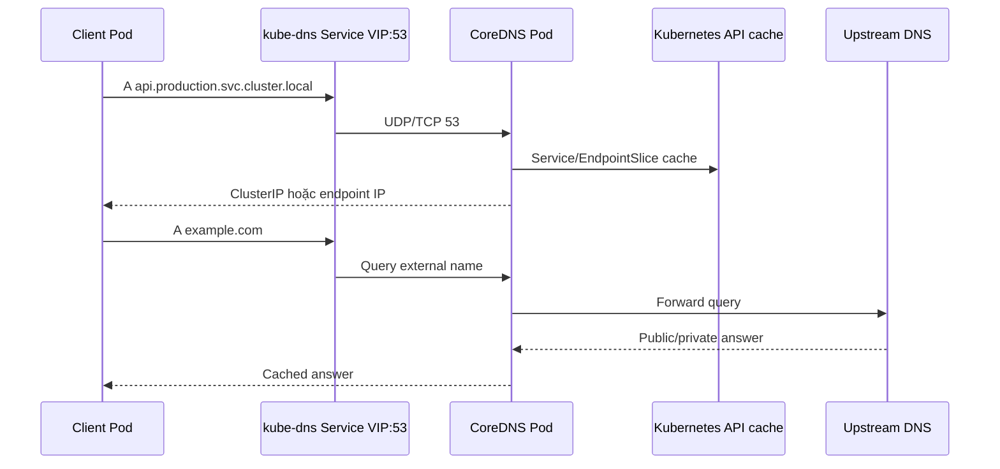

# DNS và CoreDNS

## Mục lục

- [Tổng quan](#tổng-quan)
- [1. DNS query flow trong Kubernetes](#1-dns-query-flow-trong-kubernetes)
- [2. Service DNS records](#2-service-dns-records)
- [3. Pod hostname và DNS records](#3-pod-hostname-và-dns-records)
- [4. resolv.conf, search path và ndots](#4-resolvconf-search-path-và-ndots)
- [5. dnsPolicy](#5-dnspolicy)
- [6. dnsConfig](#6-dnsconfig)
- [7. CoreDNS architecture và Corefile](#7-coredns-architecture-và-corefile)
- [8. Cache, load và latency](#8-cache-load-và-latency)
- [9. NetworkPolicy cho DNS](#9-networkpolicy-cho-dns)
- [10. Production design](#10-production-design)
- [11. Thực hành](#11-thực-hành)
- [12. Troubleshooting theo layer](#12-troubleshooting-theo-layer)
- [13. Best practices](#13-best-practices)
- [Tài liệu tham khảo](#tài-liệu-tham-khảo)

---

## Tổng quan

Kubernetes DNS cung cấp tên ổn định cho Service và một số Pod identity. CoreDNS thường chạy dưới dạng Deployment trong `kube-system`, đứng sau Service tên `kube-dns` để giữ compatibility.



DNS failure có blast radius lớn: application thường báo database/API timeout dù network path tới IP vẫn hoạt động.

## 1. DNS query flow trong Kubernetes

1. kubelet tạo `/etc/resolv.conf` cho Pod theo `dnsPolicy` và `dnsConfig`.
2. Resolver library trong process mở rộng short name bằng search suffix.
3. Query gửi tới ClusterIP của `kube-dns` Service, thường UDP 53.
4. Service proxy chọn CoreDNS endpoint.
5. Plugin `kubernetes` trả record cluster hoặc `forward` gửi query ngoài cluster.
6. `cache` lưu kết quả theo TTL.

Mỗi bước có thể lỗi riêng. `nslookup ClusterIP` thành công không chứng minh upstream external DNS hoạt động, và ngược lại.

## 2. Service DNS records

Giả sử cluster domain là `cluster.local`, Service `api` trong Namespace `production`.

### 2.1 Normal Service

```text
api.production.svc.cluster.local. A/AAAA → Service ClusterIP
```

Từ Pod cùng Namespace, `api` được search path mở rộng. Từ Namespace khác, dùng `api.production` hoặc FQDN.

### 2.2 Headless Service

Với `clusterIP: None`:

```text
api.production.svc.cluster.local. A/AAAA → tập endpoint IP
```

Không có Service VIP. Client/resolver quyết định address nào được dùng và khi nào resolve lại.

### 2.3 SRV record

Named Service port tạo SRV:

```yaml
ports:
  - name: grpc
    protocol: TCP
    port: 50051
```

Query:

```text
_grpc._tcp.api.production.svc.cluster.local
```

SRV trả port và target name. Với headless Service, có thể trả target theo từng Pod hostname.

### 2.4 ExternalName

CoreDNS trả CNAME tới `.spec.externalName`. Không có proxy hoặc health check. HTTP Host/TLS SNI mismatch vẫn có thể xảy ra.

## 3. Pod hostname và DNS records

Mặc định hostname trong Pod là `metadata.name`.

```bash
kubectl exec POD_NAME -- hostname
kubectl exec POD_NAME -- hostname --fqdn
```

Pod có thể đặt:

```yaml
spec:
  hostname: db-0
  subdomain: database
```

Nếu có headless Service `database` cùng Namespace, FQDN:

```text
db-0.database.production.svc.cluster.local
```

Pod thường phải Ready để record cá nhân được publish, trừ khi Service dùng `publishNotReadyAddresses: true`.

### 3.1 `setHostnameAsFQDN`

```yaml
spec:
  setHostnameAsFQDN: true
```

Kernel hostname trở thành FQDN. Trên Linux hostname kernel tối đa 64 ký tự; FQDN dài làm Pod kẹt `ContainerCreating` với Event rõ ràng. Kiểm soát độ dài workload name, Namespace, subdomain và cluster domain.

### 3.2 Không dựa vào Pod A record implementation-specific

Một số dạng record dựa trên Pod IP có thể được CoreDNS support, nhưng chỉ layout trong Kubernetes DNS specification mới là contract. Dùng Service/headless Service thay vì suy đoán tên từ Pod IP.

## 4. resolv.conf, search path và ndots

Ví dụ trong Pod:

```text
nameserver 10.96.0.10
search production.svc.cluster.local svc.cluster.local cluster.local
options ndots:5
```

### 4.1 Search expansion

Query `api` có thể thử:

```text
api.production.svc.cluster.local
api.svc.cluster.local
api.cluster.local
api
```

Query `api.other` chứa một dấu chấm vẫn nhỏ hơn `ndots:5`, nên resolver có thể thử nhiều suffix trước khi query absolute name.

### 4.2 Absolute FQDN có dấu chấm cuối

```text
api.production.svc.cluster.local.
```

Dấu `.` cuối nói đây là absolute DNS name, tránh search expansion. Nhiều application URL parser không quen trailing dot hoặc TLS hostname behavior khác; kiểm thử trước khi dùng.

### 4.3 `ndots:5` và query amplification

External name như `api.example.com` có hai dấu chấm, nhỏ hơn 5. Resolver có thể thử nhiều cluster suffix, gây NXDOMAIN query và latency trước khi hỏi tên absolute.

Giải pháp tùy workload:

- Dùng FQDN có dấu chấm cuối khi application hỗ trợ.
- Điều chỉnh `dnsConfig.options.ndots` cho Pod có profile rõ.
- Cache tại application/NodeLocal DNS.
- Không thay `ndots` toàn cluster mà chưa đo compatibility.

### 4.4 Search list limit

Kubernetes giới hạn tối đa 32 search domain và tổng chiều dài 2048 ký tự. Runtime cũ có thể có limit thấp hơn.

## 5. dnsPolicy

| Policy | Behavior |
|---|---|
| `ClusterFirst` | Mặc định; cluster names qua CoreDNS, tên ngoài được forward |
| `Default` | Kế thừa resolver config của Node |
| `ClusterFirstWithHostNet` | Cluster DNS cho Pod `hostNetwork` trên Linux |
| `None` | Bỏ config mặc định; bắt buộc tự khai báo `dnsConfig` |

> [!NOTE]
> `Default` không phải giá trị mặc định. Nếu bỏ field, Kubernetes dùng `ClusterFirst`.

Pod host network:

```yaml
spec:
  hostNetwork: true
  dnsPolicy: ClusterFirstWithHostNet
```

Nếu dùng `ClusterFirst` với hostNetwork, behavior có thể fallback như `Default` và không resolve Service như mong đợi.

## 6. dnsConfig

```yaml
spec:
  dnsPolicy: None
  dnsConfig:
    nameservers:
      - 192.0.2.53
    searches:
      - corp.example
    options:
      - name: ndots
        value: "2"
      - name: edns0
```

Field:

- `nameservers`: tối đa 3 IP theo Kubernetes API behavior phổ biến.
- `searches`: suffix bổ sung/thay thế theo policy.
- `options`: resolver option.

`dnsPolicy: None` bỏ cluster DNS trừ khi tự thêm. Điều này có thể làm Service discovery hỏng. Chỉ dùng khi workload cần resolver riêng và đã thiết kế split DNS.

### 6.1 Custom `ndots`

```yaml
spec:
  dnsConfig:
    options:
      - name: ndots
        value: "2"
```

Giảm query cho external FQDN nhưng có thể thay cách resolve tên ngắn có dấu chấm. Test canonical application dependency.

## 7. CoreDNS architecture và Corefile

Xem config:

```bash
kubectl get configmap coredns -n kube-system -o yaml
```

Corefile điển hình:

```text
.:53 {
    errors
    health
    ready
    kubernetes cluster.local in-addr.arpa ip6.arpa {
        pods insecure
        fallthrough in-addr.arpa ip6.arpa
    }
    prometheus :9153
    forward . /etc/resolv.conf
    cache 30
    loop
    reload
    loadbalance
}
```

### 7.1 Plugin order có ý nghĩa

- `errors`: log error.
- `health`, `ready`: health endpoint.
- `kubernetes`: trả record từ Service/Pod/EndpointSlice cache.
- `prometheus`: metrics.
- `forward`: chuyển query không thuộc cluster tới upstream.
- `cache`: positive/negative cache.
- `loop`: phát hiện forwarding loop.
- `reload`: reload Corefile.
- `loadbalance`: rotate answer order.

Không copy Corefile giữa cluster/version mà không hiểu plugin support và provider stub domain.

### 7.2 RBAC

CoreDNS cần `list/watch` Service, Namespace, Pod và EndpointSlice. Thiếu RBAC có thể trả `SERVFAIL` dù Pod CoreDNS Running.

```bash
kubectl describe clusterrole system:coredns
```

### 7.3 Upstream resolver

`forward . /etc/resolv.conf` dùng resolver config trong CoreDNS Pod, thường bắt nguồn từ Node. `systemd-resolved` stub sai có thể tạo forwarding loop. kubelet `resolvConf` phải trỏ file upstream thật, thường `/run/systemd/resolve/resolv.conf` trên hệ dùng systemd-resolved.

## 8. Cache, load và latency

Nguồn load:

- Số Pod/QPS.
- `ndots` search amplification.
- Application không cache.
- Negative lookup liên tục.
- Endpoint churn.
- Upstream DNS chậm.
- UDP response lớn fallback TCP.

Theo dõi CoreDNS metrics trên `:9153`, ví dụ query count, response code, request duration, cache hit và forward health theo version.

### 8.1 Scale CoreDNS

Scale replica và spread qua Node/zone:

```bash
kubectl scale deployment coredns -n kube-system --replicas=3
```

Trong managed cluster, autoscaler/operator có thể sở hữu replica; sửa trực tiếp có thể bị revert.

### 8.2 NodeLocal DNSCache

NodeLocal DNSCache chạy cache trên mỗi Node, giảm conntrack/UDP và latency tới CoreDNS. Nó thêm component cần monitor và cấu hình khác theo iptables/IPVS/nftables/provider. Chỉ bật theo distribution guide.

### 8.3 Negative caching

NXDOMAIN cũng được cache. Sau khi tạo Service vừa bị query sai trước đó, client có thể tạm tiếp tục thấy NXDOMAIN theo TTL/cache nhiều lớp.

## 9. NetworkPolicy cho DNS

Default-deny egress chặn DNS nếu không allow TCP và UDP 53.

Policy minh họa theo Namespace label chuẩn và Pod label của DNS; label thực tế cần xác minh:

```yaml
apiVersion: networking.k8s.io/v1
kind: NetworkPolicy
metadata:
  name: allow-cluster-dns
  namespace: application
spec:
  podSelector: {}
  policyTypes: [Egress]
  egress:
    - to:
        - namespaceSelector:
            matchLabels:
              kubernetes.io/metadata.name: kube-system
          podSelector:
            matchLabels:
              k8s-app: kube-dns
      ports:
        - protocol: UDP
          port: 53
        - protocol: TCP
          port: 53
```

CNI enforce trước hay sau Service DNAT khác nhau theo implementation. Một số môi trường cần allow DNS Service ClusterIP bằng `ipBlock`, số khác match CoreDNS Pod. Test trên CNI thật.

Tại sao cả UDP và TCP? DNS thường dùng UDP, nhưng response truncated/large hoặc một số query cần fallback TCP.

## 10. Production design

- Có ít nhất hai CoreDNS replica khi cluster đủ Node.
- Spread replica qua Node/zone và dùng priority phù hợp cho system-critical component.
- Đặt resource requests/limits dựa trên QPS; tránh CPU throttling làm tăng DNS tail latency.
- Theo dõi SERVFAIL, NXDOMAIN ratio, forward latency và saturation.
- Quản lý Corefile qua platform source of truth.
- Thiết kế private zone/stub domain rõ ràng.
- Load test DNS trước large-scale rollout.
- Cân nhắc NodeLocal DNSCache cho cluster lớn.
- Bảo vệ CoreDNS RBAC và ConfigMap.

## 11. Thực hành

Tạo Service normal, headless và client:

```yaml
apiVersion: v1
kind: Namespace
metadata:
  name: dns-lab
---
apiVersion: apps/v1
kind: Deployment
metadata:
  name: web
  namespace: dns-lab
spec:
  replicas: 2
  selector:
    matchLabels:
      app: web
  template:
    metadata:
      labels:
        app: web
    spec:
      containers:
        - name: web
          image: nginx:1.27-alpine
          ports:
            - name: http
              containerPort: 80
---
apiVersion: v1
kind: Service
metadata:
  name: web
  namespace: dns-lab
spec:
  selector:
    app: web
  ports:
    - name: http
      port: 80
      targetPort: http
---
apiVersion: v1
kind: Service
metadata:
  name: web-headless
  namespace: dns-lab
spec:
  clusterIP: None
  selector:
    app: web
  ports:
    - name: http
      port: 80
      targetPort: http
```

```bash
kubectl apply -f dns-lab.yaml
kubectl run dnsutils -n dns-lab \
  --image=registry.k8s.io/e2e-test-images/agnhost:2.53 \
  --command -- sleep 3600
kubectl wait -n dns-lab --for=condition=Ready pod/dnsutils --timeout=120s
```

Kiểm tra:

```bash
kubectl exec -n dns-lab dnsutils -- cat /etc/resolv.conf
kubectl exec -n dns-lab dnsutils -- nslookup web
kubectl exec -n dns-lab dnsutils -- nslookup web.dns-lab.svc.cluster.local
kubectl exec -n dns-lab dnsutils -- nslookup web-headless
kubectl exec -n dns-lab dnsutils -- \
  nslookup -type=SRV _http._tcp.web.dns-lab.svc.cluster.local
```

So sánh answer normal Service với ClusterIP và headless với Pod IP:

```bash
kubectl get svc,pod -n dns-lab -o wide
```

Cleanup:

```bash
kubectl delete namespace dns-lab
rm -f dns-lab.yaml
```

## 12. Troubleshooting theo layer

### 12.1 Kiểm tra từ cùng Pod bị lỗi

```bash
kubectl exec -n NS POD -- cat /etc/resolv.conf
kubectl exec -n NS POD -- nslookup kubernetes.default
kubectl exec -n NS POD -- nslookup SERVICE.NAMESPACE
kubectl exec -n NS POD -- nslookup example.com
```

Tách cluster name và external name.

### 12.2 Kiểm tra DNS Service và endpoint

```bash
kubectl get svc kube-dns -n kube-system
kubectl get endpointslice -n kube-system \
  -l kubernetes.io/service-name=kube-dns -o wide
```

Không có endpoint → CoreDNS readiness/selector. Có endpoint nhưng VIP fail → service proxy/policy.

### 12.3 Kiểm tra CoreDNS Pod/log

```bash
kubectl get pod -n kube-system -l k8s-app=kube-dns -o wide
kubectl logs -n kube-system -l k8s-app=kube-dns --since=10m
```

Tìm `SERVFAIL`, `plugin/loop`, timeout upstream, permission denied.

### 12.4 Sai Namespace

Short name chỉ tìm Namespace của client. Dùng `service.namespace` hoặc FQDN.

### 12.5 Cluster name được, external name không được

CoreDNS Kubernetes plugin hoạt động; kiểm tra `forward`, Node resolver, upstream firewall TCP/UDP 53, private DNS route và timeout.

### 12.6 External được, Service name không được

Kiểm tra plugin `kubernetes`, RBAC list/watch Service/EndpointSlice, cluster domain mismatch và Service tồn tại đúng Namespace.

### 12.7 Chỉ image Alpine cũ lỗi

Alpine 3.17 trở xuống có musl DNS limitation liên quan TCP fallback cho response lớn. Nâng image Alpine 3.18+ thay vì chỉnh cluster để che lỗi client cũ.

### 12.8 DNS timeout sau default-deny

Allow cả UDP/TCP 53 và xác minh CNI policy semantics qua Service VIP/Pod IP.

### 12.9 Query chậm nhưng thành công

Đo từng query, kiểm tra `ndots`, search suffix, NXDOMAIN trước answer, CoreDNS CPU throttling, cache hit và upstream latency.

## 13. Best practices

- Dùng FQDN có Namespace cho dependency cross-namespace.
- Không hard-code `cluster.local`; cluster domain có thể khác nếu viết reusable software.
- Giữ named Service port để có SRV record khi protocol dùng được.
- Allow DNS qua cả UDP và TCP trong egress policy.
- Không tùy chỉnh `ndots` nếu chưa đo query pattern và test application.
- Scale/spread CoreDNS và đặt resource request phù hợp.
- Theo dõi DNS response code, latency, cache và forward error.
- Quản lý Corefile bằng source of truth; tránh edit production không audit.
- Xác minh CoreDNS RBAC với EndpointSlice.
- Tách lỗi Service discovery khỏi upstream public/private DNS.
- Cân nhắc NodeLocal DNSCache khi load/conntrack yêu cầu.
- Tránh tên/FQDN Pod vượt giới hạn hostname kernel khi dùng `setHostnameAsFQDN`.

Tiếp tục với [Ingress](/networking/ingress/) để expose HTTP(S) Service ra ngoài cluster.

---

## Tài liệu tham khảo

- [DNS for Services and Pods](https://kubernetes.io/docs/concepts/services-networking/dns-pod-service/)
- [Debugging DNS Resolution](https://kubernetes.io/docs/tasks/administer-cluster/dns-debugging-resolution/)
- [CoreDNS Manual](https://coredns.io/manual/toc/)
