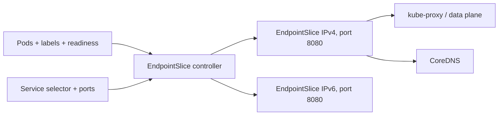
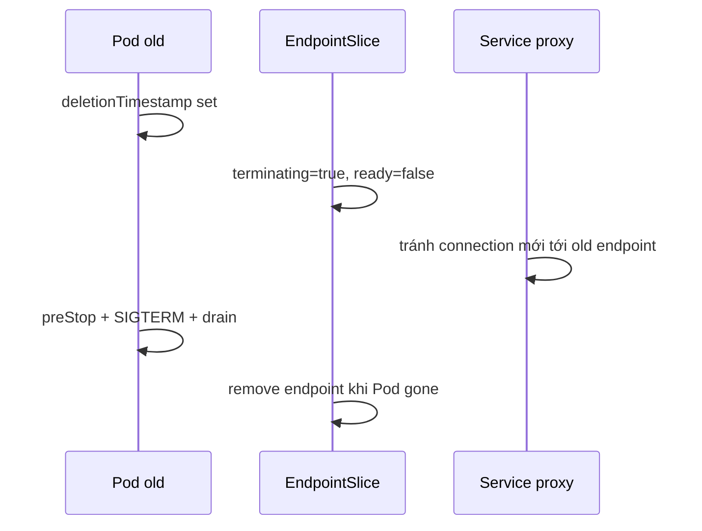

# Endpoints và EndpointSlices

## Mục lục

- [Tổng quan](#tổng-quan)
- [1. Vị trí trong Service flow](#1-vị-trí-trong-service-flow)
- [2. EndpointSlice data model](#2-endpointslice-data-model)
- [3. Cách controller tạo EndpointSlice](#3-cách-controller-tạo-endpointslice)
- [4. Endpoint conditions](#4-endpoint-conditions)
- [5. Scale và slicing](#5-scale-và-slicing)
- [6. Address family, port và topology](#6-address-family-port-và-topology)
- [7. Selectorless Service](#7-selectorless-service)
- [8. Ownership và managed-by](#8-ownership-và-managed-by)
- [9. Endpoints API đã deprecated](#9-endpoints-api-đã-deprecated)
- [10. EndpointSlice consumer phải làm gì?](#10-endpointslice-consumer-phải-làm-gì)
- [11. Thực hành quan sát lifecycle](#11-thực-hành-quan-sát-lifecycle)
- [12. Troubleshooting](#12-troubleshooting)
- [13. Best practices](#13-best-practices)
- [Tài liệu tham khảo](#tài-liệu-tham-khảo)

---

## Tổng quan

EndpointSlice là API `discovery.k8s.io/v1` mô tả các network endpoint đứng sau Service. Đây là nguồn dữ liệu để kube-proxy/service proxy, CoreDNS, Gateway/Ingress controller và service mesh biết backend nào tồn tại.



EndpointSlice không forward packet. Nó là **discovery/control-plane state** để data plane được program.

## 1. Vị trí trong Service flow

Khi tạo Service có selector:

1. API server lưu Service.
2. EndpointSlice controller tìm Pod cùng Namespace match selector.
3. Controller đọc Pod IP, named targetPort, Node/zone và readiness.
4. Controller tạo/cập nhật EndpointSlice.
5. Consumers watch slice và cập nhật routing/DNS.

```bash
kubectl get endpointslice -n production \
  -l kubernetes.io/service-name=api
```

> [!IMPORTANT]
> `kubectl get pods` thấy Pod Running không có nghĩa Pod là ready endpoint. Kiểm tra `READY`, readiness condition và EndpointSlice conditions.

## 2. EndpointSlice data model

Ví dụ:

```yaml
apiVersion: discovery.k8s.io/v1
kind: EndpointSlice
metadata:
  name: api-x7r9k
  namespace: production
  labels:
    kubernetes.io/service-name: api
    endpointslice.kubernetes.io/managed-by: endpointslice-controller.k8s.io
  ownerReferences:
    - apiVersion: v1
      kind: Service
      name: api
      uid: 11111111-2222-3333-4444-555555555555
addressType: IPv4
ports:
  - name: http
    protocol: TCP
    port: 8080
    appProtocol: http
endpoints:
  - addresses: ["10.244.1.12"]
    conditions:
      ready: true
      serving: true
      terminating: false
    nodeName: worker-1
    zone: zone-a
    targetRef:
      kind: Pod
      name: api-7d9f8c6b5-x1
      namespace: production
```

Các field chính:

| Field | Vai trò |
|---|---|
| `metadata.labels[kubernetes.io/service-name]` | Liên kết slice với Service |
| `addressType` | `IPv4`, `IPv6` |
| `ports` | Port áp dụng cho mọi endpoint trong slice |
| `endpoints[].addresses` | IP endpoint |
| `conditions` | Traffic eligibility/lifecycle |
| `nodeName`, `zone` | Locality/topology |
| `targetRef` | Object backend, thường Pod |
| `managed-by` | Controller/entity sở hữu slice |

## 3. Cách controller tạo EndpointSlice

### 3.1 Selector phải match

```yaml
# Service
selector:
  app: api
  track: stable
```

Chỉ Pod trong cùng Namespace có cả hai label được xét. Service selector không chọn cross-namespace Pod.

### 3.2 Named targetPort phải resolve

Service:

```yaml
ports:
  - name: http
    port: 80
    targetPort: web
```

Pod:

```yaml
ports:
  - name: web
    containerPort: 8080
```

Nếu Pod thiếu named port `web`, endpoint cho port đó không được tạo đúng như mong đợi. Kiểm tra slice thay vì chỉ nhìn selector.

### 3.3 Port khác nhau tạo grouping khác

Hai Pod có cùng named port nhưng map tới số khác có thể nằm ở slice khác vì `ports` áp dụng cho toàn slice.

### 3.4 `publishNotReadyAddresses`

Khi Service đặt field này `true`, controller coi endpoint được publish bất kể readiness cho discovery use case. Điều này hữu ích cho peer bootstrap, nhưng client nhận endpoint chưa phục vụ được.

## 4. Endpoint conditions

### 4.1 `serving`

Cho biết endpoint hiện có khả năng phục vụ; với Pod thường map từ Ready condition.

### 4.2 `terminating`

`true` khi Pod có deletion timestamp. Nó cho consumer biết backend đang drain/exit.

### 4.3 `ready`

Thông thường là shorthand của:

```text
serving == true AND terminating == false
```

Với `publishNotReadyAddresses: true`, ready semantics được điều chỉnh để publish endpoint.

### 4.4 Rollout flow



Kube-proxy có thể route tới terminating endpoint trong trường hợp đặc biệt khi traffic policy Local và mọi local endpoint đều terminating, nhằm hỗ trợ graceful drain. Không dựa vào chi tiết này thay cho termination design đúng.

## 5. Scale và slicing

Mặc định control plane giữ tối đa khoảng 100 endpoint mỗi slice; cluster admin có thể cấu hình `--max-endpoints-per-slice` tối đa 1000.

Tại sao không một object lớn?

- Update nhỏ không phải truyền toàn bộ danh sách backend.
- Watch event nhỏ hơn.
- Hỗ trợ Service hàng nghìn endpoint.
- Tách IPv4/IPv6 và tổ hợp port.

### 5.1 Không luôn pack đầy

Controller ưu tiên giảm số object update hơn là pack slice hoàn hảo. Ví dụ có hai slice còn trống nhưng thêm endpoint vào cả hai tạo hai update; controller có thể tạo một slice mới để chỉ phát một event.

Do đó số slice nhiều hơn `ceil(endpoint/100)` không nhất thiết là lỗi.

### 5.2 Watch fan-out cost

Mỗi thay đổi EndpointSlice có thể được gửi tới service proxy trên mọi Node và nhiều controller khác. Readiness flapping của hàng nghìn Pod tạo control-plane/data-plane churn lớn.

Tối ưu health probe để tránh flapping, không chỉ tăng slice size.

## 6. Address family, port và topology

### 6.1 Address family

Một EndpointSlice chỉ có một `addressType`. Dual-stack Service có ít nhất slice IPv4 và IPv6 nếu có endpoint cả hai family.

### 6.2 Port grouping

Mọi endpoint trong slice dùng cùng danh sách `ports`. Named port khác số giữa Pod version có thể làm slice tách ra.

### 6.3 Topology

`nodeName` và `zone` giúp implementation ưu tiên endpoint gần khi Service dùng traffic distribution. Không chỉnh topology trực tiếp trên controller-managed slice; sửa Node label/scheduling và để controller reconcile.

### 6.4 Hints

EndpointSlice có thể chứa hints phục vụ topology-aware routing. Đây là preference do controller tính, không phải bằng chứng endpoint chỉ được client ở zone đó truy cập.

## 7. Selectorless Service

Khi Service không có selector, Kubernetes không tự tạo EndpointSlice. Platform/controller khác phải tạo:

```yaml
apiVersion: v1
kind: Service
metadata:
  name: external-db
  namespace: application
spec:
  ports:
    - name: postgres
      port: 5432
      targetPort: 5432
---
apiVersion: discovery.k8s.io/v1
kind: EndpointSlice
metadata:
  name: external-db-1
  namespace: application
  labels:
    kubernetes.io/service-name: external-db
    endpointslice.kubernetes.io/managed-by: platform.example/external-service-controller
addressType: IPv4
ports:
  - name: postgres
    protocol: TCP
    port: 5432
endpoints:
  - addresses: ["192.0.2.50"]
    conditions:
      ready: true
```

### 7.1 Validation và limitation

Endpoint IP không được là:

- IPv4 loopback `127.0.0.0/8`.
- IPv6 loopback `::1/128`.
- Link-local.
- ClusterIP của Service khác.

Không dùng EndpointSlice thủ công để chain Service VIP; kube-proxy không support VIP làm destination endpoint.

### 7.2 Health ownership

API server không probe `192.0.2.50`. Nếu đặt `ready: true` thủ công, bạn chịu trách nhiệm health check và update. Controller automation phù hợp hơn manifest tĩnh cho production.

### 7.3 DNS name backend

EndpointSlice address phải phù hợp `addressType`; nó không thay ExternalName cho arbitrary hostname. Nếu backend được nhận diện bằng DNS và IP thay đổi, cần controller resolve/update có thiết kế rõ hoặc để client gọi DNS canonical.

## 8. Ownership và managed-by

Controller-managed slice có ownerReference tới Service và reserved `managed-by` value. Custom controller phải dùng tên có domain, ví dụ:

```yaml
endpointslice.kubernetes.io/managed-by: platform.example/legacy-endpoint-controller
```

Không dùng value `controller`; đây là reserved identity. Không để hai controller cùng sửa một slice.

Một Service có thể có slice do nhiều entity quản lý nếu use case yêu cầu, nhưng consumer sẽ hợp nhất tất cả slice có service-name label. Governance phải tránh duplicate/untrusted endpoint injection.

### 8.1 RBAC risk

Ai có quyền tạo EndpointSlice trong Namespace có thể đưa IP backend vào Service selectorless hoặc ảnh hưởng consumer. Hạn chế `create/update endpointslices` cho controller/operator cần thiết.

## 9. Endpoints API đã deprecated

Core `Endpoints` API deprecated từ Kubernetes v1.33. Hạn chế:

- Không hỗ trợ dual-stack đầy đủ.
- Thiếu topology/traffic distribution metadata mới.
- Một object lớn, scale kém.
- Truncate quá 1000 endpoint và gắn annotation `endpoints.kubernetes.io/over-capacity: truncated`.

EndpointSlice mirroring cho user-created Endpoints cũng deprecated. Controller và tool mới phải watch/write EndpointSlice trực tiếp.

Kiểm tra dependency:

```bash
kubectl api-resources | grep -E '^endpoints|endpointslices'
kubectl get endpoints -A
```

Không kết luận mọi Endpoints object là custom dependency; control plane có thể vẫn phục vụ compatibility. Audit code/controller nào watch API cũ.

## 10. EndpointSlice consumer phải làm gì?

Nếu viết controller/proxy:

1. Watch mọi EndpointSlice match `kubernetes.io/service-name` và Namespace.
2. Hợp nhất endpoint từ tất cả slice.
3. Deduplicate address/port vì duplicate tạm thời có thể xuất hiện trong convergence.
4. Hiểu `ready`, `serving`, `terminating`.
5. Xử lý IPv4/IPv6 riêng.
6. Xử lý slice add/update/delete và relist sau watch disconnect.
7. Không giả định slice luôn đầy hoặc tên cố định.
8. Dùng informer/cache và rate limiting để tránh API overload.

Endpoint có thể xuất hiện tạm ở hai slice do watch event tới khác thời điểm. Consumer không deduplicate có thể over-weight một backend.

## 11. Thực hành quan sát lifecycle

```bash
kubectl create namespace endpoint-lab
kubectl create deployment web -n endpoint-lab --image=nginx:1.27-alpine
kubectl scale deployment web -n endpoint-lab --replicas=3
kubectl expose deployment web -n endpoint-lab --port=80
kubectl rollout status deployment/web -n endpoint-lab
```

Xem slice:

```bash
kubectl get endpointslice -n endpoint-lab \
  -l kubernetes.io/service-name=web -o wide
kubectl get endpointslice -n endpoint-lab \
  -l kubernetes.io/service-name=web -o yaml
```

Watch khi scale:

```bash
kubectl get endpointslice -n endpoint-lab \
  -l kubernetes.io/service-name=web --watch
```

Terminal khác:

```bash
kubectl scale deployment web -n endpoint-lab --replicas=5
kubectl scale deployment web -n endpoint-lab --replicas=2
```

Làm readiness fail có chủ đích bằng cách patch probe không tồn tại:

```bash
kubectl patch deployment web -n endpoint-lab --type=strategic -p '
{"spec":{"template":{"spec":{"containers":[{"name":"nginx","readinessProbe":{"httpGet":{"path":"/missing","port":80},"periodSeconds":2}}]}}}}'
```

Quan sát Pod vẫn Running nhưng endpoint `ready: false`/bị loại khỏi traffic. Khôi phục bằng xóa lab:

```bash
kubectl delete namespace endpoint-lab
```

## 12. Troubleshooting

### 12.1 Không có EndpointSlice

- Service có selector không?
- Có Pod cùng Namespace match không?
- EndpointSlice controller/control plane có healthy không?
- Với selectorless Service, ai có trách nhiệm tạo slice?

### 12.2 Slice tồn tại nhưng `endpoints: []`

```bash
kubectl get svc SERVICE -n NS -o jsonpath='{.spec.selector}{"\n"}'
kubectl get pod -n NS --show-labels
kubectl describe pod POD -n NS
```

Kiểm tra selector và readiness.

### 12.3 Endpoint address đúng nhưng port sai

Đối chiếu Service `targetPort`, Pod named port và process listen. Named port typo là lỗi phổ biến.

### 12.4 Endpoint flapping

Xem readiness probe, application latency, kubelet/Node condition. Flapping làm Service connection chập chờn và tăng API watch churn.

### 12.5 Một số client vẫn gửi tới Pod cũ

Kiểm tra data-plane sync delay, long-lived connection, terminating endpoint behavior và controller cache. EndpointSlice đã đổi không buộc connection hiện có đóng ngay.

### 12.6 Slice thủ công bị xóa/ghi đè

Kiểm tra ownerReference, `managed-by`, GitOps/controller conflict và Service có selector hay không. Không sửa slice do endpoint slice controller quản lý.

### 12.7 Tool chỉ thấy tối đa 1000 backend

Tool/controller có thể đang đọc legacy Endpoints. Migrate sang EndpointSlice.

## 13. Best practices

- Dùng EndpointSlice là API discovery chuẩn; không xây mới trên Endpoints.
- Debug Service bằng slice conditions, port và topology, không chỉ đếm Pod.
- Không chỉnh controller-managed EndpointSlice bằng tay.
- Custom controller phải set `managed-by` duy nhất và ownership rõ.
- Hạn chế RBAC ghi EndpointSlice.
- Tự động health-check endpoint ngoài cluster; không giữ `ready: true` tĩnh.
- Consumer phải aggregate, deduplicate và xử lý watch eventual consistency.
- Tránh readiness flapping; nó gây churn toàn cluster.
- Kiểm thử dual-stack và named port version skew.
- Theo dõi số endpoint/slice, update rate và service proxy sync latency ở scale lớn.

Tiếp tục với [DNS và CoreDNS](/networking/dns-coredns/) để hiểu cách EndpointSlice được chuyển thành DNS record.

---

## Tài liệu tham khảo

- [EndpointSlices](https://kubernetes.io/docs/concepts/services-networking/endpoint-slices/)
- [Service](https://kubernetes.io/docs/concepts/services-networking/service/)
- [EndpointSlice API Reference](https://kubernetes.io/docs/reference/kubernetes-api/service-resources/endpoint-slice-v1/)
