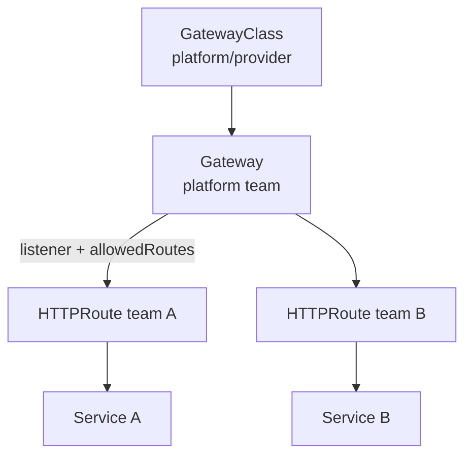

# Gateway API

## Mục lục

- [Tổng quan](#tổng-quan)
- [1. Vì sao Gateway API ra đời?](#1-vì-sao-gateway-api-ra-đời)
- [2. API channels và conformance](#2-api-channels-và-conformance)
- [3. Resource model và ownership](#3-resource-model-và-ownership)
- [4. GatewayClass](#4-gatewayclass)
- [5. Gateway và listener](#5-gateway-và-listener)
- [6. HTTPRoute](#6-httproute)
- [7. GRPCRoute và các Route khác](#7-grpcroute-và-các-route-khác)
- [8. Route attachment và allowedRoutes](#8-route-attachment-và-allowedroutes)
- [9. Cross-namespace backend và ReferenceGrant](#9-cross-namespace-backend-và-referencegrant)
- [10. Matching, filters và traffic splitting](#10-matching-filters-và-traffic-splitting)
- [11. TLS](#11-tls)
- [12. Status và reconciliation](#12-status-và-reconciliation)
- [13. Production governance](#13-production-governance)
- [14. Migration từ Ingress](#14-migration-từ-ingress)
- [15. Thực hành](#15-thực-hành)
- [16. Troubleshooting](#16-troubleshooting)
- [17. Best practices](#17-best-practices)
- [Tài liệu tham khảo](#tài-liệu-tham-khảo)

---

## Tổng quan

Gateway API là family các Kubernetes Custom Resources cho provisioning network infrastructure và routing protocol-aware. Nó là successor của Ingress, thiết kế quanh vai trò và delegation.

Bốn kind stable cốt lõi:

- `GatewayClass`.
- `Gateway`.
- `HTTPRoute`.
- `GRPCRoute`.



> [!IMPORTANT]
> Gateway API không được Kubernetes core tự hiện thực. Cần cài CRD và một Gateway controller/implementation. Tạo resource khi không có controller chỉ tạo desired state không có data plane.

## 1. Vì sao Gateway API ra đời?

Ingress giải quyết HTTP routing cơ bản nhưng nhiều feature phải dùng annotation riêng từng controller. Ownership cũng bị gộp: application developer vừa chọn load balancer class, TLS, listener và route.

Gateway API cải thiện:

- **Role-oriented**: infrastructure, cluster operator và application developer có resource riêng.
- **Expressive**: header/query/method match, weighted backend, filter chuẩn hóa.
- **Portable**: core behavior và conformance feature được định nghĩa.
- **Extensible**: policy attachment và implementation-specific extension có điểm gắn rõ.
- **Safe delegation**: listener kiểm soát Route nào attach; backend cross-namespace cần owner đồng ý.

## 2. API channels và conformance

Gateway API release có channel, thường gồm:

- **Standard**: resource/field đạt mức ổn định phù hợp để triển khai rộng.
- **Experimental**: feature đang phát triển, có thể thay đổi.

Không cài Experimental CRD vào production chỉ vì ví dụ trên Internet dùng field mới. Pin CRD version tương thích controller.

### 2.1 Core, extended và implementation-specific support

Một implementation không nhất thiết support mọi feature. Đọc:

- Conformance report/profile.
- Supported Route kinds.
- Core/Extended feature.
- Provider-specific limitation.
- CRD/controller compatibility matrix.

`kubectl explain` chỉ chứng minh CRD schema có field, không chứng minh data plane support feature đó.

## 3. Resource model và ownership

| Resource | Scope | Owner điển hình | Câu hỏi trả lời |
|---|---|---|---|
| `GatewayClass` | Cluster | Infrastructure/platform | Controller nào và class hạ tầng nào? |
| `Gateway` | Namespaced | Cluster/platform operator | Listener/address/TLS nào được provision? |
| `HTTPRoute` | Namespaced | Application team | HTTP request nào đi tới backend nào? |
| `GRPCRoute` | Namespaced | Application team | gRPC host/service/method đi đâu? |
| `ReferenceGrant` | Namespaced | Owner resource đích | Namespace khác có được reference resource này? |

Mối quan hệ là bidirectional trust:

- Route xin attach qua `parentRefs`.
- Gateway listener cho/không cho Route qua `allowedRoutes`.
- Cross-namespace backend owner cho phép qua `ReferenceGrant`.

## 4. GatewayClass

```yaml
apiVersion: gateway.networking.k8s.io/v1
kind: GatewayClass
metadata:
  name: public
spec:
  controllerName: gateway.example.com/controller
```

Controller watch `controllerName` của mình và cập nhật status.

### 4.1 GatewayClass không phải IngressClass rename

GatewayClass có vai trò tương tự class nhưng model Gateway API sâu hơn. Gateway reference class, còn Route attach Gateway. Application Route thường không cần biết controllerName.

### 4.2 Parameters

Class có thể tham chiếu parameter resource theo implementation để chọn network, LB flavor, logging hoặc policy. Đây là extension surface; governance và portability cần được đánh giá.

### 4.3 Một class cho một intent rõ

Ví dụ:

```text
public         → Internet + WAF
private        → private VPC
high-security  → mTLS/policy bắt buộc
```

Không tạo hàng chục class chỉ để thay một timeout nhỏ của app.

## 5. Gateway và listener

```yaml
apiVersion: gateway.networking.k8s.io/v1
kind: Gateway
metadata:
  name: public-web
  namespace: gateway-system
spec:
  gatewayClassName: public
  listeners:
    - name: http
      protocol: HTTP
      port: 80
      hostname: "*.example.com"
      allowedRoutes:
        namespaces:
          from: Selector
          selector:
            matchLabels:
              gateway-access: public
    - name: https
      protocol: HTTPS
      port: 443
      hostname: "*.example.com"
      tls:
        mode: Terminate
        certificateRefs:
          - kind: Secret
            name: wildcard-example-tls
      allowedRoutes:
        namespaces:
          from: Selector
          selector:
            matchLabels:
              gateway-access: public
```

Gateway mô tả một traffic-handling instance: cloud LB, in-cluster proxy hoặc appliance.

### 5.1 Listener

Listener là tổ hợp:

- Name duy nhất.
- Port.
- Protocol.
- Hostname optional.
- TLS config.
- Allowed Route kinds/namespaces.

Route chỉ attach nếu hostname giao nhau, kind được support và namespace được allow.

### 5.2 Address

Nếu không set `spec.addresses`, controller cấp address và publish trong status. Address provisioning asynchronous.

```bash
kubectl get gateway public-web -n gateway-system -o yaml
```

### 5.3 Listener conflict

Hai listener có port/protocol/hostname conflict có thể bị controller đánh dấu condition lỗi. Đọc `status.listeners[].conditions`, không chỉ top-level Gateway status.

## 6. HTTPRoute

```yaml
apiVersion: gateway.networking.k8s.io/v1
kind: HTTPRoute
metadata:
  name: shop
  namespace: shop
spec:
  parentRefs:
    - name: public-web
      namespace: gateway-system
      sectionName: https
  hostnames:
    - shop.example.com
  rules:
    - matches:
        - path:
            type: PathPrefix
            value: /api
      backendRefs:
        - name: shop-api
          port: 8080
```

### 6.1 `parentRefs`

- `name`: Gateway.
- `namespace`: bắt buộc nếu Gateway khác Namespace.
- `sectionName`: listener cụ thể; nên khai báo để ownership rõ.

Route cross-namespace attach Gateway không cần ReferenceGrant; Gateway chủ động allow bằng `allowedRoutes`. ReferenceGrant dùng cho backend/certificate reference theo rules của API.

### 6.2 Backend Service port

`backendRefs.port` là **Service port**, không phải containerPort nếu hai số khác nhau.

### 6.3 Hostname intersection

Listener `*.example.com` và Route `shop.example.com` giao nhau. Route `shop.other.com` không attach listener đó.

## 7. GRPCRoute và các Route khác

`GRPCRoute` stable mô tả gRPC routing và đảm bảo implementation support HTTP/2 behavior cần thiết khi đã công bố conformance.

```yaml
apiVersion: gateway.networking.k8s.io/v1
kind: GRPCRoute
metadata:
  name: account-grpc
  namespace: accounts
spec:
  parentRefs:
    - name: public-grpc
      namespace: gateway-system
  hostnames:
    - grpc.example.com
  rules:
    - matches:
        - method:
            service: accounts.v1.AccountService
            method: GetAccount
      backendRefs:
        - name: accounts
          port: 50051
```

Các kind khác như `TCPRoute`, `UDPRoute`, `TLSRoute` có release channel/support thay đổi theo Gateway API version. Xác minh CRD và implementation trước khi dùng; không mặc định chúng stable chỉ vì controller support.

## 8. Route attachment và allowedRoutes

Mặc định Gateway chỉ nhận Route từ cùng Namespace. Cho Namespace được label:

```yaml
allowedRoutes:
  namespaces:
    from: Selector
    selector:
      matchLabels:
        gateway-access: public
```

Label Namespace:

```bash
kubectl label namespace shop gateway-access=public
```

Các mode thường gặp:

| `from` | Ý nghĩa |
|---|---|
| `Same` | Chỉ cùng Namespace Gateway |
| `All` | Mọi Namespace; cần cẩn trọng |
| `Selector` | Namespace match selector |

Có thể giới hạn Route kind:

```yaml
allowedRoutes:
  kinds:
    - kind: HTTPRoute
```

### 8.1 Delegation security

Label cấp quyền attach public Gateway là security-sensitive. Hạn chế ai được sửa Namespace label; nếu không, application team có thể tự public route.

## 9. Cross-namespace backend và ReferenceGrant

HTTPRoute ở Namespace `frontend` reference Service ở `backend`:

```yaml
backendRefs:
  - name: api
    namespace: backend
    port: 8080
```

Owner Namespace `backend` phải tạo `ReferenceGrant`:

```yaml
apiVersion: gateway.networking.k8s.io/v1beta1
kind: ReferenceGrant
metadata:
  name: allow-frontend-routes
  namespace: backend
spec:
  from:
    - group: gateway.networking.k8s.io
      kind: HTTPRoute
      namespace: frontend
  to:
    - group: ""
      kind: Service
      name: api
```

`ReferenceGrant` nằm ở Namespace **của resource đích**. API version của ReferenceGrant phụ thuộc Gateway API release đã cài; kiểm tra CRD thực tế.

### 9.1 Vì sao cần grant?

Không có grant, team ở Namespace bất kỳ có thể route qua Service/Secret người khác, tạo confused-deputy và data exfiltration risk.

Grant nên giới hạn:

- Namespace nguồn.
- Kind nguồn.
- Kind đích.
- Tên resource đích nếu có thể.

## 10. Matching, filters và traffic splitting

### 10.1 Match

HTTPRoute có thể match theo:

- Path.
- Header.
- Query parameter.
- HTTP method.

Feature support level cần xem conformance.

```yaml
matches:
  - headers:
      - name: X-Canary
        value: "true"
```

### 10.2 Filter

Filter chuẩn hóa thường gồm redirect, URL rewrite, request/response header modifier, mirror tùy channel/support.

Ví dụ thêm header:

```yaml
filters:
  - type: RequestHeaderModifier
    requestHeaderModifier:
      set:
        - name: X-Environment
          value: production
```

Không đặt credential vào header qua manifest.

### 10.3 Weighted backend

```yaml
backendRefs:
  - name: api-v1
    port: 8080
    weight: 90
  - name: api-v2
    port: 8080
    weight: 10
```

Weight là tỷ lệ tương đối cho traffic được chọn, không đảm bảo chính xác trong sample nhỏ hoặc long-lived connection.

Canary an toàn cần:

1. Hai backend Service độc lập, selector đúng version.
2. Readiness và capacity cho cả hai.
3. Metric theo backend/version.
4. Tăng weight từng bước.
5. Rollback weight nhanh và xác minh connection cũ.

### 10.4 Request mirror

Mirror gửi bản sao request tới backend quan sát. Payload có thể chứa PII/token; backend mirror không được tạo side effect hoặc phải dùng traffic đã sanitize. Feature semantics/support cần xác minh.

## 11. TLS

### 11.1 Terminate tại Gateway

Listener HTTPS reference Secret:

```yaml
listeners:
  - name: https
    protocol: HTTPS
    port: 443
    tls:
      mode: Terminate
      certificateRefs:
        - kind: Secret
          name: shop-tls
```

Secret cùng Namespace Gateway không cần cross-namespace grant. Certificate reference khác Namespace bị giới hạn và cần mechanism theo spec/support.

### 11.2 Passthrough

TLS passthrough thường dùng `TLSRoute` và listener TLS với mode phù hợp, nếu implementation/channel support. Gateway không terminate nên route dựa trên SNI, không nhìn HTTP path/header.

### 11.3 Backend TLS

TLS từ Gateway tới backend là feature/policy phụ thuộc Gateway API version và implementation. Không giả định `https` chỉ từ Service port name. Xác minh BackendTLSPolicy hoặc provider extension đang support.

## 12. Status và reconciliation

Status là phần quan trọng nhất khi debug.

```bash
kubectl describe gateway public-web -n gateway-system
kubectl describe httproute shop -n shop
kubectl get httproute shop -n shop -o yaml
```

Route status có `parents` và conditions như:

- `Accepted`.
- `ResolvedRefs`.
- `Programmed` hoặc condition implementation cung cấp theo resource/version.

Diễn giải:

| Condition | False thường nghĩa |
|---|---|
| `Accepted` | Listener không cho attach, hostname/kind không match |
| `ResolvedRefs` | Service/Secret/port không tồn tại hoặc thiếu ReferenceGrant |
| `Programmed` | Controller chưa program data plane hoặc hạ tầng lỗi |

Luôn xem `observedGeneration`: status cũ hơn `.metadata.generation` nghĩa controller chưa reconcile manifest mới.

## 13. Production governance

### 13.1 Quy ước platform phải công bố

Platform team nên publish:

- GatewayClass được support.
- Public/internal Gateway và Namespace selector.
- Route kinds/features conformance.
- TLS/certificate ownership.
- Allowed filters và timeout policy.
- Quota route/hostname.
- SLO và escalation path.

### 13.2 Hostname ownership

Hai Route claim cùng hostname/path có conflict resolution theo spec/implementation. Dùng admission/DNS ownership để ngăn team chiếm hostname của nhau.

### 13.3 Policy attachment

Timeout, retry, security, backend TLS và health policy có thể dùng Gateway API policy resources hoặc extension. Chỉ dùng resource đúng release/channel và document precedence rõ.

### 13.4 HA và observability

Theo dõi:

- Gateway/listener status.
- Route Accepted/ResolvedRefs.
- Controller reconcile error/latency.
- Data-plane request, status, latency, connection.
- Certificate expiry.
- Config push/reload.
- LB/backend health.

## 14. Migration từ Ingress

Không đổi YAML máy móc rồi cutover.

Mapping cơ bản:

```text
IngressClass      → GatewayClass
Ingress controller entry point → Gateway
Ingress rules     → HTTPRoute
TLS section       → Gateway listener certificateRefs
Annotations       → HTTPRoute filters / policy / implementation extension
```

Quy trình:

1. Inventory annotation và feature controller-specific.
2. Chọn Gateway implementation và conformance feature tương đương.
3. Cài CRD/controller theo support matrix.
4. Tạo Gateway song song, chưa đổi DNS.
5. Convert route, kiểm tra status conditions.
6. Test Host/SNI/path/header/redirect/timeout/canary.
7. Chuyển DNS/LB traffic dần.
8. Theo dõi 4xx/5xx/latency/source IP.
9. Giữ rollback về Ingress trong DNS TTL/change window.
10. Xóa Ingress sau thời gian ổn định.

## 15. Thực hành

Lab cần Gateway API CRD và controller:

```bash
kubectl api-resources --api-group=gateway.networking.k8s.io
kubectl get gatewayclass
```

Tạo backend:

```bash
kubectl create namespace gateway-lab
kubectl create deployment web -n gateway-lab --image=nginx:1.27-alpine
kubectl expose deployment web -n gateway-lab --port=80
```

Tạo Gateway và Route; thay `YOUR_GATEWAY_CLASS`:

```yaml
apiVersion: gateway.networking.k8s.io/v1
kind: Gateway
metadata:
  name: lab
  namespace: gateway-lab
spec:
  gatewayClassName: YOUR_GATEWAY_CLASS
  listeners:
    - name: http
      protocol: HTTP
      port: 80
      allowedRoutes:
        namespaces:
          from: Same
---
apiVersion: gateway.networking.k8s.io/v1
kind: HTTPRoute
metadata:
  name: web
  namespace: gateway-lab
spec:
  parentRefs:
    - name: lab
      sectionName: http
  hostnames:
    - web.example.test
  rules:
    - matches:
        - path:
            type: PathPrefix
            value: /
      backendRefs:
        - name: web
          port: 80
```

```bash
kubectl apply -f gateway-lab.yaml
kubectl get gateway,httproute -n gateway-lab
kubectl describe gateway lab -n gateway-lab
kubectl describe httproute web -n gateway-lab
```

Chỉ test khi `Accepted=True`, `ResolvedRefs=True` và Gateway có address/programmed theo implementation:

```bash
curl -sv -H 'Host: web.example.test' http://GATEWAY_ADDRESS/
```

Cleanup:

```bash
kubectl delete namespace gateway-lab
rm -f gateway-lab.yaml
```

Không cài CRD/controller production chỉ để chạy lab; dùng cluster học tập hoặc theo quy trình platform.

## 16. Troubleshooting

### 16.1 Không có Gateway API resource

CRD chưa cài hoặc version khác. Theo install guide của implementation; không apply CRD version ngẫu nhiên không tương thích controller.

### 16.2 Gateway không có address

Kiểm tra GatewayClass `Accepted`, controller Pod/log, class name, quota và provider provisioning event.

### 16.3 Route `Accepted=False`

- `parentRefs` name/namespace/sectionName đúng?
- Listener cho Route kind đó?
- `allowedRoutes` cho Namespace?
- Hostname Route và listener có intersect?

### 16.4 `ResolvedRefs=False`

- Service và port tồn tại?
- Backend cùng Namespace?
- Cross-namespace có ReferenceGrant ở Namespace đích?
- Kind/group đúng?
- TLS Secret reference hợp lệ?

### 16.5 Status tốt nhưng 404

Gửi đúng Host header/SNI và path. Kiểm tra external DNS trỏ đúng Gateway address, route precedence và data-plane config sync.

### 16.6 503/backend unavailable

Kiểm tra Service EndpointSlice/readiness, NetworkPolicy từ Gateway data plane tới backend và backend protocol.

### 16.7 Weighted split không đúng 90/10

Kiểm tra sample size, keep-alive/HTTP2 connection, backend readiness và metric per backend. Weight không phải per-request exact guarantee trong mọi data plane.

### 16.8 Field bị ignore

Kiểm tra field thuộc Standard hay Experimental, CRD schema version và implementation conformance. Status condition/event thường cho biết `UnsupportedValue`/feature.

## 17. Best practices

- Pin Gateway API CRD và controller version theo compatibility matrix.
- Dùng Standard channel cho production trừ khi chấp nhận migration risk.
- Tách GatewayClass/Gateway ownership khỏi HTTPRoute ownership.
- Giới hạn `allowedRoutes` bằng Namespace selector, không dùng `All` mặc định.
- Bảo vệ Namespace label cấp quyền public attach.
- Dùng ReferenceGrant tối thiểu cho cross-namespace backend.
- Khai báo `sectionName` để Route attach listener có chủ đích.
- Đọc status conditions và `observedGeneration` trong pipeline/runbook.
- Xác minh conformance feature trước khi dùng filter/policy.
- Quản lý hostname/TLS ownership và conflict bằng admission.
- Canary dựa trên metric và rollback, không chỉ set weight.
- Migration Ingress theo đường song song, test và cutover có rollback.

Tiếp tục với [NetworkPolicy](/networking/network-policy/) để giới hạn east-west và egress traffic ở layer 3/4.

---

## Tài liệu tham khảo

- [Gateway API in Kubernetes](https://kubernetes.io/docs/concepts/services-networking/gateway/)
- [Gateway API Documentation](https://gateway-api.sigs.k8s.io/)
- [Gateway API Specification](https://gateway-api.sigs.k8s.io/reference/spec/)
- [Migrating from Ingress](https://gateway-api.sigs.k8s.io/guides/migrating-from-ingress/)
