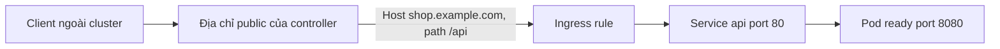
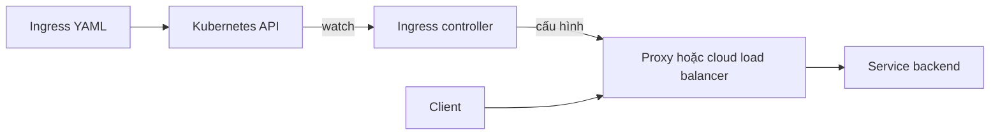
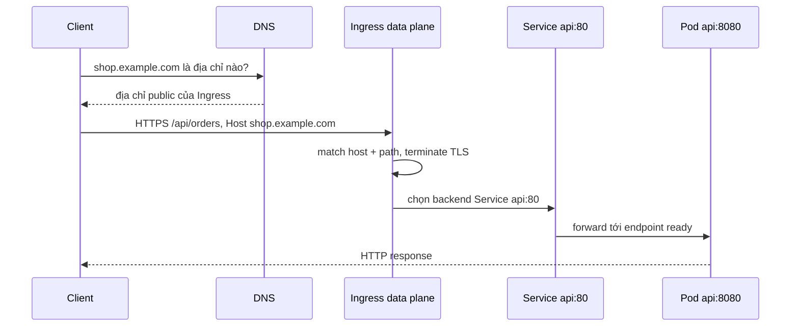

# Ingress

## Mục lục

- [Ingress giải quyết vấn đề gì?](#ingress-giải-quyết-vấn-đề-gì)
- [Hai mảnh ghép bắt buộc](#hai-mảnh-ghép-bắt-buộc)
- [Một request đi qua Ingress như thế nào?](#một-request-đi-qua-ingress-như-thế-nào)
- [Đọc một Ingress manifest từ URL](#đọc-một-ingress-manifest-từ-url)
- [Cách host và path được match](#cách-host-và-path-được-match)
- [IngressClass chọn controller nào?](#ingressclass-chọn-controller-nào)
- [Đưa hostname thật tới Ingress](#đưa-hostname-thật-tới-ingress)
- [Bật HTTPS bằng TLS termination](#bật-https-bằng-tls-termination)
- [Request không match đi đâu?](#request-không-match-đi-đâu)
- [Phần nào phụ thuộc Ingress controller?](#phần-nào-phụ-thuộc-ingress-controller)
- [Backend, readiness và lỗi 503](#backend-readiness-và-lỗi-503)
- [Thực hành với một web Service](#thực-hành-với-một-web-service)
- [Troubleshooting theo đường đi của request](#troubleshooting-theo-đường-đi-của-request)
- [Thiết kế production](#thiết-kế-production)
- [Khi nào nên dùng Gateway API?](#khi-nào-nên-dùng-gateway-api)
- [Tóm tắt](#tóm-tắt)
- [Tài liệu tham khảo](#tài-liệu-tham-khảo)

---

## Ingress giải quyết vấn đề gì?

Giả sử cluster có hai ứng dụng nội bộ:

```text
Service frontend:80
Service api:80
```

Cả hai Service đều có type `ClusterIP`, vì vậy Pod trong cluster gọi được chúng nhưng người dùng ngoài cluster thì không. Bạn muốn public một địa chỉ duy nhất và route như sau:

```text
https://shop.example.com/       → Service frontend:80
https://shop.example.com/api    → Service api:80
```

Ingress giải quyết bài toán này bằng các rule hiểu HTTP: **hostname nào**, **path nào** và **Service backend nào**. Thay vì tạo một public load balancer riêng cho từng Service, nhiều Service có thể dùng chung entry point HTTP/HTTPS.



Ingress phù hợp với HTTP và HTTPS. Nó không phải API chung để expose mọi TCP/UDP port. Với protocol khác, thường cần `Service` type `LoadBalancer`, `NodePort`, Gateway API phù hợp hoặc extension riêng của controller.

> [!IMPORTANT]
> Kubernetes khuyến nghị Gateway API cho thiết kế mới. Ingress API vẫn stable và chưa có kế hoạch bị loại bỏ, nhưng đã **frozen**, nghĩa là API này không nhận thêm feature mới.

Nếu chưa rõ `port`, `targetPort`, `ClusterIP` và endpoint, nên đọc [Service](/networking/service/), [các Service type](/networking/service-types/) và [EndpointSlice](/networking/endpoints-endpointslices/) trước.

## Hai mảnh ghép bắt buộc

Từ “Ingress” thường được dùng cho hai thứ khác nhau. Phân biệt chúng là bước quan trọng nhất để hiểu trang này.

| Thành phần | Bản chất | Nhiệm vụ |
|---|---|---|
| `Ingress` resource | Một object YAML được lưu trong Kubernetes API | Mô tả rule như `shop.example.com/api → Service api:80` |
| Ingress controller | Phần mềm thực sự đang chạy | Đọc các rule, cấu hình proxy/load balancer và nhận request thật |

Hãy hình dung `Ingress` resource là **bản hướng dẫn**, còn Ingress controller là **người thực hiện bản hướng dẫn đó**.



Control flow ở nửa trên cập nhật cấu hình. Traffic flow ở nửa dưới vận chuyển request. Request của người dùng không đi “qua” object YAML hoặc API server.

Kubernetes core cung cấp API `Ingress`, nhưng không tự cài sẵn một controller chung cho mọi cluster. Controller có thể là:

- Một reverse proxy chạy bằng Pod trong cluster.
- Một controller cấu hình load balancer Layer 7 của cloud provider.
- Một controller cấu hình appliance hoặc proxy bên ngoài cluster.

Vì implementation khác nhau, cách cấp địa chỉ, giữ source IP, reload cấu hình và hỗ trợ annotation cũng khác nhau.

> [!WARNING]
> Chỉ tạo `Ingress` resource không làm ứng dụng tự public. Nếu cluster chưa có controller phù hợp, object vẫn có thể được API server chấp nhận nhưng không có data plane xử lý traffic; cột `ADDRESS` thường tiếp tục trống.

Kiểm tra cluster hiện có class và controller nào:

```bash
kubectl get ingressclass
kubectl get pods -A | grep -i ingress
```

Lệnh thứ hai chỉ là cách tìm nhanh theo tên. Tên controller Pod không bắt buộc chứa từ `ingress`, vì vậy tài liệu của cluster hoặc platform team vẫn là nguồn xác nhận chính.

## Một request đi qua Ingress như thế nào?

Dùng request cụ thể sau làm ví dụ xuyên suốt:

```text
https://shop.example.com/api/orders?id=42
```

Đường đi logic gồm các bước:

1. DNS resolve `shop.example.com` thành địa chỉ public của load balancer hoặc Ingress controller.
2. Client mở kết nối TCP tới port `443`.
3. Client và controller thực hiện TLS handshake. Controller chọn certificate cho `shop.example.com`.
4. Controller đọc HTTP `Host` là `shop.example.com` và URL path là `/api/orders`.
5. Rule `host: shop.example.com` kết hợp với `path: /api`, `pathType: Prefix` được match.
6. Rule trỏ tới Service `api`, port `80`.
7. Service và EndpointSlice cho biết các backend ready, ví dụ Pod `10.244.2.15:8080`.
8. Data plane forward request tới một backend rồi trả response về client.



Sơ đồ dùng Service như một bước logic. Controller cụ thể có thể gọi Service `ClusterIP`, hoặc đọc EndpointSlice rồi gọi Pod trực tiếp. Điều được Ingress API đảm bảo là rule reference **Service và Service port**; packet flow chi tiết phụ thuộc controller.

Một cách nhớ ngắn gọn:

```text
DNS tìm entry point
→ Ingress chọn Service bằng host/path
→ Service chọn Pod ready
```

## Đọc một Ingress manifest từ URL

Mục tiêu là hiện thực hai route:

```text
shop.example.com/api/... → api:80
shop.example.com/...     → frontend:80
```

Manifest tương ứng:

```yaml
apiVersion: networking.k8s.io/v1
kind: Ingress
metadata:
  name: shop
  namespace: production
spec:
  ingressClassName: nginx-public
  rules:
    - host: shop.example.com
      http:
        paths:
          - path: /api
            pathType: Prefix
            backend:
              service:
                name: api
                port:
                  number: 80
          - path: /
            pathType: Prefix
            backend:
              service:
                name: frontend
                port:
                  number: 80
```

Đọc từ ngoài vào trong:

| Field | Câu hỏi field này trả lời |
|---|---|
| `namespace: production` | Ingress thuộc Namespace nào? |
| `ingressClassName: nginx-public` | Controller/class nào chịu trách nhiệm? |
| `host: shop.example.com` | Request phải có hostname nào? |
| `path: /api` + `pathType: Prefix` | Phần path nào của URL được match? |
| `service.name: api` | Route tới Service nào? |
| `service.port.number: 80` | Gọi port nào trên Service đó? |

Backend `api` và `frontend` phải tồn tại trong cùng Namespace `production` với Ingress. Số `80` là **Service port**, không phải `targetPort` hoặc `containerPort` nếu các số này khác nhau.

Ví dụ Service `api` có thể khai báo:

```yaml
apiVersion: v1
kind: Service
metadata:
  name: api
  namespace: production
spec:
  selector:
    app: api
  ports:
    - name: http
      port: 80
      targetPort: 8080
```

Ingress reference `api:80`; Service tiếp tục map port `80` tới Pod port `8080`. Không viết `8080` vào Ingress chỉ vì application listen ở `8080`.

## Cách host và path được match

Controller chỉ chọn backend sau khi request match cả `host` và `path` của một rule. Query string như `?id=42` không phải phần dùng để match path trong Ingress core API.

### Host

Với rule:

```yaml
host: shop.example.com
```

request phải mang HTTP `Host: shop.example.com`. Vì vậy gọi thẳng IP như sau thường không match rule:

```bash
curl http://203.0.113.10/api
```

Cần giữ đúng Host header:

```bash
curl -H 'Host: shop.example.com' http://203.0.113.10/api
```

Rule không khai báo `host` có thể match request với mọi hostname đi vào địa chỉ đó. Cách này tiện cho lab nhưng dễ tạo public catch-all ngoài ý muốn trong production.

Wildcard chỉ bao phủ một DNS label:

| Rule host | Request host | Kết quả |
|---|---|---|
| `*.example.com` | `api.example.com` | Match |
| `*.example.com` | `v1.api.example.com` | Không match |
| `*.example.com` | `example.com` | Không match |

### `pathType`

Mọi path phải có `pathType`. Ba giá trị là:

| `pathType` | Cách hiểu |
|---|---|
| `Exact` | Chỉ match path chính xác, có phân biệt chữ hoa/thường |
| `Prefix` | Match theo từng segment được ngăn bằng `/` |
| `ImplementationSpecific` | Controller tự định nghĩa; behavior có thể không portable |

Ví dụ với path `/api`:

| Request path | `Exact` | `Prefix` |
|---|---:|---:|
| `/api` | Có | Có |
| `/api/` | Không | Có |
| `/api/orders` | Không | Có |
| `/apiv2` | Không | Không |
| `/API` | Không | Không |

`Prefix` không phải raw string prefix. `/api` match `/api/orders` nhưng không match `/apiv2`, vì `apiv2` là một segment khác.

Khi nhiều path cùng match, rule có path dài hơn được ưu tiên. Nếu cùng độ dài, `Exact` được ưu tiên hơn `Prefix`. Trong manifest `shop`, request `/api/orders` vì vậy đi tới `api`, không đi tới route `/` của `frontend`.

### Match không có nghĩa là rewrite

Rule `/api` chỉ quyết định chọn backend. Ingress core API không yêu cầu controller phải bỏ `/api` khỏi URL.

Nếu client gửi:

```text
GET /api/orders
```

backend thường vẫn nhận `/api/orders`. Nếu application chỉ hiểu `/orders`, bạn phải làm một trong hai việc:

1. Cho application phục vụ dưới prefix `/api`.
2. Cấu hình URL rewrite bằng feature của controller.
3. Dùng Gateway API filter nếu implementation hỗ trợ feature tương ứng.

Rewrite qua annotation là controller-specific; không copy annotation của controller này sang controller khác.

## IngressClass chọn controller nào?

Một cluster có thể chạy nhiều controller, chẳng hạn một controller public và một controller chỉ dùng trong private network:

```text
nginx-public   → public load balancer
nginx-internal → private load balancer
```

Ingress chọn class bằng:

```yaml
spec:
  ingressClassName: nginx-public
```

`nginx-public` là tên của một resource cluster-scoped `IngressClass`:

```yaml
apiVersion: networking.k8s.io/v1
kind: IngressClass
metadata:
  name: nginx-public
spec:
  controller: k8s.io/ingress-nginx
```

Giá trị `spec.controller` do implementation quy định. Application developer thường chỉ cần dùng đúng `metadata.name` mà platform team công bố; không nên tự đoán hoặc tự tạo class từ ví dụ này.

Cluster có thể đánh dấu một class là mặc định:

```yaml
metadata:
  annotations:
    ingressclass.kubernetes.io/is-default-class: "true"
```

Khi Ingress bỏ `ingressClassName`, default class có thể được gán. Nếu có nhiều class cùng được đánh dấu default, admission từ chối Ingress không khai báo class. Trong manifest production, nên ghi class tường minh để tránh một controller ngoài ý muốn xử lý route.

Annotation cũ `kubernetes.io/ingress.class` là cơ chế legacy. Manifest mới nên dùng `spec.ingressClassName`, trừ khi tài liệu compatibility của controller yêu cầu khác.

## Đưa hostname thật tới Ingress

Ingress không tự đăng ký DNS record `shop.example.com`. Sau khi controller xử lý object, xem entry point mà nó công bố:

```bash
kubectl get ingress shop -n production
kubectl describe ingress shop -n production
```

Output minh họa:

```text
NAME   CLASS          HOSTS              ADDRESS          PORTS
shop   nginx-public   shop.example.com   203.0.113.10     80
```

`ADDRESS` có thể là IP hoặc hostname của load balancer. Để người dùng truy cập được, DNS của `shop.example.com` phải trỏ tới entry point này bằng record phù hợp với môi trường.

Có ba khái niệm riêng, không nên gộp chúng:

| Khái niệm | Ví dụ | Ai quản lý? |
|---|---|---|
| Host trong Ingress rule | `shop.example.com` | Manifest Kubernetes |
| Address của controller/LB | `203.0.113.10` | Ingress controller hoặc cloud provider |
| DNS record | `shop.example.com → 203.0.113.10` | DNS provider hoặc DNS automation |

Trong lúc chờ DNS, nếu `ADDRESS` là IP, có thể test HTTP bằng:

```bash
curl -sv --resolve shop.example.com:80:203.0.113.10 \
  http://shop.example.com/api
```

`--resolve` chỉ ép `curl` dùng IP đó; URL và Host header vẫn là `shop.example.com` nên rule có thể match đúng.

## Bật HTTPS bằng TLS termination

**TLS termination** nghĩa là client thiết lập HTTPS tới Ingress data plane; controller giải mã TLS, đọc HTTP host/path rồi thường forward HTTP plaintext tới backend.

```text
Client == HTTPS ==> Ingress controller ---- HTTP ----> Service/Pod
```

Đây là behavior mà Ingress API cơ bản giả định. TLS từ controller tới backend, TLS passthrough và mTLS phụ thuộc controller hoặc API khác.

### Tạo TLS Secret

Certificate và private key được lưu trong Secret cùng Namespace với Ingress:

```bash
kubectl create secret tls shop-tls -n production \
  --cert=shop.example.com.crt \
  --key=shop.example.com.key
```

Secret type `kubernetes.io/tls` chứa hai key `tls.crt` và `tls.key`. Không commit private key vào Git.

### Tham chiếu Secret từ Ingress

Bổ sung `tls` vào cùng manifest:

```yaml
spec:
  ingressClassName: nginx-public
  tls:
    - hosts:
        - shop.example.com
      secretName: shop-tls
  rules:
    - host: shop.example.com
      http:
        paths:
          - path: /
            pathType: Prefix
            backend:
              service:
                name: frontend
                port:
                  number: 80
```

Ba tên phải phù hợp nhau:

1. `rules[].host` là hostname dùng để route HTTP.
2. `tls[].hosts[]` là hostname gắn với cấu hình TLS.
3. Certificate trong Secret phải hợp lệ cho hostname đó, thường qua Subject Alternative Name (SAN).

Khi nhiều hostname cùng dùng port `443`, client gửi hostname trong TLS handshake qua **SNI**. Controller dùng SNI để chọn certificate trước khi đọc HTTP request.

Test bằng đúng hostname và SNI:

```bash
curl -sv --resolve shop.example.com:443:203.0.113.10 \
  https://shop.example.com/
```

Hoặc xem certificate server trả về:

```bash
openssl s_client \
  -connect 203.0.113.10:443 \
  -servername shop.example.com </dev/null
```

Trong production, nên dùng certificate controller hoặc secret manager để tự động cấp và rotate certificate, đồng thời cảnh báo trước ngày hết hạn.

## Request không match đi đâu?

Request có thể không match vì Host sai, path sai hoặc không có rule phù hợp. Khi đó controller thường đưa request tới **default backend** và trả 404; behavior cụ thể vẫn cần xem tài liệu controller.

Một Ingress có thể khai báo `spec.defaultBackend`:

```yaml
spec:
  defaultBackend:
    service:
      name: not-found
      port:
        number: 80
```

Nếu Ingress không có `rules`, `defaultBackend` là backend xử lý toàn bộ traffic của Ingress đó. Controller cũng có thể có default backend toàn cục dùng khi không Ingress nào match.

Default backend production nên:

- Trả response 404 tối giản.
- Không lộ phiên bản controller hoặc route nội bộ.
- Ghi metric/log đủ để phát hiện hostname hay path bị gửi sai.
- Không trỏ tới một ứng dụng nhạy cảm như catch-all.

## Phần nào phụ thuộc Ingress controller?

Core Ingress API cố ý chỉ mô tả routing HTTP/HTTPS cơ bản. Các feature sau thường nằm trong annotation, ConfigMap, custom resource hoặc policy riêng của controller:

- URL rewrite và redirect.
- Timeout, retry và giới hạn request body.
- Backend dùng HTTP hay HTTPS.
- WebSocket, SSE, gRPC và long-lived connection.
- Authentication, rate limit, WAF và source CIDR allowlist.
- Canary, traffic weight hoặc session affinity.
- TLS passthrough, backend TLS và mTLS.
- Cách bảo toàn client source IP.

Điều đó dẫn tới hai nguyên tắc:

1. Chỉ dùng key và value từ tài liệu đúng **controller và version** đang chạy.
2. Phân biệt field chuẩn trong `spec` với annotation riêng của implementation.

Annotation thường là string và có mức validation khác nhau. Một annotation sai có thể bị bỏ qua hoặc làm controller từ chối cập nhật cấu hình. Một số controller còn cho phép chèn snippet cấu hình proxy; tính năng này tạo rủi ro bảo mật lớn và không nên mở cho mọi Namespace.

### Forwarded headers và client IP

Vì request đi qua một hoặc nhiều proxy, application thường không thấy IP client trực tiếp ở socket. Proxy có thể gửi thông tin qua:

- `X-Forwarded-For`.
- `X-Forwarded-Proto`.
- `X-Forwarded-Host`.
- Header chuẩn `Forwarded` nếu implementation hỗ trợ.

Application chỉ nên tin các header này khi request đến từ proxy range đáng tin cậy và toàn bộ proxy chain được cấu hình nhất quán. Nếu không, client có thể tự gửi header giả để mạo danh IP hoặc scheme.

## Backend, readiness và lỗi 503

Ingress route tới Service, nhưng Service chỉ hữu ích khi có endpoint sẵn sàng. Chuỗi phụ thuộc là:

```text
Ingress rule
→ Service tồn tại và port đúng
→ selector chọn đúng Pod
→ readiness thành công
→ EndpointSlice có endpoint ready
→ application thực sự listen đúng targetPort
```

Kiểm tra chuỗi này:

```bash
kubectl get svc api -n production -o wide
kubectl get endpointslice -n production \
  -l kubernetes.io/service-name=api -o wide
kubectl get pods -n production -l app=api
```

Nếu Service tồn tại nhưng EndpointSlice không có endpoint ready, controller thường không có backend để chọn và có thể trả 503. Các nguyên nhân phổ biến gồm:

- Service selector không match label của Pod.
- Pod chưa `Ready` hoặc readiness probe đang fail.
- `targetPort` sai tên hoặc sai số.
- Application chưa listen trên port mong đợi.

Ingress core API không định nghĩa health check riêng cho backend. Readiness probe và behavior của controller quyết định endpoint nào nhận traffic. Probe quá nông có thể đưa Pod chưa sẵn sàng vào traffic; probe chập chờn có thể làm endpoint liên tục được thêm rồi gỡ, tạo 503 ngắt quãng.

## Thực hành với một web Service

Lab này chứng minh ba điều: Ingress cần controller, Host header quyết định route và backend cuối cùng vẫn là một Service có endpoint ready.

### Điều kiện trước khi bắt đầu

- Có cluster học tập và quyền tạo resource.
- Cluster đã cài Ingress controller.
- `kubectl get ingressclass` trả về ít nhất một class có thể dùng.

Lưu tên class vào biến shell; thay `YOUR_INGRESS_CLASS` bằng tên thật:

```bash
export INGRESS_CLASS=YOUR_INGRESS_CLASS
kubectl get ingressclass "$INGRESS_CLASS"
```

### 1. Tạo Deployment và Service

```bash
kubectl create namespace ingress-lab
kubectl create deployment web -n ingress-lab --image=nginx:1.27-alpine
kubectl expose deployment web -n ingress-lab --port=80
kubectl rollout status deployment/web -n ingress-lab
```

Xác minh Service đã có endpoint:

```bash
kubectl get service web -n ingress-lab
kubectl get endpointslice -n ingress-lab \
  -l kubernetes.io/service-name=web
```

Nếu EndpointSlice chưa có địa chỉ ready, dừng ở đây và sửa backend trước khi tạo Ingress.

### 2. Tạo Ingress

Tạo file `ingress.yaml` và thay `YOUR_INGRESS_CLASS`:

```yaml
apiVersion: networking.k8s.io/v1
kind: Ingress
metadata:
  name: web
  namespace: ingress-lab
spec:
  ingressClassName: YOUR_INGRESS_CLASS
  rules:
    - host: web.example.test
      http:
        paths:
          - path: /
            pathType: Prefix
            backend:
              service:
                name: web
                port:
                  number: 80
```

Áp dụng và xem controller đã reconcile hay chưa:

```bash
kubectl apply -f ingress.yaml
kubectl get ingress web -n ingress-lab
kubectl describe ingress web -n ingress-lab
```

`ADDRESS` có thể cần một khoảng thời gian mới xuất hiện. Nếu tiếp tục trống, xem Events trong `kubectl describe` và kiểm tra class/controller.

### 3. Gửi request với đúng Host

Lấy `ADDRESS` và lưu vào biến shell:

```bash
export INGRESS_ADDRESS="$(kubectl get ingress web -n ingress-lab \
  -o jsonpath='{.status.loadBalancer.ingress[0].ip}{.status.loadBalancer.ingress[0].hostname}')"
printf '%s\n' "$INGRESS_ADDRESS"
```

Nếu output là một IP, test bằng `--resolve` để giữ đúng hostname:

```bash
curl -sv --resolve "web.example.test:80:$INGRESS_ADDRESS" \
  http://web.example.test/
```

Nếu output là hostname của load balancer, test HTTP bằng:

```bash
curl -sv -H 'Host: web.example.test' "http://$INGRESS_ADDRESS/"
```

Response HTML mặc định của nginx chứng minh request đã đi qua rule tới Service `web`.

Một số cluster local không cấp public `ADDRESS`; controller có thể được expose qua NodePort, `localhost` port mapping hoặc tunnel riêng. Khi đó dùng entry point do distribution cung cấp nhưng vẫn giữ Host header `web.example.test`.

### 4. Chứng minh Host là một phần của rule

Gửi request tới cùng address nhưng đổi Host:

```bash
curl -sv -H 'Host: wrong.example.test' "http://$INGRESS_ADDRESS/"
```

Với controller thông thường, request này không match Ingress `web` và đi tới default backend, thường nhận 404. Status và response body cụ thể phụ thuộc controller.

### 5. Cleanup

```bash
kubectl delete namespace ingress-lab
rm -f ingress.yaml
```

## Troubleshooting theo đường đi của request

Đừng bắt đầu bằng cách restart controller. Trước hết xác định request hỏng ở layer nào.

| Triệu chứng | Layer nên kiểm tra trước |
|---|---|
| `NXDOMAIN` | DNS record |
| Connection timeout hoặc refused | Address, listener, firewall, load balancer |
| Certificate sai hostname | TLS Secret, SNI, certificate SAN |
| 404 từ controller | `Host`, path, `pathType`, class, default backend |
| 502/503 | Service, Service port, EndpointSlice, readiness, backend protocol |
| 504 | Backend chậm, proxy timeout, LB idle timeout, NetworkPolicy |

Mã lỗi chính xác có thể khác theo controller, nên luôn kết hợp response với Events, access log và error log.

### `ADDRESS` trống

Thu thập trạng thái:

```bash
kubectl describe ingress INGRESS -n NAMESPACE
kubectl get ingressclass -o yaml
```

Kiểm tra theo thứ tự:

1. `spec.ingressClassName` có tồn tại không?
2. Class có thuộc controller đang chạy không?
3. Controller có quyền watch Namespace/Ingress này không?
4. Events hoặc controller log có lỗi reconcile không?
5. Nếu cần cloud load balancer, provider có gặp quota, permission hoặc provisioning error không?

### Có address nhưng nhận 404

Giữ nguyên Host khi test:

```bash
curl -sv -H 'Host: shop.example.com' \
  http://INGRESS_ADDRESS/api
```

Nếu cách này chạy còn gọi IP trực tiếp bị 404, vấn đề là request cũ thiếu Host đúng. Nếu vẫn 404, kiểm tra `rules[].host`, `path`, `pathType`, `ingressClassName` và conflict với Ingress khác.

Với HTTPS, `-H 'Host: ...'` chưa đủ để chọn certificate vì TLS handshake xảy ra trước HTTP. Dùng hostname thật hoặc `curl --resolve` để gửi đúng cả SNI lẫn Host.

### Nhận 502 hoặc 503

Kiểm tra Service port và endpoint:

```bash
kubectl get svc SERVICE -n NAMESPACE -o yaml
kubectl get endpointslice -n NAMESPACE \
  -l kubernetes.io/service-name=SERVICE -o yaml
```

Sau đó test Service từ một debug Pod trong cluster. Nếu Service cũng lỗi, sửa selector, readiness, `targetPort` hoặc application trước. Nếu Service chạy nhưng Ingress lỗi, kiểm tra backend protocol, NetworkPolicy từ controller tới backend và controller log.

### Certificate không đúng

```bash
openssl s_client \
  -connect INGRESS_ADDRESS:443 \
  -servername shop.example.com </dev/null
kubectl get secret shop-tls -n production
```

Kiểm tra:

- `-servername` có đúng hostname không?
- Certificate có SAN cho hostname đó không?
- `tls[].hosts`, `rules[].host` và `secretName` có đúng không?
- Secret có ở cùng Namespace với Ingress không?
- Controller đã reload sau khi Secret thay đổi chưa?

### Nhận 504 hoặc request dài bị ngắt

So sánh thời gian gọi backend trực tiếp và gọi qua Ingress. Nếu backend vốn đã chậm, tăng timeout proxy chỉ che triệu chứng. Nếu chỉ đường Ingress lỗi, kiểm tra timeout ở từng hop: external load balancer, controller và upstream backend. WebSocket, SSE, gRPC và upload dài còn cần kiểm tra HTTP version, connection upgrade và buffering theo controller.

## Thiết kế production

Sau khi route cơ bản chạy được, production cần xem Ingress controller như một shared entry point có blast radius lớn.

### High availability và capacity

- Chạy nhiều replica nếu architecture của controller hỗ trợ.
- Spread replica qua Node và zone để tránh một failure domain.
- Đặt resource request/limit phù hợp với peak connection, TLS handshake và reload cấu hình.
- Cấu hình graceful shutdown để connection đang chạy có thời gian drain.
- Theo dõi external load balancer health check và khả năng failover.

### Shared hay dedicated controller

| Mô hình | Lợi ích | Trade-off |
|---|---|---|
| Shared controller | Ít load balancer, chi phí và vận hành tập trung | Blast radius và noisy neighbor lớn hơn |
| Dedicated theo tenant/app | Isolation và tùy biến tốt hơn | Tăng cost và operational overhead |
| Tách public/internal class | Network boundary rõ | Cần governance cho hai entry point |

Không có một lựa chọn đúng cho mọi cluster. Chọn theo mức isolation, quy mô, cost và quyền tùy biến mà từng team cần.

### Security

- Giới hạn team nào được chọn public `IngressClass`.
- Không mở arbitrary config snippet cho mọi Namespace.
- Quản lý TLS private key bằng RBAC tối thiểu và rotation tự động.
- Chỉ tin forwarded headers từ proxy chain đã xác định.
- Dùng rate limit, WAF hoặc DDoS protection ở layer phù hợp với threat model.
- Tránh ghi token, cookie và dữ liệu nhạy cảm vào access log.
- Dùng NetworkPolicy cho đường từ controller tới backend khi CNI hỗ trợ.

### Observability

Theo dõi ít nhất:

- Request rate, status code và latency theo host/route/backend.
- Active connection và TLS handshake error.
- Backend connect error, reset và timeout.
- Số request đi vào default backend/404 unmatched.
- Config reload hoặc reconcile success/error.
- Certificate expiry.
- CPU, memory và saturation của data plane.

Metric 503 tăng nhưng EndpointSlice rỗng gợi ý backend/readiness; 404 unmatched tăng sau đổi DNS gợi ý Host/path hoặc route chưa được controller nhận. Gắn metric với request flow giúp khoanh vùng nhanh hơn việc chỉ nhìn tổng số 5xx.

## Khi nào nên dùng Gateway API?

Ingress vẫn hợp lý khi:

- Cluster và controller hiện tại đã vận hành ổn định.
- Nhu cầu chủ yếu là host/path routing và TLS termination.
- Các annotation đang dùng ít, rõ và được platform quản lý.

Ưu tiên Gateway API cho platform mới khi cần:

- Tách quyền quản lý infrastructure, listener và application route.
- Cho nhiều Namespace attach route có kiểm soát.
- Header/query/method matching hoặc traffic splitting được chuẩn hóa hơn.
- Nhiều protocol hoặc policy model phong phú hơn.
- Giảm phụ thuộc annotation riêng của một Ingress controller.

Không nên migrate bằng cách đổi tên field cơ học. Cần inventory mọi annotation, kiểm tra conformance của Gateway implementation, chạy song song, test Host/SNI/path rồi mới chuyển DNS.

Tiếp tục với [Gateway API](/networking/gateway-api/) để học resource model `GatewayClass` → `Gateway` → `HTTPRoute`.

## Tóm tắt

Giữ mental model sau khi đọc và debug Ingress:

```text
Ingress resource chỉ mô tả rule
+ Ingress controller thực hiện rule
+ DNS đưa client tới controller
+ host/path chọn Service
+ Service/EndpointSlice chọn Pod ready
```

Năm kiểm tra quan trọng nhất là:

1. Cluster có controller và đúng `IngressClass`.
2. DNS hoặc request test đi tới đúng `ADDRESS`.
3. Host và path thực tế match rule.
4. Ingress reference đúng Service port trong cùng Namespace.
5. Service có EndpointSlice với backend ready.

Nếu năm mắt xích này đúng, route HTTP cơ bản thường hoạt động. TLS, rewrite, timeout, source IP và các feature nâng cao phải được kiểm tra tiếp theo tài liệu của controller cụ thể.

---

## Tài liệu tham khảo

- [Ingress](https://kubernetes.io/docs/concepts/services-networking/ingress/)
- [Ingress Controllers](https://kubernetes.io/docs/concepts/services-networking/ingress-controllers/)
- [Ingress API Reference](https://kubernetes.io/docs/reference/kubernetes-api/service-resources/ingress-v1/)
