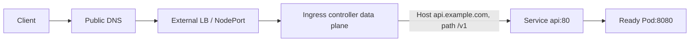

# Ingress

## Mục lục

- [Tổng quan](#tổng-quan)
- [1. Ingress resource khác Ingress controller](#1-ingress-resource-khác-ingress-controller)
- [2. Request flow](#2-request-flow)
- [3. IngressClass](#3-ingressclass)
- [4. Host và path routing](#4-host-và-path-routing)
- [5. Default backend](#5-default-backend)
- [6. TLS termination](#6-tls-termination)
- [7. Controller-specific annotations](#7-controller-specific-annotations)
- [8. Backend health và readiness](#8-backend-health-và-readiness)
- [9. Source IP và forwarded headers](#9-source-ip-và-forwarded-headers)
- [10. Production design](#10-production-design)
- [11. Ingress và Gateway API](#11-ingress-và-gateway-api)
- [12. Thực hành](#12-thực-hành)
- [13. Troubleshooting theo request path](#13-troubleshooting-theo-request-path)
- [14. Best practices](#14-best-practices)
- [Tài liệu tham khảo](#tài-liệu-tham-khảo)

---

## Tổng quan

Ingress là API stable để mô tả routing HTTP/HTTPS từ ngoài cluster tới Service. Nó hỗ trợ host, path, TLS và virtual hosting.

> [!IMPORTANT]
> Kubernetes project khuyến nghị Gateway API cho thiết kế mới. Ingress API đã **frozen**: vẫn stable, không có kế hoạch loại bỏ, nhưng không được thêm feature mới.

Ingress object một mình không xử lý traffic. Cluster phải có Ingress controller tương thích.



## 1. Ingress resource khác Ingress controller

| Thành phần | Vai trò |
|---|---|
| `Ingress` | Desired routing config trong Kubernetes API |
| `IngressClass` | Chỉ controller/class xử lý Ingress |
| Ingress controller | Watch API, validate/reconcile config |
| Data-plane proxy/LB | Nhận connection thật và forward request |
| Service/EndpointSlice | Backend discovery |

Tạo Ingress nhưng không cài controller thường cho object hợp lệ, `ADDRESS` trống và không có traffic.

### 1.1 Controller architecture

Implementation có thể:

- Chạy reverse proxy Pod trong cluster.
- Cấu hình cloud L7 load balancer.
- Cấu hình appliance/external proxy.
- Một controller quản lý shared proxy hoặc LB per Ingress/class.

Hệ quả về source IP, health check, reload, cost và isolation khác nhau. Đọc tài liệu controller cụ thể.

## 2. Request flow

Ví dụ client gọi `https://api.example.com/v1/orders`:

1. External DNS resolve hostname thành LB/controller address.
2. Firewall/security group cho phép TCP 443.
3. TLS handshake chọn certificate qua SNI.
4. Controller match HTTP `Host` và path.
5. Controller chọn backend Service + port.
6. Service/EndpointSlice cung cấp ready backend.
7. Proxy forward request và nhận response.
8. Timeout/retry/header policy của controller được áp dụng.

Khi lỗi, status code gợi ý layer:

| Triệu chứng | Layer thường kiểm tra đầu tiên |
|---|---|
| DNS NXDOMAIN | External DNS |
| TCP timeout | LB, firewall, listener, route |
| TLS certificate mismatch | SNI, Secret, certificate |
| 404 từ controller | Host/path/class/default backend |
| 502/503 | Service, endpoint, target port, backend protocol |
| 504 | Backend latency/timeout/network |

Status mapping phụ thuộc controller; xem access/error log.

## 3. IngressClass

Ingress nên khai báo:

```yaml
spec:
  ingressClassName: nginx-public
```

`IngressClass`:

```yaml
apiVersion: networking.k8s.io/v1
kind: IngressClass
metadata:
  name: nginx-public
spec:
  controller: k8s.io/ingress-nginx
```

Tên `spec.controller` phụ thuộc implementation.

### 3.1 Default class

Cluster có thể đánh dấu một class default:

```yaml
metadata:
  annotations:
    ingressclass.kubernetes.io/is-default-class: "true"
```

Nếu nhiều class default, admission từ chối Ingress không có `ingressClassName`. Trong production, khai báo class tường minh để tránh route bị controller ngoài ý muốn xử lý.

### 3.2 Annotation cũ

`kubernetes.io/ingress.class` là cơ chế legacy. Dùng `spec.ingressClassName` cho manifest mới, trừ khi controller/version bắt buộc compatibility.

### 3.3 Nhiều class

Pattern:

```text
nginx-public   → Internet-facing, WAF/public LB
nginx-internal → private subnet/VPC
```

RBAC/admission phải kiểm soát team nào được chọn public class.

## 4. Host và path routing

Ingress:

```yaml
apiVersion: networking.k8s.io/v1
kind: Ingress
metadata:
  name: shop
  namespace: production
spec:
  ingressClassName: nginx-public
  rules:
    - host: shop.example.com
      http:
        paths:
          - path: /api
            pathType: Prefix
            backend:
              service:
                name: api
                port:
                  name: http
          - path: /
            pathType: Prefix
            backend:
              service:
                name: frontend
                port:
                  name: http
```

Backend Service phải cùng Namespace với Ingress trong API chuẩn.

### 4.1 `pathType`

| Type | Behavior |
|---|---|
| `Exact` | Match path chính xác, case-sensitive |
| `Prefix` | Match theo path segment, không phải raw string prefix |
| `ImplementationSpecific` | Controller tự định nghĩa; kém portable |

`Prefix /foo` match `/foo`, `/foo/`, `/foo/bar`, nhưng không match `/foobar`.

Nếu nhiều path match:

1. Longest path ưu tiên.
2. Cùng độ dài thì `Exact` ưu tiên `Prefix`.

### 4.2 Host matching

Host chính xác match HTTP Host header. Wildcard `*.example.com` chỉ match một DNS label, ví dụ `api.example.com`, không match `v1.api.example.com` hoặc apex `example.com`.

### 4.3 Không đặt host

Rule không có host có thể match mọi request tới address. Điều này dễ tạo accidental catch-all. Dùng host explicit cho public application.

### 4.4 Path rewrite không portable

Ingress core API match path nhưng rewrite behavior thường qua annotation controller-specific. Nếu backend chỉ phục vụ `/` còn external path `/api`, phải cấu hình rewrite theo controller hoặc để application hỗ trợ prefix.

## 5. Default backend

`spec.defaultBackend` nhận request không có rules hoặc theo behavior tài nguyên. Controller cũng có thể có default backend toàn cục cho request không match bất kỳ Ingress.

```yaml
spec:
  defaultBackend:
    service:
      name: not-found
      port:
        number: 80
```

Thiết kế default backend:

- Trả 404 tối giản.
- Không lộ controller/version/internal route.
- Có log/metric request unmatched.
- Không route nhầm tới ứng dụng nhạy cảm.

## 6. TLS termination

Tạo Secret:

```bash
kubectl create secret tls shop-tls -n production \
  --cert=shop.example.com.crt \
  --key=shop.example.com.key
```

Tham chiếu:

```yaml
spec:
  tls:
    - hosts:
        - shop.example.com
      secretName: shop-tls
  rules:
    - host: shop.example.com
      http:
        paths: []
```

Secret `kubernetes.io/tls` có key `tls.crt` và `tls.key`, cùng Namespace với Ingress.

### 6.1 TLS flow

Ingress API phổ biến mô tả terminate TLS ở controller, sau đó forward plaintext HTTP tới Service. Backend TLS, re-encryption, passthrough và mTLS là controller-specific hoặc Gateway API feature.

### 6.2 SNI và certificate

Client gửi SNI trong TLS handshake. Controller chọn certificate theo host. `tls.hosts` phải phù hợp `rules.host` và SAN của certificate.

### 6.3 Certificate lifecycle

Không commit private key. Dùng certificate controller/secret manager, rotate trước expiry, monitor expiry và xác minh controller reload Secret. RBAC đọc TLS Secret của controller là quyền nhạy cảm.

## 7. Controller-specific annotations

Ingress annotations thường cấu hình:

- Path rewrite.
- Backend protocol.
- Proxy timeout/body size.
- Source CIDR allowlist.
- Authentication.
- Canary/weight.
- TLS redirect.
- WAF/provider options.

Trade-off:

- Khó portable.
- Stringly typed, validation khác nhau.
- Một annotation sai có thể reject toàn config hoặc bị ignore.
- Security feature có thể cho user chèn snippet/config nguy hiểm.

Dùng admission policy, allowlist annotation và versioned controller docs. Gateway API chuẩn hóa nhiều feature trước đây cần annotation.

## 8. Backend health và readiness

Ingress backend thường là Service. Controller có thể:

- Gọi ClusterIP.
- Đọc EndpointSlice và gọi Pod trực tiếp.
- Cấu hình cloud LB target theo Node/Pod.

Do đó kiểm tra backend theo contract, không giả định packet luôn đi qua kube-proxy.

Readiness probe quyết định endpoint có được publish. Probe quá nông như chỉ TCP open có thể đưa Pod chưa load config vào traffic. Probe quá nhạy tạo endpoint flapping và 503.

### 8.1 Backend protocol mismatch

Controller forward HTTP nhưng backend mong HTTPS thường tạo 502/reset. Khai báo backend protocol theo controller hoặc cấu trúc Gateway phù hợp.

### 8.2 Long-lived request

WebSocket, SSE, gRPC và upload dài cần timeout, HTTP version và connection upgrade support. Ingress core API không mô tả đầy đủ; kiểm tra controller.

## 9. Source IP và forwarded headers

Proxy thường thấy client IP ở socket hoặc nhận từ upstream LB, rồi thêm:

- `X-Forwarded-For`.
- `X-Forwarded-Proto`.
- `X-Forwarded-Host`.
- Standard `Forwarded` nếu support.

Application chỉ tin các header này từ trusted proxy range. Nếu client trực tiếp reach controller và controller không sanitize, client có thể spoof IP/scheme.

`externalTrafficPolicy: Local`, proxy protocol hoặc cloud LB setting có thể cần để giữ source IP. Cấu hình phải nhất quán qua mọi hop.

## 10. Production design

### 10.1 Shared hay dedicated controller

| Model | Ưu điểm | Trade-off |
|---|---|---|
| Shared | Ít LB/cost, quản lý tập trung | Blast radius, noisy neighbor |
| Dedicated per tenant/app | Isolation, custom config | Cost và operational overhead |
| Public/internal class | Boundary rõ theo network | Cần governance hai control plane |

### 10.2 HA

- Nhiều controller/data-plane replica.
- Spread qua Node/zone.
- PDB và graceful shutdown.
- External LB health check.
- Resource request đủ cho reload và peak connection.
- Capacity cho TLS handshake, keep-alive, buffer.

### 10.3 Security

- TLS policy/cipher/version theo tiêu chuẩn tổ chức.
- Rate limit/WAF/DDoS ở layer phù hợp.
- Default deny public exposure bằng admission.
- Không cho arbitrary config snippet.
- Access log không ghi token/cookie nhạy cảm.
- Tách admin endpoint khỏi public class.

### 10.4 Observability

Theo dõi theo host/route/backend:

- Request rate, status code, latency.
- Active connection, TLS handshake error.
- Backend connect/reset/timeout.
- Config reload success/error.
- Certificate expiry.
- 404 unmatched route.

## 11. Ingress và Gateway API

| Tiêu chí | Ingress | Gateway API |
|---|---|---|
| Trạng thái API | Stable nhưng frozen | Phát triển tích cực qua CRD/spec |
| HTTP routing cơ bản | Có | Có |
| Role separation | Hạn chế | GatewayClass/Gateway/Route rõ |
| Cross-namespace attach | Không trực tiếp | Có kiểm soát bằng allowedRoutes/ReferenceGrant |
| Header match, weight, filter | Thường annotation | Nhiều feature chuẩn hóa |
| Protocol | Chủ yếu HTTP/HTTPS | HTTP, gRPC và route types khác theo channel |
| Portability | Core đơn giản portable, extension không | Conformance profile/feature rõ hơn |

Không cần migrate ngay mọi Ingress ổn định. Với platform mới hoặc nhu cầu delegation/advanced routing, ưu tiên Gateway API.

## 12. Thực hành

Lab yêu cầu Ingress controller đã cài. Kiểm tra:

```bash
kubectl get ingressclass
kubectl get pod -A | grep -i ingress
```

Tạo backend:

```bash
kubectl create namespace ingress-lab
kubectl create deployment web -n ingress-lab --image=nginx:1.27-alpine
kubectl expose deployment web -n ingress-lab --port=80
```

Tạo Ingress; thay `YOUR_INGRESS_CLASS`:

```yaml
apiVersion: networking.k8s.io/v1
kind: Ingress
metadata:
  name: web
  namespace: ingress-lab
spec:
  ingressClassName: YOUR_INGRESS_CLASS
  rules:
    - host: web.example.test
      http:
        paths:
          - path: /
            pathType: Prefix
            backend:
              service:
                name: web
                port:
                  number: 80
```

```bash
kubectl apply -f ingress.yaml
kubectl get ingress web -n ingress-lab --watch
kubectl describe ingress web -n ingress-lab
```

Test không cần sửa DNS bằng Host header:

```bash
curl -sv --resolve web.example.test:80:INGRESS_ADDRESS \
  http://web.example.test/
```

Nếu controller local dùng NodePort/port mapping, xác định address/port theo distribution docs.

Cleanup:

```bash
kubectl delete namespace ingress-lab
rm -f ingress.yaml
```

## 13. Troubleshooting theo request path

### 13.1 Ingress `ADDRESS` trống

- `ingressClassName` tồn tại?
- Controller watch class đó?
- Controller log/reconcile error?
- Provider có provision LB được không?

```bash
kubectl describe ingress INGRESS -n NS
kubectl get ingressclass -o yaml
```

### 13.2 404

Dùng curl giữ đúng Host header:

```bash
curl -sv -H 'Host: shop.example.com' http://INGRESS_ADDRESS/api
```

Kiểm tra host, path, `pathType`, class và default backend. Gọi IP trực tiếp không Host thường không match virtual host.

### 13.3 502/503

```bash
kubectl get svc SERVICE -n NS -o yaml
kubectl get endpointslice -n NS \
  -l kubernetes.io/service-name=SERVICE -o yaml
```

Test Service từ debug Pod; kiểm tra targetPort, readiness và backend HTTP/HTTPS protocol.

### 13.4 TLS sai certificate

```bash
openssl s_client -connect ADDRESS:443 -servername shop.example.com </dev/null
kubectl get secret shop-tls -n NS
```

Kiểm tra SNI, SAN, Secret type/data, Namespace và controller reload.

### 13.5 504 hoặc timeout request dài

Đo backend trực tiếp và qua controller. Kiểm tra application latency, proxy timeout, LB idle timeout, NetworkPolicy và connection drain.

### 13.6 Chỉ một host/app lỗi

Shared controller/LB hoạt động; tập trung route, Secret, Service và endpoint của app đó. So sánh Ingress đang chạy tốt cùng class.

### 13.7 Thay manifest nhưng config không cập nhật

Xem controller Events/log và config reload metric. Annotation invalid hoặc conflict host/path có thể bị reject.

## 14. Best practices

- Luôn cài controller và khai báo `ingressClassName` tường minh.
- Dùng host cụ thể; hạn chế catch-all public route.
- Ưu tiên `Exact`/`Prefix`, tránh `ImplementationSpecific` nếu cần portable.
- Quản lý TLS Secret tự động và alert expiry.
- Hạn chế controller-specific annotation, cấm unsafe snippet.
- Test Host, SNI và path thật; gọi IP đơn thuần chưa đủ.
- Đặt readiness phù hợp để backend chỉ nhận traffic khi sẵn sàng.
- Spread/scale controller và theo dõi config reload, 4xx/5xx, latency.
- Chỉ tin forwarded headers từ trusted proxy chain.
- Phân tách public/internal class và dùng admission governance.
- Chọn Gateway API cho platform mới cần delegation, traffic splitting hoặc richer routing.
- Không dùng Ingress cho arbitrary TCP/UDP nếu controller extension không được platform chuẩn hóa.

Tiếp tục với [Gateway API](/networking/gateway-api/) để học successor của Ingress theo mô hình role-oriented.

---

## Tài liệu tham khảo

- [Ingress](https://kubernetes.io/docs/concepts/services-networking/ingress/)
- [Ingress Controllers](https://kubernetes.io/docs/concepts/services-networking/ingress-controllers/)
- [Ingress API Reference](https://kubernetes.io/docs/reference/kubernetes-api/service-resources/ingress-v1/)
