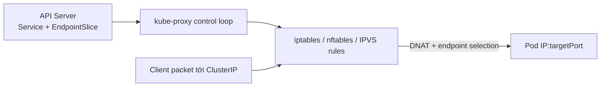
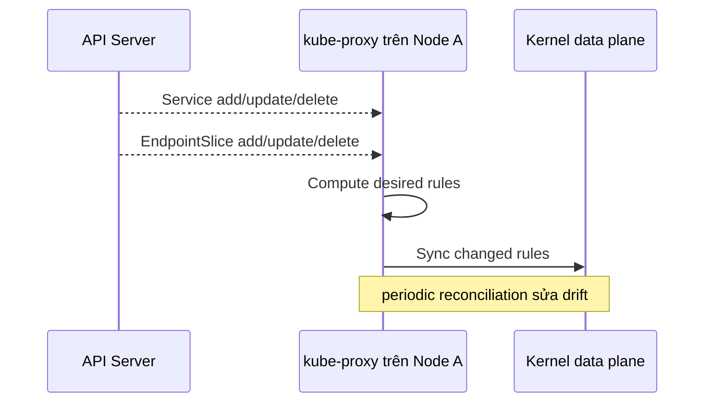

# kube-proxy và Service Routing

## Mục lục

- [Tổng quan](#tổng-quan)
- [1. kube-proxy thực sự làm gì?](#1-kube-proxy-thực-sự-làm-gì)
- [2. Control loop](#2-control-loop)
- [3. Packet flow qua Service VIP](#3-packet-flow-qua-service-vip)
- [4. iptables mode](#4-iptables-mode)
- [5. nftables mode](#5-nftables-mode)
- [6. IPVS mode và deprecation](#6-ipvs-mode-và-deprecation)
- [7. Windows kernelspace mode](#7-windows-kernelspace-mode)
- [8. Kube-proxy replacement](#8-kube-proxy-replacement)
- [9. Conntrack và long-lived connection](#9-conntrack-và-long-lived-connection)
- [10. Traffic policy và terminating endpoint](#10-traffic-policy-và-terminating-endpoint)
- [11. Health, metrics và sync](#11-health-metrics-và-sync)
- [12. Production configuration](#12-production-configuration)
- [13. Quan sát data plane an toàn](#13-quan-sát-data-plane-an-toàn)
- [14. Troubleshooting](#14-troubleshooting)
- [15. Best practices](#15-best-practices)
- [Tài liệu tham khảo](#tài-liệu-tham-khảo)

---

## Tổng quan

kube-proxy là service proxy mặc định của Kubernetes. Mỗi Node chạy một instance watch Service và EndpointSlice rồi program kernel để traffic tới Service VIP/NodePort được chuyển tới backend.

Tên `proxy` dễ gây hiểu nhầm: trên Linux hiện đại, kube-proxy thường không nhận từng packet trong userspace. Nó tạo netfilter/IPVS rules; kernel xử lý data path.



Cluster có thể không chạy kube-proxy nếu CNI/service proxy khác thay thế đầy đủ. Trước khi debug, xác định implementation thật.

## 1. kube-proxy thực sự làm gì?

Mỗi kube-proxy:

1. Watch Service.
2. Watch EndpointSlice.
3. Lọc endpoint theo readiness, topology và traffic policy.
4. Tạo/update/delete data-plane rule trên Node.
5. Reconcile định kỳ nếu rule bị component khác sửa.
6. Expose health/metrics.

kube-proxy không:

- Tạo Pod interface/route cross-node — CNI làm.
- Tạo DNS record — CoreDNS làm.
- Route HTTP theo host/path — Gateway/Ingress làm.
- Chạy readiness probe — kubelet làm.
- Tạo cloud load balancer — cloud/LB controller làm.

## 2. Control loop



Có propagation delay:

```text
Pod Ready
→ EndpointSlice update
→ watch event tới từng Node
→ kube-proxy sync
→ connection mới dùng endpoint
```

EndpointSlice đúng nhưng Service tạm chưa route trên một Node có thể là sync lag hoặc kube-proxy lỗi trên Node đó.

## 3. Packet flow qua Service VIP

Service:

```yaml
spec:
  clusterIP: 10.96.20.30
  ports:
    - port: 80
      targetPort: 8080
```

Endpoint `10.244.2.18:8080`.

```text
Original packet
src=10.244.1.10:45000 dst=10.96.20.30:80

Service rule chọn endpoint + DNAT
src=10.244.1.10:45000 dst=10.244.2.18:8080

Reply được conntrack reverse-NAT
client thấy peer là 10.96.20.30:80
```

### 3.1 Service IP không nằm trên interface

Không cần `ip addr` thấy ClusterIP. Kernel rule intercept destination. Vì thế `ping` không phải test phù hợp; dùng protocol/port Service.

### 3.2 Endpoint selection theo connection

TCP flow được conntrack giữ mapping. Nhiều HTTP request trên một keep-alive connection tiếp tục tới cùng Pod. kube-proxy không rebalance connection đang tồn tại khi endpoint mới xuất hiện.

### 3.3 Hairpin traffic

Pod gọi Service và được chọn chính nó làm backend. CNI/proxy phải support hairpin/NAT để reply đúng. Hairpin lỗi có pattern Pod gọi Pod IP chính nó được nhưng gọi Service VIP không được khi VIP chọn lại chính Pod.

## 4. iptables mode

iptables mode khả dụng trên Linux và là mode phổ biến lâu đời. kube-proxy tạo chain/rule netfilter để:

- Match ClusterIP/port.
- Match NodePort/external address.
- Chọn endpoint, thường xác suất ngẫu nhiên.
- DNAT destination.
- SNAT/masquerade khi path yêu cầu.

### 4.1 Scale behavior

Rule count tăng theo Service và endpoint. Cluster hàng chục nghìn Service/Pod có thể gặp:

- Sync rule lâu.
- CPU spike khi endpoint churn.
- Packet traversal/update cost.

Từ Kubernetes v1.28, iptables mode tối ưu update theo phần thay đổi thay vì luôn rewrite toàn bộ. Advice cũ tăng `minSyncPeriod` rất lớn có thể không còn phù hợp.

### 4.2 `minSyncPeriod` và `syncPeriod`

- `minSyncPeriod`: khoảng tối thiểu giữa các lần sync do event; tăng giúp batch change nhưng tăng stale window.
- `syncPeriod`: reconciliation định kỳ/cleanup/drift detection, không đơn thuần là endpoint update interval.

Giữ default trước khi metric chứng minh cần tuning. Tuning theo version đang chạy, không theo blog cũ.

### 4.3 Quan sát

```bash
sudo iptables-save | grep -E 'KUBE-SVC|KUBE-SEP|KUBE-NODEPORT'
```

Tên chain là implementation detail của kube-proxy iptables mode; không dùng để detect Service trong replacement khác.

## 5. nftables mode

nftables proxy mode stable từ Kubernetes v1.33 và cần Linux kernel 5.13+. Nó dùng nftables API, successor của iptables, với update và lookup hiệu quả hơn ở scale lớn.

### 5.1 Lợi ích

- Incremental update hiệu quả.
- Data structure phù hợp set/map hơn.
- Packet processing tốt hơn ở số Service lớn.
- Được định hướng thay thế IPVS và là lựa chọn migration trên Linux đủ mới.

### 5.2 Compatibility

Mode còn tương đối mới so với iptables; CNI, firewall tooling và distribution phải support. Đừng chỉ đổi `mode: nftables` trên production.

### 5.3 Khác biệt migration quan trọng

- NodePort mặc định có thể chỉ trên primary Node IP (`nodePortAddresses: primary`) thay vì mọi local IP như iptables default phổ biến.
- NodePort qua `127.0.0.1` không hoạt động như một số iptables setup.
- nftables mode không tự thêm accept rule để làm việc quanh host firewall aggressive; admin phải mở NodePort range.
- Conntrack workaround khác; kernel cũ trước 6.1 có thể cần đánh giá `conntrack-tcp-be-liberal` theo metric/docs.

Quan sát:

```bash
sudo nft list ruleset
```

Không chỉnh rule kube-proxy-owned thủ công.

## 6. IPVS mode và deprecation

IPVS mode deprecated từ Kubernetes v1.35. Nó từng được dùng vì lookup/sync tốt hơn iptables và có nhiều scheduler, nhưng kernel IPVS API không khớp đầy đủ semantics Service, dẫn tới edge case không thể hiện thực chính xác.

nftables mode được khuyến nghị làm hướng thay thế cho IPVS trên Linux hỗ trợ. Nếu kernel quá cũ, iptables hiện đại cũng là lựa chọn cần đánh giá thay vì mặc định giữ IPVS.

### 6.1 Không migrate vội

Migration IPVS → nftables/iptables ảnh hưởng toàn Service data plane. Cần test:

- ClusterIP/NodePort/LoadBalancer.
- TCP/UDP/SCTP đang dùng.
- Session affinity.
- external/internal traffic policy.
- Source IP.
- Dual-stack.
- Health check.
- CNI compatibility.

## 7. Windows kernelspace mode

Windows dùng `kernelspace` mode với Virtual Filtering Platform (VFP) và Host Networking Service. Semantics/tool khác Linux; không dùng iptables/nftables runbook trên Windows Node.

Direct server return (DSR) có thể tối ưu path nếu version/feature gate/config support. Cluster mixed OS cần runbook riêng theo Node OS.

## 8. Kube-proxy replacement

CNI eBPF hoặc service mesh/data-plane solution có thể thay kube-proxy.

Kiểm tra:

```bash
kubectl get daemonset -n kube-system kube-proxy
kubectl get pod -n kube-system -l k8s-app=kube-proxy -o wide
```

Không có DaemonSet chưa đủ kết luận; đọc cluster bootstrap/CNI config.

Replacement phải xử lý API semantics cần dùng:

- ClusterIP.
- NodePort/LoadBalancer.
- EndpointSlice conditions.
- SessionAffinity.
- Traffic policies/distribution.
- Dual-stack.
- Terminating endpoint.

Troubleshooting phải dùng tool/metric của replacement. `iptables-save` rỗng có thể hoàn toàn bình thường.

## 9. Conntrack và long-lived connection

Linux conntrack lưu state NAT/flow. Vấn đề phổ biến:

- Table đầy → flow mới drop.
- Stale UDP entry → DNS/UDP chập chờn.
- Long-lived TCP tiếp tục tới endpoint cũ.
- Asymmetric routing làm reply không match state.
- Kernel bug/config timeout.

Quan sát Node:

```bash
sudo conntrack -S
sysctl net.netfilter.nf_conntrack_count
sysctl net.netfilter.nf_conntrack_max
ss -s
```

Không flush conntrack production toàn Node: sẽ ngắt lượng lớn connection. Chỉ dùng targeted operational procedure sau khi xác định impact.

### 9.1 UDP

UDP không có handshake nên conntrack dùng timeout. DNS query hoặc UDP Service có thể gặp behavior khác TCP. Test đúng protocol; `curl` TCP không chứng minh UDP Service hoạt động.

## 10. Traffic policy và terminating endpoint

### 10.1 Internal traffic policy

`internalTrafficPolicy: Local` chỉ dùng endpoint trên cùng Node; không có local endpoint thì drop. Đây là semantics chủ đích, không phải kube-proxy bug.

### 10.2 External traffic policy

`externalTrafficPolicy: Local` chỉ route external traffic tới local endpoint, giúp giữ source IP/giảm hop. LB phải health-check Node có local endpoint.

### 10.3 Terminating endpoint

Với `ProxyTerminatingEndpoints` stable từ Kubernetes v1.28, khi policy Local và mọi local endpoint đều terminating, kube-proxy có thể tiếp tục forward tới endpoint serving+terminating để drain trong khoảng LB health check hội tụ.

Application vẫn cần graceful termination; feature không cứu process exit ngay.

### 10.4 Traffic distribution

Service `trafficDistribution` đưa preference same-zone/same-node vào endpoint selection nếu proxy/version support. Strict `Local` policy ưu tiên hơn preference.

## 11. Health, metrics và sync

kube-proxy expose health endpoint thường ở port `10256`:

- `/healthz`: readiness/programming progress và Node deletion semantics.
- `/livez`: liveness, không coi Node deletion là lỗi.

Không dùng `/healthz` làm liveness probe trong logic Node deletion vì kube-proxy có chủ đích trả 503 để LB drain.

Metrics đáng chú ý theo version:

- Sync proxy rules duration.
- Last queued/sync timestamps.
- Healthz/livez result count.
- Endpoint/service change.
- Conntrack-related metrics.
- iptables localhost NodePort acceptance khi migration.

Tên metric có thể đổi; kiểm tra `/metrics` đúng version.

## 12. Production configuration

kube-proxy thường chạy DaemonSet với ConfigMap:

```bash
kubectl get daemonset kube-proxy -n kube-system -o yaml
kubectl get configmap kube-proxy -n kube-system -o yaml
```

Managed Kubernetes có thể ẩn/lock config hoặc dùng replacement.

Checklist:

- Mode support kernel/CNI.
- `clusterCIDR` đúng để masquerade.
- NodePort address scope đúng interface.
- Conntrack max/timeouts theo load.
- Health/metrics scraped.
- Resource request tránh CPU starvation.
- Upgrade skew support với API server.
- DaemonSet ready trên mọi schedulable Node.

Không tune conntrack/sync theo một Node duy nhất; quản lý qua node bootstrap/automation.

## 13. Quan sát data plane an toàn

Bắt đầu read-only:

```bash
kubectl get svc SERVICE -n NS -o yaml
kubectl get endpointslice -n NS \
  -l kubernetes.io/service-name=SERVICE -o yaml
kubectl get pod -n kube-system -l k8s-app=kube-proxy -o wide
kubectl logs -n kube-system POD_NAME --since=15m
```

Trên Node client:

```bash
sudo nft list ruleset
sudo iptables-save
sudo ipvsadm -Ln
sudo conntrack -S
ip route
```

Chạy lệnh tương ứng mode; tool khác có thể trống bình thường.

### 13.1 Test theo Node client

Một Service fail chỉ từ Pod trên Node A thường chỉ tới kube-proxy/data plane Node A. Schedule debug Pod lên nhiều Node và so sánh.

```yaml
spec:
  nodeName: worker-a
```

`nodeName` chỉ phù hợp lab/debug có kiểm soát; xóa Pod sau test.

## 14. Troubleshooting

### 14.1 Pod IP trực tiếp hoạt động, ClusterIP không

Khả năng cao Service layer:

1. Service port/protocol đúng?
2. EndpointSlice ready và target port đúng?
3. kube-proxy/replacement healthy trên Node client?
4. Rule có Service VIP?
5. Conntrack/data-plane error?

### 14.2 ClusterIP lỗi chỉ trên một Node

```bash
kubectl get pod -n kube-system -l k8s-app=kube-proxy -o wide
kubectl logs -n kube-system KUBE_PROXY_POD --since=30m
```

So sánh config/rule/kernel module/agent Node lỗi và Node tốt.

### 14.3 Service mới mất lâu mới hoạt động

Kiểm tra API watch connectivity, proxy sync duration, queue, CPU throttling và EndpointSlice churn. Không tăng `syncPeriod` ngẫu nhiên.

### 14.4 NodePort không reachable

- NodePort allocated?
- `nodePortAddresses` gồm IP đang gọi?
- Host firewall/security group mở?
- nftables mode primary-IP behavior?
- `externalTrafficPolicy: Local` có local endpoint?
- Client có route tới Node?

### 14.5 Một endpoint vẫn nhận traffic sau khi NotReady

Connection cũ có thể còn mapping. Test connection mới, xem EndpointSlice conditions và sync lag. Long-lived HTTP/2/gRPC không rebalance ngay.

### 14.6 Random connection drop ở tải cao

Kiểm tra conntrack count/max, port exhaustion, CPU, packet drop, CNI route và Node NIC. Service rule đúng không loại trừ resource saturation.

### 14.7 IPVS mode behavior lạ sau upgrade

IPVS deprecated và có known semantic mismatch. Đọc release note; lập migration được test sang nftables/iptables thay vì chỉ đổi scheduler.

### 14.8 nftables migration làm NodePort secondary IP mất

Đây có thể là default `nodePortAddresses: primary`. Cấu hình explicit CIDR nếu cần và mở firewall tương ứng.

### 14.9 kube-proxy restart không sửa được

Rules thường nằm trong kernel và restart không giải quyết selector/endpoint/CNI/route sai. Trước restart, thu thập log, config, metric và rule snapshot.

## 15. Best practices

- Xác định service proxy thật trước khi dùng iptables/nftables/IPVS tool.
- Kiểm tra EndpointSlice trước data-plane rule.
- Test Service từ Pod trên Node cụ thể để tìm Node-local failure.
- Giữ default sync tuning cho đến khi metric chứng minh bottleneck.
- Monitor kube-proxy availability, sync duration, health và conntrack.
- Không flush conntrack hoặc xóa kernel rule trong production không có runbook.
- Lập kế hoạch rời IPVS vì deprecated; ưu tiên nftables khi kernel/CNI support.
- Test khác biệt NodePort/firewall/source IP trước migration nftables.
- Dùng `/livez` cho liveness và hiểu `/healthz` khi Node deleting.
- Thiết kế graceful termination cho long-lived connection.
- Với replacement, document feature parity, diagnostics và rollback.
- Pin config theo cluster version; không áp dụng advice từ release khác.

Tiếp tục với [Troubleshooting Networking](/networking/network-troubleshooting/) để kết hợp Pod, Service, DNS, policy và entry-point diagnostics thành một flow thống nhất.

---

## Tài liệu tham khảo

- [Virtual IPs and Service Proxies](https://kubernetes.io/docs/reference/networking/virtual-ips/)
- [kube-proxy Configuration API](https://kubernetes.io/docs/reference/config-api/kube-proxy-config.v1alpha1/)
- [Service](https://kubernetes.io/docs/concepts/services-networking/service/)
