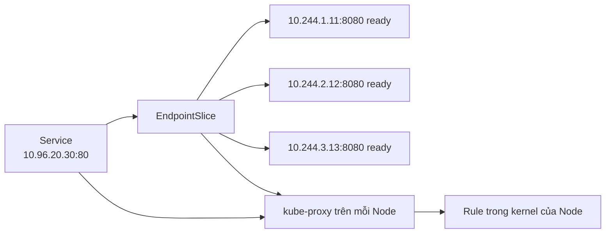
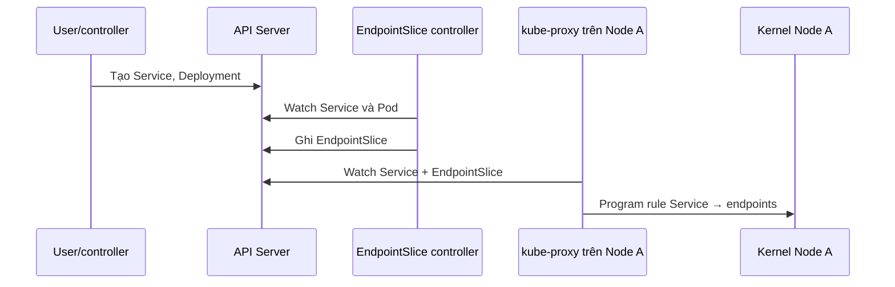
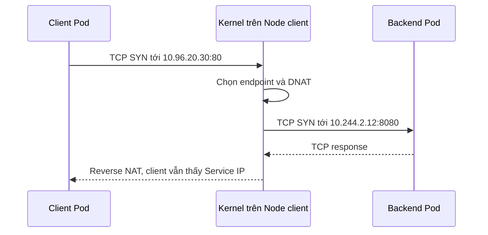
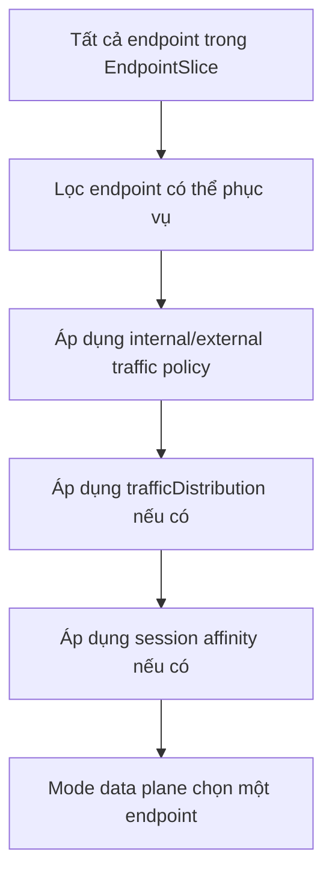

# kube-proxy và Service Routing

## Mục lục

- [kube-proxy giải quyết vấn đề gì?](#kube-proxy-giải-quyết-vấn-đề-gì)
- [Ví dụ xuyên suốt: Service có ba Pod](#ví-dụ-xuyên-suốt-service-có-ba-pod)
- [kube-proxy có thực sự proxy từng packet không?](#kube-proxy-có-thực-sự-proxy-từng-packet-không)
- [Control flow và traffic flow](#control-flow-và-traffic-flow)
- [Một connection đi qua Service như thế nào?](#một-connection-đi-qua-service-như-thế-nào)
- [Service chọn Pod nào?](#service-chọn-pod-nào)
- [Vì sao traffic không chia đều từng request?](#vì-sao-traffic-không-chia-đều-từng-request)
- [Các cấu hình ảnh hưởng đến việc chọn Pod](#các-cấu-hình-ảnh-hưởng-đến-việc-chọn-pod)
- [ClusterIP, NodePort và LoadBalancer khác nhau ở đâu?](#clusterip-nodeport-và-loadbalancer-khác-nhau-ở-đâu)
- [Conntrack dùng để làm gì?](#conntrack-dùng-để-làm-gì)
- [iptables, nftables, IPVS và kernelspace là gì?](#iptables-nftables-ipvs-và-kernelspace-là-gì)
- [Khi cluster không dùng kube-proxy](#khi-cluster-không-dùng-kube-proxy)
- [Readiness, rollout và connection draining](#readiness-rollout-và-connection-draining)
- [Thực hành: quan sát Service chọn backend](#thực-hành-quan-sát-service-chọn-backend)
- [Troubleshooting theo từng lớp](#troubleshooting-theo-từng-lớp)
- [Vận hành kube-proxy trong production](#vận-hành-kube-proxy-trong-production)
- [Tóm tắt](#tóm-tắt)
- [Tài liệu tham khảo](#tài-liệu-tham-khảo)

---

## kube-proxy giải quyết vấn đề gì?

Giả sử Deployment có ba Pod:

```text
api-a → 10.244.1.11:8080
api-b → 10.244.2.12:8080
api-c → 10.244.3.13:8080
```

Pod có thể bị xóa, được tạo lại hoặc đổi IP trong rollout. Client không nên giữ danh sách Pod IP này. Thay vào đó, client gọi một địa chỉ ổn định của Service:

```text
api.production.svc.cluster.local:80
                 ↓ DNS
          10.96.20.30:80
```

`10.96.20.30` là `ClusterIP` của Service. Nhưng địa chỉ này thường không được gắn vào card mạng của một máy cụ thể. Vậy khi packet tới `10.96.20.30:80`, thành phần nào chuyển nó tới một Pod thật?

**kube-proxy hiện thực cơ chế virtual IP của Service.** Nó làm cho traffic gửi tới:

```text
Service ClusterIP:port
```

được chuyển thành traffic tới:

```text
một endpoint ready:targetPort
```

Ví dụ:

```text
10.96.20.30:80
      ↓ chọn một backend
10.244.2.12:8080
```

Trên Linux, kube-proxy thường không tự nhận rồi copy từng packet. Nó cấu hình rule trong kernel; kernel mới là thành phần xử lý traffic thực tế.

> [!IMPORTANT]
> Service object chỉ mô tả địa chỉ, port, selector và policy. Service object không phải một process đang listen. kube-proxy hoặc một service proxy thay thế phải biến mô tả đó thành data plane có thể chuyển packet.

Nếu chưa rõ Service tạo EndpointSlice như thế nào, nên đọc [Service](/networking/service/) và [EndpointSlice](/networking/endpoints-endpointslices/) trước.

## Ví dụ xuyên suốt: Service có ba Pod

Service:

```yaml
apiVersion: v1
kind: Service
metadata:
  name: api
  namespace: production
spec:
  selector:
    app: api
  ports:
    - name: http
      port: 80
      targetPort: 8080
```

Các Pod ready:

```text
api-a  10.244.1.11:8080
api-b  10.244.2.12:8080
api-c  10.244.3.13:8080
```

EndpointSlice controller ghi danh sách backend vào EndpointSlice. kube-proxy trên mỗi Node watch Service và EndpointSlice, rồi chuẩn bị rule tương ứng:



Khi một client mở connection tới `10.96.20.30:80`, rule trên **Node nơi packet đi qua** chọn một endpoint, ví dụ `10.244.2.12:8080`, rồi đổi destination của packet sang endpoint đó.

Một cách nhớ ngắn gọn:

```text
Service giữ địa chỉ ổn định
EndpointSlice giữ danh sách backend
kube-proxy program cách đi từ Service tới backend
kernel chuyển packet
```

## kube-proxy có thực sự proxy từng packet không?

Tên `kube-proxy` dễ tạo hình ảnh sau:

```text
Client → tiến trình kube-proxy → Pod
```

Đây không phải mental model chính xác trên Linux hiện đại. Với các mode phổ biến:

```text
                 control flow
kube-proxy ─────────────────────→ cấu hình rule trong kernel

                 traffic flow
Client packet ──────────────────→ kernel rule ──→ Pod
```

kube-proxy chạy control loop:

1. Watch Service.
2. Watch EndpointSlice.
3. Tính tập backend hợp lệ.
4. Tạo hoặc cập nhật rule trên Node.
5. Reconcile lại khi API state thay đổi hoặc rule bị drift.

Sau khi rule tồn tại, kernel có thể xử lý packet mà không đưa từng packet qua userspace process kube-proxy.

Hệ quả quan trọng:

- kube-proxy dùng CPU khi watch và cập nhật rule, không nhất thiết dùng CPU tương ứng với mọi byte traffic.
- kube-proxy restart không đồng nghĩa mọi connection hiện có lập tức dừng; rule và conntrack state có thể vẫn nằm trong kernel.
- kube-proxy bị lỗi lâu sẽ làm rule trở nên cũ khi Pod/Service thay đổi, dù một số Service cũ vẫn tạm hoạt động.
- Restart kube-proxy không sửa được selector, readiness, `targetPort` hoặc CNI route sai.

Trên Windows, mode `kernelspace` dùng Windows networking APIs thay vì iptables/nftables, nhưng mental model vẫn tương tự: kube-proxy program data plane, kernel xử lý traffic.

## Control flow và traffic flow

Tách hai flow giúp tránh nhầm API server nằm trên đường đi của request.

### Control flow: chuẩn bị rule



Control flow xảy ra khi resource hoặc endpoint thay đổi. API server không xử lý request ứng dụng.

### Traffic flow: vận chuyển connection



Traffic flow không cần gọi API server cho từng connection. Vì vậy API server đang bận không nhất thiết làm connection Service hiện có dừng ngay, nhưng data plane sẽ không theo kịp endpoint mới nếu watch/sync bị gián đoạn lâu.

### Có độ trễ hội tụ

Khi Pod vừa Ready:

```text
Pod readiness đổi
→ EndpointSlice được cập nhật
→ kube-proxy trên từng Node nhận watch event
→ rule kernel được sync
→ connection mới có thể chọn Pod đó
```

Chuỗi này cần thời gian, thường ngắn nhưng không bằng không. Nếu EndpointSlice đã đúng mà chỉ một Node chưa route được, có thể kube-proxy hoặc service data plane trên Node đó chưa hội tụ.

## Một connection đi qua Service như thế nào?

Giả sử client `10.244.1.20` mở TCP connection tới Service `10.96.20.30:80`, và backend được chọn là `10.244.2.12:8080`.

Packet ban đầu:

```text
source      = 10.244.1.20:45000
destination = 10.96.20.30:80
```

Rule Service chọn endpoint rồi thực hiện **DNAT** — Destination Network Address Translation:

```text
source      = 10.244.1.20:45000
destination = 10.244.2.12:8080
```

Hai thứ đã thay đổi:

- Service IP `10.96.20.30` thành Pod IP `10.244.2.12`.
- Service port `80` thành endpoint port `8080`.

Response từ Pod đi qua reverse NAT để client tiếp tục thấy peer là Service:

```text
Client nghĩ mình đang nói chuyện với 10.96.20.30:80
Backend thực sự là 10.244.2.12:8080
```

Kube-proxy không thay application protocol. Nếu Service khai báo TCP, data plane chỉ xử lý flow TCP; nó không đọc HTTP path, header hoặc cookie. Routing theo HTTP host/path thuộc Ingress hoặc Gateway API.

### ClusterIP không cần xuất hiện trong `ip addr`

ClusterIP là virtual IP do packet-processing rule hiện thực. Không thấy `10.96.20.30` trên interface không phải lỗi.

Tương tự, `ping` ClusterIP không phải kiểm tra phù hợp vì Service chỉ mô tả protocol và port cụ thể. Hãy test đúng port:

```bash
curl http://10.96.20.30:80/
```

hoặc dùng DNS Service:

```bash
curl http://api.production/
```

## Service chọn Pod nào?

Không phải mọi Pod match selector đều lập tức được chọn. Có thể hình dung việc chọn backend theo các bước sau:



### Bước 1: lấy endpoint từ EndpointSlice

Service selector không được kube-proxy dùng để quét Pod trực tiếp. EndpointSlice controller đã chuyển selector, Pod IP, port và readiness thành EndpointSlice.

Kiểm tra nguồn backend:

```bash
kubectl get endpointslice -n production \
  -l kubernetes.io/service-name=api -o yaml
```

### Bước 2: loại endpoint không phù hợp

Trong flow thông thường, connection mới ưu tiên endpoint ready và không terminating. Pod `Running` nhưng readiness fail thường không nhận Service traffic mới.

`publishNotReadyAddresses: true` và terminating endpoint draining tạo ngoại lệ có chủ đích. Không bật chúng chỉ để che readiness sai.

### Bước 3: áp dụng locality policy

`internalTrafficPolicy` và `externalTrafficPolicy` có thể giới hạn chỉ endpoint local trên Node. `trafficDistribution` có thể ưu tiên cùng Node hoặc cùng zone mà vẫn có fallback.

### Bước 4: áp dụng session affinity

Nếu Service dùng `sessionAffinity: ClientIP`, các connection mới từ cùng client IP được cố gắng đưa lại cùng endpoint trong thời gian affinity còn hiệu lực.

### Bước 5: chọn một endpoint

Với `iptables` và `nftables` mode mặc định, backend được chọn theo cơ chế ngẫu nhiên/xác suất trong rule. Kube-proxy không đảm bảo chuỗi cố định:

```text
A → B → C → A → B → C
```

và cũng không cam kết mỗi Pod nhận đúng một phần ba số HTTP request.

> [!IMPORTANT]
> Kubernetes Service API không cung cấp một field portable để application chọn `least_connections`, weighted round-robin hoặc cân bằng theo CPU. IPVS từng có nhiều scheduler ở cấu hình kube-proxy cấp cluster, nhưng IPVS mode đã deprecated từ Kubernetes v1.35. Nếu cần routing L7 hoặc traffic weight theo route/backend, dùng Gateway API, Ingress/controller phù hợp hoặc service mesh.

## Vì sao traffic không chia đều từng request?

Điểm dễ nhầm nhất là Service thường chọn backend ở **cấp connection/flow**, không phải từng HTTP request.

### Nhiều connection ngắn

```text
TCP connection 1 → api-a
TCP connection 2 → api-c
TCP connection 3 → api-b
TCP connection 4 → api-a
```

Với số lượng connection lớn và backend tương đương, phân phối có thể gần đều. Với sample nhỏ, ngẫu nhiên tạo chênh lệch là bình thường.

### HTTP keep-alive

Một TCP connection có thể chứa nhiều HTTP request:

```text
TCP connection 1 → api-a
├── HTTP request 1
├── HTTP request 2
├── HTTP request 3
└── HTTP request 4
```

Service chỉ chọn `api-a` khi connection được thiết lập. Các request sau dùng lại connection đó vẫn tới `api-a`.

### HTTP/2 và gRPC

HTTP/2 multiplex nhiều stream trên một connection. Một gRPC client có thể giữ connection hàng giờ:

```text
1 gRPC channel → 1 backend Pod → rất nhiều RPC
```

Thêm Pod mới không làm channel đang tồn tại tự chuyển sang Pod mới. Client phải tạo connection/channel mới hoặc có client-side load balancing phù hợp.

### WebSocket và streaming

WebSocket, SSE và streaming request là connection dài. Số connection có thể chia khá đều nhưng workload trên mỗi connection khác nhau; một Pod vẫn có thể nhận nhiều tải hơn.

### Session affinity và NAT

`ClientIP` affinity cố ý làm traffic sticky. Nếu nhiều người dùng đi qua cùng NAT hoặc proxy, service proxy có thể thấy cùng source IP và dồn họ vào một Pod.

### Pod có tốc độ xử lý khác nhau

iptables/nftables không tự biết Pod nào đang dùng CPU cao hoặc có queue dài. Readiness thường chỉ cho biết “có thể nhận traffic”, không phải “đang nhàn nhất”. Một Pod chậm nhưng vẫn Ready tiếp tục được chọn.

Vì vậy “ba Pod mà traffic không đúng 33/33/33” chưa đủ để kết luận kube-proxy lỗi. Cần kiểm tra:

- Đếm request hay connection?
- Client có reuse connection không?
- Có gRPC/WebSocket không?
- `sessionAffinity` có bật không?
- Source IP có bị NAT/proxy gom lại không?
- Traffic policy/distribution có ưu tiên locality không?
- Mọi endpoint có Ready trong cùng khoảng thời gian không?

## Các cấu hình ảnh hưởng đến việc chọn Pod

### Không cấu hình đặc biệt

```yaml
spec:
  sessionAffinity: None
  internalTrafficPolicy: Cluster
  externalTrafficPolicy: Cluster
```

Connection có thể được đưa tới ready endpoint trong toàn cluster. Đây là mental model mặc định.

### `sessionAffinity: ClientIP`

```yaml
spec:
  sessionAffinity: ClientIP
  sessionAffinityConfig:
    clientIP:
      timeoutSeconds: 10800
```

Mục tiêu là giữ các connection từ cùng source IP tới cùng Pod trong khoảng timeout.

Phù hợp khi ứng dụng legacy cần stickiness tạm thời. Hạn chế:

- Không sticky theo user hoặc cookie.
- NAT có thể gom nhiều client thành một IP.
- Proxy/mesh có thể làm source trở thành proxy IP.
- Endpoint mất vẫn phá affinity.
- Không thay thế shared session store.

### `internalTrafficPolicy`

```yaml
spec:
  internalTrafficPolicy: Local
```

Với `Local`, traffic nội bộ chỉ chọn endpoint trên cùng Node với nguồn. Không có local endpoint thì traffic bị drop; kube-proxy không fallback ra Node khác.

So sánh:

| Giá trị | Endpoint được phép | Trade-off |
|---|---|---|
| `Cluster` | Ready endpoint toàn cluster | Có thể thêm cross-node hop |
| `Local` | Chỉ ready endpoint cùng Node | Có thể black hole và load imbalance |

Không dùng `Local` chỉ để “tối ưu latency” nếu workload không bảo đảm mỗi Node client đều có backend local.

### `externalTrafficPolicy`

```yaml
spec:
  externalTrafficPolicy: Local
```

Áp dụng cho traffic ngoài cluster đi qua NodePort/LoadBalancer:

- `Cluster`: Node nhận traffic có thể chuyển tới Pod trên Node khác.
- `Local`: Node chỉ chuyển tới Pod local, thường giúp giữ source IP tốt hơn và bỏ cross-node hop.

Với `Local`, load balancer phải health-check và loại Node không có local endpoint. Nếu Node A có ba Pod còn Node B có một Pod, LB chia theo Node có thể khiến một Pod trên Node B nhận tải lớn hơn từng Pod trên Node A.

### `trafficDistribution`

Đây là **preference**, không phải giới hạn chặt như `Local`:

```yaml
spec:
  trafficDistribution: PreferSameZone
```

Các giá trị khả dụng phụ thuộc version/service proxy. Kubernetes hiện đại có thể hỗ trợ `PreferSameZone` và `PreferSameNode`; `PreferClose` là tên cũ của cùng-zone behavior.

Ví dụ `PreferSameZone`:

```text
Client zone A
├── có endpoint zone A → ưu tiên chúng
└── không có endpoint zone A → fallback endpoint zone khác
```

Locality giảm latency và cross-zone cost nhưng có thể làm endpoint trong một zone quá tải. Cần kết hợp topology spread và capacity theo từng zone.

### Thứ tự ưu tiên cần nhớ

```text
Local policy là ràng buộc chặt
→ ưu tiên hơn trafficDistribution

trafficDistribution là preference
→ có thể fallback khi không có endpoint gần
```

## ClusterIP, NodePort và LoadBalancer khác nhau ở đâu?

kube-proxy có thể tham gia nhiều entry point, nhưng đích cuối vẫn là một endpoint Pod.

### ClusterIP

```text
Client trong cluster
→ ClusterIP:port
→ service rule trên Node client
→ PodIP:targetPort
```

Đây là flow đơn giản nhất để hiểu Service routing.

### NodePort

```text
Client
→ NodeIP:NodePort
→ service rule trên Node nhận packet
→ một Pod endpoint
```

Với traffic policy `Cluster`, Pod có thể nằm trên Node khác. Với `Local`, chỉ Pod trên Node nhận packet được chọn.

### LoadBalancer

Một flow phổ biến:

```text
External client
→ cloud/external load balancer
→ NodeIP:NodePort
→ kube-proxy rule
→ Pod endpoint
```

Nhưng đây không phải đường đi bắt buộc. Một số provider/CNI cho load balancer target trực tiếp Pod IP hoặc dùng data plane khác. Vì vậy hãy xác định implementation thật thay vì mặc định mọi LoadBalancer đều qua NodePort.

### Ingress hoặc Gateway

```text
Client
→ Ingress/Gateway data plane
→ Service hoặc EndpointSlice backend
→ Pod
```

Ingress/Gateway chọn route bằng host/path/header ở L7. kube-proxy chỉ tham gia nếu controller gọi qua Service VIP; một số controller đọc EndpointSlice và gọi Pod trực tiếp.

Xem [Service Types](/networking/service-types/) để hiểu entry point và source IP trade-off chi tiết hơn.

## Conntrack dùng để làm gì?

Sau khi connection được map tới một Pod, Linux cần nhớ mapping đó để mọi packet tiếp theo đi cùng backend và response được reverse NAT đúng. Conntrack là bảng state thực hiện vai trò này.

Hình dung một entry:

```text
10.244.1.20:45000 → 10.96.20.30:80
                       mapped to
                    10.244.2.12:8080
```

Nhờ conntrack:

- Packet tiếp theo trong connection không chọn lại Pod khác.
- Response từ Pod được đổi ngược để client vẫn thấy Service IP.
- TCP flow giữ backend nhất quán.

### Khi endpoint thay đổi

Nếu `api-b` bị loại khỏi EndpointSlice:

- Connection mới không nên chọn `api-b` sau khi rule hội tụ.
- Connection cũ có thể vẫn giữ mapping tới `api-b`.
- Nếu process `api-b` đã chết, connection cũ có thể reset hoặc timeout.

Đây là lý do rollout cần graceful termination và drain; chỉ thay readiness không tự di chuyển connection đã thiết lập.

### Khi conntrack gặp vấn đề

Triệu chứng có thể gồm:

- Connection mới bị drop khi table đầy.
- UDP/DNS chập chờn do timeout/state.
- Connection dài tiếp tục dùng endpoint cũ.
- Asymmetric routing làm packet không khớp state.

Quan sát trên Node:

```bash
sudo conntrack -S
sysctl net.netfilter.nf_conntrack_count
sysctl net.netfilter.nf_conntrack_max
ss -s
```

Không chạy `conntrack -F` trên production để “thử sửa”. Flush toàn bảng có thể ngắt rất nhiều connection của mọi workload trên Node.

## iptables, nftables, IPVS và kernelspace là gì?

Đây là **proxy mode** — cách kube-proxy yêu cầu hệ điều hành hiện thực Service routing. Application developer thường không chọn mode cho từng Service; cluster administrator chọn mode cho toàn data plane Node.

| Mode | Nền tảng | Trạng thái/ý nghĩa |
|---|---|---|
| `iptables` | Linux | Mode lâu đời, phổ biến; chọn endpoint bằng rule netfilter |
| `nftables` | Linux kernel 5.13+ | Stable từ Kubernetes v1.33; update/lookup tốt hơn ở scale lớn |
| `ipvs` | Linux | Deprecated từ Kubernetes v1.35 |
| `kernelspace` | Windows | Dùng Windows VFP/HNS để hiện thực Service routing |

### iptables

kube-proxy tạo các chain/rule để:

1. Match Service IP và port.
2. Chọn endpoint theo xác suất.
3. DNAT tới endpoint.
4. SNAT/masquerade khi network path cần.

Quan sát read-only trên Node:

```bash
sudo iptables-save | grep -E 'KUBE-SVC|KUBE-SEP|KUBE-NODEPORT'
```

Rule count tăng theo số Service và endpoint. Từ Kubernetes v1.28, iptables mode cập nhật phần thay đổi hiệu quả hơn trước. Không áp dụng tuning `minSyncPeriod` từ blog cũ nếu chưa xem metric và version hiện tại.

### nftables

nftables là successor của iptables và dùng data structure phù hợp hơn cho tập/map lớn. Lợi ích rõ hơn ở cluster có rất nhiều Service/endpoint.

Quan sát:

```bash
sudo nft list ruleset
```

Migration không chỉ là đổi một field. Cần kiểm tra CNI, kernel và khác biệt NodePort/firewall. Ví dụ nftables mode mặc định có thể chỉ nhận NodePort trên primary Node IP, trong khi iptables setup cũ thường nhận trên nhiều local IP hơn.

### IPVS

IPVS từng được dùng vì hiệu năng và có nhiều scheduler như round-robin hoặc least-connection. Tuy nhiên kernel IPVS API không khớp đầy đủ mọi semantics của Kubernetes Service, nên mode này deprecated từ Kubernetes v1.35.

Không chuyển sang IPVS chỉ để lấy một scheduler. Với cluster mới, đánh giá nftables khi kernel/CNI hỗ trợ; với cluster cũ, iptables hiện đại vẫn là lựa chọn hợp lệ.

### kernelspace trên Windows

Windows không dùng iptables/nftables. kube-proxy program Virtual Filtering Platform và Host Networking Service. Dùng runbook/tool Windows; không chạy lệnh Linux để kết luận data plane Windows lỗi.

### Mode nào đang chạy?

Trong cluster kubeadm hoặc cluster tự quản lý:

```bash
kubectl get daemonset kube-proxy -n kube-system -o yaml
kubectl get configmap kube-proxy -n kube-system -o yaml
```

Tìm `mode` trong config. Nếu bỏ trống, default phụ thuộc nền tảng/version; tài liệu cấu hình hiện tại dùng `iptables` trên Linux và `kernelspace` trên Windows.

Managed Kubernetes có thể ẩn cấu hình hoặc không cho sửa. Thay proxy mode là thay đổi hạ tầng toàn cluster, cần compatibility test và rollback, không phải tối ưu cục bộ cho một Service.

## Khi cluster không dùng kube-proxy

Một số CNI/service data plane dùng eBPF hoặc cơ chế riêng để thay kube-proxy:

```text
Service + EndpointSlice
→ CNI service proxy/eBPF agent
→ eBPF maps/kernel hooks
→ Pod endpoint
```

Khi đó:

- Service vẫn tồn tại.
- ClusterIP vẫn hoạt động.
- EndpointSlice vẫn là nguồn backend.
- Không có `KUBE-SVC` iptables chain có thể hoàn toàn bình thường.
- Tool, log và metric phải lấy từ CNI/replacement.

Kiểm tra ban đầu:

```bash
kubectl get daemonset kube-proxy -n kube-system
kubectl get pods -n kube-system -o wide
```

Không thấy kube-proxy chỉ là một tín hiệu. Xem cấu hình bootstrap, CNI docs và platform inventory để xác nhận replacement có bật hay không.

Một replacement hoàn chỉnh phải hỗ trợ các semantics cluster cần:

- ClusterIP, NodePort và LoadBalancer path.
- EndpointSlice readiness/termination.
- Session affinity.
- Internal/external traffic policy.
- Traffic distribution.
- Dual-stack.
- Source IP và graceful drain behavior.

Troubleshooting bằng iptables trên cluster eBPF có thể dẫn tới kết luận sai dù Service hoạt động đúng.

## Readiness, rollout và connection draining

### Pod Ready mới trở thành backend bình thường

Readiness probe thành công làm EndpointSlice cập nhật endpoint thành ready. kube-proxy sau đó sync rule để connection mới có thể chọn Pod.

```text
Pod process start
→ readiness pass
→ EndpointSlice ready=true
→ kube-proxy sync
→ connection mới bắt đầu tới Pod
```

Nếu readiness quá nông, Pod chưa load xong config vẫn vào traffic. Nếu readiness flapping, endpoint liên tục vào/ra data plane và tạo lỗi ngắt quãng.

### Khi Pod terminate

Một rollout tốt cần phối hợp:

```text
Pod bắt đầu terminate
→ endpoint được đánh dấu terminating/not ready
→ service proxy ngừng chọn cho connection mới
→ connection cũ có thời gian drain
→ process exit
→ Pod bị xóa
```

Các thành phần cần được thiết kế cùng nhau:

- Readiness.
- `preStop` nếu application cần tín hiệu trước.
- `terminationGracePeriodSeconds`.
- Application graceful shutdown.
- kube-proxy/controller propagation delay.
- External LB health-check interval.

### Terminating endpoint với traffic policy `Local`

Kubernetes hỗ trợ behavior đặc biệt cho `Local`: nếu Node chỉ còn local endpoint đang terminating, kube-proxy có thể tạm tiếp tục forward tới endpoint đang serving/terminating để external load balancer có thời gian loại Node và drain traffic.

Cơ chế này không cứu được process exit ngay lập tức. Application vẫn cần grace period đủ dài.

## Thực hành: quan sát Service chọn backend

Lab này chứng minh ba điều:

1. Service dùng EndpointSlice làm danh sách backend.
2. Nhiều connection mới có thể đi tới nhiều Pod.
3. Một connection được reuse thường tiếp tục tới cùng Pod.

### 1. Tạo ba backend và một client

```bash
kubectl create namespace proxy-lab
kubectl create deployment echo -n proxy-lab \
  --image=registry.k8s.io/e2e-test-images/agnhost:2.53 -- \
  netexec --http-port=8080
kubectl scale deployment echo -n proxy-lab --replicas=3
kubectl expose deployment echo -n proxy-lab \
  --name=echo --port=80 --target-port=8080
kubectl run client -n proxy-lab \
  --image=curlimages/curl:8.12.1 \
  --command -- sleep 3600
```

Chờ workload sẵn sàng:

```bash
kubectl rollout status deployment/echo -n proxy-lab --timeout=120s
kubectl wait pod/client -n proxy-lab \
  --for=condition=Ready --timeout=120s
```

### 2. Đối chiếu Service và EndpointSlice

```bash
kubectl get service echo -n proxy-lab -o wide
kubectl get pods -n proxy-lab -l app=echo -o wide
kubectl get endpointslice -n proxy-lab \
  -l kubernetes.io/service-name=echo -o wide
```

Ba Pod ready phải xuất hiện dưới dạng endpoint. Nếu Service có ClusterIP nhưng EndpointSlice không có address ready, request không có backend để chọn.

### 3. Tạo nhiều connection mới

Mỗi lần chạy `curl` với `Connection: close` tạo một connection mới:

```bash
kubectl exec client -n proxy-lab -- sh -c '
  for i in 1 2 3 4 5 6 7 8 9 10; do
    curl -sS -H "Connection: close" http://echo/hostname
    echo
  done
'
```

Bạn thường thấy nhiều hostname khác nhau. Không yêu cầu đúng thứ tự round-robin và không yêu cầu mỗi hostname xuất hiện số lần bằng nhau trong chỉ 10 mẫu.

### 4. Quan sát connection reuse

Một invocation của curl gọi cùng URL nhiều lần có thể reuse connection:

```bash
kubectl exec client -n proxy-lab -- \
  curl -sv \
  http://echo/hostname \
  http://echo/hostname \
  http://echo/hostname
```

Trong verbose output, tìm dòng cho biết connection được reuse. Khi server giữ keep-alive, ba response thường đến từ cùng hostname vì Service không chọn lại backend giữa các request trên cùng TCP connection.

Nếu client hoặc server đóng connection, curl sẽ tạo connection mới và backend có thể đổi. Đây chính là điểm cần quan sát, không phải cam kết output luôn giống nhau ở mọi environment.

### 5. Xóa một Pod

Chọn một Pod rồi xóa:

```bash
POD=$(kubectl get pod -n proxy-lab -l app=echo \
  -o jsonpath='{.items[0].metadata.name}')
kubectl delete pod "$POD" -n proxy-lab
```

Quan sát Deployment tạo Pod thay thế và EndpointSlice hội tụ. Chạy hai lệnh ở hai terminal riêng:

```bash
# Terminal 1
kubectl get pods -n proxy-lab -l app=echo --watch
```

```bash
# Terminal 2
kubectl get endpointslice -n proxy-lab \
  -l kubernetes.io/service-name=echo --watch
```

Nhấn `Ctrl+C` sau khi Pod mới Ready. Connection mới sau đó có thể chọn endpoint mới. Connection cũ tới Pod đã bị xóa không tự chuyển backend.

### 6. Cleanup

```bash
kubectl delete namespace proxy-lab
```

## Troubleshooting theo từng lớp

Dùng thứ tự sau thay vì restart kube-proxy ngay:

```text
Application process
→ Pod IP và targetPort
→ readiness
→ EndpointSlice
→ Service port/ClusterIP
→ service proxy trên Node client
→ CNI route/NetworkPolicy
→ conntrack/kernel
```

### Service không có endpoint

```bash
kubectl get service SERVICE -n NAMESPACE -o yaml
kubectl get pods -n NAMESPACE --show-labels
kubectl get endpointslice -n NAMESPACE \
  -l kubernetes.io/service-name=SERVICE -o yaml
```

Kiểm tra selector, Namespace, readiness và named `targetPort`. Đây thường không phải lỗi kube-proxy; kube-proxy không thể route tới backend không tồn tại trong discovery state.

### Gọi Pod IP được nhưng ClusterIP không được

Đây là dấu hiệu tập trung vào Service data plane:

1. Service `port` và protocol đúng không?
2. EndpointSlice có địa chỉ/port ready không?
3. Client đang ở Node nào?
4. Node đó chạy kube-proxy hay replacement khỏe không?
5. Rule cho ClusterIP đã được program chưa?
6. Conntrack hoặc host firewall có lỗi không?

Thu thập:

```bash
kubectl get service SERVICE -n NAMESPACE -o yaml
kubectl get endpointslice -n NAMESPACE \
  -l kubernetes.io/service-name=SERVICE -o yaml
kubectl get pods -n kube-system -o wide
```

### ClusterIP chỉ lỗi từ Pod trên một Node

Nếu cùng Service hoạt động từ Node B nhưng không từ Node A, tập trung Node A:

- kube-proxy/replacement Pod có Ready không?
- Log có watch/sync error không?
- Kernel mode/module có đúng không?
- Host firewall/rule có khác Node tốt không?
- CNI route/NetworkPolicy path có lỗi không?
- Conntrack có đầy không?

So sánh Node lỗi với Node tốt hiệu quả hơn việc chỉ đọc manifest Service.

### Một endpoint vẫn nhận traffic sau khi NotReady

Phân biệt connection mới và connection cũ:

- EndpointSlice `ready: false` nên loại endpoint khỏi lựa chọn cho connection mới sau khi rule hội tụ.
- Conntrack có thể giữ connection cũ tới endpoint đó.
- HTTP/2/gRPC/WebSocket làm connection cũ sống lâu.

Test bằng connection mới có `Connection: close`, đồng thời xem timestamp EndpointSlice và kube-proxy sync/log.

### Traffic không chia đều

Kiểm tra:

```bash
kubectl get service SERVICE -n NAMESPACE -o yaml
kubectl get endpointslice -n NAMESPACE \
  -l kubernetes.io/service-name=SERVICE -o wide
```

Sau đó hỏi:

- Đang đếm request hay TCP connection?
- Client có keep-alive, HTTP/2 hoặc gRPC channel không?
- Có `sessionAffinity: ClientIP` không?
- Có `internalTrafficPolicy: Local` hoặc `externalTrafficPolicy: Local` không?
- Có `trafficDistribution` không?
- Pod có phân bố đều qua Node/zone không?
- Một số endpoint chỉ Ready trong một phần thời gian không?

Đừng thay proxy mode chỉ vì sample 10 request không chia đều.

### NodePort không reachable

Kiểm tra:

- Service có `nodePort` không?
- IP đang gọi có nằm trong `nodePortAddresses` không?
- Host firewall/security group mở port không?
- nftables mode có chỉ nhận primary Node IP không?
- `externalTrafficPolicy: Local` có local endpoint không?
- Client có route tới Node không?

### Connection mới drop ngẫu nhiên khi tải cao

Kiểm tra Node resource và conntrack:

```bash
sudo conntrack -S
sysctl net.netfilter.nf_conntrack_count
sysctl net.netfilter.nf_conntrack_max
ss -s
```

Ngoài ra xem CPU throttling của kube-proxy/replacement, packet drop, CNI health, port exhaustion và Node NIC. Service rule đúng không loại trừ saturation.

### Không thấy iptables rule

Có thể vì:

- Cluster dùng nftables mode.
- Cluster dùng IPVS cũ.
- Node là Windows.
- CNI/eBPF thay kube-proxy.
- Bạn đang kiểm tra sai Node.

Xác định implementation trước khi kết luận rule bị thiếu.

## Vận hành kube-proxy trong production

### Xác định owner và implementation

Platform documentation nên ghi rõ:

- kube-proxy hay replacement nào đang sở hữu Service routing.
- Proxy mode và version.
- CNI compatibility.
- NodePort address/firewall policy.
- Nơi lấy log, metric và diagnostic snapshot.
- Upgrade và rollback procedure.

### Health endpoint

kube-proxy thường expose health server ở port `10256`:

- `/healthz`: readiness/programming progress và có semantics phục vụ load-balancer drain.
- `/livez`: liveness, không coi Node đang bị xóa là lỗi liveness.

Không dùng `/healthz` làm liveness một cách máy móc; Node deletion có thể khiến endpoint này chủ động trả 503 để LB ngừng gửi connection mới.

### Metrics cần theo dõi

Tên metric thay đổi theo version, nhưng cần quan sát các nhóm:

- Thời gian sync proxy rules.
- Thời điểm queued/sync gần nhất.
- Service/EndpointSlice change rate.
- Health/liveness result.
- CPU throttling và memory của kube-proxy.
- Conntrack usage/drop trên Node.

Nếu sync duration tăng gần hoặc vượt khoảng thay đổi endpoint, Node có thể dùng rule stale lâu hơn mong đợi.

### Không tune trước khi có bằng chứng

`minSyncPeriod`, `syncPeriod` và conntrack limit ảnh hưởng toàn Node/cluster. Giữ default cho đến khi metric chứng minh bottleneck. Advice dành cho kube-proxy rất cũ có thể không còn đúng vì iptables update đã thay đổi từ Kubernetes v1.28.

### Migration proxy mode là thay đổi có blast radius lớn

Trước migration, test ít nhất:

- ClusterIP, NodePort và LoadBalancer.
- TCP, UDP, SCTP đang sử dụng.
- Session affinity.
- Internal/external traffic policy.
- Traffic distribution và source IP.
- Dual-stack.
- NetworkPolicy/CNI compatibility.
- Long-lived connection và graceful drain.
- Host firewall và NodePort interface.

Không chỉnh trực tiếp rule do kube-proxy sở hữu. Control loop sẽ ghi đè thay đổi hoặc để lại data plane không nhất quán.

## Tóm tắt

Giữ mental model sau:

```text
Service
├── ClusterIP: địa chỉ ổn định client gọi
└── port: cổng client gọi

EndpointSlice
└── danh sách PodIP:targetPort đủ điều kiện

kube-proxy hoặc replacement
└── watch hai nguồn trên và program data plane Node

Kernel
└── chọn endpoint cho connection mới, DNAT và giữ mapping
```

Khi client gọi Service:

```text
Client → Service VIP
→ lọc endpoint theo readiness/policy/locality/affinity
→ chọn một Pod cho connection
→ conntrack giữ connection với Pod đó
```

Ba kết luận quan trọng nhất:

1. kube-proxy thường program kernel chứ không proxy từng packet trong userspace.
2. Service thường cân bằng **connection**, không bảo đảm cân bằng từng HTTP request.
3. `iptables`, `nftables`, IPVS hay eBPF chỉ là cách hiện thực; trước khi troubleshooting phải xác định data plane thật của cluster.

Tiếp tục với [Troubleshooting Networking](/networking/network-troubleshooting/) để kết hợp Service, DNS, NetworkPolicy, CNI và entry point thành một quy trình chẩn đoán end-to-end.

---

## Tài liệu tham khảo

- [Virtual IPs and Service Proxies](https://kubernetes.io/docs/reference/networking/virtual-ips/)
- [kube-proxy Command Reference](https://kubernetes.io/docs/reference/command-line-tools-reference/kube-proxy/)
- [kube-proxy Configuration API](https://kubernetes.io/docs/reference/config-api/kube-proxy-config.v1alpha1/)
- [Service](https://kubernetes.io/docs/concepts/services-networking/service/)
- [EndpointSlices](https://kubernetes.io/docs/concepts/services-networking/endpoint-slices/)
