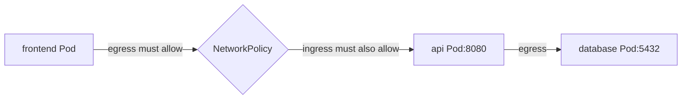

# NetworkPolicy

## Mục lục

- [Tổng quan](#tổng-quan)
- [1. Điều kiện tiên quyết](#1-điều-kiện-tiên-quyết)
- [2. Isolation model](#2-isolation-model)
- [3. Policy là additive allow-list](#3-policy-là-additive-allow-list)
- [4. Anatomy của NetworkPolicy](#4-anatomy-của-networkpolicy)
- [5. Pod và Namespace selector](#5-pod-và-namespace-selector)
- [6. ipBlock](#6-ipblock)
- [7. Port, protocol và named port](#7-port-protocol-và-named-port)
- [8. Default deny và allow DNS](#8-default-deny-và-allow-dns)
- [9. Mẫu policy three-tier](#9-mẫu-policy-three-tier)
- [10. Egress Internet và external dependency](#10-egress-internet-và-external-dependency)
- [11. Lifecycle và eventual consistency](#11-lifecycle-và-eventual-consistency)
- [12. Những gì NetworkPolicy không làm](#12-những-gì-networkpolicy-không-làm)
- [13. Production rollout strategy](#13-production-rollout-strategy)
- [14. Thực hành default deny](#14-thực-hành-default-deny)
- [15. Troubleshooting](#15-troubleshooting)
- [16. Best practices](#16-best-practices)
- [Tài liệu tham khảo](#tài-liệu-tham-khảo)

---

## Tổng quan

NetworkPolicy là namespaced API cho phép kiểm soát connection tới/từ Pod ở layer 3/4, chủ yếu TCP, UDP và SCTP khi CNI support.

Mặc định, Pod là non-isolated: traffic được phép. Khi một policy chọn Pod cho một hướng, Pod bị isolate hướng đó và chỉ traffic match **ít nhất một allow rule** của các policy áp dụng mới được phép.



> [!IMPORTANT]
> Với connection Pod A → Pod B, nếu A bị isolate egress và B bị isolate ingress, **cả hai phía** phải cho phép. Chỉ viết ingress policy ở B chưa chắc đủ.

## 1. Điều kiện tiên quyết

CNI/network solution phải support và enable NetworkPolicy enforcement. API server luôn có thể lưu object dù không có enforcement.

Xác minh:

- Tài liệu CNI/version.
- CNI agent/controller healthy.
- Test traffic allow/deny thực tế.
- Support IPv6, `endPort`, SCTP, named port và `hostNetwork` nếu cần.

Không dùng `kubectl get networkpolicy` làm bằng chứng duy nhất.

## 2. Isolation model

Ingress và egress độc lập.

### 2.1 Ingress isolation

Pod bị isolate ingress nếu có ít nhất một policy:

- `podSelector` match Pod.
- `policyTypes` chứa `Ingress`.

Khi đó chỉ ingress được hợp các `ingress` rule cho phép. Reply traffic của connection được phép được stateful implementation cho qua.

### 2.2 Egress isolation

Tương tự, policy match Pod và chứa `Egress` làm Pod isolate egress.

### 2.3 Non-isolated

Nếu không policy nào isolate một hướng, mọi traffic hướng đó được phép, bất kể policy áp dụng hướng còn lại.

### 2.4 Node traffic và self traffic

Theo model chuẩn:

- Pod không thể chặn traffic tới chính nó.
- Traffic giữa Pod và Node nơi Pod chạy luôn được phép theo các điều kiện chuẩn được tài liệu mô tả.
- `hostNetwork` behavior phụ thuộc CNI, thường được xem như Node traffic.

NetworkPolicy không phải boundary chống Node/root compromise.

## 3. Policy là additive allow-list

Không có priority/order và explicit deny trong NetworkPolicy chuẩn.

Giả sử hai policy cùng chọn Pod API:

```text
Policy A allow frontend:8080
Policy B allow monitoring:9090
Kết quả = frontend:8080 OR monitoring:9090
```

Không thể tạo policy C để “deny frontend” và override A. Phải sửa/xóa allow rule hoặc dùng policy extension của CNI với semantics riêng.

### 3.1 Empty list khác rule rỗng

```yaml
ingress: []
```

Không allow ingress nào: deny all cho Pod đã isolate.

```yaml
ingress:
  - {}
```

Rule rỗng match mọi source/port: allow all ingress.

Sai khác hai ký tự này có impact lớn; review diff cẩn thận.

## 4. Anatomy của NetworkPolicy

```yaml
apiVersion: networking.k8s.io/v1
kind: NetworkPolicy
metadata:
  name: api-ingress
  namespace: production
spec:
  podSelector:
    matchLabels:
      app: api
  policyTypes:
    - Ingress
  ingress:
    - from:
        - podSelector:
            matchLabels:
              app: frontend
      ports:
        - protocol: TCP
          port: 8080
```

- `metadata.namespace`: policy và subject Pod cùng Namespace.
- `spec.podSelector`: Pod chịu policy; `{}` chọn mọi Pod trong Namespace.
- `policyTypes`: hướng isolate.
- `ingress[].from`: source allow.
- `egress[].to`: destination allow.
- `ports`: destination port của connection.

Policy không chọn Service object. Nó chọn Pod/IP và port sau/before NAT theo implementation path.

## 5. Pod và Namespace selector

### 5.1 Pod cùng Namespace

```yaml
from:
  - podSelector:
      matchLabels:
        app: frontend
```

Vì chỉ có `podSelector`, source Pod phải ở cùng Namespace với NetworkPolicy.

### 5.2 Mọi Pod trong Namespace được label

```yaml
from:
  - namespaceSelector:
      matchLabels:
        kubernetes.io/metadata.name: ingress-system
```

Label `kubernetes.io/metadata.name` được control plane gắn bất biến, giúp chọn Namespace theo tên.

### 5.3 Pod trong Namespace cụ thể: AND

```yaml
from:
  - namespaceSelector:
      matchLabels:
        kubernetes.io/metadata.name: frontend
    podSelector:
      matchLabels:
        app: web
```

Hai selector trong **cùng một list item** nghĩa:

```text
Namespace=frontend AND Pod app=web
```

### 5.4 Hai list item: OR

```yaml
from:
  - namespaceSelector:
      matchLabels:
        kubernetes.io/metadata.name: frontend
  - podSelector:
      matchLabels:
        app: web
```

Nghĩa:

```text
mọi Pod trong Namespace frontend
OR Pod app=web trong Namespace local
```

Indentation YAML làm policy rộng hơn rất nhiều. Dùng `kubectl describe networkpolicy` để xem API parse.

### 5.5 Label governance

NetworkPolicy security phụ thuộc label integrity. Nếu workload owner tự gắn `role: trusted`, selector đó không tạo boundary. Dùng Namespace ownership, admission policy và restricted label prefix cho identity nhạy cảm.

## 6. ipBlock

```yaml
to:
  - ipBlock:
      cidr: 203.0.113.0/24
      except:
        - 203.0.113.128/25
```

`ipBlock` phù hợp external CIDR ổn định. Không nên dùng Pod IP vì ephemeral.

### 6.1 NAT ambiguity

Service/LB/egress path có thể DNAT/SNAT trước hoặc sau policy enforcement. Vì vậy policy có thể thấy:

- Original client IP.
- Load balancer IP.
- Node IP.
- Backend IP sau DNAT.

Behavior tùy CNI, Service proxy và cloud. Test exact flow trong môi trường thật.

### 6.2 Không target Service name/FQDN

API chuẩn không có:

```yaml
allowService: payments
allowFQDN: api.example.com
```

FQDN policy là CNI extension nếu có. IP allowlist cho SaaS dùng dynamic DNS rất dễ drift.

## 7. Port, protocol và named port

```yaml
ports:
  - protocol: TCP
    port: 8080
```

### 7.1 Port là destination port

Trong ingress, là port Pod đích. Trong egress, là port destination ngoài/source Pod gọi tới.

### 7.2 Named port

```yaml
ports:
  - protocol: TCP
    port: http
```

Named port được resolve theo Pod ở phía liên quan theo API semantics/implementation. Nó giúp đổi số port nhưng cần CNI support và Pod port name nhất quán.

### 7.3 Port range

```yaml
ports:
  - protocol: TCP
    port: 32000
    endPort: 32768
```

`endPort >= port`, cả hai numeric. CNI cũ có thể chỉ enforce `port`; xác minh support.

### 7.4 ICMP và protocol khác

NetworkPolicy chuẩn guarantee cho TCP/UDP và SCTP khi plugin support. Behavior ARP/ICMP hoặc protocol khác có thể khác CNI; không dùng ping làm test policy duy nhất.

## 8. Default deny và allow DNS

### 8.1 Default deny ingress

```yaml
apiVersion: networking.k8s.io/v1
kind: NetworkPolicy
metadata:
  name: default-deny-ingress
  namespace: production
spec:
  podSelector: {}
  policyTypes:
    - Ingress
```

### 8.2 Default deny egress

```yaml
apiVersion: networking.k8s.io/v1
kind: NetworkPolicy
metadata:
  name: default-deny-egress
  namespace: production
spec:
  podSelector: {}
  policyTypes:
    - Egress
```

### 8.3 Deny cả hai

```yaml
spec:
  podSelector: {}
  policyTypes: [Ingress, Egress]
```

### 8.4 Allow DNS

Xác minh label CoreDNS thực tế:

```yaml
apiVersion: networking.k8s.io/v1
kind: NetworkPolicy
metadata:
  name: allow-dns
  namespace: production
spec:
  podSelector: {}
  policyTypes: [Egress]
  egress:
    - to:
        - namespaceSelector:
            matchLabels:
              kubernetes.io/metadata.name: kube-system
          podSelector:
            matchLabels:
              k8s-app: kube-dns
      ports:
        - protocol: UDP
          port: 53
        - protocol: TCP
          port: 53
```

Cần cả UDP và TCP. Với một số CNI/service NAT point, selector tới CoreDNS Pod hoạt động; môi trường khác có thể cần allow ClusterIP `kube-dns` bằng `ipBlock`. Test và document implementation-specific behavior.

## 9. Mẫu policy three-tier

Giả sử Namespace `shop`, labels `app=frontend|api|db`.

### 9.1 API chỉ nhận từ frontend

```yaml
apiVersion: networking.k8s.io/v1
kind: NetworkPolicy
metadata:
  name: api-from-frontend
  namespace: shop
spec:
  podSelector:
    matchLabels:
      app: api
  policyTypes: [Ingress]
  ingress:
    - from:
        - podSelector:
            matchLabels:
              app: frontend
      ports:
        - protocol: TCP
          port: 8080
```

### 9.2 Database chỉ nhận từ API

```yaml
apiVersion: networking.k8s.io/v1
kind: NetworkPolicy
metadata:
  name: db-from-api
  namespace: shop
spec:
  podSelector:
    matchLabels:
      app: db
  policyTypes: [Ingress]
  ingress:
    - from:
        - podSelector:
            matchLabels:
              app: api
      ports:
        - protocol: TCP
          port: 5432
```

### 9.3 API egress chỉ tới DB và DNS

Nhiều policy additive cho phép tách ownership:

```yaml
apiVersion: networking.k8s.io/v1
kind: NetworkPolicy
metadata:
  name: api-to-db
  namespace: shop
spec:
  podSelector:
    matchLabels:
      app: api
  policyTypes: [Egress]
  egress:
    - to:
        - podSelector:
            matchLabels:
              app: db
      ports:
        - protocol: TCP
          port: 5432
```

Thêm policy DNS riêng chọn mọi Pod. Không cần nhét mọi allow vào một object khổng lồ.

## 10. Egress Internet và external dependency

### 10.1 Allow toàn Internet trừ private CIDR

Có thể viết `0.0.0.0/0` với `except`, nhưng:

- IPv6 cần rule `::/0` riêng.
- Private/VPC CIDR khác tổ chức.
- Metadata API/cloud special IP cần block.
- Service DNAT và egress gateway làm semantics phức tạp.

Không dùng mẫu generic mà chưa threat-model.

### 10.2 Dynamic SaaS IP

NetworkPolicy `ipBlock` không theo DNS. Nếu SaaS đổi IP, policy lỗi. Lựa chọn:

- Egress proxy/gateway có hostname policy.
- CNI FQDN policy extension.
- Provider-managed prefix list tích hợp ngoài API chuẩn.
- Controller cập nhật policy, kèm TTL/race/rollback rõ.

### 10.3 Cloud metadata

Chặn metadata endpoint là defense-in-depth nhưng IP/path khác provider và workload identity architecture. NetworkPolicy không thay thế provider workload identity, token hardening và node firewall.

## 11. Lifecycle và eventual consistency

Khi tạo policy mới, CNI cần thời gian reconcile trên Node. Theo conformance hiện đại:

- Pod mới chịu isolation trước khi container start.
- Allow rule có thể hội tụ sau isolation, tạo khoảng tạm không connectivity.
- Distributed nodes có thể thấy state khác nhau trong vài giây.

Application/init container phải retry dependency thay vì assume network sẵn ngay.

### 11.1 Existing connection

Khi policy/label đổi, việc connection hiện có bị đóng ngay hay tiếp tục là implementation-defined. Test bằng **connection mới** khi xác minh policy.

### 11.2 Label update

Đổi label Pod/Namespace có thể đổi policy membership ngay và ảnh hưởng traffic. Quản lý label như security config.

## 12. Những gì NetworkPolicy không làm

API chuẩn không cung cấp:

- Explicit deny/priority.
- TLS/mTLS, certificate identity.
- HTTP host/path/method filtering.
- Service-name/FQDN target.
- Cluster-wide default policy object.
- Node identity policy.
- Bắt traffic đi qua một egress gateway.
- Log deny/allow chuẩn hóa.
- Chặn localhost hoặc resident Node traffic.
- Portable policy cho `hostNetwork` Pod.
- Đảm bảo ICMP behavior giống nhau.

Dùng service mesh, Gateway, CNI extension, firewall, admission và identity system theo nhu cầu. Document rõ phần portable và phần vendor-specific.

## 13. Production rollout strategy

Không apply default-deny thẳng vào Namespace production chưa inventory.

<Steps>
  <Step>
    ### Inventory flow
    Thu thập source Namespace/Pod, destination, protocol, port, DNS và external dependency. Dùng flow log nếu CNI hỗ trợ.
  </Step>
  <Step>
    ### Chuẩn hóa label
    Đảm bảo selector ổn định và label nhạy cảm được admission bảo vệ.
  </Step>
  <Step>
    ### Tạo allow policy trước
    Apply policy cụ thể cho DNS, ingress controller, monitoring, service-to-service và egress cần thiết.
  </Step>
  <Step>
    ### Test connection mới
    Test positive và negative path từ debug Pod có label đúng/sai.
  </Step>
  <Step>
    ### Bật default deny
    Rollout từng Namespace, ngoài peak time, có dashboard và rollback manifest.
  </Step>
  <Step>
    ### Theo dõi và siết dần
    Xem timeout, denied flow, DNS error; thu hẹp CIDR/selector sau khi ổn định.
  </Step>
</Steps>

Nếu renderer/component thay đổi, nội dung Steps trên vẫn cần được build validate theo repository.

## 14. Thực hành default deny

Tạo server và hai client:

```bash
kubectl create namespace policy-lab
kubectl create deployment api -n policy-lab \
  --image=registry.k8s.io/e2e-test-images/agnhost:2.53 -- \
  netexec --http-port=8080
kubectl expose deployment api -n policy-lab --port=8080
kubectl run allowed -n policy-lab --labels=role=allowed \
  --image=curlimages/curl:8.12.1 --command -- sleep 3600
kubectl run denied -n policy-lab --labels=role=denied \
  --image=curlimages/curl:8.12.1 --command -- sleep 3600
kubectl wait -n policy-lab --for=condition=Available deployment/api --timeout=120s
kubectl wait -n policy-lab --for=condition=Ready pod/allowed pod/denied --timeout=120s
```

Baseline:

```bash
kubectl exec -n policy-lab allowed -- curl -sS --max-time 3 http://api:8080/hostname
kubectl exec -n policy-lab denied -- curl -sS --max-time 3 http://api:8080/hostname
```

Apply policy chỉ allow client có label:

```yaml
apiVersion: networking.k8s.io/v1
kind: NetworkPolicy
metadata:
  name: api-only-allowed-client
  namespace: policy-lab
spec:
  podSelector:
    matchLabels:
      app: api
  policyTypes: [Ingress]
  ingress:
    - from:
        - podSelector:
            matchLabels:
              role: allowed
      ports:
        - protocol: TCP
          port: 8080
```

```bash
kubectl apply -f policy.yaml
```

Test lại bằng connection mới. `allowed` phải thành công, `denied` phải timeout/fail nếu CNI enforce policy.

Cleanup:

```bash
kubectl delete namespace policy-lab
rm -f policy.yaml
```

Nếu cả hai vẫn thành công, trước tiên xác minh CNI support/enforcement thay vì sửa YAML ngẫu nhiên.

## 15. Troubleshooting

### 15.1 Policy không chặn gì

- CNI có support NetworkPolicy?
- Policy Namespace/podSelector đúng?
- `policyTypes` có hướng cần isolate?
- Có policy `allow-all` khác additive không?
- Đang test connection cũ không?

```bash
kubectl get networkpolicy -n NS
kubectl describe networkpolicy POLICY -n NS
kubectl get pod -n NS --show-labels
```

### 15.2 Policy chặn quá rộng

Tìm `podSelector: {}` với empty ingress/egress, sai indentation AND/OR, Namespace label không tồn tại hoặc quên DNS.

### 15.3 DNS hỏng sau default deny egress

Allow TCP/UDP 53 tới CoreDNS theo CNI semantics. Test CoreDNS Pod IP và Service IP để xác định NAT enforcement point.

### 15.4 Ingress controller không gọi backend được

Backend ingress policy phải allow Pod controller từ đúng Namespace/labels. Nếu cloud LB gọi Pod trực tiếp, source có thể khác. Xác minh architecture.

### 15.5 Policy theo `ipBlock` không match source thật

NAT có thể đổi source trước enforcement. Capture/flow log tại CNI point và đọc provider docs.

### 15.6 Chỉ Pod trên một Node bị lỗi

CNI agent/policy programming trên Node đó có thể stale. So sánh agent health/log và test endpoint theo Node.

### 15.7 Policy YAML đúng nhưng delay vài giây

Reconciliation eventual consistency là có thể. Đo policy programming latency; app phải retry. Delay kéo dài cần kiểm tra CNI control plane.

## 16. Best practices

- Xác minh CNI enforcement bằng positive và negative test.
- Apply allow rules trước default deny.
- Tách ingress và egress policy để ownership/review rõ.
- Dùng Namespace label chuẩn `kubernetes.io/metadata.name` khi chọn Namespace theo tên.
- Đặt Pod + Namespace selector trong cùng list item khi cần AND.
- Allow DNS TCP và UDP.
- Bảo vệ label dùng làm security identity.
- Không dùng Pod IP trong `ipBlock`.
- Test NAT, LoadBalancer, Gateway và egress path trên implementation thật.
- Không giả định existing connection bị ngắt khi policy đổi.
- Document vendor extension riêng khỏi NetworkPolicy portable.
- Theo dõi denied flow nếu CNI có telemetry, nhưng không log payload nhạy cảm.
- Có break-glass/rollback manifest cho rollout production.

Tiếp tục với [kube-proxy và Service Routing](/networking/kube-proxy/) để hiểu nơi Service VIP được hiện thực trong data plane.

---

## Tài liệu tham khảo

- [Network Policies](https://kubernetes.io/docs/concepts/services-networking/network-policies/)
- [Declare Network Policy](https://kubernetes.io/docs/tasks/administer-cluster/declare-network-policy/)
- [NetworkPolicy API Reference](https://kubernetes.io/docs/reference/kubernetes-api/policy-resources/network-policy-v1/)
