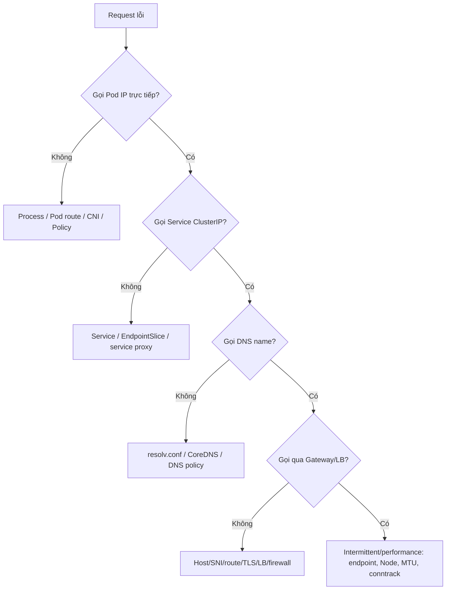

# Troubleshooting Networking

## Mục lục

- [Tổng quan](#tổng-quan)
- [1. Chuẩn hóa mô tả sự cố](#1-chuẩn-hóa-mô-tả-sự-cố)
- [2. Cây quyết định nhanh](#2-cây-quyết-định-nhanh)
- [3. Chuẩn bị debug environment](#3-chuẩn-bị-debug-environment)
- [4. Layer 7: application và protocol](#4-layer-7-application-và-protocol)
- [5. Pod network namespace](#5-pod-network-namespace)
- [6. Pod-to-Pod và CNI](#6-pod-to-pod-và-cni)
- [7. Service và EndpointSlice](#7-service-và-endpointslice)
- [8. DNS và CoreDNS](#8-dns-và-coredns)
- [9. NetworkPolicy](#9-networkpolicy)
- [10. kube-proxy và Service data plane](#10-kube-proxy-và-service-data-plane)
- [11. Ingress, Gateway và LoadBalancer](#11-ingress-gateway-và-loadbalancer)
- [12. Egress và external dependency](#12-egress-và-external-dependency)
- [13. MTU, conntrack và asymmetric routing](#13-mtu-conntrack-và-asymmetric-routing)
- [14. Packet capture](#14-packet-capture)
- [15. Symptom matrix](#15-symptom-matrix)
- [16. Incident workflow production](#16-incident-workflow-production)
- [17. Thực hành fault isolation](#17-thực-hành-fault-isolation)
- [18. Best practices](#18-best-practices)
- [Tài liệu tham khảo](#tài-liệu-tham-khảo)

---

## Tổng quan

Networking incident khó vì một request đi qua nhiều control plane và data plane:

```text
Client process
→ resolver
→ CoreDNS Service
→ CoreDNS Pod/upstream
→ destination Service VIP
→ service proxy
→ EndpointSlice
→ CNI route/tunnel
→ NetworkPolicy
→ backend socket
→ return path
```

Nguyên tắc hiệu quả nhất: **tách từng layer và thay một biến mỗi lần**. Đừng restart mọi component hoặc xóa Pod trước khi thu thập evidence.



## 1. Chuẩn hóa mô tả sự cố

Trước khi chạy lệnh, ghi rõ:

| Dữ liệu | Ví dụ |
|---|---|
| Source | Pod `frontend-abc`, Namespace `shop`, Node `worker-a` |
| Destination | `api.shop.svc.cluster.local:8080` |
| Protocol | TCP + HTTP/1.1, HTTPS, gRPC, UDP DNS... |
| Expected | HTTP 200 dưới 200 ms |
| Actual | DNS timeout, TCP reset, HTTP 503, 30% request lỗi |
| Time window | UTC timestamp, bắt đầu/kết thúc |
| Scope | Mọi Pod, một Namespace, một Node, một zone |
| Recent change | rollout, policy, CNI upgrade, certificate, Node drain |

“Không vào được service” chưa đủ. DNS NXDOMAIN và TLS certificate mismatch cần runbook khác nhau.

### 1.1 Luôn ghi source Node

Network data plane distributed theo Node. Một lỗi chỉ trên Node/zone thường biến thành “random 20% failure” khi client/backend được schedule phân tán.

```bash
kubectl get pod -n NS POD -o wide
```

### 1.2 Dùng timestamp UTC

Đồng bộ thời gian giữa curl, application log, CoreDNS, Gateway, CNI và cloud LB. Thiếu timestamp làm correlation sai.

## 2. Cây quyết định nhanh

### 2.1 Name hay IP?

```bash
# DNS
nslookup api.shop.svc.cluster.local

# Service name
curl -sv --connect-timeout 2 http://api.shop:8080/health

# Service ClusterIP
curl -sv --connect-timeout 2 http://10.96.20.30:8080/health

# Pod IP
curl -sv --connect-timeout 2 http://10.244.2.18:8080/health
```

Diễn giải:

| Pod IP | ClusterIP | DNS name | Hướng điều tra |
|---:|---:|---:|---|
| Fail | Fail | Fail | Process, Pod network, CNI, policy |
| Pass | Fail | Fail | Service/EndpointSlice/service proxy |
| Pass | Pass | Fail | DNS/CoreDNS/resolver |
| Pass | Pass | Pass | Entry point/TLS/host/path hoặc intermittent |

Direct Pod IP bypass Service nhưng vẫn đi qua CNI/NetworkPolicy. Test từ **cùng source Pod** với request lỗi để giữ policy/route giống nhau.

### 2.2 TCP hay HTTP?

```bash
nc -vz -w 2 DESTINATION PORT
curl -sv --max-time 5 http://DESTINATION:PORT/path
openssl s_client -connect DESTINATION:443 -servername api.example.com </dev/null
```

- TCP connect fail: route, policy, firewall, listener.
- TCP pass nhưng HTTP lỗi: protocol, Host/path, application.
- TLS fail: SNI, cert, TLS policy, backend protocol.

## 3. Chuẩn bị debug environment

Application image thường distroless. Không cài package vào container production vì:

- Thay state và khó tái tạo.
- Có thể vi phạm security.
- Container restart mất tool.

### 3.1 Debug Pod

```bash
kubectl run net-debug -n NS --rm -it \
  --image=nicolaka/netshoot -- /bin/bash
```

Debug Pod phải có label/policy tương tự source nếu muốn tái hiện. Một debug Pod không bị isolate có thể kết nối được trong khi app bị chặn.

### 3.2 Ephemeral container

```bash
kubectl debug -n NS -it POD \
  --image=nicolaka/netshoot --target=CONTAINER
```

Ephemeral container chia sẻ Pod network namespace, phù hợp nhất để test source path. RBAC/admission có thể hạn chế; image phải từ registry tin cậy.

### 3.3 Tool tối thiểu

- `curl`, `wget`.
- `dig`, `nslookup`, `getent`.
- `ip`, `ss`.
- `nc`.
- `openssl`.
- `tracepath`, `ping` với hạn chế.
- `tcpdump` khi được cấp quyền.

## 4. Layer 7: application và protocol

Bắt đầu ở backend:

```bash
kubectl get pod POD -n NS
kubectl logs POD -n NS -c CONTAINER --since=15m
kubectl describe pod POD -n NS
```

### 4.1 Process có listen không?

```bash
kubectl exec POD -n NS -- ss -lntup
```

Đối chiếu:

- Listen port.
- Bind address (`127.0.0.1` vs `0.0.0.0`).
- TCP hay UDP.
- IPv4 hay IPv6.

Service `targetPort: 8080` không giúp nếu process listen 8081 hoặc chỉ loopback.

### 4.2 HTTP Host/path

```bash
curl -sv -H 'Host: api.example.com' http://ADDRESS/path
```

404 có thể là route mismatch, không phải network failure.

### 4.3 HTTPS/gRPC

```bash
openssl s_client -connect ADDRESS:443 -servername api.example.com </dev/null
curl -sv --resolve api.example.com:443:ADDRESS https://api.example.com/
```

Kiểm tra SNI, ALPN, certificate SAN, HTTP/2 và backend protocol.

### 4.4 Readiness

```bash
kubectl get pod POD -n NS -o jsonpath='{.status.conditions}{"\n"}'
kubectl describe pod POD -n NS
```

Pod Running nhưng NotReady không nhận Service traffic bình thường.

## 5. Pod network namespace

Từ Pod source:

```bash
ip address
ip route
ip route get DESTINATION_IP
cat /etc/resolv.conf
ss -s
```

Kiểm tra:

- Pod có IP expected family.
- Default route/gateway tồn tại.
- Route destination không bị overlap.
- Interface up, MTU hợp lý.
- Resolver trỏ cluster DNS.

### 5.1 Pod không có IP/ContainerCreating

```bash
kubectl describe pod POD -n NS
kubectl get event -n NS --sort-by=.lastTimestamp
```

Tìm `FailedCreatePodSandBox`, IPAM exhausted, CNI config/binary/agent lỗi.

### 5.2 hostNetwork

Nếu `hostNetwork: true`, network path và policy khác Pod thường. Kiểm tra `dnsPolicy: ClusterFirstWithHostNet` khi cần Service DNS.

## 6. Pod-to-Pod và CNI

### 6.1 Test từng endpoint

```bash
kubectl get pod -n NS -l app=api -o wide
for ip in POD_IP_1 POD_IP_2; do
  curl -sv --connect-timeout 2 "http://$ip:8080/health"
done
```

Ghi Node/zone của endpoint lỗi.

### 6.2 Same-node vs cross-node

- Same-node pass, cross-node fail → tunnel/BGP/route/firewall/MTU.
- Chỉ endpoint trên Node X fail → CNI agent/Node route/backend trên X.
- Mọi endpoint fail từ source Node X → source Node data plane/policy.

### 6.3 CNI health

Tên label tùy solution:

```bash
kubectl get daemonset -A
kubectl get pod -A -o wide | grep -iE 'cni|calico|cilium|flannel|weave'
kubectl get event -A --sort-by=.lastTimestamp | tail -n 100
```

Đọc log agent ở source và destination Node. Không restart agent trước khi thu log vì mất evidence và có thể mở rộng outage.

### 6.4 Node route/tunnel

Administrator có thể kiểm tra:

```bash
ip route
ip link
ip neigh
```

BGP/tunnel/eBPF dùng tool vendor. Không giả định `cni0`/`vxlan.calico` tồn tại.

## 7. Service và EndpointSlice

```bash
kubectl get svc SERVICE -n NS -o yaml
kubectl get endpointslice -n NS \
  -l kubernetes.io/service-name=SERVICE -o yaml
kubectl get pod -n NS --show-labels -o wide
```

Checklist:

- Selector match đúng Pod?
- Endpoint address đúng?
- `ready: true`?
- `terminating`?
- Port EndpointSlice bằng process port?
- Protocol đúng?
- Dual-stack address family đúng?

### 7.1 Service không endpoint

Thường là selector typo, Namespace sai, Pod NotReady hoặc named `targetPort` không tồn tại.

### 7.2 Chỉ một phần traffic lỗi

Test từng endpoint. Readiness có thể pass nhưng application thực tế lỗi; tăng chất lượng probe và loại endpoint bad.

### 7.3 Long-lived connection

Endpoint đã bị loại nhưng TCP/gRPC connection cũ vẫn map tới nó. Tạo connection mới để test control-plane update.

## 8. DNS và CoreDNS

Từ Pod lỗi:

```bash
cat /etc/resolv.conf
nslookup kubernetes.default
nslookup SERVICE.NAMESPACE
nslookup example.com
```

### 8.1 Kiểm tra CoreDNS path

```bash
kubectl get svc kube-dns -n kube-system
kubectl get endpointslice -n kube-system \
  -l kubernetes.io/service-name=kube-dns -o wide
kubectl get pod -n kube-system -l k8s-app=kube-dns -o wide
kubectl logs -n kube-system -l k8s-app=kube-dns --since=10m
```

### 8.2 Phân loại

- Cluster name fail, external pass: CoreDNS Kubernetes plugin/RBAC/cluster domain.
- Cluster pass, external fail: upstream/forward/Node resolver/firewall.
- Cả hai fail: Pod resolv.conf, DNS Service, policy, CoreDNS availability.
- Short name fail, FQDN pass: Namespace/search/ndots.

### 8.3 DNS timeout vs NXDOMAIN vs SERVFAIL

- Timeout: packet path/policy/server saturation.
- NXDOMAIN: name/search/record không tồn tại hoặc negative cache.
- SERVFAIL: CoreDNS/upstream/RBAC/plugin error.

## 9. NetworkPolicy

```bash
kubectl get networkpolicy -n SOURCE_NS
kubectl get networkpolicy -n DEST_NS
kubectl describe networkpolicy -n NS POLICY
kubectl get pod -n SOURCE_NS SOURCE --show-labels
kubectl get pod -n DEST_NS DEST --show-labels
```

Connection cần:

```text
source egress allow (nếu source isolated)
AND destination ingress allow (nếu destination isolated)
```

### 9.1 Test policy đúng cách

- Tạo connection mới.
- Test bằng source Pod thật/ephemeral container.
- Dùng TCP/UDP đúng protocol.
- Không chỉ dùng ping vì ICMP behavior không portable.
- Kiểm tra policy additive khác có allow rộng.

### 9.2 Default deny làm DNS hỏng

Allow TCP/UDP 53 và xác minh CNI nhìn DNS Service VIP hay CoreDNS Pod IP tại enforcement point.

### 9.3 NAT

`ipBlock` có thể thấy source/destination sau NAT khác dự đoán. Dùng flow log/packet capture và CNI docs.

## 10. kube-proxy và Service data plane

Nếu Pod IP pass nhưng ClusterIP fail:

```bash
kubectl get pod -n kube-system -l k8s-app=kube-proxy -o wide
kubectl logs -n kube-system KUBE_PROXY_POD --since=15m
```

Xác định mode hoặc replacement. Trên Node client:

```bash
sudo nft list ruleset
sudo iptables-save
sudo ipvsadm -Ln
sudo conntrack -S
```

Chỉ dùng tool đúng mode.

### 10.1 Node-local pattern

Service fail từ Pod trên một Node nhưng pass từ Node khác → service proxy/CNI/conntrack trên source Node.

### 10.2 NodePort

Kiểm tra Node IP được include trong `nodePortAddresses`, host firewall/security group, `externalTrafficPolicy: Local` và local endpoint.

## 11. Ingress, Gateway và LoadBalancer

Đi từ ngoài vào:

1. External DNS.
2. LB address/listener/firewall.
3. TLS/SNI.
4. Gateway/Ingress status/class.
5. Host/path match.
6. Controller/data-plane log.
7. Service/EndpointSlice.
8. Backend process.

### 11.1 Ingress

```bash
kubectl describe ingress INGRESS -n NS
kubectl get ingressclass
```

Test Host:

```bash
curl -sv -H 'Host: api.example.com' http://INGRESS_ADDRESS/path
```

### 11.2 Gateway API

```bash
kubectl describe gateway GATEWAY -n NS
kubectl describe httproute ROUTE -n NS
```

Conditions:

- `Accepted`.
- `ResolvedRefs`.
- `Programmed` theo resource/implementation.
- `observedGeneration` có mới không.

### 11.3 LoadBalancer

```bash
kubectl describe svc SERVICE -n NS
kubectl get svc SERVICE -n NS -o jsonpath='{.status.loadBalancer}{"\n"}'
```

`<pending>` → controller/quota/subnet/class. Có address nhưng timeout → firewall/backend health/NodePort/direct Pod target/return path.

### 11.4 HTTP status

- 404: Host/path/default route.
- 502: backend reset/protocol mismatch.
- 503: no healthy endpoint/config.
- 504: backend timeout.

Exact meaning phụ thuộc proxy; access/error log là nguồn chính.

## 12. Egress và external dependency

Từ source Pod:

```bash
nslookup api.external.example
curl -sv --connect-timeout 3 https://api.external.example/health
ip route get DESTINATION_IP
```

Kiểm tra:

- DNS private/public answer.
- NetworkPolicy egress.
- Egress gateway/NAT.
- Cloud route/security group/NACL/firewall.
- Proxy environment variable.
- TLS trust/SNI.
- External allowlist thấy source egress IP nào.
- Return route.

### 12.1 Một hostname có nhiều IP

Test từng resolved IP. Một region/address bị firewall chặn tạo intermittent failure theo DNS answer.

### 12.2 Proxy

```bash
env | grep -iE 'http_proxy|https_proxy|no_proxy'
```

`NO_PROXY` thiếu `.svc`, Service CIDR hoặc cluster domain có thể gửi internal request qua corporate proxy.

### 12.3 Source IP

External service có thể allowlist egress NAT IP. Sau Node scale/zone failover, source IP đổi nếu egress architecture không cố định.

## 13. MTU, conntrack và asymmetric routing

### 13.1 MTU

Pattern: connect/request nhỏ pass, payload lớn/TLS/upload fail, thường cross-node/VPN.

```bash
ip link show eth0
tracepath DESTINATION
ping -M do -s 1400 DESTINATION
```

Ping có thể bị chặn; packet capture xác nhận retransmission/ICMP too-big.

### 13.2 Conntrack

```bash
sudo conntrack -S
sysctl net.netfilter.nf_conntrack_count
sysctl net.netfilter.nf_conntrack_max
```

Table gần đầy, insert failure hoặc drop tăng → capacity issue. Không flush toàn table.

### 13.3 Asymmetric route

Request đi Node A, reply đi Node B hoặc bỏ qua NAT state → reset/drop. Kiểm tra route cả hai chiều, policy routing, multi-NIC, egress gateway và `rp_filter` theo CNI guidance.

### 13.4 Port exhaustion

NAT gateway/Node/client có finite ephemeral ports. Nhiều connection ngắn tới cùng destination có thể cạn port. Kiểm tra connection reuse, TIME_WAIT, NAT metric và source IP scale.

## 14. Packet capture

Chỉ capture sau khi đã có flow tuple rõ:

```text
source IP:port → destination IP:port, protocol, timestamp
```

### 14.1 Capture trong Pod

```bash
tcpdump -ni any host DESTINATION_IP and port 8080
```

Cần capability `NET_RAW`/`NET_ADMIN` tùy environment. Không cấp privileged lâu dài.

### 14.2 Capture trên Node

Capture ở:

1. Veth/source side.
2. Tunnel/physical interface source Node.
3. Physical/tunnel destination Node.
4. Veth/backend side.

```bash
sudo tcpdump -ni any 'host 10.244.2.18 and tcp port 8080' -c 200
```

Diễn giải TCP:

- SYN rời source, không tới destination → route/tunnel/firewall.
- SYN tới destination, không SYN-ACK → process/policy/return route.
- SYN-ACK rời destination, không tới source → reverse path/NAT/firewall.
- Handshake xong, app reset → protocol/application/proxy.
- Retransmission payload lớn → MTU/loss.

### 14.3 Data protection

- Filter chặt.
- Giới hạn packet count/duration/snap length.
- Không capture credential/payload nếu header đủ.
- Mã hóa và xóa pcap theo incident retention.
- Không đính kèm pcap nhạy cảm vào ticket công khai.

## 15. Symptom matrix

| Triệu chứng | Nguyên nhân ưu tiên | Lệnh đầu tiên |
|---|---|---|
| Pod `ContainerCreating` | CNI/IPAM | `kubectl describe pod` |
| DNS timeout | DNS Service/policy/CoreDNS | `cat /etc/resolv.conf`, `nslookup` |
| NXDOMAIN | Sai tên/Namespace/negative cache | `nslookup FQDN` |
| Pod IP pass, ClusterIP fail | Service proxy/rule/port | `get svc,endpointslice` |
| ClusterIP pass, Ingress 404 | Host/path/class | `describe ingress`, curl Host |
| Gateway `ResolvedRefs=False` | Service/port/grant | `describe httproute` |
| 30% request fail | Một endpoint/Node/zone bad | test từng Pod IP + Node |
| Small pass, large fail | MTU/PMTUD | `tracepath`, capture |
| New flow fail dưới tải | Conntrack/port exhaustion | `conntrack -S`, `ss -s` |
| Egress bị 403 allowlist | Source NAT IP đổi | kiểm tra egress IP/path |
| Policy apply nhưng vẫn pass | CNI không enforce/additive allow | test mới + inspect all policy |
| NodePort một IP không pass | nodePortAddresses/firewall | proxy config + Node firewall |

## 16. Incident workflow production

<Steps>
  <Step>
    ### Stabilize
    Xác định blast radius, dừng rollout/change đang tăng lỗi, bảo vệ capacity còn lại. Không xóa Pod healthy nếu Pod mới không tạo được network.
  </Step>
  <Step>
    ### Capture evidence
    Lưu object YAML, Events, Pod/Node placement, EndpointSlice, controller log, metric và timestamp trước restart.
  </Step>
  <Step>
    ### Isolate layer
    So sánh Pod IP → ClusterIP → DNS → Gateway/LB, same-node → cross-node, endpoint tốt → endpoint lỗi.
  </Step>
  <Step>
    ### Mitigate nhỏ nhất
    Rollback policy/route/release cụ thể, loại Node/endpoint bad hoặc chuyển traffic. Tránh thay nhiều layer cùng lúc.
  </Step>
  <Step>
    ### Verify
    Test positive/negative path, nhiều Node/zone, connection mới và SLI người dùng; không chỉ nhìn Pod Running.
  </Step>
  <Step>
    ### Preserve learning
    Ghi root cause, detection gap, runbook command, owner và action phòng ngừa. Xóa debug Pod/capability/pcap.
  </Step>
</Steps>

## 17. Thực hành fault isolation

Tạo app đúng:

```bash
kubectl create namespace net-debug-lab
kubectl create deployment web -n net-debug-lab --image=nginx:1.27-alpine
kubectl expose deployment web -n net-debug-lab --port=80 --target-port=80
kubectl run client -n net-debug-lab --image=curlimages/curl:8.12.1 \
  --command -- sleep 3600
kubectl wait -n net-debug-lab --for=condition=Available deployment/web --timeout=120s
kubectl wait -n net-debug-lab --for=condition=Ready pod/client --timeout=120s
kubectl exec -n net-debug-lab client -- curl -sS http://web/
```

Tạo fault targetPort:

```bash
kubectl patch svc web -n net-debug-lab --type=merge \
  -p '{"spec":{"ports":[{"port":80,"targetPort":9999}]}}'
```

Điều tra:

```bash
kubectl get svc web -n net-debug-lab -o yaml
kubectl get endpointslice -n net-debug-lab \
  -l kubernetes.io/service-name=web -o yaml
kubectl get pod -n net-debug-lab -l app=web -o wide
kubectl exec -n net-debug-lab client -- curl -sv --max-time 3 http://web/
```

Lấy Pod IP và chứng minh direct backend port 80 hoạt động, trong khi Service target 9999 lỗi:

```bash
kubectl exec -n net-debug-lab client -- \
  curl -sv --max-time 3 http://POD_IP:80/
```

Sửa:

```bash
kubectl patch svc web -n net-debug-lab --type=merge \
  -p '{"spec":{"ports":[{"port":80,"targetPort":80}]}}'
kubectl exec -n net-debug-lab client -- curl -sS http://web/
```

Cleanup:

```bash
kubectl delete namespace net-debug-lab
```

Bài học: Pod IP pass + ClusterIP fail thu hẹp lỗi vào Service mapping/data plane; không cần restart CNI hay CoreDNS.

## 18. Best practices

- Luôn ghi source/destination/protocol/port/Node/time.
- Test từ source Pod thật hoặc cùng network namespace.
- Đi theo thứ tự Pod IP → ClusterIP → DNS → Gateway/LB.
- Test từng endpoint và nhóm theo Node/zone/version.
- Phân biệt DNS, TCP, TLS và HTTP status.
- Đọc EndpointSlice conditions, không dùng legacy Endpoints làm nguồn chính.
- Kiểm tra cả egress source và ingress destination policy.
- Xác định kube-proxy hay replacement trước khi xem kernel rules.
- Thu evidence trước restart/delete.
- Không flush conntrack, sửa route hoặc firewall production không có rollback.
- Packet capture có filter và data-handling policy.
- Xóa debug resource/quyền sau incident.
- Chuyển lệnh đã chứng minh hữu ích thành runbook/automation read-only.

Hoàn thành phần Networking; tiếp tục với Storage theo thứ tự curriculum sau khi đã nắm vững packet flow, discovery, policy và troubleshooting.

---

## Tài liệu tham khảo

- [Debug Services](https://kubernetes.io/docs/tasks/debug/debug-application/debug-service/)
- [Debugging DNS Resolution](https://kubernetes.io/docs/tasks/administer-cluster/dns-debugging-resolution/)
- [Troubleshooting Clusters](https://kubernetes.io/docs/tasks/debug/debug-cluster/)
- [Virtual IPs and Service Proxies](https://kubernetes.io/docs/reference/networking/virtual-ips/)
