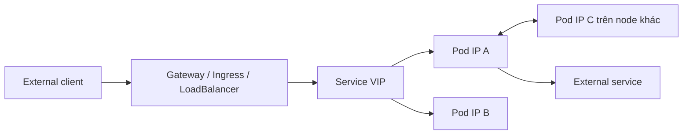
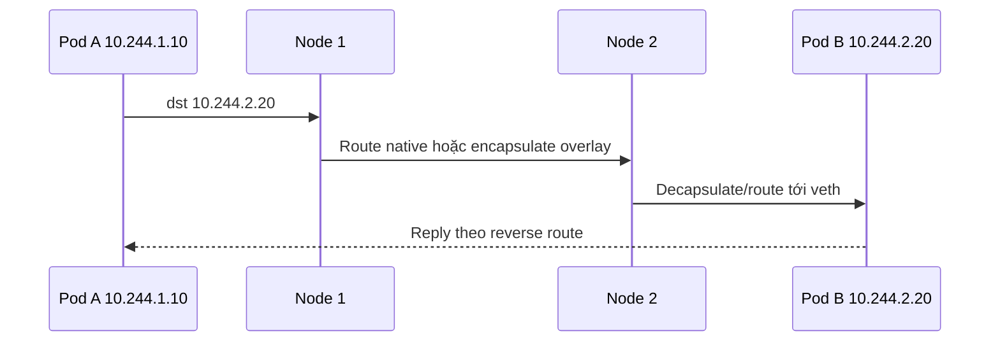
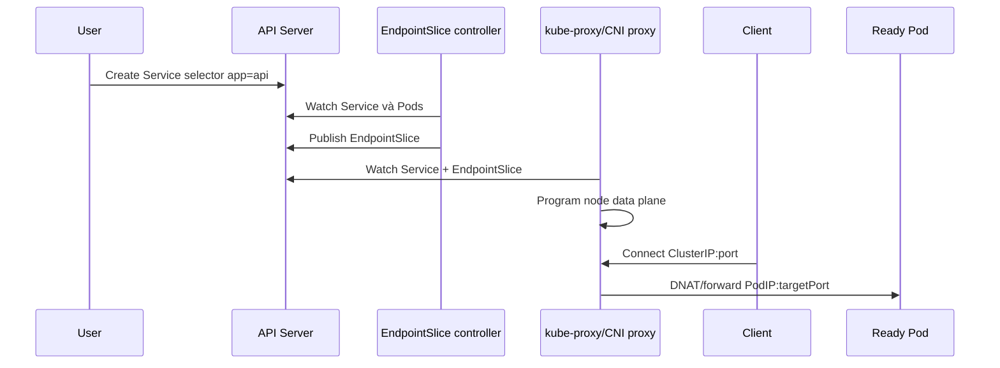

# Kubernetes Networking Model

## Mục lục

- [Tổng quan](#tổng-quan)
- [1. Bốn bài toán networking](#1-bốn-bài-toán-networking)
- [2. Các dải địa chỉ trong cluster](#2-các-dải-địa-chỉ-trong-cluster)
- [3. Network namespace của Pod](#3-network-namespace-của-pod)
- [4. Packet flow Pod-to-Pod](#4-packet-flow-pod-to-pod)
- [5. Service và virtual IP](#5-service-và-virtual-ip)
- [6. DNS và service discovery](#6-dns-và-service-discovery)
- [7. Traffic vào và ra cluster](#7-traffic-vào-và-ra-cluster)
- [8. NetworkPolicy](#8-networkpolicy)
- [9. IPv4, IPv6 và dual-stack](#9-ipv4-ipv6-và-dual-stack)
- [10. Ranh giới trách nhiệm](#10-ranh-giới-trách-nhiệm)
- [11. Mô hình suy luận khi troubleshooting](#11-mô-hình-suy-luận-khi-troubleshooting)
- [12. Thực hành quan sát packet flow](#12-thực-hành-quan-sát-packet-flow)
- [13. Best practices](#13-best-practices)
- [Tài liệu tham khảo](#tài-liệu-tham-khảo)

---

## Tổng quan

Kubernetes networking không phải một network implementation duy nhất. Kubernetes định nghĩa **contract** và API; CNI plugin, Linux kernel, cloud provider, load balancer và Gateway/Ingress controller hiện thực data plane tương ứng.

Mô hình cơ bản:



Các giả định quan trọng của Kubernetes network model:

1. Mỗi Pod có một IP riêng trong phạm vi cluster.
2. Các container trong cùng Pod chia sẻ network namespace và giao tiếp qua `localhost`.
3. Pod có thể giao tiếp trực tiếp với Pod khác trên mọi Node mà không cần application-level proxy hoặc NAT giữa hai Pod, trừ khi policy chủ động giới hạn.
4. Agent trên Node như kubelet có thể kết nối tới Pod trên Node đó.
5. Service cung cấp endpoint ổn định cho tập Pod thay đổi liên tục.

> [!IMPORTANT]
> `containerPort` không cấp IP, không mở firewall và không tạo Service. Nó chủ yếu mô tả port mà process dự kiến lắng nghe. Khả năng kết nối thật phụ thuộc process, Pod IP, route, policy và Service data plane.

## 1. Bốn bài toán networking

### 1.1 Container-to-container trong cùng Pod

Mọi container của một Pod dùng chung:

- Network namespace.
- Pod IP.
- Danh sách interface và route.
- Port space.
- Loopback interface.

Vì vậy sidecar gọi application qua `127.0.0.1:8080`. Hai container không thể cùng bind `0.0.0.0:8080` trong cùng Pod.

```text
Pod 10.244.1.12
├── app      :0.0.0.0:8080
├── sidecar  → localhost:8080
└── lo, eth0, route table dùng chung
```

### 1.2 Pod-to-Pod

Pod IP là identity layer 3 của workload tại một thời điểm. CNI phải đảm bảo route hoặc encapsulation để packet đến được Pod ở cùng Node và khác Node.

Kubernetes không yêu cầu công nghệ cụ thể. Implementation có thể dùng:

- Native routing/BGP.
- Overlay như VXLAN/Geneve.
- Cloud VPC-native routing.
- eBPF data plane.
- Kết hợp nhiều cơ chế.

### 1.3 Pod-to-Service

Pod là ephemeral: rollout, reschedule hoặc node failure làm IP thay đổi. Service tách client khỏi danh sách Pod IP bằng:

- Tên DNS ổn định.
- Virtual IP (`ClusterIP`) ổn định.
- Danh sách backend trong EndpointSlice.
- Service proxy chọn một endpoint sẵn sàng.

### 1.4 External-to-Service và Pod-to-external

Traffic vào cluster thường đi qua `LoadBalancer`, NodePort, Ingress hoặc Gateway API. Traffic ra ngoài thường được route từ Pod network qua Node/VPC; tùy thiết kế, source IP có thể bị SNAT thành Node IP hoặc giữ nguyên.

Đây là hai hướng khác nhau:

| Hướng | Câu hỏi chính |
|---|---|
| Ingress | Client bên ngoài tìm và đến entry point nào? TLS terminate ở đâu? Route tới Service nào? |
| Egress | Pod dùng source IP nào? Route/default gateway nào? DNS và firewall ngoài cluster có cho phép không? |

## 2. Các dải địa chỉ trong cluster

Một cluster thường có ít nhất ba không gian địa chỉ:

| Không gian | Ví dụ | Được cấp cho | Đặc tính |
|---|---|---|---|
| Node network | `192.168.10.0/24` | Node interface | Hạ tầng/VPC có thể route |
| Pod CIDR | `10.244.0.0/16` | Pod | Do CNI/IPAM quản lý |
| Service CIDR | `10.96.0.0/12` | Service VIP | Virtual; thường không gắn vào interface |

Ba CIDR phải không overlap với nhau và không overlap các mạng cần kết nối qua VPN, peering hoặc on-premises. Overlap gây route ambiguity khó chẩn đoán.

### 2.1 Pod IP là địa chỉ có route

Pod IP phải có đường đi trong cluster. Nó tồn tại cùng Pod sandbox và thường bị thu hồi khi Pod bị xóa. Không lưu Pod IP cố định trong application config.

### 2.2 ClusterIP là virtual IP

ClusterIP thường không xuất hiện như IP được bind trên một interface. kube-proxy hoặc service proxy thay thế sẽ cài rule trong kernel để bắt packet tới `ClusterIP:port` và DNAT tới endpoint.

```text
Client Pod
  dst=10.96.20.30:80       Service VIP
        │ service rule chọn backend
        ▼
  dst=10.244.2.18:8080     Pod IP + targetPort
```

### 2.3 Node IP có vai trò riêng

Node IP được dùng cho control-plane-to-node, NodePort, overlay tunnel endpoint và nhiều health check hạ tầng. Không nhầm Node IP với Pod IP.

## 3. Network namespace của Pod

Khi kubelet yêu cầu container runtime tạo Pod sandbox:

1. Runtime tạo sandbox và network namespace.
2. Runtime gọi CNI với thao tác `ADD`.
3. CNI/IPAM cấp Pod IP.
4. CNI tạo interface, route và data-plane state.
5. Runtime tạo container trong network namespace đó.
6. Khi Pod bị xóa, runtime gọi CNI `DEL` để dọn state và trả IP.

Trên Linux, một thiết kế phổ biến dùng cặp `veth`:

```text
Pod network namespace                 Node network namespace
┌────────────────────┐                ┌────────────────────────┐
│ eth0 10.244.1.12   │◀── veth pair ─▶│ vethXYZ → bridge/route │
│ lo 127.0.0.1       │                │ physical NIC / tunnel  │
└────────────────────┘                └────────────────────────┘
```

Tên interface và bridge là implementation detail; không giả định mọi CNI có `cni0` hay VXLAN.

### 3.1 `hostNetwork`

Pod có `hostNetwork: true` chia sẻ network namespace của Node:

- Thấy interface và IP của Node.
- Bind trực tiếp port trên Node.
- Dễ xung đột port.
- NetworkPolicy có behavior phụ thuộc CNI.
- Cần `dnsPolicy: ClusterFirstWithHostNet` nếu vẫn muốn cluster DNS trên Linux.

Chỉ dùng cho system component thực sự cần Node network.

### 3.2 `hostPort`

`hostPort` ánh xạ port trên Node tới container/Pod. Nó ràng buộc scheduling vì mỗi Node chỉ có thể dùng tổ hợp IP/protocol/port tương ứng một lần. Đa số application nên dùng Service thay vì `hostPort`.

## 4. Packet flow Pod-to-Pod

### 4.1 Cùng Node

Một flow điển hình:

```text
Pod A eth0
  → veth phía Node
  → bridge/eBPF/routing table
  → veth phía Pod B
  → Pod B eth0
```

Packet không cần rời physical NIC. NetworkPolicy có thể được enforce tại veth, eBPF hook, bridge hoặc netfilter tùy CNI.

### 4.2 Khác Node



Hai model chính:

| Model | Ưu điểm | Trade-off |
|---|---|---|
| Native/underlay routing | Packet dễ quan sát, ít overhead encapsulation | Hạ tầng phải biết Pod CIDR; scale route cần quản lý |
| Overlay | Tách Pod network khỏi underlay, triển khai linh hoạt | Header overhead, MTU nhỏ hơn, tunnel phức tạp hơn |

### 4.3 MTU

Overlay thêm header nên MTU effective của Pod thường nhỏ hơn MTU physical network. Nếu cấu hình sai, request nhỏ hoạt động nhưng payload lớn timeout hoặc TLS handshake lỗi.

Kiểm tra:

```bash
kubectl exec POD_NAME -- ip link show eth0
kubectl exec POD_NAME -- ip route
kubectl exec POD_NAME -- ping -M do -s 1400 DESTINATION_IP
```

`ping` có thể bị policy chặn hoặc image không có binary; dùng nó như một tín hiệu, không phải bằng chứng duy nhất.

## 5. Service và virtual IP

Control plane và data plane phối hợp:



Chỉ Pod match selector **và đủ điều kiện serving/ready** mới thường nhận traffic. Readiness probe vì thế là một phần của network routing, không chỉ monitoring.

Một TCP connection đã chọn backend thường giữ backend đó đến hết connection. Service không cân bằng từng HTTP request khi client dùng keep-alive; L7 proxy mới nhìn thấy request.

## 6. DNS và service discovery

CoreDNS watch Service và EndpointSlice rồi trả record phù hợp:

```text
api.production.svc.cluster.local → ClusterIP
api.production                   → được search suffix mở rộng
api                              → chỉ tìm trong namespace của client
```

Đối với headless Service (`clusterIP: None`), DNS trả trực tiếp tập Pod/endpoint IP thay vì một VIP.

DNS giải quyết **discovery**, còn Service proxy giải quyết **traffic steering**. DNS resolve thành ClusterIP không chứng minh backend hoạt động.

## 7. Traffic vào và ra cluster

### 7.1 North-south traffic

```text
Internet/VPC client
  → external DNS
  → cloud/edge load balancer
  → Gateway/Ingress controller hoặc NodePort
  → Service
  → EndpointSlice
  → Pod
```

Mỗi hop có health check, timeout và log riêng. Khi lỗi, xác định packet dừng ở hop nào thay vì chỉ nhìn Pod log.

### 7.2 East-west traffic

Traffic giữa service nội bộ thường là:

```text
Client Pod → CoreDNS → Service VIP → backend Pod
```

Có service mesh thì sidecar/ambient data plane thêm hop logic, nhưng Kubernetes Service và Pod network vẫn là nền tảng.

### 7.3 Egress và SNAT

Nếu mạng ngoài không có route quay lại Pod CIDR, Node/CNI thường SNAT source Pod IP thành Node IP. Hệ quả:

- External server thấy Node IP, không phải Pod IP.
- IP allowlist phải hiểu egress architecture.
- Asymmetric route hoặc double NAT có thể gây lỗi conntrack.

## 8. NetworkPolicy

Mặc định Kubernetes network model cho phép Pod-to-Pod. NetworkPolicy bổ sung allow-list ở layer 3/4 nếu CNI hỗ trợ.

Một connection Pod A → Pod B chỉ thành công khi:

- Egress policy áp dụng cho A cho phép, nếu A bị isolate egress.
- Ingress policy áp dụng cho B cho phép, nếu B bị isolate ingress.
- Route, DNS, Service và process đều hoạt động.

Policy là additive: nhiều policy tạo hợp các allow rule; không có thứ tự và không có explicit deny trong API chuẩn.

## 9. IPv4, IPv6 và dual-stack

Dual-stack cluster có thể cấp cả IPv4 và IPv6 cho Pod/Service. Service dùng:

- `ipFamilyPolicy`: `SingleStack`, `PreferDualStack`, `RequireDualStack`.
- `ipFamilies`: thứ tự family mong muốn.
- `clusterIPs`: một hoặc nhiều VIP.

```yaml
spec:
  ipFamilyPolicy: PreferDualStack
  ipFamilies:
    - IPv4
    - IPv6
```

Không hard-code parser chỉ hỗ trợ IPv4. Firewall, NetworkPolicy `ipBlock`, log format, monitoring và upstream dependency đều phải được kiểm tra với IPv6.

## 10. Ranh giới trách nhiệm

| Thành phần | Trách nhiệm chính | Không tự làm |
|---|---|---|
| kube-apiserver/controllers | Lưu Service, Pod; tạo EndpointSlice | Forward packet application |
| kubelet + runtime | Tạo Pod sandbox, gọi CNI | Cấp external load balancer |
| CNI/IPAM | Pod interface, IP, route; thường enforce policy | Tạo DNS record business |
| kube-proxy hoặc replacement | Service VIP/NodePort routing | HTTP host/path routing |
| CoreDNS | Service discovery bằng DNS | Kiểm tra application health trực tiếp |
| Ingress/Gateway controller | L7/L4 entry point theo API | Sửa Pod selector sai |
| Cloud provider/LB integration | External address và load balancer | Đảm bảo process trong Pod listen đúng port |

> [!NOTE]
> Có implementation gộp nhiều vai trò, ví dụ CNI eBPF thay kube-proxy và enforce NetworkPolicy. Contract vẫn nên được phân tích theo từng vai trò để troubleshooting.

## 11. Mô hình suy luận khi troubleshooting

Đi từ gần process ra ngoài:

1. **Process**: có listen đúng IP/port không?
2. **Pod**: IP, interface, route, readiness có đúng không?
3. **Pod-to-Pod**: gọi trực tiếp Pod IP có được không?
4. **EndpointSlice**: Service có endpoint đúng và ready không?
5. **Service VIP**: ClusterIP/port có route tới endpoint không?
6. **DNS**: tên có resolve đúng Service không?
7. **Policy**: ingress và egress có cùng cho phép không?
8. **Entry point**: Ingress/Gateway/LB có listener, route và backend health đúng không?
9. **External path**: firewall, security group, DNS công khai và return route có đúng không?

Không bắt đầu bằng restart ngẫu nhiên. Ghi lại source, destination, protocol, port, Node và thời điểm lỗi.

## 12. Thực hành quan sát packet flow

Tạo Namespace, server và client:

```bash
kubectl create namespace net-model-lab
kubectl create deployment web -n net-model-lab --image=nginx:1.27-alpine
kubectl expose deployment web -n net-model-lab --port=80 --target-port=80
kubectl run client -n net-model-lab --image=curlimages/curl:8.12.1 \
  --command -- sleep 3600
kubectl wait -n net-model-lab --for=condition=Ready pod -l run=client --timeout=120s
kubectl wait -n net-model-lab --for=condition=Available deployment/web --timeout=120s
```

Quan sát object và địa chỉ:

```bash
kubectl get pod,service,endpointslice -n net-model-lab -o wide
kubectl get service web -n net-model-lab -o jsonpath='{.spec.clusterIP}{"\n"}'
kubectl get endpointslice -n net-model-lab \
  -l kubernetes.io/service-name=web -o yaml
```

Kiểm tra ba lớp:

```bash
# DNS → Service VIP
kubectl exec -n net-model-lab client -- nslookup web

# Service VIP → endpoint
kubectl exec -n net-model-lab client -- curl -sv --max-time 3 http://web/

# Pod IP trực tiếp; thay POD_IP từ kubectl get pod -o wide
kubectl exec -n net-model-lab client -- curl -sv --max-time 3 http://POD_IP/
```

Xem network namespace từ trong client:

```bash
kubectl exec -n net-model-lab client -- cat /etc/resolv.conf
kubectl exec -n net-model-lab client -- ip address || true
kubectl exec -n net-model-lab client -- ip route || true
```

Scale và quan sát EndpointSlice thay đổi:

```bash
kubectl scale deployment web -n net-model-lab --replicas=3
kubectl rollout status deployment/web -n net-model-lab
kubectl get endpointslice -n net-model-lab \
  -l kubernetes.io/service-name=web -o wide --watch
```

Cleanup:

```bash
kubectl delete namespace net-model-lab
```

## 13. Best practices

- Thiết kế Pod CIDR, Service CIDR và mạng doanh nghiệp không overlap.
- Dùng DNS Service name thay vì hard-code Pod IP hoặc ClusterIP.
- Đặt tên Service port và container port rõ ràng.
- Dùng readiness probe phản ánh khả năng nhận traffic thật.
- Chọn CNI dựa trên route model, policy, observability, scale và compatibility, không chỉ benchmark.
- Chuẩn hóa debug image có `dig`, `curl`, `ip`, `ss`, `tcpdump` theo quyền được kiểm soát.
- Theo dõi CoreDNS, CNI agent, service proxy, EndpointSlice churn và conntrack capacity.
- Tách lỗi theo từng tầng; xác minh direct Pod IP trước Service, Service trước Ingress/Gateway.
- Kiểm thử MTU, dual-stack, cross-node và cross-zone trong môi trường gần production.
- Không xem NetworkPolicy là firewall L7 hoặc cơ chế identity/TLS.

Tiếp tục với [Pod Networking](/networking/pod-networking/) để đi sâu vào network namespace, route và packet path giữa các Pod.

---

## Tài liệu tham khảo

- [Services, Load Balancing, and Networking](https://kubernetes.io/docs/concepts/services-networking/)
- [Cluster Networking](https://kubernetes.io/docs/concepts/cluster-administration/networking/)
- [Virtual IPs and Service Proxies](https://kubernetes.io/docs/reference/networking/virtual-ips/)
