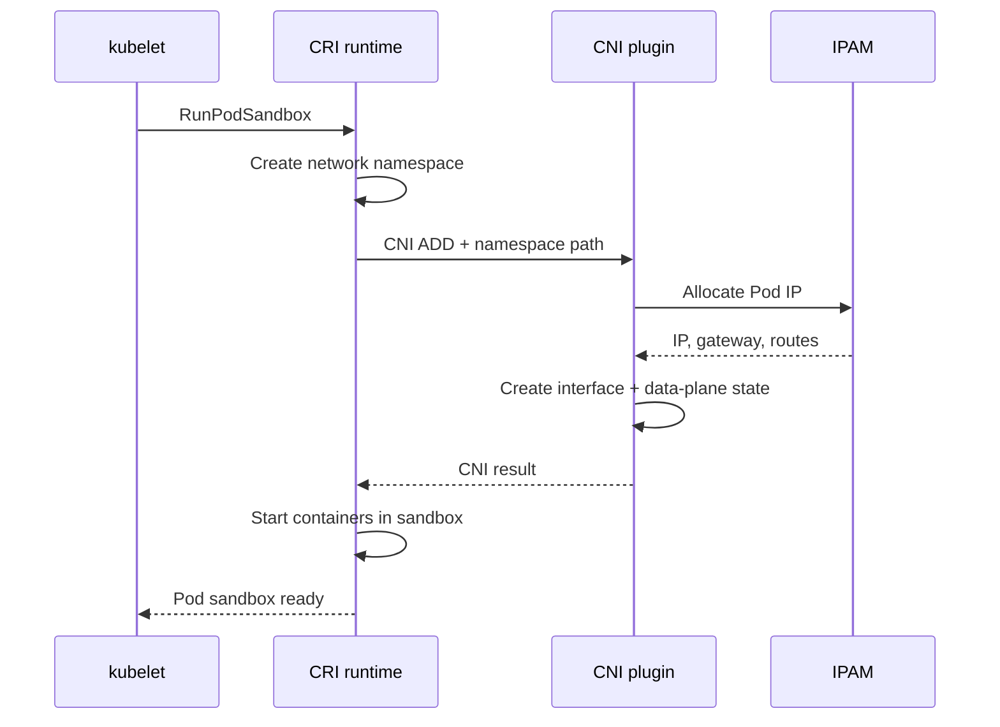

# Pod Networking

## Mục lục

- [Tổng quan](#tổng-quan)
- [1. Network identity của Pod](#1-network-identity-của-pod)
- [2. Pod sandbox và network namespace](#2-pod-sandbox-và-network-namespace)
- [3. Cách interface được nối vào Node](#3-cách-interface-được-nối-vào-node)
- [4. Giao tiếp trong cùng Pod](#4-giao-tiếp-trong-cùng-pod)
- [5. Pod-to-Pod cùng Node](#5-pod-to-pod-cùng-node)
- [6. Pod-to-Pod khác Node](#6-pod-to-pod-khác-node)
- [7. Pod-to-external và return path](#7-pod-to-external-và-return-path)
- [8. MTU, fragmentation và PMTUD](#8-mtu-fragmentation-và-pmtud)
- [9. hostNetwork, hostPort và containerPort](#9-hostnetwork-hostport-và-containerport)
- [10. Pod lifecycle và IP](#10-pod-lifecycle-và-ip)
- [11. Security và NetworkPolicy](#11-security-và-networkpolicy)
- [12. Quan sát network từ Pod và Node](#12-quan-sát-network-từ-pod-và-node)
- [13. Thực hành cross-node](#13-thực-hành-cross-node)
- [14. Troubleshooting theo triệu chứng](#14-troubleshooting-theo-triệu-chứng)
- [15. Best practices](#15-best-practices)
- [Tài liệu tham khảo](#tài-liệu-tham-khảo)

---

## Tổng quan

Pod là đơn vị network nhỏ nhất mà Kubernetes cấp identity. Mỗi Pod thông thường có network namespace và Pod IP riêng; tất cả container trong Pod cùng nhìn thấy một network stack.

```text
Node
┌──────────────────────────────────────────┐
│ root network namespace                   │
│   route / bridge / tunnel / eBPF         │
│       │ veth                             │
│  ┌────┴───────────────────────────────┐  │
│  │ Pod network namespace              │  │
│  │ eth0 = 10.244.1.25                 │  │
│  │ lo   = 127.0.0.1                   │  │
│  │ app:8080  sidecar:15000            │  │
│  └────────────────────────────────────┘  │
└──────────────────────────────────────────┘
```

Pod networking phải trả lời ba câu hỏi:

1. Pod nhận IP và interface bằng cách nào?
2. Node biết route packet tới Pod local hoặc remote bằng cách nào?
3. Return packet có quay về đúng đường, đúng source/destination mà connection tracking mong đợi không?

## 1. Network identity của Pod

Pod IP thuộc về **Pod sandbox**, không thuộc riêng container. Nếu container application crash và restart trong cùng Pod sandbox, Pod IP thường giữ nguyên. Nếu Pod bị xóa và controller tạo Pod mới, IP có thể đổi.

```bash
kubectl get pod POD_NAME -o jsonpath='{.status.podIP}{"\n"}'
kubectl get pod POD_NAME -o jsonpath='{.status.podIPs[*].ip}{"\n"}'
```

Trong dual-stack, `.status.podIPs` có thể chứa cả IPv4 và IPv6.

### 1.1 Pod IP không phải durable identity

Không dùng Pod IP làm:

- Giá trị cố định trong ConfigMap.
- DNS record quản lý thủ công dài hạn.
- Allowlist production không có controller cập nhật.
- Identity bảo mật.

Dùng Service cho endpoint ổn định; dùng StatefulSet + headless Service khi cần hostname ổn định cho từng replica.

### 1.2 Pod IP và bind address

Process phải bind đúng address:

| Bind | Ý nghĩa |
|---|---|
| `127.0.0.1:8080` | Chỉ container trong cùng Pod truy cập được |
| `0.0.0.0:8080` | Listen mọi IPv4 interface trong Pod |
| `[::]:8080` | Listen IPv6; dual-stack behavior phụ thuộc OS/socket option |
| `PodIP:8080` | Bind cụ thể vào Pod IP, kém portable hơn |

Service không sửa được application chỉ bind loopback.

## 2. Pod sandbox và network namespace

Flow tổng quát khi tạo Pod:



Khi xóa Pod, runtime gọi `CNI DEL`. Nếu Node crash hoặc runtime không cleanup, stale IP allocation/interface có thể còn lại; CNI cần cơ chế garbage collection hoặc reconciliation.

### 2.1 Pause/sandbox container

Runtime thường giữ network namespace bằng một sandbox container rất nhỏ. Tên và implementation phụ thuộc runtime; không xây automation dựa vào tên `pause` cụ thể.

### 2.2 Network namespace tách biệt gì?

- Interface.
- IP address.
- Routing table.
- ARP/neighbor table.
- Socket và port space.
- Netfilter state trong phạm vi hỗ trợ.

Nó không tự tạo encryption, authentication hoặc application authorization.

## 3. Cách interface được nối vào Node

Một implementation Linux phổ biến tạo `veth pair`: một đầu chuyển vào Pod namespace và đổi tên thành `eth0`, đầu còn lại ở Node.

Các CNI có thể nối đầu Node vào:

- Linux bridge.
- Open vSwitch.
- Routing table trực tiếp.
- eBPF hook.
- Overlay tunnel device.
- Cloud virtual NIC.

Do đó lệnh debug Node phải phù hợp implementation. `brctl show` không có giá trị nếu CNI không dùng Linux bridge.

### 3.1 IPAM

IPAM chịu trách nhiệm chọn IP không trùng và cung cấp route/gateway. Model thường gặp:

- Mỗi Node có một Pod CIDR; IPAM cấp IP từ CIDR của Node.
- Cluster-wide IP pool; controller phối hợp allocation.
- Cloud VPC cấp secondary IP/prefix vào NIC của Node.

Kiểm tra Pod CIDR được gán cho Node nếu cluster dùng model per-node:

```bash
kubectl get nodes -o custom-columns=NAME:.metadata.name,POD_CIDR:.spec.podCIDR,POD_CIDRS:.spec.podCIDRs
```

Không phải CNI nào cũng dựa vào `.spec.podCIDR`.

## 4. Giao tiếp trong cùng Pod

Container trong cùng Pod gọi nhau bằng `localhost`:

```yaml
apiVersion: v1
kind: Pod
metadata:
  name: shared-network
spec:
  containers:
    - name: web
      image: nginx:1.27-alpine
      ports:
        - name: http
          containerPort: 80
    - name: client
      image: curlimages/curl:8.12.1
      command: ["sh", "-c", "sleep 3600"]
```

```bash
kubectl exec shared-network -c client -- curl -sS http://127.0.0.1:80/
```

Các container cũng thấy cùng hostname và `/etc/hosts` do kubelet tạo, nhưng filesystem và process namespace không mặc định dùng chung.

### 4.1 Port collision

Nếu web đã listen `0.0.0.0:80`, sidecar không thể bind cùng protocol/port. Chọn port riêng hoặc cấu hình interception rõ ràng.

## 5. Pod-to-Pod cùng Node

Giả sử A gọi B:

1. Process A tạo packet với destination là Pod IP B.
2. Route trong namespace A gửi packet qua `eth0`.
3. Packet đi qua veth sang Node.
4. Bridge/route/eBPF lookup tìm interface của B.
5. Policy hook cho phép hoặc drop.
6. Packet vào `eth0` của B.
7. Reply đi theo reverse path.

Quan sát từ Pod:

```bash
kubectl exec POD_A -- ip address
kubectl exec POD_A -- ip route get POD_B_IP
kubectl exec POD_B -- ss -lntup
```

Nếu `curl POD_B_IP:PORT` trả `Connection refused`, route thường đã tới host nhưng không có process listen hoặc firewall chủ động reject. Timeout thường gợi ý drop, route, policy hoặc return path, nhưng không tuyệt đối.

## 6. Pod-to-Pod khác Node

### 6.1 Native routing

Underlay biết route cho Pod CIDR:

```text
10.244.1.0/24 via Node 1
10.244.2.0/24 via Node 2
```

Node 1 forward packet đến Node 2 mà không bọc tunnel. BGP có thể quảng bá route tự động.

**Ưu điểm:** ít encapsulation overhead, source Pod IP rõ.

**Trade-off:** route scale, cloud route quota, tích hợp hạ tầng và security boundary phức tạp.

### 6.2 Overlay

Node 1 encapsulate packet Pod vào packet underlay:

```text
Outer: Node1IP → Node2IP
Inner: PodAIP  → PodBIP
```

Node 2 decapsulate rồi route tới B. VXLAN/Geneve là ví dụ; chi tiết phụ thuộc CNI.

**Ưu điểm:** underlay chỉ cần route Node IP.

**Trade-off:** giảm MTU, thêm CPU/latency và một lớp debug.

### 6.3 VPC-native

Pod nhận IP route được trong VPC. Điều này tích hợp tốt với load balancer/security construct của cloud nhưng bị giới hạn bởi subnet IP, NIC/prefix quota và provider behavior.

### 6.4 Cross-node test có ý nghĩa gì?

Nếu cùng Node thành công nhưng khác Node thất bại, ưu tiên kiểm tra:

- Tunnel/BGP route.
- Firewall giữa Node.
- MTU.
- `ip_forward` và reverse path filtering.
- CNI agent trên Node đích.
- Pod CIDR overlap hoặc route bị thiếu.

## 7. Pod-to-external và return path

Pod gửi packet tới default route. Hai khả năng chính:

### 7.1 Giữ source Pod IP

Mạng ngoài phải có route quay lại Pod CIDR. Observability và source-based policy chính xác hơn, nhưng hạ tầng cần nhận biết Pod route.

### 7.2 SNAT thành Node/egress IP

Node hoặc egress gateway rewrite source:

```text
Before SNAT: src=10.244.1.20 dst=203.0.113.10
After SNAT:  src=192.168.10.11 dst=203.0.113.10
```

Conntrack rewrite reply ngược lại. Nếu conntrack table đầy, flow mới có thể drop ngẫu nhiên.

Kiểm tra từ Pod:

```bash
kubectl exec POD_NAME -- curl -sS --max-time 5 https://ifconfig.me
```

Chỉ dùng endpoint công khai nếu policy môi trường cho phép. Trong production, dùng endpoint kiểm thử do tổ chức quản lý.

## 8. MTU, fragmentation và PMTUD

MTU mismatch thường có pattern:

- TCP connect được.
- Request nhỏ thành công.
- TLS handshake, upload hoặc response lớn treo.
- Chỉ cross-node hoặc qua VPN mới lỗi.

Path MTU Discovery cần ICMP phù hợp. Chặn toàn bộ ICMP có thể tạo black-hole packet.

```bash
# IPv4, payload + 28 byte header; điều chỉnh dần
ping -M do -s 1400 DESTINATION
tracepath DESTINATION
```

Với overlay, Pod MTU phải trừ overhead tunnel khỏi underlay MTU. Không copy một con số giữa cloud/provider mà không xác minh.

## 9. hostNetwork, hostPort và containerPort

### 9.1 So sánh

| Field/cơ chế | Cấp external access? | Ràng buộc Node port? | Use case |
|---|---:|---:|---|
| `containerPort` | Không | Không | Metadata, named port, probe/Service reference |
| `hostPort` | Có thể qua Node IP | Có | Agent cần một port cố định trên mỗi Node |
| `hostNetwork` | Process dùng trực tiếp Node network | Có | CNI/DNS/node agent đặc biệt |
| Service | Có endpoint ổn định theo type | Không gắn Pod vào Node | Application thông thường |

### 9.2 `hostNetwork` manifest

```yaml
spec:
  hostNetwork: true
  dnsPolicy: ClusterFirstWithHostNet
```

Security impact lớn: process thấy network namespace Node và có thể tiếp cận local service. Kết hợp Pod Security, capability tối thiểu và scheduling có chủ đích.

### 9.3 `hostPort`

```yaml
ports:
  - name: metrics
    containerPort: 9100
    hostPort: 9100
    protocol: TCP
```

Scheduler phải tránh hai Pod dùng cùng host port trên một Node. DaemonSet là use case hợp lý hơn Deployment nhiều replica.

## 10. Pod lifecycle và IP

### 10.1 Container restart

Container restart trong cùng Pod thường không đổi network namespace/IP.

### 10.2 Pod replacement

Deployment rollout tạo Pod mới với IP mới. EndpointSlice controller thêm endpoint mới khi ready và loại endpoint cũ theo lifecycle.

### 10.3 Pod terminating

Khi Pod có deletion timestamp:

- EndpointSlice đánh dấu `terminating: true`.
- `ready` thường thành false; `serving` phản ánh readiness.
- Service proxy thường tránh endpoint terminating.
- PreStop, SIGTERM và load balancer propagation cần đủ thời gian drain.

Không giả định xóa Pod lập tức ngắt mọi connection; behavior connection đang tồn tại phụ thuộc protocol, proxy, conntrack và application.

## 11. Security và NetworkPolicy

Pod network mặc định là flat connectivity, không đồng nghĩa mọi traffic được tin cậy. NetworkPolicy có thể allow theo:

- Pod label.
- Namespace label.
- Kết hợp Pod + Namespace.
- CIDR và port/protocol.

Policy áp dụng cho Pod, nên app, init container và sidecar cùng chịu policy. Traffic loopback trong Pod không thể bị Pod tự chặn bằng NetworkPolicy chuẩn.

`hostNetwork` policy behavior không portable; kiểm tra CNI documentation.

## 12. Quan sát network từ Pod và Node

### 12.1 Ephemeral debug container

Nếu image application tối giản:

```bash
kubectl debug -it POD_NAME --image=nicolaka/netshoot --target=CONTAINER_NAME
```

Khả năng join process namespace và quyền tool phụ thuộc cluster policy/runtime. Không cấp privileged tùy tiện.

### 12.2 Lệnh trong Pod

```bash
ip address
ip route
cat /etc/resolv.conf
ss -lntup
getent hosts SERVICE_NAME
curl -sv --connect-timeout 2 http://DESTINATION:PORT/
```

### 12.3 Từ Node

Các lệnh cần quyền administrator:

```bash
ip link
ip route
ip neigh
ss -s
conntrack -S
nft list ruleset
iptables-save
```

Không sửa rule thủ công trên production Node trước khi lưu snapshot và xác định component owner; reconciliation có thể ghi đè.

### 12.4 Packet capture

Capture ở nhiều điểm để tìm hop mất packet:

```bash
tcpdump -ni any host POD_IP and port 8080
```

Luôn lọc host/port, giới hạn duration/file size và bảo vệ payload nhạy cảm.

## 13. Thực hành cross-node

Tạo web Pods phân tán theo hostname:

```yaml
apiVersion: apps/v1
kind: DaemonSet
metadata:
  name: net-server
  namespace: pod-network-lab
spec:
  selector:
    matchLabels:
      app: net-server
  template:
    metadata:
      labels:
        app: net-server
    spec:
      containers:
        - name: server
          image: registry.k8s.io/e2e-test-images/agnhost:2.53
          args: ["netexec", "--http-port=8080"]
          ports:
            - name: http
              containerPort: 8080
```

```bash
kubectl create namespace pod-network-lab
kubectl apply -f daemonset.yaml
kubectl rollout status daemonset/net-server -n pod-network-lab
kubectl get pod -n pod-network-lab -o wide
kubectl run client -n pod-network-lab --image=curlimages/curl:8.12.1 \
  --command -- sleep 3600
```

Chọn Pod IP ở cùng và khác Node so với client:

```bash
kubectl get pod -n pod-network-lab -o wide
kubectl exec -n pod-network-lab client -- \
  curl -sS --max-time 3 http://TARGET_POD_IP:8080/hostname
```

Quan sát route và DNS:

```bash
kubectl exec -n pod-network-lab client -- ip route
kubectl exec -n pod-network-lab client -- cat /etc/resolv.conf
```

Cleanup:

```bash
kubectl delete namespace pod-network-lab
rm -f daemonset.yaml
```

Nếu cluster chỉ có một Node, lab vẫn kiểm tra same-node path nhưng chưa chứng minh cross-node path.

## 14. Troubleshooting theo triệu chứng

### 14.1 Pod không có IP, kẹt `ContainerCreating`

```bash
kubectl describe pod POD_NAME
kubectl get pod -n kube-system -o wide
kubectl get events --all-namespaces --sort-by=.lastTimestamp
```

Tìm `FailedCreatePodSandBox`, CNI binary/config thiếu, IPAM exhausted, CNI agent không ready hoặc API timeout.

### 14.2 Cùng Node được, khác Node timeout

Kiểm tra Node chứa source/destination, route Pod CIDR, tunnel/BGP peer, firewall underlay và MTU.

### 14.3 Pod IP được nhưng Service không được

Pod network cơ bản hoạt động. Chuyển sang kiểm tra Service port, EndpointSlice và kube-proxy/service proxy.

### 14.4 Service được nhưng hostname ngoài không được

Tách DNS cluster với DNS external. `nslookup service` và `nslookup public.example.com` có upstream path khác nhau.

### 14.5 Chỉ payload lớn thất bại

Ưu tiên MTU/PMTUD, TLS packet size, VPN/overlay overhead và ICMP filter.

### 14.6 Kết nối chập chờn theo Node

Liệt kê endpoint kèm `nodeName`, test từng Pod IP và đối chiếu CNI agent/Node condition. Một Node data plane lỗi thường tạo tỷ lệ thất bại tương ứng số endpoint trên Node đó.

## 15. Best practices

- Application listen trên interface phù hợp; dùng `0.0.0.0`/`[::]` khi cần nhận traffic ngoài Pod.
- Không dựa vào Pod IP bền vững.
- Tránh `hostNetwork` và `hostPort` nếu Service giải quyết được.
- Kiểm thử cả same-node, cross-node, cross-zone và egress.
- Giữ Node/Pod/Service CIDR không overlap.
- Cấu hình MTU theo underlay và encapsulation thực tế.
- Theo dõi IPAM utilization trước khi subnet cạn.
- Dùng readiness và graceful termination để EndpointSlice phản ánh traffic eligibility.
- Chỉ packet capture với filter và quy trình bảo vệ dữ liệu.
- Biết CNI implementation trước khi dùng lệnh bridge/tunnel/eBPF cụ thể.

Tiếp tục với [Container Network Interface](/networking/cni/) để hiểu contract giữa runtime và network plugin.

---

## Tài liệu tham khảo

- [Kubernetes Network Model](https://kubernetes.io/docs/concepts/services-networking/)
- [Network Plugins](https://kubernetes.io/docs/concepts/extend-kubernetes/compute-storage-net/network-plugins/)
- [Pod Lifecycle](https://kubernetes.io/docs/concepts/workloads/pods/pod-lifecycle/)
