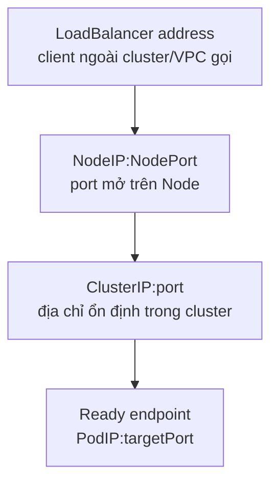

# ClusterIP, NodePort và LoadBalancer

## Mục lục

- [Tổng quan](#tổng-quan)
- [1. Service type khác nhau ở điểm truy cập](#1-service-type-khác-nhau-ở-điểm-truy-cập)
- [2. ClusterIP](#2-clusterip)
- [3. NodePort](#3-nodeport)
- [4. LoadBalancer](#4-loadbalancer)
- [5. ExternalName](#5-externalname)
- [6. Headless không phải Service type](#6-headless-không-phải-service-type)
- [7. externalTrafficPolicy và source IP](#7-externaltrafficpolicy-và-source-ip)
- [8. Internal load balancer](#8-internal-load-balancer)
- [9. Chọn cơ chế expose](#9-chọn-cơ-chế-expose)
- [10. Security và cost](#10-security-và-cost)
- [11. Thực hành](#11-thực-hành)
- [12. Troubleshooting](#12-troubleshooting)
- [13. Best practices](#13-best-practices)
- [Tài liệu tham khảo](#tài-liệu-tham-khảo)

---

## Tổng quan

`spec.type` quyết định cách Service được expose. Bốn giá trị chuẩn:

| Type | Endpoint client dùng | Scope điển hình | Ai cung cấp data plane? |
|---|---|---|---|
| `ClusterIP` | Service VIP/DNS | Nội bộ cluster | kube-proxy hoặc replacement |
| `NodePort` | `NodeIP:nodePort` và ClusterIP | Ngoài cluster qua Node | Service proxy trên mọi Node |
| `LoadBalancer` | External/internal LB address | VPC/Internet | Cloud/LB controller + Service data plane |
| `ExternalName` | DNS CNAME | Alias tới DNS ngoài cluster | CoreDNS/DNS, không proxy |

`NodePort` thường giữ cách truy cập của `ClusterIP`; `LoadBalancer` thường xây trên NodePort, trừ implementation route trực tiếp tới Pod và tắt allocation NodePort.

## 1. Service type khác nhau ở điểm truy cập

Cách đọc dễ nhất: `spec.type` không phải bốn cơ chế hoàn toàn tách rời. Mỗi type thường **mở thêm một cách để client đi vào cùng một Service**.

- `ClusterIP` tạo địa chỉ ổn định bên trong cluster: client trong cluster gọi `Service DNS/ClusterIP:port`.
- `NodePort` giữ cách truy cập qua `ClusterIP`, rồi mở thêm một port trên Node: client có thể gọi `NodeIP:nodePort`.
- `LoadBalancer` thường giữ cách truy cập qua `NodePort` và `ClusterIP`, rồi yêu cầu cloud/LB controller cấp thêm địa chỉ load balancer bên ngoài hoặc trong VPC.
- `ExternalName` là ngoại lệ: nó chỉ tạo DNS alias dạng CNAME, không tạo VIP và không proxy packet.

Nói ngắn gọn, với ba type đầu, type “cao hơn” thường có thêm một entry point ở phía trước type “thấp hơn”:



Ví dụ cùng một backend `api` có `targetPort: 8080`:

| Type | Client thường gọi gì? | Traffic cuối cùng tới đâu? |
|---|---|---|
| `ClusterIP` | `api.production.svc.cluster.local:80` hoặc `10.96.x.y:80` | Một Pod ready ở `PodIP:8080` |
| `NodePort` | `192.0.2.10:30080` | Cũng là một Pod ready ở `PodIP:8080` |
| `LoadBalancer` | `203.0.113.20:443` hoặc DNS của LB | Cũng là một Pod ready ở `PodIP:8080` |

Điểm quan trọng là Service type thay đổi **điểm vào** mà client thấy, không thay đổi bản chất backend: Kubernetes vẫn cần danh sách endpoint ready để gửi traffic tới Pod phù hợp.

Sơ đồ trên là mental model phổ biến, không phải đường đi bắt buộc ở mọi cluster. Một số cloud controller hoặc CNI có thể cấu hình load balancer target thẳng Pod IP, target Node nhưng bỏ qua NodePort, hoặc dùng eBPF thay vì rule kube-proxy truyền thống. Khi vận hành production, luôn kiểm tra tài liệu của provider và trạng thái Service thực tế.

Ingress và Gateway API **không phải Service type**. Chúng là API routing L7/L4 thường đứng trước một hoặc nhiều Service backend.

## 2. ClusterIP

`ClusterIP` là Service type mặc định. Nó tạo một địa chỉ IP ảo ổn định chỉ dùng được **bên trong cluster**. Client nội bộ không cần biết Pod nào đang chạy hay Pod IP hiện tại là gì; client chỉ gọi DNS/ClusterIP của Service.

Hình dung một Deployment `api` có ba Pod:

```text
Pod api-1: 10.244.1.11:8080
Pod api-2: 10.244.2.12:8080
Pod api-3: 10.244.3.13:8080
```

Service `ClusterIP` đặt một địa chỉ ổn định ở phía trước các Pod đó:

```text
Client trong cluster
  gọi api.production.svc.cluster.local:80
      ↓ DNS trả về ClusterIP, ví dụ 10.96.30.40
  gọi 10.96.30.40:80
      ↓ service proxy chọn một endpoint ready
  tới một Pod api-x:8080
```

Điểm dễ nhầm: `10.96.30.40` trong ví dụ trên thường **không phải IP của một Pod và cũng không phải IP gắn trên card mạng của một Node**. Nó là virtual IP của Service. kube-proxy hoặc data plane thay thế watch Service và EndpointSlice, rồi program rule để traffic tới `ClusterIP:port` được chuyển sang một `PodIP:targetPort` phù hợp.

Manifest tối thiểu:

```yaml
apiVersion: v1
kind: Service
metadata:
  name: api
  namespace: production
spec:
  type: ClusterIP
  selector:
    app: api
  ports:
    - name: http
      port: 80
      targetPort: 8080
```

Đọc manifest này theo ba ý:

| Field | Ý nghĩa |
|---|---|
| `type: ClusterIP` | Tạo Service IP nội bộ cluster. Nếu bỏ `type`, Kubernetes cũng dùng mặc định này. |
| `selector: app: api` | Chọn các Pod có label `app=api` làm backend. Chỉ Pod ready mới nhận traffic bình thường. |
| `port: 80` → `targetPort: 8080` | Client gọi Service port `80`; Service chuyển tới container/backend port `8080` trên Pod. |

Ví dụ nếu một Pod khác trong cùng cluster muốn gọi API, có nhiều cách viết DNS name. Tên đầy đủ nhất là:

```bash
curl http://api.production.svc.cluster.local/
```

Trong thực tế bạn thường thấy dạng ngắn hơn:

| Client đang ở đâu? | Có thể gọi | Ghi chú |
|---|---|---|
| Cùng Namespace `production` | `http://api/` | DNS search path của Pod tự thử `api.production.svc.cluster.local`. |
| Khác Namespace | `http://api.production/` | Đây là dạng `<service-name>.<namespace>`; DNS search path tự bổ sung `.svc.cluster.local`. |
| Muốn viết rõ tuyệt đối | `http://api.production.svc.cluster.local/` | Dùng được từ mọi Namespace trong cluster. |

Vì vậy `api.production` và `api.production.svc.cluster.local` cùng trỏ tới Service `api` trong Namespace `production`; khác nhau ở mức độ viết tắt. Dạng chỉ có `api` chỉ an toàn khi client cũng nằm trong Namespace `production`.

### 2.1 Kiểm tra ClusterIP và endpoint

Sau khi tạo Service, kiểm tra địa chỉ ổn định của Service:

```bash
kubectl get svc api -n production -o wide
```

Output sẽ có cột `CLUSTER-IP`, ví dụ:

```text
NAME   TYPE        CLUSTER-IP    EXTERNAL-IP   PORT(S)   AGE   SELECTOR
api    ClusterIP   10.96.30.40   <none>        80/TCP    1m    app=api
```

Sau đó kiểm tra Service có backend ready hay chưa:

```bash
kubectl get endpointslice -n production \
  -l kubernetes.io/service-name=api
```

Nếu Service có `CLUSTER-IP` nhưng không có endpoint, DNS vẫn có thể resolve nhưng request sẽ không tới được backend. Khi đó thường cần kiểm tra label selector và readiness của Pod.

### 2.2 Khi nào dùng ClusterIP?

Use case phù hợp:

- Service-to-service nội bộ, ví dụ `frontend` gọi `api`, `api` gọi `postgres` qua Service nội bộ.
- Backend cho Gateway/Ingress controller. Bên ngoài đi vào Ingress/Gateway; controller tiếp tục route tới Service `ClusterIP`.
- Monitoring/admin endpoint chỉ nên truy cập từ trong cluster hoặc qua đường debug có kiểm soát.

`ClusterIP` chỉ routable theo cluster data plane. Máy laptop, người dùng Internet hoặc hệ thống ngoài VPC thường không gọi trực tiếp được `10.96.x.y`. Không nên quảng bá `ClusterIP` ra ngoài như một địa chỉ public.

### 2.3 Truy cập tạm thời từ máy operator

Nếu cần debug từ máy operator, dùng `kubectl port-forward` để tạo đường hầm tạm thời:

```bash
kubectl port-forward -n production service/api 8080:80
curl http://127.0.0.1:8080/
```

Lệnh trên nghĩa là: cổng `8080` trên máy local được forward tới Service `api` port `80` trong Namespace `production`. Đây không phải production exposure vì connection phụ thuộc workstation, tiến trình `kubectl` và API server path.

## 3. NodePort

Manifest:

```yaml
apiVersion: v1
kind: Service
metadata:
  name: api-nodeport
spec:
  type: NodePort
  selector:
    app: api
  ports:
    - name: http
      port: 80
      targetPort: 8080
      nodePort: 30080
```

Control plane tự cấp trong range mặc định `30000-32767` nếu bỏ `nodePort`. Range có thể được cluster admin thay đổi.

Client gọi:

```text
<NodeIP>:30080
```

Mọi Node được service proxy program port đó, kể cả Node không có backend local khi traffic policy là `Cluster`.

### 3.1 Static và dynamic allocation

Không hard-code NodePort nếu không cần. Nếu tổ chức dành static subrange, quản lý registry để tránh collision. API từ chối port đã được Service khác dùng.

### 3.2 `nodePortAddresses`

Service proxy có thể chỉ expose NodePort trên một số Node interface/CIDR. Với kube-proxy nftables mode, default behavior về interface khác iptables mode. Vì thế `curl` vào một secondary Node IP có thể không hoạt động dù primary IP hoạt động.

### 3.3 Use case phù hợp

- Lab hoặc môi trường bare-metal đơn giản.
- Backend target cho external load balancer tự quản lý.
- Protocol L4 khi chưa có LB integration.

Không nên coi NodePort public trực tiếp là kiến trúc production mặc định: cần firewall, stable Node address, health check, TLS và DDoS protection riêng.

## 4. LoadBalancer

```yaml
apiVersion: v1
kind: Service
metadata:
  name: api-public
spec:
  type: LoadBalancer
  selector:
    app: api
  ports:
    - name: https
      port: 443
      targetPort: 8443
```

Kubernetes chỉ định intent; cloud controller hoặc load balancer implementation provision hạ tầng. Trạng thái được publish ở:

```bash
kubectl get svc api-public \
  -o jsonpath='{.status.loadBalancer.ingress}{"\n"}'
```

### 4.1 Asynchronous provisioning

`EXTERNAL-IP: <pending>` nghĩa controller chưa cấp address. Kiểm tra Events thay vì chờ mù:

```bash
kubectl describe svc api-public
kubectl get events --sort-by=.lastTimestamp
```

Nguyên nhân: controller không cài, quota, subnet/tag sai, permission, annotation/class không hợp lệ hoặc provider đang provision.

### 4.2 NodePort allocation

Mặc định nhiều implementation cấp NodePort. Nếu LB route trực tiếp tới Pod và provider support:

```yaml
spec:
  type: LoadBalancer
  allocateLoadBalancerNodePorts: false
```

Đổi field thành `false` trên Service đã tồn tại không tự xóa NodePort cũ; cần loại `nodePort` theo quy trình an toàn.

### 4.3 `loadBalancerClass`

```yaml
spec:
  type: LoadBalancer
  loadBalancerClass: example.com/internal-l4
```

Field chọn controller khác default. Sau khi set, field không thể đổi. Chỉ dùng class đã được platform cung cấp.

### 4.4 `loadBalancerIP`

`.spec.loadBalancerIP` đã deprecated từ Kubernetes v1.24 vì semantics không portable và không phù hợp dual-stack. Dùng provider-specific API/annotation hoặc Gateway implementation theo tài liệu platform.

### 4.5 Bare-metal

Bare-metal cần implementation như controller quảng bá VIP bằng ARP/NDP/BGP hoặc tích hợp appliance. Chỉ tạo `type: LoadBalancer` không tự sinh load balancer nếu cluster không có controller.

## 5. ExternalName

```yaml
apiVersion: v1
kind: Service
metadata:
  name: payments-external
  namespace: production
spec:
  type: ExternalName
  externalName: payments.example.net
```

CoreDNS trả CNAME từ:

```text
payments-external.production.svc.cluster.local
→ payments.example.net
```

Không có ClusterIP, EndpointSlice hay packet proxy.

### 5.1 Hạn chế HTTP/TLS

Client kết nối bằng hostname nội bộ, nên:

- HTTP `Host` header có thể là tên nội bộ mà upstream không nhận.
- TLS SNI/certificate có thể không match tên nội bộ.
- NetworkPolicy theo Service name không tồn tại trong API chuẩn.

Thường tốt hơn để application dùng canonical external hostname trực tiếp nếu contract cho phép.

### 5.2 Không đặt IP vào `externalName`

DNS xem chuỗi giống IPv4 như hostname, không phải A record. Muốn ánh xạ IP, dùng selectorless Service + EndpointSlice.

## 6. Headless không phải Service type

Headless là ClusterIP Service với:

```yaml
spec:
  clusterIP: None
```

DNS trả endpoint IP trực tiếp; không có Service VIP/proxy load balancing. Nó có thể vẫn để `type: ClusterIP` mặc định.

## 7. externalTrafficPolicy và source IP

### 7.1 `Cluster`

```yaml
spec:
  externalTrafficPolicy: Cluster
```

- Mọi healthy Node có thể nhận traffic từ LB.
- Node có thể forward sang Pod trên Node khác.
- Tải phân phối rộng hơn.
- Source client IP có thể bị SNAT tùy path/implementation.

### 7.2 `Local`

```yaml
spec:
  externalTrafficPolicy: Local
```

- Node chỉ forward tới endpoint local.
- Thường giữ source IP tốt hơn.
- Loại thêm cross-node hop.
- Node không có local endpoint phải bị LB health check loại.
- Pod phân bố không đều gây load imbalance.

```text
LB
├── Node A có 3 Pod → nhận traffic
├── Node B có 1 Pod → nhận lượng traffic theo Node, Pod này dễ quá tải
└── Node C có 0 Pod → health check phải fail
```

Kết hợp topology spread/DaemonSet hoặc LB target mode phù hợp. Không bật `Local` chỉ vì muốn source IP mà chưa kiểm tra health check.

## 8. Internal load balancer

Internal/public LB thường được chọn qua annotation hoặc class do provider định nghĩa. Không có annotation portable chung cho mọi cloud.

Pattern:

```yaml
metadata:
  annotations:
    provider.example.com/load-balancer-scheme: internal
spec:
  type: LoadBalancer
```

Đọc tài liệu provider đúng version. Admission policy có thể buộc internal mặc định để tránh accidental public exposure.

## 9. Chọn cơ chế expose

| Nhu cầu | Lựa chọn thường phù hợp |
|---|---|
| Client chỉ trong cluster | ClusterIP |
| Một TCP/UDP Service cần external VIP | LoadBalancer |
| Nhiều HTTP host/path chung entry point | Gateway API hoặc Ingress |
| Bare-metal chưa có LB integration | NodePort sau external LB, hoặc cài LB controller |
| Alias DNS ngoài cluster | ExternalName, sau khi xét HTTP/TLS |
| Peer discovery trực tiếp | Headless Service |
| Debug tạm | `kubectl port-forward` |

Gateway API được ưu tiên cho thiết kế mới cần route phong phú và delegation. Ingress API vẫn stable nhưng frozen.

## 10. Security và cost

Mỗi LoadBalancer Service có thể tạo một cloud LB riêng, phát sinh:

- Chi phí theo giờ/data processing.
- Public IP.
- Security group/firewall rule.
- Health check và quota.

Giảm risk:

- Admission policy kiểm soát `type: LoadBalancer` và annotation public.
- Dùng internal LB mặc định khi không cần Internet.
- Consolidate HTTP traffic qua Gateway, nhưng cân nhắc blast radius.
- Bật TLS, access log, WAF/DDoS theo threat model.
- Giới hạn NodePort interface/firewall.
- Dọn Service để controller dọn LB; kiểm tra cloud orphan.

## 11. Thực hành

```bash
kubectl create namespace service-type-lab
kubectl create deployment web -n service-type-lab --image=nginx:1.27-alpine
kubectl expose deployment web -n service-type-lab \
  --name=web-clusterip --port=80 --target-port=80
kubectl expose deployment web -n service-type-lab \
  --name=web-nodeport --type=NodePort --port=80 --target-port=80
kubectl get svc -n service-type-lab -o wide
```

Từ Pod client:

```bash
kubectl run client -n service-type-lab --image=curlimages/curl:8.12.1 \
  --restart=Never --command -- sleep 3600
kubectl wait -n service-type-lab --for=condition=Ready pod/client --timeout=120s
kubectl exec -n service-type-lab client -- curl -sS http://web-clusterip/
```

Lấy NodePort và Node IP:

```bash
kubectl get svc web-nodeport -n service-type-lab \
  -o jsonpath='{.spec.ports[0].nodePort}{"\n"}'
kubectl get node -o wide
```

Từ máy có route/firewall tới Node, thử `http://NODE_IP:NODE_PORT/`. Local cluster như kind/minikube có network virtualization khác; dùng command của distribution nếu Node IP không trực tiếp reachable.

Không tạo LoadBalancer chỉ để lab nếu cloud account tính phí. Nếu môi trường local có LB implementation, tạo có chủ đích và xóa ngay sau test.

Cleanup:

```bash
kubectl delete namespace service-type-lab
```

## 12. Troubleshooting

### 12.1 ClusterIP không hoạt động

Kiểm tra selector, EndpointSlice, targetPort, service proxy và gọi Pod IP trực tiếp.

### 12.2 NodePort chỉ hoạt động trên một số Node/IP

Kiểm tra:

- `nodePortAddresses`/proxy mode.
- Node firewall/security group.
- Node health và service proxy.
- `externalTrafficPolicy: Local` và local endpoint.
- Route từ client tới Node subnet.

### 12.3 LoadBalancer `<pending>`

```bash
kubectl describe svc SERVICE -n NS
kubectl get event -n NS --sort-by=.lastTimestamp
kubectl get pod -A | grep -iE 'cloud|load-balancer|metallb'
```

Xác minh controller, quota, permission, subnet, class và annotation.

### 12.4 LB có address nhưng timeout

Tách hop:

1. DNS external resolve đúng address?
2. Firewall/listener mở port?
3. LB backend health?
4. NodePort hoặc direct Pod target hoạt động?
5. Service có ready endpoint?
6. Return path/source NAT đúng?

### 12.5 Source IP không đúng

Đọc provider path và `externalTrafficPolicy`. Proxy/Gateway có thể thêm `X-Forwarded-For` cho HTTP, nhưng header chỉ đáng tin khi application chỉ nhận từ trusted proxy.

### 12.6 ExternalName resolve nhưng TLS lỗi

Kiểm tra SNI/certificate/hostname. Đây là semantic limitation, không phải CoreDNS nhất thiết bị lỗi.

## 13. Best practices

- Dùng ClusterIP mặc định cho internal service.
- Dùng Gateway API/Ingress để chia sẻ HTTP entry point và quản lý TLS/routing.
- Không expose NodePort trực tiếp ra Internet nếu chưa có firewall, LB và health check.
- Để control plane tự cấp NodePort trừ khi có registry static rõ ràng.
- Chọn `externalTrafficPolicy: Local` chỉ sau khi thiết kế Pod distribution và LB health check.
- Dùng `allocateLoadBalancerNodePorts: false` chỉ khi implementation route trực tiếp và support.
- Không dùng deprecated `loadBalancerIP` cho thiết kế portable.
- Kiểm soát public/internal LB bằng policy và class/annotation chuẩn của platform.
- Theo dõi LB cost, quota, provisioning error và orphan resource.
- Xác minh behavior trên provider thực tế; Service API không chuẩn hóa mọi chi tiết cloud LB.

Tiếp tục với [Endpoints và EndpointSlices](/networking/endpoints-endpointslices/) để thấy nguồn backend mà service proxy sử dụng.

---

## Tài liệu tham khảo

- [Service Types](https://kubernetes.io/docs/concepts/services-networking/service/#publishing-services-service-types)
- [Source IP for Services](https://kubernetes.io/docs/tutorials/services/source-ip/)
- [Virtual IPs and Service Proxies](https://kubernetes.io/docs/reference/networking/virtual-ips/)
