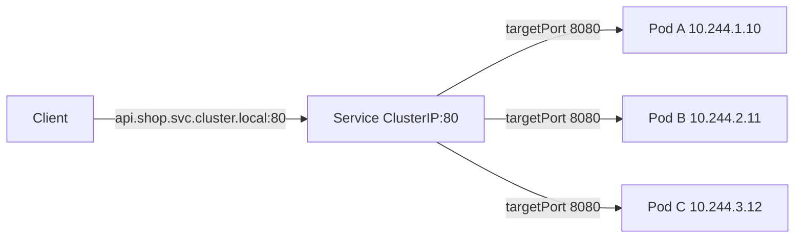
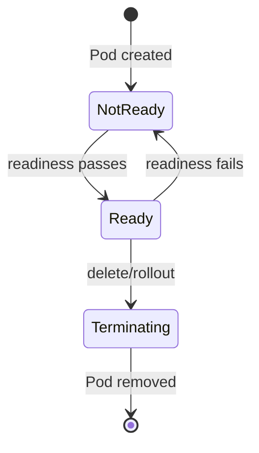

# Service

## Mục lục

- [Tổng quan](#tổng-quan)
- [1. Vì sao cần Service?](#1-vì-sao-cần-service)
- [2. Từ selector đến EndpointSlice](#2-từ-selector-đến-endpointslice)
- [3. Port, targetPort và protocol](#3-port-targetport-và-protocol)
- [4. ClusterIP và virtual IP](#4-clusterip-và-virtual-ip)
- [5. Service discovery](#5-service-discovery)
- [6. Headless Service](#6-headless-service)
- [7. Service không có selector](#7-service-không-có-selector)
- [8. Readiness và terminating endpoint](#8-readiness-và-terminating-endpoint)
- [9. Session affinity](#9-session-affinity)
- [10. Traffic policies và locality](#10-traffic-policies-và-locality)
- [11. Dual-stack](#11-dual-stack)
- [12. Thiết kế Service production](#12-thiết-kế-service-production)
- [13. Thực hành](#13-thực-hành)
- [14. Troubleshooting](#14-troubleshooting)
- [15. Best practices](#15-best-practices)
- [Tài liệu tham khảo](#tài-liệu-tham-khảo)

---

## Tổng quan

Service là API object cung cấp network endpoint ổn định cho một tập backend thường là Pod. Pod có thể scale, rollout và đổi IP; client vẫn gọi một DNS name và Service IP ổn định.



Service gồm hai phần logic:

- **Control plane**: selector được controller chuyển thành EndpointSlice.
- **Data plane**: kube-proxy hoặc implementation thay thế program rule để traffic đến VIP được chuyển tới endpoint.

Service không chạy application proxy trong object và không tự kiểm tra HTTP health; nó dùng trạng thái endpoint hình thành từ Pod readiness.

## 1. Vì sao cần Service?

Deployment quản lý một tập Pod thay đổi:

```text
10:00 Pod api-a = 10.244.1.10
10:05 rollout tạo api-b = 10.244.2.21
10:06 api-a bị xóa
```

Nếu client hard-code `10.244.1.10`, rollout làm kết nối mới thất bại. Service thêm abstraction:

```text
api.production.svc.cluster.local
          ↓ DNS
10.96.30.40:80
          ↓ Service proxy
Pod ready bất kỳ:8080
```

Service phù hợp khi backend tương đương ở cấp connection. Nếu client cần chọn từng replica có identity riêng, dùng headless Service và StatefulSet.

## 2. Từ selector đến EndpointSlice

Service mẫu:

```yaml
apiVersion: v1
kind: Service
metadata:
  name: api
  namespace: production
spec:
  selector:
    app.kubernetes.io/name: api
    app.kubernetes.io/instance: production
  ports:
    - name: http
      protocol: TCP
      port: 80
      targetPort: http
```

Pod template tương ứng:

```yaml
metadata:
  labels:
    app.kubernetes.io/name: api
    app.kubernetes.io/instance: production
spec:
  containers:
    - name: api
      image: example.com/api:2.4.0
      ports:
        - name: http
          containerPort: 8080
```

EndpointSlice controller watch Service và Pod, rồi tạo EndpointSlice có label:

```text
kubernetes.io/service-name=api
```

Kiểm tra:

```bash
kubectl get service api -n production -o wide
kubectl get pod -n production -l app.kubernetes.io/name=api -o wide
kubectl get endpointslice -n production \
  -l kubernetes.io/service-name=api -o yaml
```

### 2.1 Selector là equality-based map

`spec.selector` của Service là map key-value; mọi label phải match. Một typo tạo Service hợp lệ nhưng không có endpoint.

Không chọn label quá rộng như chỉ `app: api` nếu cùng Namespace có canary, migration job hoặc debug Pod cũng mang label đó.

### 2.2 Đổi selector có thể chuyển traffic ngay

API có thể cho sửa selector, nhưng thay đổi live có thể chuyển toàn bộ traffic ngay lập tức. Dùng Deployment rollout, version label có chiến lược hoặc Service riêng cho canary thay vì edit tùy hứng.

## 3. Port, targetPort và protocol

```yaml
ports:
  - name: http
    protocol: TCP
    port: 80
    targetPort: http
```

| Field | Ý nghĩa |
|---|---|
| `port` | Port client dùng trên Service |
| `targetPort` | Port trên endpoint; số hoặc named port |
| `protocol` | `TCP` mặc định, `UDP`, hoặc `SCTP` khi environment hỗ trợ |
| `name` | Tên duy nhất trong Service; bắt buộc khi nhiều port |
| `appProtocol` | Hint protocol cấp application cho implementation |

Nếu bỏ `targetPort`, mặc định bằng `port`.

### 3.1 Named targetPort

Named port cho phép phiên bản Pod khác nhau dùng số port khác nhưng giữ cùng tên:

```yaml
# Pod v1
ports:
  - name: http
    containerPort: 8080

# Pod v2
ports:
  - name: http
    containerPort: 9090
```

EndpointSlice có thể tách theo tổ hợp port khác nhau. Điều này hữu ích cho migration nhưng tăng complexity; rollout phải được test.

### 3.2 Multi-port Service

```yaml
ports:
  - name: http
    port: 80
    targetPort: http
  - name: metrics
    port: 9090
    targetPort: metrics
```

Mọi port phải có tên duy nhất, lowercase và dùng ký tự hợp lệ.

### 3.3 `containerPort` không mở port

Process phải thật sự listen:

```bash
kubectl exec POD_NAME -n production -- ss -lntup
```

Nếu image không có `ss`, dùng ephemeral debug container hoặc kiểm tra application log/metric.

## 4. ClusterIP và virtual IP

Service mặc định có `type: ClusterIP`. API server cấp IP từ Service CIDR:

```bash
kubectl get svc api -n production \
  -o jsonpath='{.spec.clusterIP}{":"}{.spec.ports[0].port}{"\n"}'
```

ClusterIP thường không được bind trên interface. Mỗi Node có service proxy watch Service + EndpointSlice và program kernel data plane.

```text
Packet dst=10.96.30.40:80
       ↓ match Service rule
Chọn endpoint 10.244.2.21:8080
       ↓ DNAT
Packet dst=10.244.2.21:8080
```

Selection thường ở cấp connection/flow. HTTP keep-alive hoặc gRPC long-lived connection có thể dồn nhiều request vào một Pod dù Service có nhiều endpoint.

### 4.1 Chọn ClusterIP thủ công

Có thể set `.spec.clusterIP` trong Service CIDR, nhưng dễ collision và tạo operational coupling. Chỉ dùng khi tích hợp legacy thật sự yêu cầu; để allocator tự cấp trong đa số trường hợp.

### 4.2 Service IP không ping được

ClusterIP phục vụ protocol/port đã định nghĩa, không phải host interface đầy đủ. `ping ClusterIP` thất bại không chứng minh Service hỏng. Test đúng TCP/UDP port.

## 5. Service discovery

CoreDNS tạo record:

```text
api.production.svc.cluster.local → ClusterIP
```

Từ Pod cùng Namespace:

```bash
curl http://api:80/
```

Từ Namespace khác:

```bash
curl http://api.production:80/
curl http://api.production.svc.cluster.local:80/
```

DNS là cách khuyến nghị. Kubelet cũng có thể inject Service environment variable cho Service tồn tại trước lúc Pod start, ví dụ `API_SERVICE_HOST` hoặc `API_SERVICE_PORT_HTTP`. Cơ chế này được giải thích chi tiết trong [Environment Variables](/cau-hinh/environment-variables/#6-service-environment-variables-tự-động), nhưng không nên xem là discovery mechanism chính vì:

- Có ordering dependency: Service phải tồn tại trước khi Pod/container start.
- Không update trong Pod đang chạy.
- Nhiều Service làm environment lớn và khó audit.
- Có thể tắt cho Pod bằng `spec.enableServiceLinks: false` nếu application không cần legacy service links.

### 5.1 DNS name không phải health guarantee

DNS normal Service vẫn resolve ClusterIP ngay cả khi không có endpoint. Vì vậy:

```text
DNS success + connection timeout/refused
→ kiểm tra EndpointSlice, port và backend readiness
```

## 6. Headless Service

Headless Service đặt `clusterIP: None`:

```yaml
apiVersion: v1
kind: Service
metadata:
  name: database
spec:
  clusterIP: None
  selector:
    app: database
  ports:
    - name: database
      port: 5432
      targetPort: 5432
```

Không có VIP và kube-proxy không load-balance. DNS trả A/AAAA cho endpoint trực tiếp.

Use case:

- StatefulSet stable network identity.
- Database client tự discovery/load-balance.
- Peer-to-peer protocol.
- Cần kết nối cụ thể từng replica.

Trade-off:

- Client phải xử lý nhiều address, TTL và endpoint churn.
- DNS resolver/application có thể cache không đúng.
- Mỗi endpoint trực tiếp lộ topology và lifecycle.

Với StatefulSet + Pod `hostname/subdomain`, có thể có tên:

```text
db-0.database.production.svc.cluster.local
```

## 7. Service không có selector

Service selectorless có thể đại diện backend ngoài cluster hoặc migration hybrid:

```yaml
apiVersion: v1
kind: Service
metadata:
  name: legacy-api
  namespace: production
spec:
  ports:
    - name: https
      port: 443
      targetPort: 8443
```

Tạo EndpointSlice thủ công/controller-managed:

```yaml
apiVersion: discovery.k8s.io/v1
kind: EndpointSlice
metadata:
  name: legacy-api-1
  namespace: production
  labels:
    kubernetes.io/service-name: legacy-api
    endpointslice.kubernetes.io/managed-by: platform.example/manual
addressType: IPv4
ports:
  - name: https
    protocol: TCP
    port: 8443
endpoints:
  - addresses: ["192.0.2.10"]
    conditions:
      ready: true
  - addresses: ["192.0.2.11"]
    conditions:
      ready: true
```

Ràng buộc quan trọng:

- Endpoint không được là loopback, link-local hoặc ClusterIP của Service khác.
- Kubernetes không tự health-check endpoint thủ công.
- `kubectl port-forward service/...` không hoạt động qua API server nếu endpoint không map tới Pod, nhằm tránh bypass authorization.
- Owner phải cập nhật readiness và dọn EndpointSlice.

Không tạo legacy `Endpoints`; API này deprecated từ Kubernetes v1.33. Dùng EndpointSlice.

## 8. Readiness và terminating endpoint

Pod match selector nhưng chưa Ready thường xuất hiện endpoint với `ready: false` và không nhận Service traffic.



EndpointSlice conditions:

- `serving`: endpoint hiện có phục vụ được không.
- `terminating`: Pod đang terminate.
- `ready`: gần tương đương `serving && !terminating`, trừ behavior `publishNotReadyAddresses`.

### 8.1 `publishNotReadyAddresses`

Một số hệ phân tán cần discover peer trước khi ready:

```yaml
spec:
  publishNotReadyAddresses: true
```

Khi bật, DNS/endpoint có thể công bố Pod chưa ready. Application phải tự xử lý; không bật cho web Service thông thường chỉ để che readiness lỗi.

### 8.2 Graceful drain

Một rollout tốt phối hợp:

1. Readiness chuyển false hoặc endpoint bị đánh dấu terminating.
2. Service proxy/controller hội tụ.
3. Application ngừng nhận connection mới.
4. Connection cũ drain trong `terminationGracePeriodSeconds`.
5. Process exit.

PreStop chỉ là một phần; propagation delay và external LB health check cũng cần tính.

## 9. Session affinity

```yaml
spec:
  sessionAffinity: ClientIP
  sessionAffinityConfig:
    clientIP:
      timeoutSeconds: 10800
```

`ClientIP` cố gắng đưa flow từ cùng source IP tới cùng endpoint. Hạn chế:

- Nhiều user qua NAT có cùng source IP.
- Proxy/mesh có thể làm source trở thành proxy IP.
- Không thay thế application session store.
- Endpoint mất vẫn phá affinity.
- Không đảm bảo sticky theo cookie/user.

Dùng stateless application hoặc external session store khi có thể.

## 10. Traffic policies và locality

### 10.1 `internalTrafficPolicy`

- `Cluster`: dùng ready endpoint toàn cluster.
- `Local`: chỉ endpoint trên cùng Node; nếu không có thì drop.

```yaml
spec:
  internalTrafficPolicy: Local
```

`Local` giảm cross-node hop nhưng có thể gây black hole và load imbalance.

### 10.2 `externalTrafficPolicy`

- `Cluster`: external traffic có thể chuyển tới endpoint trên Node khác; source IP có thể bị SNAT.
- `Local`: chỉ local endpoint; thường giữ client source IP tốt hơn và giảm hop, nhưng cần LB health check đúng.

```yaml
spec:
  externalTrafficPolicy: Local
```

Phân phối Pod đều theo Node/zone trước khi chọn `Local`.

### 10.3 `trafficDistribution`

Field này biểu đạt **preference**, không phải guarantee chặt như policy. Giá trị support phụ thuộc Kubernetes version/service proxy; các lựa chọn mới gồm `PreferSameZone` và `PreferSameNode`, còn `PreferClose` là alias cũ được deprecate trong tài liệu mới.

```yaml
spec:
  trafficDistribution: PreferSameZone
```

Locality giảm latency/cross-zone cost nhưng có thể overload endpoint trong zone. Kết hợp topology spread và autoscaling theo traffic thực tế.

## 11. Dual-stack

```yaml
spec:
  ipFamilyPolicy: PreferDualStack
  ipFamilies:
    - IPv4
    - IPv6
```

Kiểm tra:

```bash
kubectl get svc api -o jsonpath='{.spec.clusterIPs}{"\n"}{.spec.ipFamilies}{"\n"}'
```

EndpointSlice được tách theo `addressType`. Client, DNS, CNI, proxy, NetworkPolicy và backend đều phải support family tương ứng.

## 12. Thiết kế Service production

### 12.1 Giữ ổn định giao diện client gọi

Giữ ổn định:

- Service name và Namespace.
- Port name/protocol.
- Application protocol/TLS expectation.
- Selector ownership.

Có thể đổi `targetPort` qua named port mà không đổi client contract.

### 12.2 Tách traffic theo audience

Không gộp application, admin và metrics vào một Service công khai nếu policy khác nhau. Tạo Service riêng:

```text
api-public   → Gateway/Ingress
api-internal → internal clients
api-metrics  → monitoring namespace
```

### 12.3 Không dùng Service như L7 load balancer

Service không route theo host/path/header, không terminate TLS và không retry HTTP. Dùng Gateway API/Ingress/service mesh cho L7.

### 12.4 Availability

Service không tạo replica. Nếu chỉ một Pod hoặc mọi endpoint cùng Node/zone, VIP ổn định không tạo HA. Kết hợp replica, anti-affinity/topology spread, readiness và PDB phù hợp.

## 13. Thực hành

Tạo workload và Service:

```bash
kubectl create namespace service-lab
kubectl create deployment echo -n service-lab \
  --image=registry.k8s.io/e2e-test-images/agnhost:2.53 -- \
  netexec --http-port=8080
kubectl scale deployment echo -n service-lab --replicas=3
kubectl expose deployment echo -n service-lab \
  --name=echo --port=80 --target-port=8080
kubectl run client -n service-lab --image=curlimages/curl:8.12.1 \
  --command -- sleep 3600
kubectl wait -n service-lab --for=condition=Available deployment/echo --timeout=120s
kubectl wait -n service-lab --for=condition=Ready pod/client --timeout=120s
```

Quan sát:

```bash
kubectl get pod,svc,endpointslice -n service-lab -o wide
kubectl describe svc echo -n service-lab
kubectl get endpointslice -n service-lab \
  -l kubernetes.io/service-name=echo -o yaml
```

Gọi DNS và VIP:

```bash
kubectl exec -n service-lab client -- nslookup echo
kubectl exec -n service-lab client -- \
  sh -c 'for i in 1 2 3 4 5; do curl -sS http://echo/hostname; echo; done'
```

Làm selector sai có chủ đích:

```bash
kubectl patch svc echo -n service-lab --type=merge \
  -p '{"spec":{"selector":{"app":"does-not-exist"}}}'
kubectl get endpointslice -n service-lab \
  -l kubernetes.io/service-name=echo -w
```

DNS vẫn resolve nhưng request không có backend. Khôi phục:

```bash
kubectl patch svc echo -n service-lab --type=merge \
  -p '{"spec":{"selector":{"app":"echo"}}}'
```

Cleanup:

```bash
kubectl delete namespace service-lab
```

## 14. Troubleshooting

### 14.1 Service không có endpoint

```bash
kubectl get svc SERVICE -n NS -o yaml
kubectl get pod -n NS --show-labels
kubectl get endpointslice -n NS -l kubernetes.io/service-name=SERVICE -o yaml
```

Kiểm tra selector, Namespace, Pod readiness và named targetPort.

### 14.2 Endpoint có nhưng request refused

Gọi Pod IP trực tiếp. Kiểm tra process listen và `targetPort`. `Connection refused` thường là port/process, không phải DNS.

### 14.3 Pod IP được, ClusterIP không được

Kiểm tra kube-proxy/replacement trên Node client, Service rule sync, protocol và ClusterIP family.

### 14.4 ClusterIP được, DNS name không được

Kiểm tra `/etc/resolv.conf`, `kube-dns` Service, CoreDNS Pods/log và NetworkPolicy egress port 53 TCP/UDP.

### 14.5 Chỉ một phần request lỗi

Test từng endpoint Pod IP, nhóm theo Node/zone/version. Có thể một endpoint chưa thực sự healthy dù readiness quá nông.

### 14.6 Không thấy traffic phân đều

Kiểm tra long-lived connection, HTTP keep-alive, sessionAffinity, traffic policy/distribution và client source NAT. Service cân bằng flow, không đảm bảo từng request round-robin.

### 14.7 `port-forward service` lỗi với selectorless Service

Đây là security constraint của API server khi endpoint không map tới Pod. Port-forward Pod hoặc dùng đường truy cập được ủy quyền khác.

## 15. Best practices

- Dùng selector label rõ ownership và tránh match debug/migration Pod.
- Dùng named ports, đặc biệt với multi-port Service.
- Kiểm tra EndpointSlice thay vì legacy Endpoints.
- Dùng DNS name, không hard-code ClusterIP/Pod IP.
- Thiết kế readiness phản ánh khả năng nhận traffic.
- Không bật `publishNotReadyAddresses` nếu protocol không cần peer discovery.
- Hiểu connection-level balancing trước khi đánh giá phân phối tải.
- Chỉ dùng `ClientIP` affinity khi thật sự cần; không lưu session local nếu có thể.
- Kết hợp locality với topology spread và capacity từng zone.
- Tách public/internal/metrics Service khi security policy khác nhau.
- Không coi Service là HA nếu backend không HA.
- Dùng Gateway API/Ingress cho routing HTTP(S), không ép Service làm L7.

Tiếp tục với [Service Types](/networking/service-types/) để chọn ClusterIP, NodePort, LoadBalancer hoặc ExternalName.

---

## Tài liệu tham khảo

- [Service](https://kubernetes.io/docs/concepts/services-networking/service/)
- [Virtual IPs and Service Proxies](https://kubernetes.io/docs/reference/networking/virtual-ips/)
- [EndpointSlices](https://kubernetes.io/docs/concepts/services-networking/endpoint-slices/)
