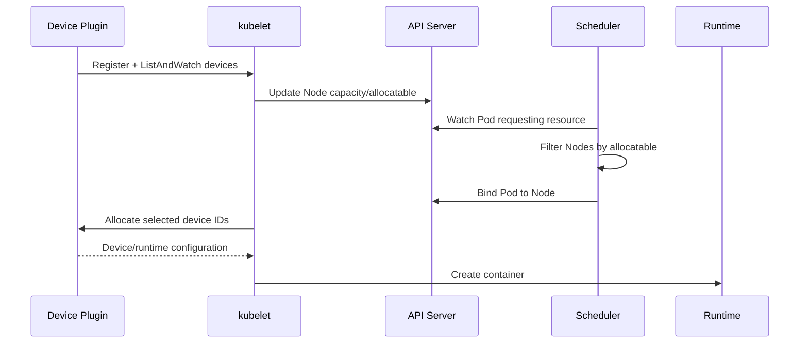

# Extended Resources và Device Plugins

## Mục lục

- [Tổng quan](#tổng-quan)
- [1. Extended Resource](#1-extended-resource)
- [2. Device Plugin giải quyết vấn đề gì](#2-device-plugin-giải-quyết-vấn-đề-gì)
- [3. Device Plugin lifecycle](#3-device-plugin-lifecycle)
- [4. Scheduling và allocation flow](#4-scheduling-và-allocation-flow)
- [5. Request thiết bị trong Pod](#5-request-thiết-bị-trong-pod)
- [6. Dedicated accelerator pool](#6-dedicated-accelerator-pool)
- [7. Health, failure và replacement](#7-health-failure-và-replacement)
- [8. NUMA topology và performance](#8-numa-topology-và-performance)
- [9. Dynamic Resource Allocation](#9-dynamic-resource-allocation)
- [10. Thực hành quan sát](#10-thực-hành-quan-sát)
- [11. Troubleshooting](#11-troubleshooting)
- [12. Best practices](#12-best-practices)
- [Tài liệu tham khảo](#tài-liệu-tham-khảo)

---

## Tổng quan

Extended Resource là resource name ngoài tập built-in `cpu`, `memory`, `ephemeral-storage` và huge pages. Node có thể advertise resource như `vendor.example/gpu`, `vendor.example/fpga` hoặc license slot; Pod request nó trong `resources` và scheduler bảo đảm tổng request không vượt Node allocatable.

Device Plugin là cơ chế kubelet dùng để phát hiện, theo dõi health và cấp phát thiết bị phần cứng cho Container. Vendor thường triển khai plugin dưới dạng DaemonSet trên Node có thiết bị.

```text
Hardware → Device Plugin → kubelet Node status
                            │ capacity/allocatable
                            ▼
Pod requests extended resource → scheduler chọn Node
                            │
                            ▼
                      kubelet Allocate
                            │
                            ▼
                     Container runtime
```

Kubernetes cung cấp framework; driver, runtime integration, image library và plugin cụ thể phụ thuộc vendor/platform.

## 1. Extended Resource

Tên resource phải là qualified name, thường dùng domain của nhà cung cấp:

```text
example.com/foo
nvidia.com/gpu
```

Domain `kubernetes.io` được dành riêng. Extended resources có các semantics quan trọng:

- Giá trị phải biểu diễn số nguyên; không request `0.5` thiết bị.
- Không overcommit.
- Nếu đặt cả request và limit, hai giá trị phải bằng nhau.
- Nếu chỉ đặt limit và không có admission default khác, Kubernetes dùng limit làm request.
- Scheduler chỉ bind khi Node advertise đủ allocatable.

Kiểm tra một Node:

```bash
kubectl get node NODE_NAME -o jsonpath='{.status.capacity}{"\n"}'
kubectl get node NODE_NAME -o jsonpath='{.status.allocatable}{"\n"}'
```

Liệt kê một resource cụ thể:

```bash
kubectl get nodes \
  -o custom-columns=NAME:.metadata.name,CAPACITY:.status.capacity.vendor\.example/gpu,ALLOCATABLE:.status.allocatable.vendor\.example/gpu
```

Thay `vendor.example/gpu` bằng resource name thật; escape JSONPath có thể khác theo shell, vì vậy `kubectl get node -o yaml` là phương án kiểm tra đáng tin khi command tùy biến khó đọc.

## 2. Device Plugin giải quyết vấn đề gì

Kubelet không tích hợp trực tiếp mọi loại GPU, NIC, FPGA hoặc accelerator. Device Plugin API tạo boundary:

- Vendor/plugin biết cách enumerate device và health.
- Kubelet biết số lượng allocatable và phối hợp lifecycle Pod.
- Scheduler chỉ cần resource accounting theo tên/count.
- Runtime nhận device node, mount, environment hoặc CDI annotation do allocation trả về.

Device plugin không tự cài kernel driver, không bảo đảm application image có user-space library tương thích và không tự phân bố workload qua zone. Các lớp đó vẫn cần node image management, validation và scheduling policy.

## 3. Device Plugin lifecycle

Plugin thường chạy privileged trên từng Node liên quan và kết nối kubelet qua Unix socket dưới:

```text
/var/lib/kubelet/device-plugins/
```

Luồng chính:

1. Plugin khởi động gRPC server.
2. Plugin đăng ký resource name và endpoint với kubelet Registration service.
3. `ListAndWatch` liên tục gửi danh sách device ID và health.
4. Kubelet cập nhật Node capacity/allocatable.
5. Khi Pod được admit, kubelet gọi `Allocate` cho device IDs đã chọn.
6. Plugin trả thông tin cần thiết để runtime cấu hình Container.

Các RPC tùy chọn như `GetPreferredAllocation` hoặc `PreStartContainer` hỗ trợ lựa chọn/tác vụ thiết bị nâng cao. Plugin phải tự đăng ký lại sau kubelet restart vì kubelet có thể xóa socket trong device plugin directory khi khởi động.

## 4. Scheduling và allocation flow



Scheduler thường chỉ thấy resource count, không biết toàn bộ topology/health chi tiết của application. Kubelet Device Manager chọn concrete device IDs sau binding. Topology Manager có thể phối hợp CPU, memory và device NUMA hints để đạt alignment theo node policy.

## 5. Request thiết bị trong Pod

Ví dụ request một device:

```yaml
apiVersion: v1
kind: Pod
metadata:
  name: accelerator-job
spec:
  restartPolicy: Never
  containers:
    - name: worker
      image: example.invalid/accelerator-app:VERSION
      resources:
        limits:
          vendor.example/gpu: 1
```

`example.invalid` và `vendor.example/gpu` là placeholder. Thay bằng image, resource name và runtime requirements do vendor công bố.

Có thể khai báo cả request và limit:

```yaml
resources:
  requests:
    vendor.example/gpu: 1
  limits:
    vendor.example/gpu: 1
```

Không dùng:

```yaml
# Sai: fractional extended resource
resources:
  limits:
    vendor.example/gpu: 0.5
```

Nếu muốn chia sẻ một physical GPU, cần capability do vendor cung cấp như time-slicing, virtual function hoặc partitioning. Plugin có thể advertise mỗi partition thành allocatable unit riêng; Kubernetes core không tự chia một extended resource count thành fraction.

## 6. Dedicated accelerator pool

Một thiết kế production thường có ba lớp:

1. Extended resource request bảo đảm Pod chỉ vào Node có thiết bị.
2. Taint ngăn workload thường dùng Node accelerator đắt tiền.
3. Toleration cho workload được phép; Node Affinity bổ sung khi cần chọn model/pool.

Node:

```bash
kubectl taint node GPU_NODE accelerator.example.com/present=true:NoSchedule
kubectl label node GPU_NODE accelerator.example.com/model=model-a
```

Pod:

```yaml
spec:
  tolerations:
    - key: accelerator.example.com/present
      operator: Equal
      value: "true"
      effect: NoSchedule
  nodeSelector:
    accelerator.example.com/model: model-a
  containers:
    - name: worker
      image: example.invalid/accelerator-app:VERSION
      resources:
        requests:
          cpu: "2"
          memory: 8Gi
          vendor.example/gpu: 1
        limits:
          vendor.example/gpu: 1
```

CPU/memory requests vẫn cần để scheduler không dồn quá nhiều feeder process vào Node chỉ vì còn device count.

## 7. Health, failure và replacement

Device Plugin báo device unhealthy qua `ListAndWatch`. Kubelet giảm **allocatable** cho scheduling mới nhưng capacity có thể vẫn phản ánh tổng device vật lý. Pod đã được cấp device lỗi không tự được chuyển sang device khác; application có thể crash hoặc tiếp tục lỗi.

Điều tra cần phân biệt:

- Device/plugin chưa từng advertise.
- Device từ healthy chuyển unhealthy.
- Scheduler đã bind nhưng `Allocate` thất bại.
- Runtime tạo Container thất bại vì driver/library.
- Application start nhưng không thấy/không dùng được device.

Replacement Pod có thể schedule sang Node khác nếu controller tạo lại và capacity còn. Với Job, kiểm tra retry/backoff; với service, readiness phải loại instance không sử dụng được accelerator.

> [!WARNING]
> Delete Pod không sửa hardware hoặc driver. Thu thập plugin log, kubelet log, Node status và device health trước khi restart; restart có thể làm mất evidence và gây allocation churn.

## 8. NUMA topology và performance

Thiết bị, CPU và memory có thể gắn với NUMA node khác nhau. Nếu workload latency/bandwidth nhạy cảm, placement chỉ theo device count là chưa đủ.

Topology Manager của kubelet thu hints từ CPU Manager, Device Manager và các hint providers để chọn alignment theo policy. Kết quả phụ thuộc:

- Kubelet `topologyManagerPolicy`.
- CPU Manager policy và integer CPU requests/Guaranteed QoS khi cần exclusive CPU.
- Device plugin có cung cấp `TopologyInfo`.
- Hardware topology và số device còn trống.

Một Pod schedule thành công nhưng bị kubelet reject/admission ở Node có thể biểu thị topology alignment không thể thỏa. Đây là node admission/runtime layer sau scheduler, cần đọc kubelet Event/log.

## 9. Dynamic Resource Allocation

Dynamic Resource Allocation (DRA) là API mới hơn cho resource có tham số, claim và allocation model phong phú hơn fixed-count extended resources. Các Kubernetes release gần đây đã mở rộng DRA và khả năng liên kết với extended resource, nhưng feature/API lifecycle thay đổi nhanh theo minor version.

Decision guidance:

- Dùng Device Plugin + extended resource khi vendor/platform hỗ trợ tốt fixed integer resource và nhu cầu đơn giản.
- Đánh giá DRA khi cần chọn device theo attribute, chia sẻ/claim lifecycle hoặc cấu hình phức tạp mà count không biểu diễn được.
- Kiểm tra chính xác Kubernetes version, feature gates, kubelet/runtime/vendor driver và upgrade path trước production.

Không trộn manifest DRA từ tài liệu release khác vào cluster mà chưa kiểm tra API discovery.

## 10. Thực hành quan sát

Lab không giả định cluster có GPU. Bước đầu kiểm kê extended resources:

```bash
kubectl get nodes -o json > /tmp/nodes.json
kubectl get nodes -o yaml | grep -E '^[[:space:]]{4,}[A-Za-z0-9.-]+/[A-Za-z0-9.-]+:'
```

Command `grep` chỉ gợi ý; kiểm tra YAML đầy đủ để phân biệt capacity, allocatable và label.

Nếu cluster có resource thật, đặt biến và quan sát:

```bash
export RESOURCE_NAME='vendor.example/gpu'
kubectl describe nodes | grep -A12 -E 'Capacity:|Allocatable:'
```

Tạo Pod chỉ sau khi thay resource/image theo vendor. Nếu request lớn hơn allocatable, Pod phải `Pending` và Event thường nêu `Insufficient <resource-name>`:

```bash
kubectl describe pod POD -n NAMESPACE
```

Sau khi workload chạy, xác minh:

```bash
kubectl get pod POD -n NAMESPACE -o wide
kubectl get pod POD -n NAMESPACE -o jsonpath='{.spec.containers[*].resources}{"\n"}'
```

Sau đó dùng tool trong image/vendor để xác minh concrete device; `Running` không chứng minh accelerator library hoạt động.

## 11. Troubleshooting

### Node không advertise resource

Kiểm tra theo layer:

1. Hardware hiện diện và kernel driver healthy.
2. Device Plugin DaemonSet Pod có chạy trên Node không.
3. Plugin log có đăng ký/ListAndWatch lỗi không.
4. Socket mount và quyền dưới kubelet device-plugin path.
5. Kubelet log có registration error không.
6. Node `capacity`/`allocatable` đã cập nhật chưa.

```bash
kubectl get daemonset,pods -A -o wide
kubectl describe node NODE_NAME
kubectl logs -n PLUGIN_NAMESPACE PLUGIN_POD --all-containers
```

### Pod `Pending` với `Insufficient vendor/resource`

Kiểm tra allocatable trừ requests của Pod đã bind, không chỉ usage. Đảm bảo resource name exact và plugin chạy trên Node match affinity/toleration.

### Pod bind nhưng Container không start

Đọc Event và kubelet/plugin/runtime log. Khả năng là `Allocate` lỗi, CDI/device node không hợp lệ, driver mismatch hoặc runtime handler thiếu. Scheduler đã hoàn thành nhiệm vụ nếu `spec.nodeName` có giá trị.

### Allocatable thấp hơn capacity

Có thể device bị unhealthy hoặc đã có policy/reservation node-level. So sánh plugin health log, Node status và hardware tool. Không patch allocatable thủ công để che device lỗi.

### Application không thấy device

Xác minh Pod thật sự request resource, Container runtime nhận allocation, image có library tương thích và process có permission. Tránh kết luận từ Node-level vendor tool duy nhất.

## 12. Best practices

- Cài plugin/driver theo compatibility matrix của vendor và Kubernetes version.
- Quản lý plugin như DaemonSet với rollout canary theo node pool.
- Đặt CPU/memory requests cùng device request.
- Taint accelerator Nodes và kiểm soát admission cho toleration/resource name.
- Label model/topology bằng taxonomy ổn định; không dùng label thay cho allocation.
- Theo dõi device healthy/allocatable, plugin registration, allocation errors và workload-level utilization.
- Test kubelet restart, plugin restart, device failure, Node drain và upgrade driver.
- Đánh giá NUMA alignment cho workload performance-sensitive.
- Không coi restart/delete Pod là sửa chữa hardware.

## Tài liệu tham khảo

- [Device Plugins](https://kubernetes.io/docs/concepts/extend-kubernetes/compute-storage-net/device-plugins/)
- [Resource Management for Pods and Containers](https://kubernetes.io/docs/concepts/configuration/manage-resources-containers/#extended-resources)
- [Taints và Tolerations](/scheduling/taints-tolerations/)
- [Resource Requests và Limits](/cau-hinh/resource-requests-limits/)
