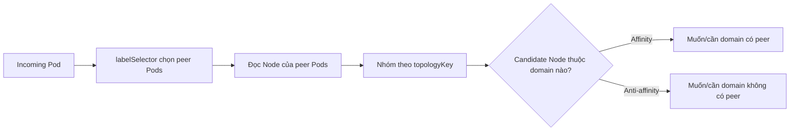

# Pod Affinity và Anti-affinity

## Mục lục

- [Tổng quan](#tổng-quan)
- [1. Cách scheduler hiểu Pod affinity](#1-cách-scheduler-hiểu-pod-affinity)
- [2. Cấu trúc một rule](#2-cấu-trúc-một-rule)
- [3. Pod Affinity](#3-pod-affinity)
- [4. Pod Anti-affinity](#4-pod-anti-affinity)
- [5. Required và preferred](#5-required-và-preferred)
- [6. Namespace scope và label selector](#6-namespace-scope-và-label-selector)
- [7. So sánh với Topology Spread Constraints](#7-so-sánh-với-topology-spread-constraints)
- [8. Thực hành](#8-thực-hành)
- [9. Troubleshooting và performance](#9-troubleshooting-và-performance)
- [10. Best practices](#10-best-practices)
- [Tài liệu tham khảo](#tài-liệu-tham-khảo)

---

## Tổng quan

Node Affinity so khớp Pod với **label của Node**. Pod Affinity và Anti-affinity so khớp Pod mới với **label của các Pod đã tồn tại**, sau đó dùng `topologyKey` trên Node để xác định “gần” hoặc “tách”.

- Pod Affinity: ưu tiên hoặc yêu cầu đặt gần Pod được chọn.
- Pod Anti-affinity: ưu tiên hoặc yêu cầu không đặt cùng topology domain với Pod được chọn.

Ví dụ, web Pod có thể muốn ở cùng zone với cache để giảm latency, trong khi ba replicas của API nên tránh cùng hostname để một Node lỗi không làm mất toàn bộ service.

## 1. Cách scheduler hiểu Pod affinity

Một rule được đánh giá theo ba lớp:

1. `labelSelector` chọn tập Pod liên quan.
2. Namespace scope giới hạn nơi tìm các Pod đó.
3. `topologyKey` đọc label trên Node chứa Pod liên quan để tạo topology domain.



Với `topologyKey: kubernetes.io/hostname`, domain là từng Node. Với `topology.kubernetes.io/zone`, domain là từng zone có label tương ứng.

> [!IMPORTANT]
> Rule dựa trên label, không dựa trên Service connection hoặc ownerReference. Selector quá rộng có thể liên kết các workload không chủ ý; selector quá hẹp có thể khiến rule không có tác dụng.

## 2. Cấu trúc một rule

Ví dụ required anti-affinity ở cấp Node:

```yaml
spec:
  affinity:
    podAntiAffinity:
      requiredDuringSchedulingIgnoredDuringExecution:
        - labelSelector:
            matchLabels:
              app.kubernetes.io/name: checkout
          topologyKey: kubernetes.io/hostname
```

Ý nghĩa: Pod mới không được đặt vào Node đã có Pod `app.kubernetes.io/name=checkout` trong namespace được xét.

Các thành phần quan trọng:

| Field | Vai trò |
|---|---|
| `labelSelector` | Chọn peer Pods cần xem xét |
| `namespaces` | Danh sách namespace tường minh; bỏ trống thường xét namespace của incoming Pod |
| `namespaceSelector` | Chọn namespace theo label |
| `topologyKey` | Node label xác định domain như hostname hoặc zone |
| `required...` | Hard filter |
| `preferred...weight` | Soft score, weight từ 1 đến 100 |

Node candidate cần có `topologyKey` phù hợp để scheduler đánh giá rule. Taxonomy topology không đầy đủ giữa các Node thường gây placement khó đoán hoặc tập feasible nhỏ.

## 3. Pod Affinity

### 3.1 Co-locate service với dependency

Ví dụ worker yêu cầu cùng zone với ít nhất một cache Pod:

```yaml
apiVersion: apps/v1
kind: Deployment
metadata:
  name: worker
spec:
  replicas: 2
  selector:
    matchLabels:
      app.kubernetes.io/name: worker
  template:
    metadata:
      labels:
        app.kubernetes.io/name: worker
    spec:
      affinity:
        podAffinity:
          requiredDuringSchedulingIgnoredDuringExecution:
            - labelSelector:
                matchLabels:
                  app.kubernetes.io/name: cache
              topologyKey: topology.kubernetes.io/zone
      containers:
        - name: worker
          image: nginx:1.27-alpine
```

Nếu cache chỉ tồn tại trong `zone-a`, worker chỉ có thể vào Node ở `zone-a`. Khi zone đó hết capacity, worker sẽ `Pending` dù zone khác còn trống.

### 3.2 Khi affinity nên là preference

Latency optimization thường phù hợp với preferred affinity:

```yaml
podAffinity:
  preferredDuringSchedulingIgnoredDuringExecution:
    - weight: 80
      podAffinityTerm:
        labelSelector:
          matchLabels:
            app.kubernetes.io/name: cache
        topologyKey: topology.kubernetes.io/zone
```

Workload vẫn chạy khi cache zone không khả dụng, đổi lại network latency/cost có thể tăng. Chọn hard hay soft dựa trên correctness, không chỉ mục tiêu tối ưu.

## 4. Pod Anti-affinity

### 4.1 Tách replicas theo Node

Deployment sau cố gắng không đặt hai replicas cùng Node:

```yaml
apiVersion: apps/v1
kind: Deployment
metadata:
  name: checkout
spec:
  replicas: 3
  selector:
    matchLabels:
      app.kubernetes.io/name: checkout
  template:
    metadata:
      labels:
        app.kubernetes.io/name: checkout
    spec:
      affinity:
        podAntiAffinity:
          preferredDuringSchedulingIgnoredDuringExecution:
            - weight: 100
              podAffinityTerm:
                labelSelector:
                  matchLabels:
                    app.kubernetes.io/name: checkout
                topologyKey: kubernetes.io/hostname
      containers:
        - name: app
          image: nginx:1.27-alpine
          resources:
            requests:
              cpu: 50m
              memory: 32Mi
```

Dùng preferred rule giúp Deployment vẫn đủ replicas khi số Node ít hơn số replicas. Nếu đổi thành required, tối đa một matching Pod trên mỗi eligible Node; replica vượt số Node sẽ `Pending`.

### 4.2 Tách theo zone

Required zone anti-affinity thường quá chặt: với ba replicas và hai zone, replica thứ ba không thể schedule. Nếu mục tiêu là phân bố càng đều càng tốt đồng thời cho phép nhiều hơn một replica mỗi zone, [Topology Spread Constraints](/scheduling/topology-spread/) biểu diễn mục tiêu tốt hơn.

## 5. Required và preferred

| Câu hỏi | Required | Preferred |
|---|---|---|
| Node vi phạm rule có bị loại không? | Có | Không |
| Khi topology thiếu capacity | Pod `Pending` | Pod có thể đặt ở domain kém ưu tiên |
| Phù hợp với | Correctness/isolation cứng | Availability, latency, giảm blast radius có điều kiện |
| Rủi ro | Deadlock placement, rollout kẹt | Distribution không đạt tuyệt đối |

`IgnoredDuringExecution` tiếp tục có nghĩa thay đổi label hoặc peer Pods sau binding không tự evict incoming Pod. Scheduler kiểm tra rule khi đặt Pod mới, không liên tục tái cân bằng Pod đã chạy.

Một điểm bootstrap quan trọng: required Pod Affinity có xử lý đặc biệt để nhóm Pod tự-affinity có thể khởi tạo Pod đầu tiên khi chưa có peer phù hợp, với điều kiện selector/namespace của chính Pod phù hợp và Node thỏa topology. Dù vậy, thiết kế self-affinity cứng vẫn cần test rollout, scale-from-zero và recovery.

## 6. Namespace scope và label selector

### 6.1 Namespace mặc định

Nếu không chỉ định `namespaces` và `namespaceSelector`, rule xét Pod trong namespace của incoming Pod. Điều này thường là lựa chọn an toàn nhất cho workload application.

### 6.2 Chọn namespace tường minh

```yaml
namespaces:
  - shared-services
```

Cấu hình này hữu ích khi application muốn ở gần dependency dùng chung, nhưng tạo coupling với namespace name.

### 6.3 Chọn namespace bằng label

```yaml
namespaceSelector:
  matchLabels:
    platform.example.com/affinity-scope: shared
```

Label Namespace trở thành một phần của placement control plane. Cần quản lý quyền sửa label đó và theo dõi drift.

### 6.4 Selector theo rollout

Deployment tự thêm `pod-template-hash`. Trên Kubernetes version hỗ trợ, `matchLabelKeys` có thể lấy value của key từ incoming Pod và kết hợp vào selector, giúp affinity chỉ xét Pod cùng rollout. Feature lifecycle của `matchLabelKeys`/`mismatchLabelKeys` thay đổi theo release; kiểm tra API reference đúng minor version trước khi dùng và tránh sửa trực tiếp label key đang được merge vào selector của Pod đã tạo.

## 7. So sánh với Topology Spread Constraints

| Mục tiêu | Primitive phù hợp |
|---|---|
| Pod A cần gần Pod B | Pod Affinity |
| Pod A không được cùng Node với Pod B | Required Pod Anti-affinity |
| Replicas của cùng app nên phân bố đều qua zone/Node | Topology Spread Constraints |
| Pod chỉ chạy trên loại Node nhất định | Node Affinity |
| Dedicated Node đẩy workload khác ra | Taint + toleration |

Anti-affinity hỏi “domain này có matching Pod hay không”. Topology spread đo số matching Pod giữa các domain và giới hạn độ lệch. Vì vậy spread thường linh hoạt hơn cho replica distribution.

## 8. Thực hành

Lab cần cluster có ít nhất hai schedulable Nodes để quan sát distribution rõ. Trên cluster một Node, Deployment vẫn chạy nhưng preferred anti-affinity không thể tách replicas.

```bash
kubectl create namespace pod-affinity-lab
```

Áp dụng Deployment ba replicas với preferred anti-affinity:

```bash
cat <<'EOF' > /tmp/anti-affinity.yaml
apiVersion: apps/v1
kind: Deployment
metadata:
  name: web
  namespace: pod-affinity-lab
spec:
  replicas: 3
  selector:
    matchLabels:
      app: web-lab
  template:
    metadata:
      labels:
        app: web-lab
    spec:
      affinity:
        podAntiAffinity:
          preferredDuringSchedulingIgnoredDuringExecution:
            - weight: 100
              podAffinityTerm:
                labelSelector:
                  matchLabels:
                    app: web-lab
                topologyKey: kubernetes.io/hostname
      containers:
        - name: web
          image: nginx:1.27-alpine
          resources:
            requests:
              cpu: 10m
              memory: 16Mi
EOF
kubectl apply -f /tmp/anti-affinity.yaml
kubectl get pods -n pod-affinity-lab -o wide --watch
```

Khi các Pod đã có Node, dừng watch và đếm theo Node:

```bash
kubectl get pods -n pod-affinity-lab \
  -l app=web-lab \
  -o custom-columns=NAME:.metadata.name,NODE:.spec.nodeName
```

Nếu đủ Node và các hard constraint khác không can thiệp, scheduler cố tách Pod. Đây không phải guarantee vì rule là preferred.

Thử đổi `preferredDuringSchedulingIgnoredDuringExecution` thành `requiredDuringSchedulingIgnoredDuringExecution` cần thay cả cấu trúc YAML: required chứa trực tiếp danh sách term, không có `weight` và `podAffinityTerm`. Scale replicas lớn hơn số Node để quan sát Pod `Pending`, rồi đọc `FailedScheduling` Event.

Cleanup:

```bash
kubectl delete namespace pod-affinity-lab
rm -f /tmp/anti-affinity.yaml
```

## 9. Troubleshooting và performance

### Rule dường như không chọn đúng peer

```bash
kubectl get pods -A --show-labels
kubectl get namespaces --show-labels
kubectl get nodes -L kubernetes.io/hostname,topology.kubernetes.io/zone
kubectl describe pod POD -n NAMESPACE
```

Kiểm tra selector, namespace scope, topology label và Node chứa peer Pod. Đừng chỉ nhìn Service selector; affinity có selector riêng.

### Pod Pending vì anti-affinity

Đếm số eligible domains và matching Pods. Required anti-affinity theo hostname cần ít nhất số Node phù hợp tương ứng với số replicas nếu mỗi Node chỉ được chứa một matching Pod. Preemption thường không giúp nếu Pod chặn nhau bởi hard anti-affinity cùng priority.

### Scheduler latency tăng

Inter-pod affinity/anti-affinity cần so sánh Pod và topology, có chi phí đáng kể trong cluster lớn. Giảm selector scope, tránh rule cross-namespace quá rộng, ưu tiên topology spread cho distribution thông thường và theo dõi scheduler plugin latency.

## 10. Best practices

- Dùng label theo identity ổn định như `app.kubernetes.io/name`, thêm scope component/instance khi cần.
- Ưu tiên preferred anti-affinity hoặc topology spread cho high availability; chỉ dùng required khi chấp nhận replica Pending.
- Dùng zone affinity cứng chỉ khi dependency/correctness thật sự yêu cầu.
- Bảo đảm mọi eligible Node có topology label nhất quán.
- Test scale-up, rolling update, node drain và mất một zone.
- Giới hạn namespace scope để giảm coupling và chi phí scheduler.
- Không kỳ vọng scheduler tự rebalance Pod cũ sau khi topology thay đổi.

## Tài liệu tham khảo

- [Assigning Pods to Nodes: Inter-pod affinity and anti-affinity](https://kubernetes.io/docs/concepts/scheduling-eviction/assign-pod-node/#inter-pod-affinity-and-anti-affinity)
- [nodeSelector và Node Affinity](/scheduling/node-selector/)
- [Topology Spread Constraints](/scheduling/topology-spread/)
