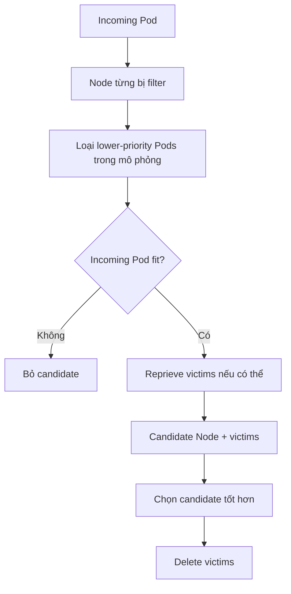

# Pod Preemption

## Mục lục

- [Tổng quan](#tổng-quan)
- [1. Khi nào preemption được cân nhắc](#1-khi-nào-preemption-được-cân-nhắc)
- [2. Luồng chọn candidate và victims](#2-luồng-chọn-candidate-và-victims)
- [3. nominatedNodeName không phải binding](#3-nominatednodename-không-phải-binding)
- [4. PodDisruptionBudget và graceful termination](#4-poddisruptionbudget-và-graceful-termination)
- [5. Giới hạn của preemption](#5-giới-hạn-của-preemption)
- [6. Non-preempting priority](#6-non-preempting-priority)
- [7. Thiết kế workload chịu preemption](#7-thiết-kế-workload-chịu-preemption)
- [8. Quan sát và troubleshooting](#8-quan-sát-và-troubleshooting)
- [9. Bài thực hành an toàn](#9-bài-thực-hành-an-toàn)
- [10. Best practices](#10-best-practices)
- [Tài liệu tham khảo](#tài-liệu-tham-khảo)

---

## Tổng quan

Preemption là cơ chế scheduler tạo cơ hội cho Pod priority cao bằng cách loại một hoặc nhiều Pod priority thấp hơn khỏi Node candidate. Nó chỉ được cân nhắc khi Pod không schedule được theo cách thông thường và việc loại victims có thể làm một Node trở nên phù hợp.

```text
Pod priority cao Pending
        │ không có feasible Node
        ▼
PostFilter / DefaultPreemption
        │ mô phỏng loại Pod priority thấp
        ▼
Chọn Node + victim set
        │ delete victims
        ▼
Chờ resource được giải phóng
        │
        ▼
Pod cao thử schedule lại
```

Preemption là phản ứng khi capacity đang tranh chấp, không phải cơ chế autoscaling, live migration hay guarantee rằng Pod cao sẽ chạy ngay.

## 1. Khi nào preemption được cân nhắc

Điều kiện cơ bản:

- Incoming Pod có `preemptionPolicy` cho phép preempt.
- Scheduling attempt thông thường không tìm được Node.
- Có Node mà nếu loại đủ Pod priority thấp hơn thì incoming Pod thỏa mọi filter.

Scheduler không preempt Pod cùng hoặc cao priority để nhường chỗ. Nó cũng không bỏ qua taint, Node Affinity, topology, Volume hoặc resource không thể thu hồi.

Ví dụ incoming Pod request GPU nhưng không Node nào advertise GPU. Xóa CPU-only Pods không tạo GPU; preemption không hữu ích. Tương tự, nếu Pod yêu cầu `zone=a` nhưng cluster chỉ có `zone=b`, không có victim set nào sửa topology.

## 2. Luồng chọn candidate và victims

Default preemption ở `PostFilter` có mental model sau:

1. Xem xét Node đã thất bại filter.
2. Tạm loại các Pod priority thấp hơn trong mô phỏng.
3. Kiểm tra incoming Pod có fit không.
4. Thêm lại Pod thấp hơn theo hướng giảm disruption nếu vẫn giữ incoming Pod fit.
5. So sánh candidate Nodes và chọn victim set phù hợp.
6. Gửi delete cho victims; incoming Pod quay lại scheduling flow.

Mục tiêu không đơn giản là “xóa Pod thấp nhất”. Scheduler cân nhắc tập victims, priority, PDB impact và các tiêu chí chọn candidate. Behavior chi tiết có thể đổi theo implementation/version; không xây SLO dựa vào thứ tự victim nội bộ không được API cam kết.



## 3. nominatedNodeName không phải binding

Scheduler có thể đặt `status.nominatedNodeName` trên preemptor để biểu thị Node dự kiến sau preemption.

```bash
kubectl get pod POD -n NAMESPACE \
  -o jsonpath='{.status.nominatedNodeName}{"\n"}'
```

Đây chỉ là nomination:

- Victims có thể chưa kết thúc.
- Một Pod priority cao hơn khác có thể chiếm Node.
- Cluster state hoặc constraint có thể đổi.
- Scheduler có thể clear hoặc đổi nomination.
- Incoming Pod vẫn chưa có `spec.nodeName`.

Chỉ `spec.nodeName` cho biết binding đã xảy ra. Monitoring không nên coi `nominatedNodeName` là workload đã được cấp capacity.

## 4. PodDisruptionBudget và graceful termination

### 4.1 PDB là best effort trong preemption

Scheduler cố chọn victims sao cho ít vi phạm [PodDisruptionBudget](/cau-hinh/pod-disruption-budget/) hơn. Tuy nhiên, nếu không có candidate đáp ứng PDB, preemption vẫn có thể chọn victims làm vi phạm budget để schedule Pod priority cao.

Vì vậy PDB không phải hàng rào tuyệt đối chống scheduler preemption. Priority taxonomy và capacity mới quyết định workload nào có thể gây disruption cho workload nào.

### 4.2 Termination grace period tạo khoảng chờ

Sau khi victims nhận delete, kubelet thực hiện Pod termination. `terminationGracePeriodSeconds`, `preStop`, Volume detach và application shutdown có thể kéo dài thời gian trước khi resource được giải phóng.

Trong khoảng đó:

- Preemptor vẫn có thể `Pending`.
- `nominatedNodeName` có thể đã xuất hiện.
- Service capacity của victim giảm.
- Một scheduling race khác có thể xảy ra.

Không đặt grace period bằng 0 chỉ để preemption nhanh nếu application cần flush state hoặc deregister. Tối ưu shutdown path và capacity reserve thay vì đánh đổi data integrity.

## 5. Giới hạn của preemption

### 5.1 Không giải được hard constraint

Preemption chỉ giải phóng resource/slot do Pod thấp hơn chiếm. Nó không sửa label, taint, topology, PVC binding, host port conflict không liên quan hoặc thiếu thiết bị.

### 5.2 Cross-node anti-affinity

Nếu incoming Pod bị chặn bởi Pod trên Node khác do anti-affinity, việc preempt trên candidate Node có thể chưa đủ. Built-in scheduler không thực hiện cross-node preemption tổng quát vì chi phí tìm kiếm lớn. Tránh thiết kế phụ thuộc vào việc scheduler phải xóa Pod ở nhiều Node để mở một placement.

### 5.3 Inter-pod affinity có thể tạo nghịch lý

Incoming Pod có affinity với lower-priority Pod trên candidate Node. Nếu Pod đó phải bị xóa để đủ resource, affinity không còn thỏa. Scheduler không thể dùng victim đó vừa làm peer vừa giải phóng resource.

### 5.4 Không bảo đảm victim không quay lại

Nếu victim do Deployment/StatefulSet/Job quản lý, controller tạo replacement. Replacement có thể schedule nơi khác, nằm Pending hoặc tiếp tục cạnh tranh resource. Preemption không thay đổi desired replicas.

### 5.5 Không thay thế capacity

Preemption liên tục là dấu hiệu taxonomy priority, requests, autoscaling hoặc capacity reserve chưa phù hợp. Nó chuyển disruption sang workload khác chứ không làm cluster có thêm tài nguyên.

## 6. Non-preempting priority

PriorityClass với `preemptionPolicy: Never` vẫn đưa Pod lên trước trong queue nhưng không tạo victims:

```yaml
apiVersion: scheduling.k8s.io/v1
kind: PriorityClass
metadata:
  name: urgent-no-preempt
value: 50000
preemptionPolicy: Never
globalDefault: false
description: "Ưu tiên khi capacity trống, không gián đoạn workload đang chạy"
```

Dùng cho batch có deadline nhưng checkpoint đắt, hoặc dịch vụ muốn startup trước workload thông thường sau khi capacity xuất hiện. Pod non-preempting vẫn có thể bị Pod priority cao hơn preempt.

## 7. Thiết kế workload chịu preemption

### 7.1 Victim workload

Workload priority thấp nên:

- Có checkpoint/resume nếu xử lý dài.
- Xử lý `SIGTERM` và hoàn tất shutdown trong grace period có cơ sở.
- Không giữ singleton state chỉ trong local ephemeral storage.
- Có idempotency khi retry.
- Có requests phản ánh nhu cầu thực để scheduler tính capacity đúng.
- Có controller phù hợp và backoff tránh restart storm.

### 7.2 Preemptor workload

Workload priority cao vẫn cần:

- Nhiều replicas và topology distribution nếu cần HA.
- Readiness/startup probes.
- Requests đủ chính xác để chọn victim set hợp lý.
- Capacity planning cho peak và Node loss.
- Alert nếu startup vẫn trễ sau nomination.

### 7.3 Platform policy

Lập matrix “class nào được phép preempt class nào” theo thứ tự số, rồi kiểm tra với overload scenario. Nếu một tenant có thể tự chọn class cao, matrix không còn ý nghĩa.

## 8. Quan sát và troubleshooting

### 8.1 Thu thập timeline

```bash
kubectl get pod PREEMPTOR -n NAMESPACE -o yaml
kubectl describe pod PREEMPTOR -n NAMESPACE
kubectl get events -A --sort-by=.lastTimestamp
```

Ghi lại:

- Pod UID, priority class và numeric priority.
- `PodScheduled` condition.
- `nominatedNodeName` và `nodeName`.
- `FailedScheduling`/preemption Event.
- Victim deletion timestamp, grace period và owner.
- Node requested/allocatable trước và sau.

### 8.2 `preemption is not helpful`

Thông điệp này thường nghĩa không Node nào trở nên feasible dù bỏ lower-priority Pods. Kiểm tra affinity, taints, topology, Volume và resource type, không tăng priority mù quáng.

### 8.3 Victims biến mất nhưng preemptor vẫn Pending

Khả năng gồm:

- Victims còn `Terminating` và resource chưa được giải phóng.
- Pod khác chiếm capacity.
- Node state đổi.
- Volume/affinity constraint mới thất bại.
- Incoming Pod bị backoff và chờ retry.

So sánh `nominatedNodeName`, Node requested resources và Event mới nhất.

### 8.4 PDB bị vi phạm

Xác minh victims thuộc PDB nào và có candidate khác hay không. PDB violation trong preemption có thể là behavior dự kiến khi không còn lựa chọn. Sửa gốc bằng priority policy, capacity, topology hoặc class admission; tăng PDB không tạo hard guarantee.

## 9. Bài thực hành an toàn

Không nên ép preemption trên cluster dùng chung vì lab chủ động xóa Pod thấp hơn. Thực hành an toàn là phân tích khả năng preemption bằng hai PriorityClass non-production trong Namespace riêng.

```bash
cat <<'EOF' > /tmp/preemption-classes.yaml
apiVersion: scheduling.k8s.io/v1
kind: PriorityClass
metadata:
  name: preemption-lab-low
value: -1000
globalDefault: false
preemptionPolicy: PreemptLowerPriority
description: "Disposable lab workload"
---
apiVersion: scheduling.k8s.io/v1
kind: PriorityClass
metadata:
  name: preemption-lab-high-safe
value: 1000
globalDefault: false
preemptionPolicy: Never
description: "Queue priority without victims"
EOF
kubectl apply -f /tmp/preemption-classes.yaml
kubectl get priorityclass preemption-lab-low preemption-lab-high-safe -o yaml
```

Quan sát rằng class cao có `preemptionPolicy: Never`; dù numeric priority lớn hơn, nó không chủ động preempt class thấp. Nếu cần thử preemption thực, dùng disposable local cluster, xác định allocatable/request để tạo resource contention, và quan sát Event cùng `nominatedNodeName` thay vì chạy trên production.

Cleanup:

```bash
kubectl delete priorityclass preemption-lab-low preemption-lab-high-safe
rm -f /tmp/preemption-classes.yaml
```

## 10. Best practices

- Coi preemption là last-resort policy, không phải autoscaling strategy.
- Dùng non-preempting class khi chỉ cần queue priority.
- Bảo vệ class cao bằng admission/RBAC/quota.
- Thiết kế lower-priority workload có checkpoint, idempotency và termination path.
- Theo dõi preemption rate, victim restarts, nomination wait và PDB violations.
- Giữ resource requests chính xác; request sai làm victim selection và capacity plan sai.
- Load-test trong tình huống mất Node/zone và overload.
- Điều tra hard constraints khi Event nói preemption không hữu ích.

## Tài liệu tham khảo

- [Pod Priority and Preemption](https://kubernetes.io/docs/concepts/scheduling-eviction/pod-priority-preemption/)
- [PriorityClass](/scheduling/priority-classes/)
- [PodDisruptionBudget](/cau-hinh/pod-disruption-budget/)
