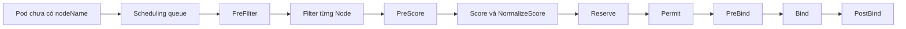
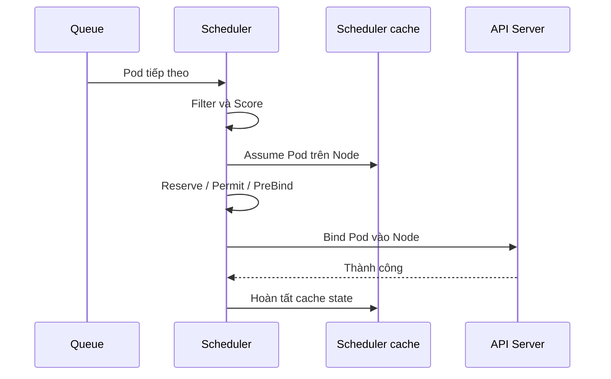

# Scheduling Framework

## Mục lục

- [Tổng quan](#tổng-quan)
- [1. Từ Pod chưa có Node đến một binding](#1-từ-pod-chưa-có-node-đến-một-binding)
- [2. Scheduling cycle và binding cycle](#2-scheduling-cycle-và-binding-cycle)
- [3. Extension points](#3-extension-points)
- [4. Plugin mặc định phối hợp ra sao](#4-plugin-mặc-định-phối-hợp-ra-sao)
- [5. Queue, retry và tính nhất quán](#5-queue-retry-và-tính-nhất-quán)
- [6. Scheduler profiles](#6-scheduler-profiles)
- [7. Khi nào cần custom scheduler](#7-khi-nào-cần-custom-scheduler)
- [8. Quan sát và troubleshooting](#8-quan-sát-và-troubleshooting)
- [9. Thực hành đọc một scheduling decision](#9-thực-hành-đọc-một-scheduling-decision)
- [10. Checklist vận hành](#10-checklist-vận-hành)
- [Tài liệu tham khảo](#tài-liệu-tham-khảo)

---

## Tổng quan

Scheduling Framework là kiến trúc plugin bên trong `kube-scheduler`. Framework tách quy trình chọn Node thành các **extension point** ổn định để những behavior như kiểm tra resource, affinity, taint, topology spread và volume binding có thể được triển khai thành plugin thay vì nằm trong một khối logic duy nhất.

Trang này đi sâu vào cơ chế framework. Nếu cần ôn lại vai trò tổng thể của scheduler, scheduling queue và khác biệt giữa Pod chưa được schedule với Pod đã gán Node nhưng chưa chạy, xem [kube-scheduler](/kien-truc/kube-scheduler/).



Framework không phải một API để gắn script động vào scheduler đang chạy. Plugin được compile vào scheduler binary; configuration quyết định plugin nào được bật, tắt và cấu hình cho từng profile.

## 1. Từ Pod chưa có Node đến một binding

Scheduler theo dõi Pod có `spec.schedulerName` thuộc profile mà nó phục vụ và chưa có `spec.nodeName`. Với mỗi scheduling attempt, scheduler thực hiện bốn việc chính:

1. Lấy Pod tiếp theo từ scheduling queue.
2. Lọc Node không thỏa hard constraints.
3. Chấm điểm các Node khả thi và chọn một Node.
4. Reserve state cần thiết rồi ghi binding qua API Server.

Binding thành công làm `spec.nodeName` có giá trị. Sau đó kubelet trên Node mới chịu trách nhiệm pull image, mount Volume, thiết lập network và start Container.

> [!IMPORTANT]
> Scheduling thành công không có nghĩa Pod đã `Running` hoặc `Ready`. Nếu `spec.nodeName` đã có giá trị, hãy chuyển việc điều tra sang kubelet, container runtime, CNI, CSI và application thay vì tiếp tục sửa scheduler policy.

## 2. Scheduling cycle và binding cycle

Mỗi scheduling attempt gồm hai phase.

### 2.1 Scheduling cycle

Scheduling cycle chọn một Node cho Pod. Các scheduling cycle chạy tuần tự trong scheduler core để việc cập nhật cache và giả định resource dễ kiểm soát hơn. Phase này gồm queue sort, pre-filter, filter, post-filter, pre-score và score.

Nếu không có Node khả thi, scheduler không đi vào binding cycle. `PostFilter` có thể thử cơ chế phục hồi, tiêu biểu là preemption, rồi Pod quay lại queue để thử lại.

### 2.2 Binding cycle

Binding cycle áp dụng quyết định đã chọn. Nhiều binding cycle có thể chạy đồng thời. Phase này gồm reserve, permit, pre-bind, bind và post-bind.

Scheduler dùng cơ chế **assume**: cập nhật cache nội bộ như thể Pod đã được bind trước khi API write hoàn tất. Cách này tăng throughput nhưng yêu cầu rollback qua `Unreserve` nếu các bước sau thất bại.



## 3. Extension points

Bảng sau tập trung vào vai trò, không liệt kê mọi method nội bộ của plugin API.

| Extension point | Mục đích | Khi thất bại |
|---|---|---|
| `QueueSort` | Xác định thứ tự Pod trong active queue | Profile chỉ có một QueueSort plugin và các profile trong cùng scheduler phải tương thích |
| `PreEnqueue` | Kiểm tra Pod có sẵn sàng vào active queue không | Pod có thể giữ ở trạng thái unschedulable tới khi có event phù hợp |
| `PreFilter` | Tính state dùng chung trước khi duyệt Node hoặc phát hiện Pod không thể schedule | Dừng scheduling cycle |
| `Filter` | Kiểm tra một Node có thỏa hard constraints không | Node đó bị loại |
| `PostFilter` | Chạy sau khi không còn Node khả thi, ví dụ tìm preemption candidates | Pod vẫn unschedulable nếu không phục hồi được |
| `PreScore` | Chuẩn bị state trước khi chấm điểm | Dừng cycle nếu có lỗi |
| `Score` | Trả điểm cho từng Node khả thi | Điểm được tổng hợp sau normalize và weight |
| `NormalizeScore` | Chuẩn hóa điểm của một plugin trên toàn bộ Node | Ảnh hưởng thứ hạng cuối |
| `Reserve` | Giữ state/resource tạm thời trước binding | Các plugin Reserve đã chạy được gọi `Unreserve` theo thứ tự ngược |
| `Permit` | Approve, reject hoặc chờ trong thời gian giới hạn | Reject/timeout làm binding thất bại và rollback |
| `PreBind` | Thực hiện điều kiện ngay trước binding | Không ghi binding nếu lỗi |
| `Bind` | Ghi binding; plugin có thể chọn xử lý hoặc bỏ qua | Pod quay lại flow retry khi binding lỗi |
| `PostBind` | Thông báo hoặc cleanup sau binding | Chạy sau khi bind thành công |

Một plugin có thể triển khai nhiều extension point. Ví dụ một feature cần `PreFilter` để tính state, `Filter` để loại Node và `Score` để ưu tiên Node trong số còn lại.

## 4. Plugin mặc định phối hợp ra sao

Tên plugin và tập mặc định có thể thay đổi giữa các Kubernetes release, nhưng mental model ổn định:

- `NodeResourcesFit` kiểm tra resource requests so với Node allocatable và có thể chấm điểm theo chiến lược resource.
- `NodeAffinity` xử lý `nodeSelector` và node affinity.
- `TaintToleration` loại Node có taint không được tolerate và có thể chấm điểm `PreferNoSchedule`.
- `InterPodAffinity` xử lý Pod affinity/anti-affinity.
- `PodTopologySpread` kiểm tra và chấm điểm topology spread constraints.
- `VolumeBinding` phối hợp PVC binding với topology của Node.
- `DefaultPreemption` chạy ở `PostFilter` khi Pod priority cao có thể cần preempt Pod thấp hơn.

Hard constraints được kết hợp theo logic giao nhau. Một Node có đủ CPU vẫn bị loại nếu sai zone; Node đúng zone vẫn bị loại nếu Pod không tolerate taint. Score chỉ chạy trên tập Node đã qua toàn bộ filter.

```text
100 Nodes
  ├─ 20 Node không đủ resource
  ├─ 30 Node sai node affinity
  ├─ 10 Node có taint không được tolerate
  └─ 40 feasible Nodes → Score → chọn 1 Node
```

Vì thế, tăng weight của một Score plugin không thể cứu Node đã bị Filter loại.

## 5. Queue, retry và tính nhất quán

Scheduler làm việc trên cache/snapshot trong một cluster thay đổi liên tục. Node, Pod, PVC và label có thể đổi giữa lúc đánh giá và lúc bind. Framework xử lý điều này bằng retry, reserve/unreserve, assume cache và các event giúp đưa Pod trở lại active queue.

Pod thường đi qua ba nhóm trạng thái queue:

- **Active:** sẵn sàng cho scheduling attempt.
- **Backoff:** chờ retry để một Pod lỗi lặp lại không chiếm scheduler.
- **Unschedulable:** chưa có thay đổi cluster nào làm constraint trở nên khả thi.

`FailedScheduling` Event là kết quả tổng hợp của attempt, không phải cam kết Node state vẫn y hệt ở thời điểm bạn đọc Event.

## 6. Scheduler profiles

Một process `kube-scheduler` có thể phục vụ nhiều profile. Mỗi profile có `schedulerName`, plugin set và `pluginConfig` riêng. Pod chọn profile qua `spec.schedulerName`.

Ví dụ cấu trúc configuration tối thiểu cho hai profile:

```yaml
apiVersion: kubescheduler.config.k8s.io/v1
kind: KubeSchedulerConfiguration
profiles:
  - schedulerName: default-scheduler
  - schedulerName: batch-scheduler
    plugins:
      score:
        disabled:
          - name: ImageLocality
```

Pod dùng profile thứ hai:

```yaml
apiVersion: v1
kind: Pod
metadata:
  name: batch-worker
spec:
  schedulerName: batch-scheduler
  containers:
    - name: worker
      image: registry.k8s.io/pause:3.10
```

> [!WARNING]
> Nếu không có scheduler nào phục vụ tên trong `spec.schedulerName`, Pod sẽ nằm `Pending` mà không được bind. Không triển khai profile mới bằng cách sửa trực tiếp control-plane production trước khi kiểm tra schema đúng với version, backup cấu hình và có rollback.

Các profile trong cùng scheduler dùng chung queue nhưng có thể khác behavior placement. Một số extension point có ràng buộc tương thích giữa profile; hãy kiểm tra tài liệu configuration của đúng Kubernetes minor version.

## 7. Khi nào cần custom scheduler

Ưu tiên built-in API trước:

- Dùng requests/limits cho capacity.
- Dùng node affinity, taints và topology spread cho placement.
- Dùng PriorityClass cho thứ tự và preemption policy.
- Dùng scheduler profile để điều chỉnh built-in plugins.

Cân nhắc custom plugin hoặc scheduler riêng khi placement cần domain logic mà các primitive trên không biểu diễn được, ví dụ co-scheduling chặt cho distributed batch, license pool đặc thù hoặc scoring dựa trên topology thiết bị chuyên biệt.

Chi phí vận hành gồm:

- Theo kịp scheduler/plugin API và Kubernetes upgrade.
- HA, leader election, metrics, alert và capacity của scheduler mới.
- Phân quyền RBAC mạnh cho component có thể bind Pod.
- Debug interaction giữa custom policy và built-in constraints.
- Failure mode khiến toàn bộ Pod dùng `schedulerName` đó không được schedule.

## 8. Quan sát và troubleshooting

### 8.1 Xác định Pod đã được bind chưa

```bash
kubectl get pod POD -n NAMESPACE \
  -o jsonpath='{.spec.schedulerName}{"\t"}{.spec.nodeName}{"\n"}'
```

`nodeName` rỗng cho thấy chưa có binding. Tiếp tục đọc condition và Event:

```bash
kubectl describe pod POD -n NAMESPACE
kubectl get events -n NAMESPACE \
  --field-selector involvedObject.kind=Pod,involvedObject.name=POD \
  --sort-by=.lastTimestamp
```

### 8.2 Phân loại `FailedScheduling`

| Signal | Layer cần kiểm tra |
|---|---|
| `Insufficient cpu` / `memory` | Requests, Node allocatable, quota/defaults, capacity |
| `didn't match Pod's node affinity/selector` | Label Node và hard node affinity |
| `untolerated taint` | Taint, toleration và mục tiêu isolation |
| `didn't match pod topology spread constraints` | Domain labels, selector, `maxSkew`, eligible domains |
| `unbound immediate PersistentVolumeClaims` | PVC, StorageClass, binding mode và CSI |
| `preemption is not helpful` | Constraint không thể giải bằng cách giải phóng resource |

### 8.3 Metrics và log

Tên metric có thể thay đổi theo release; nhóm tín hiệu quan trọng là scheduling attempts theo result, latency của scheduling/binding, pending Pods theo queue và plugin execution duration. Correlate scheduler log với Pod UID và timestamp thay vì chỉ tìm theo tên Pod có thể được tạo lại.

## 9. Thực hành đọc một scheduling decision

Lab dùng một Pod cố ý request lượng CPU rất lớn để tạo `FailedScheduling`. Dùng Namespace riêng:

```bash
kubectl create namespace scheduling-lab
kubectl run impossible \
  --namespace scheduling-lab \
  --image=registry.k8s.io/pause:3.10 \
  --restart=Never \
  --overrides='{"spec":{"containers":[{"name":"impossible","image":"registry.k8s.io/pause:3.10","resources":{"requests":{"cpu":"1000"}}}]}}'
```

Xem condition và Event:

```bash
kubectl get pod impossible -n scheduling-lab -o wide
kubectl describe pod impossible -n scheduling-lab
```

Expected state là `Pending`, `PodScheduled=False` và Event chỉ ra không đủ CPU. Output cụ thể phụ thuộc số Node và allocatable của cluster.

Giảm request để chứng minh cùng Pod template có thể qua Filter. Vì Pod field resource không nên sửa trực tiếp cho bài này, xóa và tạo lại:

```bash
kubectl delete pod impossible -n scheduling-lab
kubectl run possible \
  --namespace scheduling-lab \
  --image=registry.k8s.io/pause:3.10 \
  --restart=Never \
  --overrides='{"spec":{"containers":[{"name":"possible","image":"registry.k8s.io/pause:3.10","resources":{"requests":{"cpu":"10m","memory":"16Mi"}}}]}}'
kubectl get pod possible -n scheduling-lab -o wide --watch
```

Khi `NODE` có giá trị, scheduler đã hoàn thành binding. Dừng watch bằng `Ctrl+C`, rồi cleanup:

```bash
kubectl delete namespace scheduling-lab
```

## 10. Checklist vận hành

- Giữ ít hard constraints nhất vẫn đáp ứng isolation và availability.
- Luôn đặt resource requests có cơ sở; scheduler không dựa vào usage tức thời để filter.
- Theo dõi `FailedScheduling`, queue latency và plugin latency trước khi thay policy.
- Version-control `KubeSchedulerConfiguration`; review diff plugin enabled/disabled khi upgrade.
- Canary profile hoặc môi trường test trước khi đổi scoring production.
- Bảo đảm mọi `schedulerName` có scheduler HA phục vụ và có alert khi Pod chờ lâu.
- Không xem preemption là capacity plan.
- Ghi lại lý do cho custom weight/plugin và tiêu chí rollback.

## Tài liệu tham khảo

- [Scheduling Framework](https://kubernetes.io/docs/concepts/scheduling-eviction/scheduling-framework/)
- [Scheduler Configuration](https://kubernetes.io/docs/reference/scheduling/config/)
- [kube-scheduler](/kien-truc/kube-scheduler/)
- [Resource Requests và Limits](/cau-hinh/resource-requests-limits/)
